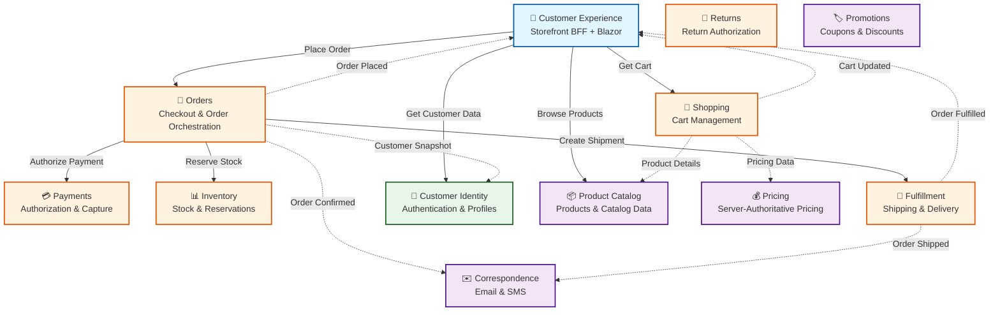

# CritterSupply

[](https://github.com/erikshafer/CritterSupply/actions/workflows/dotnet.yml)
[](https://dotnet.microsoft.com/download/dotnet/10.0)
[](https://www.postgresql.org/)
[](https://www.rabbitmq.com/)

## 🤔 What Is This Repository? <a id='1.0'></a>

This repository demonstrates how to build robust, production-grade, event-driven systems using a realistic e-commerce domain.

It also serves as a reference architecture for idiomatically leveraging the "Critter Stack"—[Wolverine](https://github.com/JasperFx/wolverine) and [Marten](https://github.com/JasperFx/marten)—to supercharge your .NET development. These tools just get out of your way so you can focus on the actual business problems at hand.

**Best suited for:** .NET developers learning event sourcing and CQRS, architects evaluating the Critter Stack for production use, teams transitioning from monolithic to event-driven architectures, and engineers exploring cross-BC integration patterns in a realistic multi-BC system.

### 🛒 Ecommerce <a id='1.1'></a>

CritterSupply is a fictional pet supply retailer—the name a playful nod to the Critter Stack powering it, with the tagline "Stocked for every season."

E-commerce was chosen as the domain partly from the maintainer's industry experience, but more importantly because it's a domain most developers intuitively understand. Everyone has placed an order online. That familiarity lets us focus on *how* the system is built rather than getting bogged down explaining *what* it does.

### 🏢 Vendor & Operations <a id='1.1.1'></a>

CritterSupply also models the vendor and operational sides of a retail platform. Vendor Identity and the Vendor Portal serve the businesses that supply products—providing authentication, tenant isolation, analytics, and change request workflows. Backoffice Identity grounds staff authentication for internal operations, and the Backoffice BFF provides CritterSupply's own team with customer service, order management, return processing, inventory management, and product administration through a Blazor WASM frontend with role-based access control.

### ️🔎️ Patterns in Practice <a id='1.2'></a>

E-commerce naturally demands the patterns this repository aims to demonstrate: event sourcing for capturing the full history of orders and inventory movements, stateful Sagas for coordinating multi-step processes like payment authorization and fulfillment, and reservation-based workflows where inventory is held pending confirmation rather than immediately decremented.

This isn't a reference architecture padded with unnecessary layers, abstractions, or onion architecture to appear "enterprise-ready." The patterns here are inspired by real production systems built with the Critter Stack—code that's actually running and handling real business problems, ranging from startups to large enterprises.

#### Short-List of Patterns, Paradigms, and Principles<a id='1.2.1'></a>

A non-exhaustive list of the patterns, paradigms, and principles demonstrated in this codebase, in no particular order:

- Event Sourcing (Orders, Payments, Inventory, Fulfillment, Product Catalog)
- Command Query Responsibility Segregation (CQRS)
- Stateful Sagas (Order orchestration)
- Inbox Pattern (guaranteed message processing)
- Outbox Pattern (reliable message publishing)
- Reservation-based Workflows (Inventory management)
- Choreography vs Orchestration (BC integration patterns)
- Snapshot Pattern (temporal consistency — e.g., address captured at order placement)
- Backend-for-Frontend (BFF) Pattern (Customer Experience — Blazor Server; Vendor Portal — Blazor WASM)
- Vertical Slice Architecture (VSA)
- Behavior-Driven Development (BDD) with Reqnroll (reference implementation in Product Catalog; applied across multiple BCs)
- Domain-Driven Design (DDD)
- Traditional DDD with EF Core (Customer Identity, Vendor Identity, Backoffice Identity)
- A-Frame Architecture (pure business logic)
- Railway-Oriented Programming (Wolverine middleware)
- Multi-issuer JWT Strategy (Customer, Vendor, and Backoffice identity contexts)
- UUID v5 for Natural-Key Stream IDs
- E2E Testing with Playwright
- Component Testing with bUnit

## 🤖 AI-assisted Development <a id='1.3'></a>

This project is built with Claude as a collaborative coding partner. Beyond just generating code, it's an exercise in teaching AI tools to think in event-driven patterns and leverage the Critter Stack idiomatically—helping to improve the guidance these tools can offer the broader community.

See [CLAUDE.md](./CLAUDE.md) for AI development guidelines and [docs/README.md](./docs/README.md) for comprehensive documentation structure.

**🤖 Custom Agents:** CritterSupply includes specialized GitHub Copilot agents (Principal Architect, Product Owner, DevOps Engineer, QA Engineer, UX Engineer, Application Security & Identity Engineer, Event Modeling Facilitator, Frontend Platform Engineer) to provide expert feedback on PRs and issues. See [docs/AI-ASSISTED-DEVELOPMENT.md](./docs/AI-ASSISTED-DEVELOPMENT.md) for details on how to use them.


## 🛠️ Technology Stack <a id='1.4'></a>

- **Core:** C# 14+ (.NET 10), [Wolverine](https://wolverine.netlify.app/), [Marten](https://martendb.io/), [EF Core](https://learn.microsoft.com/en-us/ef/core/)
- **Infrastructure:** PostgreSQL, RabbitMQ, Docker, [.NET Aspire](https://learn.microsoft.com/en-us/dotnet/aspire/)
- **Testing:** [Alba](https://jasperfx.github.io/alba/), [Testcontainers](https://dotnet.testcontainers.org/), xUnit, [Reqnroll](https://reqnroll.net/), [Playwright](https://playwright.dev/dotnet/) (E2E), [bUnit](https://bunit.dev/) (Blazor components)
- **UI:** [Blazor Server](https://learn.microsoft.com/en-us/aspnet/core/blazor/) + [Blazor WASM](https://learn.microsoft.com/en-us/aspnet/core/blazor/hosting-models#blazor-webassembly), [MudBlazor](https://mudblazor.com/), SignalR
- **Observability:** OpenTelemetry, Jaeger (distributed tracing)

See [CLAUDE.md](./CLAUDE.md) for complete technology details and development guidelines.

## 🗺️ Bounded Contexts <a id='2.0'></a>

CritterSupply is organized into bounded contexts. As described in Domain-Driven Design, bounded contexts help lower the cost of consensus. If one is unfamiliar with the concept, a crude yet simple way of picturing it is that each context could have its own team in an organization. That's not a rule by any means, but hopefully that helps you paint a picture of how CritterSupply is divided up logically and physically in this repo.

### Architecture Overview

#### Customer-Facing Flow


```mermaid
graph TB
    %% Customer-Facing Layer
    CE["🎁 Customer Experience<br/>Storefront BFF + Blazor"]

    %% Core Business Contexts
    Shopping["🛒 Shopping<br/>Cart Management"]
    Orders["📨 Orders<br/>Checkout & Order Orchestration"]
    Payments["💳 Payments<br/>Authorization & Capture"]
    Inventory["📊 Inventory<br/>Stock & Reservations"]
    Fulfillment["🚚 Fulfillment<br/>Shipping & Delivery"]
    Returns["🔄 Returns<br/>Return Authorization"]

    %% Supporting Contexts
    CustomerID["👤 Customer Identity<br/>Authentication & Profiles"]
    Catalog["📦 Product Catalog<br/>Products & Catalog Data"]
    Pricing["💰 Pricing<br/>Server-Authoritative Pricing"]
    Promotions["🏷️ Promotions<br/>Coupons & Discounts"]
    Correspondence["✉️ Correspondence<br/>Email & SMS"]

    %% Customer Experience interactions
    CE -->|Get Cart| Shopping
    CE -->|Place Order| Orders
    CE -->|Browse Products| Catalog
    CE -->|Get Customer Data| CustomerID

    %% Order Orchestration (Saga)
    Orders -->|Authorize Payment| Payments
    Orders -->|Reserve Stock| Inventory
    Orders -->|Create Shipment| Fulfillment

    %% Data enrichment
    Shopping -.->|Product Details| Catalog
    Shopping -.->|Pricing Data| Pricing
    Orders -.->|Customer Snapshot| CustomerID
    Orders -.->|Order Confirmed| Correspondence
    Fulfillment -.->|Order Shipped| Correspondence

    %% Real-time notifications
    Shopping -.->|Cart Updated| CE
    Orders -.->|Order Placed| CE
    Fulfillment -.->|Order Fulfilled| CE

    classDef bff fill:#e1f5ff,stroke:#01579b,stroke-width:2px
    classDef core fill:#fff3e0,stroke:#e65100,stroke-width:2px
    classDef support fill:#f3e5f5,stroke:#4a148c,stroke-width:2px
    classDef identity fill:#e8f5e9,stroke:#1b5e20,stroke-width:2px

    class CE bff
    class Shopping,Orders,Payments,Inventory,Fulfillment,Returns core
    class Catalog,Pricing,Promotions,Correspondence support
    class CustomerID identity
```

#### Vendor & Operations Flow


```mermaid
graph TB
    %% Vendor-Facing Layer
    VP["🏪 Vendor Portal<br/>Analytics & Change Requests"]

    %% Operations Layer
    BO["🖥️ Backoffice<br/>Internal Operations BFF"]

    %% Identity Contexts
    VendorID["🏢 Vendor Identity<br/>Auth & Tenant Management"]
    BackofficeID["🔐 Backoffice Identity<br/>Staff Authentication"]

    %% Shared Business Contexts
    Catalog["📦 Product Catalog<br/>Products & Catalog Data"]
    Inventory["📊 Inventory<br/>Stock & Reservations"]
    Orders["📨 Orders<br/>Checkout & Order Orchestration"]
    Pricing["💰 Pricing<br/>Server-Authoritative Pricing"]
    Promotions["🏷️ Promotions<br/>Coupons & Discounts"]

    %% Vendor Portal interactions
    VP -->|Authenticate| VendorID
    VP -->|Manage Products| Catalog
    VP -->|View Inventory| Inventory

    %% Backoffice interactions
    BO -->|Authenticate| BackofficeID
    BO -->|Manage Catalog| Catalog
    BO -->|Configure Pricing| Pricing
    BO -->|Configure Promotions| Promotions
    BO -->|Review Orders| Orders

    classDef vendor fill:#fff8e1,stroke:#f57f17,stroke-width:2px
    classDef identity fill:#e8f5e9,stroke:#1b5e20,stroke-width:2px
    classDef core fill:#fff3e0,stroke:#e65100,stroke-width:2px
    classDef planned fill:#f5f5f5,stroke:#9e9e9e,stroke-width:2px,stroke-dasharray: 5 5
    classDef ops fill:#e3f2fd,stroke:#0d47a1,stroke-width:2px

    class VP vendor
    class VendorID,BackofficeID identity
    class Catalog,Inventory,Orders,Pricing,Promotions core
    class BO ops
```

**Legend:**
- **Solid arrows (→)**: Synchronous HTTP calls (composition, orchestration)
- **Dotted arrows (⋯→)**: Asynchronous integration messages (RabbitMQ)
- **Blue**: Customer-facing layer (BFF)
- **Orange**: Core business contexts (event-sourced)
- **Purple**: Supporting contexts
- **Green**: Identity contexts
- **Light Blue**: Operations layer (Backoffice)
- **Dashed border**: Planned (not yet implemented)

### Bounded Context Status

Below is a table of each contexts' focused responsibilities, along with their current implementation status.

| Context                     | Responsibility                                               | Status     |
|-----------------------------|--------------------------------------------------------------|------------|
| 📨 **Orders**               | Checkout intake and post-purchase order orchestration        | ✅ Complete |
| 💳 **Payments**             | Authorization, capture, refunds                              | ✅ Complete |
| 🛒 **Shopping**             | Cart management                                              | ✅ Complete |
| 📊 **Inventory**            | Stock levels and reservations                                | ✅ Complete |
| 🚚 **Fulfillment**          | Picking, packing, shipping                                   | ✅ Complete |
| 👤 **Customer Identity**    | Customer authentication, addresses, and profiles             | ✅ Complete |
| 📦 **Product Catalog**      | Product definitions and catalog data (event-sourced)         | ✅ Complete |
| 🎁 **Customer Experience**  | Storefront BFF (Blazor + SignalR)                            | ✅ Complete |
| 🏢 **Vendor Identity**      | Vendor user authentication & tenant management               | ✅ Complete |
| 🏪 **Vendor Portal**        | Vendor analytics, insights, change requests                  | ✅ Complete |
| 🔄 **Returns**              | Return authorization, exchanges (same-SKU and cross-product) | ✅ Complete |
| 💰 **Pricing**              | Server-authoritative pricing and scheduled price changes     | ✅ Complete |
| 🏷️ **Promotions**          | Coupon codes and discount rules                              | ✅ Complete |
| ✉️ **Correspondence**       | Customer email and SMS notifications                         | ✅ Complete |
| 🔐 **Backoffice Identity**  | Staff and admin authentication                               | ✅ Complete |
| 🖥️ **Backoffice**          | Internal operations portal (BFF + Blazor WASM)               | ✅ Complete |
| 🔍 **Search**               | Product search and discovery                                 | 🔜 Planned |
| 💡 **Recommendations**      | Personalized product recommendations                         | 🔜 Planned |
| 🏦 **Store Credit**         | Store credit and refund balance management                   | 🔜 Planned |
| 📈 **Analytics**            | Business intelligence projections                            | 🔜 Planned |
| 🔧 **Operations Dashboard** | Engineering/SRE observability tooling                        | 🔜 Planned |

For detailed responsibilities, interactions, and event flows between contexts, see [CONTEXTS.md](./CONTEXTS.md).

## ⏩ How to Run <a id='5.0'></a>

### Requirements <a id='5.2'></a>

- [.NET 10](https://dotnet.microsoft.com/en-us/download/dotnet/10.0)
- [Docker Desktop](https://docs.docker.com/engine/install/)

### 🛠️ Local Development <a id='5.3'></a>

#### Option 1: Docker Compose + dotnet run (⭐ Recommended)

```bash
# 1. Start infrastructure (Postgres, RabbitMQ, Jaeger)
docker-compose --profile infrastructure up -d

# 2. Run a service (e.g., Customer Experience storefront)
dotnet run --project "src/Customer Experience/Storefront.Web/Storefront.Web.csproj"
# Navigate to http://localhost:5238
```

**See [docs/QUICK-START.md](./docs/QUICK-START.md) for a full step-by-step guide.**

---

#### Option 2: .NET Aspire (Optional — Enhanced Observability)

```bash
# Start infrastructure first
docker-compose --profile infrastructure up -d

# Then start all services via Aspire
dotnet run --project src/CritterSupply.AppHost

# 🚀 Aspire Dashboard: https://localhost:17265
# 🛍️ Storefront Web:   http://localhost:5238
```

**See [docs/ASPIRE-GUIDE.md](./docs/ASPIRE-GUIDE.md) for setup details or [ADR 0009](./docs/decisions/0009-aspire-integration.md) for the rationale.**

---

#### Option 3: Fully Containerized (Demos & Onboarding)

```bash
# Start infrastructure + all APIs + Blazor web in containers
docker-compose --profile all up --build

# 🛍️ Storefront Web: http://localhost:5238
```

**Selective startup:**

```bash
# Infrastructure + specific BCs
docker-compose --profile infrastructure --profile orders --profile shopping up
```

**Stop and cleanup:**

```bash
docker-compose --profile all down        # Stop all containers
docker-compose --profile all down -v     # Stop and remove volumes (fresh start)
```

#### Run Individual Bounded Contexts (Native)

Each BC can be run independently with `dotnet run`. See [CLAUDE.md](./CLAUDE.md) for port allocations and run commands.

```bash
dotnet run --project "src/Orders/Orders.Api/Orders.Api.csproj"        # Port 5231
dotnet run --project "src/Shopping/Shopping.Api/Shopping.Api.csproj"  # Port 5236
dotnet run --project "src/Product Catalog/ProductCatalog.Api/ProductCatalog.Api.csproj"  # Port 5133
```

#### 🧪 Manual API Testing

Each BC includes `.http` files for manual testing. See [docs/HTTP-FILES-GUIDE.md](./docs/HTTP-FILES-GUIDE.md) for usage instructions.

#### 🔭 Distributed Tracing with Jaeger

CritterSupply ships with [Jaeger](https://www.jaegertracing.io/) for distributed tracing. Jaeger starts automatically with the `infrastructure` profile — access the UI at **http://localhost:16686**. All API projects are instrumented with OpenTelemetry via OTLP export.

## 🏫 Resources <a id='9.0'></a>

- **Blog:** [event-sourcing.dev](https://www.event-sourcing.dev)
- **Wolverine:** [wolverine.netlify.app](https://wolverine.netlify.app/)
- **Marten:** [martendb.io](https://martendb.io/)
- **Tools:** [JetBrains Rider](https://www.jetbrains.com/rider/), [DataGrip](https://www.jetbrains.com/datagrip/)

## 👷‍♂️ Maintainer <a id='10.0'></a>

**Erik "Faelor" Shafer**

[LinkedIn](https://www.linkedin.com/in/erikshafer/) • [Blog](https://www.event-sourcing.dev) • [YouTube](https://www.youtube.com/@event-sourcing) • [Bluesky](https://bsky.app/profile/erikshafer.bsky.social)
