# CritterSupply

## 🤔 What Is This Repository? <a id='1.0'></a>

This repository demonstrates how to build robust, production-ready, event-driven systems using a realistic e-commerce domain.

It also serves as a reference architecture for idiomatically leveraging the "Critter Stack"—[Wolverine](https://github.com/JasperFx/wolverine) and [Marten](https://github.com/JasperFx/marten)—to supercharge your .NET development. These tools just get out of your way so you can focus on the actual business problems at hand.

### 🛒 Ecommerce <a id='1.1'></a>

CritterSupply is a fictional pet supply retailer—the name a playful nod to the Critter Stack powering it, with the tagline "Stocked for every season."

E-commerce was chosen as the domain partly from the maintainer's industry experience, but more importantly because it's a domain most developers intuitively understand. Everyone has placed an order online. That familiarity lets us focus on *how* the system is built rather than getting bogged down explaining *what* it does.

### ️🔎️ Patterns in Practice <a id='1.2'></a>

Beyond accessibility, e-commerce naturally demands the patterns this repository aims to demonstrate: event sourcing for capturing the full history of orders and inventory movements, stateful Sagas for coordinating multi-step processes like payment authorization and fulfillment, and reservation-based workflows where inventory is held pending confirmation rather than immediately decremented.

This isn't a reference architecture padded with unnecessary layers, abstractions, or onion architecture to appear "enterprise-ready." The patterns here are inspired by real production systems built with the Critter Stack—code that's actually running and handling real business problems, ranging from startups to large enterprises.

#### Short-List of Patterns, Paradigms, and Principles<a id='1.2.1'></a>

A non-exhaustive list of the patterns, paradigms, and principles demonstrated in this codebase, in no particular order:

- Event Sourcing (Orders, Payments, Inventory, Fulfillment)
- Command Query Responsibility Segregation (CQRS)
- Stateful Sagas (Order orchestration)
- Inbox Pattern (guaranteed message processing)
- Outbox Pattern (reliable message publishing)
- Reservation-based Workflows (inventory management)
- Choreography vs Orchestration (BC integration patterns)
- Snapshot Pattern (temporal consistency for addresses)
- Backend-for-Frontend (BFF) Pattern (Customer Experience)
- Vertical Slice Architecture (VSA)
- Behavior-Driven Development (BDD)
- Domain-Driven Design (DDD)
- Traditional DDD with EF Core (Customer Identity)
- A-Frame Architecture (pure business logic)
- Railway-Oriented Programming (Wolverine middleware)

## 🤖 AI-assisted Development <a id='1.3'></a>

This project is built with Claude as a collaborative coding partner. Beyond just generating code, it's an exercise in teaching AI tools to think in event-driven patterns and leverage the Critter Stack idiomatically—helping to improve the guidance these tools can offer the broader community.

That is to say, the more these tools see well-structured examples, the better guidance they can offer developers exploring these approaches for the first time.

See [CLAUDE.md](./CLAUDE.md) for AI development guidelines and [docs/README.md](./docs/README.md) for comprehensive documentation structure.

## 🛠️ Technology Stack <a id='1.4'></a>

- **Core:** C# 14+ (.NET 10), [Wolverine](https://wolverine.netlify.app/), [Marten](https://martendb.io/), [EF Core](https://learn.microsoft.com/en-us/ef/core/)
- **Infrastructure:** PostgreSQL, RabbitMQ, Docker
- **Testing:** [Alba](https://jasperfx.github.io/alba/), [Testcontainers](https://dotnet.testcontainers.org/), xUnit, [Reqnroll](https://reqnroll.net/)
- **UI:** [Blazor Server](https://learn.microsoft.com/en-us/aspnet/core/blazor/), [MudBlazor](https://mudblazor.com/), Server-Sent Events (SSE)

See [CLAUDE.md](./CLAUDE.md) for complete technology details and development guidelines.

## 🗺️ Bounded Contexts <a id='2.0'></a>

CritterSupply is organized into bounded contexts. As described in Domain-Driven Design, bounded contexts help lower the cost of consensus. If one is unfamiliar with the concept, a crude yet simple way of picturing it is that each context could have its own team in an organization. That's not a rule by any means, but hopefully that helps you paint a picture of how CritterSupply is divided up logically and physically in this repo.

### Architecture Overview

```mermaid
graph TB
    %% Customer-Facing Layer
    CE[🎁 Customer Experience<br/>Storefront BFF + Blazor]
    
    %% Core Business Contexts
    Shopping[🛒 Shopping<br/>Cart Management]
    Orders[📨 Orders<br/>Order Lifecycle]
    Payments[💳 Payments<br/>Authorization & Capture]
    Inventory[📊 Inventory<br/>Stock & Reservations]
    Fulfillment[🚚 Fulfillment<br/>Shipping & Delivery]
    
    %% Supporting Contexts
    CustomerID[👤 Customer Identity<br/>Addresses & Profiles]
    Catalog[📦 Product Catalog<br/>Products & Pricing]
    
    %% Customer Experience interactions
    CE -->|Get Cart| Shopping
    CE -->|Place Order| Orders
    CE -->|Browse Products| Catalog
    CE -->|Get Customer Data| CustomerID
    
    %% Order Orchestration (Saga)
    Orders -->|Authorize Payment| Payments
    Orders -->|Reserve Stock| Inventory
    Orders -->|Create Shipment| Fulfillment
    
    %% Data enrichment
    Shopping -.->|Product Details| Catalog
    Orders -.->|Customer Snapshot| CustomerID
    
    %% Real-time notifications
    Shopping -.->|Cart Updated| CE
    Orders -.->|Order Placed| CE
    Fulfillment -.->|Order Fulfilled| CE
    
    classDef bff fill:#e1f5ff,stroke:#01579b,stroke-width:2px
    classDef core fill:#fff3e0,stroke:#e65100,stroke-width:2px
    classDef support fill:#f3e5f5,stroke:#4a148c,stroke-width:2px
    
    class CE bff
    class Shopping,Orders,Payments,Inventory,Fulfillment core
    class CustomerID,Catalog support
```



**Legend:**
- **Solid arrows (→)**: Synchronous HTTP calls (composition, orchestration)
- **Dotted arrows (⋯→)**: Asynchronous integration messages (RabbitMQ)
- **Blue**: Customer-facing layer (BFF)
- **Orange**: Core business contexts (event-sourced)
- **Purple**: Supporting contexts

### Bounded Context Status

Below is a table of each contexts' focused responsibilities, along with their current implementation status:

| Context                    | Responsibility                                 | Status     |
|----------------------------|------------------------------------------------|------------|
| 📨 **Orders**              | Order lifecycle and checkout                   | ✅ Complete |
| 💳 **Payments**            | Authorization, capture, refunds                | ✅ Complete |
| 🛒 **Shopping**            | Cart management                                | ✅ Complete |
| 📊 **Inventory**           | Stock levels and reservations                  | ✅ Complete |
| 🚚 **Fulfillment**         | Picking, packing, shipping                     | ✅ Complete |
| 👤 **Customer Identity**   | Addresses and saved payment methods            | ✅ Complete |
| 📦 **Product Catalog**     | Product definitions and pricing                | ✅ Complete |
| 🎁 **Customer Experience** | Storefront BFF (Blazor + SSE)                  | 🚧 In Progress |
| 🏢 **Vendor Identity**     | Vendor user authentication & tenant management | 🔜 Planned |
| 📊 **Vendor Portal**       | Vendor analytics, insights, change requests    | 🔜 Planned |
| 🔄 **Returns**             | Return authorization and processing            | 🔜 Planned |

For detailed responsibilities, interactions, and event flows between contexts, see [CONTEXTS.md](./CONTEXTS.md).

## ⏩ How to Run <a id='5.0'></a>

### Requirements <a id='5.2'></a>

This software solution has multiple dependencies that need to be running locally.

- [.NET 10](https://dotnet.microsoft.com/en-us/download/dotnet/10.0)
- [Docker Desktop](https://docs.docker.com/engine/install/)

### 🛠️ Local Development <a id='5.3'></a>

#### Quick Start

```bash
# 1. Start infrastructure (Postgres + RabbitMQ)
docker-compose --profile all up -d

# 2. Build the solution
dotnet build

# 3. Run tests
dotnet test

# 4. Run a specific BC (e.g., Customer Experience)
dotnet run --project "src/Customer Experience/Storefront.Web/Storefront.Web.csproj"
# Navigate to http://localhost:5238
```

#### Run Individual Bounded Contexts

Each BC can be run independently. See [CLAUDE.md](./CLAUDE.md) for port allocations and detailed run commands.

```bash
# Examples:
dotnet run --project "src/Order Management/Orders.Api/Orders.Api.csproj"        # Port 5231
dotnet run --project "src/Shopping Management/Shopping.Api/Shopping.Api.csproj"  # Port 5236
dotnet run --project "src/Product Catalog/ProductCatalog.Api/ProductCatalog.Api.csproj"  # Port 5133
```

#### 🧪 Manual API Testing

Each BC includes `.http` files for manual testing. See [docs/HTTP-FILES-GUIDE.md](./docs/HTTP-FILES-GUIDE.md) for usage instructions.

## 🏫 Resources <a id='9.0'></a>

- **Blog:** [event-sourcing.dev](https://www.event-sourcing.dev)
- **Wolverine:** [wolverine.netlify.app](https://wolverine.netlify.app/)
- **Marten:** [martendb.io](https://martendb.io/)
- **Tools:** [JetBrains Rider](https://www.jetbrains.com/rider/), [DataGrip](https://www.jetbrains.com/datagrip/)

## 👷‍♂️ Maintainer <a id='10.0'></a>

**Erik "Faelor" Shafer**

[LinkedIn](https://www.linkedin.com/in/erikshafer/) • [Blog](https://www.event-sourcing.dev) • [YouTube](https://www.youtube.com/@event-sourcing) • [Bluesky](https://bsky.app/profile/erikshafer.bsky.social)
