# CritterSupply

[](https://github.com/erikshafer/CritterSupply/actions/workflows/dotnet.yml)
[](https://dotnet.microsoft.com/download/dotnet/10.0)
[](https://www.postgresql.org/)
[](https://www.rabbitmq.com/)

## 🤔 What Is This Repository? <a id='1.0'></a>

This repository demonstrates how to build robust, production-ready, event-driven systems using a realistic e-commerce domain.

It also serves as a reference architecture for idiomatically leveraging the "Critter Stack"—[Wolverine](https://github.com/JasperFx/wolverine) and [Marten](https://github.com/JasperFx/marten)—to supercharge your .NET development. These tools just get out of your way so you can focus on the actual business problems at hand.

**Best suited for:** .NET developers learning event sourcing and CQRS, architects evaluating the Critter Stack for production use, and teams transitioning from monolithic to event-driven architectures.

### 🛒 Ecommerce <a id='1.1'></a>

CritterSupply is a fictional pet supply retailer—the name a playful nod to the Critter Stack powering it, with the tagline "Stocked for every season."

E-commerce was chosen as the domain partly from the maintainer's industry experience, but more importantly because it's a domain most developers intuitively understand. Everyone has placed an order online. That familiarity lets us focus on *how* the system is built rather than getting bogged down explaining *what* it does.

### ️🔎️ Patterns in Practice <a id='1.2'></a>

Beyond accessibility, e-commerce naturally demands the patterns this repository aims to demonstrate: event sourcing for capturing the full history of orders and inventory movements, stateful Sagas for coordinating multi-step processes like payment authorization and fulfillment, and reservation-based workflows where inventory is held pending confirmation rather than immediately decremented.

This isn't a reference architecture padded with unnecessary layers, abstractions, or onion architecture to appear "enterprise-ready." The patterns here are inspired by real production systems built with the Critter Stack—code that's actually running and handling real business problems, ranging from startups to large enterprises.

#### Short-List of Patterns, Paradigms, and Principles<a id='1.2.1'></a>

A non-exhaustive list of the patterns, paradigms, and principles demonstrated in this codebase, in no particular order:

- Event Sourcing (Orders, Payments, Inventory, Fulfillment)
- Command Query Responsibility Segregation (CQRS)
- Stateful Sagas (Order orchestration)
- Inbox Pattern (guaranteed message processing)
- Outbox Pattern (reliable message publishing)
- Reservation-based Workflows (Inventory management)
- Choreography vs Orchestration (BC integration patterns)
- Snapshot Pattern (temporal consistency — e.g., address captured at order placement)
- Backend-for-Frontend (BFF) Pattern (Customer Experience)
- Vertical Slice Architecture (VSA)
- Behavior-Driven Development (BDD) with Reqnroll (Product Catalog BC — reference implementation)
- Domain-Driven Design (DDD)
- Traditional DDD with EF Core (Customer Identity)
- A-Frame Architecture (pure business logic)
- Railway-Oriented Programming (Wolverine middleware)

## 🤖 AI-assisted Development <a id='1.3'></a>

This project is built with Claude as a collaborative coding partner. Beyond just generating code, it's an exercise in teaching AI tools to think in event-driven patterns and leverage the Critter Stack idiomatically—helping to improve the guidance these tools can offer the broader community.

That is to say, the more these tools see well-structured examples, the better guidance they can offer developers exploring these approaches for the first time.

See [CLAUDE.md](./CLAUDE.md) for AI development guidelines and [docs/README.md](./docs/README.md) for comprehensive documentation structure.

**📋 Architectural Review:** See [docs/ARCHITECTURAL-REVIEW.md](./docs/ARCHITECTURAL-REVIEW.md) for an independent review of bounded context design, service communication patterns, and recommendations from an experienced software architect perspective.

### Custom Agents

CritterSupply includes specialized GitHub Copilot agents with domain expertise to assist with development:

- **👨‍💼 Principal Software Architect** ([`.github/agents/principal-architect.md`](./.github/agents/principal-architect.md)) - Expert in .NET, event-driven systems, distributed architecture, and the Critter Stack (Wolverine + Marten). Reviews code quality, system design, bounded context boundaries, and project trajectory with 15+ years of production experience.

- **🏪 Product Owner** ([`.github/agents/product-owner.md`](./.github/agents/product-owner.md)) - E-commerce domain expert with 10+ years experience in vendor relations, product/inventory management, and marketplace channels. Provides business-focused feedback on event-driven workflows, bounded context boundaries, and how business processes translate into distributed architecture.

- **🚀 DevOps Engineer** ([`.github/agents/devops-engineer.md`](./.github/agents/devops-engineer.md)) - DevOps/GitOps specialist with expertise in CI/CD orchestration, Infrastructure as Code (IaC), deployment strategies (blue/green, canary, rollback), GitHub Actions, Docker/Kubernetes, and observability (OpenTelemetry). Designs autonomous deployment pipelines with risk analysis and environment-aware strategy adaptation.

**How to use:** Tag the agent (`@principal-architect`, `@product-owner`, or `@devops-engineer`) in pull request or issue comments to get specialized feedback on architectural decisions, code quality, business workflow validation, or deployment strategies.

**Example prompts:**
```
@principal-architect Can you review the event sourcing implementation in this PR?

@product-owner Does this order cancellation flow match real-world e-commerce policies?

@devops-engineer How should we deploy this Orders BC refactor with zero downtime?

@principal-architect Is this bounded context boundary properly defined?

@product-owner Should "BackorderRequested" be a separate event or extend "ReservationFailed"?

@devops-engineer Can you design a Helm chart for Kubernetes deployment?
```

## 🛠️ Technology Stack <a id='1.4'></a>

- **Core:** C# 14+ (.NET 10), [Wolverine](https://wolverine.netlify.app/), [Marten](https://martendb.io/), [EF Core](https://learn.microsoft.com/en-us/ef/core/)
- **Infrastructure:** PostgreSQL, RabbitMQ, Docker
- **Testing:** [Alba](https://jasperfx.github.io/alba/), [Testcontainers](https://dotnet.testcontainers.org/), xUnit, [Reqnroll](https://reqnroll.net/)
- **UI:** [Blazor Server](https://learn.microsoft.com/en-us/aspnet/core/blazor/), [MudBlazor](https://mudblazor.com/), Server-Sent Events (SSE)

See [CLAUDE.md](./CLAUDE.md) for complete technology details and development guidelines.

## 🗺️ Bounded Contexts <a id='2.0'></a>

CritterSupply is organized into bounded contexts. As described in Domain-Driven Design, bounded contexts help lower the cost of consensus. If one is unfamiliar with the concept, a crude yet simple way of picturing it is that each context could have its own team in an organization. That's not a rule by any means, but hopefully that helps you paint a picture of how CritterSupply is divided up logically and physically in this repo.

### Architecture Overview

```mermaid
graph TB
    %% Customer-Facing Layer
    CE[🎁 Customer Experience<br/>Storefront BFF + Blazor]
    
    %% Core Business Contexts
    Shopping[🛒 Shopping<br/>Cart Management]
    Orders[📨 Orders<br/>Order Orchestration]
    Payments[💳 Payments<br/>Authorization & Capture]
    Inventory[📊 Inventory<br/>Stock & Reservations]
    Fulfillment[🚚 Fulfillment<br/>Shipping & Delivery]
    
    %% Supporting Contexts
    CustomerID[👤 Customer Identity<br/>Addresses & Profiles]
    Catalog[📦 Product Catalog<br/>Products & Pricing]
    
    %% Customer Experience interactions
    CE -->|Get Cart| Shopping
    CE -->|Place Order| Orders
    CE -->|Browse Products| Catalog
    CE -->|Get Customer Data| CustomerID
    
    %% Order Orchestration (Saga)
    Orders -->|Authorize Payment| Payments
    Orders -->|Reserve Stock| Inventory
    Orders -->|Create Shipment| Fulfillment
    
    %% Data enrichment
    Shopping -.->|Product Details| Catalog
    Orders -.->|Customer Snapshot| CustomerID
    
    %% Real-time notifications
    Shopping -.->|Cart Updated| CE
    Orders -.->|Order Placed| CE
    Fulfillment -.->|Order Fulfilled| CE
    
    classDef bff fill:#e1f5ff,stroke:#01579b,stroke-width:2px
    classDef core fill:#fff3e0,stroke:#e65100,stroke-width:2px
    classDef support fill:#f3e5f5,stroke:#4a148c,stroke-width:2px
    
    class CE bff
    class Shopping,Orders,Payments,Inventory,Fulfillment core
    class CustomerID,Catalog support
```



**Legend:**
- **Solid arrows (→)**: Synchronous HTTP calls (composition, orchestration)
- **Dotted arrows (⋯→)**: Asynchronous integration messages (RabbitMQ)
- **Blue**: Customer-facing layer (BFF)
- **Orange**: Core business contexts (event-sourced)
- **Purple**: Supporting contexts

### Bounded Context Status

Below is a table of each contexts' focused responsibilities, along with their current implementation status.

| Context                    | Responsibility                                 | Status     |
|----------------------------|------------------------------------------------|------------|
| 📨 **Orders** | Order lifecycle and checkout orchestration     | ✅ Complete |
| 💳 **Payments** | Authorization, capture, refunds                | ✅ Complete |
| 🛒 **Shopping** | Cart management                                | ✅ Complete |
| 📊 **Inventory** | Stock levels and reservations                  | ✅ Complete |
| 🚚 **Fulfillment** | Picking, packing, shipping                     | ✅ Complete |
| 👤 **Customer Identity**   | Addresses and saved payment methods            | ✅ Complete |
| 📦 **Product Catalog**     | Product definitions and pricing                | ✅ Complete |
| 🎁 **Customer Experience** | Storefront BFF (Blazor + SSE)                  | ✅ Complete |
| 🏢 **Vendor Identity**     | Vendor user authentication & tenant management | 🔜 Planned |
| 📊 **Vendor Portal**       | Vendor analytics, insights, change requests    | 🔜 Planned |
| 🔄 **Returns**             | Return authorization and processing            | 🔜 Planned |

For detailed responsibilities, interactions, and event flows between contexts, see [CONTEXTS.md](./CONTEXTS.md).

### 🔌 External Service Integration (Stripe)

The Payments BC includes comprehensive documentation for integrating with Stripe's payment API as a reference implementation for third-party service integration in event-driven systems:

- **Research Spike:** [`docs/planning/spikes/stripe-api-integration.md`](./docs/planning/spikes/stripe-api-integration.md) — Comprehensive overview of Stripe's API patterns, webhook integration, idempotency, and error handling
- **ADR:** [`docs/decisions/0010-stripe-payment-gateway-integration.md`](./docs/decisions/0010-stripe-payment-gateway-integration.md) — Architectural decision record for webhook-driven payment processing
- **Code Examples:** [`docs/examples/stripe/`](./docs/examples/stripe/) — Reference implementations for payment gateway and webhook handlers

**Key Patterns Demonstrated:**
- Two-phase commit (authorize → capture) aligned with Order saga
- Webhook-driven event handling for eventual consistency
- HMAC-SHA256 signature verification for security
- Idempotency keys for safe retries
- Event deduplication in distributed systems

## ⏩ How to Run <a id='5.0'></a>

### Requirements <a id='5.2'></a>

This software solution has multiple dependencies that need to be running locally.

- [.NET 10](https://dotnet.microsoft.com/en-us/download/dotnet/10.0)
- [Docker Desktop](https://docs.docker.com/engine/install/)

### 🛠️ Local Development <a id='5.3'></a>

#### Quick Start (Native Development - Recommended)

```bash
# 1. Start infrastructure only (Postgres + RabbitMQ)
docker-compose --profile infrastructure up -d

# 2. Build the solution
dotnet build

# 3. Run tests
dotnet test

# 4. Run a specific BC (e.g., Customer Experience)
dotnet run --project "src/Customer Experience/Storefront.Web/Storefront.Web.csproj"
# Navigate to http://localhost:5238
```

**Why native development?**
- Faster hot reload during code changes
- Easier debugging (F5 in Rider/Visual Studio)
- Lower memory footprint
- IDE tooling works seamlessly

#### Fully Containerized Development

Run all services (infrastructure + 8 APIs + Blazor web) in Docker containers:

```bash
# Start entire stack
docker-compose --profile all up --build

# Navigate to http://localhost:5238 (Storefront.Web)
# API endpoints available at their respective ports (5231-5238, 5133)
```

**When to use containerized development:**
- Onboarding new developers (no .NET SDK required)
- Demonstrating full system to stakeholders
- Integration testing across multiple BCs
- Simulating production-like networking

**Selective service startup:**

```bash
# Infrastructure + specific BCs
docker-compose --profile infrastructure --profile orders --profile shopping up

# Infrastructure only (default for native development)
docker-compose --profile infrastructure up -d
```

**Stop and cleanup:**

```bash
# Stop all containers
docker-compose --profile all down

# Stop and remove volumes (fresh start)
docker-compose --profile all down -v
```

#### Run Individual Bounded Contexts (Native)

Each BC can be run independently with `dotnet run`. See [CLAUDE.md](./CLAUDE.md) for port allocations and detailed run commands.

```bash
# Examples:
dotnet run --project "src/Orders/Orders.Api/Orders.Api.csproj"        # Port 5231
dotnet run --project "src/Shopping/Shopping.Api/Shopping.Api.csproj"  # Port 5236
dotnet run --project "src/Product Catalog/ProductCatalog.Api/ProductCatalog.Api.csproj"  # Port 5133
```

#### 🧪 Manual API Testing

Each BC includes `.http` files for manual testing. See [docs/HTTP-FILES-GUIDE.md](./docs/HTTP-FILES-GUIDE.md) for usage instructions.

## 🏫 Resources <a id='9.0'></a>

- **Blog:** [event-sourcing.dev](https://www.event-sourcing.dev)
- **Wolverine:** [wolverine.netlify.app](https://wolverine.netlify.app/)
- **Marten:** [martendb.io](https://martendb.io/)
- **Tools:** [JetBrains Rider](https://www.jetbrains.com/rider/), [DataGrip](https://www.jetbrains.com/datagrip/)

## 👷‍♂️ Maintainer <a id='10.0'></a>

**Erik "Faelor" Shafer**

[LinkedIn](https://www.linkedin.com/in/erikshafer/) • [Blog](https://www.event-sourcing.dev) • [YouTube](https://www.youtube.com/@event-sourcing) • [Bluesky](https://bsky.app/profile/erikshafer.bsky.social)
