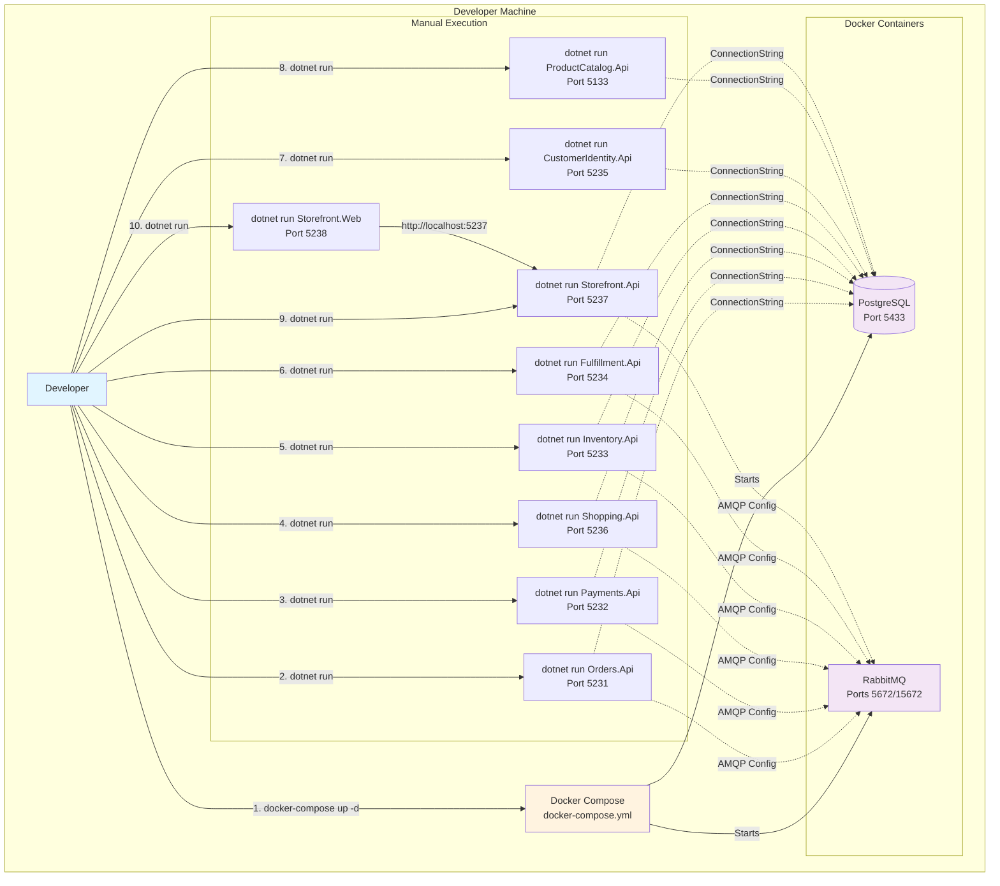
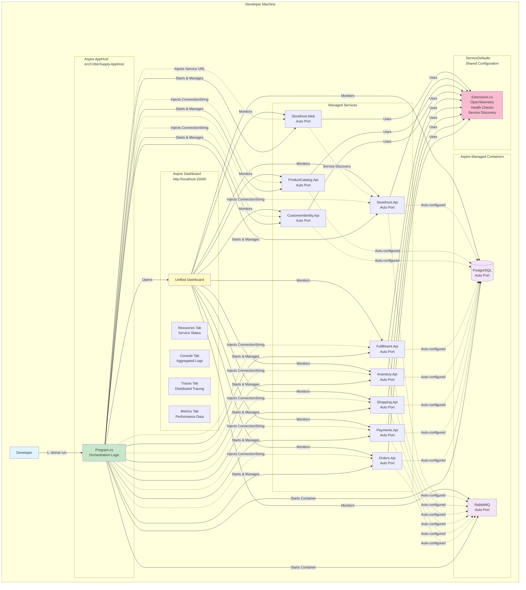
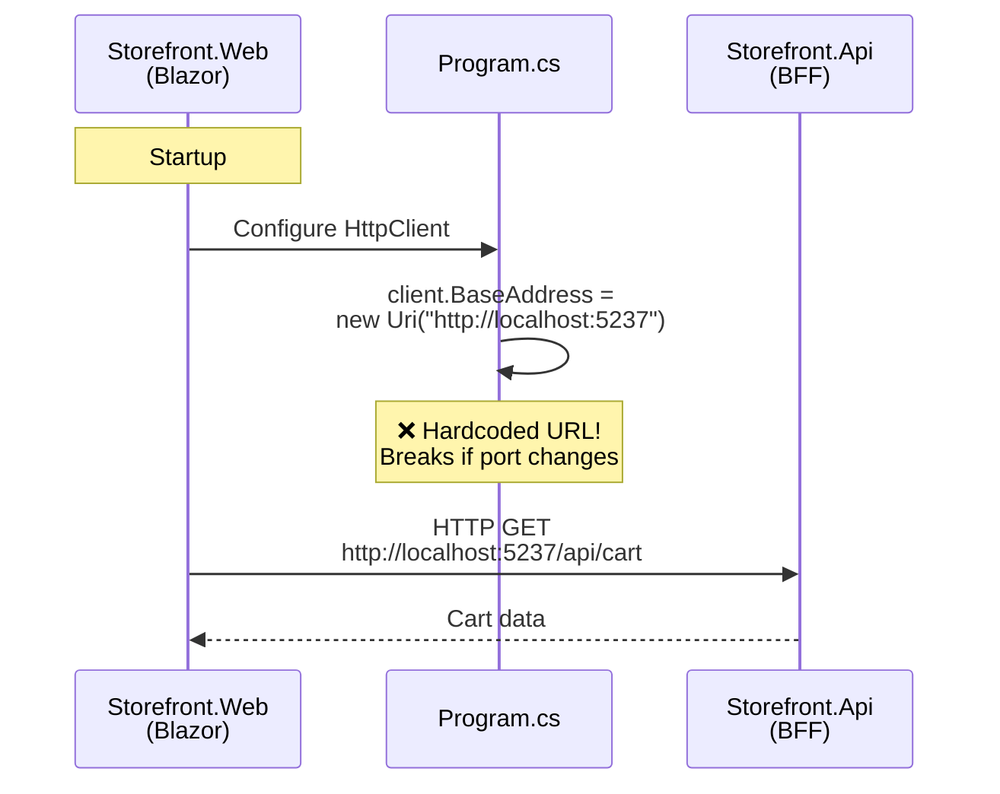
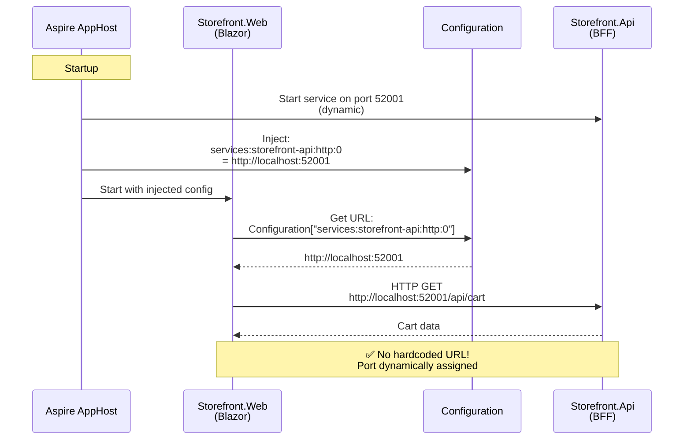
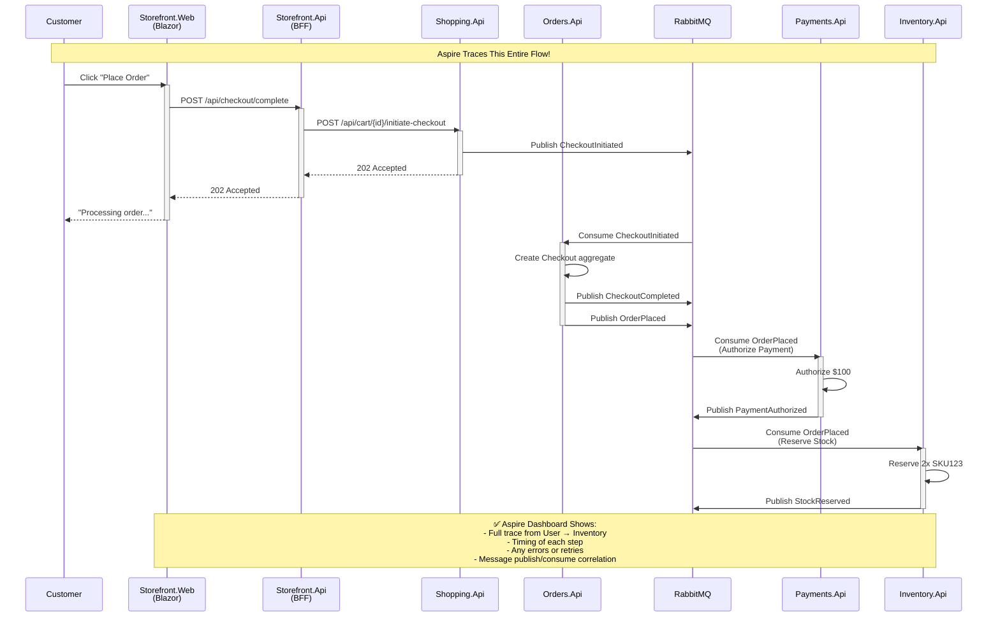

# Aspire Architecture Diagrams

This document provides visual representations of CritterSupply's architecture with and without Aspire.

## Current Architecture (Without Aspire)



**Current Pain Points:**
- 🔴 **10 manual commands** to start everything
- 🔴 **9-10 terminal windows** to monitor logs
- 🔴 **Hardcoded connection strings** in appsettings.json
- 🔴 **No unified view** of service health
- 🔴 **Manual port tracking** (what's running on what port?)

---

## Future Architecture (With Aspire)



**Aspire Benefits:**
- ✅ **1 command** to start everything (`dotnet run` in AppHost)
- ✅ **Unified dashboard** for all services at http://localhost:15000
- ✅ **Service discovery** (no hardcoded connection strings/URLs)
- ✅ **Real-time health checks** in dashboard
- ✅ **Aggregated logs** in Console tab
- ✅ **Distributed tracing** in Traces tab
- ✅ **Automatic port assignment** (no conflicts)
- ✅ **OpenTelemetry by default** (metrics, traces, structured logs)

---

## Aspire Dashboard Features

```mermaid
graph LR
    subgraph "Aspire Dashboard<br/>http://localhost:15000"
        Resources[Resources Tab]
        Console[Console Tab]
        Structured[Structured Logs Tab]
        Traces[Traces Tab]
        Metrics[Metrics Tab]
        
        subgraph "Resources Tab"
            ServiceList[Service List<br/>✅ Running/🔴 Failed]
            HealthChecks[Health Check Status]
            Endpoints[Endpoint URLs]
            EnvVars[Environment Variables]
        end
        
        subgraph "Console Tab"
            AllLogs[Aggregated Logs<br/>All Services]
            Filter[Filter by Service]
            Search[Search Text]
        end
        
        subgraph "Structured Logs Tab"
            StructuredView[JSON Log View]
            LogLevel[Filter by Level]
            TimeRange[Time Range Selector]
        end
        
        subgraph "Traces Tab"
            DistributedTraces[Distributed Traces<br/>Cross-Service Flows]
            TraceDetail[Trace Details<br/>Timing, Errors]
            SpanList[Span List<br/>Per Operation]
        end
        
        subgraph "Metrics Tab"
            CPUUsage[CPU Usage]
            MemoryUsage[Memory Usage]
            RequestRate[Request Rate]
            ErrorRate[Error Rate]
        end
        
        Resources --> ServiceList
        Resources --> HealthChecks
        Resources --> Endpoints
        Resources --> EnvVars
        
        Console --> AllLogs
        Console --> Filter
        Console --> Search
        
        Structured --> StructuredView
        Structured --> LogLevel
        Structured --> TimeRange
        
        Traces --> DistributedTraces
        Traces --> TraceDetail
        Traces --> SpanList
        
        Metrics --> CPUUsage
        Metrics --> MemoryUsage
        Metrics --> RequestRate
        Metrics --> ErrorRate
    end
    
    style Resources fill:#e1f5ff
    style Console fill:#fff3e0
    style Structured fill:#f3e5f5
    style Traces fill:#c8e6c9
    style Metrics fill:#fff9c4
```



---

## Service Discovery Flow

### Before Aspire (Hardcoded URLs)



### After Aspire (Service Discovery)



---

## Connection String Injection

### Before Aspire (Hardcoded in appsettings.json)

```mermaid
sequenceDiagram
    participant Orders as Orders.Api
    participant AppSettings as appsettings.json
    participant Postgres as PostgreSQL
    
    Orders->>AppSettings: Read ConnectionStrings:marten
    AppSettings-->>Orders: Host=localhost;Port=5433;...
    Note over AppSettings: ❌ Hardcoded!<br/>Must match docker-compose.yml
    Orders->>Postgres: Connect to localhost:5433
    Postgres-->>Orders: Connection established
```

### After Aspire (Injected by AppHost)

```mermaid
sequenceDiagram
    participant AppHost as Aspire AppHost
    participant Postgres as PostgreSQL Container
    participant Config as Configuration
    participant Orders as Orders.Api
    
    AppHost->>Postgres: Start container on port 52000<br/>(dynamic)
    Postgres-->>AppHost: Container ready
    AppHost->>Config: Inject ConnectionStrings:marten<br/>= Host=localhost;Port=52000;...
    AppHost->>Orders: Start with injected config
    Orders->>Config: Read ConnectionStrings:marten
    Config-->>Orders: Host=localhost;Port=52000;...
    Orders->>Postgres: Connect to localhost:52000
    Postgres-->>Orders: Connection established
    
    Note over AppHost,Orders: ✅ Dynamic connection string!<br/>No hardcoded ports
```

---

## Distributed Tracing Example

### Scenario: Customer Places Order



**In Aspire Dashboard (Traces Tab):**
- See entire flow as single trace
- Drill down into each span (operation)
- View timing: "Shopping.Api took 45ms, Orders.Api took 230ms, Payments.Api took 120ms"
- Identify bottlenecks: "Why is Orders.Api slow?"
- Correlate logs: Click trace → see all logs for that request

---

## Project Structure Comparison

### Before Aspire

```
CritterSupply/
├── src/
│   ├── Orders/
│   │   ├── Orders/
│   │   └── Orders.Api/
│   ├── Payments/
│   │   ├── Payments/
│   │   └── Payments.Api/
│   ├── Shopping/
│   │   ├── Shopping/
│   │   └── Shopping.Api/
│   ├── ... (5 more BCs)
│   └── Shared/
│       └── Messages.Contracts/
├── tests/
├── docker-compose.yml  ← Infrastructure orchestration
├── CritterSupply.slnx
└── README.md
```

### After Aspire

```
CritterSupply/
├── src/
│   ├── CritterSupply.AppHost/  ← NEW: Aspire orchestration
│   │   ├── Program.cs
│   │   └── appsettings.json
│   ├── CritterSupply.ServiceDefaults/  ← NEW: Shared Aspire config
│   │   ├── Extensions.cs
│   │   └── CritterSupply.ServiceDefaults.csproj
│   ├── Orders/
│   │   ├── Orders/
│   │   └── Orders.Api/  (references ServiceDefaults)
│   ├── Payments/
│   │   ├── Payments/
│   │   └── Payments.Api/  (references ServiceDefaults)
│   ├── Shopping/
│   │   ├── Shopping/
│   │   └── Shopping.Api/  (references ServiceDefaults)
│   ├── ... (5 more BCs, all reference ServiceDefaults)
│   └── Shared/
│       └── Messages.Contracts/
├── tests/  (unchanged - still use TestContainers)
├── docker-compose.yml  ← Still used for CI/CD
├── CritterSupply.slnx  (includes AppHost + ServiceDefaults)
└── README.md  (updated with Aspire instructions)
```

**Key Additions:**
- ✅ `CritterSupply.AppHost` - Orchestrates everything
- ✅ `CritterSupply.ServiceDefaults` - Shared OpenTelemetry + health checks + service discovery
- ✅ Each API project references ServiceDefaults (1 line in .csproj)

---

## Summary

### Architecture Changes
- **Orchestration**: Manual (`docker-compose` + 9x `dotnet run`) → Automated (Aspire AppHost)
- **Configuration**: Hardcoded → Service Discovery
- **Observability**: Manual → Built-in (OpenTelemetry)
- **Developer Experience**: Fragmented → Unified Dashboard

### What Stays the Same
- **Domain Logic**: 100% unchanged
- **Wolverine/Marten**: 100% unchanged
- **TestContainers**: 100% unchanged
- **CI/CD**: 100% unchanged

### Net Result
- **DX Improvement**: 10x better (10+ commands → 1 command)
- **Code Changes**: Minimal (~50 lines across 20 files)
- **Risk**: Low (additive, preserves existing workflows)
- **Effort**: 4-6 hours
