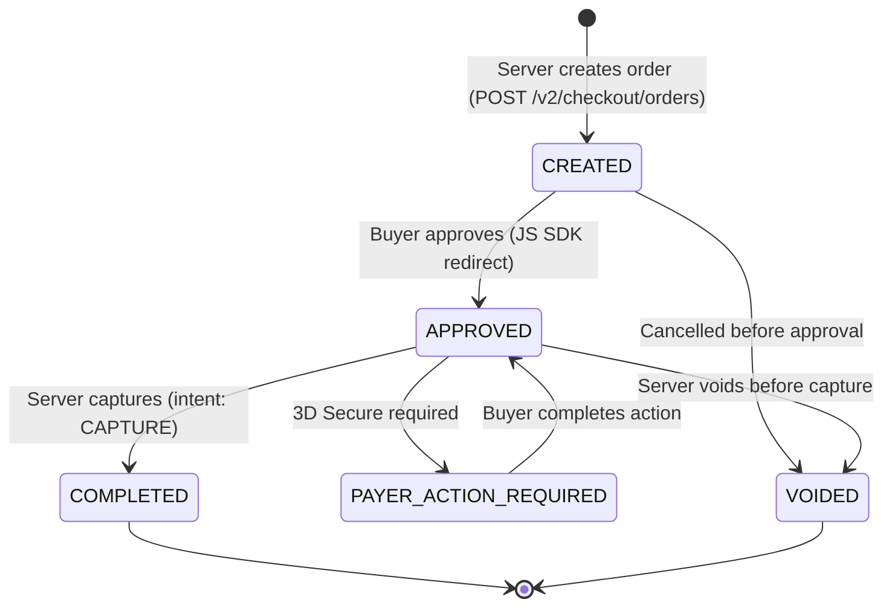
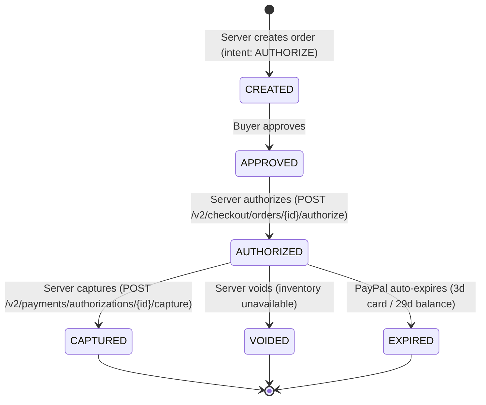

# PayPal Integration Quick Reference

**Status:** Research Complete ✅
**Date:** 2026-03-13
**Author:** UX Engineer

## 📋 Overview

This quick reference covers the essentials for integrating PayPal's Orders API v2 with CritterSupply's Payments bounded context. For full documentation, start with the research spike.

## 🗂️ Documentation Structure

```
docs/
├── planning/spikes/
│   └── paypal-api-integration.md           ← Main research document
└── examples/paypal/
    ├── README.md                            ← Usage guide (you are here)
    ├── QUICK-REFERENCE.md                   ← Quick-start guide (this file)
    ├── WEBHOOK-SECURITY.md                  ← Security deep-dive
    ├── PayPalPaymentGatewayExample.cs       ← Gateway implementation
    └── PayPalWebhookHandlerExample.cs       ← Webhook handler
```

## ⚡ Key Differences from Stripe (Read This First)

| Concern | Stripe | PayPal |
|---|---|---|
| **Auth** | Static API key | OAuth token (expires ~8 hrs — must refresh) |
| **Payment flow** | Client tokenizes card → server calls API | Server creates order → client approves → server captures |
| **`paymentMethodToken`** | Stripe `pm_xxx` (static) | PayPal `orderID` (per-transaction) |
| **Webhook verification** | HMAC-SHA256 (simple) | RSA-SHA256 + CRC32 (complex, cert download) |
| **Local webhook testing** | `stripe listen` (CLI) | ngrok / Cloudflare Tunnel required |
| **Test payment method** | Static test card numbers | Sandbox buyer accounts (browser login) |
| **Authorization window** | 7 days (all types) | 3 days (card) / 29 days (PayPal balance) |
| **Currency format** | Integer cents (`1999`) | Decimal string (`"19.99"`) |

## 🚀 Quick Start

### 1. Sandbox Setup (10 min)

1. Create a [PayPal Developer account](https://developer.paypal.com/)
2. Go to **Apps & Credentials** → **Create App**
3. Copy your **sandbox Client ID** and **Client Secret**
4. Go to **Testing Tools → Sandbox Accounts**
5. Note your **personal (buyer) sandbox account** credentials

### 2. Get an Access Token

```bash
curl -v https://api-m.sandbox.paypal.com/v1/oauth2/token \
  -u "CLIENT_ID:CLIENT_SECRET" \
  -H "Content-Type: application/x-www-form-urlencoded" \
  -d "grant_type=client_credentials"
```

```json
{
  "access_token": "A21AAFEpH4PsADK7...",
  "expires_in": 31668    // ~8 hours — MUST refresh before expiry
}
```

### 3. Create an Order

```bash
curl -X POST https://api-m.sandbox.paypal.com/v2/checkout/orders \
  -H "Authorization: Bearer ACCESS_TOKEN" \
  -H "Content-Type: application/json" \
  -H "PayPal-Request-Id: create-order-{paymentId}" \
  -d '{
    "intent": "CAPTURE",
    "purchase_units": [{
      "reference_id": "critter-supply-order-{orderId}",
      "amount": {
        "currency_code": "USD",
        "value": "19.99"
      }
    }]
  }'
```

```json
{
  "id": "5O190127TN364715T",    // ← orderID — pass to client JS
  "status": "CREATED",
  "links": [
    { "rel": "approve", "href": "https://www.sandbox.paypal.com/checkoutnow?token=5O190127TN364715T" }
  ]
}
```

### 4. Client Renders PayPal Button

```html
<script src="https://www.paypal.com/sdk/js?client-id={SANDBOX_CLIENT_ID}&currency=USD&enable-funding=paylater"></script>

<div id="paypal-button-container"></div>

<script>
  paypal.Buttons({
    createOrder: async () => {
      const res = await fetch('/api/paypal/orders', { method: 'POST' });
      return (await res.json()).id;
    },
    onApprove: async (data) => {
      await fetch(`/api/paypal/orders/${data.orderID}/capture`, { method: 'POST' });
      // Show success
    },
    onCancel: () => { /* show cart */ },
    onError: (err) => { /* handle error */ }
  }).render('#paypal-button-container');
</script>
```

### 5. Capture the Order (After Buyer Approves)

```bash
curl -X POST https://api-m.sandbox.paypal.com/v2/checkout/orders/5O190127TN364715T/capture \
  -H "Authorization: Bearer ACCESS_TOKEN" \
  -H "Content-Type: application/json" \
  -H "PayPal-Request-Id: capture-{paymentId}"
```

```json
{
  "id": "5O190127TN364715T",
  "status": "COMPLETED",
  "purchase_units": [{
    "payments": {
      "captures": [{
        "id": "3C679366HH908993F",    // ← TransactionId (use for refunds)
        "status": "COMPLETED",
        "amount": { "currency_code": "USD", "value": "19.99" }
      }]
    }
  }]
}
```

### 6. Set Up Local Webhook Testing

```bash
# PayPal has no CLI equivalent to 'stripe listen'
# Use ngrok or Cloudflare Tunnel

# Option A: ngrok
ngrok http 5232
# Yields: https://abc123.ngrok.io

# Option B: Cloudflare Tunnel (free, no account needed for temp URL)
cloudflared tunnel --url http://localhost:5232

# Register your HTTPS URL as a webhook endpoint:
# PayPal Dashboard → Your App → Webhooks → Add Webhook
# URL: https://abc123.ngrok.io/api/webhooks/paypal
# Events: PAYMENT.CAPTURE.COMPLETED, PAYMENT.CAPTURE.DECLINED, PAYMENT.CAPTURE.REFUNDED

# Simulate events via PayPal Dashboard:
# Dashboard → Webhooks → Simulate Webhook Event
```

## 📊 Key Concepts

### PayPal Order Lifecycle



### Authorization Lifecycle (Two-Phase)



### Authorization Hold Windows

| Payment Source | Hold Duration | Notes |
|---|---|---|
| PayPal balance | Up to **29 days** | Use `expiration_time` from API response |
| Credit/debit card | Up to **3 days** | |
| eCheck | Async settlement | May take several business days |

> Use PayPal's returned `expiration_time` for our `PaymentAuthorized.ExpiresAt` field — do NOT hardcode 7 days (Stripe's window).

### Idempotency Key Patterns

```
PayPal-Request-Id patterns (prefix per operation type):
  Create order:   "paypal-create-{paymentId}"
  Capture:        "paypal-capture-{paymentId}"
  Authorize:      "paypal-auth-{paymentId}"
  Void:           "paypal-void-{authorizationId}"
  Refund:         "paypal-refund-{captureId}-{amount}"
```

## 🔑 Key API Endpoints

| Operation | Endpoint | Method |
|---|---|---|
| Get access token | `/v1/oauth2/token` | `POST` |
| Create order | `/v2/checkout/orders` | `POST` |
| Show order details | `/v2/checkout/orders/{orderID}` | `GET` |
| Capture order | `/v2/checkout/orders/{orderID}/capture` | `POST` |
| Authorize order | `/v2/checkout/orders/{orderID}/authorize` | `POST` |
| Capture authorization | `/v2/payments/authorizations/{authId}/capture` | `POST` |
| Void authorization | `/v2/payments/authorizations/{authId}/void` | `POST` |
| Show authorization | `/v2/payments/authorizations/{authId}` | `GET` |
| Refund capture | `/v2/payments/captures/{captureId}/refund` | `POST` |
| Show capture | `/v2/payments/captures/{captureId}` | `GET` |
| Verify webhook sig | `/v1/notifications/verify-webhook-signature` | `POST` |

**Sandbox base URL:** `https://api-m.sandbox.paypal.com`
**Production base URL:** `https://api-m.paypal.com`

## 🔔 Webhook Events

| Event | Trigger | Our Response |
|---|---|---|
| `PAYMENT.CAPTURE.COMPLETED` | Capture succeeds | Publish `PaymentCaptured` |
| `PAYMENT.CAPTURE.DECLINED` | Capture rejected | Publish `PaymentFailed` (non-retriable) |
| `PAYMENT.CAPTURE.PENDING` | Capture pending (eCheck, fraud review) | Log, wait for COMPLETED or DECLINED |
| `PAYMENT.CAPTURE.REFUNDED` | Merchant issues refund | Publish `RefundCompleted` |
| `PAYMENT.REFUND.FAILED` | Refund rejected by bank | Publish `RefundFailed` |
| `PAYMENT.AUTHORIZATION.CREATED` | Authorization created | Internal: confirm in event stream |
| `PAYMENT.AUTHORIZATION.VOIDED` | Authorization cancelled | Internal: handle void |
| `CHECKOUT.ORDER.APPROVED` | Buyer approved order | Trigger capture (alt: capture immediately in onApprove) |
| `CUSTOMER.DISPUTE.CREATED` | Buyer opens dispute | Alert, manual review |

## 🔐 Security Checklist

- [ ] RSA-SHA256 + CRC32 signature verification on every webhook
- [ ] SSRF protection: validate `paypal-cert-url` domain before downloading
- [ ] Certificate caching (24-hour TTL)
- [ ] Webhook event deduplication (store `webhook.id` in Marten)
- [ ] Access token caching with TTL-aware refresh (refresh when < 60s remaining)
- [ ] Client Secret and Webhook ID stored securely (user secrets / env vars)
- [ ] HTTPS only (PayPal webhooks require port 443)
- [ ] `PayPal-Request-Id` on all mutating API calls (idempotency)

## ⚠️ Top Gotchas

1. **Access tokens expire in ~8 hours** — implement TTL-aware refresh or all API calls will fail
2. **Currency as decimal strings** — `"19.99"` NOT `1999` (opposite of Stripe)
3. **`webhookId` ≠ `clientId`** — Webhook ID is from your webhook subscription, not your app credentials
4. **`PAYMENT.CAPTURE.PENDING` is NOT completion** — Wait for `PAYMENT.CAPTURE.COMPLETED`
5. **Cert URL must be validated** — Prevent SSRF by checking domain before downloading
6. **No CLI for webhooks** — Use ngrok or PayPal Sandbox Simulator (not as convenient as Stripe CLI)
7. **Capture ID ≠ Order ID** — Refunds use Capture ID (`purchases[].payments.captures[].id`), NOT the Order ID

## 📚 Reference Links

### Internal Documentation
- [PayPal Research Spike](../../planning/spikes/paypal-api-integration.md)
- [Payment Gateway Comparison](../../planning/spikes/payment-gateway-comparison.md)
- [Webhook Security Deep-Dive](./WEBHOOK-SECURITY.md)
- [Stripe Examples (for comparison)](../stripe/)
- [Payment Gateway Interface](../../../src/Payments/Payments/Processing/IPaymentGateway.cs)

### External Resources
- [PayPal Orders API v2](https://developer.paypal.com/docs/api/orders/v2/)
- [PayPal Payments API v2](https://developer.paypal.com/docs/api/payments/v2/)
- [PayPal JS SDK Reference](https://developer.paypal.com/sdk/js/reference/)
- [PayPal Webhook Guide](https://developer.paypal.com/api/rest/webhooks/)
- [PayPal Webhook Event Names](https://developer.paypal.com/api/rest/webhooks/event-names/)
- [PayPal Developer Dashboard](https://developer.paypal.com/dashboard/)
- [PayPal Sandbox Accounts](https://developer.paypal.com/dashboard/accounts)

## 💡 Key Takeaways

1. **The redirect flow is the biggest difference** — PayPal requires server-side order creation before buyer approval; this doesn't fit `IPaymentGateway` cleanly without a new endpoint or interface extension.
2. **OAuth tokens need active management** — Unlike Stripe's static key, PayPal tokens expire. Build token refresh from day one, not as an afterthought.
3. **Webhook security is more complex** — RSA-SHA256 + CRC32 + cert download vs. Stripe's simple HMAC. Budget extra implementation time.
4. **No `stripe listen` equivalent** — Developer onboarding to PayPal webhooks requires ngrok or similar; document this explicitly.
5. **But Pay Later is free** — PayPal's Pay in 4 / Pay Monthly shows automatically via the JS SDK button; no additional server-side work. This is real conversion value for higher-ticket pet supply orders.
6. **Vault tokens ARE compatible with `IPaymentGateway`** — For returning customers using saved PayPal accounts, the vault flow maps cleanly to `CaptureAsync(amount, currency, vaultId)` — no redirect needed.

---

**Last Updated:** 2026-03-13
**Maintainer:** UX Engineer
**Status:** Research Complete — Ready for Implementation Planning ✅
