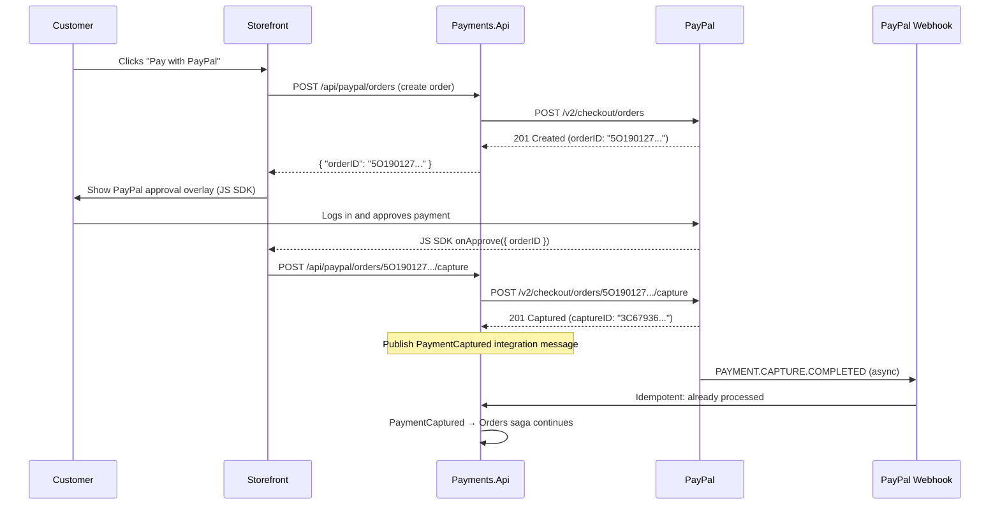
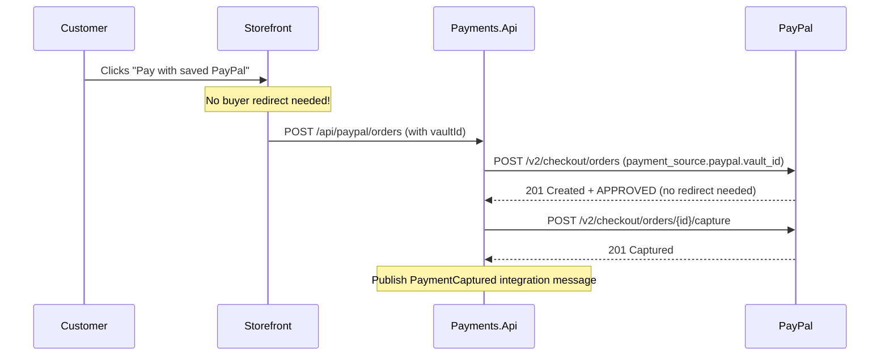

# PayPal Integration Examples

This directory contains reference documentation and implementation sketches for integrating with PayPal's payment API in CritterSupply.

## Overview

These examples demonstrate patterns for:
- **PayPal Orders API v2** — Create orders, capture payments, process refunds
- **Buyer-Redirect Approval Flow** — How PayPal's unique OAuth-redirect model works vs. Stripe's token model
- **Webhook Event Handling** — Async notifications for payment completion, failures, refunds
- **Webhook Security** — Certificate-based signature verification (RSA-SHA256 + CRC32)
- **Idempotency** — Safe retries using `PayPal-Request-Id` header
- **Access Token Management** — OAuth 2.0 token caching and refresh

## Files

### 1. PayPalPaymentGatewayExample.cs

**Purpose:** Implements `IPaymentGateway` interface for PayPal's Orders API v2.

**Key Features:**
- ✅ OAuth 2.0 access token management (auto-refresh before expiry)
- ✅ Create PayPal order (server-side, pre-buyer-approval)
- ✅ Capture approved order (one-phase)
- ✅ Authorize order with manual capture (two-phase)
- ✅ Refunds (full and partial, via capture ID)
- ✅ `PayPal-Request-Id` header for idempotency
- ✅ Currency amounts as decimal strings (NOT cents like Stripe)
- ✅ Error mapping (PayPal errors → GatewayResult)

**Configuration:**
```json
{
  "PayPal": {
    "ClientId": "AclientId",
    "ClientSecret": "AclientSecret",
    "WebhookId": "webhook-registration-id",
    "Environment": "Sandbox"
  }
}
```

### 2. PayPalWebhookHandlerExample.cs

**Purpose:** Handles webhook events from PayPal (payment completed, declined, refunded).

**Key Features:**
- ✅ RSA-SHA256 + CRC32 signature verification (prevents spoofing)
- ✅ Certificate downloading and caching (avoids latency on every webhook)
- ✅ Event deduplication (PayPal may retry up to 25 times over 3 days)
- ✅ Correlation via `reference_id` (links PayPal events to CritterSupply aggregates)
- ✅ Integration message publishing (triggers Order saga continuation)

**Endpoint:** `POST /api/webhooks/paypal`

**Stripe CLI Testing Equivalent (ngrok/Cloudflare Tunnel):**
```bash
# PayPal has no CLI equivalent to 'stripe listen'
# Use a tunnel to forward PayPal webhooks to localhost

# Option A: ngrok
ngrok http 5232
# Register the HTTPS URL in PayPal Developer Dashboard

# Option B: Cloudflare Tunnel (free)
cloudflared tunnel --url http://localhost:5232
# Register the HTTPS URL in PayPal Developer Dashboard

# Simulate PayPal webhook events:
# Go to: https://developer.paypal.com/dashboard/webhooks
# Select "Simulate Webhook Event"
```

### 3. WEBHOOK-SECURITY.md

Deep-dive on PayPal's certificate-based webhook verification (RSA-SHA256 + CRC32 checksum), covering:
- Why PayPal uses certificates instead of HMAC-SHA256
- The signed message construction
- Certificate caching best practices
- C# implementation sketch
- Comparison with Stripe's simpler HMAC approach

### 4. QUICK-REFERENCE.md

Quick-start guide for developers beginning a PayPal integration, including:
- Sandbox setup checklist
- Common API calls with request/response examples
- Idempotency key patterns
- ngrok setup for local webhook testing
- Key gotchas and pitfalls

## The Key Architectural Difference: PayPal vs. Stripe

Understanding **why** PayPal's flow is different is essential before reading the code examples.

### Stripe Flow (Current Model)

```
Client → [enters card in Stripe Elements] → Stripe (tokenize)
Stripe returns: pm_xxx token
Client → sends pm_xxx token to our server
Our server → gateway.CaptureAsync(amount, currency, "pm_xxx")
```

**`paymentMethodToken` = static PM token from Stripe**

### PayPal Flow

```
Our server → [creates PayPal order] → PayPal
PayPal returns: orderID
Client → renders PayPal button with orderID
Customer → approves on PayPal's overlay/redirect
Client → notifies our server: "buyer approved {orderID}"
Our server → gateway.CaptureAsync(amount, currency, "{orderID}")
```

**`paymentMethodToken` = dynamic orderID from PayPal (specific to this transaction)**

This means PayPal requires a **server-side "create order" step** before the buyer sees the payment UI. The code examples reflect this two-step setup.

## Integration Flow

### Standard PayPal Checkout (First-Time Buyer)



### Returning Customer with Vaulted Payment Method



## Testing Strategy

### 1. Unit Tests (Use StubPaymentGateway)

```csharp
[Fact]
public async Task PaymentRequest_WithSuccessToken_PublishesPaymentCaptured()
{
    // Arrange: StubPaymentGateway doesn't call real PayPal
    var fixture = new PaymentsTestFixture();
    fixture.UseStubGateway();

    // Act
    await fixture.Host.InvokeMessageAndWaitAsync(
        new PaymentRequested(orderId, 19.99m, "usd", "tok_success"));

    // Assert
    var captured = fixture.PublishedMessages<PaymentCaptured>().Single();
    captured.Amount.ShouldBe(19.99m);
}
```

### 2. Integration Tests (PayPal Sandbox)

PayPal sandbox requires sandbox buyer/seller accounts (not simple card numbers like Stripe).

```csharp
[Fact]
[Trait("Category", "Integration")]
public async Task PayPalGateway_WithSandboxCredentials_CreatesOrder()
{
    // Uses PayPal sandbox via environment variables
    var gateway = CreatePayPalGateway();

    var result = await gateway.CreateOrderAsync(
        19.99m,
        "USD",
        CancellationToken.None);

    result.Success.ShouldBeTrue();
    result.TransactionId.ShouldNotBeNullOrEmpty(); // PayPal orderID
}
```

### 3. Webhook Tests

Since PayPal has no Stripe CLI equivalent, use the PayPal Webhooks Simulator or ngrok/Cloudflare Tunnel:

```bash
# Terminal 1: Run the Payments API
dotnet run --project src/Payments/Payments.Api

# Terminal 2: Start ngrok tunnel
ngrok http 5232
# Copy the https://xxx.ngrok.io URL

# PayPal Dashboard: Webhooks → Simulate webhook event
# Endpoint URL: https://xxx.ngrok.io/api/webhooks/paypal
# Event Type: PAYMENT.CAPTURE.COMPLETED
```

## PayPal Sandbox Test Flow

Unlike Stripe's static test card numbers, PayPal sandbox requires interactive browser approval:

1. **Get sandbox accounts** — [PayPal Developer Dashboard](https://developer.paypal.com/dashboard/accounts)
2. **Create PayPal order** via your API (POST `/api/paypal/orders`)
3. **Open the approval URL** from the response's `links[rel="approve"]`
4. **Log in with sandbox buyer account** at `sandbox.paypal.com`
5. **Approve the payment** and observe capture flow

**PayPal Sandbox Buyer Credentials:**
```
Site: https://sandbox.paypal.com/signin
Email: [from Developer Dashboard → Testing Tools → Sandbox Accounts]
Password: [generated in dashboard, viewable under View/Edit Account]
```

## Security Considerations

### 1. Client ID vs. Client Secret

| Secret | Exposure | Storage |
|---|---|---|
| Client ID | ✅ Safe in client-side JS (needed for SDK) | `appsettings.json` or env var |
| Client Secret | 🔐 Server-side ONLY | User secrets (dev) / Key Vault (prod) |
| Access Token | 🔐 Server-side ONLY (short-lived, ~8 hrs) | In-memory cache only |
| Webhook ID | ⚠️ Keep private (needed for verification) | User secrets (dev) / Key Vault (prod) |

**Development setup:**
```bash
dotnet user-secrets set "PayPal:ClientSecret" "your-sandbox-client-secret" \
  --project src/Payments/Payments.Api
dotnet user-secrets set "PayPal:WebhookId" "your-sandbox-webhook-id" \
  --project src/Payments/Payments.Api
```

### 2. Webhook Signature Verification

**Critical:** Always verify `paypal-transmission-sig` header using RSA-SHA256 + CRC32 to prevent spoofing.

See `WEBHOOK-SECURITY.md` for full implementation details and C# code example.

### 3. Token Refresh

Access tokens expire in ~8 hours. Always implement TTL-aware caching:
- Cache access token in memory
- Refresh when < 60 seconds of TTL remain
- Handle token refresh failures gracefully (circuit breaker pattern)

## Production Checklist

- [ ] Store `ClientId` and `ClientSecret` in secret management (not `appsettings.json`)
- [ ] Store `WebhookId` in secret management
- [ ] Implement access token caching with TTL-aware refresh
- [ ] Enable webhook signature verification (RSA-SHA256 + CRC32)
- [ ] Cache PayPal signing certificates (24-hour TTL)
- [ ] Implement webhook event deduplication (store processed event IDs in Marten)
- [ ] Handle `PAYMENT.CAPTURE.PENDING` state (don't assume complete until `COMPLETED`)
- [ ] Use `PayPal-Request-Id` for all mutating API calls (idempotency)
- [ ] Add structured logging (PayPal order IDs, capture IDs, correlation IDs)
- [ ] Monitor access token refresh failures
- [ ] Set up alerts for high `PAYMENT.CAPTURE.DECLINED` rates
- [ ] Document rollback: void authorization vs. refund after capture
- [ ] Separate sandbox and production webhook endpoint registrations

## References

### Internal Documentation
- **Research Spike:** `docs/planning/spikes/paypal-api-integration.md`
- **Payment Gateway Comparison:** `docs/planning/spikes/payment-gateway-comparison.md`
- **Stripe Examples (for comparison):** `docs/examples/stripe/`
- **Existing Interface:** `src/Payments/Payments/Processing/IPaymentGateway.cs`
- **Existing Stub:** `src/Payments/Payments/Processing/StubPaymentGateway.cs`
- **External Service Integration Pattern:** `docs/skills/external-service-integration.md`

### External Resources
- [PayPal Orders API v2](https://developer.paypal.com/docs/api/orders/v2/)
- [PayPal Payments API v2](https://developer.paypal.com/docs/api/payments/v2/)
- [PayPal JS SDK Reference](https://developer.paypal.com/sdk/js/reference/)
- [PayPal Webhook Events Guide](https://developer.paypal.com/api/rest/webhooks/)
- [PayPal Webhook Event Names](https://developer.paypal.com/api/rest/webhooks/event-names/)
- [PayPal Developer Dashboard (Sandbox)](https://developer.paypal.com/dashboard/)
- [PayPal Vault Documentation](https://developer.paypal.com/docs/multiparty/vault/)

## Next Steps

1. **Create ADR** — Document PayPal as second gateway and the IPaymentGateway extension strategy decision
2. **Create PayPal order endpoint** — `POST /api/paypal/orders` in `Payments.Api`
3. **Implement `PayPalPaymentGateway`** — using example code as starting point
4. **Implement webhook handler** — `POST /api/webhooks/paypal`
5. **Integration tests** — using PayPal sandbox credentials
6. **Update CONTEXTS.md** — add PayPal integration flows to Payments BC section
7. **Update `README.md`** — reference PayPal integration alongside Stripe
