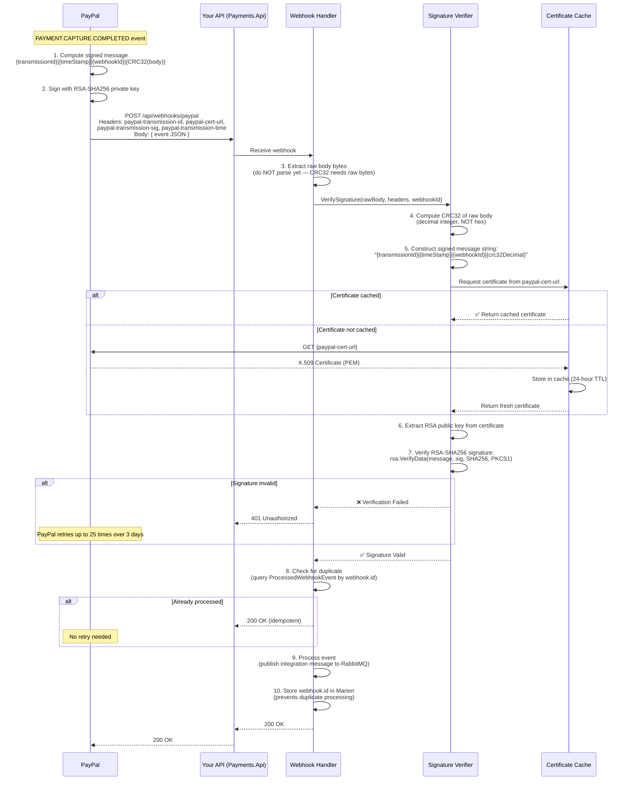

# PayPal Webhook Security: Signature Verification Flow

This document explains how PayPal's webhook signature verification works and why it is more complex than Stripe's approach.

## Overview

PayPal uses **asymmetric RSA-SHA256 certificate-based verification** to sign webhook payloads — a fundamentally different approach from Stripe's symmetric HMAC-SHA256. This distinction has real implementation consequences.

| Aspect | Stripe | PayPal |
|---|---|---|
| Algorithm | HMAC-SHA256 (symmetric) | RSA-SHA256 (asymmetric) |
| Secret type | Static `whsec_xxx` secret | X.509 certificate (downloaded per delivery) |
| Checksum method | Hash of raw body | CRC32 of raw body (decimal) |
| Header format | `Stripe-Signature: t=...,v1=...` | Multiple separate headers |
| Implementation complexity | Low (20–30 lines) | Medium (40–60 lines + cert caching) |
| External dependency | None (pure HMAC) | Certificate download from PayPal CDN |

## PayPal Webhook Headers

Every PayPal webhook delivery includes these headers:

| Header | Description | Example |
|---|---|---|
| `paypal-transmission-id` | Unique ID for this specific delivery attempt | `69cd13f0-d67a-11e5-baa3-778b53f4ae55` |
| `paypal-transmission-time` | ISO 8601 timestamp of delivery | `2016-02-18T20:01:35Z` |
| `paypal-cert-url` | URL of PayPal's signing certificate | `https://api.paypal.com/v1/notifications/certs/CERT-360caa42...` |
| `paypal-transmission-sig` | Base64-encoded RSA-SHA256 signature | `kc-p8/ZoXMSxd...` |
| `paypal-auth-algo` | Signature algorithm | `SHA256withRSA` |

## Signature Verification Flow



## Key Difference: CRC32, Not a Full Hash

PayPal's signed message includes a **CRC32 checksum** of the raw body, expressed as a **decimal integer**:

```
Signed message = "{transmissionId}|{timeStamp}|{webhookId}|{crc32DecimalValue}"
```

**Example:**
```
transmissionId  = "69cd13f0-d67a-11e5-baa3-778b53f4ae55"
timeStamp       = "2016-02-18T20:01:35Z"
webhookId       = "5TH47159DK785634N"
CRC32(body)     = 596830213    ← decimal form of CRC32 hex value

Signed message  = "69cd13f0-d67a-11e5-baa3-778b53f4ae55|2016-02-18T20:01:35Z|5TH47159DK785634N|596830213"
```

PayPal then signs this string with RSA-SHA256 using its private key. You verify using the public key from the certificate at `paypal-cert-url`.

## C# Implementation

```csharp
using System.IO.Hashing;
using System.Security.Cryptography;
using System.Security.Cryptography.X509Certificates;
using System.Text;

/// <summary>
/// Verifies PayPal webhook signatures using RSA-SHA256 + CRC32.
/// This is more complex than Stripe's HMAC-SHA256 approach.
/// </summary>
public sealed class PayPalWebhookVerifier
{
    private readonly IMemoryCache _certCache;
    private readonly HttpClient _httpClient;
    private readonly string _webhookId;

    public PayPalWebhookVerifier(
        IMemoryCache certCache,
        HttpClient httpClient,
        IConfiguration configuration)
    {
        _certCache = certCache;
        _httpClient = httpClient;
        _webhookId = configuration["PayPal:WebhookId"]
            ?? throw new InvalidOperationException("PayPal:WebhookId not configured");
    }

    public async Task<bool> VerifyAsync(
        byte[] rawBody,
        string transmissionId,
        string transmissionTime,
        string certUrl,
        string transmissionSig,
        CancellationToken ct)
    {
        // 1. Compute CRC32 of raw body (decimal form)
        //    PayPal requires the CRC32 as a decimal integer, NOT hex
        var crc32Bytes = new byte[4];
        var crc32Value = Crc32.HashToUInt32(rawBody);
        var crc32Decimal = crc32Value;  // Already an unsigned int (decimal when formatted)

        // 2. Build the signed message string
        var message = $"{transmissionId}|{transmissionTime}|{_webhookId}|{crc32Decimal}";
        var messageBytes = Encoding.UTF8.GetBytes(message);

        // 3. Download and cache the PayPal certificate
        //    IMPORTANT: Cache this! Downloading on every webhook adds ~100ms latency
        var certPem = await GetCachedCertificateAsync(certUrl, ct);

        // 4. Extract RSA public key from the certificate
        using var cert = X509Certificate2.CreateFromPem(certPem);
        using var rsa = cert.GetRSAPublicKey()
            ?? throw new InvalidOperationException("Certificate has no RSA public key");

        // 5. Decode the Base64 signature
        var signatureBytes = Convert.FromBase64String(transmissionSig);

        // 6. Verify the RSA-SHA256 signature
        return rsa.VerifyData(
            messageBytes,
            signatureBytes,
            HashAlgorithmName.SHA256,
            RSASignaturePadding.Pkcs1);
    }

    private async Task<string> GetCachedCertificateAsync(string certUrl, CancellationToken ct)
    {
        // Cache key: sanitized URL (certificates rotate periodically — a new URL = new cert)
        var cacheKey = $"paypal-cert-{certUrl.GetHashCode()}";

        if (_certCache.TryGetValue(cacheKey, out string? cachedCert) && cachedCert != null)
        {
            return cachedCert;
        }

        // Download certificate from PayPal CDN
        // SECURITY: Verify the URL starts with https://api.paypal.com to prevent SSRF
        if (!certUrl.StartsWith("https://api.paypal.com/", StringComparison.OrdinalIgnoreCase) &&
            !certUrl.StartsWith("https://api.sandbox.paypal.com/", StringComparison.OrdinalIgnoreCase))
        {
            throw new SecurityException($"Suspicious PayPal cert URL rejected: {certUrl}");
        }

        var pem = await _httpClient.GetStringAsync(certUrl, ct);

        // Cache for 24 hours (certificates are long-lived; new cert = new URL anyway)
        _certCache.Set(cacheKey, pem, TimeSpan.FromHours(24));

        return pem;
    }
}
```

> ⚠️ **SSRF Protection:** Always validate that `paypal-cert-url` points to `api.paypal.com` or `api.sandbox.paypal.com` before downloading. An attacker could inject a malicious URL in the header if you blindly fetch whatever URL is provided.

## Alternative: PayPal's Verify-Signature API

If RSA verification is too complex for an initial implementation, PayPal provides a server-side verification endpoint. This trades implementation complexity for API latency and an external dependency:

```http
POST https://api-m.sandbox.paypal.com/v1/notifications/verify-webhook-signature
Authorization: Bearer {access_token}
Content-Type: application/json

{
  "auth_algo": "SHA256withRSA",
  "cert_url": "{paypal-cert-url header}",
  "transmission_id": "{paypal-transmission-id header}",
  "transmission_sig": "{paypal-transmission-sig header}",
  "transmission_time": "{paypal-transmission-time header}",
  "webhook_id": "{your registered webhook ID}",
  "webhook_event": { /* complete webhook JSON */ }
}
```

Response:
```json
{ "verification_status": "SUCCESS" }
// or
{ "verification_status": "FAILURE" }
```

**When to use:**
- ✅ Acceptable for initial prototype/development
- ✅ Use if you can't easily integrate RSA verification (some platforms lack good RSA libs)
- ❌ Avoid in production: adds 100–300ms latency + extra PayPal API dependency on every webhook

## Security Properties

### 1. Authenticity (RSA Signature)

Only PayPal's private key can produce a valid signature for `paypal-cert-url`'s public key. An attacker cannot forge a valid signature without access to PayPal's private key.

### 2. Message Integrity (CRC32 + Signed Message)

The CRC32 of the full raw body is embedded in the signed message. Any modification to the body changes the CRC32, invalidating the signature.

> **Note:** CRC32 is not a cryptographic hash — it's a checksum for error detection, not tamper detection. However, since the CRC32 itself is RSA-signed, modifying the body and re-computing a matching CRC32 still cannot produce a valid RSA signature without the private key.

### 3. Delivery Tracking (Transmission ID)

Each delivery attempt has a unique `paypal-transmission-id`. Store processed IDs to prevent replay of legitimately-signed but already-processed webhooks.

### 4. Certificate Rotation

PayPal rotates its certificates periodically. The `paypal-cert-url` is specific to a certificate version — a new certificate = a new URL. Your cache-by-URL approach naturally handles this: the new URL is a cache miss, triggering a fresh download.

## Attack Scenarios Prevented

### ❌ Webhook Spoofing
**Attack:** Attacker sends fake `PAYMENT.CAPTURE.COMPLETED` webhook to get an order fulfilled without actually paying.

**Defense:** Without PayPal's RSA private key, the attacker cannot generate a valid `paypal-transmission-sig` → verification fails → 401 Unauthorized.

---

### ❌ Payload Tampering
**Attack:** Attacker intercepts a legitimate webhook and modifies the `amount` field downward.

**Defense:** Body modification changes CRC32, which is embedded in the signed message. The existing `paypal-transmission-sig` no longer matches the new signed message → verification fails.

---

### ❌ SSRF via Certificate URL Injection
**Attack:** Attacker sends a webhook with a malicious `paypal-cert-url` pointing to `http://internal-service.local/secrets`.

**Defense:** Validate that `paypal-cert-url` starts with `https://api.paypal.com/` or `https://api.sandbox.paypal.com/` before downloading. Reject anything else with a `SecurityException`.

---

### ❌ Replay Attack via Duplicate Webhook
**Attack:** Attacker captures a legitimate signed webhook from a previous order and replays it to process a second fulfillment.

**Defense:** Store `webhook.id` in Marten `ProcessedWebhookEvent` document. On duplicate delivery, return `200 OK` without reprocessing (idempotent handler).

---

### ❌ Stale Certificate Attack
**Attack:** Attacker serves a compromised certificate from a spoofed URL to bypass verification.

**Defense:** Certificate URL validation (SSRF protection) + certificate caching means the legitimate PayPal cert is fetched once and cached, preventing mid-flight substitution.

## Configuration

### Development (User Secrets)

```bash
dotnet user-secrets set "PayPal:WebhookId" "5TH47159DK785634N" \
  --project src/Payments/Payments.Api
dotnet user-secrets set "PayPal:ClientSecret" "your-sandbox-client-secret" \
  --project src/Payments/Payments.Api
```

### Finding Your Webhook ID

The `webhookId` is NOT the same as your Client ID or Client Secret. It is the ID assigned to a specific webhook listener URL registration:

1. Go to [PayPal Developer Dashboard](https://developer.paypal.com/dashboard/applications/sandbox)
2. Select your application
3. Scroll to **Webhooks** → Add Webhook (or view existing)
4. Copy the **Webhook ID** (format: `5TH47159DK785634N`)

> ⚠️ Each webhook URL registration has its own ID. If you register both sandbox and production URLs, they have different IDs.

### Production (Environment Variables)

```bash
export PAYPAL__WEBHOOKID="your-production-webhook-id"
export PAYPAL__CLIENTSECRET="your-production-client-secret"
```

## Testing Signature Verification

### Manual Test Using PayPal's Simulator

1. Start your local API with ngrok: `ngrok http 5232`
2. Register the HTTPS URL in PayPal Dashboard
3. Use [PayPal Webhooks Simulator](https://developer.paypal.com/dashboard/webhooks/simulator)
4. Select event type: `PAYMENT.CAPTURE.COMPLETED`
5. Observe logs — should see "Signature verified" message

### Unit Test (Invalid Signature)

```csharp
[Fact]
public async Task WebhookHandler_WithInvalidSignature_Returns401()
{
    // Arrange
    var payload = """{"id":"WH-xxx","event_type":"PAYMENT.CAPTURE.COMPLETED"}""";
    var invalidSig = Convert.ToBase64String(new byte[256]); // All zeros — invalid

    // Act
    var response = await fixture.Host.Scenario(s =>
    {
        s.Post.Json(payload).ToUrl("/api/webhooks/paypal");
        s.WithRequestHeader("paypal-transmission-id", Guid.NewGuid().ToString());
        s.WithRequestHeader("paypal-transmission-time", DateTimeOffset.UtcNow.ToString("O"));
        s.WithRequestHeader("paypal-cert-url", "https://api.sandbox.paypal.com/v1/notifications/certs/test");
        s.WithRequestHeader("paypal-transmission-sig", invalidSig);
        s.StatusCodeShouldBe(401);
    });
}
```

## Best Practices

✅ **Always verify signatures** — Never process webhooks without verification
✅ **Validate cert URL domain** — Prevent SSRF attacks
✅ **Cache certificates** — 24-hour TTL avoids latency on every webhook
✅ **Store processed event IDs** — Prevents duplicate processing
✅ **Use HTTPS** — PayPal only delivers to port 443
✅ **Return 200 OK** — Even for duplicates (prevents PayPal retries)
✅ **Log verification failures** — Monitor for suspicious activity
✅ **Handle cert URL rotation** — Cache by URL, not by global key

## References

- [PayPal Webhook Integration Guide](https://developer.paypal.com/api/rest/webhooks/rest/)
- [PayPal Webhooks API Reference](https://developer.paypal.com/docs/api/webhooks/v1/)
- Code Example: `docs/examples/paypal/PayPalWebhookHandlerExample.cs`
- Research Spike: `docs/planning/spikes/paypal-api-integration.md`
- Stripe Comparison: `docs/examples/stripe/WEBHOOK-SECURITY.md`
