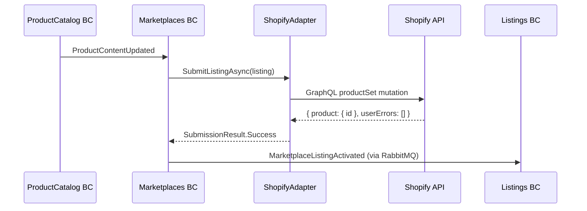
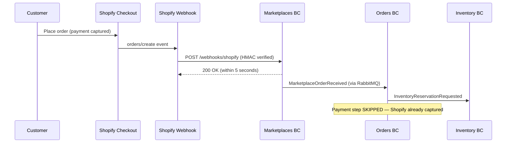
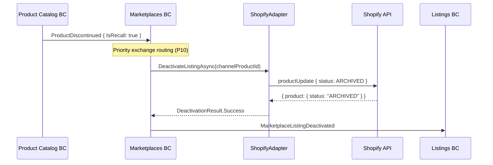
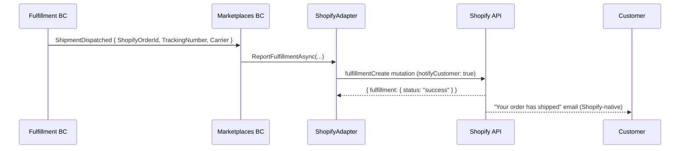

# Shopify Integration Examples

This directory contains reference implementations for integrating with Shopify's Admin API in CritterSupply's Marketplaces bounded context.

## Overview

These examples demonstrate production-ready patterns for:
- **Catalog Synchronization** — Push products and variants to Shopify via GraphQL `productSet` mutation
- **Order Ingestion** — Receive and validate Shopify orders via webhooks
- **Inventory Updates** — Keep Shopify inventory in sync with CritterSupply's Inventory BC
- **Fulfillment Push-Back** — Report tracking information to Shopify after shipment
- **Webhook Security** — HMAC-SHA256 signature verification and deduplication

## Files

### 1. ShopifyAdapterExample.cs

**Purpose:** Implements `IMarketplaceAdapter` interface for Shopify, covering catalog sync, inventory updates, and fulfillment push-back.

**Key Features:**
- ✅ `productSet` mutation for atomic upsert (create or replace)
- ✅ Product deactivation via `status: ARCHIVED` (recall cascade support)
- ✅ Inventory sync using absolute on-hand quantities (not delta adjustments)
- ✅ Fulfillment creation with tracking number and carrier info
- ✅ GraphQL error handling (HTTP 200 with `userErrors`)
- ✅ Exponential backoff on rate limit (`THROTTLED`) errors

### 2. ShopifyWebhookHandlerExample.cs

**Purpose:** Handles webhook events from Shopify (orders created, cancelled, fulfillment updates, GDPR mandatory topics).

**Key Features:**
- ✅ HMAC-SHA256 signature verification (prevents spoofing)
- ✅ Webhook deduplication via `X-Shopify-Event-Id` header
- ✅ `orders/create` ingestion → publishes `MarketplaceOrderReceived` to RabbitMQ
- ✅ `orders/cancelled` handling → publishes `MarketplaceOrderCancelled`
- ✅ GDPR mandatory webhook handlers (data_request, redact topics)
- ✅ 5-second response deadline compliance (async processing)

## Integration Flow

### Catalog Sync (CritterSupply → Shopify)



### Order Ingestion (Shopify → CritterSupply)



### Recall Cascade (CritterSupply → Shopify)



### Fulfillment Push-Back (CritterSupply → Shopify)



## Shopify API Version

All examples target API version **`2026-01`**.

This version is recommended because:
- REST Product API (`/products.json`) was deprecated in `2024-04` — GraphQL required for product mutations
- API version `2026-01` raised concurrent bulk operation limit from 1 to 5 per shop

**Version management:** The API version is stored in Vault (not hardcoded) to allow updates without deployment:

```json
{
  "store_domain": "critter-supply.myshopify.com",
  "access_token": "shpat_xxxxxxxxxxxxxxxxxxxxxxxx",
  "webhook_secret": "shpss_xxxxxxxxxxxxxxxxxxxxxxxx",
  "api_version": "2026-01"
}
```

## Authentication

Use a **Custom App** (admin-created) for CritterSupply's Shopify integration — not a Public App or Partner Dashboard app. Custom App tokens created in the Shopify admin do not expire.

All requests use the `X-Shopify-Access-Token` header:

```http
POST https://critter-supply.myshopify.com/admin/api/2026-01/graphql.json
X-Shopify-Access-Token: shpat_xxxxxxxx
Content-Type: application/json
```

## Required Access Scopes

When creating the Shopify Custom App in the Shopify admin, grant these scopes:

```
read_products            write_products
read_product_listings
read_inventory           write_inventory
read_locations
read_orders              write_orders        read_all_orders
read_fulfillments        write_fulfillments
read_assigned_fulfillment_orders  write_assigned_fulfillment_orders
read_gdpr_data_request
```

## Testing Strategy

### 1. Development Store (Shopify Partners)

Create a **Shopify development store** (free, unlimited via Shopify Partners program). Development stores support:
- API calls without rate limit enforcement (useful for initial testing)
- Test orders without real payment processing
- Webhook testing via the Shopify CLI

### 2. Shopify CLI for Webhook Testing

```bash
# Install Shopify CLI
npm install -g @shopify/cli@latest

# Forward webhooks to local Marketplaces API
shopify app dev --client-id {your-app-id}

# Or trigger test webhook events manually
shopify webhook trigger \
  --topic orders/create \
  --delivery-method http \
  --address http://localhost:5247/webhooks/shopify
```

### 3. Integration Tests (Stub Adapter)

CritterSupply's Marketplaces BC uses the stub adapter pattern (same as Payments BC):

```csharp
// In test setup
services.AddSingleton<IMarketplaceAdapter>(
    new StubShopifyAdapter()
        .WithSuccessfulProductSync()
        .WithSuccessfulFulfillment());

// Verify integration message published
await host.InvokeMessageAndWaitAsync(new ListingSubmittedToMarketplace(
    ListingId: listingId,
    ChannelCode: "SHOPIFY_US",
    ProductFamilyId: familyId));

var activated = publishedMessages.OfType<MarketplaceListingActivated>().Single();
activated.ChannelCode.ShouldBe("SHOPIFY_US");
```

## Shopify Test Cards

For testing orders on a Shopify development store:

| Card Number | Behavior |
|-------------|----------|
| `1` (Bogus Gateway) | Always succeeds (development store only) |
| `2` (Bogus Gateway) | Always fails (development store only) |
| `4242 4242 4242 4242` | Shopify Payments test: succeeds |
| `4000 0000 0000 0002` | Shopify Payments test: card declined |

**Note:** Shopify development stores use a "Bogus Gateway" for test orders. Use the Bogus Gateway card numbers (`1` or `2`) for most webhook trigger testing. Shopify Payments test cards apply when testing with Shopify Payments enabled.

## Security Considerations

### 1. Token Protection

**Development:**
```bash
dotnet user-secrets set "Shopify:AccessToken" "shpat_xxx"
dotnet user-secrets set "Shopify:WebhookSecret" "shpss_xxx"
```

**Production:**
Store in Vault at the path recorded on the `Marketplace` document entity. Never store in `appsettings.json` or environment variables directly.

### 2. Webhook Signature Verification

**Always verify `X-Shopify-Hmac-Sha256` before processing.** See `ShopifyWebhookHandlerExample.cs` for the constant-time HMAC verification implementation.

**Critical:** Read the raw request body bytes BEFORE JSON deserialization. Use `Request.EnableBuffering()` in the ASP.NET Core middleware.

### 3. No Duplicate Charges Possible

Unlike Stripe (where misuse of the API can cause double-charges), Shopify captures payment before our system sees the order. Our adapter never initiates payment. However, webhook deduplication is still required — a duplicate `orders/create` webhook could cause a duplicate order in CritterSupply's system if not guarded.

### 4. GDPR Compliance

The three GDPR mandatory webhook handlers (`customers/data_request`, `customers/redact`, `shop/redact`) **must be implemented** before publishing the Shopify app. They are P0 requirements — Shopify can revoke app access for non-compliance.

## Production Checklist

- [ ] Custom App created in Shopify admin with correct access scopes
- [ ] Vault secret configured: `store_domain`, `access_token`, `webhook_secret`, `api_version`
- [ ] Vault path stored on `Marketplace` document for `SHOPIFY_US`
- [ ] Webhook subscriptions registered via GraphQL (not Shopify admin — those aren't API-visible)
- [ ] HMAC verification implemented and tested
- [ ] Webhook deduplication implemented (use `X-Shopify-Event-Id`)
- [ ] GDPR mandatory webhook handlers implemented (`customers/data_request`, `customers/redact`, `shop/redact`)
- [ ] `inventoryPolicy: DENY` enforced on all product variants (no overselling)
- [ ] Exponential backoff for `THROTTLED` GraphQL errors
- [ ] Payment Seam ADR written and decided before Cycle 35 implementation
- [ ] Shopify transaction ID stored on CritterSupply Order record (financial reconciliation)
- [ ] Fulfillment push-back tested end-to-end (Shopify order → CritterSupply ship → Shopify fulfilled)
- [ ] Alert configured for `app/uninstalled` webhook (disables adapter automatically)

## Rate Limit Quick Reference

| API | Standard Limit | Plus Limit |
|-----|---------------|-----------|
| GraphQL Admin API | 100 points/sec | 1,000 points/sec |
| REST Admin API | 40 req/min (2/sec restore) | 400 req/min (20/sec restore) |
| Variant mutations (stores with 50K+ variants) | 1,000/day | No limit |

**Initial catalog sync:** Always use GraphQL Bulk Operations (`bulkOperationRunMutation`) for 100+ products. Individual mutations for 100 products with 10 variants each = 1,000 mutation calls = immediately hits rate limits.

## References

- **Research Spike:** `docs/planning/spikes/shopify-api-integration.md`
- **Marketplaces BC Architecture:** `docs/planning/catalog-listings-marketplaces-cycle-plan.md` (Cycles 32–35)
- **Evolution Plan:** `docs/planning/catalog-listings-marketplaces-evolution-plan.md`
- **Glossary:** `docs/planning/catalog-listings-marketplaces-glossary.md`
- **External Service Integration Skill:** `docs/skills/external-service-integration.md`
- **Prior Art:** `docs/examples/stripe/` (Stripe integration reference)
- [Shopify GraphQL Admin API](https://shopify.dev/docs/api/admin-graphql) (external)
- [Shopify Webhooks Guide](https://shopify.dev/docs/apps/build/webhooks) (external)
- [Shopify New Product Model](https://shopify.dev/docs/api/admin/migrate/new-product-model) (external)
- [Shopify Rate Limits](https://shopify.dev/docs/api/usage/limits) (external)
- [Shopify CLI](https://shopify.dev/docs/apps/tools/cli) (external)

## Next Steps

When Cycle 35 begins:
1. **ADR:** Write the Payment Seam ADR (Option A: Pre-Paid Order Entry Point)
2. **Scaffold:** Create `src/Marketplaces/Marketplaces/Adapters/ShopifyAdapter.cs`
3. **Configure:** Add Vault secret for `SHOPIFY_US` Marketplace document
4. **Register Webhooks:** Call webhook registration on adapter startup
5. **Test:** Use Shopify CLI to simulate order webhooks against local Marketplaces.Api
6. **Integrate:** Wire `ShipmentDispatched` from Fulfillment BC to fulfillment push-back
7. **Monitor:** Add structured logging for Shopify API call latency and error rates
