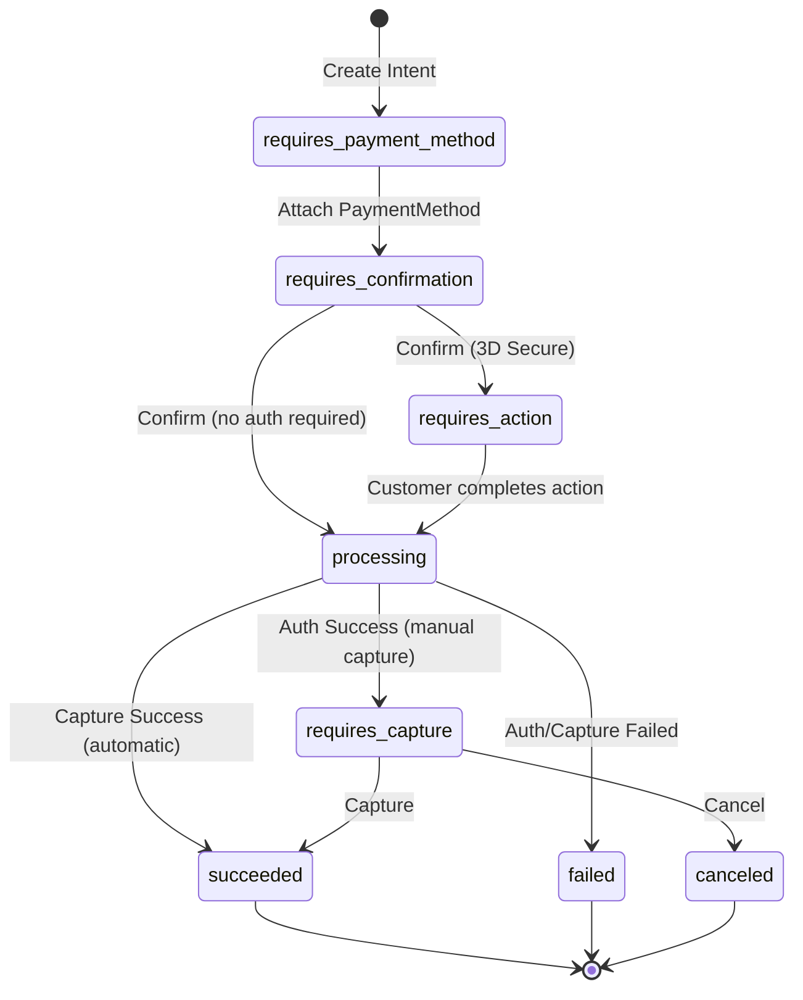

# Stripe Integration Quick Reference

**Status:** Research Complete ✅  
**Date:** 2026-02-18  
**Owner:** Principal Architect

## 📋 Overview

This directory contains comprehensive documentation and examples for integrating Stripe's payment gateway with CritterSupply's Payments bounded context.

## 🗂️ Documentation Structure

```
docs/
├── planning/spikes/
│   └── stripe-api-integration.md          ← Main research document
├── decisions/
│   └── 0010-stripe-payment-gateway...md   ← Architectural decision record
└── examples/stripe/
    ├── README.md                           ← Usage guide (you are here)
    ├── WEBHOOK-SECURITY.md                 ← Security deep-dive
    ├── StripePaymentGatewayExample.cs      ← Gateway implementation
    └── StripeWebhookHandlerExample.cs      ← Webhook handler
```

## 🚀 Quick Start

### 1. Read the Research Spike (30 min)

Start here for comprehensive understanding:

📄 **[stripe-api-integration.md](../../planning/spikes/stripe-api-integration.md)**

Key sections:
- Core Stripe Concepts (PaymentIntent, PaymentMethod, Customer)
- API Operations (authorize, capture, refund)
- Webhook Events (payment_intent.succeeded, etc.)
- Integration Patterns (two-phase vs immediate capture)
- Production Considerations (idempotency, rate limiting)

### 2. Review the ADR (10 min)

Understand architectural decisions:

📄 **[0010-stripe-payment-gateway-integration.md](../../decisions/0010-stripe-payment-gateway-integration.md)**

Key sections:
- Why webhooks over polling?
- Why two-phase commit?
- Stripe vs other gateways (Braintree, Square)
- Implementation phases

### 3. Study the Code Examples (20 min)

See production-ready patterns:

📄 **Code Examples:**
- [StripePaymentGatewayExample.cs](./StripePaymentGatewayExample.cs) — Gateway implementation
- [StripeWebhookHandlerExample.cs](./StripeWebhookHandlerExample.cs) — Webhook handler
- [WEBHOOK-SECURITY.md](./WEBHOOK-SECURITY.md) — Security deep-dive

### 4. Test Locally (30 min)

```bash
# Install Stripe CLI
brew install stripe/stripe-cli/stripe

# Login to Stripe (or use test mode)
stripe login

# Forward webhooks to local API
stripe listen --forward-to http://localhost:5232/api/webhooks/stripe

# Trigger test events
stripe trigger payment_intent.succeeded
stripe trigger payment_intent.payment_failed
stripe trigger charge.refunded
```

## 📊 Key Concepts

### PaymentIntent Lifecycle



### Two-Phase Commit Flow

```
1. Authorize Payment (hold funds)
   └─> Status: requires_capture
   
2. Check Inventory
   └─> If available: Continue
   └─> If unavailable: Cancel authorization
   
3. Capture Payment (collect funds)
   └─> Status: succeeded
```

### Webhook-Driven Architecture

**Why?**
- Network failures can lose HTTP responses
- Some payments require async processing (3D Secure, bank transfers)
- Webhooks provide eventual consistency guarantees

**How?**
1. API call returns `processing` status
2. Stripe sends webhook when payment completes
3. Webhook handler publishes integration message
4. Order saga continues based on webhook (not HTTP response)

## 🔐 Security Checklist

- [ ] HMAC-SHA256 signature verification on every webhook
- [ ] Timestamp tolerance check (5 minutes max)
- [ ] Event deduplication (store processed event IDs)
- [ ] Webhook secret stored securely (user secrets / env vars)
- [ ] HTTPS in production (no plain HTTP)
- [ ] Constant-time signature comparison (prevents timing attacks)
- [ ] Rate limiting with exponential backoff (Stripe: 100 req/sec)
- [ ] Idempotency keys for all mutations (prevent duplicate charges)

## 📈 Implementation Roadmap

### Phase 1: Foundation (Week 1)
- [ ] Create `StripePaymentGateway` class in `src/Payments/Payments/Processing/`
- [ ] Add Stripe configuration to `appsettings.json`
- [ ] Implement `AuthorizeAsync`, `CaptureAsync`, `RefundAsync`
- [ ] Unit tests (use existing `StubPaymentGateway` tests as template)
- [ ] Integration tests with Stripe test mode

### Phase 2: Webhooks (Week 2)
- [ ] Create webhook endpoint in `src/Payments/Payments.Api/Webhooks/`
- [ ] Implement HMAC-SHA256 signature verification
- [ ] Handle `payment_intent.succeeded`, `payment_intent.payment_failed`
- [ ] Handle `charge.refunded`
- [ ] Webhook deduplication (store `ProcessedWebhookEvent` documents)
- [ ] Local testing with Stripe CLI

### Phase 3: Production Hardening (Week 3)
- [ ] Idempotency key storage (`PaymentAttempt` documents)
- [ ] Webhook event audit trail (full event payload storage)
- [ ] Rate limiting with exponential backoff
- [ ] Structured logging (correlation IDs, amounts, order IDs)
- [ ] Monitoring queries (failed payments, processing times)
- [ ] Alert rules (high failure rate, webhook lag)

### Phase 4: Customer Management (Week 4)
- [ ] Extend `IPaymentGateway` with customer operations
- [ ] Create Stripe customers for repeat purchases
- [ ] Attach payment methods to customers
- [ ] List saved payment methods
- [ ] Set default payment method
- [ ] Integration with Customer Identity BC

## 🧪 Testing Strategy

### Unit Tests (Fast, No External Calls)
```csharp
// Use StubPaymentGateway
services.AddSingleton<IPaymentGateway, StubPaymentGateway>();

// Test token patterns:
// "tok_success" → success
// "tok_decline" → card declined (non-retriable)
// "tok_timeout" → gateway timeout (retriable)
```

### Integration Tests (Stripe Test Mode)
```csharp
// Use StripePaymentGateway with test API key
services.AddHttpClient<IPaymentGateway, StripePaymentGateway>();

// Stripe test cards:
// 4242 4242 4242 4242 → always succeeds
// 4000 0000 0000 0002 → card declined
// 4000 0000 0000 9995 → insufficient funds
```

### Webhook Tests (Local Stripe CLI)
```bash
# Forward webhooks to local API
stripe listen --forward-to http://localhost:5232/api/webhooks/stripe

# Trigger specific events
stripe trigger payment_intent.succeeded --add payment_intent:metadata[payment_id]=test-id
```

## 📚 Reference Links

### Internal Documentation
- [Stripe API Research Spike](../../planning/spikes/stripe-api-integration.md)
- [ADR: Stripe Integration](../../decisions/0010-stripe-payment-gateway-integration.md)
- [Webhook Security Deep-Dive](./WEBHOOK-SECURITY.md)
- [Payment Gateway Interface](../../../src/Payments/Payments/Processing/IPaymentGateway.cs)
- [Stub Gateway Implementation](../../../src/Payments/Payments/Processing/StubPaymentGateway.cs)
- [External Service Integration Pattern](../../../skills/external-service-integration.md)

### External Resources
- [Stripe API Documentation](https://stripe.com/docs/api)
- [Stripe Payment Intents Guide](https://stripe.com/docs/payments/payment-intents)
- [Stripe Webhooks Guide](https://stripe.com/docs/webhooks)
- [Stripe Testing Guide](https://stripe.com/docs/testing)
- [Stripe CLI Documentation](https://stripe.com/docs/stripe-cli)

## 💡 Key Takeaways

1. **Webhooks are Essential** — Don't rely solely on HTTP responses for payment confirmation
2. **Two-Phase Commit Prevents Wasted Charges** — Authorize first, capture after inventory confirmed
3. **Idempotency is Critical** — Use deterministic keys to prevent duplicate charges
4. **Security is Multi-Layered** — Signature verification + timestamp checks + event deduplication
5. **Stripe's API is Industry-Standard** — Patterns shown here apply to most modern payment gateways

## 🤝 Contributing

When implementing Stripe integration:

1. **Follow Existing Patterns** — Use code examples as templates
2. **Write Tests First** — Start with stub gateway, then integration tests
3. **Document Configuration** — Update appsettings.json examples
4. **Test Webhooks Locally** — Use Stripe CLI for full flow validation
5. **Update CONTEXTS.md** — Add Stripe flows to Payments BC section

## ❓ Questions?

Consult these resources in order:

1. **Quick answers:** This README
2. **Implementation details:** Code examples
3. **API patterns:** Research spike document
4. **Architectural rationale:** ADR
5. **Security concerns:** WEBHOOK-SECURITY.md

---

**Last Updated:** 2026-02-18  
**Maintainer:** Principal Architect  
**Status:** Ready for Implementation ✅
