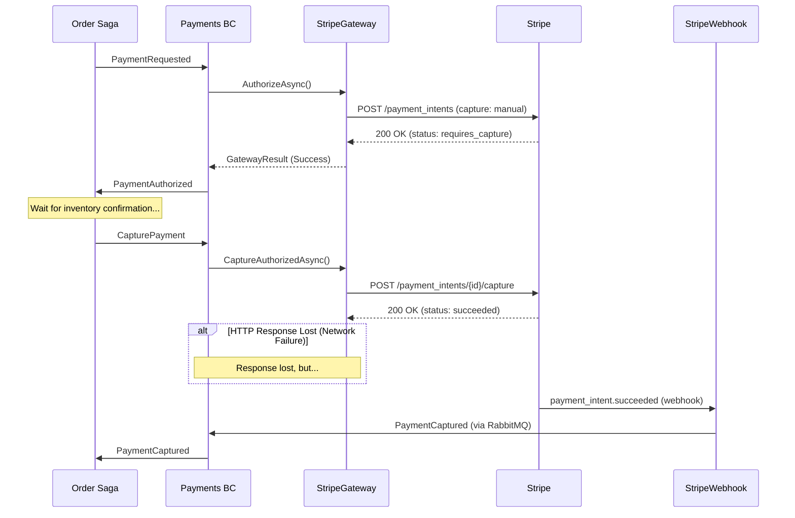

# Stripe Integration Examples

This directory contains reference implementations for integrating with Stripe's payment API in CritterSupply.

## Overview

These examples demonstrate production-ready patterns for:
- **Request/Response Payment Operations** — Authorize, capture, refund payments via REST API
- **Webhook Event Handling** — Async notifications for payment completion, failures, refunds
- **Security** — HMAC-SHA256 signature verification, webhook deduplication
- **Idempotency** — Safe retries using idempotency keys
- **Error Handling** — Distinguishing retriable from non-retriable failures

## Files

### 1. StripePaymentGatewayExample.cs

**Purpose:** Implements `IPaymentGateway` interface for Stripe API.

**Key Features:**
- ✅ Two-phase commit (authorize → capture)
- ✅ One-phase capture (immediate)
- ✅ Refunds (full and partial)
- ✅ Idempotency keys for safe retries
- ✅ Currency conversion (dollars to cents)
- ✅ Error mapping (Stripe errors → GatewayResult)

**Usage:**
```csharp
// In Program.cs (DI registration)
builder.Services.AddHttpClient<IPaymentGateway, StripePaymentGateway>();

// In handler (Wolverine injects automatically)
public static async Task<OutgoingMessages> Handle(
    PaymentRequested command,
    IPaymentGateway gateway,  // <-- Injected
    CancellationToken ct)
{
    var result = await gateway.AuthorizeAsync(
        command.Amount,
        command.Currency,
        command.PaymentMethodToken,
        ct);

    // ... handle result
}
```

**Configuration:**
```json
{
  "Stripe": {
    "SecretKey": "sk_test_xxx"  // Use user secrets in dev
  }
}
```

### 2. StripeWebhookHandlerExample.cs

**Purpose:** Handles webhook events from Stripe (payment success, failure, refunds).

**Key Features:**
- ✅ HMAC-SHA256 signature verification (prevents spoofing)
- ✅ Event deduplication (Stripe may retry)
- ✅ Timestamp tolerance (prevents replay attacks)
- ✅ Correlation via metadata (links Stripe events to CritterSupply aggregates)
- ✅ Integration message publishing (triggers Order saga)

**Usage:**
```csharp
// Endpoint: POST /api/webhooks/stripe
// Stripe calls this endpoint when events occur (payment succeeded, failed, etc.)

// Register webhook endpoint in Program.cs:
app.MapWolverineEndpoints();  // Auto-discovers [WolverinePost] handlers
```

**Configuration:**
```json
{
  "Stripe": {
    "WebhookSecret": "whsec_xxx"  // Use user secrets in dev
  }
}
```

**Stripe CLI Testing:**
```bash
# Forward webhooks to local API
stripe listen --forward-to http://localhost:5232/api/webhooks/stripe

# Trigger test events
stripe trigger payment_intent.succeeded
stripe trigger payment_intent.payment_failed
stripe trigger charge.refunded
```

## Integration Flow

### Two-Phase Commit (Authorize → Capture)



**Why Webhooks?**
- Network failures can lose HTTP responses
- Some payment methods (3D Secure) require async processing
- Webhooks guarantee eventual delivery (Stripe retries for 3 days)

## Testing Strategy

### 1. Unit Tests (Use StubPaymentGateway)

```csharp
[Fact]
public async Task PaymentRequest_WithSuccessToken_PublishesPaymentCaptured()
{
    // Arrange
    var fixture = new PaymentsTestFixture();
    fixture.UseStubGateway();  // No real Stripe calls

    // Act
    await fixture.Host.InvokeMessageAndWaitAsync(
        new PaymentRequested(orderId, 19.99m, "usd", "tok_success"));

    // Assert
    var captured = fixture.PublishedMessages<PaymentCaptured>().Single();
    captured.Amount.ShouldBe(19.99m);
}
```

### 2. Integration Tests (Stripe Test Mode)

```csharp
[Fact]
[Trait("Category", "Integration")]
public async Task StripeGateway_WithTestCard_AuthorizesPayment()
{
    // Arrange
    var gateway = CreateStripeGateway();  // Uses Stripe test mode

    // Act
    var result = await gateway.AuthorizeAsync(
        19.99m,
        "usd",
        "pm_card_visa",  // Stripe test card
        CancellationToken.None);

    // Assert
    result.Success.ShouldBeTrue();
    result.TransactionId.ShouldStartWith("pi_");
}
```

### 3. Webhook Tests (Stripe CLI)

```bash
# Terminal 1: Run API
dotnet run --project src/Payments/Payments.Api

# Terminal 2: Forward webhooks
stripe listen --forward-to http://localhost:5232/api/webhooks/stripe

# Terminal 3: Trigger events
stripe trigger payment_intent.succeeded --add payment_intent:metadata[payment_id]=test-payment-id
```

## Stripe Test Cards

Use these test cards in Stripe test mode:

| Card Number | Behavior |
|-------------|----------|
| 4242 4242 4242 4242 | Always succeeds |
| 4000 0000 0000 0002 | Card declined |
| 4000 0000 0000 9995 | Insufficient funds |
| 4000 0000 0000 0069 | Expired card |
| 4000 0025 0000 3155 | Requires 3D Secure authentication |

**Expiry:** Any future date (e.g., 12/34)  
**CVC:** Any 3 digits (e.g., 123)  
**ZIP:** Any 5 digits (e.g., 12345)

## Security Considerations

### 1. API Key Protection

**Development:**
```bash
dotnet user-secrets set "Stripe:SecretKey" "sk_test_xxx"
dotnet user-secrets set "Stripe:WebhookSecret" "whsec_xxx"
```

**Production:**
Use environment variables or secret management service (Azure Key Vault, AWS Secrets Manager).

### 2. Webhook Signature Verification

**Critical:** Always verify `Stripe-Signature` header to prevent spoofing.

The webhook handler example includes:
- HMAC-SHA256 signature verification
- Timestamp tolerance (5 minutes)
- Constant-time comparison (prevents timing attacks)

### 3. Idempotency Keys

**Always use deterministic idempotency keys:**
- Authorize: `"auth-{paymentId}"`
- Capture: `"capture-{authorizationId}"`
- Refund: `"refund-{transactionId}-{amount}"`

This ensures retries return cached responses (no duplicate charges).

## Production Checklist

- [ ] Store API keys in secret management service (not appsettings.json)
- [ ] Enable webhook signature verification in production
- [ ] Implement webhook event deduplication (store processed event IDs)
- [ ] Add structured logging (correlation IDs, event types, amounts)
- [ ] Monitor payment success rates (should be >95%)
- [ ] Set up alerts for high failure rates or webhook processing lag
- [ ] Implement rate limiting with exponential backoff (Stripe: 100 req/sec)
- [ ] Test webhook failover (what happens if RabbitMQ is down?)
- [ ] Document rollback procedures for failed payments
- [ ] Add payment reconciliation job (compare Stripe vs internal records)

## References

- **Research Spike:** `docs/planning/spikes/stripe-api-integration.md`
- **ADR:** `docs/decisions/0010-stripe-payment-gateway-integration.md`
- **Existing Interface:** `src/Payments/Payments/Processing/IPaymentGateway.cs`
- **Skill Guide:** `docs/skills/external-service-integration.md`
- [Stripe API Docs](https://stripe.com/docs/api) (external)
- [Stripe Webhooks Guide](https://stripe.com/docs/webhooks) (external)
- [Stripe CLI](https://stripe.com/docs/stripe-cli) (external)

## Next Steps

1. **Prototype:** Create `StripePaymentGateway` in Payments BC
2. **Configure:** Add Stripe settings to `appsettings.json`
3. **Test:** Use Stripe CLI for local webhook testing
4. **Integrate:** Update Order saga to use two-phase commit
5. **Monitor:** Add logging and metrics for payment operations
6. **Document:** Update `CONTEXTS.md` with Stripe integration flows
