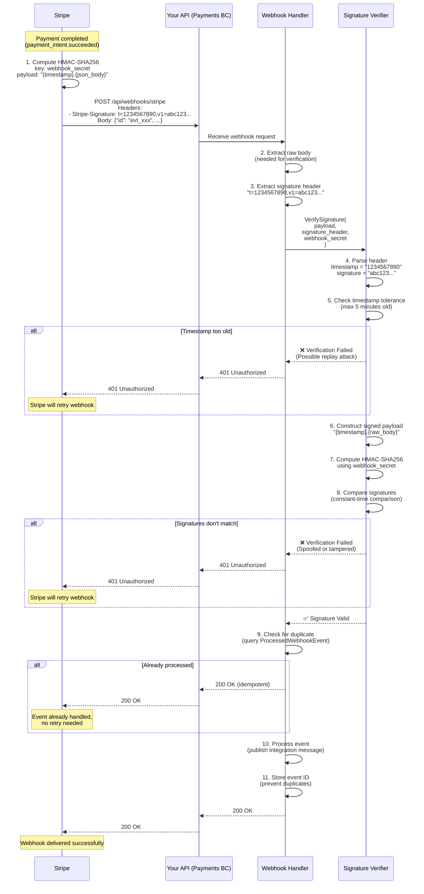

# Stripe Webhook Security: Signature Verification Flow

This diagram illustrates how Stripe webhook signature verification works to prevent webhook spoofing attacks.

## Overview

Stripe signs every webhook with HMAC-SHA256 using your webhook secret. You must verify this signature to ensure the webhook came from Stripe and hasn't been tampered with.

## Signature Verification Flow



## Security Properties

### 1. **Authenticity** (Verified by HMAC)
The webhook came from Stripe and hasn't been tampered with. Only someone with the webhook secret can generate a valid signature.

### 2. **Freshness** (Verified by Timestamp)
The webhook was recently sent. Old webhooks are rejected to prevent replay attacks where an attacker resends captured webhooks.

### 3. **Idempotency** (Verified by Event ID)
Even if Stripe sends the same event multiple times (due to retries), it's only processed once.

## Code Example

```csharp
private static bool VerifyWebhookSignature(
    string payload,
    string signatureHeader,
    string webhookSecret)
{
    // 1. Parse signature header: t=timestamp,v1=signature
    var elements = signatureHeader.Split(',');
    var timestamp = "";
    var signature = "";

    foreach (var element in elements)
    {
        var parts = element.Split('=', 2);
        if (parts[0] == "t") timestamp = parts[1];
        else if (parts[0] == "v1") signature = parts[1];
    }

    // 2. Check timestamp tolerance (prevent replay attacks)
    var eventTimestamp = DateTimeOffset.FromUnixTimeSeconds(long.Parse(timestamp));
    var age = DateTimeOffset.UtcNow - eventTimestamp;

    if (age > TimeSpan.FromMinutes(5))
    {
        return false; // Event too old
    }

    // 3. Construct signed payload: {timestamp}.{rawBody}
    var signedPayload = $"{timestamp}.{payload}";

    // 4. Compute HMAC-SHA256 signature
    using var hmac = new HMACSHA256(Encoding.UTF8.GetBytes(webhookSecret));
    var hash = hmac.ComputeHash(Encoding.UTF8.GetBytes(signedPayload));
    var computedSignature = BitConverter.ToString(hash)
        .Replace("-", "")
        .ToLowerInvariant();

    // 5. Constant-time comparison (prevents timing attacks)
    return CryptographicEquals(signature, computedSignature);
}

private static bool CryptographicEquals(string a, string b)
{
    if (a.Length != b.Length) return false;

    var areEqual = true;
    for (var i = 0; i < a.Length; i++)
    {
        areEqual &= a[i] == b[i]; // Bitwise AND (always checks all chars)
    }

    return areEqual;
}
```

## Attack Scenarios Prevented

### ❌ Webhook Spoofing
**Attack:** Malicious actor sends fake webhook to `/api/webhooks/stripe`

**Example:**
```bash
curl -X POST http://your-api.com/api/webhooks/stripe \
  -H "Content-Type: application/json" \
  -d '{"id": "evt_fake", "type": "payment_intent.succeeded", ...}'
```

**Defense:** Without valid HMAC signature computed with webhook secret, verification fails → 401 Unauthorized

---

### ❌ Replay Attack
**Attack:** Attacker captures valid webhook and resends it later

**Example:**
1. Attacker intercepts legitimate webhook (timestamp: Jan 1, 2026)
2. Attacker resends same webhook on Jan 2, 2026

**Defense:** Timestamp tolerance check rejects events older than 5 minutes → 401 Unauthorized

---

### ❌ Man-in-the-Middle Tampering
**Attack:** Attacker intercepts webhook and modifies payload (e.g., change amount)

**Example:**
```json
// Original: {"amount": 1999}
// Tampered: {"amount": 1}
```

**Defense:** HMAC signature is computed over entire payload. Any modification invalidates signature → 401 Unauthorized

---

### ❌ Timing Attack
**Attack:** Attacker measures response time differences to guess signature

**Example:**
- If signature comparison exits early on mismatch, attacker can guess bytes one at a time
- Response time varies based on how many bytes match before mismatch

**Defense:** Constant-time comparison always checks all characters → No timing information leakage

## Configuration

### Development (User Secrets)

```bash
dotnet user-secrets set "Stripe:WebhookSecret" "whsec_xxx"
```

### Production (Environment Variable)

```bash
export STRIPE_WEBHOOK_SECRET="whsec_xxx"
```

### Retrieving Webhook Secret from Stripe Dashboard

1. Go to Stripe Dashboard → Developers → Webhooks
2. Click on your webhook endpoint
3. Click "Reveal" next to "Signing secret"
4. Copy `whsec_xxx` value

### Local Testing with Stripe CLI

```bash
# Forward webhooks to local API
stripe listen --forward-to http://localhost:5232/api/webhooks/stripe

# Stripe CLI prints webhook secret:
# > Ready! Your webhook signing secret is whsec_xxx (^C to quit)
```

Use this secret in your local `appsettings.Development.json` or user secrets.

## Testing Signature Verification

### Unit Test (Invalid Signature)

```csharp
[Fact]
public void WebhookHandler_WithInvalidSignature_Returns401()
{
    var payload = "{\"id\": \"evt_test\"}";
    var invalidSignature = "t=1234567890,v1=invalid";
    var webhookSecret = "whsec_test_secret";

    var result = VerifyWebhookSignature(payload, invalidSignature, webhookSecret);

    result.ShouldBeFalse();
}
```

### Integration Test (Valid Signature)

```csharp
[Fact]
public async Task WebhookEndpoint_WithValidSignature_Returns200()
{
    var fixture = new PaymentsTestFixture();
    
    var payload = "{\"id\": \"evt_test\", \"type\": \"payment_intent.succeeded\"}";
    var signature = ComputeTestSignature(payload, fixture.WebhookSecret);

    var response = await fixture.Host.Scenario(s =>
    {
        s.Post.Json(payload).ToUrl("/api/webhooks/stripe");
        s.WithRequestHeader("Stripe-Signature", signature);
        s.StatusCodeShouldBe(200);
    });
}
```

## Best Practices

✅ **Always verify signature** — Never process webhooks without verification  
✅ **Use constant-time comparison** — Prevents timing attacks  
✅ **Check timestamp tolerance** — Prevents replay attacks  
✅ **Store processed event IDs** — Prevents duplicate processing  
✅ **Use HTTPS in production** — Prevents eavesdropping  
✅ **Rotate webhook secrets periodically** — Limit blast radius of leaked secrets  
✅ **Log verification failures** — Monitor for suspicious activity  
✅ **Return 200 OK for processed events** — Even duplicates (idempotent)

## References

- [Stripe Webhook Security Docs](https://stripe.com/docs/webhooks/signatures) (external)
- Code Example: `docs/examples/stripe/StripeWebhookHandlerExample.cs`
- Research Spike: `docs/planning/spikes/stripe-api-integration.md`
