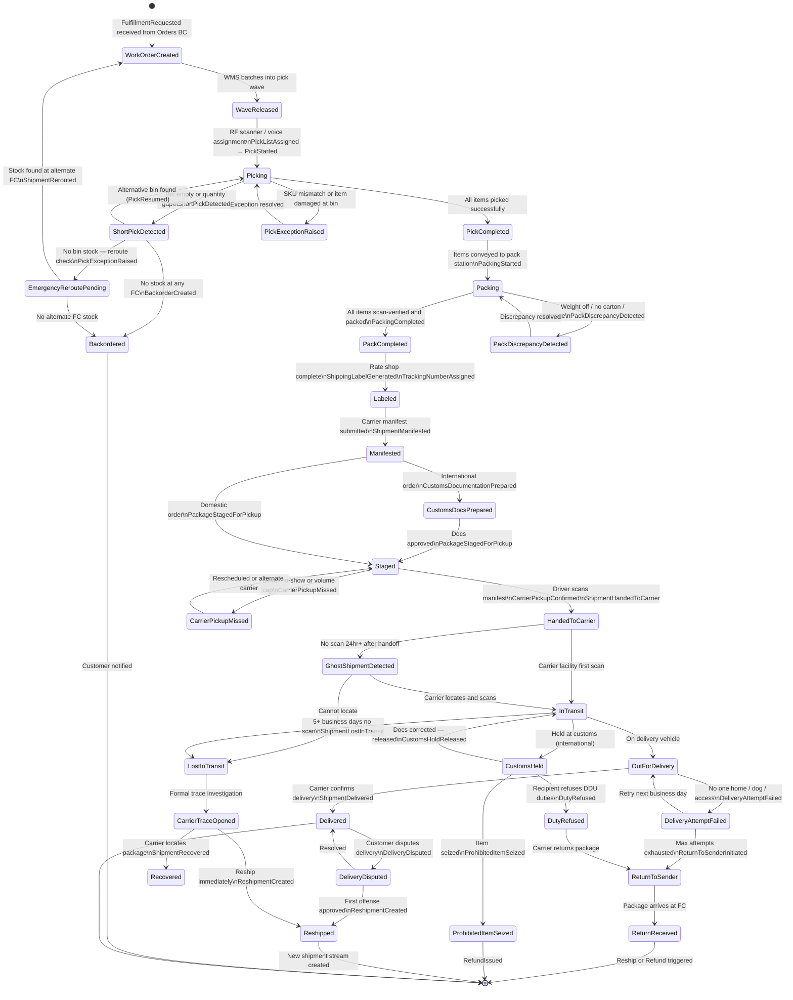
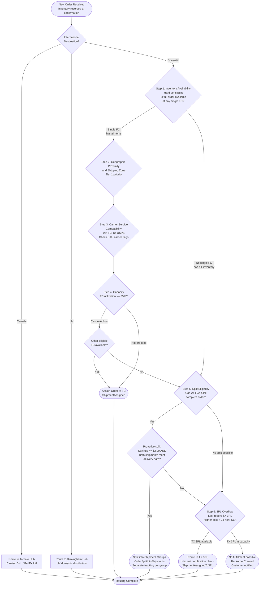
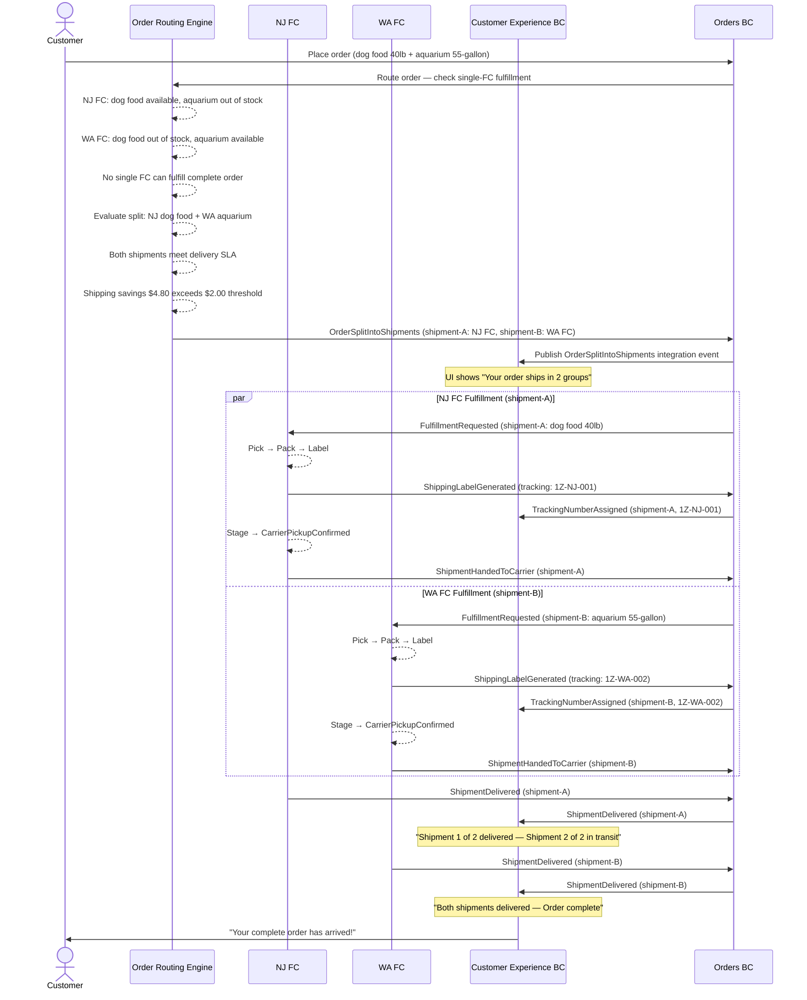

# CritterSupply Fulfillment Operations: Realistic Workflows

**Document Owner:** UX Engineering  
**Audience:** Software engineers, domain modelers, QA, product  
**Scope:** Physical fulfillment lifecycle — from work order release through last-mile delivery and all exception paths  
**Last Updated:** 2026-03-08

---

## Table of Contents

1. [FC & Carrier Reference](#1-fc--carrier-reference)
2. [Shipment Lifecycle State Machine](#2-shipment-lifecycle-state-machine)
3. [Warehouse Routing Decision Flowchart](#3-warehouse-routing-decision-flowchart)
4. [International vs. Domestic Workflow Comparison](#4-international-vs-domestic-workflow-comparison)
5. [Sad Path Catalog](#5-sad-path-catalog)
6. [Compensation Event Catalog](#6-compensation-event-catalog)
7. [Multi-Warehouse Split Workflow](#7-multi-warehouse-split-workflow)
8. [SLA & Cutoff Time Reference](#8-sla--cutoff-time-reference)
9. [Domain Event Master List](#9-domain-event-master-list)
10. [UX Implications](#10-ux-implications)

---

## 1. FC & Carrier Reference

### Fulfillment Centers

| FC | Location | Ownership | Timezone | Notes |
|----|----------|-----------|----------|-------|
| NJ FC | Newark, NJ | CritterSupply-owned | Eastern | Drop-and-hook dock; East Coast primary |
| OH FC | Columbus, OH | CritterSupply-owned | Eastern | Drop-and-hook dock; Midwest primary; returns capable |
| WA FC | Kent, WA | CritterSupply-owned | Pacific | No USPS commercial pickup; no returns processing |
| TX FC | Dallas, TX | Partially 3PL | Central | 3PL overflow; hazmat-certified; higher cost; 24–48hr SLA |
| Toronto Hub | Toronto, ON | CritterSupply-owned | Eastern | Canada-only; USMCA corridor |
| Birmingham Hub | Birmingham, UK | CritterSupply-owned | GMT/BST | UK commercial import; domestic UK distribution |

### Carrier Capabilities by FC

| FC | UPS | FedEx | USPS | DHL | FedEx Intl |
|----|-----|-------|------|-----|------------|
| NJ FC | ✅ | ✅ | ✅ | ❌ | ❌ |
| OH FC | ✅ | ✅ | ✅ | ❌ | ❌ |
| WA FC | ✅ | ✅ | ❌ | ❌ | ❌ |
| TX FC | ✅ | ✅ | ✅ | ❌ | ❌ |
| Toronto Hub | ✅ | ✅ | ❌ | ✅ | ✅ |
| Birmingham Hub | ❌ | ✅ | ❌ | ✅ | ✅ |

---

## 2. Shipment Lifecycle State Machine

This diagram covers the complete shipment lifecycle including all happy-path intermediate states and all documented exception branches. States map directly to domain events on the Shipment aggregate.



---

## 3. Warehouse Routing Decision Flowchart

The Order Routing Engine evaluates FCs in strict priority order. Inventory is reserved at order confirmation — not at pick time.



---

## 4. International vs. Domestic Workflow Comparison

This comparison highlights the conditional customs documentation branch that separates international and domestic paths after packing is complete.

```mermaid
flowchart LR
    subgraph Shared ["Shared Steps — All Orders"]
        A[WorkOrderCreated] --> B[WaveReleased]
        B --> C[Picking\nPickListAssigned to ItemPicked]
        C --> D[PickCompleted]
        D --> E[Packing\nPackingStarted to ItemVerifiedAtPack]
        E --> F[PackCompleted]
        F --> G[Labeling\nRate shop\nShippingLabelGenerated\nTrackingNumberAssigned]
        G --> H[ShipmentManifested]
    end

    H --> BRANCH{Domestic\nor International?}

    subgraph Domestic ["Domestic Path"]
        BRANCH -- Domestic --> D1[PackageStagedForPickup]
        D1 --> D2[CarrierPickupConfirmed\nShipmentHandedToCarrier]
        D2 --> D3[ShipmentInTransit]
        D3 --> D4[OutForDelivery]
        D4 --> D5[ShipmentDelivered]
    end

    subgraph International ["International Path"]
        BRANCH -- International --> I1{Canada\nor UK?}
        I1 -- Canada to Toronto Hub --> I2[Customs Docs\nCommercial Invoice\nUSMCA Certificate of Origin\nHS codes plus declared value]
        I1 -- UK to Birmingham Hub --> I3[Bulk commercial import\nCustoms at hub level\nHS tariff codes]
        I2 --> I4[CustomsDocumentationPrepared]
        I3 --> I4
        I4 --> I5[PackageStagedForPickup]
        I5 --> I6[CarrierPickupConfirmed\nDHL or FedEx International]
        I6 --> I7[ShipmentInTransit]
        I7 --> I8{Customs\nClearance?}
        I8 -- Cleared --> I9[OutForDelivery\nLocal carrier handoff]
        I9 --> I10[ShipmentDelivered]
        I8 -- Held --> I11[CustomsHoldInitiated\ncarrier-reported event]
        I11 --> I12{Hold\nResolution}
        I12 -- Docs corrected --> I13[CustomsHoldReleased]
        I13 --> I9
        I12 -- Prohibited item --> I14[ProhibitedItemSeized\nRefundIssued]
        I12 -- DDU refused --> I15[DutyRefused\nReturnToSenderInitiated]
    end
```



**Key differences at a glance:**

| Dimension | Domestic | International |
|-----------|----------|---------------|
| FC assignment | NJ / OH / WA / TX based on routing engine | Canada → Toronto always; UK → Birmingham always |
| Customs docs step | None | Required before staging: commercial invoice, HS codes, declared value, country of origin |
| USMCA | N/A | Canada: certificate of origin for US-origin goods under ~CAD $150 |
| Duty model | N/A | DDP preferred (landed cost at checkout); DDU avoided but possible |
| Carrier | UPS / FedEx / USPS | DHL / FedEx International |
| Customs events | None | `CustomsHoldInitiated`, `CustomsHoldReleased`, `ProhibitedItemSeized`, `DutyRefused` — all carrier/authority-reported integration events |
| Post-delivery complexity | Standard | DDU refusal creates RTS loop then reship-or-refund decision |

---

## 5. Sad Path Catalog

For each sad path: what triggers it, what the system does, what domain events it produces, and what the customer sees.

---

### 5.1 Short Pick / Stockout at Assigned Warehouse

| Field | Detail |
|-------|--------|
| **Trigger** | Picker arrives at bin; bin is empty, quantity is insufficient, or a cycle-count variance exists |
| **System Response** | 1. Check alternative bins in the same FC → if found, resume pick<br>2. If no bin stock: check other FCs for emergency re-route<br>3. If no other FC has stock: create backorder and notify customer |
| **Events** | `ShortPickDetected` → `PickExceptionRaised` → `ShipmentRerouted` (if rerouted) OR `BackorderCreated` (if no stock anywhere) |
| **Customer Sees** | Nothing during reroute (transparent). Backorder: "Your order is slightly delayed — we're locating your items." |
| **UX Note** | Never surface rerouting to the customer. Only surface backorder. Estimated backorder date must come from Inventory BC. |

---

### 5.2 Address Validation Failure (6 Types)

| Type | Description | System Response | Events |
|------|-------------|-----------------|--------|
| **Undeliverable** | Address does not exist in carrier database | Block checkout; require correction | `AddressValidationFailed` (subtype: Undeliverable) |
| **Correctable** | Minor typo; carrier suggests correction | Suggest correction at checkout; customer approves | `AddressCorrectionSuggested`, `AddressCorrected` |
| **Incomplete** | Missing apartment or unit number | Prompt for additional detail | `AddressValidationFailed` (subtype: Incomplete) |
| **PO Box Conflict** | Item restricted from PO Box (hazmat, oversized) | Inform customer at checkout; require physical address | `AddressValidationFailed` (subtype: POBoxConflict) |
| **APO/FPO** | Military address; carrier restrictions apply | Allow USPS only; block UPS/FedEx | `AddressValidationFailed` (subtype: APOFPOCarrierRestriction) |
| **Carrier Reject at Label Gen** | Address passes initial validation but carrier API rejects at label time | Halt labeling; email customer requesting correction | `ShippingLabelFailed`, `AddressValidationFailed` (subtype: CarrierRejected) |

---

### 5.3 Post-Placement Address Change

| Stage at Change Request | Action | Cost | Events |
|-------------------------|--------|------|--------|
| **Pre-pick** | Update address directly; re-run validation | $0 | `ShippingAddressUpdated` |
| **Picked, not yet labeled** | Update address on Shipment aggregate; re-run validation | $0 | `ShippingAddressUpdated`, `ShipmentAddressUpdated` |
| **Staged (labeled, not yet handed over)** | Void label; generate new label with corrected address | Label fee only | `ShippingLabelVoided`, `ShippingLabelGenerated` |
| **With carrier** | Carrier intercept request submitted ($15–20 fee charged to customer) | $15–20 | `CarrierInterceptRequested`, `CarrierInterceptConfirmed` OR `CarrierInterceptFailed` |

If intercept fails: voluntary recall initiated (prepaid return label to customer), reship to corrected address.
Customer is always notified of intercept fee before it is charged.

---

### 5.4 Carrier Pickup Delay / Miss

| Field | Detail |
|-------|--------|
| **Trigger** | Carrier driver does not arrive within scheduled pickup window; or carrier volume cap prevents pickup |
| **System Response** | 1. Dock supervisor escalation (immediate)<br>2. Carrier relations contact (after 1hr)<br>3. Alternate carrier arranged if available<br>4. Will-call (CritterSupply delivers to carrier facility) — extreme only |
| **Events** | `CarrierPickupMissed` → `CarrierRelationsEscalated` → `AlternateCarrierArranged` OR `WillCallInitiated` |
| **Customer Sees** | If delay exceeds SLA breach: proactive email "Your shipment may be delayed by one business day." |

---

### 5.5 Lost in Transit

| Field | Detail |
|-------|--------|
| **Trigger** | 5 or more business days with no carrier scan after `ShipmentHandedToCarrier` |
| **System Response** | 1. `ShipmentLostInTransit` flagged automatically<br>2. Carrier trace opened: UPS/FedEx 8-day trace window; USPS 15-day window<br>3. Reship dispatched immediately — do not wait for trace resolution<br>4. Carrier claim filed after trace period<br>5. If original package later delivered: customer keeps both (double delivery; no forced return) |
| **Events** | `ShipmentLostInTransit`, `CarrierTraceOpened`, `ReshipmentCreated`, `CarrierClaimFiled`, `CarrierClaimSettled` |
| **Customer Sees** | Proactive email day 5: "We can't locate your shipment. We're reshipping your order immediately." New tracking number shown. |
| **UX Note** | Show reship tracking number prominently. Mark original shipment "Lost — Replacement Shipped." Do not remove it from order history. |

---

### 5.6 Damaged Goods

#### Customer-Reported Damage

| Field | Detail |
|-------|--------|
| **Trigger** | Customer contacts CS reporting damaged item on delivery |
| **System Response** | 1. CS verifies (photo evidence requested for items ≥$75)<br>2. Items under $75: reship or refund; no return required<br>3. Items $75 or more: reship or refund; prepaid return label issued |
| **Events** | `DamageReportReceived`, `DamageVerified`, `ReshipmentCreated` OR `RefundIssued`, `CarrierClaimFiled` (if carrier fault) |
| **Customer Sees** | CS response within 4hr: "We'll reship or refund — your choice." |

#### Carrier DOA Return (Damaged in Transit)

| Field | Detail |
|-------|--------|
| **Trigger** | Carrier returns package to FC marked "damaged in transit" |
| **System Response** | 1. Receive and scan at FC<br>2. Grade A/B/C inspection<br>3. Grade A → restock; Grade B → open-box; Grade C → dispose<br>4. Carrier claim filed within 60–90 day window<br>5. Systemic damage pattern → escalate to carrier relations |
| **Events** | `ReturnReceived`, `ReturnInspectionCompleted` (with grade), `InventoryAdjusted`, `CarrierClaimFiled` |
| **Customer Sees** | Already reshipped or refunded before FC receives DOA return |

---

### 5.7 Delivery Failure (No One Home / Access Issue)

| Field | Detail |
|-------|--------|
| **Trigger** | Carrier reports delivery exception: "No one home," "Dog!" (actual carrier code), "No access," "Refused" |
| **System Response** | 1. Attempt 1: Leave notice; retry next business day<br>2. Attempt 2: Second notice; hold at local facility option surfaced<br>3. Attempt 3: Final notice; return to sender initiated<br>4. RTS takes 5–15 business days to reach FC |
| **Events** | `DeliveryAttemptFailed` (×1–3) → `ReturnToSenderInitiated` → `ReturnReceived` → `ReshipmentCreated` OR `RefundIssued` |
| **Customer Sees** | Email after each failed attempt with option to schedule redelivery or redirect to pickup location; final email after RTS |
| **UX Note** | Carrier-specific tools (UPS My Choice, FedEx Delivery Manager) should be surfaced in the tracking UI as contextual action links |

---

### 5.8 Customs Hold (International)

| Type | Description | Resolution | SLA |
|------|-------------|------------|-----|
| **Documentation Error** | Missing HS code, incorrect declared value, or missing country of origin | CritterSupply submits corrected entry via customs broker | 2–5 business days |
| **Prohibited Item** | Item prohibited in destination country (e.g., certain aerosols, pet medications) | Item seized by customs authority; refund issued | Varies; often permanent |
| **DDU Duty Refusal** | Customer refuses to pay import duties on DDU shipment | Package returned to sender; customer offered reship (DDP) or full refund | 5–15 business days |
| **Random Inspection** | Routine inspection by customs authority | Wait for clearance; no action required by CritterSupply | 2–15 business days |

---

### 5.9 Hazmat Handling

| Field | Detail |
|-------|--------|
| **Items Affected** | ORM-D / Limited Quantity: flea treatments (Frontline, Seresto), aerosol sprays, lithium batteries in pet cameras and auto-feeders |
| **Air Exclusion** | Cannot ship via air — no 2-day or overnight service; ground only |
| **3PL Requirement** | TX 3PL partner must hold hazmat certification to handle these SKUs |
| **International Block** | Country-level restrictions enforced at routing engine; hazmat SKUs blocked from international shipping if destination prohibits |
| **Events** | `HazmatItemFlagged`, `HazmatShippingRestrictionApplied`, `HazmatItemBlockedFromInternational` |
| **Pick/Pack SLA** | 6 hours (vs. 4 hours standard) |
| **Customer Sees** | "Ground shipping only" note on PDP and at checkout; for international: "This item cannot ship to your destination" at PDP/cart level |

---

## 6. Compensation Event Catalog

Compensation events are triggered when something goes wrong after custody has transferred. They represent corrective business actions with traceable audit trails.

---

### 6.1 Shipment Recall / Carrier Intercept

| Step | Action | Event |
|------|--------|-------|
| 1 | CritterSupply requests carrier intercept ($15–20 fee) | `CarrierInterceptRequested` |
| 2a | Carrier confirms intercept | `CarrierInterceptConfirmed` |
| 2b | Carrier cannot intercept | `CarrierInterceptFailed` |
| 3 (if failed) | Voluntary recall: prepaid return label sent to customer | `VoluntaryRecallInitiated` |
| 4 | Customer returns item | `RecallReturnReceived` |
| 5 | Reship to correct address or refund | `ReshipmentCreated` OR `RefundIssued` |
| Safety recall only | CPSC coordination required | `CPSCRecallCoordinated` |

**Customer sees:** Email explaining the issue, intercept fee disclosure before charge, and reship/refund choice.

---

### 6.2 Damaged in Transit — Carrier Claim

| Step | Action | Event |
|------|--------|-------|
| 1 | Customer reports or FC receives DOA return | `DamageReportReceived` |
| 2 | Replacement shipped immediately — do not wait for claim resolution | `ReshipmentCreated` |
| 3 | Carrier claim filed within 60–90 day window | `CarrierClaimFiled` |
| 4 | Declared value insurance assessed for items over $100 | `InsuranceCoverageApplied` |
| 5 | Carrier settles claim | `CarrierClaimSettled` |
| 6 | Manufacturer packaging failure: vendor chargeback initiated | `VendorChargebackInitiated` |

---

### 6.3 "Carrier Says Delivered" — Customer Disputes

| Offense | Action | Events |
|---------|--------|--------|
| **First offense** | Reship or full refund; no questions asked | `DeliveryDisputed`, `ReshipmentCreated` OR `RefundIssued` |
| **Second offense (within 12 months)** | Fraud review initiated; CS makes final decision | `DeliveryDisputed`, `FraudReviewInitiated`, `FraudReviewCompleted` |
| **Third offense and beyond** | Signature required on all future shipments for this customer | `SignatureRequirementFlaggedForCustomer` |

**UX Note:** This is a human judgment call. The CS UI must surface offense count and enable decision recording with rationale. The outcome must never be automated.

---

### 6.4 Returns and Reverse Logistics

| Step | Action | Event |
|------|--------|-------|
| 1 | Customer requests return; RMA generated | `ReturnMerchandiseAuthorizationCreated` |
| 2 | Prepaid return label issued (if CritterSupply fault) | `ReturnLabelGenerated` |
| 3 | Return routed to nearest returns-capable FC (WA FC cannot process returns — routes to OH FC) | `ReturnRoutedToFC` |
| 4 | FC receives and scans returned package | `ReturnReceived` |
| 5 | Grade A/B/C inspection performed | `ReturnInspectionCompleted` |
| 6 | Refund triggered on receipt plus inspection | `RefundIssued` |
| 6b | Undisclosed damage found — refund withheld | `RefundWithheld` |
| 7 | Inventory adjustment published to Inventory BC | `InventoryAdjusted` |

**BC coupling note:** `ReturnInspectionCompleted` triggers both `RefundIssued` (to Payments BC) and `InventoryAdjusted` (to Inventory BC). This is an explicit Returns BC ↔ Inventory BC coupling point requiring careful integration contract management.

---

## 7. Multi-Warehouse Split Workflow



### Split Order Rules

| Rule | Detail |
|------|--------|
| **Trigger conditions** | No single FC can fulfill complete order; OR proactive split saves ≥$2.00 shipping and both shipments meet delivery date |
| **Delivery date constraint** | Both shipments must still meet the promised delivery date — no split that pushes either group past the promise |
| **Savings threshold** | Proactive split requires ≥$2.00 shipping cost savings |
| **Cost absorption** | CritterSupply absorbs extra shipping for inventory-driven splits; customer pays for customer-requested splits (waived for loyalty members) |
| **Customer experience** | Single order confirmation email; separate tracking numbers per shipment group; UI shows shipment group cards |
| **Failure handling** | Each shipment is independent for loss/damage resolution; CS views holistically via same order ID |

---

## 8. SLA & Cutoff Time Reference

### Carrier Cutoff Times

| FC | Cutoff Time | Timezone |
|----|-------------|----------|
| NJ FC | 2:00 PM | Eastern (ET) |
| OH FC | 1:00 PM | Eastern (ET) |
| WA FC | 12:00 PM | Pacific (PT) |
| TX FC | 1:00 PM | Central (CT) |
| Toronto Hub | 11:00 AM | Eastern (ET) |
| Birmingham Hub | 10:00 AM | GMT / BST |

> **Note:** SLA is measured in **business hours** against FC operating hours (6 AM – 10 PM local time), not calendar clock hours. An order placed at 9 PM does not start its SLA clock until 6 AM the next morning.

### Pick/Pack SLA by Order Type

| Order Type | Pick/Pack SLA |
|------------|---------------|
| Standard | 4 hours |
| Expedited | 2 hours |
| Hazmat | 6 hours |
| 3PL (TX) | 8–24 hours |
| Temperature-sensitive | 4 hours + cold pack confirmation required |

### SLA Escalation Thresholds

| Threshold | Action | Notified |
|-----------|--------|---------|
| 50% of SLA elapsed | Supervisor alert generated | FC Supervisor |
| 75% of SLA elapsed | Escalation raised | Operations Manager |
| 100% of SLA elapsed (breach) | Urgent escalation; customer hold initiated (max 2hr additional) | Operations Manager + urgent flag |
| 5% or more miss rate across FC | Pattern escalation | Director of Fulfillment |

### International SLA Additions

| Stage | SLA |
|-------|-----|
| Customs clearance (standard) | 1–3 business days |
| Customs hold — documentation error | 2–5 business days |
| Customs hold — complex or contested case | 2–15 business days |
| DDU refusal resolution | 5–15 business days |

### Temperature-Sensitive Items

| Service Level | Cold Pack Duration |
|---------------|--------------------|
| Standard ground | 24-hour cold pack |
| Expedited 2-day | 48-hour cold pack |
| Overnight | 24-hour cold pack |

---

## 9. Domain Event Master List

All events are categorized by the fulfillment stage that produces them. Events marked *(integration)* are published to the message bus for cross-BC consumption. Events marked *(carrier)* originate from external carrier systems and are translated into domain events at the integration boundary.

### Stage 1: Work Order and Wave

| Event | Producer | Notes |
|-------|----------|-------|
| `WorkOrderCreated` | Fulfillment BC | Triggered by `FulfillmentRequested` from Orders BC |
| `WaveReleased` | Fulfillment BC / WMS | WMS batches shipments into pick wave |

### Stage 2: Picking

| Event | Producer | Notes |
|-------|----------|-------|
| `PickListAssigned` | Fulfillment BC / WMS | Associates picker (RF scanner or voice-directed) with wave |
| `PickStarted` | Fulfillment BC / WMS | Picker begins at first bin location |
| `ItemPicked` | Fulfillment BC / WMS | Per-item confirmation scan |
| `PickCompleted` | Fulfillment BC | All items in wave accounted for |
| `ShortPickDetected` | Fulfillment BC / WMS | Bin empty or insufficient quantity found |
| `PickExceptionRaised` | Fulfillment BC | SKU mismatch, bin damage, or unresolvable short pick |
| `PickResumed` | Fulfillment BC | Alternative bin found; pick continues |
| `ShipmentRerouted` | Fulfillment BC *(integration)* | Emergency re-route to alternate FC |
| `BackorderCreated` | Fulfillment BC *(integration)* | No stock at any FC; customer notification triggered |

### Stage 3: Packing

| Event | Producer | Notes |
|-------|----------|-------|
| `PackingStarted` | Fulfillment BC | Items arrive at pack station |
| `ItemVerifiedAtPack` | Fulfillment BC | SVP (scan-verify-pack) confirmation per item |
| `PackingCompleted` | Fulfillment BC | All items packed; carton sealed |
| `PackDiscrepancyDetected` | Fulfillment BC | Weight mismatch, no valid carton size, or damage in transit to station |
| `HazmatItemFlagged` | Fulfillment BC | Item identified as ORM-D or Limited Quantity |
| `HazmatShippingRestrictionApplied` | Fulfillment BC | Ground-only or international block applied |
| `ColdPackApplied` | Fulfillment BC | Temperature-sensitive item; cold pack included and confirmed |

### Stage 4: Labeling and Manifesting

| Event | Producer | Notes |
|-------|----------|-------|
| `ShippingLabelGenerated` | Fulfillment BC | Rate shop complete; carrier and service selected; DIM weight calculated |
| `TrackingNumberAssigned` | Fulfillment BC *(integration)* | **First moment tracking number exists**; published to Orders BC and Customer Experience BC |
| `ShipmentManifested` | Fulfillment BC | Carrier manifest submitted (shipment tendered) |
| `ShippingLabelVoided` | Fulfillment BC | Label voided for address correction or carrier change |
| `ShippingLabelFailed` | Fulfillment BC | Carrier API rejected label generation |

### Stage 5: Customs Documentation (International Only)

| Event | Producer | Notes |
|-------|----------|-------|
| `CustomsDocumentationPrepared` | Fulfillment BC | Commercial invoice, HS codes, declared value, country of origin filed |
| `USMCACertificateOfOriginIssued` | Fulfillment BC | Canada orders; US-origin goods under USMCA duty threshold (~CAD $150) |

### Stage 6: Staging and Carrier Pickup

| Event | Producer | Notes |
|-------|----------|-------|
| `PackageStagedForPickup` | Fulfillment BC | Package at outbound dock, organized by carrier and pickup time |
| `CarrierPickupConfirmed` | Fulfillment BC | Driver scans manifest; physical custody transfers |
| `ShipmentHandedToCarrier` | Fulfillment BC *(integration)* | Published to Orders BC; triggers tracking activation in Customer Experience |
| `CarrierPickupMissed` | Fulfillment BC | Driver did not arrive or volume cap exceeded |
| `CarrierRelationsEscalated` | Fulfillment BC | Internal escalation after missed pickup |
| `AlternateCarrierArranged` | Fulfillment BC | Different carrier assigned after failed pickup |
| `WillCallInitiated` | Fulfillment BC | CritterSupply will deliver package to carrier facility directly |

### Stage 7: In Transit (Carrier-Reported Events)

| Event | Producer | Notes |
|-------|----------|-------|
| `ShipmentInTransit` | Fulfillment BC *(carrier)* | Carrier facility first inbound scan |
| `OutForDelivery` | Fulfillment BC *(carrier)* | Package loaded on local delivery vehicle |
| `GhostShipmentDetected` | Fulfillment BC | No scan 24hr or more after handoff |
| `ShipmentLostInTransit` | Fulfillment BC *(integration)* | 5 or more business days without a carrier scan |
| `CarrierTraceOpened` | Fulfillment BC | Formal carrier trace investigation initiated |
| `ShipmentRecovered` | Fulfillment BC | Carrier locates previously lost package |

### Stage 8: Customs and International (Carrier-Reported)

| Event | Producer | Notes |
|-------|----------|-------|
| `CustomsHoldInitiated` | Fulfillment BC *(carrier integration)* | Package held by customs authority; carrier-reported |
| `CustomsHoldReleased` | Fulfillment BC *(carrier integration)* | Package cleared; in-transit resumes |
| `ProhibitedItemSeized` | Fulfillment BC *(carrier integration)* | Item confiscated by customs authority |
| `DutyRefused` | Fulfillment BC *(carrier integration)* | DDU recipient declines to pay import duties |
| `HazmatItemBlockedFromInternational` | Fulfillment BC | Routing engine block applied at order routing time |

### Stage 9: Delivery

| Event | Producer | Notes |
|-------|----------|-------|
| `ShipmentDelivered` | Fulfillment BC *(carrier + integration)* | Carrier confirms delivery |
| `DeliveryAttemptFailed` | Fulfillment BC *(carrier)* | Failed delivery attempt (1st, 2nd, or 3rd of maximum 3) |
| `ReturnToSenderInitiated` | Fulfillment BC *(carrier + integration)* | Maximum attempts exhausted; package returning |
| `DeliveryDisputed` | Fulfillment BC / CS | Customer disputes carrier-reported delivered status |

### Stage 10: Address Events

| Event | Producer | Notes |
|-------|----------|-------|
| `AddressValidationFailed` | Orders BC | 6 subtypes; can occur at checkout or at label generation |
| `AddressCorrectionSuggested` | Orders BC | Carrier suggests a corrected address form |
| `AddressCorrected` | Orders BC | Customer or CS accepts the correction |
| `ShippingAddressUpdated` | Orders BC *(integration)* | Post-placement address change recorded |
| `CarrierInterceptRequested` | Fulfillment BC | Late address change; package already with carrier |
| `CarrierInterceptConfirmed` | Fulfillment BC *(carrier)* | Carrier confirms it will redirect package |
| `CarrierInterceptFailed` | Fulfillment BC *(carrier)* | Carrier cannot intercept package |

### Stage 11: Routing Events

| Event | Producer | Notes |
|-------|----------|-------|
| `ShipmentAssigned` | Order Routing Engine | FC selected for fulfillment |
| `ShipmentAssignedTo3PL` | Order Routing Engine | TX 3PL selected as last resort |
| `OrderSplitIntoShipments` | Order Routing Engine *(integration)* | Multi-FC split; generates separate tracking groups |

### Stage 12: Compensation Events

| Event | Producer | Notes |
|-------|----------|-------|
| `ReshipmentCreated` | Fulfillment BC *(integration)* | New shipment stream opened for replacement |
| `RefundIssued` | Payments BC *(integration)* | Triggered by Returns, CS decision, or Fulfillment |
| `RefundWithheld` | Returns BC | Undisclosed damage found during return inspection |
| `CarrierClaimFiled` | Fulfillment BC | Formal carrier insurance and liability claim opened |
| `CarrierClaimSettled` | Fulfillment BC *(carrier)* | Claim resolution received from carrier |
| `InsuranceCoverageApplied` | Fulfillment BC | Declared value coverage triggered for items over $100 |
| `VendorChargebackInitiated` | Fulfillment BC | Manufacturer packaging failure identified |
| `VoluntaryRecallInitiated` | Fulfillment BC *(integration)* | Failed intercept triggers voluntary product recall |
| `CPSCRecallCoordinated` | Fulfillment BC | Safety recall requiring CPSC agency coordination |
| `FraudReviewInitiated` | Orders BC / CS | Second-offense "carrier says delivered" dispute |
| `FraudReviewCompleted` | Orders BC / CS | Human CS decision recorded in system |
| `SignatureRequirementFlaggedForCustomer` | Orders BC | Permanent consequence applied for third-offense customer |
| `InventoryAdjusted` | Inventory BC *(integration)* | Returns to Inventory BC coupling; restock or grade downgrade |
| `ReturnMerchandiseAuthorizationCreated` | Returns BC | RMA issued to customer |
| `ReturnLabelGenerated` | Returns BC / Fulfillment BC | Prepaid return shipping label created |
| `ReturnRoutedToFC` | Returns BC | Return directed to returns-capable FC |
| `ReturnReceived` | Returns BC | FC scans and accepts returned package |
| `ReturnInspectionCompleted` | Returns BC | Grade A, B, or C assigned after physical inspection |

---

## 10. UX Implications

The following section describes what this fulfillment architecture means concretely for the **Customer Experience bounded context** — specifically the order tracking UI, notifications, error states, and split shipment display.

---

### 10.1 Tracking Number Availability

**Critical UX constraint:** Tracking numbers do not exist at order placement. They are generated at label creation (Stage 4), which happens after picking and packing.

| State | What the UI Shows |
|-------|-------------------|
| Order placed through WorkOrderCreated | "We've received your order and are preparing it for shipment." No tracking number shown. |
| Picking and Packing in progress | "Your order is being prepared at our [FC name] fulfillment center." Progress indicator shown; no tracking link. |
| `TrackingNumberAssigned` received | Tracking number becomes available. UI updates in real time via SignalR. "Your order has shipped!" CTA: "Track your shipment" links to carrier. |

**Anti-pattern to avoid:** Do not show a "Track" button or tracking number field until `TrackingNumberAssigned` is received. An empty or "pending" tracking field generates support contacts at high volume.

---

### 10.2 Split Shipment Display

| Requirement | Detail |
|-------------|--------|
| **Single order confirmation** | One confirmation email, one order ID — but the UI must immediately show a split indication if `OrderSplitIntoShipments` was received |
| **Shipment group cards** | Each shipment group gets its own card in the order detail view: items in that group, its own tracking number (once assigned), its own status |
| **Progressive tracking** | "Shipment 1 of 2 — Delivered" and "Shipment 2 of 2 — In Transit" displayed simultaneously on the same order page |
| **Order-level status** | Do not mark the order "Delivered" until all shipment groups are in a `Delivered` state |
| **Copy guidance** | Use "shipment group" not "sub-order" — it is one order, multiple physical packages |

**Sample UI layout (text wireframe):**

```
Order #CS-2026-088412
━━━━━━━━━━━━━━━━━━━━━━━━━━━━━━━━━━━━━━━━━━━

📦 Shipment 1 of 2  ·  NJ Fulfillment Center
   Hill's Science Diet Adult Dog Food 40lb
   Tracking: 1Z-NJ-001  ·  ✅ Delivered June 3

📦 Shipment 2 of 2  ·  WA Fulfillment Center
   Fluval 120-Gallon Aquarium Kit
   Tracking: 1Z-WA-002  ·  🚚 In Transit · Est. June 5
━━━━━━━━━━━━━━━━━━━━━━━━━━━━━━━━━━━━━━━━━━━
```

---

### 10.3 Notification Design

Each of the following domain events should trigger a customer-facing notification (email, and optionally push or SMS for opted-in customers).

| Event | Channel | Message Pattern |
|-------|---------|-----------------|
| `TrackingNumberAssigned` | Email + push | "Your [product name] has shipped! Track it here: [carrier link]" |
| `ShipmentDelivered` | Email + push | "Your order has arrived! Leave a review: [link]" |
| `DeliveryAttemptFailed` | Email | "We couldn't deliver your package today. [Carrier] will try again [date]. [Schedule redelivery]" |
| `ReturnToSenderInitiated` | Email | "Your package is being returned to us. We'll contact you shortly about reshipping or refunding." |
| `BackorderCreated` | Email | "One item in your order is temporarily out of stock. Estimated availability: [date]. We'll ship the rest of your order now." |
| `ShipmentLostInTransit` | Email | "We can't locate your shipment. We're reshipping your order right away — no action needed from you." |
| `CustomsHoldInitiated` | Email | "Your international shipment is being reviewed by customs. Estimated resolution: [range] business days." |
| `CarrierInterceptRequested` | Email | "We've requested an address change with [carrier]. A $[amount] redirect fee will apply. [Confirm / Cancel]" |
| `ReshipmentCreated` | Email | "Good news — we've sent a replacement! Your new tracking number is: [number]" |

---

### 10.4 Error States and Empty States

| Scenario | UI State |
|----------|----------|
| No tracking number yet | Progress bar: Preparing → Shipped → Delivered. "Tracking" step grayed with tooltip: "Available once your order ships." |
| Carrier says delivered — disputed | "Contact us" button surfaced immediately below the delivery confirmation: "Haven't received this? Let us know." |
| Customs held | Estimated resolution date range shown. "What is a customs hold?" expandable FAQ inline. Do not show a specific date — show a range. |
| Backorder | Clear ETA if available; option to cancel that line item. Never show "out of stock" without a resolution path. |
| Return to sender | Clear explanation of what happens next. Reship vs. refund choice surfaced proactively — do not make the customer ask. |
| Lost in transit | Reassuring copy: "We're on it." New tracking number for the reship surfaced as soon as available. Old shipment marked "Lost — Replacement Shipped." |

---

### 10.5 International-Specific UX

| Concern | Guidance |
|---------|----------|
| **Landed cost at checkout** | DDP orders: show duty and tax as a named line item in the order summary (e.g., "Estimated Import Duties: $12.40"). Powered by Avalara AvaTax or Zonos. Never surprise the customer at delivery. |
| **DDU orders** | Explicitly warn at checkout: "Import duties will be collected by the carrier at delivery. Estimated: $[range]." Consider defaulting all international orders to DDP to eliminate duty-refusal returns. |
| **Customs status in tracking** | Add "Customs Clearance" as a named step between "In Transit" and "Out for Delivery" for international orders only. Show as "Pending" until `CustomsHoldReleased` is received. |
| **Prohibited item at checkout** | Block add-to-cart or warn at cart level for known prohibited destination combinations. Never allow a prohibited item to reach the labeling stage. |
| **Hazmat block** | Show at PDP level: "Cannot ship to [country] — restricted material." At cart: prevent checkout with a clear, non-technical explanation. |

---

### 10.6 Carrier-Reported vs. CritterSupply-Owned Events

Engineers and QA must understand this distinction because it affects latency, reliability, and UI behavior:

| Event Type | Typical Latency | Reliability | UI Implication |
|------------|-----------------|-------------|----------------|
| CritterSupply events (pick, pack, label, stage, handoff) | Near-real-time | High — CritterSupply owns the data | Show immediately on event receipt |
| Carrier polling events (in transit, out for delivery, delivered) | 15 min – 4 hours | Medium — carrier webhooks or polling intervals | Show with slight delay; "Last updated [time]" is helpful |
| Customs events (hold, release, seizure) | 1 hour – 24 hours | Low — manual input by customs authorities | Use date ranges, never specific times; caveat with "subject to customs authority" |

The Fulfillment BC's integration layer must translate all carrier-reported events into CritterSupply domain events at the boundary. The Customer Experience BC must never consume raw carrier data directly.

---

### 10.7 Ubiquitous Language Alignment

To maintain DDD language consistency between the domain model and customer-facing copy, the following terms are standardized:

| Domain Term | Use in UI | Do Not Use |
|-------------|-----------|------------|
| Shipment | "Shipment" or "Package" | "Sub-order," "Item group," "Parcel" |
| Shipment Group | "Shipment [N] of [Total]" | "Partial order," "Split order," "Batch" |
| TrackingNumber | "Tracking number" | "Tracking ID," "Parcel ID," "AWB" |
| ReshipmentCreated | "We've sent a replacement" | "New order created," "Duplicate order" |
| BackorderCreated | "Temporarily out of stock" | "Back-ordered" (technical jargon), "Unavailable" |
| ReturnToSender | "Being returned to us" | "RTS," "Refused delivery," "Return initiated" |
| CustomsHold | "Customs review" | "Customs delay," "Import hold," "CBP hold" |
| DeliveryAttemptFailed | "We attempted delivery" | "Failed delivery," "Missed delivery," "Delivery exception" |

---

*This document is authoritative for fulfillment domain modeling, event naming, and Customer Experience UI design. All future Event Storming sessions touching the Fulfillment BC should be cross-referenced against this catalog.*
