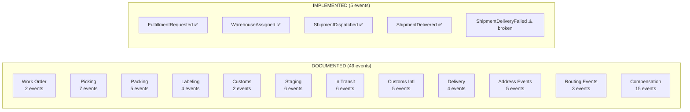

# Fulfillment Bounded Context: Architectural Evolution Plan

**Document Owner:** Principal Software Architect  
**Status:** 📋 Draft — Pending Question Resolution  
**Date:** 2026-03-08  
**Triggered by:** PO + UX Engineer session on warehouse and fulfillment operations  
**Source documents:**
- [`docs/fulfillment/FULFILLMENT-BUSINESS-WORKFLOWS.md`](../fulfillment/FULFILLMENT-BUSINESS-WORKFLOWS.md)
- [`CONTEXTS.md`](../../CONTEXTS.md) — Fulfillment BC section
- Current implementation: `src/Fulfillment/`

---

## Table of Contents

1. [Executive Summary](#1-executive-summary)
2. [Current State Assessment](#2-current-state-assessment)
3. [Open Questions](#3-open-questions)
4. [Preliminary Technical Plan](#4-preliminary-technical-plan)
5. [ADR Candidates](#5-adr-candidates)
6. [Immediate Tactical Recommendations](#6-immediate-tactical-recommendations)

---

## 1. Executive Summary

The PO + UX Engineer session has produced rich, realistic documentation of CritterSupply's fulfillment operations: 6 FCs, a 6-tier Order Routing Engine, 49 domain events, 14 exception branches, and detailed SLA and UX specifications. The current implementation covers approximately 10% of this surface area — a working but skeletal Shipment aggregate with 7 states, 4 domain events, and 4 HTTP endpoints.

This document lays out a phased evolution from that skeleton toward a production-realistic fulfillment system. The phases are ordered by business criticality and architectural prerequisite dependency, not by complexity. **Phase 0 (bugs) and Phase 1 (foundation) must complete before any Phase 2+ work begins.**

The 49-event master list and full exception catalog should be treated as the **eventual target**, not the immediate target. The goal is to demonstrate architecturally correct patterns at each phase and let scope expand naturally as the reference architecture matures.

---

## 2. Current State Assessment

### 2.1 What Exists Today

```
Shipment aggregate (event-sourced, Marten)
├── Status: Pending → Assigned → [Picking] → [Packing] → Shipped → Delivered | DeliveryFailed
│   (Picking and Packing are in ShipmentStatus enum but NO events drive them)
├── Domain Events: FulfillmentRequested, WarehouseAssigned, ShipmentDispatched,
│                 ShipmentDelivered, ShipmentDeliveryFailed
└── HTTP Endpoints:
    POST /api/fulfillment/shipments             → RequestFulfillment (direct, manual)
    POST /api/fulfillment/shipments/{id}/assign → AssignWarehouse (no routing logic)
    POST /api/fulfillment/shipments/{id}/dispatch → DispatchShipment (manual, no carrier API)
    POST /api/fulfillment/shipments/{id}/confirm-delivery → ConfirmDelivery

Integration: FulfillmentRequestedHandler reacts to Messages.Contracts.Fulfillment.FulfillmentRequested
             published by Orders saga (HandleReservationCommitted in OrderDecider.cs)
```

### 2.2 Confirmed Bugs

| Severity | Description | File | Fix Complexity |
|----------|-------------|------|----------------|
| 🔴 **P0** | `ShipmentDeliveryFailed` domain event is never cascaded to `Messages.Contracts.Fulfillment.ShipmentDeliveryFailed`. No HTTP endpoint exists to record a delivery failure. Orders saga handler exists (`HandleShipmentDeliveryFailed`) but is never invoked. | `ConfirmDelivery.cs`, `ShipmentDeliveryFailed.cs` | Low — add endpoint + cascade |
| 🟡 **P1** | `ShippingAddress` type inconsistency: `Messages.Contracts.Orders.ShippingAddress` uses `(Street, Street2, City, State, PostalCode, Country)` while `Messages.Contracts.Fulfillment.ShippingAddress` uses `(AddressLine1, AddressLine2, City, StateProvince, PostalCode, Country)`. Two separate types for the same concept. | `Messages.Contracts/Orders/ShippingAddress.cs`, `Messages.Contracts/Fulfillment/FulfillmentRequested.cs` | Medium — migration + consolidation |
| 🟡 **P1** | `WarehouseId` from `ReservationConfirmed` (Inventory BC) is ignored by the Orders saga when building `FulfillmentRequested`. Inventory already knows which warehouse holds the stock, but Fulfillment receives no routing hint. | `OrderDecider.cs:HandleReservationCommitted`, `ReservationConfirmed.cs` | Medium — saga state change |
| 🟡 **P1** | `Shipment.Create()` calls `Guid.CreateVersion7()` instead of using the stream ID supplied by Marten. The `Id` passed in event sourcing comes from the stream; the aggregate shouldn't mint its own. | `Shipment.cs:Create()` | Low — remove internal ID generation |
| 🟡 **P1** | `Picking` and `Packing` are in `ShipmentStatus` with no events to drive them. The aggregate can never reach these states through valid event application. Either the states need events, or they should be removed until implemented. | `ShipmentStatus.cs` | Low — either add events or remove stubs |
| 🟠 **P2** | `FulfillmentRequestedHandler` uses `Guid.CreateVersion7()` for `shipmentId`, making it non-idempotent. A duplicate `FulfillmentRequested` integration message would create two Shipment streams for the same order. The correct pattern is UUID v5 derived from `OrderId` (ADR 0016). | `FulfillmentRequestedHandler.cs` | Low — apply ADR 0016 pattern |
| 🟠 **P2** | `RequestFulfillment` HTTP endpoint (`POST /api/fulfillment/shipments`) creates a shipment manually, bypassing the Orders → Fulfillment integration flow entirely. It exists for testing but should be clearly marked dev-only or removed. | `RequestFulfillment.cs` | Low — add `[ApiExplorerSettings(IgnoreApi = true)]` or env guard |
| 🟠 **P2** | RabbitMQ transport is not wired in `Fulfillment.Api/Program.cs`. The Fulfillment BC uses `UseDurableLocalQueues()` only. In a multi-host deployment, integration messages to/from Orders BC cannot be delivered cross-process. | `Fulfillment.Api/Program.cs` | Medium — follows ADR 0008 |

### 2.3 Gap Analysis: New Documentation vs. Current Implementation



**Coverage today: ~10% of domain events, ~4% of happy-path lifecycle, 0% of exception branches.**

---

## 3. Open Questions

Before finalizing the technical plan, the following questions must be resolved. They are grouped by audience.

---

### 3.1 Questions for the Product Owner [PO]

**Q1 — Scope boundary for this reference architecture**
> The full fulfillment lifecycle (49 events) is realistic for a production system but represents 6–8 months of development as a reference architecture. Which of the following scope levels is the right target for CritterSupply?
> - **Option A (Minimal):** Correct the bugs, add the ORE, and implement the full happy path through `ShipmentHandedToCarrier`. ~3 cycles.
> - **Option B (Realistic):** Option A + the 4–5 highest-priority exception branches (short pick, delivery failure, lost in transit, carrier intercept). ~6 cycles.
> - **Option C (Full):** All 49 events + international paths + compensation events. ~12+ cycles.
>
> *Recommendation: Option B. It's sufficient to demonstrate the patterns without becoming an operational burden.*

**Q2 — Order Routing Engine: real logic or representative stub?**
> The ORE 6-tier hierarchy (inventory → geography → carrier compatibility → capacity → splits → 3PL) is described with precision. Should the ORE be implemented with real routing logic (requiring FC capacity data, zone tables, carrier compatibility matrices), or as a demonstrably correct **stub** that shows the structure but hardcodes simple decisions?
>
> *Recommendation: Implement a structurally correct ORE with a strategy pattern, but use simplified rules (e.g., destination country for international, hardcoded zone map for domestic) rather than live carrier zone data.*

**Q3 — International routing: in-scope for CritterSupply?**
> Canada (Toronto Hub) and UK (Birmingham Hub) routing is documented in detail with USMCA certificates, DDP/DDU duty models, and customs events. This requires meaningful international domain complexity. Is this in scope for the near term, or should it be marked as a future phase?
>
> *Recommendation: Defer to Phase 4. Document the routing rule ("Canada → Toronto always, UK → Birmingham always") in the ORE without implementing the full customs documentation flow.*

**Q4 — 3PL (TX FC) integration: real WMS API or simulated?**
> The TX 3PL is described as a "partial 3PL partner" with an 8–24hr SLA. Real 3PL integration requires an EDI or API adapter. For CritterSupply's reference architecture, should the 3PL be:
> - A simulated FC that behaves identically to owned FCs but is tagged `IsThirdParty = true`
> - A minimal adapter stub that demonstrates the integration boundary
> - Out of scope entirely (use TX FC as owned, remove 3PL language)
>
> *Recommendation: Treat TX FC as owned for Phases 1–3; introduce a 3PL adapter stub in Phase 4.*

**Q5 — Split shipments: core feature or advanced?**
> Split shipment routing (`OrderSplitIntoShipments`) requires: the ORE to evaluate multi-FC scenarios, the Orders BC and Customer Experience BC to handle N shipments per order ID, and the saga to track multiple `ShipmentId` values. This is architecturally significant. Is this core (Phase 2) or advanced (Phase 4)?
>
> *Recommendation: Phase 4. A single-FC fulfillment story is sufficient for Phases 1–3.*

**Q6 — Hazmat classification: where does it live?**
> The business docs say "hazmat classification is maintained in the Product Catalog SKU master." CritterSupply doesn't have a Catalog BC yet. For the ORE to enforce hazmat routing rules, it needs SKU-level hazmat metadata. Where does this come from in the near term?
> - Embedded in the `FulfillmentLineItem` contract (add `IsHazmat: bool`)?
> - Queried from Inventory BC (which tracks SKU attributes)?
> - Hardcoded per-SKU list for testing purposes?
>
> *This is a concrete decision needed before implementing the ORE.*

---

### 3.2 Questions for the Repository Owner / Erik [Owner/Erik]

**Q7 — WMS abstraction: domain events or external system boundary?**
> The business docs describe a WMS (Warehouse Management System) that owns picking waves, RF scanner assignments, and bin locations. In a real deployment this is a separate system (e.g., Manhattan Associates, HighJump). For CritterSupply:
> - Should Fulfillment BC events like `WaveReleased`, `PickListAssigned`, `ItemPicked` be **internal Marten domain events** that are simulated via API commands (representing the WMS callback)?
> - Or should the WMS be modeled as an **external system boundary** with a dedicated adapter/integration service?
>
> *My recommendation: Model the WMS as a command-issuing external system. Implement HTTP endpoints that the "WMS" calls (simulated via Swagger/tests), which translate to domain events appended to the Shipment stream. This is more architecturally honest and demonstrates the anti-corruption layer pattern.*

**Q8 — Carrier webhook integration: real or simulated?**
> Carrier events (`ShipmentInTransit`, `OutForDelivery`, `ShipmentDelivered`, `DeliveryAttemptFailed`) come from carrier APIs/webhooks. For the reference architecture:
> - Should we implement a **real webhook receiver** (with signature verification)?
> - Or a **simulation endpoint** (`POST /api/fulfillment/shipments/{id}/carrier-event`) that accepts a carrier event payload and translates it to domain events?
>
> *My recommendation: Simulation endpoint in Phases 1–3, documented as "replace with real carrier webhook in production." This keeps the architecture honest without requiring UPS/FedEx sandbox accounts.*

**Q9 — RabbitMQ transport: activate now or remain local-queue?**
> The Fulfillment BC currently uses `UseDurableLocalQueues()`. ADR 0008 (Proposed, not Accepted) covers RabbitMQ consistency. Activating RabbitMQ transport in Fulfillment.Api would:
> - Require Fulfillment + Orders to share the same exchange/routing configuration
> - Enable proper cross-process message delivery in multi-host Docker scenarios
> - Introduce an infrastructure dependency for tests
>
> *Should activating RabbitMQ in Fulfillment.Api be part of Phase 0 (prerequisite for integration testing) or Phase 1 (foundation)?*

**Q10 — ShipmentId in Orders saga: single vs. collection**
> Currently the Orders saga (`Order.cs`) doesn't store `ShipmentId`(s). When `ShipmentDispatched` is received, the saga transitions to `Shipped` but doesn't know which `ShipmentId` to reference (e.g., for cancellation intercepts or split-shipment tracking). Should the Orders saga track:
> - A single `Guid? ShipmentId` (sufficient for Phase 1 single-FC fulfillment)
> - `IReadOnlyList<Guid> ShipmentIds` (correct for split shipments, Phase 4)
>
> *My recommendation: Add `Guid? ShipmentId` now (Phase 1); evolve to collection in Phase 4 with a Marten migration.*

**Q11 — `TrackingNumberAssigned` as a separate integration event**
> The business docs correctly note that tracking numbers are assigned at label generation (Stage 4), NOT at dispatch. The current `ShipmentDispatched` integration message conflates "handed to carrier" with "tracking number assigned." The UX docs require showing tracking as soon as available, before the package actually moves.
> 
> Should we:
> - Add `TrackingNumberAssigned` as a new integration message published to Orders + Customer Experience at label generation
> - Rename/split `ShipmentDispatched` into `ShipmentLabeled` (tracking available) + `ShipmentHandedToCarrier` (physical handoff)
> - Keep `ShipmentDispatched` but add `TrackingNumberAssigned` as an additional earlier event (two separate integration messages)
>
> *This affects Orders saga state machine design and Customer Experience notification timing. The UX engineer has already documented this as a critical constraint (Section 10.1 of FULFILLMENT-BUSINESS-WORKFLOWS.md).*

---

### 3.3 Questions for the UX Engineer [UX]

**Q12 — Order detail view: where is fulfillment status surfaced?**
> The Customer Experience BC (`Storefront.Api`) currently aggregates Orders BC + Fulfillment BC data for the order detail view. As fulfillment states multiply (from 7 to 14+ states), the CX view model needs to reflect them. Questions:
> - Should the `OrderDetailView` projection be owned by Customer Experience (reading from both BCs) or should Fulfillment BC own a `ShipmentSummaryView` that CX queries?
> - Does the UX require **real-time updates** (SignalR push) for all 14 states, or only for key state transitions (`TrackingNumberAssigned`, `OutForDelivery`, `ShipmentDelivered`)?
>
> *ADR 0013 (SignalR) is relevant here — which events should trigger real-time pushes?*

**Q13 — Backorder UX: which states does the customer see?**
> The backorder flow (`BackorderCreated`) surfaces a delay to the customer. The business docs mention "Estimated backorder date must come from Inventory BC." Does the current Inventory BC track replenishment ETAs, or is that a future Catalog/Purchasing BC concern? Without a real ETA, what should the UI display?

**Q14 — FC name display in UI**
> Section 10.2 of the UX doc shows UI copy like "NJ Fulfillment Center." The ORE assigns FC codes (`NJ-FC`, `OH-FC`, etc.). Should there be a display-name mapping at the BFF/API level, or in the Fulfillment BC itself?

---

## 4. Preliminary Technical Plan

> ⚠️ **This plan is preliminary.** Open questions (Section 3) will change scope and sequencing. The plan is structured so that Phase 0 is unconditionally correct regardless of question answers.

---

### Phase 0: Critical Bug Fixes (Current or Next Cycle — 1 week)

**Affected BCs:** Fulfillment, Orders  
**Principle:** These fixes unblock correct behavior and must land before any new features.

#### 0.1 Fix: Publish `ShipmentDeliveryFailed` to Orders BC [P0]

**Problem:** `ShipmentDeliveryFailed` domain event is appended to the Marten stream but the `Messages.Contracts.Fulfillment.ShipmentDeliveryFailed` integration message is never published. There is also no HTTP endpoint to record delivery failure.

**Current pattern (broken):**
```csharp
// ConfirmDelivery.cs — only handles success; no failure path exists
public static ShipmentDelivered Handle(ConfirmDelivery command, [WriteAggregate] Shipment shipment)
    => new ShipmentDelivered(DateTimeOffset.UtcNow, command.RecipientName);
```

**Fix: Add `RecordDeliveryFailure` endpoint + integration message cascade**

```csharp
// NEW: src/Fulfillment/Fulfillment/Shipments/RecordDeliveryFailure.cs
public sealed record RecordDeliveryFailure(
    Guid ShipmentId,
    string Reason,
    int AttemptNumber)   // 1, 2, or 3 — for eventual multi-attempt tracking
{
    public class Validator : AbstractValidator<RecordDeliveryFailure>
    {
        public Validator()
        {
            RuleFor(x => x.ShipmentId).NotEmpty();
            RuleFor(x => x.Reason).NotEmpty().MaximumLength(500);
            RuleFor(x => x.AttemptNumber).InclusiveBetween(1, 3);
        }
    }
}

public static class RecordDeliveryFailureHandler
{
    public static ProblemDetails Before(RecordDeliveryFailure command, Shipment? shipment)
    {
        if (shipment is null)
            return new ProblemDetails { Detail = "Shipment not found", Status = 404 };
        if (shipment.Status is not (ShipmentStatus.Shipped or ShipmentStatus.DeliveryFailed))
            return new ProblemDetails
            {
                Detail = $"Cannot record delivery failure for shipment in {shipment.Status} status.",
                Status = 400
            };
        return WolverineContinue.NoProblems;
    }

    [WolverinePost("/api/fulfillment/shipments/{shipmentId}/delivery-failure")]
    public static (ShipmentDeliveryFailed, Messages.Contracts.Fulfillment.ShipmentDeliveryFailed)
        Handle(RecordDeliveryFailure command, [WriteAggregate] Shipment shipment)
    {
        var domainEvent = new ShipmentDeliveryFailed(command.Reason, DateTimeOffset.UtcNow);

        var integrationMessage = new Messages.Contracts.Fulfillment.ShipmentDeliveryFailed(
            shipment.OrderId,
            shipment.Id,
            command.Reason,
            DateTimeOffset.UtcNow);

        return (domainEvent, integrationMessage);
    }
}
```

**Also fix:** `DispatchShipmentHandler` and `ConfirmDeliveryHandler` should follow the same dual-return pattern (domain event + integration message) to make the publishing explicit and testable:

```csharp
// EXISTING — make publishing explicit
public static (ShipmentDispatched, Messages.Contracts.Fulfillment.ShipmentDispatched)
    Handle(DispatchShipment command, [WriteAggregate] Shipment shipment)
{
    var domainEvent = new ShipmentDispatched(command.Carrier, command.TrackingNumber, DateTimeOffset.UtcNow);
    var integrationMessage = new Messages.Contracts.Fulfillment.ShipmentDispatched(
        shipment.OrderId, shipment.Id, command.Carrier, command.TrackingNumber, DateTimeOffset.UtcNow);
    return (domainEvent, integrationMessage);
}
```

#### 0.2 Fix: Idempotent Shipment Stream Creation via UUID v5 [P2]

**Problem:** `FulfillmentRequestedHandler` mints a new `Guid.CreateVersion7()` for `shipmentId` on every invocation. A duplicate `FulfillmentRequested` integration message (at-least-once delivery) creates a second Shipment stream.

**Fix:** Apply ADR 0016 — use UUID v5 derived from `OrderId`:

```csharp
// FulfillmentRequestedHandler.cs
private static readonly Guid FulfillmentNamespace =
    new("5c8b3f2e-1a4d-4e9c-b7f0-2d6a8e3c9b1f"); // Fixed namespace GUID for Fulfillment BC

public static void Handle(
    Messages.Contracts.Fulfillment.FulfillmentRequested message,
    IDocumentSession session)
{
    // Map integration message to domain event (type-safe local representation).
    // This helper converts Messages.Contracts.Fulfillment.FulfillmentRequested → local ShipmentRequested
    // domain event, mapping ShippingAddress, LineItems, and other fields. Implementation
    // is straightforward field-by-field mapping; see FulfillmentRequestedHandler.cs for the full version.
    var domainEvent = MapToDomainEvent(message); // ShipmentRequested (see 0.4 naming note)

    // Deterministic stream ID: same OrderId always produces same ShipmentId
    var shipmentId = GuidVersion5.Create(FulfillmentNamespace, message.OrderId.ToString());

    // Idempotency: stream creation is guarded by the deterministic ID.
    // Marten will throw ConcurrencyException on duplicate StartStream; Wolverine retries.
    // For stricter idempotency, use TryStartStream<Shipment>() when available.
    session.Events.StartStream<Shipment>(shipmentId, domainEvent);
}
```

#### 0.3 Fix: Remove phantom `Picking`/`Packing` states [P1]

**Problem:** `ShipmentStatus.Picking` and `ShipmentStatus.Packing` exist in the enum but no events drive them. The aggregate can never legitimately reach these states.

**Fix (short-term):** Remove from enum until Phase 2 implements the picking/packing events. This prevents invalid state assumptions in tests and the Orders saga.

**Fix (if Phase 2 is committed):** Keep the enum values but add the domain events in Phase 2.

#### 0.4 Fix: Unify `ShippingAddress` contract type [P1]

**Problem:** Two conflicting address types exist:

```csharp
// Messages.Contracts.Orders.ShippingAddress — used in OrderPlaced
record ShippingAddress(string Street, string? Street2, string City, string State, string PostalCode, string Country);

// Messages.Contracts.Fulfillment.ShippingAddress — used in FulfillmentRequested
record ShippingAddress(string AddressLine1, string? AddressLine2, string City, string StateProvince, string PostalCode, string Country);
```

**Fix:** Promote to `Messages.Contracts.Common.ShippingAddress` using the more expressive Fulfillment field names. Update all usages in a single PR. The `Orders.ShippingAddress` is used in `OrderPlaced` and the Orders domain model — those must be migrated atomically.

```csharp
// NEW: Messages.Contracts/Common/ShippingAddress.cs
namespace Messages.Contracts.Common;

/// <summary>
/// Canonical shipping address shared across integration messages.
/// Field names follow postal service conventions (AddressLine1/2, StateProvince).
/// </summary>
public sealed record ShippingAddress(
    string AddressLine1,
    string? AddressLine2,
    string City,
    string StateProvince,   // US: State; CA: Province; UK: County — unified field
    string PostalCode,
    string Country);        // ISO 3166-1 alpha-2 (US, CA, GB)
```

**Migration scope:** `OrderPlaced.cs`, `FulfillmentRequested.cs`, `Orders/Placement/ShippingAddress.cs`, `Orders/Checkout/ShippingAddress.cs`, `FulfillmentRequestedHandler.cs`, all tests.

> ⚠️ **Marten event stream migration required:** `ShippingAddress` is embedded inside persisted Marten event streams (`OrderPlaced`, `FulfillmentRequested`). Renaming fields is a breaking JSON deserialization change. Before removing the old type, deploy a Marten event migration using `[DataMember(Name = "Street")]` compatibility attributes or a Marten `IEventMigration` that maps old field names (`Street` → `AddressLine1`, `State` → `StateProvince`) during stream replay. All affected BCs must ship in a single coordinated PR. Do NOT rename fields without a migration — existing event streams will fail to deserialize.

---

### Phase 1: Architectural Foundation (1–2 Cycles)

**Affected BCs:** Fulfillment, Inventory, Orders  
**Principle:** These are structural prerequisites. Nothing in Phase 2+ can be built correctly without them.

#### 1.1 Pass `WarehouseId` from Inventory to Fulfillment

**Problem:** Inventory knows which warehouse holds reserved stock (`ReservationConfirmed.WarehouseId`). This information evaporates at the Orders saga boundary — `FulfillmentRequested` doesn't include it.

**Change 1: Orders saga captures warehouse-to-SKU mapping**

> **Note on saga mutability:** Wolverine sagas are classes (not records) with mutable `set` accessors — this is a deliberate requirement of Marten's JSON deserialization lifecycle. Do not use `init` on saga properties. The immutability constraint from CLAUDE.md applies to domain events and commands (`sealed record`s), not to saga classes.

```csharp
// Orders/Placement/Order.cs — add field
// Mutable Dictionary required: Marten serializes/deserializes saga state as JSON.
// NOTE: In a planning document, using string keys is intentional simplification.
// Production code should consider strongly-typed value objects for Sku and WarehouseId.
public Dictionary<string, string> SkuToWarehouseId { get; set; } = new(); // SKU → WarehouseId

// Orders/Placement/OrderDecider.cs — HandleReservationConfirmed
// When ReservationConfirmed arrives, record the WarehouseId for each SKU.
// Return a new Dictionary (pure function — no mutation of current.SkuToWarehouseId).
// Note: If a SKU is re-confirmed (at-least-once delivery), the new WarehouseId overwrites
// the old one. This is intentional — the most recent confirmed warehouse wins.
decision.SkuToWarehouseId = current.SkuToWarehouseId
    .Append(KeyValuePair.Create(message.Sku, message.WarehouseId))
    .GroupBy(kv => kv.Key)          // Handle duplicate SKU confirmations
    .ToDictionary(g => g.Key, g => g.Last().Value);  // Last-write-wins per SKU
```

**Change 2: `FulfillmentRequested` integration contract carries per-item warehouse**

```csharp
// Messages.Contracts/Fulfillment/FulfillmentRequested.cs
public sealed record FulfillmentLineItem(
    string Sku,
    int Quantity,
    string WarehouseId);   // ← NEW: which FC already has this stock reserved
```

**Change 3: Fulfillment BC's `FulfillmentRequestedHandler` uses the warehouse hint as the initial routing decision**

This is not the full ORE (Phase 1.2), but it eliminates the hardcoded `WH-01` dependency for single-SKU orders where all items are at the same warehouse.

#### 1.2 Order Routing Engine (ORE) — Structural Foundation

**Problem:** Warehouse assignment is a manual `POST /assign` with no business logic. The ORE is the heart of the Fulfillment BC.

**Design: Strategy pattern with tier evaluation**

```csharp
// NEW: src/Fulfillment/Fulfillment/Routing/IOrderRoutingEngine.cs
public interface IOrderRoutingEngine
{
    RoutingDecision Evaluate(RoutingRequest request);
}

public sealed record RoutingRequest(
    string DestinationCountry,   // ISO 3166-1 alpha-2
    string DestinationPostalCode,
    string ShippingMethod,       // Standard, Expedited, Overnight
    IReadOnlyList<RoutingLineItem> LineItems,   // Sku, Quantity, WarehouseId (from Inventory)
    bool HasHazmatItems);

public sealed record RoutingLineItem(
    string Sku,
    int Quantity,
    string PreferredWarehouseId,   // From ReservationConfirmed
    bool IsHazmat);

public sealed record RoutingDecision
{
    public required RoutingOutcome Outcome { get; init; }
    public string? AssignedFcId { get; init; }           // null if Backordered or Split
    public IReadOnlyList<ShipmentSplit>? Splits { get; init; }  // Phase 4
    public string? RoutingReason { get; init; }          // Audit log: which tier decided
}

public enum RoutingOutcome { Assigned, Backordered, Split, ThreePlOverflow }
```

**Phase 1 ORE implementation (simplified but structurally correct):**

```csharp
// Tier 1: International routing (hard rules — never exceptions)
if (request.DestinationCountry == "CA") return Assigned("TORONTO-HUB", "Tier1-International-Canada");
if (request.DestinationCountry == "GB") return Assigned("BHAM-HUB", "Tier1-International-UK");

// Tier 2: Use Inventory BC's warehouse hint (already reserved there)
var preferredFc = request.LineItems
    .GroupBy(i => i.PreferredWarehouseId)
    .OrderByDescending(g => g.Count())
    .First().Key;

// Tier 3: Carrier compatibility check
if (preferredFc == "WA-FC" && request.ShippingMethod.Contains("USPS"))
    preferredFc = SelectFallback(preferredFc, request);  // WA-FC has no USPS

// Phase 1: Skip Tiers 4–6, assign preferred FC directly
return Assigned(preferredFc, "Tier2-InventoryHint");
```

**Integration with Fulfillment BC:**

The ORE fires automatically when `FulfillmentRequested` is received, replacing the manual `AssignWarehouse` command for the integration path.

> **Naming note:** The local Fulfillment BC domain event that initiates a shipment stream should be named `ShipmentRequested` (not `FulfillmentRequested`) to avoid collision with the `Messages.Contracts.Fulfillment.FulfillmentRequested` integration message type. This naming fix should be part of Phase 1 cleanup.

```csharp
// FulfillmentRequestedHandler.cs — updated
// Returns: domain event appended to stream + optional WarehouseAssigned auto-applied
public static (ShipmentRequested, WarehouseAssigned?) Handle(
    Messages.Contracts.Fulfillment.FulfillmentRequested message,
    IDocumentSession session,
    IOrderRoutingEngine ore)
{
    var domainEvent = MapToDomainEvent(message);  // → ShipmentRequested
    // Derive deterministic shipment ID from OrderId using UUID v5 (ADR 0016 — see section 0.2).
    // This ensures idempotency: same OrderId always produces same ShipmentId.
    var shipmentId = DeriveShipmentId(message.OrderId);  // GuidVersion5.Create(Namespace, orderId)
    session.Events.StartStream<Shipment>(shipmentId, domainEvent);

    var routingRequest = BuildRoutingRequest(message);
    var decision = ore.Evaluate(routingRequest);

    return decision.Outcome switch
    {
        RoutingOutcome.Assigned => (domainEvent, new WarehouseAssigned(decision.AssignedFcId!, DateTimeOffset.UtcNow)),
        RoutingOutcome.Backordered => (domainEvent, null),  // Publish BackorderCreated separately
        _ => (domainEvent, null)
    };
}
```

**FC configuration (injected, not hardcoded):**

```csharp
// NEW: src/Fulfillment/Fulfillment/Routing/FulfillmentCenterRegistry.cs
public sealed record FulfillmentCenter(
    string Id,              // "NJ-FC", "OH-FC", etc.
    string DisplayName,     // "Newark, NJ Fulfillment Center"
    string Country,         // "US", "CA", "GB"
    string TimeZoneId,      // IANA timezone
    IReadOnlyList<string> SupportedCarriers,   // ["UPS", "FedEx", "USPS"]
    bool AcceptsReturns,
    bool IsThirdParty,
    TimeOnly CutoffTime);

// Registered via IOptions<FulfillmentCenterOptions> from appsettings.json
```

#### 1.3 Activate RabbitMQ Transport in Fulfillment.Api

**Problem:** Integration messages cannot flow cross-process with local queues only.

**Fix:** Follow ADR 0008 pattern (already used by Orders.Api and Inventory.Api):

```csharp
// Fulfillment.Api/Program.cs
builder.Host.UseWolverine(opts =>
{
    opts.UseRabbitMq(rabbit =>
    {
        rabbit.ConnectionFactory.HostName = rabbitHost;
        // ... configure exchanges matching Orders BC routing
    });

    opts.PublishMessage<Messages.Contracts.Fulfillment.ShipmentDispatched>()
        .ToRabbitExchange("fulfillment");
    opts.PublishMessage<Messages.Contracts.Fulfillment.ShipmentDelivered>()
        .ToRabbitExchange("fulfillment");
    opts.PublishMessage<Messages.Contracts.Fulfillment.ShipmentDeliveryFailed>()
        .ToRabbitExchange("fulfillment");

    opts.ListenToRabbitQueue("fulfillment.incoming")
        .For<Messages.Contracts.Fulfillment.FulfillmentRequested>();
});
```

#### 1.4 Orders Saga: Store `ShipmentId`

**Problem:** The Orders saga receives `ShipmentDispatched` but doesn't record the `ShipmentId`. This creates a gap for future intercept requests, split-shipment tracking, and return eligibility.

> **Saga mutability reminder:** These use `set` (not `init`) — required for Marten saga deserialization.

```csharp
// Orders/Placement/Order.cs — add field
public Guid? ShipmentId { get; set; }   // set required: Marten saga hydration

// Orders/Placement/OrderDecider.cs — HandleShipmentDispatched
public static OrderDecision HandleShipmentDispatched(Order current, ShipmentDispatched message)
    => new() { Status = OrderStatus.Shipped, ShipmentId = message.ShipmentId };
```

---

### Phase 2: Core Lifecycle Expansion (2–3 Cycles)

**Affected BCs:** Fulfillment  
**Principle:** Expand the Shipment aggregate to reflect the real warehouse lifecycle. This phase implements the happy-path states that currently exist as enum stubs or are missing entirely.

#### 2.1 Expand `ShipmentStatus` to Full Happy-Path Lifecycle

```csharp
public enum ShipmentStatus
{
    // --- Phase 0 / existing ---
    Pending,             // FulfillmentRequested received
    Assigned,            // ORE selected a FC

    // --- Phase 2: WMS lifecycle ---
    WorkOrderCreated,    // NEW: translated to WMS work order
    WaveReleased,        // NEW: WMS batched into pick wave
    Picking,             // EXISTING (now has events)
    PickCompleted,       // NEW
    Packing,             // EXISTING (now has events)
    PackCompleted,       // NEW

    // --- Phase 2: Labeling ---
    Labeled,             // NEW: tracking number assigned (first moment it exists)
    Manifested,          // NEW: carrier manifest submitted

    // --- Phase 2: Outbound ---
    Staged,              // NEW: at dock, awaiting carrier pickup
    HandedToCarrier,     // NEW: physical custody transferred (replaces current "Shipped")

    // --- Phase 2: In transit (carrier-reported) ---
    InTransit,           // NEW
    OutForDelivery,      // NEW

    // --- Existing terminal states ---
    Delivered,
    DeliveryFailed,

    // --- Phase 3: Exception states ---
    ShortPickDetected,
    Backordered,
    Lost,
    ReturnToSender,
    CustomsHeld          // Phase 4 only
}
```

#### 2.2 New Domain Events for Phase 2

Each event is a `sealed record` with the data needed for `Apply()`:

```csharp
// Stage 1: Work Order
public sealed record WorkOrderCreated(string FcId, DateTimeOffset CreatedAt);
public sealed record WaveReleased(string WaveId, DateTimeOffset ReleasedAt);

// Stage 2: Picking
public sealed record PickListAssigned(string PickerId, DateTimeOffset AssignedAt);
public sealed record PickStarted(DateTimeOffset StartedAt);
public sealed record ItemPicked(string Sku, int Quantity, string BinLocation, DateTimeOffset PickedAt);
public sealed record PickCompleted(DateTimeOffset CompletedAt);

// Stage 3: Packing
public sealed record PackingStarted(DateTimeOffset StartedAt);
public sealed record ItemVerifiedAtPack(string Sku, int Quantity, DateTimeOffset VerifiedAt);
public sealed record PackingCompleted(decimal WeightKg, string CartonSize, DateTimeOffset CompletedAt);

// Stage 4: Labeling
public sealed record ShippingLabelGenerated(
    string Carrier,
    string ServiceLevel,    // "UPS_GROUND", "FEDEX_2DAY", "USPS_PRIORITY"
    string TrackingNumber,
    decimal ShippingCostUsd,
    DateTimeOffset GeneratedAt);

public sealed record TrackingNumberAssigned(
    string TrackingNumber,
    string Carrier,
    DateTimeOffset AssignedAt);   // Integration event trigger point

public sealed record ShipmentManifested(string ManifestId, DateTimeOffset ManifestedAt);

// Stage 6: Outbound
public sealed record PackageStagedForPickup(string DockLocation, DateTimeOffset StagedAt);
public sealed record CarrierPickupConfirmed(string DriverId, DateTimeOffset ConfirmedAt);

// Replaces "ShipmentDispatched" semantics
public sealed record ShipmentHandedToCarrier(
    string Carrier,
    string TrackingNumber,
    DateTimeOffset HandedOverAt);

// Stage 7: In transit (carrier-reported)
public sealed record ShipmentInTransit(string CarrierFacility, DateTimeOffset ScannedAt);
public sealed record OutForDelivery(DateTimeOffset LoadedAt);
```

#### 2.3 Expanded Shipment Aggregate

The `Shipment` aggregate gains `Apply()` overloads for each new event. Key additions:

```csharp
public sealed record Shipment(
    Guid Id,
    Guid OrderId,
    Guid CustomerId,
    ShippingAddress ShippingAddress,
    IReadOnlyList<FulfillmentLineItem> LineItems,
    string ShippingMethod,
    ShipmentStatus Status,
    string? FcId,                        // Renamed from WarehouseId (FC code: "NJ-FC")
    string? Carrier,
    string? TrackingNumber,              // null until Labeled state
    string? WaveId,
    string? PickerId,
    int PickedItemCount,
    int PackedItemCount,
    decimal? WeightKg,
    string? CartonSize,
    DateTimeOffset RequestedAt,
    DateTimeOffset? AssignedAt,
    DateTimeOffset? LabeledAt,           // When tracking number became available
    DateTimeOffset? HandedToCarrierAt,   // Replaces DispatchedAt
    DateTimeOffset? DeliveredAt,
    string? FailureReason,
    int DeliveryAttemptCount)            // For multi-attempt failure tracking
{
    // Apply() methods for all Phase 2 events...
    public Shipment Apply(TrackingNumberAssigned @event) =>
        this with { TrackingNumber = @event.TrackingNumber, LabeledAt = @event.AssignedAt, Status = ShipmentStatus.Labeled };

    public Shipment Apply(ShipmentHandedToCarrier @event) =>
        this with { HandedToCarrierAt = @event.HandedOverAt, Status = ShipmentStatus.HandedToCarrier };
    // ... etc.
}
```

#### 2.4 WMS Simulation Endpoints

These endpoints simulate WMS callback events. Each translates a WMS callback into one or more domain events:

```csharp
// POST /api/fulfillment/shipments/{id}/wms/wave-release
// POST /api/fulfillment/shipments/{id}/wms/assign-picker
// POST /api/fulfillment/shipments/{id}/wms/pick-item      (called once per item)
// POST /api/fulfillment/shipments/{id}/wms/complete-pick
// POST /api/fulfillment/shipments/{id}/wms/start-packing
// POST /api/fulfillment/shipments/{id}/wms/verify-item    (called once per item)
// POST /api/fulfillment/shipments/{id}/wms/complete-packing

// Carrier simulation:
// POST /api/fulfillment/shipments/{id}/carrier/generate-label  → TrackingNumberAssigned integration
// POST /api/fulfillment/shipments/{id}/carrier/manifest
// POST /api/fulfillment/shipments/{id}/carrier/pickup-confirmed
// POST /api/fulfillment/shipments/{id}/carrier/in-transit
// POST /api/fulfillment/shipments/{id}/carrier/out-for-delivery
// POST /api/fulfillment/shipments/{id}/carrier/delivered
// POST /api/fulfillment/shipments/{id}/carrier/delivery-failed  (replaces current endpoint)
```

**All WMS endpoints are grouped under `/wms/` path prefix to clearly demarcate them as WMS-facing (not customer-facing).** In production, these would be inbound from the WMS API; in CritterSupply, they're manually triggered.

#### 2.5 New Integration Messages for Phase 2

```csharp
// NEW: Messages.Contracts/Fulfillment/TrackingNumberAssigned.cs
/// <summary>Published when label is generated — first moment a tracking number exists.</summary>
public sealed record TrackingNumberAssigned(
    Guid OrderId,
    Guid ShipmentId,
    string Carrier,
    string TrackingNumber,
    string CarrierTrackingUrl,  // Deep link to carrier tracking page
    DateTimeOffset AssignedAt);

// NEW: Messages.Contracts/Fulfillment/ShipmentHandedToCarrier.cs
/// <summary>Published when physical custody transfers to carrier.</summary>
public sealed record ShipmentHandedToCarrier(
    Guid OrderId,
    Guid ShipmentId,
    string Carrier,
    string TrackingNumber,
    DateTimeOffset HandedOverAt);
```

**Orders saga must handle both:** `TrackingNumberAssigned` (keep in `Fulfilling` state, store tracking) and `ShipmentHandedToCarrier` (transition to `Shipped`). The current `ShipmentDispatched` integration message is **deprecated** in Phase 2 — replaced by the two-event split. A migration plan is needed.

#### 2.6 Orders Saga Updates for Phase 2

**Phase 2 adds new saga states:**
- `TrackingAssigned` — between `Fulfilling` and `Shipped`; tracking number is known but package not yet with carrier

Add saga fields. All use mutable `set` — this is a Wolverine saga class requirement (Marten JSON deserialization). Unlike domain events and commands (which are `sealed record`s with immutable state), Wolverine sagas are classes that Marten hydrates by setting properties:
```csharp
public string? TrackingNumber { get; set; }
public string? Carrier { get; set; }
public string? CarrierTrackingUrl { get; set; }
```

---

### Phase 3: Exception Branches (2–3 Cycles)

**Affected BCs:** Fulfillment, Orders, Notifications  
**Principle:** Implement the highest-impact exception paths. Each exception branch is a vertical slice that adds domain events, state transitions, and integration messages.

#### Priority Order for Exception Implementation

| Priority | Exception | Reason | Integration Messages |
|----------|-----------|--------|---------------------|
| P1 | Short Pick / Stockout | Most common real-world scenario | `BackorderCreated`, `ShipmentRerouted` |
| P2 | Delivery Attempt Failed (multi-attempt) | Already partially implemented; extend to 3-attempt lifecycle | `ShipmentDeliveryFailed` (count), `ReturnToSenderInitiated` |
| P3 | Lost in Transit | High customer impact; demonstrates compensation | `ShipmentLostInTransit`, `ReshipmentCreated` |
| P4 | Carrier Intercept | Real business need; shows compensating transaction | `CarrierInterceptRequested`, `CarrierInterceptConfirmed/Failed` |
| P5 | Ghost Shipment | Operational monitoring scenario | `GhostShipmentDetected` |

#### 3.1 Short Pick Flow

```
ShortPickDetected
  ├── If alternative bin found → PickResumed (happy path continues)
  └── If no bin stock at current FC:
        └── ORE re-evaluates remaining FCs
              ├── Stock at alternate FC → ShipmentRerouted (integration) → new WorkOrderCreated at new FC
              └── No stock anywhere → BackorderCreated (integration)
```

**New domain events:** `ShortPickDetected`, `PickResumed`, `PickExceptionRaised`  
**New integration messages:** `BackorderCreated`, `ShipmentRerouted`  
**Orders saga change:** Handle `BackorderCreated` → transition to new `Backordered` saga state (terminal pending customer action)

#### 3.2 Multi-Attempt Delivery Failure

**Current:** `ShipmentDeliveryFailed` is a single terminal event.  
**Phase 3:** Track attempt count; retry up to 3 times before `ReturnToSenderInitiated`.

```csharp
// Updated domain event
public sealed record DeliveryAttemptFailed(
    int AttemptNumber,      // 1, 2, or 3
    string Reason,
    DateTimeOffset FailedAt);

// New terminal event
public sealed record ReturnToSenderInitiated(
    string Reason,
    DateTimeOffset InitiatedAt);
```

**Shipment status transitions:**
```
ShipmentStatus.HandedToCarrier
→ OutForDelivery (attempt 1, 2, or 3)
→ DeliveryAttemptFailed(AttemptNumber=1 or 2)
→ OutForDelivery (carrier retries)
→ DeliveryAttemptFailed(AttemptNumber=3)
→ ReturnToSender
```

#### 3.3 Lost in Transit

```csharp
// New domain events
public sealed record ShipmentLostInTransit(int BusinessDaysWithoutScan, DateTimeOffset DetectedAt);
public sealed record CarrierTraceOpened(string TraceReferenceNumber, DateTimeOffset OpenedAt);
public sealed record ReshipmentCreated(Guid NewShipmentId, DateTimeOffset CreatedAt);
```

**Detection mechanism:** A Wolverine scheduled message checks for shipments in `InTransit` or `HandedToCarrier` status with no carrier scan for 5 business days. This is a background job registered via `opts.ScheduledMessage<CheckForLostShipments>()`.

**New integration message:**
```csharp
// Messages.Contracts/Fulfillment/ShipmentLostInTransit.cs
public sealed record ShipmentLostInTransit(
    Guid OrderId,
    Guid OriginalShipmentId,
    Guid NewShipmentId,
    string Reason,
    DateTimeOffset DetectedAt);
```

---

### Phase 4: Advanced Scenarios (3+ Cycles)

**Affected BCs:** Fulfillment, Orders, Customer Experience, Returns, Notifications  
**Principle:** Complex multi-BC scenarios. Each requires architectural decisions on saga coordination.

#### 4.1 Split Shipments (`OrderSplitIntoShipments`)

**When:** ORE Tier 5 — no single FC has all items; 2+ FCs needed.

**Architectural impact:**
- ORE produces a `RoutingDecision` with multiple `ShipmentSplit` records
- One Marten event stream per physical shipment
- Orders saga tracks `IReadOnlyList<Guid> ShipmentIds` instead of `Guid? ShipmentId`
- Orders saga transitions to `Delivered` only when ALL `ShipmentId` values are delivered
- Customer Experience BC must render N shipment cards per order (documented in UX section 10.2)
- New integration message: `OrderSplitIntoShipments(OrderId, ShipmentGroups[])`

```csharp
// New ORE concept
public sealed record ShipmentSplit(
    string FcId,
    IReadOnlyList<RoutingLineItem> Items);

// New integration message
public sealed record OrderSplitIntoShipments(
    Guid OrderId,
    IReadOnlyList<ShipmentSplitInfo> Splits);

public sealed record ShipmentSplitInfo(
    Guid ShipmentId,
    string FcId,
    IReadOnlyList<SplitLineItem> Items);
```

#### 4.2 International Routing + Customs

**When:** Destination country is `CA` or `GB`.

**New domain events:** `CustomsDocumentationPrepared`, `USMCACertificateOfOriginIssued`, `CustomsHoldInitiated`, `CustomsHoldReleased`, `ProhibitedItemSeized`, `DutyRefused`

**Key decisions needed (before implementation):**
- Landed cost calculation at checkout (requires Pricing/Avalara integration)
- DDP vs DDU default policy per destination country
- HS code source (Product Catalog BC, not yet built)

#### 4.3 Carrier Intercept Flow

**Trigger:** Customer requests address change after package is with carrier.

**Domain events:** `CarrierInterceptRequested`, `CarrierInterceptConfirmed`, `CarrierInterceptFailed`, `VoluntaryRecallInitiated`

**UX requirement:** Customer must confirm intercept fee before it's charged. This implies a synchronous confirmation step — likely an Orders BC concern (fee authorization).

#### 4.4 Hazmat Enforcement

**Requires:** Hazmat flag on `FulfillmentLineItem` (from Catalog BC or embedded in order line).

**ORE change:** Reject WA-FC for hazmat items; enforce ground-only restriction at label generation.

**New domain events:** `HazmatItemFlagged`, `HazmatShippingRestrictionApplied`, `HazmatItemBlockedFromInternational`

---

## 5. ADR Candidates

The following decisions warrant formal ADRs before implementation begins. ADR numbers continue from 0021.

| # | Title | Urgency | Drives |
|---|-------|---------|--------|
| **0022** | Fulfillment Integration Message Publishing Strategy | 🔴 **Phase 0** | How domain events cascade to integration messages (explicit dual-return vs. Marten event subscription cascade) |
| **0023** | Order Routing Engine Design: Strategy Pattern vs. Rules Engine | 🟡 **Phase 1** | ORE extensibility; whether carrier zone tables are config-driven or code-driven |
| **0024** | WMS Integration Boundary: Simulated Endpoints vs. External Adapter | 🟡 **Phase 1** | Whether WMS events come via HTTP (simulation) or a dedicated integration service |
| **0025** | Tracking Number Availability: Split `ShipmentDispatched` into `TrackingNumberAssigned` + `ShipmentHandedToCarrier` | 🟡 **Phase 1/2** | Orders saga state machine; Customer Experience notification design |
| **0026** | Carrier Webhook Simulation Strategy | 🟡 **Phase 2** | How carrier-reported events (in transit, delivered) are simulated and tested |
| **0027** | Split Shipment Saga Design: Single vs. Collection of ShipmentIds in Order Saga | 🟠 **Phase 4** | Orders saga refactoring scope; Customer Experience multi-shipment view |
| **0028** | FC Configuration: Hardcoded Registry vs. Configuration-Driven | 🟡 **Phase 1** | Whether FC capabilities (carriers, cutoff times, hazmat) are in `appsettings.json` or a dedicated store |
| **0029** | `ShipmentDeliveryFailed` Taxonomy: Terminal vs. Retriable | 🟡 **Phase 2/3** | Whether `DeliveryFailed` is a terminal state (current) or a counter that resets to `OutForDelivery` |

### ADR 0022 Detail: Integration Message Publishing Strategy

This is the most pressing ADR because it affects every handler in the Fulfillment BC. Two valid patterns exist:

**Option A: Explicit dual-return from Wolverine handler**
```csharp
// Handler returns (DomainEvent, IntegrationMessage) — both are processed by Wolverine
public static (ShipmentDelivered domainEvent, Messages.Contracts.Fulfillment.ShipmentDelivered integration)
    Handle(ConfirmDelivery command, [WriteAggregate] Shipment shipment) => ...
```
- ✅ Explicit, testable, no magic
- ✅ Domain event and integration message are co-located in the handler
- ⚠️ Handler signature becomes longer when multiple messages are returned
- ⚠️ Requires returning `Events` collection when multiple domain events are needed

**Option B: Marten async event subscription cascade**
```csharp
// A separate handler subscribes to the domain event stream and publishes integration messages
opts.Events.Subscribe<ShipmentDelivered, ShipmentDeliveredIntegrationPublisher>();
```
- ✅ Separation of concerns: domain logic and integration publishing are decoupled
- ✅ Supports exactly-once publishing via Marten inbox/outbox
- ⚠️ Adds async latency (daemon-driven)
- ⚠️ Harder to reason about causality in tests
- ⚠️ Requires async daemon to be running and healthy

**Recommendation:** Option A (explicit dual-return) for Phase 0 and Phase 1. This is more consistent with the Wolverine compound handler pattern already established across CritterSupply. Revisit Option B if publishing complexity grows in Phase 3+.

---

## 6. Immediate Tactical Recommendations

These are the **3–5 actions** that can be taken in the **current or next cycle** with highest impact and lowest risk.

---

### Recommendation 1: Fix the `ShipmentDeliveryFailed` P0 Bug First

**Why now:** The Orders saga handler for `ShipmentDeliveryFailed` exists and has been written correctly (`OrderDecider.HandleShipmentDeliveryFailed`), but it is permanently unreachable because the Fulfillment BC never publishes the integration message. A customer whose delivery fails will have their order stuck in `Shipped` forever with no compensating action possible. This is a data integrity issue in addition to a functional bug.

**Effort:** 1–2 days. New `RecordDeliveryFailure` endpoint + explicit dual-return pattern on existing handlers.

**Test:** Add an Alba integration test that:
1. Creates a Shipment via `FulfillmentRequested`
2. Assigns warehouse via `AssignWarehouse`
3. Dispatches via `DispatchShipment`
4. Posts `RecordDeliveryFailure`
5. Asserts `Messages.Contracts.Fulfillment.ShipmentDeliveryFailed` was published

---

### Recommendation 2: Fix the `ShippingAddress` Type Inconsistency

**Why now:** This inconsistency is a latent bug that will cause mapping failures in any future context that needs to read an order's address. It also confuses developers who see two `ShippingAddress` types in the same solution. The fix is straightforward but touches many files — do it in an isolated PR before any Phase 1 work adds more usages.

**Effort:** 3–4 days (careful cross-project refactor + test updates).

**Migration path:**
1. Add `Messages.Contracts.Common.ShippingAddress` (new canonical type)
2. Update `Messages.Contracts.Orders.FulfillmentRequested` to use it
3. Update `Messages.Contracts.Orders.OrderPlaced` to use it (breaking change — coordinate with Orders, Inventory, and Customer Experience BCs)
4. Remove the two duplicate types
5. Update `FulfillmentRequestedHandler.cs` mapping code (which currently maps between the two — that mapping disappears entirely)

---

### Recommendation 3: Apply ADR 0016 (UUID v5) to `FulfillmentRequestedHandler`

**Why now:** This is a 10-line fix that prevents a hard-to-diagnose production bug (duplicate shipment streams under at-least-once delivery). The UUID v5 pattern is already established in ADR 0016 and used elsewhere in the codebase. Not applying it here is an oversight.

**Effort:** 2 hours. Fix `FulfillmentRequestedHandler.cs`. Add idempotency test.

**Note:** The test should POST a duplicate `FulfillmentRequested` message and assert that only one Shipment stream exists afterward.

---

### Recommendation 4: Implement the Order Routing Engine (ORE) Foundation in Phase 1

**Why now:** Every subsequent feature in the Fulfillment BC depends on the ORE. Without it, warehouse assignment is manual-only, hazmat rules can't be enforced, international routing can't work, and the inventory-warehouse link established in Phase 1.1 has no consumer. The ORE foundation (strategy pattern, FC registry, international hard-routing) can be built without implementing the full 6-tier evaluation.

**Start with:** 
- `IOrderRoutingEngine` interface + `DefaultOrderRoutingEngine` implementation
- `FulfillmentCenterRegistry` loaded from `appsettings.json`
- Tiers 1 (international hard-routing) and 2 (inventory warehouse hint) only
- Unit tests for each tier evaluation (ORE is a pure function — ideal for xUnit without Alba)

**Effort:** 1 cycle (1–2 weeks).

---

### Recommendation 5: Write the Architecture Decision Record for Integration Message Publishing (ADR 0022)

**Why now:** The current implementation has an ambiguous publishing strategy. `DispatchShipmentHandler` and `ConfirmDeliveryHandler` return domain events that get appended to Marten, but it's not explicit how or whether the integration messages reach the Orders BC. Before Phase 2 adds a dozen more handlers, the team needs a clear, documented answer to "how does a Fulfillment domain event become a cross-BC integration message?"

**Action:** Write ADR 0022, have it reviewed by the team, and update the two existing handlers (`DispatchShipment`, `ConfirmDelivery`) to follow the chosen pattern explicitly. This is documentation-first work that pays dividends across all future handlers.

**Effort:** 1 day (writing + handler updates).

---

## Appendix A: Phased Domain Event Rollout

```
Phase 0 (Fixes):
  FulfillmentRequested ✅ (idempotency fix)
  WarehouseAssigned ✅ (no change)
  ShipmentDispatched ✅ (publishing fix)
  ShipmentDelivered ✅ (publishing fix)
  ShipmentDeliveryFailed 🔴→✅ (P0 fix)

Phase 1 (Foundation):
  [ORE fires on FulfillmentRequested; no new domain events, WarehouseAssigned automated]

Phase 2 (Core Lifecycle):
  WorkOrderCreated, WaveReleased
  PickListAssigned, PickStarted, ItemPicked, PickCompleted
  PackingStarted, ItemVerifiedAtPack, PackingCompleted
  ShippingLabelGenerated, TrackingNumberAssigned, ShipmentManifested
  PackageStagedForPickup, CarrierPickupConfirmed, ShipmentHandedToCarrier
  ShipmentInTransit, OutForDelivery

Phase 3 (Exceptions):
  ShortPickDetected, PickResumed, PickExceptionRaised
  DeliveryAttemptFailed (×3), ReturnToSenderInitiated
  ShipmentLostInTransit, CarrierTraceOpened, ReshipmentCreated, ShipmentRecovered
  CarrierInterceptRequested, CarrierInterceptConfirmed, CarrierInterceptFailed
  GhostShipmentDetected

Phase 4 (Advanced):
  OrderSplitIntoShipments + per-split events
  CustomsDocumentationPrepared, USMCACertificateOfOriginIssued
  CustomsHoldInitiated, CustomsHoldReleased, ProhibitedItemSeized, DutyRefused
  HazmatItemFlagged, HazmatShippingRestrictionApplied
  BackorderCreated (moved from Phase 3 if splits deferred)
```

---

## Appendix B: Cycle Estimates

| Phase | Scope | Cycles | Notes |
|-------|-------|--------|-------|
| Phase 0 | P0/P1 bug fixes | 0.5–1 | Should be part of the next cycle regardless |
| Phase 0 | ShippingAddress unification | 0.5 | Isolated refactoring cycle |
| Phase 1 | ORE foundation + RabbitMQ | 1–2 | Depends on Q9 (RabbitMQ) and Q2 (ORE scope) |
| Phase 1 | Orders saga ShipmentId + WarehouseId | 0.5 | Alongside ORE work |
| Phase 2 | Full happy-path lifecycle (17 events) | 2–3 | WMS simulation endpoints are most of the work |
| Phase 3 | Top 3 exception branches | 2–3 | One exception per cycle is sustainable |
| Phase 4 | Split shipments | 2–3 | Requires Orders saga refactor |
| Phase 4 | International + customs | 2–3 | Requires Catalog BC for HS codes |
| Phase 4 | Hazmat enforcement | 1 | Once Catalog BC provides hazmat flag |

**Total estimate (Option B scope — recommended):** ~10–12 cycles from Phase 0 through Phase 3.

---

## Appendix C: Integration Contract Evolution Summary

```
Current integration contracts (Orders ↔ Fulfillment):
  Orders → Fulfillment:  FulfillmentRequested (+ ShippingAddress unification in Phase 0)
  Fulfillment → Orders:  ShipmentDispatched, ShipmentDelivered, ShipmentDeliveryFailed

Phase 1 additions:
  FulfillmentRequested.LineItems now include WarehouseId per item

Phase 2 additions:
  Fulfillment → Orders:  TrackingNumberAssigned (new), ShipmentHandedToCarrier (replaces ShipmentDispatched)
  Fulfillment → CX:      TrackingNumberAssigned, ShipmentInTransit, OutForDelivery, ShipmentDelivered

Phase 3 additions:
  Fulfillment → Orders:  BackorderCreated, ShipmentRerouted, ShipmentLostInTransit, ReshipmentCreated, ReturnToSenderInitiated
  Fulfillment → CX:      All of the above + DeliveryAttemptFailed

Phase 4 additions:
  Fulfillment → Orders:  OrderSplitIntoShipments
  Fulfillment → CX:      CustomsHoldInitiated, CustomsHoldReleased
```

---

*This document should be updated after each phase completes and question answers are received. Once questions are resolved, convert this preliminary plan into cycle-specific task breakdowns in `docs/planning/cycles/`.*
