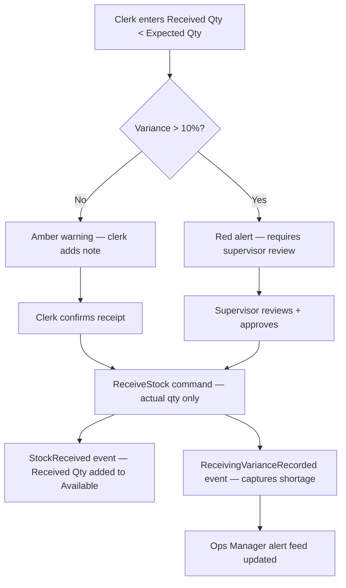
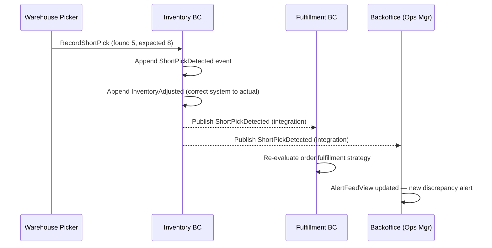
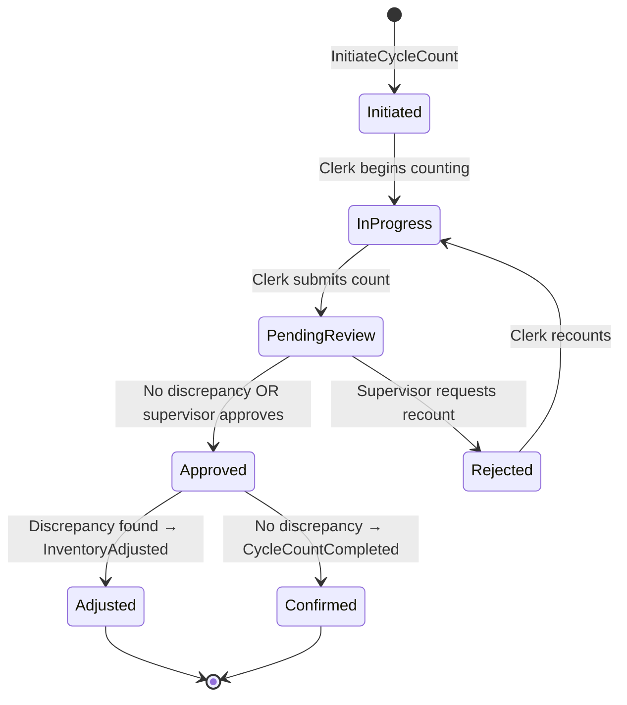

# Inventory BC Remaster — Phase 3: Storyboarding

**Date:** 2026-07-10
**Phase Owner:** @ux-engineer
**Session Participants:** Product Owner, Principal Architect, QA Engineer, Event Modeling Facilitator
**Status:** 🟡 Phase 3 Complete — Awaiting Phase 4 Slice Decomposition
**Input Documents:** [Inventory Remaster Event Modeling Prompt](milestones/inventory-remaster-event-modeling-prompt.md), [Inventory Workflows](../workflows/inventory-workflows.md), [Fulfillment Remaster Slices](fulfillment-remaster-slices.md)
**Companion Documents:** [Backoffice Frontend Design](backoffice-frontend-design.md), [Backoffice Event Modeling Revised](backoffice-event-modeling-revised.md)

> **Phase 3 Charter:** Add UI wireframes above the event timeline, commands below, read
> models below. Connect every screen to specific commands and events. Define all read
> models with their source events, projection lifecycle, and primary consumer.

---

## Table of Contents

1. [User Personas & Access Model](#1-user-personas--access-model)
2. [Warehouse Clerk Screens](#2-warehouse-clerk-screens)
   - [2.1 SKU Detail Screen](#21-sku-detail-screen)
   - [2.2 Inbound Receiving Screen](#22-inbound-receiving-screen)
   - [2.3 Short Pick Screen](#23-short-pick-screen)
   - [2.4 Cycle Count Screen](#24-cycle-count-screen)
3. [Operations Manager Screens](#3-operations-manager-screens)
   - [3.1 Inventory Dashboard](#31-inventory-dashboard)
   - [3.2 Low-Stock Alert Feed](#32-low-stock-alert-feed)
   - [3.3 Backorder Impact Dashboard](#33-backorder-impact-dashboard)
4. [Fulfillment Routing Engine (M2M)](#4-fulfillment-routing-engine-m2m)
5. [Read Model Catalog](#5-read-model-catalog)
6. [Wireframe → Command → Event → View Mapping](#6-wireframe--command--event--view-mapping)
7. [Cross-Cutting UX Concerns](#7-cross-cutting-ux-concerns)
8. [Open Questions for Product Owner](#8-open-questions-for-product-owner)

---

## 1. User Personas & Access Model

Three distinct personas consume Inventory data. Each has a fundamentally different mental model, and the read models must reflect that — not leak one persona's needs into another's view.

| Persona | Mental Model | Primary Context | Auth Policy | Warehouse Scope |
|---|---|---|---|---|
| **Warehouse Clerk** | "What's in my building right now, and what do I need to do next?" | Single warehouse, physical operations | `WarehouseClerk` | **Single warehouse** — the clerk's assigned FC |
| **Operations Manager** | "Where is our inventory across the network, and what needs my attention?" | Cross-warehouse, decision-making | `OperationsManager` | **All warehouses** — aggregate + per-FC drill-down |
| **Fulfillment Routing Engine** | "Which warehouse(s) can fill this order right now?" | Per-SKU, per-warehouse availability | Machine-to-machine (API key or service identity) | **All warehouses** — real-time per-SKU query |

### Ubiquitous Language Alignment

The UI must use the domain language consistently. These terms come from the `ProductInventory` aggregate and must appear identically in every screen, tooltip, and column header:

| Domain Term | Definition | User-Facing Label |
|---|---|---|
| `AvailableQuantity` | Units free for new orders | **Available** |
| `ReservedQuantity` | Soft holds — checkout in progress, payment pending | **Reserved** |
| `CommittedQuantity` | Hard allocations — payment captured, awaiting pick | **Committed** |
| `TotalOnHand` | Available + Reserved + Committed | **Total On Hand** |
| `InTransitIn` | Inbound transfer from another FC (new — not yet in aggregate) | **In Transit (Inbound)** |
| `InTransitOut` | Outbound transfer to another FC (new — not yet in aggregate) | **In Transit (Outbound)** |
| `PickedQuantity` | Physically removed from bin, awaiting pack/ship (new — not yet in aggregate) | **Picked** |

> **⚠️ Aggregate Gap:** The current `ProductInventory` aggregate has no `Picked`, `InTransitIn`, or `InTransitOut` fields. These are surfaced by the remaster as new quantities the aggregate must track. The read models below assume these fields will exist after Phase 4 slice implementation.

---

## 2. Warehouse Clerk Screens

The Warehouse Clerk works at **one specific fulfillment center** (e.g., NJ-FC). Every screen they see is scoped to their assigned warehouse. They should never need to think about other warehouses — that's cognitive load that belongs to the Operations Manager.

### 2.1 SKU Detail Screen

**Purpose:** The clerk looks up a SKU to understand its current state at their warehouse. This is the "home" screen for any inventory question about a specific product.

**Entry Points:**
- Search by SKU or product name (typeahead)
- Click from low-stock alert
- Click from cycle count list
- Scan barcode (future — P3+ scope)

**Command:** `GET /api/inventory/{sku}?warehouseId={clerkWarehouseId}`
**Read Model:** [`WarehouseSkuDetailView`](#51-warehouseskudetailview)

```
┌─────────────────────────────────────────────────────────────────────┐
│  SKU Detail — DOG-FOOD-SALMON-5KG                          [NJ-FC] │
│  Product: Wild Caught Salmon Dry Dog Food, 5kg Bag                  │
├─────────────────────────────────────────────────────────────────────┤
│                                                                     │
│  ┌──────────────┐ ┌──────────────┐ ┌──────────────┐ ┌────────────┐ │
│  │  Available    │ │  Reserved    │ │  Committed   │ │  Picked    │ │
│  │     85        │ │     12       │ │     23       │ │     4      │ │
│  │  ● healthy    │ │  (3 orders)  │ │  (8 orders)  │ │  (2 orders)│ │
│  └──────────────┘ └──────────────┘ └──────────────┘ └────────────┘ │
│                                                                     │
│  ┌──────────────┐ ┌──────────────┐ ┌─────────────────────────────┐ │
│  │ In Transit ▼ │ │ In Transit ▲ │ │  Total On Hand              │ │
│  │     0 (out)  │ │     50 (in)  │ │     124                     │ │
│  │              │ │  ETA: Jul 12 │ │  (Avail + Resv + Cmtd)      │ │
│  └──────────────┘ └──────────────┘ └─────────────────────────────┘ │
│                                                                     │
│  Low-Stock Threshold: 10 units        Status: ● HEALTHY            │
│                                                                     │
│  ── Actions ──────────────────────────────────────────────────────  │
│  [ Receive Stock ]  [ Adjust Quantity ]  [ Initiate Cycle Count ]  │
│  [ Request Transfer In ]                                            │
│                                                                     │
│  ── Recent Activity ──────────────────────────────────────────────  │
│  │ timestamp          │ event              │ qty  │ actor/source   │ │
│  ├────────────────────┼────────────────────┼──────┼────────────────┤ │
│  │ Jul 10, 14:23      │ Stock Reserved     │ -3   │ Order #4821    │ │
│  │ Jul 10, 11:05      │ Reservation Cmtd   │  ─   │ Order #4799    │ │
│  │ Jul 10, 09:30      │ Stock Received     │ +50  │ PO-2026-0714   │ │
│  │ Jul  9, 16:45      │ Inventory Adjusted │ -2   │ clerk-maria    │ │
│  │ Jul  9, 14:10      │ Short Pick         │ -1   │ picker-james   │ │
│  │ ...                │                    │      │ [View All →]   │ │
│  └────────────────────┴────────────────────┴──────┴────────────────┘ │
└─────────────────────────────────────────────────────────────────────┘
```

**Quantities Displayed:**
- **Available** — with health indicator (● green = above threshold, ● amber = ≤ 2× threshold, ● red = below threshold)
- **Reserved** — with order count (how many separate orders have soft holds)
- **Committed** — with order count (how many orders are hard-allocated)
- **Picked** — with order count (physically removed from bin, not yet shipped)
- **In Transit (Outbound)** — units being transferred to another FC
- **In Transit (Inbound)** — units arriving from another FC, with ETA if available
- **Total On Hand** — computed: Available + Reserved + Committed (excludes Picked and In Transit)

**Actions Available from This Screen:**

| Action | Command | Events Produced | Pre-Condition |
|---|---|---|---|
| **Receive Stock** | `ReceiveStock` | `StockReceived` | Always available |
| **Adjust Quantity** | `AdjustInventory` | `InventoryAdjusted`, possibly `LowStockDetected` | Clerk enters reason + quantity |
| **Initiate Cycle Count** | `InitiateCycleCount` (new) | `CycleCountInitiated` | No active cycle count for this SKU |
| **Request Transfer In** | `RequestTransfer` (new) | `TransferRequested` | Available at another FC (cross-ref) |

**Recent Activity Timeline:**
The timeline shows the last 10 events from this SKU's event stream at this warehouse, in reverse chronological order. Each row shows:
- **Timestamp** — `DateTimeOffset` formatted in the clerk's local timezone
- **Event type** — human-readable name (not the C# record name)
- **Quantity delta** — positive for additions, negative for removals, `─` for state transitions
- **Actor/Source** — who or what triggered the event (clerk name, order number, PO reference, system)

> **UX Note — Why show Reserved and Committed counts to a clerk?**
> A clerk receiving a customer call ("Is this in stock?") needs to know that 85 units are *available* even though 35 more are physically present but spoken for. Without Reserved and Committed visibility, the clerk might promise stock that's already allocated. The order count parenthetical gives quick context without requiring drill-down.

> **UX Note — Health indicator rationale:**
> Three-tier health gives the clerk an instant visual signal without requiring them to remember the threshold number. ● Green (healthy) = 2× threshold or more. ● Amber (watch) = between threshold and 2× threshold. ● Red (critical) = below threshold.

---

### 2.2 Inbound Receiving Screen

**Purpose:** When a supplier shipment arrives at the dock, the clerk records what was actually received versus what was expected. This is the primary stock-in workflow.

**Entry Points:**
- "Receive Stock" action from SKU Detail screen
- "Pending Receipts" list (new — shows expected POs not yet received)
- Direct navigation for walk-in deliveries

**Command:** `ReceiveStock` (enhanced from current — adds PO reference, expected quantity, variance)
**Read Model:** [`PendingReceiptView`](#55-pendingreceiptview) (new)

```
┌─────────────────────────────────────────────────────────────────────┐
│  Inbound Receiving                                          [NJ-FC] │
├─────────────────────────────────────────────────────────────────────┤
│                                                                     │
│  ── Purchase Order ───────────────────────────────────────────────  │
│                                                                     │
│  PO Number:     [ PO-2026-0714        ]  (auto-suggest from        │
│  Supplier:      [ Acme Pet Supplies    ]   pending receipts)       │
│                                                                     │
│  ── Line Items ───────────────────────────────────────────────────  │
│                                                                     │
│  │ SKU                │ Expected │ Received │ Variance │ Action    │ │
│  ├────────────────────┼──────────┼──────────┼──────────┼───────────┤ │
│  │ DOG-FOOD-SALMON-5K │    100   │ [  95  ] │   -5 ⚠   │ [Note ▾] │ │
│  │ CAT-LITTER-CLUMP   │     50   │ [  50  ] │    0 ✓   │          │ │
│  │ BIRD-SEED-MIX-2KG  │     75   │ [  70  ] │   -5 ⚠   │ [Note ▾] │ │
│  └────────────────────┴──────────┴──────────┴──────────┴───────────┘ │
│                                                                     │
│  ── Variance Notes ───────────────────────────────────────────────  │
│  DOG-FOOD-SALMON-5K: [ 3 units damaged in transit, 2 missing     ] │
│  BIRD-SEED-MIX-2KG:  [ 5 bags arrived torn — refused at dock     ] │
│                                                                     │
│  ── Quality Check ────────────────────────────────────────────────  │
│  ☐ All items inspected          Inspected by: [ clerk-maria ▾ ]    │
│  ☐ No quality issues found                                         │
│  ☑ Quality issues noted (see variance notes above)                 │
│                                                                     │
│  ── Summary ──────────────────────────────────────────────────────  │
│  Total Expected: 225    Total Received: 215    Variance: -10       │
│                                                                     │
│  [ Cancel ]                              [ Confirm Receipt ]       │
│                                                                     │
└─────────────────────────────────────────────────────────────────────┘
```

**Field Definitions:**

| Field | Source | Required | Notes |
|---|---|---|---|
| PO Number | Manual entry or scan | Yes | Links to purchasing system; enables expected-vs-actual variance tracking |
| Supplier | Auto-filled from PO, or manual | Yes | Audit trail for supplier quality metrics |
| Expected Qty | From `PendingReceiptView` (if PO known) | No | `0` if walk-in / unplanned delivery |
| Received Qty | Clerk enters actual count | Yes | Must be > 0 |
| Variance | Computed: Received − Expected | Auto | Highlighted amber if negative, red if > 10% short |
| Variance Note | Free text per line item | Required if variance ≠ 0 | Drives `DamageRecorded` or `SupplierShortageReported` events |
| Quality Check | Checkbox group | Yes (at least one) | Ensures receiving includes inspection step |

**Variance Handling — What happens when received < expected?**



**What happens when quality issues are found?**

1. Clerk checks "Quality issues noted" and describes in variance notes
2. If damaged units are refused at dock → they are excluded from `Received Qty` (clerk enters only accepted units)
3. A `DamageRecorded` event (new) is appended with damage count, reason, and whether units were refused or quarantined
4. If units accepted but quarantined for inspection → `StockQuarantined` event → units do NOT enter Available pool
5. **Key UX principle:** The clerk enters what they *accepted*, not what the truck contained. The variance captures the gap.

> **UX Note — Why separate Expected from Received?**
> In every warehouse I've researched, the #1 source of inventory inaccuracy is receiving errors — accepting the PO quantity without physically counting. By showing Expected and Received as separate fields with an auto-calculated variance, we force a conscious decision. The clerk can't just click "Accept PO" — they must enter the count they physically verified. This is the single most impactful accuracy improvement we can make.

---

### 2.3 Short Pick Screen

**Purpose:** A picker is in the warehouse aisle, assigned to pick 8 units of DOG-FOOD-SALMON-5KG for Order #4821. They arrive at the bin and find only 5. This screen handles that discrepancy.

**Entry Points:**
- Triggered during pick workflow when picker reports fewer items than expected
- This screen may be part of a Fulfillment BC pick-list interface that calls Inventory commands

**Command:** `RecordShortPick` (new)
**Events:** `ShortPickDetected` (new), possibly `InventoryAdjusted`, `StockDiscrepancyFound`
**Read Model:** Updated [`WarehouseSkuDetailView`](#51-warehouseskudetailview)

```
┌─────────────────────────────────────────────────────────────────────┐
│  ⚠ Short Pick — DOG-FOOD-SALMON-5KG                        [NJ-FC] │
├─────────────────────────────────────────────────────────────────────┤
│                                                                     │
│  Order: #4821         Pick List: PL-20260710-003                    │
│  Bin Location: A-12-3                                               │
│                                                                     │
│  ── Quantity Mismatch ────────────────────────────────────────────  │
│                                                                     │
│  System Expected:    8 units     (Committed for this order)         │
│  Physically Found:   [ 5 ]       ← picker enters actual count      │
│  Shortage:           3 units                                        │
│                                                                     │
│  ── What happened? ───────────────────────────────────────────────  │
│                                                                     │
│  ○ Bin is short (stock missing — unknown cause)                     │
│  ○ Found damaged units — cannot ship   Count damaged: [ 2 ]        │
│  ○ Wrong product in bin (misplaced SKU)                             │
│  ○ Other: [ ___________________________________ ]                   │
│                                                                     │
│  ── Resolution ───────────────────────────────────────────────────  │
│                                                                     │
│  What should we do with the order?                                  │
│                                                                     │
│  ● Pick what's available (5 units) — notify Operations              │
│  ○ Hold entire pick — wait for supervisor decision                  │
│  ○ Check adjacent bin (picker will re-scan)                         │
│                                                                     │
│  [ Cancel ]                          [ Submit Short Pick ]          │
│                                                                     │
│  ── Who gets notified ────────────────────────────────────────────  │
│  ✓ Operations Manager (automatic)                                   │
│  ✓ Fulfillment coordinator (automatic — order routing may change)   │
│  ☐ Purchasing team (if recurring shortage on this SKU)              │
│                                                                     │
└─────────────────────────────────────────────────────────────────────┘
```

**Actions Available:**

| Action | What Happens | Events | Downstream Impact |
|---|---|---|---|
| **Pick what's available** | Picker takes what's there; order may ship partial or Fulfillment reroutes remainder | `ShortPickDetected`, `InventoryAdjusted` (correct system count) | Fulfillment BC receives short-pick notification → may split order or backorder remainder |
| **Hold entire pick** | Nothing moves; supervisor reviews | `ShortPickDetected` (with resolution: `Held`) | Order stays in pick queue; Fulfillment does not proceed |
| **Check adjacent bin** | Picker goes to secondary location | No events yet — picker re-enters flow | If found → normal pick. If not found → returns to this screen |

**Notification Chain:**



> **UX Note — Why not offer "Substitute SKU" on this screen?**
> Substitution is a Fulfillment BC decision, not an Inventory BC decision. The picker's job is to report what they found. Substitution logic (is there an equivalent product? Does the customer allow substitutions?) belongs to the Fulfillment routing engine and the order management workflow. Mixing concerns here would create a confusing UI that requires the picker to make customer-facing decisions they aren't equipped to make.

> **UX Note — "What happened?" radio group:**
> This isn't just UI decoration — the reason code drives different downstream events. "Bin is short" → `StockDiscrepancyFound` (triggers cycle count). "Found damaged" → `DamageRecorded` (quality metrics). "Wrong product" → bin management issue (Fulfillment BC concern). The picker shouldn't need to know the downstream impact — just describe what they see.

---

### 2.4 Cycle Count Screen

**Purpose:** Periodic physical verification of system inventory against actual bin contents. This is the corrective mechanism for drift between system state and physical reality.

**Entry Points:**
- "Initiate Cycle Count" from SKU Detail screen
- Scheduled cycle counts from Operations Manager dashboard
- Triggered automatically after a `ShortPickDetected` event (system recommends count)

**Commands:** `InitiateCycleCount` (new), `RecordCycleCount` (new), `ApproveCycleCountAdjustment` (new)
**Events:** `CycleCountInitiated`, `CycleCountCompleted`, `StockDiscrepancyFound`, `InventoryAdjusted`
**Read Model:** [`CycleCountView`](#56-cyclecountview) (new)

```
┌─────────────────────────────────────────────────────────────────────┐
│  Cycle Count — DOG-FOOD-SALMON-5KG                          [NJ-FC] │
│  Count ID: CC-20260710-007     Status: ● IN PROGRESS                │
│  Initiated by: system (post-short-pick)    Started: Jul 10, 15:30   │
├─────────────────────────────────────────────────────────────────────┤
│                                                                     │
│  ── System Quantities (auto-filled, read-only) ──────────────────  │
│                                                                     │
│  Available (system):     85                                         │
│  Reserved (system):      12                                         │
│  Committed (system):     23                                         │
│  Total On Hand (system): 120                                        │
│                                                                     │
│  ── Physical Count (clerk enters) ────────────────────────────────  │
│                                                                     │
│  Bin A-12-3:   [ 80 ]    (primary location)                        │
│  Bin A-12-4:   [  5 ]    (overflow location)                       │
│  Bin D-02-1:   [  0 ]    (returns staging — usually empty)         │
│  ──────────────────────                                             │
│  Total Physical Count:  85                                          │
│                                                                     │
│  ── Discrepancy Analysis ─────────────────────────────────────────  │
│                                                                     │
│  System Total On Hand:     120                                      │
│  Physical Count:            85                                      │
│  Discrepancy:              -35    ⚠ SIGNIFICANT                    │
│                                                                     │
│  ── Explanation ──────────────────────────────────────────────────  │
│                                                                     │
│  Note: System Total On Hand includes 12 Reserved + 23 Committed    │
│  units that are logically allocated but still physically present    │
│  until picked. Adjusted comparison:                                 │
│                                                                     │
│  Physical Count:            85                                      │
│  System Available:          85                                      │
│  Adjusted Discrepancy:       0    ✓ MATCH                          │
│                                                                     │
│  Discrepancy Reason (if any): [                                   ] │
│                                                                     │
│  [ Cancel ]     [ Save Draft ]     [ Submit for Review ]            │
│                                                                     │
└─────────────────────────────────────────────────────────────────────┘
```

**Cycle Count Workflow:**



**Approval Logic:**

| Discrepancy | Action Required | Who Approves |
|---|---|---|
| 0 units (exact match) | Auto-approved | System |
| ±1–5 units (minor) | Auto-approved with audit log | System (clerk attestation sufficient) |
| ±6–20 units (moderate) | Supervisor review required | Shift supervisor or Ops Manager |
| > ±20 units (significant) | Ops Manager review + root cause required | Operations Manager only |

> **UX Note — The "Adjusted Comparison" is critical:**
> The most common cycle count confusion in warehouse operations is comparing physical count to Total On Hand, which includes Reserved and Committed units that are still physically on the shelf. If the system says "120 Total On Hand" and the clerk counts 85, it looks like 35 units vanished — but actually 35 are allocated and haven't been picked yet. The screen MUST show this adjusted comparison to prevent false discrepancies from flooding the Operations Manager's alert feed.

> **UX Note — Bin-level entry vs. SKU-level entry:**
> The wireframe above shows bin-level entry. This requires bin-location data (P3 scope per the session prompt). For P0/P1 implementation, the screen would simplify to a single "Physical Count" field with no bin breakdown. The wireframe shows the target state to inform projection design now.

---

## 3. Operations Manager Screens

The Operations Manager sees the **entire warehouse network** — all four FCs (NJ-FC, OH-FC, WA-FC, TX-FC). Their job is not to physically touch inventory but to make decisions: where to route replenishment, when to initiate transfers, and which SKUs need attention.

### 3.1 Inventory Dashboard

**Purpose:** The "home screen" for the Operations Manager. At a glance: is the network healthy? What needs attention?

**Entry Point:** Default landing page after login for OperationsManager role
**Read Models:** [`NetworkInventorySummaryView`](#52-networkinventorysummaryview) (new), [`AlertFeedView`](#53-alertfeedview) (existing, enhanced)

```
┌─────────────────────────────────────────────────────────────────────────┐
│  Inventory Operations Dashboard                              [All FCs]  │
│  Last Updated: Jul 10, 2026 15:45 UTC        Refresh: ● Live (SignalR)  │
├─────────────────────────────────────────────────────────────────────────┤
│                                                                         │
│  ── Network Health ───────────────────────────────────────────────────  │
│                                                                         │
│  ┌────────────┐ ┌────────────┐ ┌────────────┐ ┌────────────────────┐   │
│  │ Total SKUs │ │ Low Stock  │ │ Backorders │ │ Pending Transfers  │   │
│  │   1,247    │ │    23  ⚠   │ │     7  🔴  │ │       4  ➜        │   │
│  │            │ │ (+3 today) │ │ (14 orders)│ │ (2 in transit)     │   │
│  └────────────┘ └────────────┘ └────────────┘ └────────────────────┘   │
│                                                                         │
│  ── Per-Warehouse Breakdown ──────────────────────────────────────────  │
│                                                                         │
│  │ Warehouse │ Active │  Low  │ Backorder │ Pending  │ Health         │ │
│  │           │  SKUs  │ Stock │   SKUs    │ Xfers    │                │ │
│  ├───────────┼────────┼───────┼───────────┼──────────┼────────────────┤ │
│  │ NJ-FC     │   312  │    8  │     2     │    1 ▲   │ ● Healthy      │ │
│  │ OH-FC     │   310  │    5  │     1     │    1 ▼   │ ● Healthy      │ │
│  │ WA-FC     │   315  │    7  │     3     │    2 ▲   │ ● Watch        │ │
│  │ TX-FC     │   310  │    3  │     1     │    0     │ ● Healthy      │ │
│  └───────────┴────────┴───────┴───────────┴──────────┴────────────────┘ │
│  [Click warehouse row → drills into warehouse-specific SKU list]        │
│                                                                         │
│  ── Alerts Feed (last 24h) ───────────────────────────────────────────  │
│                                                                         │
│  │ 🔴 15:23 │ Low Stock Critical │ CAT-LITTER-CLUMP @ WA-FC: 3 units │ │
│  │ ⚠  14:50 │ Short Pick         │ BIRD-SEED-MIX-2KG @ NJ-FC: -3    │ │
│  │ ⚠  14:10 │ Receiving Variance │ PO-2026-0714 @ NJ-FC: -10 units  │ │
│  │ ℹ  12:30 │ Cycle Count Done   │ DOG-TOY-ROPE @ OH-FC: match ✓    │ │
│  │ ⚠  11:15 │ Transfer Delayed   │ TX→NJ transfer overdue by 2 days │ │
│  │ 🔴 09:00 │ Backorder Impact   │ FISH-TANK-20GAL: 5 orders waiting │ │
│  │ ...      │                    │              [View All Alerts →]   │ │
│  └──────────┴────────────────────┴────────────────────────────────────┘ │
│                                                                         │
│  ── Quick Actions ────────────────────────────────────────────────────  │
│  [ View Low-Stock Feed ]  [ View Backorder Impact ]  [ Manage Xfers ] │
│                                                                         │
└─────────────────────────────────────────────────────────────────────────┘
```

**Key Metrics:**

| Metric | Source | Update Frequency | Why It's Here |
|---|---|---|---|
| **Total SKUs** | Count of distinct SKUs across all warehouses | On `InventoryInitialized` event | Baseline context — "How big is the network?" |
| **Low Stock Count** | SKUs where Available < threshold at any FC | Real-time (inline projection) | The #1 action trigger for an Ops Manager |
| **Backorder Count** | SKUs with pending backorders (from Fulfillment BC) | On `BackorderCreated` / `BackorderResolved` | Revenue at risk — customer orders can't ship |
| **Pending Transfers** | Active inter-FC transfers in any state | On transfer lifecycle events | Network rebalancing visibility |

**Per-Warehouse Health Logic:**
- ● **Healthy** — 0 backorder SKUs AND low stock < 5% of active SKUs
- ● **Watch** — any backorder SKUs OR low stock ≥ 5% of active SKUs
- ● **Critical** — backorder SKUs > 3 OR low stock ≥ 10% of active SKUs

**Real-Time Updates (SignalR):**
- The KPI cards and alerts feed update in real-time via SignalR
- Alerts use the existing `AlertFeedView` projection (already in Backoffice BC) enhanced with Inventory-specific alert types: `LowStockCritical`, `ShortPick`, `ReceivingVariance`, `TransferDelayed`, `CycleCountDiscrepancy`
- New alerts animate in at the top of the feed with a subtle highlight

> **UX Note — Aggregate vs. per-warehouse default:**
> The dashboard defaults to aggregate (all FCs) because the Ops Manager's first question is network-level: "Is anything on fire?" Clicking a warehouse row drills into a warehouse-specific SKU list — which is structurally identical to the Warehouse Clerk's view but with read-only access and cross-warehouse comparison columns. This avoids building two separate inventory list screens.

---

### 3.2 Low-Stock Alert Feed

**Purpose:** Focused view on all SKUs below their replenishment threshold. This is where the Ops Manager decides what to do about low stock — trigger a PO, initiate a transfer, or accept the risk.

**Entry Point:** "Low Stock" KPI card on dashboard, or "View Low-Stock Feed" action
**Command (existing, enhanced):** `GET /api/inventory/low-stock?threshold={n}&warehouseId={optional}`
**Read Model:** [`LowStockAlertView`](#54-lowstockalertview) (new — replaces current inline query)

```
┌─────────────────────────────────────────────────────────────────────────────────┐
│  Low-Stock Alert Feed                                              [All FCs]    │
│  Showing: 23 SKUs below threshold    Filter: [ All Warehouses ▾ ] [ All ▾ ]    │
├─────────────────────────────────────────────────────────────────────────────────┤
│                                                                                 │
│  │ SKU              │ Product Name           │ WH    │ Avail │ Thresh │ Last    │
│  │                  │                        │       │       │        │ Repl.   │
│  ├──────────────────┼────────────────────────┼───────┼───────┼────────┼─────────┤
│  │ CAT-LITTER-CLUMP │ Clumping Cat Litter 10L│ WA-FC │   3   │   10   │ Jun 28  │
│  │                  │                        │ NJ-FC │  45   │   10   │ Jul 05  │
│  │                  │                        │ OH-FC │  38   │   10   │ Jul 02  │
│  │                  │                        │ TX-FC │  22   │   10   │ Jul 01  │
│  │                  │                        │ ───── │       │        │         │
│  │                  │                        │ Total │ 108   │        │         │
│  │                  │  Actions: [ Create PO ▾ ] [ Transfer from OH-FC → WA-FC ] │
│  ├──────────────────┼────────────────────────┼───────┼───────┼────────┼─────────┤
│  │ FISH-TANK-20GAL  │ 20 Gallon Aquarium Kit │ NJ-FC │   0   │   10   │ May 15  │
│  │                  │                        │ OH-FC │   0   │   10   │ May 20  │
│  │                  │                        │ WA-FC │   2   │   10   │ Jun 01  │
│  │                  │                        │ TX-FC │   0   │   10   │ May 18  │
│  │                  │                        │ ───── │       │        │         │
│  │                  │                        │ Total │   2   │        │ 🔴 ALL  │
│  │                  │  ⚠ 5 backorders pending │       │       │        │  LOW    │
│  │                  │  Actions: [ Create PO — URGENT ▾ ]                        │
│  ├──────────────────┼────────────────────────┼───────┼───────┼────────┼─────────┤
│  │ ...              │                        │       │       │        │         │
│  └──────────────────┴────────────────────────┴───────┴───────┴────────┴─────────┘
│                                                                                 │
│  ── Legend ──────────────────────────────────────────────────────────────────── │
│  🔴 ALL LOW = Below threshold at every warehouse (critical — backorder risk)    │
│  ⚠  = Below threshold at one+ warehouse (actionable — transfer may resolve)     │
│                                                                                 │
└─────────────────────────────────────────────────────────────────────────────────┘
```

**Columns:**

| Column | Source | Why It's Here |
|---|---|---|
| **SKU** | `ProductInventory.Sku` | Identifier |
| **Product Name** | Product Catalog BC (cross-BC query via BFF) | Human readability — SKU codes alone are not actionable |
| **Warehouse** | `ProductInventory.WarehouseId` | Shows which specific FCs are affected |
| **Available** | `ProductInventory.AvailableQuantity` | The decision-driving number — how much is free to sell |
| **Threshold** | Per-SKU threshold (Phase 2) or global (Phase 1) | Context — "Is 3 units critical or normal for this product?" |
| **Last Replenishment** | Last `StockReceived` event timestamp | Stale replenishment = supplier issue signal |

**Actions:**

| Action | Triggers | Pre-condition |
|---|---|---|
| **Create PO** | Integration event to Purchasing (future BC) or manual workflow | Ops Manager decides quantity and supplier |
| **Transfer from [FC]** | `RequestTransfer` command with source and destination FC | Source FC has Available > threshold (don't rob Peter to pay Paul) |
| **Create PO — URGENT** | Same as Create PO but with urgency flag | Shown when ALL warehouses are below threshold |

**Key Design Decisions:**

1. **SKUs are grouped, not flattened.** Each low-stock SKU shows all four warehouses inline. The Ops Manager needs cross-warehouse context to decide: "Is this a network-wide shortage (create PO) or a distribution imbalance (transfer)?" A flat list with one row per SKU-warehouse pair would require mental aggregation.

2. **Total row per SKU.** The aggregate "Total" across all FCs tells the Ops Manager whether the issue is network-wide (low total) or localized (high total but one FC is depleted).

3. **Backorder callout.** When a SKU has pending backorders (from Fulfillment BC integration), it's highlighted directly on the low-stock row. This connects two signals that are meaningless in isolation: "3 units available at WA-FC" + "5 orders waiting to ship" = "this is revenue at risk."

> **UX Note — Why "Product Name" requires a cross-BC query:**
> The Inventory BC does not own product names — Product Catalog BC does. The Backoffice BFF already has an `IProductCatalogClient` for product data. The `LowStockAlertView` projection should carry the SKU only; the BFF enriches with product name at query time. This respects the bounded context boundary while giving the user what they need. An alternative: the projection subscribes to Product Catalog events and caches the name — but this couples Inventory to Catalog, which the Principal Architect should weigh.

---

### 3.3 Backorder Impact Dashboard

**Purpose:** When Fulfillment BC creates a backorder (zero stock across all FCs for a line item), the Ops Manager needs to understand the scope of impact and take action.

**Entry Point:** "Backorders" KPI card on dashboard, or "View Backorder Impact" action
**Read Model:** [`BackorderImpactView`](#57-backorderimpactview) (new)

```
┌─────────────────────────────────────────────────────────────────────────────────┐
│  Backorder Impact Dashboard                                          [All FCs]  │
│  7 SKUs with active backorders affecting 14 customer orders                     │
├─────────────────────────────────────────────────────────────────────────────────┤
│                                                                                 │
│  │ SKU              │ Product            │ Orders │ Units  │ Expected      │ WH │
│  │                  │                    │ Waiting│ Needed │ Replenishment │ Avl│
│  ├──────────────────┼────────────────────┼────────┼────────┼───────────────┼────┤
│  │ FISH-TANK-20GAL  │ 20 Gal Aquarium    │   5    │  5     │ Jul 18 (est.) │    │
│  │                  │                    │        │        │               │    │
│  │                  │  NJ-FC: 0 │ OH-FC: 0 │ WA-FC: 2 │ TX-FC: 0       │    │
│  │                  │  ⚠ WA-FC has 2 — could partially fill 2 orders    │    │
│  │                  │  [ Create PO ]  [ Transfer WA→NJ (2 units) ]      │    │
│  ├──────────────────┼────────────────────┼────────┼────────┼───────────────┼────┤
│  │ HAMSTER-WHEEL-LG │ Large Hamster Wheel │   3    │  4     │ Jul 22 (est.) │    │
│  │                  │                    │        │        │               │    │
│  │                  │  NJ-FC: 0 │ OH-FC: 0 │ WA-FC: 0 │ TX-FC: 0       │    │
│  │                  │  🔴 Zero stock network-wide — PO required         │    │
│  │                  │  [ Create PO — URGENT ]                            │    │
│  ├──────────────────┼────────────────────┼────────┼────────┼───────────────┼────┤
│  │ ...              │                    │        │        │               │    │
│  └──────────────────┴────────────────────┴────────┴────────┴───────────────┴────┘
│                                                                                 │
│  ── Impact Summary ───────────────────────────────────────────────────────────  │
│                                                                                 │
│  Total orders affected:     14                                                  │
│  Total revenue at risk:     $2,847.50  (estimated from order line totals)       │
│  Avg days in backorder:     4.2 days                                            │
│  Oldest backorder:          Jul 6, 2026 (HAMSTER-WHEEL-LG)                     │
│                                                                                 │
└─────────────────────────────────────────────────────────────────────────────────┘
```

**Key Columns:**

| Column | Source | Why It's Here |
|---|---|---|
| **Orders Waiting** | Count of `BackorderCreated` events for this SKU | The human impact — customers are waiting |
| **Units Needed** | Sum of quantities across backordered line items | The purchasing decision input |
| **Expected Replenishment** | From pending PO data (if available) or manual estimate | Helps Ops Manager decide urgency |
| **Warehouse Availability** | Current per-FC available quantities | Shows if partial resolution is possible via transfer |

**Smart Suggestions:**
The dashboard doesn't just show data — it suggests actions:
- If one FC has stock while others have backorders → "Transfer X units from FC-A to FC-B"
- If all FCs are at zero → "Create PO — URGENT"
- If a PO is already pending → "PO-2026-0720 expected Jul 18 (50 units to NJ-FC)"

> **UX Note — Revenue at risk:**
> This is the Operations Manager's most powerful escalation tool. "We have 7 backordered SKUs" is informational. "$2,847.50 in revenue is blocked by backorders" gets the purchasing team's attention. The estimate comes from order line totals in the Orders BC — the BFF composes this from the BackorderImpactView (Inventory BC) + order line data (Orders BC). It's an estimate because order totals may include other SKUs, but it's directionally useful.

> **UX Note — Expected Replenishment:**
> This field will be empty in Phase 1 (no Purchasing BC exists yet). The wireframe includes it because: (1) the Ops Manager's #1 question about a backorder is "When will it be fixed?", and (2) showing an empty field makes the information gap visible to stakeholders, which drives prioritization of the Purchasing BC. An empty state should show "Unknown — no PO on file" rather than just being blank.

---

## 4. Fulfillment Routing Engine (M2M)

The Fulfillment BC's routing engine is a machine consumer, not a human user. It needs a query surface that is fast, accurate, and shaped for algorithmic consumption — not for display.

### 4.1 StockAvailabilityView

**Purpose:** Answer the routing engine's question: *"For SKU X, which warehouses have stock, and how much is available to allocate?"*

**Query:** `GET /api/inventory/availability/{sku}` (new endpoint)
**Auth:** Machine-to-machine (service identity, not user JWT)
**Read Model:** [`StockAvailabilityView`](#58-stockavailabilityview) (new)

```json
// GET /api/inventory/availability/DOG-FOOD-SALMON-5KG
{
  "sku": "DOG-FOOD-SALMON-5KG",
  "queriedAt": "2026-07-10T15:45:00Z",
  "totalAvailable": 235,
  "warehouses": [
    {
      "warehouseId": "NJ-FC",
      "availableQuantity": 85,
      "reservedQuantity": 12,
      "committedQuantity": 23,
      "canFulfill": true
    },
    {
      "warehouseId": "OH-FC",
      "availableQuantity": 62,
      "reservedQuantity": 5,
      "committedQuantity": 10,
      "canFulfill": true
    },
    {
      "warehouseId": "WA-FC",
      "availableQuantity": 45,
      "reservedQuantity": 8,
      "committedQuantity": 15,
      "canFulfill": true
    },
    {
      "warehouseId": "TX-FC",
      "availableQuantity": 43,
      "reservedQuantity": 3,
      "committedQuantity": 7,
      "canFulfill": true
    }
  ]
}
```

**Design Decisions:**

| Question | Answer | Rationale |
|---|---|---|
| Is `totalAvailable` useful? | **Yes** — include it | The routing engine's first filter is "does this SKU have any stock anywhere?" A pre-computed total avoids client-side summation. Also useful for a quick "is this SKU available?" check without iterating warehouses. |
| Include Reserved/Committed? | **Yes** — include both | The routing engine may want to avoid warehouses with high committed-to-available ratios (they're about to run low). Reserved counts signal "orders in checkout right now" which is useful for demand velocity estimation. |
| Include `canFulfill`? | **Yes** — boolean flag | Pre-computed: `availableQuantity > 0`. Saves the routing engine from filtering. Could later incorporate safety stock buffers. |
| Inline or async projection? | **Inline projection** | The routing engine is on the critical path of order placement. A stale read (async) could lead to overselling. The routing decision happens once per order — it must see the freshest state. |
| Latency requirement? | **< 50ms p99** | This is called during order routing, which is in the checkout flow. Inline projection + Marten snapshot ensures fast reads. |

> **⚠️ Architectural Note for @principal-architect:**
> The current `ProductInventory` inline snapshot already provides this data per-warehouse. The `StockAvailabilityView` is a **cross-stream projection** — it aggregates data from multiple `ProductInventory` streams (one per SKU-warehouse pair) into a single per-SKU view. This is a **multi-stream inline projection** which Marten supports via `MultiStreamProjection<T>`. The key is `SKU`, not `SKU:WarehouseId`. Confirm this is feasible with the Principal Architect before Phase 4.

> **UX Engineer's note on M2M consumers:**
> Even though the routing engine is a machine, the *output* of routing decisions is visible to humans: which warehouse ships the order, estimated delivery time, shipping cost. Bad routing → bad customer experience. The read model shape should support routing algorithms that optimize for the customer (nearest FC, fastest delivery) not just the cheapest option.

---

## 5. Read Model Catalog

### Overview

| # | Read Model | Key | Projection | Consumer | Priority |
|---|---|---|---|---|---|
| 5.1 | `WarehouseSkuDetailView` | SKU + WarehouseId | Inline | Warehouse Clerk — SKU Detail Screen | P0 |
| 5.2 | `NetworkInventorySummaryView` | WarehouseId | Async | Ops Manager — Dashboard | P1 |
| 5.3 | `AlertFeedView` | AlertId (Guid) | Inline | Ops Manager — Alert Feed | P0 (exists, enhance) |
| 5.4 | `LowStockAlertView` | SKU | Async | Ops Manager — Low-Stock Feed | P1 |
| 5.5 | `PendingReceiptView` | PO Number | Async | Warehouse Clerk — Receiving Screen | P2 |
| 5.6 | `CycleCountView` | CountId (Guid) | Inline | Warehouse Clerk — Cycle Count Screen | P1 |
| 5.7 | `BackorderImpactView` | SKU | Async | Ops Manager — Backorder Dashboard | P1 |
| 5.8 | `StockAvailabilityView` | SKU | Inline | Routing Engine (M2M) | P0 |
| 5.9 | `SkuActivityLogView` | SKU + WarehouseId | Async | Warehouse Clerk — Activity Timeline | P1 |

---

### 5.1 WarehouseSkuDetailView

**Purpose:** Complete picture of a single SKU at a single warehouse. The primary read model for the Warehouse Clerk's SKU Detail screen.

**Key:** Composite — `SKU + WarehouseId` (same as `ProductInventory` aggregate)

**Fields:**

| Field | Type | Source Event(s) | Notes |
|---|---|---|---|
| `Id` | `Guid` | `InventoryInitialized` | Same as aggregate ID |
| `Sku` | `string` | `InventoryInitialized` | Immutable after creation |
| `WarehouseId` | `string` | `InventoryInitialized` | Immutable after creation |
| `AvailableQuantity` | `int` | All stock-affecting events | Current available count |
| `ReservedQuantity` | `int` | `StockReserved`, `ReservationCommitted`, `ReservationReleased` | Sum of active soft holds |
| `CommittedQuantity` | `int` | `ReservationCommitted` | Sum of hard allocations |
| `PickedQuantity` | `int` | `ItemPicked` (new), `StockFulfilled` (new) | Physically picked, not yet shipped |
| `InTransitInQuantity` | `int` | `TransferShipped` (new), `TransferReceived` (new) | Inbound from other FC |
| `InTransitOutQuantity` | `int` | `TransferShipped` (new), `TransferReceived` (new) | Outbound to other FC |
| `TotalOnHand` | `int` | Computed | Available + Reserved + Committed |
| `ActiveReservationCount` | `int` | `StockReserved`, `ReservationCommitted`, `ReservationReleased` | Number of distinct active reservations |
| `ActiveCommitmentCount` | `int` | `ReservationCommitted`, `StockFulfilled` (new) | Number of active committed allocations |
| `LowStockThreshold` | `int` | Configuration or `ThresholdUpdated` (new) | Per-SKU threshold (Phase 2); global default (Phase 1) |
| `HealthStatus` | `enum` | Computed from Available vs Threshold | `Healthy`, `Watch`, `Critical` |
| `LastStockReceivedAt` | `DateTimeOffset?` | `StockReceived` | When was the last replenishment |
| `LastAdjustedAt` | `DateTimeOffset?` | `InventoryAdjusted` | When was the last manual adjustment |
| `InTransitInEta` | `DateTimeOffset?` | `TransferShipped` (new) | Expected arrival of inbound transfer |

**Source Events:**
- `InventoryInitialized` → Create
- `StockReceived` → Update AvailableQuantity, LastStockReceivedAt
- `StockRestocked` → Update AvailableQuantity
- `StockReserved` → Update AvailableQuantity, ReservedQuantity, ActiveReservationCount
- `ReservationCommitted` → Update ReservedQuantity, CommittedQuantity, ActiveReservationCount, ActiveCommitmentCount
- `ReservationReleased` → Update AvailableQuantity, ReservedQuantity, ActiveReservationCount
- `InventoryAdjusted` → Update AvailableQuantity, LastAdjustedAt, HealthStatus
- `ItemPicked` (new) → Update CommittedQuantity, PickedQuantity
- `TransferShipped` (new) → Update InTransitInQuantity or InTransitOutQuantity
- `TransferReceived` (new) → Update InTransitInQuantity or InTransitOutQuantity, AvailableQuantity
- `ShortPickDetected` (new) → Update AvailableQuantity (correction), HealthStatus
- `LowStockDetected` → Update HealthStatus

**Projection Lifecycle:** **Inline** — the Warehouse Clerk needs real-time accuracy. When a reservation comes in, the available count must drop immediately. This is the same strategy as the current `ProductInventory` snapshot, and in Phase 1 the existing snapshot may serve double duty as this view.

**Primary Consumer:** Warehouse Clerk — SKU Detail Screen (§2.1)

---

### 5.2 NetworkInventorySummaryView

**Purpose:** Aggregated health metrics per warehouse. Powers the dashboard KPI cards and per-warehouse breakdown table.

**Key:** `WarehouseId` (one document per warehouse)

**Fields:**

| Field | Type | Source Event(s) | Notes |
|---|---|---|---|
| `WarehouseId` | `string` | All events with WarehouseId | Document key |
| `ActiveSkuCount` | `int` | `InventoryInitialized` | Count of distinct SKUs at this FC |
| `LowStockSkuCount` | `int` | All stock-affecting events | SKUs where Available < threshold |
| `BackorderSkuCount` | `int` | `BackorderCreated` (Fulfillment), `BackorderResolved` (Fulfillment) | SKUs with pending backorders |
| `PendingTransferInCount` | `int` | `TransferShipped`, `TransferReceived` | Inbound transfers not yet received |
| `PendingTransferOutCount` | `int` | `TransferShipped`, `TransferReceived` | Outbound transfers not yet confirmed |
| `TotalAvailableUnits` | `long` | All stock-affecting events | Sum of all AvailableQuantity at this FC |
| `TotalReservedUnits` | `long` | Reservation events | Sum of all ReservedQuantity at this FC |
| `TotalCommittedUnits` | `long` | Commitment events | Sum of all CommittedQuantity at this FC |
| `HealthStatus` | `enum` | Computed | `Healthy`, `Watch`, `Critical` |
| `LastUpdatedAt` | `DateTimeOffset` | Any event | Staleness indicator for ops |

**Source Events:**
- `InventoryInitialized` → Increment ActiveSkuCount
- `StockReceived`, `StockRestocked`, `StockReserved`, `ReservationCommitted`, `ReservationReleased`, `InventoryAdjusted` → Recalculate LowStockSkuCount, unit totals
- `BackorderCreated` (integration from Fulfillment) → Increment BackorderSkuCount
- `BackorderResolved` (integration from Fulfillment) → Decrement BackorderSkuCount
- `TransferShipped`, `TransferReceived` → Update transfer counts

**Projection Lifecycle:** **Async** — Dashboard metrics tolerate 1–2 second eventual consistency. The dashboard already shows "Last Updated" timestamp to set user expectations. Async avoids adding write latency to the hot path (reservation flow).

**Primary Consumer:** Operations Manager — Inventory Dashboard (§3.1)

> **UX Note — Why async is acceptable here:**
> The Ops Manager's dashboard is a monitoring tool, not a transactional screen. A 1-second delay in the low-stock count does not change any decision. If the Ops Manager needs real-time accuracy for a specific SKU, they drill into the SKU Detail view which uses the inline WarehouseSkuDetailView. The dashboard trades freshness for write-path performance — a good tradeoff for a non-critical-path read model.

---

### 5.3 AlertFeedView

**Purpose:** Real-time feed of operational alerts. Already exists in Backoffice BC — enhanced with new Inventory-specific alert types.

**Key:** `AlertId` (Guid — one document per alert)

**Existing Fields (no changes):**
`Id`, `AlertType`, `Severity`, `CreatedAt`, `OrderId`, `Message`, `ContextData`, `AcknowledgedBy`, `AcknowledgedAt`

**New Alert Types to Add:**

| AlertType Value | Severity | Trigger Event | Message Template |
|---|---|---|---|
| `LowStockCritical` | Critical | `LowStockDetected` (when Available = 0) | "Zero stock: {Sku} at {WarehouseId}" |
| `LowStockWarning` | Warning | `LowStockDetected` (when 0 < Available < threshold) | "Low stock: {Sku} at {WarehouseId} — {Available} units remaining" |
| `ShortPick` | Warning | `ShortPickDetected` (new) | "Short pick: {Sku} at {WarehouseId} — expected {Expected}, found {Found}" |
| `ReceivingVariance` | Warning | `ReceivingVarianceRecorded` (new) | "Receiving variance: {PO} at {WarehouseId} — {Variance} units short" |
| `CycleCountDiscrepancy` | Warning | `StockDiscrepancyFound` (new) | "Cycle count discrepancy: {Sku} at {WarehouseId} — {Discrepancy} units" |
| `TransferDelayed` | Warning | Scheduled check (transfer overdue) | "Transfer overdue: {TransferId} {Source}→{Destination} by {Days} days" |
| `BackorderCreated` | Critical | `BackorderCreated` (from Fulfillment) | "Backorder: {Sku} — {OrderCount} orders waiting" |

**Projection Lifecycle:** **Inline** — alerts must appear immediately. An Ops Manager watching the feed should see a low-stock alert within seconds of the threshold being crossed.

**Primary Consumer:** Operations Manager — Dashboard Alert Feed (§3.1), standalone Alert Management screen (existing Backoffice feature)

---

### 5.4 LowStockAlertView

**Purpose:** Denormalized view optimized for the Low-Stock Alert Feed screen. Groups per-warehouse availability by SKU for cross-warehouse comparison.

**Key:** `SKU` (one document per SKU, updated whenever any warehouse's stock changes)

**Fields:**

| Field | Type | Source Event(s) | Notes |
|---|---|---|---|
| `Sku` | `string` | All events with Sku | Document key |
| `IsLowStockAnywhere` | `bool` | Computed | True if any FC is below threshold |
| `IsLowStockEverywhere` | `bool` | Computed | True if ALL FCs are below threshold — critical |
| `WarehouseAvailability` | `List<WarehouseStock>` | Stock-affecting events across all streams for this SKU | Per-FC breakdown |
| `TotalAvailable` | `int` | Computed | Sum of Available across all FCs |
| `BackorderCount` | `int` | `BackorderCreated`, `BackorderResolved` (Fulfillment) | Pending backorders for this SKU |
| `LastReplenishmentAt` | `DateTimeOffset?` | `StockReceived` (latest across all FCs) | Most recent restock anywhere |
| `LowStockThreshold` | `int` | Configuration | Per-SKU or global default |

**`WarehouseStock` nested type:**

| Field | Type | Notes |
|---|---|---|
| `WarehouseId` | `string` | FC identifier |
| `AvailableQuantity` | `int` | Current available at this FC |
| `IsBelowThreshold` | `bool` | Computed: Available < threshold |
| `LastReceivedAt` | `DateTimeOffset?` | Last replenishment at this specific FC |

**Source Events (multi-stream projection — all `ProductInventory` streams matching this SKU):**
- `InventoryInitialized` → Add warehouse entry
- `StockReceived`, `StockRestocked` → Update AvailableQuantity for warehouse, LastReceivedAt
- `StockReserved`, `ReservationReleased` → Update AvailableQuantity for warehouse
- `InventoryAdjusted` → Update AvailableQuantity for warehouse
- `BackorderCreated` (integration) → Increment BackorderCount
- `BackorderResolved` (integration) → Decrement BackorderCount

**Projection Lifecycle:** **Async** — this is a reporting view, not on the transactional hot path. 1–5 second delay is acceptable. The multi-stream nature (aggregating across 4 warehouse streams per SKU) makes async the pragmatic choice.

**Primary Consumer:** Operations Manager — Low-Stock Alert Feed (§3.2)

> **⚠️ Multi-stream projection complexity:**
> This projection consumes events from multiple aggregate streams (one per SKU-warehouse pair) and rolls them up to a single per-SKU document. Marten's `MultiStreamProjection<T>` with `ViewProjection.Identity<T>` or custom grouping is required. The grouping key is the SKU extracted from each event. The @principal-architect should validate this approach during Phase 4.

---

### 5.5 PendingReceiptView

**Purpose:** Shows expected inbound shipments not yet received. Powers the "Pending Receipts" list on the Receiving screen, helping clerks know what to expect.

**Key:** `PurchaseOrderNumber` (or generated ID for PO-less receipts)

**Fields:**

| Field | Type | Source Event(s) | Notes |
|---|---|---|---|
| `PurchaseOrderNumber` | `string` | `ReplenishmentTriggered` (new), or external PO system | Document key |
| `Supplier` | `string` | `ReplenishmentTriggered` or manual | Supplier name |
| `WarehouseId` | `string` | Destination FC | Which dock to expect delivery |
| `ExpectedItems` | `List<ExpectedLineItem>` | PO data | SKU + expected quantity per line |
| `ExpectedArrivalDate` | `DateTimeOffset?` | PO data or supplier estimate | Helps clerk plan dock labor |
| `Status` | `enum` | Lifecycle events | `Expected`, `PartiallyReceived`, `FullyReceived`, `Overdue` |
| `CreatedAt` | `DateTimeOffset` | PO creation | When was this PO registered |
| `ReceivedAt` | `DateTimeOffset?` | `StockReceived` | When receipt was completed |

**Source Events:**
- `ReplenishmentTriggered` (new) → Create with Expected status
- `StockReceived` (matching PO) → Update to PartiallyReceived or FullyReceived
- Scheduled check → Mark as Overdue if past ExpectedArrivalDate

**Projection Lifecycle:** **Async** — PO tracking is not time-critical. Updates happen on receiving dock, not during checkout.

**Primary Consumer:** Warehouse Clerk — Inbound Receiving Screen (§2.2)

> **⚠️ External system dependency:**
> In Phase 1, CritterSupply has no Purchasing BC. PO data must be manually entered or bootstrapped via the Receiving screen's PO Number field. The PendingReceiptView will have minimal data in Phase 1 — the projection is designed for the future state. In Phase 1, the Receiving screen works without PO pre-population; the clerk simply enters PO Number + quantities manually.

---

### 5.6 CycleCountView

**Purpose:** Tracks the lifecycle of a cycle count from initiation through resolution. Powers the Cycle Count screen and provides audit trail.

**Key:** `CountId` (Guid — unique per cycle count session)

**Fields:**

| Field | Type | Source Event(s) | Notes |
|---|---|---|---|
| `CountId` | `Guid` | `CycleCountInitiated` | Document key |
| `Sku` | `string` | `CycleCountInitiated` | Which SKU is being counted |
| `WarehouseId` | `string` | `CycleCountInitiated` | Which FC |
| `Status` | `enum` | Lifecycle events | `Initiated`, `InProgress`, `PendingReview`, `Approved`, `Rejected` |
| `SystemQuantities` | `QuantitySnapshot` | Captured at initiation | Frozen snapshot of Available, Reserved, Committed at count start |
| `PhysicalCount` | `int?` | `CycleCountCompleted` | What the clerk physically counted |
| `Discrepancy` | `int?` | Computed | PhysicalCount − SystemAvailable (not TotalOnHand — see §2.4 UX Note) |
| `DiscrepancyReason` | `string?` | `CycleCountCompleted` | Clerk's explanation |
| `InitiatedBy` | `string` | `CycleCountInitiated` | System, clerk name, or "post-short-pick" |
| `CountedBy` | `string?` | `CycleCountCompleted` | Clerk who performed the count |
| `ReviewedBy` | `string?` | `ApproveCycleCountAdjustment` | Supervisor who approved/rejected |
| `InitiatedAt` | `DateTimeOffset` | `CycleCountInitiated` | Start timestamp |
| `CompletedAt` | `DateTimeOffset?` | `CycleCountCompleted` | Count submission timestamp |
| `ResolvedAt` | `DateTimeOffset?` | `ApproveCycleCountAdjustment` | Approval/rejection timestamp |
| `AdjustmentEventId` | `Guid?` | `InventoryAdjusted` (linked) | If approved with discrepancy, links to the adjustment event |

**`QuantitySnapshot` nested type:**

| Field | Type |
|---|---|
| `AvailableQuantity` | `int` |
| `ReservedQuantity` | `int` |
| `CommittedQuantity` | `int` |
| `TotalOnHand` | `int` |

**Source Events:**
- `CycleCountInitiated` (new) → Create with Initiated status + frozen SystemQuantities
- `CycleCountCompleted` (new) → Update PhysicalCount, Discrepancy, Status → PendingReview
- `CycleCountApproved` (new) → Status → Approved; if discrepancy ≠ 0, trigger `InventoryAdjusted`
- `CycleCountRejected` (new) → Status → Rejected; clerk must recount

**Projection Lifecycle:** **Inline** — cycle counts are low-frequency but accuracy-critical. The clerk needs to see the current status immediately after submission. The supervisor reviewing needs the latest state.

**Primary Consumer:** Warehouse Clerk — Cycle Count Screen (§2.4)

---

### 5.7 BackorderImpactView

**Purpose:** Connects backordered SKUs to their inventory availability across all FCs and the count of affected orders. Powers the Backorder Impact Dashboard.

**Key:** `SKU` (one document per backordered SKU)

**Fields:**

| Field | Type | Source Event(s) | Notes |
|---|---|---|---|
| `Sku` | `string` | `BackorderCreated` (Fulfillment) | Document key |
| `AffectedOrderCount` | `int` | `BackorderCreated`, `BackorderResolved` | Orders currently waiting |
| `TotalUnitsNeeded` | `int` | `BackorderCreated` | Sum of quantities across all backordered line items |
| `WarehouseAvailability` | `List<WarehouseStock>` | Stock-affecting events | Same nested type as LowStockAlertView |
| `OldestBackorderAt` | `DateTimeOffset` | `BackorderCreated` (earliest) | How long customers have been waiting |
| `ExpectedReplenishmentAt` | `DateTimeOffset?` | `ReplenishmentTriggered` or PO data | When stock is expected to arrive |
| `PendingPurchaseOrderId` | `string?` | PO system | If a PO has been created for this SKU |
| `IsResolvable` | `bool` | Computed | True if any FC has Available > 0 (partial resolution possible via transfer) |
| `ResolvedAt` | `DateTimeOffset?` | `BackorderResolved` (all cleared) | Null while active |

**Source Events (multi-stream projection):**
- `BackorderCreated` (Fulfillment integration) → Create or update: increment AffectedOrderCount, TotalUnitsNeeded
- `BackorderResolved` (Fulfillment integration) → Decrement AffectedOrderCount; delete document when 0
- All stock-affecting events (per-warehouse) → Update WarehouseAvailability, IsResolvable
- `ReplenishmentTriggered` (new) → Update ExpectedReplenishmentAt

**Projection Lifecycle:** **Async** — backorder data arrives via integration events from Fulfillment BC (RabbitMQ). The dashboard tolerates eventual consistency. Cross-stream aggregation makes async the right choice.

**Primary Consumer:** Operations Manager — Backorder Impact Dashboard (§3.3)

---

### 5.8 StockAvailabilityView

**Purpose:** Per-SKU, cross-warehouse availability for the Fulfillment routing engine. The most performance-critical read model in the Inventory BC.

**Key:** `SKU` (one document per SKU)

**Fields:**

| Field | Type | Source Event(s) | Notes |
|---|---|---|---|
| `Sku` | `string` | All events with Sku | Document key |
| `TotalAvailable` | `int` | Computed | Sum of Available across all warehouses |
| `Warehouses` | `List<WarehouseAvailability>` | Stock-affecting events | Per-FC availability |
| `LastUpdatedAt` | `DateTimeOffset` | Any event | Staleness indicator |

**`WarehouseAvailability` nested type:**

| Field | Type | Notes |
|---|---|---|
| `WarehouseId` | `string` | FC identifier |
| `AvailableQuantity` | `int` | Free for new orders |
| `ReservedQuantity` | `int` | Soft holds — demand velocity signal |
| `CommittedQuantity` | `int` | Hard allocations — about-to-deplete signal |
| `CanFulfill` | `bool` | Computed: Available > 0 (future: > safety stock) |

**Source Events (multi-stream projection — all `ProductInventory` streams matching this SKU):**
- `InventoryInitialized` → Add warehouse entry
- `StockReceived`, `StockRestocked` → Update AvailableQuantity for warehouse
- `StockReserved` → Update AvailableQuantity (decrease), ReservedQuantity (increase)
- `ReservationCommitted` → Update ReservedQuantity (decrease), CommittedQuantity (increase)
- `ReservationReleased` → Update AvailableQuantity (increase), ReservedQuantity (decrease)
- `InventoryAdjusted` → Update AvailableQuantity
- `ItemPicked` (new) → Update CommittedQuantity (decrease)

**Projection Lifecycle:** **Inline** — this is the most critical read model for correctness. The routing engine must see the freshest state to avoid routing an order to a warehouse that just ran out. A stale read could cause a failed reservation and a poor customer experience.

**Primary Consumer:** Fulfillment Routing Engine (M2M) — §4.1

> **⚠️ Performance consideration:**
> Inline multi-stream projections add write latency to every stock-affecting event (every reservation, receipt, adjustment updates both the per-warehouse snapshot AND this cross-warehouse view). The @principal-architect should benchmark this under the expected write volume. If latency is unacceptable, fallback to async with a very short rebuild interval (100ms–500ms). The risk is overselling during the rebuild window — quantify this risk with the QA engineer.

---

### 5.9 SkuActivityLogView

**Purpose:** Reverse-chronological log of all events for a SKU at a warehouse. Powers the "Recent Activity" timeline on the SKU Detail screen.

**Key:** Composite — `SKU + WarehouseId` (same as aggregate — appended to, not replaced)

**Fields (per log entry):**

| Field | Type | Source | Notes |
|---|---|---|---|
| `Timestamp` | `DateTimeOffset` | Event timestamp | When it happened |
| `EventType` | `string` | Event class name → human-readable mapping | "Stock Received", "Reservation Committed", etc. |
| `QuantityDelta` | `int?` | Event payload | +50, -3, null for state transitions |
| `ActorOrSource` | `string` | Event payload | "clerk-maria", "Order #4821", "PO-2026-0714" |
| `Details` | `string?` | Event payload (optional) | Reason, PO reference, order ID — extra context |

**Implementation Note:** This is not a traditional Marten projection with a single document — it's an **append-only log**. Options:
- A) Marten document with a `List<ActivityEntry>` field (capped at last 100 entries for performance)
- B) Query the event stream directly via `session.Events.FetchStream()` with reverse chronological ordering

Option B is architecturally cleaner (the event stream IS the activity log) but may be slower for display. Option A pre-computes the display format. The @principal-architect should decide based on expected query frequency.

**Projection Lifecycle:** **Async** — the activity timeline tolerates 1–2 second delay. It's a historical display, not a transactional decision tool.

**Primary Consumer:** Warehouse Clerk — SKU Detail Screen activity timeline (§2.1)

---

## 6. Wireframe → Command → Event → View Mapping

This is the complete storyboard — connecting every UI action to its command, events, and read model updates.

### 6.1 Warehouse Clerk Flows

```
┌─────────────────────────────────────────────────────────────────────────┐
│ UI Screen              │ Command              │ Event(s)               │
│                        │                      │ → View(s) Updated      │
├────────────────────────┼──────────────────────┼────────────────────────┤
│ SKU Detail             │ (read only)          │ —                      │
│ → [Receive Stock]      │ ReceiveStock         │ StockReceived          │
│                        │                      │ → WarehouseSkuDetail   │
│                        │                      │ → StockAvailability    │
│                        │                      │ → NetworkInventorySumm │
│                        │                      │ → SkuActivityLog       │
│                        │                      │ → LowStockAlert (if ↑)│
├────────────────────────┼──────────────────────┼────────────────────────┤
│ SKU Detail             │                      │                        │
│ → [Adjust Quantity]    │ AdjustInventory      │ InventoryAdjusted      │
│                        │                      │ → WarehouseSkuDetail   │
│                        │                      │ → StockAvailability    │
│                        │                      │ → NetworkInventorySumm │
│                        │                      │ → SkuActivityLog       │
│                        │                      │ → AlertFeed (if low)   │
│                        │                      │ → LowStockAlert (if ↓)│
├────────────────────────┼──────────────────────┼────────────────────────┤
│ SKU Detail             │                      │                        │
│ → [Initiate Count]     │ InitiateCycleCount   │ CycleCountInitiated    │
│                        │                      │ → CycleCountView       │
├────────────────────────┼──────────────────────┼────────────────────────┤
│ SKU Detail             │                      │                        │
│ → [Request Transfer]   │ RequestTransfer      │ TransferRequested      │
│                        │                      │ → NetworkInventorySumm │
├────────────────────────┼──────────────────────┼────────────────────────┤
│ Inbound Receiving      │ ReceiveStock         │ StockReceived          │
│                        │ (enhanced)           │ ReceivingVarianceRec'd │
│                        │                      │ DamageRecorded (if any)│
│                        │                      │ → WarehouseSkuDetail   │
│                        │                      │ → PendingReceiptView   │
│                        │                      │ → StockAvailability    │
│                        │                      │ → AlertFeed (variance) │
├────────────────────────┼──────────────────────┼────────────────────────┤
│ Short Pick             │ RecordShortPick      │ ShortPickDetected      │
│                        │                      │ InventoryAdjusted      │
│                        │                      │ → WarehouseSkuDetail   │
│                        │                      │ → StockAvailability    │
│                        │                      │ → AlertFeed            │
│                        │                      │ → SkuActivityLog       │
├────────────────────────┼──────────────────────┼────────────────────────┤
│ Cycle Count            │ RecordCycleCount     │ CycleCountCompleted    │
│                        │                      │ → CycleCountView       │
│ → (if discrepancy)     │ ApproveCycleCount    │ InventoryAdjusted      │
│                        │                      │ StockDiscrepancyFound  │
│                        │                      │ → WarehouseSkuDetail   │
│                        │                      │ → StockAvailability    │
│                        │                      │ → AlertFeed            │
│                        │                      │ → SkuActivityLog       │
└────────────────────────┴──────────────────────┴────────────────────────┘
```

### 6.2 Operations Manager Flows

```
┌─────────────────────────────────────────────────────────────────────────┐
│ UI Screen              │ Command              │ Event(s)               │
│                        │                      │ → View(s) Updated      │
├────────────────────────┼──────────────────────┼────────────────────────┤
│ Dashboard              │ (read only)          │ —                      │
│ → Click warehouse row  │ (navigation)         │ → WarehouseSkuDetail   │
│                        │                      │   (filtered by FC)     │
├────────────────────────┼──────────────────────┼────────────────────────┤
│ Low-Stock Feed         │ (read only)          │ —                      │
│ → [Create PO]          │ TriggerReplenishment │ ReplenishmentTriggered │
│                        │ (new)                │ → PendingReceiptView   │
│                        │                      │ → LowStockAlertView   │
├────────────────────────┼──────────────────────┼────────────────────────┤
│ Low-Stock Feed         │                      │                        │
│ → [Transfer from FC]   │ RequestTransfer      │ TransferRequested      │
│                        │ (new)                │ → NetworkInventorySumm │
│                        │                      │ → LowStockAlertView   │
├────────────────────────┼──────────────────────┼────────────────────────┤
│ Backorder Dashboard    │ (read only)          │ —                      │
│ → [Create PO — URGENT] │ TriggerReplenishment │ ReplenishmentTriggered │
│                        │ (priority: urgent)   │ → PendingReceiptView   │
│                        │                      │ → BackorderImpactView  │
├────────────────────────┼──────────────────────┼────────────────────────┤
│ Alert Feed             │                      │                        │
│ → [Acknowledge Alert]  │ AcknowledgeAlert     │ AlertAcknowledged      │
│                        │ (existing)           │ → AlertFeedView        │
└────────────────────────┴──────────────────────┴────────────────────────┘
```

### 6.3 Routing Engine (M2M)

```
┌─────────────────────────────────────────────────────────────────────────┐
│ Caller                 │ Query                │ Read Model             │
├────────────────────────┼──────────────────────┼────────────────────────┤
│ Fulfillment Routing    │ GET /api/inventory/  │ StockAvailabilityView  │
│ Engine                 │ availability/{sku}   │ (inline projection)    │
│                        │                      │                        │
│ Response: per-FC       │ No commands — pure   │ Updated by all stock-  │
│ availability with      │ read path            │ affecting events       │
│ canFulfill flags       │                      │ across all FCs         │
└────────────────────────┴──────────────────────┴────────────────────────┘
```

---

## 7. Cross-Cutting UX Concerns

### 7.1 Accessibility (WCAG 2.1 AA)

| Concern | Implementation |
|---|---|
| **Color-only health indicators** | ● Green/Amber/Red dots are accompanied by text labels ("Healthy", "Watch", "Critical") and aria-labels. Never rely on color alone. |
| **Quantity cards** | Each card has `role="status"` and `aria-live="polite"` for screen reader updates when values change via SignalR. |
| **Activity timeline** | Semantic `<table>` with proper `<th>` headers, not a visual-only timeline. |
| **Forms (Receiving, Short Pick, Cycle Count)** | All inputs have associated `<label>` elements. Error messages reference the field name. Required fields are marked with `aria-required="true"`, not just a visual asterisk. |
| **Keyboard navigation** | Tab order follows visual layout. Modal dialogs trap focus. "Submit" actions are reachable without mouse. |
| **Touch targets** | All buttons and clickable elements are ≥ 44×44px. Warehouse clerk screens are used on tablets at the dock. |

### 7.2 Responsive Design

| Breakpoint | Behavior |
|---|---|
| **Desktop (≥1024px)** | Full dashboard layout — KPI cards in a row, per-warehouse table, alert feed side-by-side |
| **Tablet (768–1023px)** | KPI cards wrap to 2×2 grid. Warehouse table becomes scrollable. Alert feed moves below. *This is the primary warehouse clerk device.* |
| **Mobile (320–767px)** | KPI cards stack vertically. Warehouse table switches to card-per-FC layout. Alert feed uses accordion pattern. |

> **UX Note — The clerk's primary device is a tablet.**
> In a fulfillment center, the clerk is standing, walking aisles, working at a dock. They're using a ruggedized tablet, not a desktop monitor. Every warehouse clerk screen must be thumb-friendly on a 10" tablet: large tap targets, minimal horizontal scrolling, inputs sized for gloved fingers.

### 7.3 Loading & Empty States

| State | UI Treatment |
|---|---|
| **Loading** | Skeleton screens (shimmer pattern), not spinners. Skeleton preserves layout — the user sees where data will appear. |
| **Empty — no SKUs** | "No inventory initialized for this warehouse. Contact Operations to initialize SKUs." — actionable, not just "No data." |
| **Empty — no alerts** | "✓ No alerts in the last 24 hours — network is healthy." — reassuring, not blank. |
| **Empty — no backorders** | "No active backorders — all orders are fulfillable." — the positive version, not absence. |
| **Error — API unreachable** | "Unable to load inventory data. The Inventory service may be temporarily unavailable. [Retry]" — honest, actionable, not panic-inducing. |
| **Stale data** | "Last updated: 45 seconds ago" — visible on all async-projected views. If stale > 60s, show amber warning. |

### 7.4 Real-Time Updates (SignalR)

All Operations Manager screens receive real-time updates via the existing Backoffice SignalR hub. Updates are:
- **Additive, not disruptive.** New alerts appear at the top of the feed; they don't cause the page to jump or re-sort while the user is reading.
- **Visually distinguished.** New items have a brief (300ms) highlight animation, then settle into normal styling. This is the only animation — no sliding, bouncing, or attention-grabbing effects.
- **Opt-out capable.** A "Pause live updates" toggle lets the Ops Manager freeze the feed for focused reading without missing events (they queue and appear on resume).

### 7.5 Error Handling & Microcopy

| Scenario | Bad Copy | Good Copy |
|---|---|---|
| Adjust quantity fails (would go negative) | "Error: Invalid adjustment" | "This adjustment would reduce available stock below zero. Current available: 85. Maximum negative adjustment: -85." |
| Short pick submitted without reason | "Reason required" | "Please select what happened at the bin — this helps us understand the shortage pattern." |
| Cycle count discrepancy rejected | "Rejected" | "Your count was sent back for re-verification by {supervisor}. Note: '{supervisor note}'. Please recount bin A-12-3." |
| Transfer request to FC with no stock | "Cannot transfer" | "OH-FC has 0 available units of this SKU. Consider creating a purchase order instead." |

---

## 8. Open Questions for Product Owner

These questions emerged during storyboarding and must be answered before Phase 4 slice decomposition. Each affects read model design or screen behavior.

### 8.1 Low-Stock Threshold Scope

**Question:** Should low-stock thresholds be global (same for all SKUs), per-category (e.g., all dog food at 20, all aquariums at 5), or per-SKU?

**UX Impact:** Per-SKU thresholds require a threshold management screen (not yet designed). Per-category requires a category→threshold mapping UI. Global is simplest but least useful (a $5 bag of treats and a $200 aquarium have very different reorder urgencies).

**Recommendation:** Global for Phase 1, per-SKU for Phase 2. Design the `LowStockAlertView` with a `LowStockThreshold` field now so the projection doesn't need restructuring later.

### 8.2 Cycle Count Auto-Trigger

**Question:** Should a short pick automatically initiate a cycle count for that SKU, or only recommend one?

**UX Impact:** Auto-trigger means the clerk sees "Cycle Count Required" on their next visit to the SKU Detail screen — potentially disruptive if the short pick was a one-time anomaly. Recommend means it appears in a "Suggested Counts" list that the supervisor reviews.

**Recommendation:** Recommend (not auto-trigger) for Phase 1. The short pick alert already notifies the Ops Manager — let them decide if a full count is warranted.

### 8.3 Transfer Authority

**Question:** Can a Warehouse Clerk initiate a transfer request, or is that Operations Manager only?

**UX Impact:** If clerk-initiated, the SKU Detail screen shows "Request Transfer In" as an action. If Ops Manager only, that button is hidden for the `WarehouseClerk` role.

**Recommendation:** Clerk can request; Ops Manager approves. This follows the cycle count pattern (clerk initiates, supervisor/manager reviews) and empowers the person closest to the problem.

### 8.4 Backorder Visibility for Clerks

**Question:** Should the Warehouse Clerk see backorder information on the SKU Detail screen, or is that Ops Manager-only information?

**UX Impact:** If visible, the clerk knows "this SKU is urgently needed — prioritize receiving." If hidden, the clerk operates in a vacuum and may not understand urgency.

**Recommendation:** Show a read-only backorder indicator on the SKU Detail screen: "⚠ 5 orders waiting on this SKU across the network." No drill-down to order details (that's Ops Manager territory), but the urgency signal helps the clerk prioritize.

### 8.5 Receiving Without a PO

**Question:** Can stock be received without a PO number (walk-in deliveries, samples, returns from a 3PL)?

**UX Impact:** If PO is required, the validation prevents receipt until a PO is found or created. If optional, the screen allows ad-hoc receiving but loses the expected-vs-actual variance tracking.

**Recommendation:** PO is recommended but not required. If no PO is entered, the variance section is hidden and the receipt is logged as "unplanned receiving" with mandatory `Source` field.

### 8.6 Revenue-at-Risk Calculation

**Question:** Should the Backorder Impact Dashboard show estimated revenue at risk?

**UX Impact:** Requires cross-BC data composition (order line totals from Orders BC). Adds BFF complexity but dramatically increases the dashboard's persuasive power for purchasing decisions.

**Recommendation:** Include it. The Backoffice BFF already queries Orders BC. The composition cost is low relative to the decision-support value. Show it as "Estimated" with a tooltip explaining the calculation.

---

## Appendix A: Event-to-Screen Traceability Matrix

Every event in the remastered Inventory BC must be visible to at least one user through at least one screen. Events that aren't user-visible are either system-internal (acceptable) or represent a missing information channel (investigate).

| Event | Clerk SKU Detail | Clerk Receiving | Clerk Short Pick | Clerk Cycle Count | Ops Dashboard | Ops Low-Stock | Ops Backorder | Routing Engine |
|---|---|---|---|---|---|---|---|---|
| `InventoryInitialized` | ✓ (creates view) | | | | ✓ (SKU count) | | | ✓ (adds warehouse) |
| `StockReceived` | ✓ (qty + timeline) | ✓ (receipt confirm) | | | ✓ (unit totals) | ✓ (replenishment date) | | ✓ (availability) |
| `StockRestocked` | ✓ (qty + timeline) | | | | ✓ (unit totals) | ✓ (if crosses threshold ↑) | | ✓ (availability) |
| `StockReserved` | ✓ (qty + timeline) | | | | ✓ (unit totals) | ✓ (if crosses threshold ↓) | | ✓ (availability) |
| `ReservationCommitted` | ✓ (qty + timeline) | | | | ✓ (unit totals) | | | ✓ (availability) |
| `ReservationReleased` | ✓ (qty + timeline) | | | | ✓ (unit totals) | ✓ (if crosses threshold ↑) | | ✓ (availability) |
| `InventoryAdjusted` | ✓ (qty + timeline) | | | | ✓ (unit totals) | ✓ (if crosses threshold) | | ✓ (availability) |
| `LowStockDetected` | ✓ (health status) | | | | ✓ (alert feed) | ✓ (drives entire view) | | |
| `ShortPickDetected` (new) | ✓ (timeline) | | ✓ (drives screen) | | ✓ (alert feed) | | | |
| `CycleCountInitiated` (new) | | | | ✓ (creates view) | | | | |
| `CycleCountCompleted` (new) | | | | ✓ (updates view) | ✓ (alert if discrepancy) | | | |
| `StockDiscrepancyFound` (new) | ✓ (timeline) | | | ✓ (discrepancy detail) | ✓ (alert feed) | | | |
| `TransferRequested` (new) | | | | | ✓ (transfer count) | | | |
| `TransferShipped` (new) | ✓ (in-transit qty) | | | | ✓ (transfer count) | | | |
| `TransferReceived` (new) | ✓ (in-transit qty) | | | | ✓ (transfer count) | | | ✓ (availability) |
| `BackorderCreated` (Fulfillment) | ✓ (indicator) | | | | ✓ (KPI + alert) | | ✓ (drives view) | |
| `ItemPicked` (Fulfillment) | ✓ (picked qty) | | | | | | | ✓ (availability) |
| `ReplenishmentTriggered` (new) | | | | | | ✓ (expected date) | ✓ (expected date) | |
| `DamageRecorded` (new) | ✓ (timeline) | ✓ (quality check) | ✓ (damage option) | | ✓ (alert feed) | | | |
| `ReceivingVarianceRecorded` (new) | ✓ (timeline) | ✓ (variance section) | | | ✓ (alert feed) | | | |

> **Completeness check:** Every row has at least one ✓. No event is invisible. If future events are added, they must be added to this matrix to ensure they surface somewhere in the UI.

---

**Document Owner:** @ux-engineer
**Reviewed By:** (pending) @product-owner, @principal-architect
**Next Step:** Phase 4 — Slice Decomposition (owned by @principal-architect)
