# Pricing & Promotions BC — Domain Modeling Spike

**Date:** 2026-02-25  
**Status:** 🔬 Research / Exploratory  
**Author:** Principal Architect  
**Purpose:** Initial domain modeling of the Pricing/Promotions bounded context(s), including DDD analysis of organizational options, event catalog, workflows, and suitability for Polecat (SQL Server-backed event store)

> **This is a spike, not a design spec.** Its goal is to generate discussion between the Product Owner and head developer before any implementation cycle is committed. All decisions herein are proposed, not final.

---

## Background & Motivation

The `polecat-candidates.md` spike identified the Pricing/Promotions domain as a **Tier 2 Polecat candidate**:

> *"Can be co-designed with Polecat's capabilities in mind — maximum flexibility. Naturally event-sourced domain (audit trail of price changes, campaign windows). Risk: Low, but requires domain design investment upfront."*

`CONTEXTS.md` currently lists Pricing and Promotions as future considerations:

> *"Pricing — price rules, promotional pricing, regional pricing"*  
> *"Promotions — buy-one-get-one, percentage discounts, coupon codes"*

Additionally, the Shopping BC already anticipates this domain's existence with planned future events:
- `CouponApplied` / `CouponRemoved` — *explicitly noted as "requires Promotions BC"*
- `PromotionApplied` / `PromotionRemoved` — *"auto-applied promotions, requires Promotions BC"*
- `PriceRefreshed` — *"handles price drift during long sessions, requires Catalog BC [and Pricing BC]"*

The domain is real, the integration points are already reserved. This spike models it.

---

## Ubiquitous Language

Before deciding on boundaries, we must agree on the language. In this domain, words like "price" and "promotion" are overloaded. The following definitions are proposed:

| Term | Definition |
|------|-----------|
| **List Price** | The standard selling price for a SKU before any promotions, discounts, or taxes. Set by the business or vendor. |
| **Effective Price** | The price a customer actually pays after all promotions and discounts are applied. Computed at checkout. |
| **Price Rule** | A configuration that governs how a List Price is set or changed for a given SKU (e.g., markup %, cost-plus). |
| **Price Schedule** | A time-bounded price override (e.g., Black Friday price for SKU-001 from Nov 28–Dec 2). |
| **Promotion** | A marketing campaign that grants a discount to customers who meet specific eligibility criteria. |
| **Campaign** | A grouping concept for Promotions (e.g., "Summer Sale 2026"). A Campaign contains one or more Promotions. |
| **Offer** | A specific discount rule within a Promotion (e.g., "15% off all dog food," "BOGO on cat treats"). |
| **Coupon** | A redeemable code that grants an Offer to a holder. May be one-time-use or multi-use. |
| **Coupon Batch** | A set of Coupons generated from a Promotion (e.g., 1,000 unique codes for email blast). |
| **Redemption** | The act of a customer applying a Coupon or qualifying for an auto-applied Offer at checkout. |
| **Stacking** | Whether multiple Promotions can combine for a single transaction. |
| **Exclusion** | Items or categories explicitly ineligible for a Promotion. |

---

## The Central Boundary Question

The most consequential design decision is: **how many bounded contexts should own this domain?**

Three organizational options are analyzed below.

---

## Option A: Separate `Pricing` BC + Separate `Promotions` BC

### Conceptual Model

```
Pricing BC                        Promotions BC
──────────────────────────────    ──────────────────────────────────────
Owns: List Price per SKU          Owns: Campaigns, Offers, Coupons
      Price Schedules                    Redemption logic
      Price history (audit)              Stacking rules, exclusions
      Price Rule config                  Coupon batch generation

Publishes: PricePublished         Publishes: PromotionActivated
           PriceRevised                    CouponRedeemed
           PriceScheduleStarted           PromotionExpired

Subscribes to: nothing            Subscribes to: PricePublished (to validate
               (source of truth)             offer eligibility against current prices)
```

### DDD Classification

| Context | Classification | Rationale |
|---------|---------------|-----------|
| Pricing BC | **Core Domain** | Price accuracy is a direct business differentiator. Wrong prices = lost revenue or eroded trust. |
| Promotions BC | **Supporting Subdomain** | Promotions support sales strategy but are not unique — many platforms handle promotions similarly. |

### Strengths

- ✅ **Clean separation of concerns** — Pricing is the authoritative source of truth for base prices; Promotions never directly mutates prices, only applies discount overlays
- ✅ **Independent deployability** — Pricing can be updated (e.g., cost changes, margin recalculation) without touching Promotion logic
- ✅ **Clearer team ownership** — A merchandising team might own Pricing, a marketing team might own Promotions
- ✅ **Simpler aggregates** — Each BC stays focused; fewer invariants to juggle per context
- ✅ **Aligned with industry practice** — Most mature e-commerce platforms separate pricing (master price book) from promotions (campaign engine)
- ✅ **Polecat fit** — Each BC can independently adopt Polecat or Marten; optimal choice per team's needs

### Weaknesses

- ⚠️ **More infrastructure** — Two separate APIs, two databases, two deployment units
- ⚠️ **Cross-context coordination** — Checkout price calculation must query both BCs (List Price + active Promotions)
- ⚠️ **More integration contracts** — More messages flowing through RabbitMQ between the two BCs
- ⚠️ **Higher initial development effort** — Two BCs to scaffold, wire, test, and document

### Business Risk

| Risk | Likelihood | Impact | Mitigation |
|------|-----------|--------|-----------|
| Price/Promotion inconsistency at checkout | Low | High | Checkout orchestration queries both BCs atomically; Orders BC captures final effective price as immutable fact |
| Team confusion about which BC to modify for a "sale" | Medium | Low | Strong ubiquitous language, clear documentation |
| Over-engineering for a reference architecture | Medium | Medium | Frame both BCs as a single showcase package ("Pricing Suite") in README |

---

## Option B: Unified `Pricing` BC (Promotions as a Sub-Domain/Module)

### Conceptual Model

```
Pricing BC (Unified)
──────────────────────────────────────────────────────
Pricing Module:                   Promotions Module:
  List Price per SKU                Campaign aggregate
  Price Schedules                   Offer aggregate
  Price history                     Coupon aggregate
  Price Rule config                 Redemption logic

Single aggregate root debate:
  Option 1: PriceCatalog + Campaign as separate aggregates within one BC
  Option 2: ProductPrice aggregate (per SKU) with promotional overlay as a read model
```

### Strengths

- ✅ **Lower infrastructure overhead** — One database, one API, one deployment
- ✅ **Simpler checkout integration** — Single BC handles both list price and effective price calculation
- ✅ **Easier to start with** — One BC to scaffold in a reference architecture is less intimidating for readers
- ✅ **Natural for small teams** — When the same people own merchandising + promotions, one BC reduces context switching

### Weaknesses

- ⚠️ **Aggregate boundary confusion** — A `Promotion` and a `Price` are genuinely different concepts with different lifecycles and different business owners
- ⚠️ **Growing complexity** — Promotion stacking rules, exclusion logic, and coupon generation will balloon the BC's invariant surface
- ⚠️ **Harder to separate later** — If the business grows and wants a dedicated promotions team, splitting is painful
- ⚠️ **Violates the Single Responsibility Principle at the BC level** — Pricing is about *what things cost*; Promotions is about *why and when customers pay less*
- ⚠️ **Less educational value** — For a reference architecture, showing two well-bounded contexts teaches more than one monolithic one

### DDD Concern

**Eric Evans** would likely flag this as the "big ball of mud" trap for growing domains. When the ubiquitous language test is applied — "Can you describe all operations in this BC using the same vocabulary?" — a unified Pricing+Promotions BC fails quickly. A merchandising manager talking about "list prices" and a marketing manager talking about "campaign windows" and "redemption caps" are operating in different sub-languages. This is the classic signal that two contexts are being forced into one.

### Business Risk

| Risk | Likelihood | Impact | Mitigation |
|------|-----------|--------|-----------|
| BC grows unmanageable as promotions logic complexity increases | High (long-term) | High | Establish clear module boundaries early; plan for future split |
| Aggregate invariant conflicts between pricing and promotion logic | Medium | Medium | Strict internal module isolation even within one BC |

---

## Option C: Promotions as a Bridge Context (Between Pricing and Future Marketing BC)

### Conceptual Model

```
Pricing BC          Promotions BC (Bridge)       Marketing BC (Future)
──────────────    ──────────────────────────    ──────────────────────
List Prices   ──> Consumes list prices         Campaign management
Price Rules       Applies discount overlays  <── Campaign briefs
Price Schedules   Coupon generation               A/B test config
                  Redemption tracking             Customer segmentation
                  → PriceAtCheckoutResolved       → PromotionCreated
```

### Strengths

- ✅ **Natural growth path** — If CritterSupply eventually adds a Marketing BC (customer segmentation, email campaign management, A/B testing), Promotions is the natural integration seam
- ✅ **Separates pure pricing (financial) from discount strategy (marketing)** — This is how large retailers actually operate (price book team vs. promotions team vs. marketing team)
- ✅ **Promotions BC is a bounded translation layer** — It translates "marketing intent" (Campaign brief) into "pricing reality" (applied discount)

### Weaknesses

- ⚠️ **Over-engineering for current scope** — CritterSupply doesn't have a Marketing BC and won't for many cycles
- ⚠️ **Three-way coordination at checkout** — Pricing + Promotions + Marketing integration adds significant complexity
- ⚠️ **Premature abstraction** — Building for a Marketing BC that doesn't exist yet is a classic YAGNI violation
- ⚠️ **Confusing for reference architecture readers** — A bridge context without its upstream is pedagogically awkward

### Verdict on Option C

**Not recommended at this stage.** This option is the right *eventual* target for a mature platform but is premature for CritterSupply's current trajectory. If a Marketing BC is later added, the Promotions BC can be repositioned as the bridge at that point.

---

## Recommended Approach: Option A (Separate BCs) — Phased

**Recommendation: Build Pricing BC first, Promotions BC second, as two distinct but closely related bounded contexts.**

### Rationale

1. **DDD correctness** — These are genuinely different sub-domains with different ownership semantics, lifecycle frequencies, and team ownership patterns
2. **Reference architecture value** — Two well-modeled BCs that communicate via integration messages teaches the pattern better than one monolithic BC
3. **Polecat pedagogical opportunity** — Pricing BC (stable, audit-heavy) and Promotions BC (campaign-driven, time-bounded) demonstrate slightly different event sourcing characteristics on the same Polecat infrastructure
4. **Practical sequencing** — Start Pricing BC (simpler, foundational), then add Promotions BC (dependent on Pricing's published prices)

---

## Aggregate Design

### Pricing BC Aggregates

#### `ProductPrice` Aggregate (per SKU)

The `ProductPrice` aggregate is the authoritative record of a SKU's list price history. One aggregate stream per SKU.

```
Stream ID: productPrice-{sku}
```

**State:**
```csharp
public sealed record ProductPrice
{
    public string Sku { get; init; }
    public decimal ListPrice { get; init; }
    public string Currency { get; init; } = "USD";
    public PriceStatus Status { get; init; }
    public DateTimeOffset EstablishedAt { get; init; }
    public DateTimeOffset? LastRevisedAt { get; init; }
    public IReadOnlyList<PriceSchedule> ActiveSchedules { get; init; } = [];
}

public enum PriceStatus { PendingReview, Active, Inactive, Discontinued }

public sealed record PriceSchedule(
    Guid ScheduleId,
    decimal ScheduledPrice,
    DateTimeOffset StartsAt,
    DateTimeOffset EndsAt,
    string Reason);
```

> **Note (per PO review):** The `ScheduledSale` state shown in the state machine diagram represents when an active `PriceSchedule` is currently running; it is modeled as schedule membership (the `ActiveSchedules` collection on `ProductPrice`) rather than a separate top-level enum value. `PendingReview` has been added to `PriceStatus` to reflect unpriced SKUs awaiting manual price setting.

**Core Invariants:**
- A SKU can only have one active base List Price at a time
- List Price must be > 0
- Price Schedules cannot overlap for the same SKU
- A discontinued SKU's price cannot be revised (terminal state)
- Currency is immutable once set (must establish a new stream if currency changes)

#### `PriceRule` Aggregate

Configures the rule by which prices are set (markup from cost, fixed margin, etc.). Optional — not all SKUs need explicit rules.

```
Stream ID: priceRule-{ruleId}
```

---

### Promotions BC Aggregates

#### `Promotion` Aggregate

A Promotion is a marketing offer with eligibility criteria, discount mechanics, and a lifecycle (draft → active → expired).

```
Stream ID: promotion-{promotionId}
```

**State:**
```csharp
public sealed record Promotion
{
    public Guid PromotionId { get; init; }
    public string Name { get; init; }
    public string Description { get; init; }
    public PromotionStatus Status { get; init; }
    public DiscountType DiscountType { get; init; }
    public decimal DiscountValue { get; init; }          // % or fixed amount
    public DiscountApplication DiscountApplication { get; init; } = DiscountApplication.PerOrder;
    public PromotionScope Scope { get; init; }           // AllItems, Category, SpecificSkus
    public IReadOnlyList<string> IncludedSkus { get; init; } = [];
    public IReadOnlyList<string> ExcludedSkus { get; init; } = [];
    public IReadOnlyList<string> IncludedCategories { get; init; } = [];
    public bool AllowsStacking { get; init; }
    public bool RequiresCouponCode { get; init; }        // false = auto-applied when eligibility met
    public int? RedemptionCap { get; init; }             // null = unlimited
    public int CurrentRedemptionCount { get; init; }
    public DateTimeOffset StartsAt { get; init; }
    public DateTimeOffset EndsAt { get; init; }
    public DateTimeOffset CreatedAt { get; init; }
}

public enum PromotionStatus { Draft, Scheduled, Active, Paused, Expired, Cancelled }
// Phase 1 & 2 scope only. BuyXGetY deferred to Phase 3 (complex item selection rules).
public enum DiscountType { PercentageOff, FixedAmountOff, FreeShipping }
public enum PromotionScope { AllItems, ByCategory, BySpecificSkus }

/// Controls whether a FixedAmountOff discount applies once per order or per eligible line item.
/// Example: "$5 off your order" = PerOrder. "$5 off each cat food item" = PerEligibleItem.
/// PercentageOff and FreeShipping always use PerOrder semantics.
public enum DiscountApplication { PerOrder, PerEligibleItem }
```

**Core Invariants:**
- A Promotion cannot be activated if `StartsAt >= EndsAt`
- A Promotion's `DiscountValue` must be > 0 and ≤ 100 for `PercentageOff`
- A Promotion cannot be modified once `Active` (only Pause or Cancel is allowed)
- `RedemptionCap` cannot be exceeded — the Promotion auto-expires when reached
- An `Expired` or `Cancelled` Promotion is terminal — no further state transitions
- `BuyXGetY` is deferred to Phase 3 — the extended config structure (which item is "free"? cheapest? specific SKU?) requires a separate design session to get right without introducing edge-case bugs
- A Promotion in `Draft` cannot issue Coupons
- `AllowsStacking` governs stacking between concurrent Promotions only; Price Schedules from Pricing BC are always applied first to derive the effective base price, and Promotion discounts are then calculated against that effective base price (not the list price)

#### `Coupon` Aggregate

A Coupon is a redeemable code tied to a specific Promotion. Tracking per-Coupon state allows one-time-use enforcement.

```
Stream ID: coupon-{couponCode}
```

**State:**
```csharp
public sealed record Coupon
{
    public string CouponCode { get; init; }
    public Guid PromotionId { get; init; }
    public CouponStatus Status { get; init; }
    public int MaxUses { get; init; }       // 1 for single-use
    public int UseCount { get; init; }
    public DateTimeOffset IssuedAt { get; init; }
    public DateTimeOffset? RedeemedAt { get; init; }
    public Guid? RedeemedByCustomerId { get; init; }
    public Guid? RedeemedInOrderId { get; init; }
}

public enum CouponStatus { Active, Redeemed, Expired, Revoked }
```

**Core Invariants:**
- A Coupon cannot be redeemed more times than `MaxUses`
- A Coupon cannot be redeemed after `Promotion.EndsAt`
- A Revoked or Expired Coupon is terminal

---

## Core Domain ("Inside") Events

### Pricing BC Events

```csharp
// ── ProductPrice lifecycle ──────────────────────────────────────────────────

/// First time a price is established for a SKU (typically when a new product
/// is added to the catalog and pricing is configured).
public sealed record PriceEstablished(
    string Sku,
    decimal ListPrice,
    string Currency,
    string EstablishedBy,        // "admin" | "vendor" | "import"
    string? Reason,
    DateTimeOffset EstablishedAt);

/// An existing SKU's list price has been changed.
public sealed record PriceRevised(
    string Sku,
    decimal PreviousListPrice,
    decimal NewListPrice,
    string RevisedBy,
    string? Reason,
    DateTimeOffset RevisedAt);

/// A time-bounded price override has been scheduled (e.g., sale price for next week).
public sealed record PriceScheduleCreated(
    string Sku,
    Guid ScheduleId,
    decimal ScheduledPrice,
    DateTimeOffset StartsAt,
    DateTimeOffset EndsAt,
    string Reason,
    DateTimeOffset CreatedAt);

/// The scheduled price window has started — this SKU is now on sale.
public sealed record PriceScheduleStarted(
    string Sku,
    Guid ScheduleId,
    decimal ScheduledPrice,
    DateTimeOffset StartedAt);

/// The scheduled price window has ended — this SKU reverts to list price.
public sealed record PriceScheduleEnded(
    string Sku,
    Guid ScheduleId,
    decimal RevertedToPrice,
    DateTimeOffset EndedAt);

/// A scheduled price window was cancelled before it started.
public sealed record PriceScheduleCancelled(
    string Sku,
    Guid ScheduleId,
    string CancelledBy,
    string? Reason,
    DateTimeOffset CancelledAt);

/// Emitted when a new product arrives from Catalog BC but no auto-pricing rule
/// covers it. Signals the admin dashboard that a human must set the price before
/// the SKU can be sold. Not published via RabbitMQ — internal notification only.
public sealed record PriceReviewRequested(
    string Sku,
    string ProductName,
    string Category,
    DateTimeOffset RequestedAt);

/// A SKU's price is no longer available (product discontinued, delisted, etc.).
public sealed record PriceDeactivated(
    string Sku,
    string DeactivatedBy,
    string? Reason,
    DateTimeOffset DeactivatedAt);

// ── PriceRule lifecycle ─────────────────────────────────────────────────────

/// A new pricing rule has been configured (e.g., "always 40% markup over cost").
public sealed record PriceRuleCreated(
    Guid RuleId,
    string RuleName,
    PriceRuleType RuleType,
    decimal RuleValue,
    IReadOnlyList<string> AppliesTo,   // category codes or SKU patterns
    DateTimeOffset CreatedAt);

public sealed record PriceRuleModified(
    Guid RuleId,
    decimal PreviousRuleValue,
    decimal NewRuleValue,
    string ModifiedBy,
    DateTimeOffset ModifiedAt);

public sealed record PriceRuleDeactivated(
    Guid RuleId,
    string DeactivatedBy,
    DateTimeOffset DeactivatedAt);

// CompetitorMatch deferred — requires third-party price intelligence integration (future BC).
public enum PriceRuleType { MarkupFromCost, FixedMarginPercent }
```

### Promotions BC Events

```csharp
// ── Promotion lifecycle ─────────────────────────────────────────────────────

/// A new promotion has been drafted (not yet active or scheduled).
public sealed record PromotionCreated(
    Guid PromotionId,
    string Name,
    string Description,
    DiscountType DiscountType,
    decimal DiscountValue,
    PromotionScope Scope,
    IReadOnlyList<string> IncludedSkus,
    IReadOnlyList<string> ExcludedSkus,
    IReadOnlyList<string> IncludedCategories,
    bool AllowsStacking,
    bool RequiresCouponCode,
    int? RedemptionCap,
    DateTimeOffset StartsAt,
    DateTimeOffset EndsAt,
    string CreatedBy,
    DateTimeOffset CreatedAt);

/// A draft promotion has been approved for activation (manual or system-scheduled).
public sealed record PromotionActivated(
    Guid PromotionId,
    string ActivatedBy,
    DateTimeOffset ActivatedAt);

/// A promotion was paused mid-campaign (e.g., pricing error, overstock).
public sealed record PromotionPaused(
    Guid PromotionId,
    string PausedBy,
    string Reason,
    DateTimeOffset PausedAt);

/// A paused promotion has been resumed.
public sealed record PromotionResumed(
    Guid PromotionId,
    string ResumedBy,
    DateTimeOffset ResumedAt);

/// A promotion was manually cancelled before its natural end date.
public sealed record PromotionCancelled(
    Guid PromotionId,
    string CancelledBy,
    string Reason,
    DateTimeOffset CancelledAt);

/// A promotion has naturally expired (EndsAt passed or RedemptionCap hit).
public sealed record PromotionExpired(
    Guid PromotionId,
    PromotionExpiryReason ExpiryReason,  // DateReached | RedemptionCapHit
    DateTimeOffset ExpiredAt);

/// The promotion's scope (eligible SKUs/categories) was modified while in Draft state.
public sealed record PromotionScopeRevised(
    Guid PromotionId,
    IReadOnlyList<string> PreviousIncludedSkus,
    IReadOnlyList<string> NewIncludedSkus,
    IReadOnlyList<string> PreviousExcludedSkus,
    IReadOnlyList<string> NewExcludedSkus,
    string RevisedBy,
    DateTimeOffset RevisedAt);

/// A discount was applied to a cart item during checkout evaluation.
public sealed record PromotionRedemptionRecorded(
    Guid PromotionId,
    Guid OrderId,
    Guid CustomerId,
    string? CouponCodeUsed,
    decimal DiscountApplied,
    DateTimeOffset RedeemedAt);

// ⚠️ Concurrency Note: The OrderWithPromotionPlaced handler that appends
// PromotionRedemptionRecorded MUST be configured with single-concurrency per
// PromotionId in Wolverine to prevent redemption count race conditions:
//   opts.LocalQueue("promotion-redemption").Sequential();
// or use Wolverine's exclusive lock/saga pattern. Without this, multiple
// concurrent handlers could each read CurrentRedemptionCount < Cap and each
// allow what should be the final redemption, exceeding the cap.
public enum PromotionExpiryReason { DateReached, RedemptionCapHit }

// ── Coupon lifecycle ────────────────────────────────────────────────────────

/// A batch of coupon codes has been generated for a promotion.
public sealed record CouponBatchGenerated(
    Guid PromotionId,
    Guid BatchId,
    int CouponCount,
    int MaxUsesPerCoupon,
    DateTimeOffset GeneratedAt);

/// A single coupon was created as part of a batch.
public sealed record CouponIssued(
    string CouponCode,
    Guid PromotionId,
    Guid BatchId,
    int MaxUses,
    DateTimeOffset IssuedAt);

/// A coupon code was applied to a cart (Shopping BC notifies Promotions BC).
public sealed record CouponApplied(
    string CouponCode,
    Guid PromotionId,
    Guid CartId,
    Guid CustomerId,
    DateTimeOffset AppliedAt);

/// A coupon was redeemed (committed at checkout/order placement).
public sealed record CouponRedeemed(
    string CouponCode,
    Guid PromotionId,
    Guid OrderId,
    Guid CustomerId,
    decimal DiscountApplied,
    DateTimeOffset RedeemedAt);

/// A coupon was removed from a cart before checkout.
public sealed record CouponRemoved(
    string CouponCode,
    Guid CartId,
    Guid CustomerId,
    string Reason,
    DateTimeOffset RemovedAt);

/// A coupon was revoked administratively (fraud, error, etc.).
public sealed record CouponRevoked(
    string CouponCode,
    string RevokedBy,
    string Reason,
    DateTimeOffset RevokedAt);

/// A coupon expired without being redeemed.
public sealed record CouponExpired(
    string CouponCode,
    Guid PromotionId,
    DateTimeOffset ExpiredAt);
```

---

## Integration ("Outside") Events

These messages cross bounded context boundaries via RabbitMQ and live in `Messages.Contracts`.

### Pricing BC → Others

```csharp
// Published when a SKU's effective price has changed and other BCs should be aware.
// Shopping BC uses this to handle PriceRefreshed for items already in cart.
// Product Catalog BC uses this to keep its price display current.
public sealed record PricePublished(
    string Sku,
    decimal NewListPrice,
    string Currency,
    DateTimeOffset EffectiveAt);

// Published when a scheduled sale price starts or ends.
// Allows Shopping BC to display sale badges in real-time.
public sealed record PriceScheduleChanged(
    string Sku,
    Guid ScheduleId,
    decimal EffectivePrice,      // Sale price if started, list price if ended
    PriceScheduleChangeType ChangeType,
    DateTimeOffset ChangedAt);

public enum PriceScheduleChangeType { SaleStarted, SaleEnded }
```

### Promotions BC → Others

```csharp
// Published when a promotion goes live — Shopping BC uses this to display
// applicable promotion badges on cart items.
// Renamed from PromotionWentLive → PromotionStarted for naming consistency with PromotionEnded.
// Both integration events now use past-tense verb form matching the Shopping/Orders BC patterns.
public sealed record PromotionStarted(
    Guid PromotionId,
    string Name,
    DiscountType DiscountType,
    decimal DiscountValue,
    PromotionScope Scope,
    IReadOnlyList<string> IncludedCategories,
    IReadOnlyList<string> IncludedSkus,
    DateTimeOffset StartsAt,
    DateTimeOffset EndsAt);

// Published when a promotion ends — Shopping BC removes promotion badges.
public sealed record PromotionEnded(
    Guid PromotionId,
    PromotionExpiryReason Reason,
    DateTimeOffset EndedAt);
```

### Shopping BC → Promotions BC (Already Reserved in CONTEXTS.md)

```csharp
// Shopping BC publishes when customer enters a coupon code.
// Promotions BC validates and responds (synchronously via HTTP or async via message).
public sealed record CouponCodeEntered(
    Guid CartId,
    Guid CustomerId,
    string CouponCode,
    DateTimeOffset EnteredAt);

// Shopping BC publishes when customer removes a coupon from cart.
public sealed record CouponCodeRemoved(
    Guid CartId,
    Guid CustomerId,
    string CouponCode,
    DateTimeOffset RemovedAt);
```

### Orders BC → Promotions BC

```csharp
// Orders BC publishes when an order is finalized with a promotion applied.
// Promotions BC uses this to track redemption counts against RedemptionCap.
public sealed record OrderWithPromotionPlaced(
    Guid OrderId,
    Guid CustomerId,
    IReadOnlyList<AppliedPromotion> AppliedPromotions,
    DateTimeOffset PlacedAt);

public sealed record AppliedPromotion(
    Guid PromotionId,
    string? CouponCode,
    decimal DiscountApplied);
```

### Promotions BC → Shopping BC (Response)

```csharp
// Promotions BC responds to CouponCodeEntered with validation result.
public sealed record CouponValidationResult(
    Guid CartId,
    string CouponCode,
    bool IsValid,
    string? InvalidReason,        // null if valid
    Guid? PromotionId,            // populated if valid
    decimal? DiscountValue,       // populated if valid
    DiscountType? DiscountType);  // populated if valid
```

---

## Key Workflows

### Workflow 1: Price Establishment for a New Item

Triggered when a new product is added to the Product Catalog BC.

```
[Product Catalog BC]
ProductCreated (domain event, internal to Catalog)
  └─> ProductListingPublished (integration message → RabbitMQ)

[Pricing BC]
ProductListingPublished (received from RabbitMQ)
  └─> ProductListingReceivedHandler
      ├─> If auto-pricing rule exists for this category:
      │     EstablishPrice (command, derived from PriceRule)
      │       └─> PriceEstablishedHandler
      │           ├─> ProductPrice aggregate created
      │           ├─> PriceEstablished (domain event)
      │           └─> Publish PricePublished → RabbitMQ (other BCs aware of initial price)
      └─> If no rule: create ProductPrice with Status=PendingReview (human required)

[Admin/Vendor action — if pending review]
EstablishPrice (command, from admin UI or vendor portal)
  └─> EstablishPriceHandler
      ├─> ProductPrice aggregate created
      ├─> PriceEstablished (domain event)
      └─> Publish PricePublished → RabbitMQ

[Shopping BC — reaction]
PricePublished (received from RabbitMQ)
  └─> PricePublishedHandler
      └─> Update local price cache (if maintained) or note for next cart hydration
```

---

### Workflow 2: Price Change for an Existing Item

Triggered by a merchandising decision (cost increase, margin adjustment, competitor response).

```
[Admin UI / Pricing BC API]
RevisePrice (command)
  └─> RevisePriceHandler
      ├─> Load ProductPrice aggregate (by SKU)
      ├─> Validate: price > 0, SKU not discontinued, new price ≠ current price
      ├─> PriceRevised (domain event appended to stream)
      └─> Publish PricePublished → RabbitMQ

[Shopping BC — reaction]
PricePublished (received from RabbitMQ)
  └─> PricePublishedHandler
      └─> For each active cart containing this SKU:
            Append PriceRefreshed event to Cart stream
            (customer sees updated price on next page load)
```

---

### Workflow 3: Scheduled Sale Price (Black Friday, etc.)

```
[Admin UI / Pricing BC API]
SchedulePrice (command)
  └─> SchedulePriceHandler
      ├─> Load ProductPrice aggregate
      ├─> Validate: no overlapping schedules, StartsAt < EndsAt, price > 0
      ├─> PriceScheduleCreated (domain event)
      └─> No integration message yet (schedule is in the future)

[Scheduled job — when StartsAt arrives]
  └─> PriceScheduleActivator (Wolverine scheduled message or cron)
      ├─> PriceScheduleStarted (domain event)
      └─> Publish PriceScheduleChanged (SaleStarted) → RabbitMQ

[Shopping BC — reaction]
PriceScheduleChanged (received from RabbitMQ)
  └─> Display sale badge on affected products in cart

[Scheduled job — when EndsAt arrives]
  └─> PriceScheduleActivator
      ├─> PriceScheduleEnded (domain event)
      └─> Publish PriceScheduleChanged (SaleEnded) → RabbitMQ
```

---

### Workflow 4: Promotion Creation & Activation

```
[Marketing/Admin UI / Promotions BC API]
CreatePromotion (command)
  └─> CreatePromotionHandler
      ├─> Validate: dates valid, discount value in range, scope non-empty
      ├─> Promotion aggregate created (Status=Draft)
      ├─> PromotionCreated (domain event)
      └─> No integration message (draft is internal only)

[Optional: Generate coupon batch while still in Draft]
GenerateCouponBatch (command)
  └─> GenerateCouponBatchHandler
      ├─> Load Promotion aggregate, validate Status=Draft
      ├─> CouponBatchGenerated (domain event on Promotion stream)
      ├─> For each coupon in batch:
      │     CouponIssued (domain event on Coupon stream, stream ID = coupon code)
      └─> Coupons ready for distribution (email blast, QR codes, etc.)

[Activation — manual or time-triggered]
ActivatePromotion (command)
  └─> ActivatePromotionHandler
      ├─> Load Promotion aggregate, validate Status=Draft or Scheduled
      ├─> PromotionActivated (domain event)
      └─> Publish PromotionStarted → RabbitMQ

[Shopping BC — reaction]
PromotionStarted (received from RabbitMQ)
  └─> PromotionStartedHandler
      └─> Update active promotions cache for cart display
          (show "Sale!" badges, auto-apply eligible promotions where RequiresCouponCode=false)
```

#### Workflow 4b: Scheduled Promotion Auto-Activation (Time-Triggered)

When `ActivatePromotion` is called on a promotion whose `StartsAt` is in the future,
the status transitions to `Scheduled` rather than `Active`. A Wolverine scheduled
message fires when `StartsAt` arrives:

```
[Scheduled job — when StartsAt arrives]
  └─> PromotionActivationScheduler (Wolverine scheduled message, same pattern as PriceScheduleActivator)
      ├─> Load Promotion aggregate, validate Status=Scheduled
      ├─> PromotionActivated (domain event, Status → Active)
      └─> Publish PromotionStarted → RabbitMQ

[Shopping BC — reaction]
PromotionStarted (received from RabbitMQ)
  └─> Same handler as manual activation path above
```

> **Implementation Note:** The `ActivatePromotionHandler` is responsible for scheduling
> the Wolverine delayed message when `StartsAt > DateTimeOffset.UtcNow`:
> ```csharp
> if (command.ActivateAt > DateTimeOffset.UtcNow)
> {
>     // Schedule a delayed activation message
>     return new ScheduledMessage<ActivatePromotion>(command, command.ActivateAt);
> }
> ```
> This mirrors the `PriceScheduleActivator` pattern in Workflow 3. The expiry checker
> (Workflow 7) handles the other end of the lifecycle.

---

### Workflow 5: Coupon Code Entry in Cart (Real-Time Validation)

```
[Customer action — Shopping BC]
ApplyCouponToCart (command)
  └─> ApplyCouponToCartHandler
      ├─> Call Promotions BC: ValidateCoupon (HTTP, synchronous)
      │     └─> Promotions API validates:
      │           - Coupon exists and is Active
      │           - Promotion is currently Active (dates, cap not hit)
      │           - Customer hasn't already redeemed (if single-use)
      │           - At least one cart item is eligible (scope check)
      │           Returns: CouponValidationResult
      ├─> If valid:
      │     CouponApplied (domain event on Cart stream)
      │     └─> Cart now shows discounted line items
      └─> If invalid:
            Return error to customer (coupon not found, expired, already used, etc.)

[Coupon removed from cart]
RemoveCouponFromCart (command)
  └─> RemoveCouponFromCartHandler
      ├─> CouponRemoved (domain event on Cart stream)
      └─> Publish CouponCodeRemoved → RabbitMQ
          └─> Promotions BC notes coupon was not committed (no redemption recorded)
```

> **Design Note — Sync vs Async for Validation:**
> Coupon validation is intentionally synchronous (HTTP call) because the customer is waiting for immediate feedback. If the Promotions BC is unavailable, the cart gracefully degrades (coupon validation fails, customer is shown a retry message). Coupon *commitment* (recording the redemption) is async via RabbitMQ and happens when the order is placed.
>
> **Business Policy — Coupon Double-Soft-Reservation (Race Condition):**
> During high-traffic sale events, two customers may soft-reserve the same single-use coupon simultaneously (both HTTP validation calls succeed while the coupon is still `Active`). The following policy applies:
>
> 1. **Orders BC re-validates the coupon at order placement time** (second HTTP call to Promotions BC before recording `OrderWithPromotionPlaced`).
> 2. If the coupon is already `Redeemed` when the second customer attempts to commit:
>    - The order **succeeds at the non-discounted price** (rejecting the order entirely is wrong UX — the customer has already confirmed intent to purchase).
>    - The customer is notified: "Your coupon code was claimed by another shopper. Your order has been placed at the regular price."
>    - No `CouponRedeemed` event is appended for the second customer.
> 3. This behavior must be tested with a concurrent integration test (two simultaneous `OrderWithPromotionPlaced` handlers for the same coupon).

---

### Workflow 6: Promotion-Aware Price Resolution at Checkout

The Orders BC is the final authority on the effective price. It queries both Pricing BC (for current list price) and Promotions BC (for applicable discounts) and records the result as an immutable fact in the order.

```
[Orders BC — Checkout completion]
CompleteCheckout (command)
  └─> CompleteCheckoutHandler
      ├─> For each line item:
      │     Query Pricing BC: GET /api/pricing/{sku}/effective-price
      │       └─> Returns: list price + any active scheduled price
      │     Query Promotions BC: GET /api/promotions/applicable?sku={sku}&cartId={cartId}
      │       └─> Returns: list of applicable active promotions + discount amounts
      │     Calculate effective price = max(list price - total discount, 0)
      │     Apply stacking rules (if AllowsStacking=false, use highest discount only)
      ├─> CheckoutCompleted (domain event with LineItems including EffectivePrice per item)
      ├─> Publish OrderPlaced (integration message)
      └─> Publish OrderWithPromotionPlaced → Promotions BC (for redemption tracking)

[Promotions BC — reaction to order placement]
OrderWithPromotionPlaced (received from RabbitMQ)
  └─> OrderWithPromotionPlacedHandler
      ├─> For each AppliedPromotion:
      │     Load Promotion aggregate
      │     Increment CurrentRedemptionCount
      │     Append PromotionRedemptionRecorded event
      │     If RedemptionCap hit: append PromotionExpired event
      │                           Publish PromotionEnded → RabbitMQ
      └─> For each CouponCode used:
            Load Coupon aggregate
            Append CouponRedeemed event
            Update Status → Redeemed
```

---

### Workflow 7: Promotion Expiry (Time-Based)

```
[Scheduled job — when EndsAt arrives]
  └─> PromotionExpiryChecker (Wolverine scheduled message / cron)
      ├─> Load all Active promotions where EndsAt <= now
      ├─> For each:
      │     ExpirePromotion (command)
      │       └─> ExpirePromotionHandler
      │           ├─> PromotionExpired (domain event, Reason=DateReached)
      │           └─> Publish PromotionEnded → RabbitMQ
      └─> Publish PromotionEnded → RabbitMQ

[Shopping BC — reaction]
PromotionEnded (received from RabbitMQ)
  └─> Remove promotion badges from active carts
      Remove auto-applied promotions from affected cart items
      (next cart page load reflects non-discounted prices)

[Promotions BC — coupon cleanup]
PromotionExpired (domain event on Promotion stream)
  └─> Cascade: mark all unredeemed Coupons for this Promotion as Expired
      (handled by a downstream projection or saga, not inline)
```

---

## Read Models / Projections

These are the EF Core projections Polecat would power, making the case for its choice over Marten.

### Pricing BC Projections

| Projection | Description | Key Queries |
|-----------|-------------|-------------|
| `CurrentPriceCatalog` | Current list price per SKU (denormalized, fast lookup) | `GET /api/pricing/{sku}`, bulk SKU price fetch for cart |
| `PriceHistory` | Full price change history per SKU | Audit reports, "price over time" chart, vendor dispute resolution |
| `ActivePriceSchedules` | All price schedules currently running or upcoming | Admin dashboard, schedule conflict detection |
| `PriceChangeAuditLog` | Who changed what price when and why | Compliance, finance reconciliation |

### Promotions BC Projections

| Projection | Description | Key Queries |
|-----------|-------------|-------------|
| `ActivePromotions` | All currently live promotions with scope and discount | Cart eligibility check, storefront badge display |
| `PromotionSummary` | Campaign performance: redemption count vs cap, revenue impact | Marketing dashboard, ROI reporting |
| `CouponRedemptionLog` | Which customers redeemed which coupons for which orders | Fraud detection, customer service |
| `CouponAvailability` | Is this coupon code still valid? (fast lookup) | Checkout validation (hot path) |
| `PromotionCalendar` | Scheduled start/end dates across all campaigns | Marketing planning view, conflict detection |

> **EF Core Projection Note:** The `PriceHistory` and `CouponRedemptionLog` projections are particularly well-suited to EF Core's LINQ-based queries — filtering by date range, joining with customer/order data, and aggregating metrics are all idiomatic EF Core territory where Marten's JSONB projections are less ergonomic.

---

## Polecat Suitability Analysis

### Why Event Sourcing is the Right Tool for Pricing

| Characteristic | Business Value |
|---------------|---------------|
| **Full audit trail of price changes** | "What was the price of DOG-BOWL-001 on Black Friday 2025?" is answered definitively from the event stream — no separate audit table needed |
| **Who changed it and why** | Every `PriceRevised` event carries `RevisedBy` + `Reason` — compliance and dispute resolution are built-in |
| **Temporal queries** | Reconstruct price state at any point in time by replaying events up to that timestamp |
| **Price schedule immutability** | `PriceScheduleCreated` → `PriceScheduleStarted` → `PriceScheduleEnded` is a reliable state machine; no mutable "is_active" flags |

### Why Event Sourcing is the Right Tool for Promotions

| Characteristic | Business Value |
|---------------|---------------|
| **Campaign audit trail** | "When was this promotion activated? Who approved it? How many redemptions happened by hour?" — all in the event stream |
| **Redemption cap enforcement** | `PromotionRedemptionRecorded` events allow exact counting; no race conditions with optimistic concurrency on the aggregate |
| **Point-in-time reconstruction** | Reconstruct promotion state at order time for dispute resolution ("was this promotion active when order #12345 was placed?") |
| **Coupon lifecycle** | From `CouponIssued` through `CouponRedeemed` or `CouponExpired` is a natural event-sourced story |

### Why Polecat (SQL Server) Adds Value Here

| Factor | Polecat Advantage |
|--------|------------------|
| **EF Core projections** | `PriceHistory`, `CouponRedemptionLog`, and `PromotionSummary` are relational queries at heart — date-range filtering, aggregation by time bucket, joins against customer/order data. EF Core LINQ over SQL Server tables outperforms Marten's JSONB projections for this class of query. |
| **SQL Server tooling** | Finance/compliance teams familiar with SSMS or Azure Data Studio can query price history directly without learning PostgreSQL — high practical value for real-world adoption |
| **Pedagogical contrast** | Pricing BC or Promotions BC being on Polecat/SQL Server while Orders, Shopping, Inventory are on Marten/PostgreSQL demonstrates the polyglot persistence story — all connected via RabbitMQ, BC boundaries transparent to the event bus |
| **Azure SQL alignment** | E-commerce pricing and promotions systems frequently live in Azure SQL in enterprise settings; Polecat/SQL Server demonstrates that path |

---

## Risks & Open Questions

### Risk Matrix

| Risk | Likelihood | Impact | Applies To | Mitigation |
|------|-----------|--------|-----------|-----------|
| Promotion stacking logic becomes a complexity trap | High (long-term) | Medium | Both options | Defer complex stacking to Phase 2; start with simple "highest discount wins" or "no stacking" |
| Price drift between Pricing BC and checkout price | Low | High | Both options | Orders BC is the final authority — it captures effective price as immutable fact |
| Coupon validation sync call creates coupling | Medium | Medium | Both options | HTTP call acceptable; implement circuit breaker + graceful degradation |
| Domain model under-specified before implementation | Medium | High | Option A | This spike is step 1; require CONTEXTS.md design before cycle kick-off |
| Two greenfield BCs in one cycle is too much scope | Medium | Medium | Option A | Sequence: Pricing BC first (cycle N), Promotions BC second (cycle N+1) |
| Polecat API not ready when implementation begins | Medium | High | Both options | Spike on Polecat NuGet availability before committing a cycle; Returns BC can serve as the first Polecat test |

### Open Questions for Product Owner + Head Dev

1. **BC Boundary:** Does the business have (or anticipate) separate teams for merchandising/pricing and marketing/promotions? If yes → Option A (separate BCs) is strongly favored for team alignment. If no → Option B (unified) is acceptable for now with a planned split later.

2. **Promotion Stacking:** Should CritterSupply support multiple promotions combining on a single order? Or "one promotion per order" for simplicity in the first implementation?

9. **Promotion Approval Workflow:** The current model allows any API-authorized user to create and immediately activate a promotion (Draft → Active directly). A real-world multi-person marketing team would require an approval step (Draft → PendingApproval → Approved → Active). This is intentionally deferred from Phase 2 — confirm this is acceptable for the reference architecture scope, noting that the aggregate's `Draft` status and `ActivatePromotion` command are the correct extension points for adding approval gating later without breaking the event stream.

3. **Customer-Specific Pricing:** Does CritterSupply need loyalty pricing, VIP tiers, or customer-segment-specific prices? This would pull in Customer Identity BC as an upstream for Pricing — not modeled in this spike.

4. **Price Ownership:** Who sets the list price? Vendor via Vendor Portal? CritterSupply admin? Imported from cost sheet? The answer affects whether `EstablishPrice` is a vendor command or an admin command.

5. **Regional Pricing:** Is there multi-currency or regional price variation in scope? The current model assumes USD only. Adding multi-currency requires a separate `Currency` dimension on the `ProductPrice` aggregate.

6. **Coupon Code Format:** Random alphanumeric (e.g., `SAVE20-A3X9K`)? Human-friendly (e.g., `SUMMER25`)? Barcode-compatible? This affects Coupon aggregate stream ID design.

7. **Polecat Timing:** Should Pricing/Promotions wait for Polecat's NuGet release, or should it be built with Marten first and migrated? The Returns BC spike recommends using Returns as the "first Polecat BC" — Pricing/Promotions could follow as the second.

8. **Reference Architecture Sequencing:** Returns BC and Vendor Portal BC are already queued (Cycle 21+). Does Pricing/Promotions jump the queue, or does it enter after those are complete?

---

## Recommended Implementation Phasing

### Phase 1 — Pricing BC (Foundation)

**Scope:** `ProductPrice` aggregate + read models + integration publishing

**Deliverables:**
- `EstablishPrice`, `RevisePrice`, `SchedulePrice` commands and handlers
- `BulkEstablishPrices` / `BulkRevisePrices` commands for CSV import scenarios (N × individual `ProductPrice` stream events, same handlers, same integration messages — bulk is a loop, not a different model)
- `ProductPrice` aggregate with full event lifecycle
- `CurrentPriceCatalog` projection (EF Core, via Polecat)
- `PricePublished` integration message → RabbitMQ
- Shopping BC handler for `PricePublished` (append `PriceRefreshed` to Cart)
- Integration tests (TestContainers.MsSql)
- HTTP endpoints: `GET /api/pricing/{sku}`, `POST /api/pricing/{sku}`, `PUT /api/pricing/{sku}`

---

### Phase 2 — Promotions BC (Campaign Engine)

**Scope:** `Promotion` aggregate + `Coupon` aggregate + redemption tracking

**Deliverables:**
- `CreatePromotion`, `ActivatePromotion`, `PausePromotion`, `CancelPromotion` commands
- `GenerateCouponBatch` command + coupon issuance
- `ActivePromotions` and `CouponAvailability` projections (EF Core)
- `PromotionStarted` / `PromotionEnded` integration messages → RabbitMQ
- Shopping BC handlers for `PromotionStarted` / `PromotionEnded`
- Coupon validation HTTP endpoint for Shopping BC sync call
- `OrderWithPromotionPlaced` handler (redemption tracking)
- Integration tests
- HTTP endpoints for promotion management + coupon validation

---

### Phase 3 — Promotion-Aware Checkout (Orders BC Enhancement)

**Scope:** Update Orders BC checkout to query Pricing + Promotions for effective price

**Deliverables:**
- Update `CompleteCheckoutHandler` to query both BCs
- `EffectivePrice` captured per line item in `CheckoutCompleted` event
- Stacking rules applied (Phase 3 can start with "no stacking" and add stacking in Phase 4)
- Customer Experience BFF updated to display discounted prices in cart/checkout views

> **Phase 3 Edge Case — Admin Price Change During Active Promotion:**
> When a list price is revised (Pricing BC publishes `PricePublished`) while a Promotion is currently active and carts already have the promotion discount applied:
> - Shopping BC receives `PricePublished` and appends `PriceRefreshed` to affected Cart streams (existing behavior from Workflow 2)
> - Since Promotion discounts are calculated at checkout against the effective price (list price or scheduled price — per the `AllowsStacking` clarification), the revised list price is automatically the new basis for discount calculation at checkout
> - No special case handling is needed in Promotions BC — it is unaware of list price changes
> - Cart display in Shopping BC should show the updated price and recalculate the discount display on next hydration

---

## Context Map (Proposed)

```
                         ┌─────────────────────────────────────────────────────┐
                         │                  RabbitMQ Message Bus                │
                         └──────────────────────────────────────────────────────┘
                                │                           │
         ┌──────────────────────┼───────────────────────────┼──────────────────────┐
         │                      │                           │                      │
    ┌────▼─────┐         ┌──────▼──────┐           ┌───────▼──────┐        ┌──────▼──────┐
    │ Pricing  │         │  Promotions │           │   Shopping   │        │   Orders    │
    │    BC    │─────────▶     BC      │           │     BC       │        │     BC      │
    │(Polecat) │PricePublished(Polecat)│CouponCodeEntered         │OrderWithPromotionPlaced
    └──────────┘         └─────────────┘           └──────────────┘        └─────────────┘
         ▲                      │                       ▲    │                    │
         │              PromotionStarted                 │    │ PriceRefreshed     │ CheckoutCompleted
         │              PromotionEnded                   │    └────────────────────┘
    ┌────┴─────┐                │                   ────┘
    │ Product  │         ┌──────▼──────┐
    │ Catalog  ◀─────────│  Customer   │
    │    BC    │ProductListing│ Experience │ (BFF)
    └──────────┘Published└─────────────┘

Relationship Types:
  Pricing → Shopping:     Published Language (PricePublished is the shared vocabulary)
  Promotions → Shopping:  Published Language (PromotionStarted, PromotionEnded)
  Shopping → Promotions:  Customer/Supplier (Shopping triggers coupon validation)
  Promotions → Orders:    Conformist (Orders captures effective price, Promotions just records)
  Catalog → Pricing:      Upstream/Downstream (Catalog publishes products, Pricing reacts)
```

---

## Mermaid Diagrams

This section provides visual representations of the Pricing and Promotions bounded contexts — their aggregate lifecycles, inter-BC message flows, and key workflows. These diagrams complement the written domain model above and serve as a communication tool for both technical and product discussions.

---

### Diagram 1: Bounded Context Map

This C4-style context map shows all bounded contexts in scope, how they communicate via RabbitMQ (async integration events) and HTTP (synchronous queries), and which persistence technology each BC uses. The diagram makes explicit the directional dependencies and message contracts that the spike has identified.

```mermaid
graph TD
    subgraph Legend
        direction LR
        L1([" ↝ async event via RabbitMQ"])
        L2([" → sync HTTP query"])
    end

    subgraph CatalogBC["Product Catalog BC\n(Marten / PostgreSQL)"]
        CAT["📦 Product Catalog\nManages listings & SKUs"]
    end

    subgraph PricingBC["Pricing BC\n(Polecat / SQL Server)"]
        PRI["💲 Pricing\nProductPrice aggregate\nScheduled sales"]
    end

    subgraph PromotionsBC["Promotions BC\n(Polecat / SQL Server)"]
        PRO["🎟️ Promotions\nPromotion aggregate\nCoupon aggregate"]
    end

    subgraph ShoppingBC["Shopping BC\n(Marten / PostgreSQL)"]
        SHP["🛒 Shopping\nCart aggregate\nPrice cache projection"]
    end

    subgraph OrdersBC["Orders BC\n(Marten / PostgreSQL)"]
        ORD["📋 Orders\nOrder aggregate\nCheckout workflow"]
    end

    subgraph BFF["Customer Experience BFF"]
        UI["🖥️ BFF\nBlazor / API Gateway"]
    end

    MQ[["🐇 RabbitMQ\nMessage Bus"]]

    %% Catalog → Pricing (async)
    CAT -- "ProductListingPublished" --> MQ
    MQ -- "ProductListingPublished" --> PRI

    %% Pricing → Shopping (async)
    PRI -- "PricePublished" --> MQ
    MQ -- "PricePublished" --> SHP

    %% Promotions → Shopping (async)
    PRO -- "PromotionStarted\nPromotionEnded" --> MQ
    MQ -- "PromotionStarted\nPromotionEnded" --> SHP

    %% Orders → Promotions (async)
    ORD -- "OrderWithPromotionPlaced" --> MQ
    MQ -- "OrderWithPromotionPlaced" --> PRO

    %% Orders sync queries at checkout
    ORD -- "GET /prices (per SKU)" --> PRI
    ORD -- "GET /promotions/applicable" --> PRO

    %% Shopping sync coupon validation
    SHP -- "POST /coupons/validate" --> PRO

    %% BFF composes from all BCs
    UI -- "reads cart / prices" --> SHP
    UI -- "reads order history" --> ORD
    UI -- "reads promotions" --> PRO
```



---

### Diagram 2: ProductPrice Aggregate State Machine

This state machine captures the full lifecycle of a `ProductPrice` aggregate — from the moment a new product is listed in the catalog, through admin review (if no auto-pricing rule exists), through active pricing and optional scheduled sales, to eventual deactivation. Understanding this lifecycle is essential for building the correct Polecat event-sourced aggregate and Wolverine handlers.


---

### Diagram 3: Promotion Aggregate State Machine

This state machine shows the full lifecycle of a `Promotion` aggregate — from initial draft creation by a marketing admin, through optional scheduling for a future date, through active promotion (with pause/resume capability), to expiry or cancellation. The distinction between `Scheduled` and `Active` states is important because it drives when `PromotionStarted` is published to Shopping BC.


---

### Diagram 4: Coupon Aggregate State Machine

This state machine describes the lifecycle of an individual `Coupon` aggregate (a specific coupon code). Coupons are generated in batches by the `Promotion` aggregate but are themselves independent aggregates tracked by code. The `Applied` state is a transient in-cart state — the coupon is not redeemed until an order is actually placed.


---

### Diagram 5: Workflow — New Item Price Establishment

This sequence diagram shows how a newly listed product gets its initial price established in the Pricing BC. There are two paths: an automatic path (a price rule exists for the product's category) and a manual path (an admin or vendor must intervene). Only after `PricePublished` is emitted can Shopping BC display a buy price to customers.

```mermaid
sequenceDiagram
    autonumber
    participant Cat as 📦 Catalog BC
    participant MQ as 🐇 RabbitMQ
    participant Pri as 💲 Pricing BC
    participant Adm as 👤 Admin / Vendor
    participant Shp as 🛒 Shopping BC

    Cat->>MQ: ProductListingPublished<br/>{ProductId, SKU, CategoryId}

    MQ->>Pri: ProductListingPublished

    Pri->>Pri: Check for matching PriceRule<br/>(by Category or SKU pattern)

    alt Auto-pricing rule found
        Pri->>Pri: Apply rule → PriceEstablished<br/>{ProductId, ListPrice, Currency}
        Note over Pri: ProductPrice state: Active
        Pri->>MQ: PricePublished<br/>{ProductId, SKU, ListPrice}
    else No matching rule
        Pri->>Pri: PriceReviewRequested<br/>{ProductId, SKU}
        Note over Pri: ProductPrice state: PendingReview
        Pri-->>Adm: (notification: price review needed)

        Adm->>Pri: POST /pricing/products/{id}/price<br/>SetProductPrice {ListPrice}
        Pri->>Pri: PriceEstablished<br/>{ProductId, ListPrice, SetBy: Admin}
        Note over Pri: ProductPrice state: Active
        Pri->>MQ: PricePublished<br/>{ProductId, SKU, ListPrice}
    end

    MQ->>Shp: PricePublished

    Shp->>Shp: Update price cache projection<br/>ProductPriceSummary read model
    Note over Shp: Product now shoppable<br/>with correct price
```



---

### Diagram 6: Workflow — Promotion Lifecycle

This sequence diagram traces the complete lifecycle of a promotion campaign — from marketing admin creation, through coupon generation, activation, and customer use, to expiry. It highlights the choreography-based integration (events via RabbitMQ) and the one synchronous interaction (coupon code validation at cart time via HTTP).

```mermaid
sequenceDiagram
    autonumber
    participant Adm as 👤 Admin / Marketing
    participant Pro as 🎟️ Promotions BC
    participant MQ as 🐇 RabbitMQ
    participant Shp as 🛒 Shopping BC
    participant Cus as 🧑 Customer
    participant Ord as 📋 Orders BC

    Adm->>Pro: CreatePromotion {Name, Rules, StartDate, EndDate}
    Pro->>Pro: PromotionCreated → state: Draft

    Adm->>Pro: GenerateCouponBatch {Count, Prefix}
    Pro->>Pro: CouponBatchGenerated<br/>CouponIssued × N → Coupon aggregates: Active

    Adm->>Pro: ActivatePromotion
    Pro->>Pro: PromotionActivated → state: Active
    Pro->>MQ: PromotionStarted<br/>{PromotionId, DiscountRules, EligibleSKUs}

    MQ->>Shp: PromotionStarted
    Shp->>Shp: Update promotion cache<br/>Show sale badges on eligible products

    Cus->>Shp: Apply coupon code "SUMMER20" to cart
    Shp->>Pro: POST /promotions/coupons/validate<br/>{CouponCode, CartContents}
    Pro->>Pro: Validate: code exists, Active, cart eligible
    Pro-->>Shp: CouponValidationResult {Valid: true, DiscountAmount}
    Shp->>Shp: CouponApplied appended to Cart stream

    Cus->>Ord: Place order (checkout)
    Ord->>MQ: OrderWithPromotionPlaced<br/>{OrderId, CouponCode, PromotionId, DiscountApplied}

    MQ->>Pro: OrderWithPromotionPlaced
    Pro->>Pro: PromotionRedemptionRecorded<br/>CouponRedeemed → Coupon state: Redeemed

    Note over Pro: (Time passes — end date reached<br/>OR redemption cap hit)

    Pro->>Pro: PromotionExpired → state: Expired
    Pro->>MQ: PromotionEnded<br/>{PromotionId, Reason: DateReached | CapHit}

    MQ->>Shp: PromotionEnded
    Shp->>Shp: Remove sale badges<br/>Clear promotion from price cache
```



---

### Diagram 7: Workflow — Promotion-Aware Checkout Price Resolution

This sequence diagram shows exactly what happens at checkout when the Orders BC needs to determine the authoritative price for each line item. Orders BC makes two synchronous HTTP queries — one to Pricing BC for current list/sale prices, one to Promotions BC for applicable promotion discounts — then applies stacking rules and records the effective price per line item in the `CheckoutCompleted` event.

```mermaid
sequenceDiagram
    autonumber
    participant Cus as 🧑 Customer
    participant Ord as 📋 Orders BC
    participant Pri as 💲 Pricing BC
    participant Pro as 🎟️ Promotions BC
    participant MQ as 🐇 RabbitMQ

    Cus->>Ord: CompleteCheckout {CartId, ShippingAddress, PaymentToken}

    Note over Ord: Price resolution begins.<br/>Cart prices are advisory only.

    Ord->>Pri: GET /pricing/prices?skus=SKU-001,SKU-002,...
    Pri-->>Ord: PriceQueryResult [{SKU, ListPrice, SalePrice?, EffectivePrice}]

    Ord->>Pro: GET /promotions/applicable<br/>{CustomerId, SKUList, CouponCode?}
    Pro-->>Ord: PromotionQueryResult [{PromotionId, DiscountType, DiscountAmount, EligibleSKUs}]

    Ord->>Ord: Apply stacking rules:<br/>1. Start with EffectivePrice (sale or list)<br/>2. Apply promotion discount(s)<br/>3. Apply coupon discount (if valid)<br/>4. Enforce stacking policy (additive vs. best-of)

    Ord->>Ord: CheckoutCompleted event recorded<br/>{LineItems: [{SKU, ListPrice, SalePrice,<br/>PromotionDiscount, CouponDiscount, FinalPrice}],<br/>TotalDiscount, OrderTotal}

    Note over Ord: FinalPrice is authoritative.<br/>Cannot be changed post-checkout.

    Ord->>MQ: OrderPlaced {OrderId, CustomerId, OrderTotal}

    alt Order used a promotion or coupon
        Ord->>MQ: OrderWithPromotionPlaced<br/>{OrderId, PromotionId, CouponCode, DiscountApplied}
        MQ->>Pro: OrderWithPromotionPlaced
        Pro->>Pro: Increment redemption count<br/>Check if cap hit → may trigger PromotionExpired
    end

    Ord-->>Cus: Order confirmation {OrderId, FinalTotal}
```



---

### Diagram 8: Event Stream Timeline

This Gantt-style timeline illustrates a sample Black Friday campaign timeline, showing how Pricing and Promotions events interleave across time. It makes visible the temporal coordination between price schedules and promotion windows, which is crucial for the Black Friday scenario described in the spike.

```mermaid
gantt
    title Black Friday Campaign — Event Timeline
    dateFormat  YYYY-MM-DD
    axisFormat  %b %d

    section Promotions BC
    Draft: Promotion created (Draft)           :milestone, m1, 2026-11-01, 0d
    Draft: Coupon batch generated              :done, p1, 2026-11-01, 2026-11-10
    Active: PromotionActivated (goes Live)     :milestone, m2, 2026-11-10, 0d
    Active: Promotion window open              :active, p2, 2026-11-10, 2026-11-30
    Expired: PromotionExpired (cap hit)        :milestone, m3, 2026-11-28, 0d
    Ended: PromotionEnded published            :done, p3, 2026-11-28, 2026-11-30

    section Pricing BC
    Draft: Price schedule created              :milestone, m4, 2026-11-05, 0d
    Pending: PriceScheduleCreated (future)     :done, pr1, 2026-11-05, 2026-11-24
    Active: PriceScheduleStarted (sale begins) :milestone, m5, 2026-11-24, 0d
    ScheduledSale: Sale price active           :active, pr2, 2026-11-24, 2026-12-01
    Active: PriceScheduleEnded (list restored) :milestone, m6, 2026-12-01, 0d

    section Customer Activity
    Coupons: Coupons redeemed (peak)           :crit, ca1, 2026-11-24, 2026-11-28
    Orders: Post-cap orders at list price      :ca2, 2026-11-28, 2026-12-01
```

---

### Diagram 9: Integration Message Flow

This diagram provides a clean, focused view of only the integration messages that cross bounded context boundaries — the formal contracts between BCs. It deliberately excludes internal domain events, making explicit which messages the team must version and treat as public API. Pricing messages are highlighted in blue; Promotions messages in green.

```mermaid
graph LR
    subgraph CatalogBC["📦 Catalog BC"]
        CAT_OUT[ProductListingPublished]
    end

    subgraph PricingBC["💲 Pricing BC"]
        PRI_IN[Receives:\nProductListingPublished]
        PRI_OUT[Publishes:\nPricePublished]
        PRI_HTTP_IN[HTTP:\nGET /prices\nfrom Orders BC]
    end

    subgraph PromotionsBC["🎟️ Promotions BC"]
        PRO_OUT[Publishes:\nPromotionStarted\nPromotionEnded]
        PRO_IN[Receives:\nOrderWithPromotionPlaced]
        PRO_HTTP_IN[HTTP:\nGET /promotions/applicable\nPOST /coupons/validate]
    end

    subgraph ShoppingBC["🛒 Shopping BC"]
        SHP_IN1[Receives:\nPricePublished]
        SHP_IN2[Receives:\nPromotionStarted\nPromotionEnded]
        SHP_HTTP_OUT[HTTP:\nPOST /coupons/validate\nto Promotions BC]
    end

    subgraph OrdersBC["📋 Orders BC"]
        ORD_OUT1[Publishes:\nOrderPlaced]
        ORD_OUT2[Publishes:\nOrderWithPromotionPlaced]
        ORD_HTTP_OUT1[HTTP:\nGET /prices\nto Pricing BC]
        ORD_HTTP_OUT2[HTTP:\nGET /promotions/applicable\nto Promotions BC]
    end

    %% Async event flows (solid lines)
    CAT_OUT -->|"async 🐇"| PRI_IN
    PRI_OUT -->|"async 🐇"| SHP_IN1
    PRO_OUT -->|"async 🐇"| SHP_IN2
    ORD_OUT2 -->|"async 🐇"| PRO_IN

    %% Sync HTTP flows (dashed lines)
    ORD_HTTP_OUT1 -.->|"sync HTTP"| PRI_HTTP_IN
    ORD_HTTP_OUT2 -.->|"sync HTTP"| PRO_HTTP_IN
    SHP_HTTP_OUT -.->|"sync HTTP"| PRO_HTTP_IN

    %% Styling
    style CAT_OUT fill:#e8f4fd,stroke:#2980b9,color:#1a1a1a
    style PRI_OUT fill:#d6eaf8,stroke:#2471a3,color:#1a1a1a
    style PRI_IN fill:#d6eaf8,stroke:#2471a3,color:#1a1a1a
    style PRI_HTTP_IN fill:#d6eaf8,stroke:#2471a3,color:#1a1a1a
    style PRO_OUT fill:#d5f5e3,stroke:#1e8449,color:#1a1a1a
    style PRO_IN fill:#d5f5e3,stroke:#1e8449,color:#1a1a1a
    style PRO_HTTP_IN fill:#d5f5e3,stroke:#1e8449,color:#1a1a1a
    style SHP_IN1 fill:#fef9e7,stroke:#b7950b,color:#1a1a1a
    style SHP_IN2 fill:#fef9e7,stroke:#b7950b,color:#1a1a1a
    style SHP_HTTP_OUT fill:#fef9e7,stroke:#b7950b,color:#1a1a1a
    style ORD_OUT1 fill:#fdf2f8,stroke:#7d3c98,color:#1a1a1a
    style ORD_OUT2 fill:#fdf2f8,stroke:#7d3c98,color:#1a1a1a
    style ORD_HTTP_OUT1 fill:#fdf2f8,stroke:#7d3c98,color:#1a1a1a
    style ORD_HTTP_OUT2 fill:#fdf2f8,stroke:#7d3c98,color:#1a1a1a
```



---

## Summary

| Dimension | Assessment |
|-----------|-----------|
| **Domain Classification** | Pricing = Core Domain; Promotions = Supporting Subdomain |
| **Recommended BC Structure** | Separate BCs (Option A) — phased delivery |
| **Event Sourcing Fit** | Excellent — full audit trail, temporal queries, immutable price history |
| **Polecat Fit** | Strong — EF Core projections are superior for price history and redemption analytics; SQL Server tooling adds enterprise storytelling |
| **Implementation Risk** | Low-Medium (domain design investment required; promotion logic can be complex) |
| **Sequencing Recommendation** | After Returns BC (first Polecat test); Pricing BC (Phase 1), Promotions BC (Phase 2) |
| **Pedagogical Value** | High — demonstrates polyglot persistence (Marten + Polecat), cross-BC event flows, coupon lifecycle |

---

## References

- [CONTEXTS.md](../../../CONTEXTS.md) — Architectural source of truth; Shopping BC future events, Orders BC price-at-checkout
- [polecat-candidates.md](./polecat-candidates.md) — Polecat candidate analysis; Promotions/Pricing Tier 2 recommendation
- [ADR 0002 — EF Core for Customer Identity](../decisions/0002-efcore-for-customer-identity.md) — Precedent for EF Core in identity-adjacent domains
- [docs/skills/marten-event-sourcing.md](../../../skills/marten-event-sourcing.md) — Event sourcing patterns applicable to Polecat (near-identical API)
- [docs/skills/wolverine-message-handlers.md](../../../skills/wolverine-message-handlers.md) — Compound handler patterns for Pricing/Promotions handlers
- [docs/skills/critterstack-testing-patterns.md](../../../skills/critterstack-testing-patterns.md) — TestContainers patterns applicable to SQL Server (Testcontainers.MsSql)
- [Evans, Eric — Domain-Driven Design (2003)](https://www.amazon.com/Domain-Driven-Design-Tackling-Complexity-Software/dp/0321125215) — Bounded context, ubiquitous language, context map patterns

---

*Last Updated: 2026-02-25*  
*Status: 🔬 Spike — For discussion between Product Owner and head developer. Not a final design.*

---

## Product Owner Review

**Reviewer:** Product Owner  
**Date:** 2026-02-25  
**Status:** ⚠️ Needs revision — Pricing BC approved for iteration; Promotions BC requires clarification on four specific issues before cycle kick-off

---

### Overall Assessment

This is one of the strongest domain modeling spikes I've seen for this project. The BC boundary decision is correct, the ubiquitous language is clean and operationally grounded, and the phased implementation plan is realistic. That said, there are four issues in the Promotions BC model that must be resolved before a developer touches it — three are model gaps (missing minimum-spend threshold, undefined BuyXGetY extended config, no explicit Scheduled→Active trigger mechanism) and one is a business risk that could embarrass us in production (coupon double-soft-reservation). The Pricing BC, however, is solid and the team can start there immediately.

---

### What Works Well

- **BC boundary decision is correct.** Option A (separate BCs) aligns with how real retailers are actually organized. Merchandising owns the price book; marketing owns the promotions engine. Forcing them into one BC because they're both "discount-adjacent" is the wrong instinct, and this spike correctly resists it. The DDD argument in the Eric Evans note lands.

- **The ubiquitous language glossary is operationally accurate.** The distinction between `List Price` and `Effective Price`, and especially between `Promotion` and `Coupon`, is exactly right. In my experience, the word "discount" alone causes more cross-team confusion than almost anything else in e-commerce — the spike sidesteps that trap cleanly.

- **Orders BC as final pricing authority is the right call.** The pattern of having Orders BC query both BCs at checkout and record the effective price as an immutable fact in `CheckoutCompleted` is industry-standard practice (Shopify calls it "price locking"). This is how you avoid customer disputes about what they were charged. It's in the spike and it's correct.

- **Coupon soft-reservation vs hard-redemption is correctly modeled.** The distinction between `CouponApplied` (cart time — soft, reversible) and `CouponRedeemed` (order placement — committed, permanent) is a subtle but critical pattern. Most developers get this wrong on the first attempt. The spike gets it right, and Diagram 4 reinforces it well.

- **The synchronous HTTP call for coupon validation is the right design choice.** Real-time customer feedback at cart time is a UX requirement, not a nice-to-have. The design note justifying the sync call (with graceful degradation if Promotions BC is unavailable) shows exactly the right reasoning. Async validation would result in customers only discovering invalid coupons at checkout — that's a cart abandonment driver.

- **The `PriceSchedule` pattern for time-bounded sales is well-modeled.** The `PriceScheduleCreated` → `PriceScheduleStarted` → `PriceScheduleEnded` state machine is superior to mutable `is_sale_active` flags in a database. The audit value is immediately obvious: "When did Black Friday pricing start on SKU-001? Who scheduled it?" is answerable from the event stream alone.

- **The Gantt diagram (Diagram 8) is the best single teaching artifact in this spike.** It makes the temporal interleaving of Pricing and Promotions events concrete and visual in a way that no written description can. The fact that the sale price window from Pricing BC and the promotion coupon window from Promotions BC are different durations with different triggers is non-obvious — this diagram makes it obvious.

- **The three-phase implementation plan is sensible sequencing.** Pricing BC (foundation) → Promotions BC (campaign engine) → Orders BC enhancement (effective price at checkout) is the right order. You can't test Workflow 6 without Phase 1 and Phase 2 both being operational. The phasing respects that dependency.

- **`PriceRule` aggregate correctly left as optional.** Not all SKUs need pricing rules. Some items are manually priced by a buyer. The "optional — not all SKUs need explicit rules" note avoids over-engineering the pricing setup for a reference architecture.

- **`PromotionWentLive` (not `PromotionActivated`) as the integration event name is a strong choice.** From a Shopping BC consumer's perspective, "went live" communicates operational meaning better than "activated." Developers reading the handler name immediately understand what to do: display sale badges. This is exactly the kind of naming care that makes an event-driven system readable.

---

### Concerns & Questions

**1. Coupon double-soft-reservation has no recovery path documented.**

The spike correctly calls out the soft-reservation pattern (coupon stays `Active` while in a cart, only moves to `Redeemed` when an order is placed). What it does *not* address: what happens when Customer A and Customer B both apply the same single-use coupon code to their carts at the same moment? Both HTTP validation calls succeed (the coupon is `Active` for both). Both proceed to checkout. Customer A places their order first — `CouponRedeemed` is appended, the coupon is consumed. Customer B's order then attempts to commit the same coupon via `OrderWithPromotionPlaced`. What happens?

This is not a theoretical edge case. During any sale event with popular coupon codes, this scenario happens constantly. The spike needs to explicitly answer:

- Does Orders BC re-validate the coupon at order placement time (second HTTP call to Promotions BC)?
- If the coupon is already redeemed when Customer B's order commits, is the order rejected, or does the order succeed at the non-discounted price?
- Is Customer B notified? How?

My recommendation from a business policy perspective: the order should succeed at the original non-discounted price, and the customer should be notified that the coupon was already claimed. Rejecting the order entirely is the wrong UX. But whichever policy we choose, it needs to be documented as an explicit business rule, not left as an implementation detail.

**2. Minimum order value threshold is absent from the Promotion aggregate.**

The `PromotionScope` enum covers `AllItems`, `ByCategory`, `BySpecificSkus` — but there is no concept of a minimum cart value. In real e-commerce, the most common promotion types are: "15% off all orders over $75" and "Free shipping on orders over $50." Neither of those is expressible with the current model. Adding categories and SKUs but omitting minimum spend threshold leaves the most common promotional mechanic on the floor.

I understand this might be "Phase 2 complexity," and if that's the decision, say so explicitly. What I need from the spike: either (a) add a `MinimumOrderValue` field to the Promotion aggregate with a note that `null = no minimum`, or (b) explicitly list "minimum order value threshold" as out of scope for Phase 1 with a planned Phase 2 story. Right now it's neither — it's just absent.

**3. `BuyXGetY` discount type has no supporting data structure.**

The `DiscountType` enum includes `BuyXGetY`, and an invariant correctly states "`BuyXGetY` requires explicit X and Y quantities in extended config." But there is no `ExtendedConfig`, `BuyXConfig`, or equivalent field on the `Promotion` aggregate or `PromotionCreated` event. A developer implementing this would have to invent the data structure from scratch with no guidance. Either:

- Add a `BuyXGetYConfig` (or equivalent) record to the aggregate state and `PromotionCreated` event, or
- Defer `BuyXGetY` to Phase 2 and remove it from the current model entirely

My preference: defer it. BOGO promotions are complex to calculate correctly (which item is "free"? the cheapest? a specific SKU?). Starting with `PercentageOff` and `FixedAmountOff` in Phase 2 is sufficient to demonstrate the pattern. Add `BuyXGetY` in Phase 3 when the Promotions BC is stable.

**4. The `Scheduled → Active` state transition mechanism is implied but not specified.**

Diagram 3 shows `Scheduled → Active` triggered by "System clock triggers → PromotionActivated published." Workflow 4 shows a scheduled Wolverine message or cron for `PriceScheduleStarted`. But there is no equivalent mechanism described for how a `Scheduled` Promotion becomes `Active`. The Promotion expiry checker (Workflow 7) exists — where is the Promotion activation scheduler? This is not a minor omission; it's the mechanism that makes time-based promotion launches work. A developer starting Promotions BC Phase 2 will immediately ask: "How does a scheduled promotion go live?" The spike needs to answer that with the same specificity as Workflow 7.

**5. The `PromotionWentLive` / `PromotionEnded` naming asymmetry is a distraction.**

Minor issue, but: the integration events for promotion start/end are `PromotionWentLive` (informal, active voice) and `PromotionEnded` (formal, passive). The internal domain events are `PromotionActivated` and `PromotionExpired`/`PromotionCancelled`. Mixing informal and formal naming within the same layer (integration events) will cause confusion when new developers look at the message bus. Consider standardizing to either `PromotionStarted` / `PromotionEnded` or `PromotionWentLive` / `PromotionWentDark`. The current mix (`PromotionWentLive` but `PromotionEnded`) should be resolved before contracts are published.

**6. Promotion stacking when a Price Schedule is also active has no defined behavior.**

Workflow 6 says: "Start with `EffectivePrice` (sale or list), apply promotion discount(s), apply coupon discount, enforce stacking policy." But `AllowsStacking` is a property of the `Promotion` aggregate and governs Promotion-vs-Promotion combinations. What governs Promotion-vs-PriceSchedule combinations? If SKU-001 has a Black Friday sale price of $8.00 (down from $10.00 list via a Price Schedule) and a "20% off dog food" promotion is also active, does the promotion apply to the $8.00 sale price or the $10.00 list price? This is a business decision that merchandising and marketing need to align on — it's not a technical decision. The spike should document the intended behavior (even if it's "promotion applies to effective price, not list price") rather than leaving it to developer interpretation.

**7. The `PriceRule` aggregate's `CompetitorMatch` type is scope-creep for a reference architecture.**

`CompetitorMatch` in the `PriceRuleType` enum implies integration with a competitor price intelligence feed — which is a significant additional bounded context (or third-party service integration). For a reference architecture that already has Returns BC, Vendor Portal BC, and now Pricing + Promotions BC queued, adding competitive pricing as even an implied feature is a distraction. I'd recommend removing `CompetitorMatch` from the enum for now and adding it to the "future considerations" section of the Pricing BC, alongside regional pricing and customer-segment pricing.

---

### Missing Workflows

**Missing Workflow A: Bulk Price Import**

The spike models single-SKU price establishment (Workflow 1) and single-SKU revision (Workflow 2). Real retailers never manage prices one at a time. A typical Monday morning looks like: the buyer imports a vendor cost sheet (300 SKUs updated overnight), runs it through the pricing rules engine, and publishes new prices in bulk. This workflow — upload CSV / call bulk API → N × `PriceEstablished` or `PriceRevised` events → N × `PricePublished` integration messages — is absent. The aggregate model supports it (one `ProductPrice` stream per SKU, each with its own event), but the command/handler pattern for a bulk operation is worth documenting, especially since it raises questions about batching and RabbitMQ message volume.

I'm not asking for a full implementation spec here. A brief description in the "Recommended Implementation Phasing" section — noting that bulk import is a Phase 1 requirement, not an enhancement — would suffice.

**Missing Workflow B: Failed Order Coupon Release**

Covered partially in Concern #1 above, but worth calling out as its own workflow. The path is: Customer applies coupon (soft reservation) → proceeds to checkout → payment authorization fails → order rolls back. The Cart aggregate's `CouponApplied` event was appended. The coupon was never redeemed. Is the coupon automatically available again? Yes — because the `CouponRedeemed` event was never appended and the Coupon aggregate remains `Active`. But this should be made explicit. A developer implementing the checkout saga will want to know: "Do I need to do anything in the compensation path to release the coupon?" (Answer: No, the coupon is still `Active`.) Document it so it's clear, not implicit.

**Missing Workflow C: Promotion Approval / Gating**

The `Draft → Active` path has no approval step. In any organization with more than one person in a marketing or merchandising department, promotions are not self-approving. A junior marketer creates the promotion in Draft; a manager reviews and approves it; then it activates. The current model allows anyone with API access to create and immediately activate a promotion with no review gate. For a reference architecture, this is acceptable scope-dropping — but acknowledge it. Add a note to Open Question #2 or Phase 2 scope: "Promotion approval workflow (Draft → PendingApproval → Approved → Active) is deferred." This tells the reader the model is intentionally simplified, not accidentally incomplete.

**Missing Workflow D: Admin Price Override During Active Promotion**

What happens when a merchandising admin needs to change the list price of a SKU that is currently under an active promotion discount? For example: SKU-001 list price is $10.00, there is an active "20% off dog food" promotion running, and the buyer revises the list price to $12.00. Does the promotion recalculate against the new list price? Does Shopping BC need to refresh cart items that have this promotion applied? The integration between `PricePublished` (from Pricing BC) and active promotion-discounted carts (in Shopping BC) during a live promotion campaign is not addressed. This specific interplay between the two BCs is worth one paragraph or a small sequence diagram.

---

### Clarifications Needed

**C1. `PendingReview` state is missing from the `PriceStatus` enum.**

The state machine (Diagram 2) shows `PendingReview` as a valid state, and Workflow 1 creates a `ProductPrice` with `Status=PendingReview`. But the `PriceStatus` enum in the aggregate model only contains `{ Active, Inactive, Discontinued }`. A developer implementing the aggregate will have a mismatch between the state machine and the code scaffold on day one. Add `PendingReview` to the enum (and likely `ScheduledSale` as well, since that appears as a state in Diagram 2 but is modeled as schedule membership rather than a top-level status).

**C2. `PriceReviewRequested` is referenced in Diagram 5 but doesn't exist in the event catalog.**

Sequence Diagram 5 shows `PriceReviewRequested` being emitted by the Pricing BC when no auto-pricing rule exists. This event is not listed in the Pricing BC Events section. Is it a domain event? A notification message? Does it have a stream? Who listens to it? If it's the mechanism that triggers an admin UI notification, it needs at minimum a brief definition in the event catalog. If it's just a label for a notification side-effect, rename it in the diagram to something like `(notification sent to admin dashboard)` to avoid implying a formal event contract.

**C3. Auto-applied promotions vs. coupon-required promotions are not differentiated.**

`CONTEXTS.md` reserves two distinct placeholder events in the Shopping BC: `CouponApplied` (customer enters a code) and `PromotionApplied` (auto-applied based on eligibility). The spike addresses the coupon path thoroughly but is ambiguous about the auto-apply path. Looking at the `Promotion` aggregate: there is no `RequiresCouponCode` field or equivalent flag. How does a shopping cart know whether to auto-apply an eligible promotion vs. wait for the customer to enter a code? The `PromotionWentLive` integration event carries discount rules and eligible SKUs — presumably Shopping BC checks cart contents against this and auto-applies. But: is the auto-application logic in Shopping BC or driven by a flag on the Promotion? This needs one sentence of clarification.

**C4. `DiscountValue` semantics for `FixedAmountOff` — per item or per cart?**

"$5 off all cat food" and "$5 off your order" are both modeled as `FixedAmountOff` with `DiscountValue = 5`. But one applies per eligible line item and the other applies once to the order total. These are meaningfully different calculations. Does `PromotionScope` determine this? (If `Scope = BySpecificSkus`, it's per-item; if `Scope = AllItems`, it's per-cart?) Or is there a missing `ApplicationMode` field (`PerItem` vs `PerOrder`)? The checkout price resolution in Workflow 6 and Diagram 7 needs this to be unambiguous.

**C5. `Promotion.AllowsStacking` governs promotion-vs-promotion only — confirm this scope.**

As noted in Concern #6 above, `AllowsStacking` needs its scope explicitly stated. Confirm: does `AllowsStacking = false` mean "this promotion cannot stack with other *Promotions*" only, or does it mean "this promotion cannot stack with any discount, including Price Schedule sale prices"? One sentence in the invariants section ("AllowsStacking governs stacking between concurrent Promotions only; Price Schedules from Pricing BC are applied to the effective price before Promotion discounts are calculated") would fully resolve this.

**C6. Redemption cap concurrency protection mechanism needs to be named.**

The Polecat suitability analysis claims "no race conditions with optimistic concurrency on the aggregate" for the redemption cap. But Workflow 6 shows redemption count incremented by async processing of `OrderWithPromotionPlaced` messages. If 50 orders use the same promotion in the same second, all 50 `OrderWithPromotionPlaced` messages queue up. The Promotions BC processes them sequentially (Wolverine's ordered message handling) — but does it? Wolverine can process messages in parallel by default. The spike should explicitly state: "Wolverine handler for `OrderWithPromotionPlaced` must be configured for single-concurrency per `PromotionId`" (or equivalent mechanism). This is the difference between an educational reference and a reference that teaches incorrect concurrency patterns.

---

### Recommendation

**✅ Pricing BC: Begin implementation.** The `ProductPrice` aggregate, `PriceRule` aggregate (scaled back — remove `CompetitorMatch`), and the three workflows (price establishment, price revision, scheduled sale) are solid. Fix C1 (`PendingReview` in enum) and C2 (`PriceReviewRequested` in event catalog) before the first commit. Note bulk import as a Phase 1 requirement in the phasing section. The team has enough to build from.

**⚠️ Promotions BC: Four issues must be resolved before cycle kick-off.**

Resolve these in a revised spike section or a follow-up design document — not in a PR:

1. **Concern #1** (coupon double-soft-reservation): Document the business policy for what happens when two customers soft-reserve the same single-use coupon and only one can redeem it.
2. **Concern #3** (BuyXGetY config): Either define the extended config structure, or explicitly defer `BuyXGetY` to Phase 3.
3. **Concern #4** (Scheduled→Active trigger): Describe the Wolverine scheduled message mechanism that activates Scheduled promotions, equivalent to the expiry checker in Workflow 7.
4. **Clarification C3** (auto-apply vs coupon-required flag): Add a boolean field (e.g., `RequiresCouponCode`) to the `Promotion` aggregate and `PromotionCreated` event to make this distinction explicit.

Address these four items and Promotions BC is ready to go. They're not blocking for Pricing BC — Pricing stands on its own and is the right thing to build first.

**On sequencing relative to other queued BCs:** I support starting Pricing BC soon after Returns BC. Don't let Pricing BC wait behind Vendor Portal BC — it has more foundational integration hooks (Shopping BC price cache, Orders BC checkout resolution) that benefit the whole platform sooner.

**On Polecat / SQL Server — an ADR is required before implementation.** The spike builds a significant case for using Polecat + SQL Server as the event store for Pricing and Promotions BCs, positioned as a pedagogical contrast to Marten + PostgreSQL elsewhere in the platform. From a product standpoint, demonstrating polyglot persistence has clear reference architecture value — it's a real pattern in enterprise e-commerce. However, CLAUDE.md establishes Marten 8+ as the project's standard event sourcing framework, and there is no existing ADR approving Polecat as an alternative. **This is a technology decision that belongs in an ADR, not in a spike.** The head developer must create an ADR (e.g., ADR 0005 — Polecat for Pricing and Promotions BCs) that formally documents the justification, trade-offs, and any constraints before any Polecat-specific implementation begins. If the ADR is approved, proceed with Polecat. If not, the Pricing and Promotions BCs should fall back to Marten + PostgreSQL — the spike's aggregate model and event catalog remain valid either way, since the domain design is infrastructure-agnostic.

---

*PO Review completed: 2026-02-25*  
*Next action: Head developer acknowledges Pricing BC approval and schedules Promotions BC follow-up design session to address four open items above.*

---

## Product Owner Re-Review

**Reviewer:** Product Owner  
**Date:** 2026-02-25  
**Status:** ✅ Approved for iteration — Pricing BC begins immediately; Promotions BC approved to begin after Pricing BC Phase 1 is stable

---

### Resolution Confirmation

All four blocking items from my initial review have been addressed. Here is my confirmation of each:

**Blocking Item #1 — Coupon double-soft-reservation: ✅ RESOLVED**

The business policy is now explicitly documented in Workflow 5 as a named "Business Policy" block. The three-point policy is exactly right: (1) re-validate at order placement via a second HTTP call, (2) if the coupon is already redeemed, the order succeeds at the non-discounted price rather than being rejected, and (3) the customer is notified that the coupon was claimed by another shopper. This is industry-standard behavior and the correct UX call — rejecting the entire order for a coupon race would be an unacceptable friction point. The requirement for a concurrent integration test is also correctly called out. No further action needed.

**Blocking Item #3 — BuyXGetY config: ✅ RESOLVED**

`BuyXGetY` has been removed from the `DiscountType` enum entirely. The enum now reads `{ PercentageOff, FixedAmountOff, FreeShipping }` — clean and unambiguous. The deferral to Phase 3 is noted in both the enum comment and the aggregate invariants, with a one-sentence rationale (complex item selection rules require a separate design session). This is the right call. `PercentageOff` and `FixedAmountOff` are sufficient to validate the entire Promotions BC architecture in Phase 2. `BuyXGetY` can join Phase 3 when the BC is proven.

**Blocking Item #4 — Scheduled→Active trigger mechanism: ✅ RESOLVED**

Workflow 4b is now a complete, named section. The mechanism — `ScheduledMessage<ActivatePromotion>` returned from `ActivatePromotionHandler` when `StartsAt > DateTimeOffset.UtcNow` — is documented with a code snippet and explicitly cross-referenced to the `PriceScheduleActivator` pattern in Workflow 3. A developer implementing Promotions BC now has a clear answer to "how does a scheduled promotion go live?" without needing to invent anything. The note that the expiry checker (Workflow 7) handles the other end of the lifecycle is a nice bookend. Well done.

**Clarification C3 — RequiresCouponCode flag: ✅ RESOLVED**

`RequiresCouponCode` is now a first-class field on the `Promotion` aggregate with an inline comment (`// false = auto-applied when eligibility met`) and is present in the `PromotionCreated` event payload. The `PromotionStarted` integration message also carries this field implicitly via the existing scope data. The auto-apply behavior in Shopping BC (check `RequiresCouponCode=false` against cart contents on receipt of `PromotionStarted`) is noted in Workflow 4. The CONTEXTS.md distinction between `CouponApplied` and `PromotionApplied` is now satisfactorily mapped to this flag. No ambiguity remains.

---

### Additional Spot Checks

All secondary items from the initial review have been addressed:

- **C1 — PendingReview in PriceStatus:** `PendingReview` is now in `public enum PriceStatus { PendingReview, Active, Inactive, Discontinued }`. The explanatory note clarifying that `ScheduledSale` is modeled as schedule membership (not a top-level enum value) prevents confusion between the state machine diagram and the code. ✅

- **C2 — PriceReviewRequested in event catalog:** The event is now defined in the Pricing BC event catalog with a clear docstring marking it as internal-only (not published via RabbitMQ). The "who listens to it" question is answered (admin dashboard notification). ✅

- **C5 — AllowsStacking scope:** The invariants block now contains the clarifying sentence: "AllowsStacking governs stacking between concurrent Promotions only; Price Schedules from Pricing BC are always applied first to derive the effective base price, and Promotion discounts are then calculated against that effective base price (not the list price)." This is the correct business behavior — sale prices are the new floor, promotions stack on top of that floor. ✅

- **C4 — DiscountApplication (PerOrder vs PerEligibleItem):** The new `DiscountApplication` enum and field are added to the aggregate, with a clear docstring example distinguishing "$5 off your order" (PerOrder) from "$5 off each cat food item" (PerEligibleItem). The default of `PerOrder` is a sensible safe default. ✅

- **Concern #5 — Naming consistency (PromotionStarted/PromotionEnded):** Integration events are now `PromotionStarted` and `PromotionEnded` — matching the verb form used across the rest of the platform. The comment noting the rename from `PromotionWentLive` is helpful for anyone looking at git history. ✅

- **Concern #7 — CompetitorMatch removed:** `CompetitorMatch` is gone from the `PriceRuleType` enum. The comment noting it requires third-party price intelligence integration (future BC) is the right disposition. The enum now contains only what can actually be implemented. ✅

- **Missing A — Bulk import in Phase 1:** `BulkEstablishPrices` / `BulkRevisePrices` are listed in Phase 1 deliverables with the correct architectural framing: "bulk is a loop, not a different model." This prevents a developer from over-engineering bulk import as a separate aggregate pattern. ✅

- **Missing C — Promotion approval gating deferred:** Open Question #9 explicitly defers the approval workflow (Draft → PendingApproval → Approved → Active) and correctly identifies `Draft` status and `ActivatePromotion` as the extension points when it is eventually needed. The scope is acknowledged as intentionally simplified, not accidentally incomplete. ✅

- **Missing D — Admin price override during active promotion:** The Phase 3 Edge Case section documents the exact scenario I flagged and reaches the right conclusion: no special handling is needed in Promotions BC because it is unaware of list price changes, and the revised list price automatically becomes the new discount basis at the next checkout. The Shopping BC `PriceRefreshed` event handles cart display recalculation. This is correct. ✅

- **C6 — Redemption cap concurrency:** The `⚠️ Concurrency Note` block after `PromotionRedemptionRecorded` names the exact Wolverine mechanism (`opts.LocalQueue("promotion-redemption").Sequential()`) and explains why it matters. This is the kind of implementation guidance that elevates a reference architecture from "interesting design" to "don't do this wrong in production." ✅

---

### Final Verdict

**Pricing BC: Start now.** The aggregate model, event catalog, projections, workflows, and Phase 1 deliverables are all solid. No open items remain. The team has everything needed to begin implementation.

**Promotions BC: Start after Pricing BC Phase 1 is stable.** All four original blockers are resolved. Begin Promotions BC in Phase 2 as planned. The sequencing dependency (Pricing BC must publish `PricePublished` before Promotions BC can validate promotion discounts against effective prices) is real and enforces this order naturally.

**ADR requirement remains in effect.** My initial review noted that Polecat/SQL Server adoption requires a formal ADR before implementation. That condition still stands — the spike itself cannot serve as the ADR. The head developer should create ADR 0005 (or next available number) documenting the Polecat decision before any Polecat-specific scaffolding begins. If the ADR process surfaces reasons to use Marten + PostgreSQL instead, the entire domain model in this spike remains valid — it is infrastructure-agnostic by design.

---

### Notes for the Head Developer

A few implementation reminders as the first cycle begins:

1. **Phase 1 first commit**: Fix is already done in this document — but double-check that `PendingReview` is in the aggregate's initial state when no auto-pricing rule matches an incoming `ProductListingPublished`. It should not default to `Active`.

2. **`PriceReviewRequested` is internal-only**: Do not publish it via RabbitMQ. It is an internal domain event that drives an admin dashboard notification. There is no downstream subscriber in another BC. If you're wiring up the message bus, skip this one.

3. **Phase 1 includes bulk import**: `BulkEstablishPrices` and `BulkRevisePrices` are Phase 1 deliverables, not stretch goals. Plan for them. The "bulk is a loop" framing is correct — the command handler iterates N SKUs, each appending to its own stream and publishing its own `PricePublished`. The integration test should cover both single and bulk paths.

4. **Wolverine sequential queue for redemption**: When implementing the `OrderWithPromotionPlaced` handler in Promotions BC (Phase 2), configure `opts.LocalQueue("promotion-redemption").Sequential()` before writing the first integration test. Discovering this requirement after tests are written is painful.

5. **DiscountApplication default**: `DiscountApplication.PerOrder` is the correct default. When building the `CreatePromotion` command validation, explicitly require this field to be set (don't rely on the default silently) — the distinction matters for merchant-configured promotions and should be a conscious choice, not an accident.

6. **Orders BC coupon re-validation (Phase 3)**: When implementing Workflow 6 in Phase 3, the second HTTP call to Promotions BC for coupon re-validation at order placement is a hard requirement — it's the enforcement gate for the double-soft-reservation policy. It cannot be skipped for performance reasons.

---

*PO Re-Review completed: 2026-02-25*  
*Status: ✅ Both BCs approved. Pricing BC begins immediately. Promotions BC begins after Pricing BC Phase 1 stabilizes. ADR for Polecat required before first Polecat-specific commit.*
