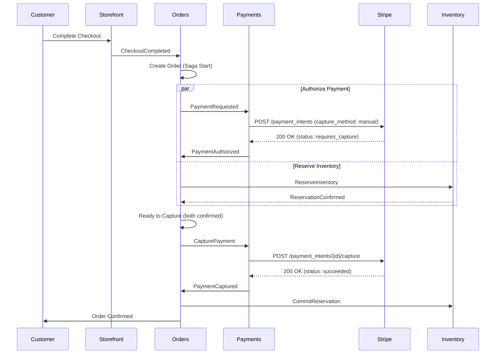
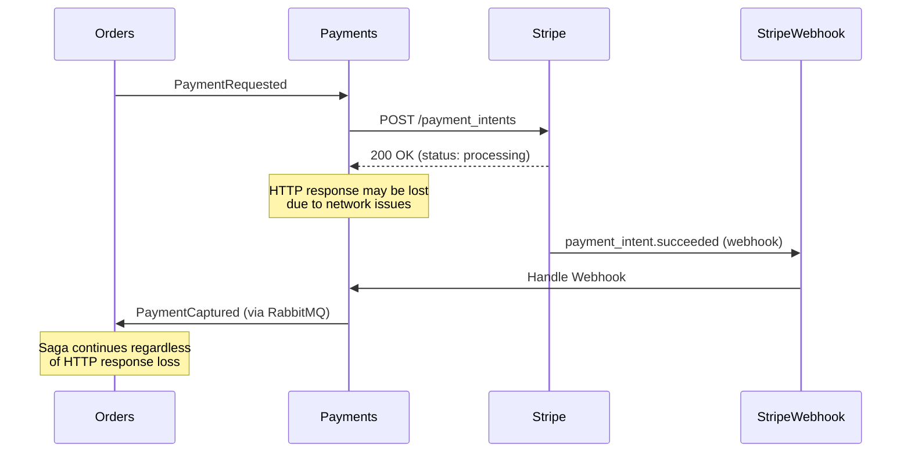
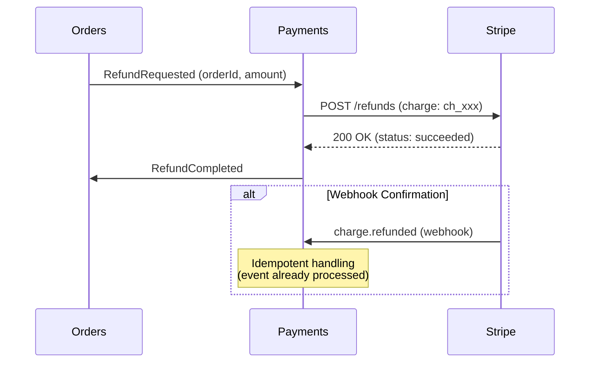

# Stripe API Integration Research Spike

**Date:** 2026-02-18  
**Status:** Research Complete  
**Purpose:** Understand Stripe's API patterns to scaffold a realistic payment gateway integration for CritterSupply's reference architecture

## Executive Summary

This document provides a comprehensive overview of Stripe's API structure and integration patterns to guide implementation of a production-ready payment gateway for the Payments BC. Stripe's API design demonstrates industry-standard patterns for event-driven payment processing, making it an ideal reference for developers learning third-party API integration.

**Key Findings:**
- Stripe uses a **PaymentIntent** model (not direct charges) for modern payment flows
- Webhooks are essential for async event handling (payment success/failure notifications)
- Two-phase commit pattern (authorize → capture) aligns well with CritterSupply's order saga
- Customer and PaymentMethod objects enable saved payment methods
- Idempotency keys prevent duplicate charges in distributed systems

## Core Stripe Concepts

### 1. PaymentIntent

The **PaymentIntent** is Stripe's primary abstraction for processing payments. It represents the full lifecycle of a payment from creation through confirmation.

**Key Properties:**
```csharp
public sealed record StripePaymentIntent
{
    public string Id { get; init; } = default!;               // pi_xxx
    public string Status { get; init; } = default!;           // See statuses below
    public long Amount { get; init; }                         // Amount in cents (e.g., 1999 = $19.99)
    public string Currency { get; init; } = default!;         // "usd", "eur", etc.
    public string? ClientSecret { get; init; }                // For client-side confirmation
    public string? CustomerId { get; init; }                  // cus_xxx (optional)
    public string? PaymentMethodId { get; init; }             // pm_xxx
    public DateTimeOffset Created { get; init; }
    public DateTimeOffset? CanceledAt { get; init; }
    public string? CancellationReason { get; init; }
    public StripeChargeData? LatestCharge { get; init; }      // ch_xxx when captured
    public Dictionary<string, string> Metadata { get; init; } = new();  // Custom data
}
```

**PaymentIntent Statuses:**
- `requires_payment_method` — Waiting for payment method attachment
- `requires_confirmation` — Ready to confirm (client-side or server-side)
- `requires_action` — Needs additional customer action (3D Secure, etc.)
- `processing` — Being processed by payment networks
- `requires_capture` — **Authorized, awaiting capture** (manual capture mode)
- `succeeded` — **Payment completed successfully**
- `canceled` — Canceled before completion

### 2. PaymentMethod

Represents a customer's payment instrument (card, bank account, digital wallet).

**Key Properties:**
```csharp
public sealed record StripePaymentMethod
{
    public string Id { get; init; } = default!;               // pm_xxx
    public string Type { get; init; } = default!;             // "card", "us_bank_account", etc.
    public string? CustomerId { get; init; }                  // If attached to customer
    public StripeCardDetails? Card { get; init; }             // Card-specific data
    public DateTimeOffset Created { get; init; }
}

public sealed record StripeCardDetails
{
    public string Brand { get; init; } = default!;            // "visa", "mastercard", etc.
    public string Last4 { get; init; } = default!;            // Last 4 digits
    public int ExpMonth { get; init; }
    public int ExpYear { get; init; }
    public string? Fingerprint { get; init; }                 // Unique card identifier
}
```

### 3. Customer

Represents a customer in Stripe's system (enables saved payment methods, subscriptions, etc.).

**Key Properties:**
```csharp
public sealed record StripeCustomer
{
    public string Id { get; init; } = default!;               // cus_xxx
    public string? Email { get; init; }
    public string? Name { get; init; }
    public Dictionary<string, string> Metadata { get; init; } = new();
    public DateTimeOffset Created { get; init; }
}
```

### 4. Charge

Represents a successful payment (created automatically when PaymentIntent succeeds).

**Key Properties:**
```csharp
public sealed record StripeCharge
{
    public string Id { get; init; } = default!;               // ch_xxx
    public long Amount { get; init; }                         // Amount captured
    public string Currency { get; init; } = default!;
    public string? PaymentIntentId { get; init; }             // Back-reference to intent
    public bool Captured { get; init; }                       // True if captured
    public bool Refunded { get; init; }                       // True if fully refunded
    public long AmountRefunded { get; init; }                 // Amount refunded (cents)
    public DateTimeOffset Created { get; init; }
}
```

### 5. Refund

Represents a refund of a previous charge.

**Key Properties:**
```csharp
public sealed record StripeRefund
{
    public string Id { get; init; } = default!;               // re_xxx
    public long Amount { get; init; }                         // Refund amount (cents)
    public string ChargeId { get; init; } = default!;         // ch_xxx being refunded
    public string Status { get; init; } = default!;           // "succeeded", "failed", "pending"
    public string? Reason { get; init; }                      // "duplicate", "fraudulent", etc.
    public DateTimeOffset Created { get; init; }
}
```

## API Operations

### Create PaymentIntent

**Endpoint:** `POST /v1/payment_intents`

**Request:**
```json
{
  "amount": 1999,
  "currency": "usd",
  "customer": "cus_xxx",
  "payment_method": "pm_xxx",
  "confirmation_method": "automatic",
  "capture_method": "manual",
  "metadata": {
    "order_id": "ord_123456"
  }
}
```

**Response (201 Created):**
```json
{
  "id": "pi_xxx",
  "object": "payment_intent",
  "status": "requires_capture",
  "amount": 1999,
  "currency": "usd",
  "customer": "cus_xxx",
  "payment_method": "pm_xxx",
  "client_secret": "pi_xxx_secret_yyy",
  "created": 1708275600,
  "metadata": {
    "order_id": "ord_123456"
  }
}
```

### Capture PaymentIntent

**Endpoint:** `POST /v1/payment_intents/{id}/capture`

**Request:**
```json
{
  "amount_to_capture": 1999
}
```

**Response (200 OK):**
```json
{
  "id": "pi_xxx",
  "status": "succeeded",
  "amount": 1999,
  "amount_received": 1999,
  "charges": {
    "data": [{
      "id": "ch_xxx",
      "amount": 1999,
      "captured": true
    }]
  }
}
```

### Cancel PaymentIntent

**Endpoint:** `POST /v1/payment_intents/{id}/cancel`

**Response (200 OK):**
```json
{
  "id": "pi_xxx",
  "status": "canceled",
  "cancellation_reason": "requested_by_customer"
}
```

### Create Refund

**Endpoint:** `POST /v1/refunds`

**Request:**
```json
{
  "charge": "ch_xxx",
  "amount": 1999,
  "reason": "requested_by_customer"
}
```

**Response (200 OK):**
```json
{
  "id": "re_xxx",
  "object": "refund",
  "amount": 1999,
  "charge": "ch_xxx",
  "status": "succeeded",
  "created": 1708275700
}
```

## Webhook Events

Stripe sends webhook events for async notifications. This is **critical** for production systems since:
- Payment confirmation can take seconds (3D Secure, bank transfers)
- Network failures can cause request/response to fail
- Webhooks provide eventual consistency guarantees

### Key Events

**Payment Lifecycle:**
- `payment_intent.created` — Intent created
- `payment_intent.processing` — Payment being processed
- `payment_intent.requires_action` — Customer action needed (3D Secure)
- `payment_intent.succeeded` — **Payment completed successfully**
- `payment_intent.payment_failed` — **Payment failed**
- `payment_intent.canceled` — Intent canceled

**Charge Lifecycle:**
- `charge.succeeded` — Charge captured
- `charge.failed` — Charge failed
- `charge.refunded` — Full refund processed
- `charge.refund.updated` — Partial refund or refund status change

**Refund Lifecycle:**
- `refund.created` — Refund initiated
- `refund.updated` — Refund status changed
- `refund.failed` — Refund failed

### Webhook Payload Structure

All webhook events follow this structure:

```json
{
  "id": "evt_xxx",
  "object": "event",
  "type": "payment_intent.succeeded",
  "created": 1708275600,
  "data": {
    "object": {
      "id": "pi_xxx",
      "status": "succeeded",
      "amount": 1999,
      "currency": "usd",
      "metadata": {
        "order_id": "ord_123456"
      }
    }
  },
  "livemode": false
}
```

### Webhook Security

**Stripe-Signature Header:**
Stripe signs webhooks with HMAC-SHA256. Verify signature to prevent spoofing:

```csharp
public static bool VerifyWebhookSignature(
    string payload,
    string signatureHeader,
    string webhookSecret)
{
    // Parse header: t=timestamp,v1=signature
    var elements = signatureHeader.Split(',');
    var timestamp = elements[0].Split('=')[1];
    var signature = elements[1].Split('=')[1];

    // Construct signed payload
    var signedPayload = $"{timestamp}.{payload}";

    // Compute HMAC-SHA256
    using var hmac = new HMACSHA256(Encoding.UTF8.GetBytes(webhookSecret));
    var hash = hmac.ComputeHash(Encoding.UTF8.GetBytes(signedPayload));
    var computedSignature = BitConverter.ToString(hash).Replace("-", "").ToLowerInvariant();

    return signature == computedSignature;
}
```

## Integration Patterns

### Pattern 1: Authorize → Capture (Two-Phase Commit)

**Use Case:** Reserve funds during checkout, capture after inventory confirmed.

**Flow:**
```
1. Customer completes checkout
2. Create PaymentIntent with capture_method: "manual"
3. Stripe authorizes payment (status: requires_capture)
4. Order saga confirms inventory reservation
5. Capture PaymentIntent
6. Stripe captures funds (status: succeeded)
```

**Alignment with CritterSupply:**
```
Order Saga Flow:
  PlaceOrder
    └─> PaymentRequested (Payments BC)
        └─> Authorize PaymentIntent (Stripe)
            └─> PaymentAuthorized (Orders BC)
  
  InventoryReserved (from Inventory BC)
    └─> Order saga: ready to capture
        └─> CapturePayment (Payments BC)
            └─> Capture PaymentIntent (Stripe)
                └─> PaymentCaptured (Orders BC)
```

### Pattern 2: Immediate Capture (One-Phase)

**Use Case:** Digital products, no inventory concerns.

**Flow:**
```
1. Customer completes checkout
2. Create PaymentIntent with capture_method: "automatic"
3. Stripe authorizes and captures immediately (status: succeeded)
```

### Pattern 3: Webhook-Driven Updates

**Use Case:** Handle async payment completion (3D Secure, bank transfers).

**Flow:**
```
1. Create PaymentIntent (status: requires_action)
2. Customer completes 3D Secure challenge
3. Stripe webhook: payment_intent.succeeded
4. Payments BC handles webhook → publishes PaymentCaptured
5. Order saga continues
```

**Critical for Production:**
- Network failures can lose HTTP responses
- Some payment methods (bank transfers) take hours/days
- Webhooks provide guaranteed event delivery (with retries)

## Idempotency

Stripe requires **Idempotency-Key** header for safe retries:

```csharp
public async Task<StripePaymentIntent> CreatePaymentIntentAsync(
    decimal amount,
    string currency,
    string customerId,
    string paymentMethodId,
    string idempotencyKey,  // <-- Critical for retries
    CancellationToken ct)
{
    using var request = new HttpRequestMessage(HttpMethod.Post, "/v1/payment_intents");
    request.Headers.Add("Idempotency-Key", idempotencyKey);
    
    // ... set request body
    
    var response = await _httpClient.SendAsync(request, ct);
    // ...
}
```

**Best Practice:** Use `orderId` or `paymentId` as idempotency key (deterministic, unique).

## Error Handling

### Error Response Structure

```json
{
  "error": {
    "type": "card_error",
    "code": "card_declined",
    "message": "Your card was declined.",
    "decline_code": "insufficient_funds",
    "param": null
  }
}
```

### Error Types

| Type | Retriable? | Meaning |
|------|-----------|---------|
| `card_error` | ❌ No | Card declined, expired, insufficient funds |
| `invalid_request_error` | ❌ No | Bad request (missing params, invalid data) |
| `api_error` | ✅ Yes | Stripe internal error (rare) |
| `rate_limit_error` | ✅ Yes | Too many requests (429) |
| `authentication_error` | ❌ No | Invalid API key |

### Decline Codes (card_error)

| Decline Code | Retriable? | Meaning |
|--------------|-----------|---------|
| `insufficient_funds` | ❌ No | Not enough money |
| `card_declined` | ❌ No | Generic decline |
| `expired_card` | ❌ No | Card expired |
| `incorrect_cvc` | ❌ No | Wrong CVC |
| `processing_error` | ✅ Yes | Temporary network issue |
| `do_not_honor` | ❌ No | Bank declined (no reason given) |

## Mapping to Existing IPaymentGateway

The existing `IPaymentGateway` interface aligns well with Stripe's API:

| IPaymentGateway Method | Stripe API Mapping |
|------------------------|-------------------|
| `AuthorizeAsync()` | `POST /v1/payment_intents` (capture_method: manual) |
| `CaptureAsync()` | `POST /v1/payment_intents` (capture_method: automatic) |
| `CaptureAuthorizedAsync()` | `POST /v1/payment_intents/{id}/capture` |
| `RefundAsync()` | `POST /v1/refunds` |

**Recommended Enhancements:**

1. **Add Customer Management:**
   ```csharp
   Task<GatewayCustomerResult> CreateCustomerAsync(
       string email,
       string? name,
       Dictionary<string, string> metadata,
       CancellationToken ct);
   ```

2. **Add PaymentMethod Attachment:**
   ```csharp
   Task<GatewayResult> AttachPaymentMethodAsync(
       string customerId,
       string paymentMethodId,
       CancellationToken ct);
   ```

3. **Enhance GatewayResult:**
   ```csharp
   public sealed record GatewayResult(
       bool Success,
       string? TransactionId,
       string? FailureReason,
       bool IsRetriable,
       string? DeclineCode,        // NEW: Specific decline reason
       PaymentStatus? Status);      // NEW: Current payment status
   ```

## Recommended Architecture

### 1. StripePaymentGateway Implementation

```csharp
namespace Payments.Processing;

public sealed class StripePaymentGateway : IPaymentGateway
{
    private readonly HttpClient _httpClient;
    private readonly string _apiKey;
    private readonly ILogger<StripePaymentGateway> _logger;

    public StripePaymentGateway(
        HttpClient httpClient,
        IConfiguration configuration,
        ILogger<StripePaymentGateway> logger)
    {
        _httpClient = httpClient;
        _apiKey = configuration["Stripe:SecretKey"]
            ?? throw new InvalidOperationException("Stripe:SecretKey not configured");
        _logger = logger;

        // Set base URL and authorization
        _httpClient.BaseAddress = new Uri("https://api.stripe.com");
        _httpClient.DefaultRequestHeaders.Authorization =
            new AuthenticationHeaderValue("Bearer", _apiKey);
    }

    public async Task<GatewayResult> AuthorizeAsync(
        decimal amount,
        string currency,
        string paymentMethodToken,
        CancellationToken ct)
    {
        var idempotencyKey = $"auth-{Guid.NewGuid()}";

        try
        {
            var payload = new Dictionary<string, string>
            {
                ["amount"] = ConvertToStripeAmount(amount, currency).ToString(),
                ["currency"] = currency.ToLowerInvariant(),
                ["payment_method"] = paymentMethodToken,
                ["confirmation_method"] = "automatic",
                ["capture_method"] = "manual",  // Two-phase commit
                ["confirm"] = "true"
            };

            using var request = new HttpRequestMessage(HttpMethod.Post, "/v1/payment_intents");
            request.Headers.Add("Idempotency-Key", idempotencyKey);
            request.Content = new FormUrlEncodedContent(payload);

            var response = await _httpClient.SendAsync(request, ct);
            var content = await response.Content.ReadAsStringAsync(ct);

            if (!response.IsSuccessStatusCode)
            {
                var error = JsonSerializer.Deserialize<StripeErrorResponse>(content);
                return MapStripeError(error);
            }

            var intent = JsonSerializer.Deserialize<StripePaymentIntent>(content);

            // Status: requires_capture means authorized successfully
            if (intent.Status == "requires_capture")
            {
                return new GatewayResult(
                    Success: true,
                    TransactionId: intent.Id,
                    FailureReason: null,
                    IsRetriable: false);
            }

            // Other statuses (requires_action, processing) would need async handling
            _logger.LogWarning(
                "PaymentIntent in unexpected status: {Status} for {IntentId}",
                intent.Status, intent.Id);

            return new GatewayResult(
                Success: false,
                TransactionId: intent.Id,
                FailureReason: $"Payment requires action: {intent.Status}",
                IsRetriable: true);
        }
        catch (HttpRequestException ex)
        {
            _logger.LogError(ex, "HTTP error during Stripe authorization");
            return new GatewayResult(false, null, "Network error", true);
        }
    }

    public async Task<GatewayResult> CaptureAuthorizedAsync(
        string authorizationId,
        decimal amount,
        CancellationToken ct)
    {
        var idempotencyKey = $"capture-{authorizationId}";

        try
        {
            var payload = new Dictionary<string, string>
            {
                ["amount_to_capture"] = ConvertToStripeAmount(amount, "usd").ToString()
            };

            using var request = new HttpRequestMessage(
                HttpMethod.Post,
                $"/v1/payment_intents/{authorizationId}/capture");
            request.Headers.Add("Idempotency-Key", idempotencyKey);
            request.Content = new FormUrlEncodedContent(payload);

            var response = await _httpClient.SendAsync(request, ct);
            var content = await response.Content.ReadAsStringAsync(ct);

            if (!response.IsSuccessStatusCode)
            {
                var error = JsonSerializer.Deserialize<StripeErrorResponse>(content);
                return MapStripeError(error);
            }

            var intent = JsonSerializer.Deserialize<StripePaymentIntent>(content);

            if (intent.Status == "succeeded")
            {
                // Extract charge ID from latest_charge
                var chargeId = intent.LatestCharge?.Id ?? intent.Id;

                return new GatewayResult(
                    Success: true,
                    TransactionId: chargeId,
                    FailureReason: null,
                    IsRetriable: false);
            }

            return new GatewayResult(
                Success: false,
                TransactionId: intent.Id,
                FailureReason: $"Capture failed: {intent.Status}",
                IsRetriable: false);
        }
        catch (HttpRequestException ex)
        {
            _logger.LogError(ex, "HTTP error during Stripe capture");
            return new GatewayResult(false, null, "Network error", true);
        }
    }

    public async Task<GatewayResult> RefundAsync(
        string transactionId,
        decimal amount,
        CancellationToken ct)
    {
        var idempotencyKey = $"refund-{transactionId}-{amount}";

        try
        {
            var payload = new Dictionary<string, string>
            {
                ["charge"] = transactionId,
                ["amount"] = ConvertToStripeAmount(amount, "usd").ToString()
            };

            using var request = new HttpRequestMessage(HttpMethod.Post, "/v1/refunds");
            request.Headers.Add("Idempotency-Key", idempotencyKey);
            request.Content = new FormUrlEncodedContent(payload);

            var response = await _httpClient.SendAsync(request, ct);
            var content = await response.Content.ReadAsStringAsync(ct);

            if (!response.IsSuccessStatusCode)
            {
                var error = JsonSerializer.Deserialize<StripeErrorResponse>(content);
                return MapStripeError(error);
            }

            var refund = JsonSerializer.Deserialize<StripeRefund>(content);

            if (refund.Status == "succeeded")
            {
                return new GatewayResult(
                    Success: true,
                    TransactionId: refund.Id,
                    FailureReason: null,
                    IsRetriable: false);
            }

            return new GatewayResult(
                Success: false,
                TransactionId: refund.Id,
                FailureReason: $"Refund {refund.Status}",
                IsRetriable: refund.Status == "pending");
        }
        catch (HttpRequestException ex)
        {
            _logger.LogError(ex, "HTTP error during Stripe refund");
            return new GatewayResult(false, null, "Network error", true);
        }
    }

    private static long ConvertToStripeAmount(decimal amount, string currency)
    {
        // Stripe expects amounts in smallest currency unit (cents for USD)
        // Zero-decimal currencies (JPY, KRW) don't multiply
        var zeroDecimalCurrencies = new[] { "jpy", "krw" };

        if (zeroDecimalCurrencies.Contains(currency.ToLowerInvariant()))
        {
            return (long)amount;
        }

        return (long)(amount * 100);
    }

    private static GatewayResult MapStripeError(StripeErrorResponse? errorResponse)
    {
        if (errorResponse?.Error == null)
        {
            return new GatewayResult(false, null, "Unknown error", false);
        }

        var error = errorResponse.Error;

        var isRetriable = error.Type switch
        {
            "api_error" => true,
            "rate_limit_error" => true,
            _ => false
        };

        // Card errors with specific decline codes
        if (error.Type == "card_error" && error.DeclineCode != null)
        {
            isRetriable = error.DeclineCode == "processing_error";
        }

        return new GatewayResult(
            Success: false,
            TransactionId: null,
            FailureReason: error.Message,
            IsRetriable: isRetriable);
    }
}

// Stripe response models
internal sealed record StripeErrorResponse(StripeError Error);

internal sealed record StripeError(
    string Type,
    string? Code,
    string Message,
    string? DeclineCode);
```

### 2. Webhook Handler

```csharp
namespace Payments.Api.Webhooks;

public static class StripeWebhookHandler
{
    [WolverinePost("/api/webhooks/stripe")]
    public static async Task<IResult> Handle(
        [FromBody] StripeWebhookEvent webhookEvent,
        [FromHeader("Stripe-Signature")] string signature,
        IConfiguration configuration,
        IMessageBus messageBus,
        ILogger<StripeWebhookHandler> logger,
        CancellationToken ct)
    {
        // Verify webhook signature
        var webhookSecret = configuration["Stripe:WebhookSecret"];
        if (!VerifySignature(signature, webhookSecret))
        {
            logger.LogWarning("Webhook signature verification failed");
            return Results.Unauthorized();
        }

        logger.LogInformation(
            "Received Stripe webhook: {EventType} for {ObjectId}",
            webhookEvent.Type,
            webhookEvent.Data.Object.Id);

        // Handle event based on type
        switch (webhookEvent.Type)
        {
            case "payment_intent.succeeded":
                await HandlePaymentSucceeded(webhookEvent, messageBus, ct);
                break;

            case "payment_intent.payment_failed":
                await HandlePaymentFailed(webhookEvent, messageBus, ct);
                break;

            case "charge.refunded":
                await HandleChargeRefunded(webhookEvent, messageBus, ct);
                break;

            default:
                logger.LogInformation("Unhandled webhook event: {EventType}", webhookEvent.Type);
                break;
        }

        return Results.Ok();
    }

    private static async Task HandlePaymentSucceeded(
        StripeWebhookEvent webhookEvent,
        IMessageBus messageBus,
        CancellationToken ct)
    {
        var intent = webhookEvent.Data.Object;

        // Extract order ID from metadata
        if (!intent.Metadata.TryGetValue("payment_id", out var paymentIdStr) ||
            !Guid.TryParse(paymentIdStr, out var paymentId))
        {
            return; // Can't correlate to internal payment
        }

        // Publish internal event
        await messageBus.PublishAsync(
            new PaymentCaptured(
                paymentId,
                intent.Id,
                DateTimeOffset.UtcNow),
            ct);
    }

    private static async Task HandlePaymentFailed(
        StripeWebhookEvent webhookEvent,
        IMessageBus messageBus,
        CancellationToken ct)
    {
        var intent = webhookEvent.Data.Object;

        if (!intent.Metadata.TryGetValue("payment_id", out var paymentIdStr) ||
            !Guid.TryParse(paymentIdStr, out var paymentId))
        {
            return;
        }

        await messageBus.PublishAsync(
            new PaymentFailed(
                paymentId,
                intent.LastPaymentError?.Message ?? "Payment failed",
                IsRetriable: false,
                DateTimeOffset.UtcNow),
            ct);
    }

    private static async Task HandleChargeRefunded(
        StripeWebhookEvent webhookEvent,
        IMessageBus messageBus,
        CancellationToken ct)
    {
        // Handle refund completion
        // ...
    }

    private static bool VerifySignature(string signature, string secret)
    {
        // Implementation from earlier in document
        // ...
        return true; // Stub for now
    }
}
```

## Integration Flow Diagrams

### Two-Phase Commit Flow (Authorize → Capture)



### Webhook-Driven Flow



### Refund Flow



## Configuration

### appsettings.json

```json
{
  "Stripe": {
    "SecretKey": "",  // sk_test_xxx (use user secrets in dev)
    "PublishableKey": "",  // pk_test_xxx (for client-side, future)
    "WebhookSecret": ""  // whsec_xxx (for webhook verification)
  },
  "PaymentGateway": {
    "Provider": "Stripe",  // "Stub" for dev/test
    "TimeoutSeconds": 30,
    "RetryCount": 3
  }
}
```

### User Secrets (Development)

```bash
dotnet user-secrets set "Stripe:SecretKey" "sk_test_xxx"
dotnet user-secrets set "Stripe:WebhookSecret" "whsec_xxx"
```

## Testing Strategy

### 1. Unit Tests (Stub Gateway)

```csharp
[Fact]
public async Task StubGateway_WithSuccessToken_AuthorizesPayment()
{
    var gateway = new StubPaymentGateway();
    
    var result = await gateway.AuthorizeAsync(
        19.99m,
        "usd",
        "tok_success_12345",
        CancellationToken.None);
    
    result.Success.ShouldBeTrue();
    result.TransactionId.ShouldStartWith("auth_");
}

[Fact]
public async Task StubGateway_WithDeclineToken_FailsNonRetriable()
{
    var gateway = new StubPaymentGateway();
    
    var result = await gateway.AuthorizeAsync(
        19.99m,
        "usd",
        "tok_decline_insufficient_funds",
        CancellationToken.None);
    
    result.Success.ShouldBeFalse();
    result.IsRetriable.ShouldBeFalse();
    result.FailureReason.ShouldContain("declined");
}
```

### 2. Integration Tests (Stripe Test Mode)

```csharp
public class StripePaymentGatewayTests : IAsyncLifetime
{
    private readonly StripePaymentGateway _gateway;

    public StripePaymentGatewayTests()
    {
        var config = new ConfigurationBuilder()
            .AddUserSecrets<StripePaymentGatewayTests>()
            .Build();

        var httpClient = new HttpClient();
        var logger = new NullLogger<StripePaymentGateway>();

        _gateway = new StripePaymentGateway(httpClient, config, logger);
    }

    [Fact]
    [Trait("Category", "Integration")]
    public async Task AuthorizeAndCapture_WithTestCard_Succeeds()
    {
        // Stripe test card: 4242 4242 4242 4242 (always succeeds)
        var paymentMethodId = await CreateTestPaymentMethod("pm_card_visa");

        // Authorize
        var authResult = await _gateway.AuthorizeAsync(
            19.99m,
            "usd",
            paymentMethodId,
            CancellationToken.None);

        authResult.Success.ShouldBeTrue();
        authResult.TransactionId.ShouldStartWith("pi_");

        // Capture
        var captureResult = await _gateway.CaptureAuthorizedAsync(
            authResult.TransactionId!,
            19.99m,
            CancellationToken.None);

        captureResult.Success.ShouldBeTrue();
    }

    private async Task<string> CreateTestPaymentMethod(string testCard)
    {
        // Use Stripe test tokens for integration tests
        return testCard;
    }
}
```

### 3. Webhook Testing (Local Stripe CLI)

```bash
# Install Stripe CLI
brew install stripe/stripe-cli/stripe

# Forward webhooks to local API
stripe listen --forward-to http://localhost:5232/api/webhooks/stripe

# Trigger test events
stripe trigger payment_intent.succeeded
stripe trigger payment_intent.payment_failed
stripe trigger charge.refunded
```

## Production Considerations

### 1. Idempotency Key Storage

Store idempotency keys to prevent duplicate retries:

```csharp
public sealed record PaymentAttempt(
    Guid Id,
    Guid PaymentId,
    string IdempotencyKey,
    DateTimeOffset AttemptedAt,
    string? ErrorMessage);

// Store before calling Stripe
session.Store(new PaymentAttempt(
    Guid.CreateVersion7(),
    paymentId,
    idempotencyKey,
    DateTimeOffset.UtcNow,
    null));
```

### 2. Webhook Deduplication

Stripe may send duplicate webhooks. Use event ID for deduplication:

```csharp
public sealed record ProcessedWebhookEvent(
    string StripeEventId,
    DateTimeOffset ProcessedAt);

// Check before processing
var existing = await session.Query<ProcessedWebhookEvent>()
    .FirstOrDefaultAsync(e => e.StripeEventId == webhookEvent.Id, ct);

if (existing != null)
{
    return Results.Ok(); // Already processed
}

// Process event...

// Store event ID
session.Store(new ProcessedWebhookEvent(webhookEvent.Id, DateTimeOffset.UtcNow));
```

### 3. Rate Limiting

Stripe rate limits:
- **Test mode:** 100 req/sec
- **Production:** 100 req/sec (burst to 1000/sec)

Implement exponential backoff for `rate_limit_error` (429):

```csharp
private async Task<GatewayResult> ExecuteWithRetryAsync(
    Func<Task<HttpResponseMessage>> operation,
    CancellationToken ct)
{
    var attempts = 0;
    var maxAttempts = 3;
    var baseDelay = TimeSpan.FromSeconds(1);

    while (attempts < maxAttempts)
    {
        try
        {
            var response = await operation();

            if (response.StatusCode == (HttpStatusCode)429)
            {
                var delay = TimeSpan.FromSeconds(Math.Pow(2, attempts)) + baseDelay;
                await Task.Delay(delay, ct);
                attempts++;
                continue;
            }

            return await ParseResponse(response);
        }
        catch (HttpRequestException)
        {
            if (attempts == maxAttempts - 1) throw;
            attempts++;
        }
    }

    return new GatewayResult(false, null, "Max retries exceeded", false);
}
```

### 4. Monitoring & Alerting

Key metrics to track:
- **Authorization success rate** (should be >95%)
- **Capture success rate** (should be >99%)
- **Average authorization time** (should be <2 seconds)
- **Webhook processing lag** (should be <5 seconds)
- **Failed payment reasons** (track decline codes for analytics)

## Recommended Implementation Phases

### Phase 1: Foundation (Week 1)
- [ ] Create `StripePaymentGateway` implementation
- [ ] Add Stripe configuration (appsettings.json)
- [ ] Implement authorize/capture/refund operations
- [ ] Unit tests with StubPaymentGateway
- [ ] Integration tests with Stripe test mode

### Phase 2: Webhook Support (Week 2)
- [ ] Create webhook endpoint (`/api/webhooks/stripe`)
- [ ] Implement signature verification
- [ ] Handle `payment_intent.succeeded` event
- [ ] Handle `payment_intent.payment_failed` event
- [ ] Handle `charge.refunded` event
- [ ] Webhook deduplication logic
- [ ] Local testing with Stripe CLI

### Phase 3: Production Hardening (Week 3)
- [ ] Idempotency key storage (Marten document store)
- [ ] Webhook event storage (for audit trail)
- [ ] Rate limiting with exponential backoff
- [ ] Detailed error logging (structured logging)
- [ ] Monitoring dashboards (failed payments, processing times)
- [ ] Alert rules (high failure rate, webhook lag)

### Phase 4: Customer & PaymentMethod Management (Week 4)
- [ ] Extend `IPaymentGateway` with customer operations
- [ ] Create Stripe customers for repeat purchases
- [ ] Attach payment methods to customers
- [ ] List customer payment methods
- [ ] Set default payment method
- [ ] Integration with Customer Identity BC

## Next Steps

1. **Review with Team:** Discuss integration patterns (authorize vs immediate capture)
2. **Create ADR:** Document decision to use Stripe + justify webhook approach
3. **Update CONTEXTS.md:** Add Stripe integration flows to Payments BC section
4. **Prototype:** Build minimal `StripePaymentGateway` in feature branch
5. **Test:** Validate with Stripe test mode + webhook CLI
6. **Document:** Update `skills/external-service-integration.md` with Stripe examples

## References

- [Stripe API Documentation](https://stripe.com/docs/api) (conceptual reference)
- [Stripe Payment Intents](https://stripe.com/docs/payments/payment-intents) (conceptual reference)
- [Stripe Webhooks](https://stripe.com/docs/webhooks) (conceptual reference)
- [Stripe Testing](https://stripe.com/docs/testing) (conceptual reference)
- Existing: `skills/external-service-integration.md`
- Existing: `src/Payments/Payments/Processing/IPaymentGateway.cs`
- Existing: `CONTEXTS.md` (Payments BC section)
