# CritterSupply — Demo Readiness Analysis

**Author:** UX Engineer (in collaboration with Principal Architect & Product Owner)  
**Date:** 2026-02-26  
**Reviewed by:** Principal Architect (engineering risk), Product Owner (business accuracy)  
**Purpose:** Prioritized gap analysis for demo preparation + input artifact for Event Storming / Event Modeling session

---

> **How to use this document:**
>
> - **Demo preparation** — Work top-to-bottom through Priority 1 items before attempting any live demo
> - **Event storming / event modeling** — Use the [Event Model Summary](#event-model-summary) section as the starting domain map; open questions drive discussion agenda
> - **PO & Engineer discussions** — Targeted questions are flagged with 👤 PO and 🔧 Engineer icons

---

## The Demo Journey (Happy Path)

The CritterSupply happy path spans six bounded contexts in order. Every demo participant should understand this spine before diving into gaps:

```mermaid
sequenceDiagram
    actor Customer
    participant Cat as 🗂 Product Catalog
    participant CI as 👤 Customer Identity
    participant Shop as 🛒 Shopping
    participant CE as 🖥 Customer Experience (BFF)
    participant Ord as 📦 Orders
    participant Inv as 🏪 Inventory
    participant Pay as 💳 Payments
    participant Ful as 🚚 Fulfillment

    Customer->>Cat: Browse & find products
    Customer->>CI: Register + add shipping address
    Customer->>Shop: Create cart, add items
    Shop->>CE: ItemAdded event → real-time cart badge update (SSE)
    Customer->>Shop: Initiate checkout
    Shop->>Ord: CheckoutInitiated (cart snapshot)
    Customer->>Ord: Complete checkout wizard (address, shipping, payment)
    Ord->>Inv: OrderPlaced → ReserveStock
    Ord->>Pay: OrderPlaced → AuthorizePayment
    Inv->>Ord: ReservationConfirmed
    Pay->>Ord: PaymentAuthorized → CapturePayment
    Pay->>Ord: PaymentCaptured
    Ord->>Inv: ReservationCommitRequested → ReservationCommitted
    Ord->>Ful: FulfillmentRequested
    Ful->>Ord: ShipmentDispatched (tracking number)
    Ful->>Ord: ShipmentDelivered
    CE->>Customer: Real-time SSE updates at every saga transition
```

**10 bounded context transitions. 7 integration messages on the happy path. Every transition is a potential demo failure point.**

---

## What Works Today (Demo Baseline ✅)

The following are confirmed working and can be demonstrated with confidence using the BC APIs directly (Swagger / `.http` files):

| Step | BC | What You Can Demo |
|------|----|-------------------|
| Add product to catalog | Product Catalog | `POST /api/products` — full CRUD, search, filter by category |
| Register customer | Customer Identity | `POST /api/customers` + add addresses |
| Create cart + add items | Shopping | `POST /api/carts`, `POST /api/carts/{id}/items` — quantity merge, remove, clear |
| Initiate checkout | Shopping → Orders | `POST /api/carts/{id}/checkout` — seals cart, Orders receives snapshot |
| Checkout wizard (4 steps) | Orders | Shipping address, shipping method, payment method, complete — all wired |
| Address snapshot at checkout | Orders ↔ Customer Identity | Orders calls CI at `CompleteCheckout` — immutable snapshot captured |
| Inventory reservation | Inventory | `ReserveStock`, `CommitReservation`, `ReleaseReservation` all working |
| Payment authorize + capture | Payments | Two-phase stub gateway — `PaymentAuthorized` + `PaymentCaptured` |
| Inventory commit after payment | Orders saga | `ReservationCommitRequested` → `ReservationCommitted` |
| Fulfillment request + dispatch | Fulfillment | Shipment aggregate created, `ShipmentDispatched` (stub tracking number) |
| Delivery confirmation | Fulfillment | `ConfirmDelivery` → saga transitions to `Delivered` |
| Compensation: payment failure | Orders + Inventory | `ReservationReleaseRequested` → `ReservationReleased` → `Cancelled` |
| Real-time cart SSE | Customer Experience | `ItemAdded`, `ItemRemoved`, `ItemQuantityChanged` → SSE events broadcast |
| Order placed SSE | Customer Experience | `OrderPlaced` → SSE event broadcast |

---

## Priority 1 — Demo Blockers 🛑

*These gaps will cause a live demo to visibly fail or produce misleading results. Must be resolved or explicitly scripted around before any audience-facing demo.*

---

### 🛑 1. SSE Broadcasts to ALL Clients — No Customer Isolation

**Bounded Context:** Customer Experience (BFF)  
**Status:** ❌ Not implemented — privacy breach  
**Affects demo step:** Every SSE real-time update during the demo

**What happens:** The `EventBroadcaster` publishes every cart, order, and shipment event to every connected SSE client regardless of identity. If a presenter and one observer both have the storefront open, the observer sees the presenter's cart updates — and vice versa. In a room with 10 people, all 10 see all 10 users' activity.

**Demo script impact:** Unless every attendee's browser is on a separate machine not connected to `/sse/storefront`, the SSE panel will show a stream of events from all participants simultaneously. This looks broken, not impressive.

**Workaround for demo:** Have only one browser tab connected to `/sse/storefront` at a time. All other participants observe a screen-share rather than their own browser.

> 🔧 **For Principal Engineer:** What is the minimum viable fix for demo? Is it feasible to scope SSE channels by a `customerId` query parameter (`/sse/storefront?customerId=CUST-123`) as a short-term mitigation, even without full authentication? What's the effort?

> 👤 **For Product Owner:** For the demo, is a hardcoded/per-session customer ID acceptable as a stand-in for real authentication? This would unblock SSE isolation without implementing full auth.

---

### 🛑 2. BFF HTTP Clients are Stubs — Views Show Fake Data

**Bounded Context:** Customer Experience (BFF)  
**Status:** ⚠️ Stub implementations  
**Affects demo step:** Any screen that renders a composed view (CartView, CheckoutView, OrderStatusView)

**What happens:** The `IShoppingClient`, `IOrdersClient`, `IProductCatalogClient`, and `ICustomerIdentityClient` implementations in the BFF are stubs that return hardcoded/empty data. The storefront web app shows pre-canned mock data, not real data from the downstream BCs.

**Demo script impact:** If the demo uses the Blazor storefront web app (`Storefront.Web`), the cart and order views will not reflect actions taken against the real APIs. A presenter who adds a product to their cart via the Shopping BC API will not see it in the storefront UI.

**Workaround for demo:** Demonstrate each BC's API independently via Swagger or `.http` files rather than going through the Blazor web UI. This shifts the demo from "customer experience" to "API walkthrough" — less compelling visually.

> 🔧 **For Principal Engineer:** Which views are highest priority to wire up for a real demo? Is `CartView` (Shopping BC call) achievable quickly? What are the blockers — is it the stub pattern or also missing auth context?

> 👤 **For Product Owner:** Is an API-walkthrough demo (using Swagger / REST client) acceptable, or does the demo need to show the Blazor web UI working end-to-end?

---

### 🛑 3. No Authoritative Product Price — Shopping BC Accepts Client-Provided Price

**Bounded Context:** Shopping BC ↔ Product Catalog BC  
**Status:** ❌ Architectural gap — decision required  
**Affects demo step:** "Add item to cart"

**What happens:** When a customer (or demo presenter) adds an item to their cart, the `AddItemToCart` command includes the `UnitPrice` as a client-provided field. The Shopping BC records this price without validating it against the Product Catalog. The Product Catalog does not currently store a price field.

**Demo script impact:** The presenter must manually type in a price when adding items to the cart. This is a visible wart during a demo — "why does the customer set their own price?" It also means the Product Catalog BC is decorative for pricing in its current form.

**Workaround for demo:** Prepare a strict demo script where the presenter always provides the correct price. Document the intended behavior (catalog owns price) in a slide / verbal note during the demo.

> 👤 **For Product Owner:** **Critical business decision.** Where does product price live?
> - **Option A (simplest):** Add a `Price` field directly to the `Product` document in Product Catalog. Shopping BC fetches price during `AddItemToCart`. Client-provided price is discarded/overridden.
> - **Option B (future-proof):** Separate Pricing BC — supports promotional pricing, customer tiers, time-limited sales. Much more complex.
> - **Option C (temporary bridge):** Add price to Catalog now (Option A) with a clear ADR that it will move to a Pricing BC later.

> 🔧 **For Principal Engineer:** If PO chooses Option A, what's the effort to add `Price` to the Product document and update `AddItemToCart` to fetch it from Catalog BC synchronously? Is there a coupling concern with a sync call from Shopping → Catalog?

---

### 🛑 4. CheckoutInitiated Uses Local Wolverine Queue (Not Durable)

**Bounded Context:** Shopping BC → Orders BC  
**Status:** ❌ Not implemented  
**Affects demo step:** "Customer initiates checkout" — the cart-to-orders handoff

**What happens:** When the customer clicks "Proceed to Checkout," Shopping BC appends `CheckoutInitiated` to the Cart stream (sealing it as terminal) and publishes the message to a local in-memory Wolverine queue. If the Orders BC restarts between the Shopping publish and the Orders consume, the message is gone. The cart is permanently sealed (`CheckedOut` state) but no Order was created.

**Demo script impact:** If any service restarts during the demo, or if the demo spans multiple session restarts (e.g., debugging), this failure is easy to trigger. Recovery requires direct DB intervention or starting over with a new cart.

**Workaround for demo:** Ensure Orders BC is fully healthy before demonstrating checkout. Do not restart any services mid-demo. Have a backup demo environment ready.

> 🔧 **For Principal Engineer:** Is migrating `CheckoutInitiated` to RabbitMQ a self-contained change? What cycle is this planned for, and is it feasible to pull it forward if the demo timeline requires it?

---

## Priority 2 — Demo Degraders ⚠️

*These gaps won't prevent the happy path from completing but will limit what scenarios the demo can credibly show, or require explicit "known limitation" acknowledgments.*

---

### ⚠️ 5. RefundCompleted Not Handled by Orders Saga — Compensation Chain Broken

**Bounded Context:** Orders BC (saga) ↔ Payments BC  
**Status:** ❌ Incomplete compensation flow  
**Affects demo step:** Error path — "inventory fails after payment captured"

**What happens:** If the Orders saga receives `ReservationFailed` after a payment has already been captured, it correctly sends `RefundRequested` to the Payments BC. Payments processes the refund and publishes `RefundCompleted`. But the Orders saga has no handler for `RefundCompleted` — the saga document stays in `InventoryFailed` state forever. Customer money is returned, but the order status reads "Processing" indefinitely.

**Demo script impact:** If the demo attempts to show a compensation scenario (e.g., "what happens when inventory runs out after payment?"), the order will be visibly stuck. This is P0 for production but limited to the error path in a demo.

**Workaround for demo:** Script the demo to only show the happy path. Explicitly note "error compensation flows are a known work-in-progress" if asked.

> 🔧 **For Principal Engineer:** Is adding a `RefundCompleted` handler to the Orders saga a small change (add a handler method + transition to `Cancelled`)? What's blocking this from Cycle 19?

> 👤 **For Product Owner:** When a refund is issued due to inventory failure, should the customer receive an automatic notification ("Your order was cancelled, refund issued")? This is a business policy the team needs before implementing the saga transition.

---

### ⚠️ 6. No Order Cancellation Endpoint

**Bounded Context:** Orders BC  
**Status:** ❌ Not implemented  
**Affects demo step:** "Customer wants to cancel before shipment"

**What happens:** No `POST /api/orders/{id}/cancel` endpoint exists. Customers cannot self-serve cancel a placed order. The demo cannot show a realistic "change my mind" flow, which is a table-stakes e-commerce feature.

**Demo script impact:** If an audience member asks "can customers cancel?" the answer is "support team only." For a pet supply e-commerce demo, this is a notable gap that a business user will immediately notice.

**Workaround for demo:** Have a scripted answer: "Self-serve cancellation is scoped for Cycle 21. For the demo, we'll show the full fulfillment path only."

> 👤 **For Product Owner:** Cancellation window policy decision needed before implementation:
> - Up until `FulfillmentRequested` is sent? (Most generous — industry standard)
> - Up until `PaymentCaptured`? (Narrow — payment still reversible)
> - Never self-serve (current state)?
>
> Amazon allows cancellation until "Preparing for shipment." Chewy allows cancellation within 1 hour. What's right for CritterSupply?

---

### ⚠️ 7. ShipmentDeliveryFailed Not Published to Orders

**Bounded Context:** Fulfillment BC → Orders BC  
**Status:** ❌ Not published  
**Affects demo step:** Error path — "delivery fails"

**What happens:** The `ShipmentDeliveryFailed` event is appended to the Shipment event stream but never published as an integration message to Orders BC. The Order saga stays in `Shipped` state. No customer notification is triggered.

**Demo script impact:** Limits the demo to happy-path delivery only. Cannot show "what happens when FedEx can't find the address" — a scenario audiences often ask about.

**Workaround for demo:** Demo the happy path only (`ShipmentDelivered`). Skip delivery failure scenarios.

> 👤 **For Product Owner:** After a failed delivery attempt, what should happen?
> - **Option A:** Notify customer after attempt 1 ("We tried to deliver — here's how to reschedule")
> - **Option B:** Notify only after all carrier attempts exhausted (3 attempts)
> - **Option C:** Auto-refund after return to warehouse
>
> This is a policy decision that determines what domain events we need to model (`DeliveryAttemptFailed` vs `ShipmentReturnedToWarehouse`).

---

### ⚠️ 8. No Inventory Check When Adding to Cart — OOS Items Silently Accepted

**Bounded Context:** Shopping BC  
**Status:** ❌ Not implemented  
**Affects demo step:** "Customer adds out-of-stock item to cart"

**What happens:** `AddItemToCart` appends `ItemAdded` unconditionally — no call to Inventory BC. Out-of-stock items appear in the cart with no warning. The failure is discovered only when the Orders saga tries to reserve stock, after the customer has entered their payment information.

**Demo script impact:** If a demo presenter accidentally adds a product for which inventory hasn't been initialized, the entire checkout will fail at the reservation step with a generic error. Looks like a system bug, not a business rule.

**Workaround for demo:** Before every demo, verify that all demo products have been initialized in Inventory BC with sufficient stock (`POST /api/inventory/initialize`). Keep a demo setup checklist.

> 👤 **For Product Owner:** Decisions needed:
> - Should out-of-stock items be **blocked at add-time** (requires sync Inventory call), **shown with a warning** ("Only 2 left!"), or **silently allowed** (current)?
> - The answer affects how we model the `AddItemToCart` command — does it publish a `ReservationCheckRequested` event (async) or make a synchronous query?

---

### ⚠️ 9. No Real Carrier Integration — Tracking Numbers Are Fake

**Bounded Context:** Fulfillment BC  
**Status:** ⚠️ Stub — hardcoded tracking number format  
**Affects demo step:** "Shipment dispatched with tracking number"

**What happens:** The carrier integration (FedEx, UPS, EasyPost) is a stub. `ShipmentDispatched` fires with a generated tracking number like `TRK-{Guid}`. The tracking number is not real and cannot be looked up on any carrier's website.

**Demo script impact:** Acceptable for a technical demo — the domain event fires correctly and the saga transitions to `Shipped`. However, for a business audience expecting a realistic e-commerce experience, a fake tracking number is a visible gap.

**Workaround for demo:** Acknowledge as "carrier integration is planned for Cycle 23" and show that the tracking number field exists in the domain model.

---

### ⚠️ 10. Warehouse Hardcoded to WH-01

**Bounded Context:** Inventory BC, Fulfillment BC  
**Status:** ⚠️ Hardcoded  
**Affects demo step:** "Stock reserved from warehouse"

**What happens:** All inventory reservations and fulfillment assignments use hardcoded warehouse `WH-01`. No warehouse routing logic exists.

**Demo script impact:** Invisible to most demo audiences — the system works, it just always ships from one warehouse. Call it out as a known simplification if asked.

> 👤 **For Product Owner:** When multiple warehouses are introduced, what's the selection strategy?
> - Nearest to customer (minimize shipping cost/time)?
> - Prioritize warehouse with lowest stock (balance inventory)?
> - Manual override by ops team?

---

### ⚠️ 11. Inventory Reservations Never Expire — Abandoned Checkouts Lock Stock

**Bounded Context:** Inventory BC  
**Status:** ❌ Not implemented  
**Affects demo step:** Not visible on happy path, but relevant for "abandoned checkout" scenarios

**What happens:** If a customer starts checkout but never completes it (e.g., browser closed mid-wizard), the `OrderPlaced` event has already reserved stock. Without a saga timeout in Orders, `ReservationReleaseRequested` is never sent. Stock is soft-held forever.

**Demo script impact:** During a single demo session, this is invisible. Across multiple demo runs (e.g., a week of demos with the same demo data), stock can become artificially depleted by abandoned demo sessions.

**Workaround for demo:** Reset inventory between demo runs by re-initializing stock levels. Document a "demo reset procedure."

> 👤 **For Product Owner:** What is the soft-hold TTL? 30 minutes? 1 hour? 24 hours?
>
> Per existing PO decisions (see `PO-DECISIONS.md`), saga timeout is **5 minutes** → OnHold → Alert. This would trigger `ReservationReleaseRequested` and unblock the stock. Engineering: is this implemented yet?

---

### ⚠️ 12. Authentication — No JWT Validation in BFF

**Bounded Context:** Customer Experience (BFF)  
**Status:** ❌ Not implemented  
**Affects demo step:** "Customer logs in and sees their own data"

**What happens:** The BFF has no authentication middleware. Any caller can read any customer's cart or order data by passing a `customerId`. There is no concept of "the logged-in customer's" view.

**Demo script impact:** Makes it easy for the demo presenter to query any customer's data — which is convenient for demos but hides a production gap. Cannot demo "sign in as Customer A vs Customer B" in a meaningful way.

**Workaround for demo:** Pre-create demo customer accounts and use their IDs consistently in all API calls. Treat the `customerId` as a known constant for the demo session.

> 👤 **For Product Owner:** Is authentication required for the demo, or acceptable as a "coming in Cycle 21" note?
>
> Per `PO-DECISIONS.md`, authentication is targeted for Cycle 21. Confirm this is still accurate.

---

## Questions for the Product Owner 👤

*These are business decisions that block implementation or demo accuracy. Answers needed before event storming session.*

| # | Question | Bounded Context | Impact if Deferred |
|---|----------|-----------------|-------------------|
| PO-1 | Where does product price live — in the Catalog document or a Pricing BC? | Product Catalog ↔ Shopping | Client-provided price is a security risk and demo wart |
| PO-2 | What is the customer order cancellation window? (Before shipment? Before payment? Never?) | Orders | No cancellation endpoint exists — table stakes for e-commerce |
| PO-3 | After a failed delivery, auto-refund or contact customer? After how many attempts? | Fulfillment → Orders | Saga gets stuck in `Shipped`; no customer notification |
| PO-4 | Should out-of-stock items block add-to-cart, warn the customer, or fail silently at checkout? | Shopping ↔ Inventory | Late failure = bad UX; "only 2 left" badges require earlier check |
| PO-5 | What is the cart abandonment TTL for anonymous vs authenticated customers? | Shopping | No `CartAbandoned` compensation event implemented; orphaned streams accumulate |
| PO-6 | What is the soft-hold (reservation) TTL before stock auto-releases from abandoned checkouts? | Inventory | Popular items locked by abandoned sessions; per PO-DECISIONS.md: 5min saga timeout |
| PO-7 | If an item in a cart is discontinued, when and how is the customer notified? | Product Catalog → Shopping | Currently: silent failure at checkout. Realistic behavior: warn when added, block at checkout |
| PO-8 | When a customer registers with an email already in the system, what error message do they see? | Customer Identity | "Email already registered" reveals account existence — privacy/security consideration |
| PO-9 | What data must be retained / can be erased when a customer requests GDPR deletion? | Customer Identity ↔ Orders | EU legal compliance risk. AddressSnapshot in Orders event store is immutable |
| PO-10 | Is the demo required to show the Blazor storefront UI, or is an API-level demo acceptable? | Customer Experience (BFF) | BFF HTTP clients are stubs — Blazor UI shows mock data, not real BC responses |

---

## Questions for the Principal Engineer 🔧

*Technical clarity and risk assessment needed for demo planning.*

| # | Question | Bounded Context | Why It Matters |
|---|----------|-----------------|----------------|
| E-1 | What is the minimum viable fix for SSE customer isolation for the demo? (Query param? Session cookie? Full auth?) | Customer Experience | Highest-priority demo blocker |
| E-2 | Which BFF HTTP clients are stubs vs real? Can CartView be wired up quickly for demo? | Customer Experience | Determines if Blazor UI is demo-viable |
| E-3 | Is adding `Price` to the Product document and fetching it in `AddItemToCart` a small change? Any coupling concern? | Catalog + Shopping | Unblocks the price-as-authoritative-source story |
| E-4 | Is `RefundCompleted` handler in Orders saga a straightforward add? What's the risk? | Orders + Payments | Needed to demo any compensation path |
| E-5 | Are all BC-to-BC message queues still local Wolverine queues? Which have been migrated to RabbitMQ? | All | Determines demo restart risk |
| E-6 | Is the `ShipmentDeliveryFailed` → Orders publish a small wiring change or architecturally blocked? | Fulfillment → Orders | Needed to demo delivery failure paths |
| E-7 | Does Marten optimistic concurrency exist on `ProductInventory`? Has it been activated? | Inventory | Race condition on last-unit reservations is a production risk |
| E-8 | Is there a demo reset procedure? How do we re-initialize stock levels between demo runs? | Inventory | Abandoned demo sessions lock stock indefinitely |
| E-9 | Does the Customer Experience BFF support running against real downstream BCs today, or only stubs? | Customer Experience | Determines feasibility of end-to-end demo |
| E-10 | What is the estimated effort (days, not cycles) to address Priority 1 items? | All | Helps the team decide demo readiness timeline |

---

## Event Model Summary

*Reference map for event storming / event modeling sessions. This surface is the starting point — not the final word. Open items are explicitly called out.*

---

### Aggregates (Domain Objects with Identity)

| Aggregate | BC | Pattern | Key States |
|-----------|----|---------|------------|
| `Cart` | Shopping | Event Sourcing | `Active` → `CheckedOut` / `Cleared` / `Abandoned` |
| `Checkout` | Orders | Event Sourcing | `CheckoutStarted` → `CheckoutCompleted` |
| `Order` (saga) | Orders | Marten Document | `Placed` → `PaymentConfirmed` → `InventoryCommitted` → `Fulfilling` → `Shipped` → `Delivered` / `Cancelled` |
| `Payment` | Payments | Event Sourcing | `Pending` → `Authorized` → `Captured` / `Failed` / `Refunded` |
| `ProductInventory` | Inventory | Event Sourcing | Stock pools: `Available`, `Reserved`, `Committed` |
| `Shipment` | Fulfillment | Event Sourcing | `Pending` → `Assigned` → `Shipped` → `Delivered` / `DeliveryFailed` |
| `Customer` | Customer Identity | EF Core | Registration → Active (no state machine; CRUD) |
| `CustomerAddress` | Customer Identity | EF Core | Active / Soft-deleted |
| `Product` | Product Catalog | Marten Document | `Active` → `Discontinued` / `OutOfStock` / `Deleted` |

---

### Domain Events (by Bounded Context)

> Events are the heartbeat of the system — each represents a **fact that happened**, past tense, immutable.

#### Shopping BC (Cart stream)
| Event | What It Records |
|-------|----------------|
| `CartInitialized` | New session started |
| `ItemAdded` | Product SKU + quantity + price-at-add-time captured |
| `ItemRemoved` | Line item removed from session |
| `ItemQuantityChanged` | Quantity adjusted for existing SKU |
| `CartCleared` | All items removed; terminal |
| `CheckoutInitiated` | Cart sealed; snapshot handed to Orders; terminal |
| `CartAbandoned` ⚠️ | Lifecycle/expiry event — TTL expired; appended to close the stream gracefully; may trigger downstream compensation (e.g., release reservations if any); **not yet implemented** |

#### Orders BC (Checkout stream + Order saga document)
| Event | What It Records |
|-------|----------------|
| `CheckoutStarted` | Orders received cart snapshot from Shopping |
| `ShippingAddressProvided` | Customer chose delivery address |
| `ShippingMethodSelected` | Standard / Express / Overnight chosen |
| `PaymentMethodProvided` | Payment token recorded |
| `CheckoutCompleted` | All wizard steps done; triggers Order saga |
| `OrderCancelled` ⚠️ | Compensation event — with reason code (payment_failed, inventory_failed, customer_request, timeout) |
| `OrderOnHold` ⚠️ | Fraud review state; **not yet implemented** |

#### Payments BC (Payment stream)
| Event | What It Records |
|-------|----------------|
| `PaymentInitiated` | Payment stream opened |
| `PaymentAuthorized` | Gateway held funds; `authorizationId` + `expiresAt` captured |
| `PaymentCaptured` | Funds collected; `transactionId` captured |
| `PaymentFailed` | Gateway declined; `failureReason` + `isRetriable` captured |
| `PaymentRefunded` ⚠️ | Compensation event — partial or full refund recorded; `TotalRefunded` incremented |
| `AuthorizationVoided` ⚠️ | Compensation event — expired auth released; **not yet implemented** |

#### Inventory BC (ProductInventory stream)
| Event | What It Records |
|-------|----------------|
| `InventoryInitialized` | New SKU + warehouse combination established |
| `StockReceived` | New shipment added to available pool |
| `StockReserved` | Soft hold applied for an order line item |
| `ReservationCommitted` | Soft hold → hard allocation (payment confirmed) |
| `ReservationReleased` ⚠️ | Compensation event — soft hold returned to available pool |
| `StockRestocked` ⚠️ | Compensation event — returned/adjusted units added back |
| `ReservationExpired` ⚠️ | Compensation event — TTL-based auto-release; **not yet implemented** |
| `StockAdjusted` ⚠️ | Compensation event — physical count correction; **not yet implemented** |

#### Fulfillment BC (Shipment stream)
| Event | What It Records |
|-------|----------------|
| `FulfillmentRequested` | Shipment aggregate created |
| `WarehouseAssigned` | Physical warehouse assigned (`WH-01`) |
| `ShipmentDispatched` | Carrier + tracking number captured |
| `ShipmentDelivered` | Delivery confirmed; terminal |
| `ShipmentDeliveryFailed` ⚠️ | Compensation event — delivery attempt failure; currently terminal, not published to Orders |
| `ShipmentReturned` ⚠️ | Future compensation event — package returned to warehouse |

#### Product Catalog BC (Marten document — no event stream)
| Mutation | What It Records |
|----------|----------------|
| Product created | New SKU document stored |
| Product updated | JSON document overwritten (no history) |
| Product discontinued | `Status = Discontinued` (no integration event published yet ⚠️) |
| Product soft-deleted | `IsDeleted = true` |

> **Model gap:** Product Catalog has no event stream. There is no `ProductPriceChanged`, `ProductDiscontinued`, or `ProductDeleted` integration event published today. Concretely: when a product is discontinued, Shopping BC carts continue showing it and checkout fails with a generic error (no "this item is discontinued" message). When a price increases, Shopping BC locks the old price indefinitely — the business under-charges without any warning. When a product's `OutOfStock` status is set manually by an admin, neither Shopping BC nor Inventory BC are notified. **This is a key modeling gap to discuss in the event storming session.**

---

### Commands (Things the System is Asked to Do)

> Commands are in the imperative — they express **intent**. They may be rejected.

| Command | BC | Who Issues It | Can Be Rejected? |
|---------|----|---------------|-----------------|
| `AddItemToCart` | Shopping | Customer (via BFF) | ⚠️ Should reject if OOS — currently doesn't |
| `InitiateCheckout` | Shopping | Customer (via BFF) | Yes — cart must be active |
| `ProvideShippingAddress` | Orders | Customer (via BFF) | Yes — address must exist in Customer Identity |
| `CompleteCheckout` | Orders | Customer (via BFF) | Yes — all wizard steps must be complete |
| `AuthorizePayment` | Payments | Orders saga (internal) | Yes — gateway may decline |
| `CapturePayment` | Payments | Orders saga (internal) | Yes — authorization may have expired |
| `RefundPayment` | Payments | Orders saga (compensation) | Yes — refund must be ≤ refundable amount |
| `ReserveStock` | Inventory | Orders saga (internal) | Yes — insufficient available quantity |
| `CommitReservation` | Inventory | Orders saga (internal) | Yes — reservation must exist |
| `ReleaseReservation` | Inventory | Orders saga (compensation) | Yes — reservation must exist and not committed |
| `RequestFulfillment` | Fulfillment | Orders saga (internal) | Yes — line items must be valid |
| `DispatchShipment` | Fulfillment | Fulfillment (internal) | Yes — warehouse must be assigned |
| `ConfirmDelivery` | Fulfillment | Carrier webhook / manual | Yes — shipment must be in Shipped state |
| `CreateCustomer` | Customer Identity | Registration flow | Yes — email must be unique |
| `AddAddress` | Customer Identity | Customer (via BFF) | Yes — address verification (stub today) |

---

### Policies (When X Happens → Then Y)

> Policies are the connective tissue of event-driven systems. They describe **reactive behavior**.

| When (Event) | Then (Command) | BC Boundary | Status |
|-------------|----------------|------------|--------|
| `CheckoutCompleted` | `OrderPlaced` (create saga) | Orders internal | ✅ Working |
| `OrderPlaced` | `ReserveStock` (per SKU) | Orders → Inventory | ✅ Working |
| `OrderPlaced` | `AuthorizePayment` | Orders → Payments | ✅ Working |
| `PaymentAuthorized` + `ReservationConfirmed` | `CapturePayment` | Orders saga | ✅ Working |
| `PaymentCaptured` | `ReservationCommitRequested` | Orders → Inventory | ✅ Working |
| `ReservationCommitted` | `FulfillmentRequested` | Orders → Fulfillment | ✅ Working |
| `PaymentFailed` | `ReservationReleaseRequested` | Orders → Inventory (compensation) | ✅ Working |
| `ReservationFailed` | `RefundRequested` (if payment captured) | Orders → Payments (compensation) | ⚠️ Partial — `RefundCompleted` not handled |
| `RefundCompleted` | `OrderCancelled` | Orders saga (compensation) | ❌ Missing handler |
| `ShipmentDeliveryFailed` | ??? notify Orders | Fulfillment → Orders | ❌ Not published |
| `ProductDiscontinued` | Remove from active carts? | Catalog → Shopping | ❌ No integration event published |
| `ProductPriceChanged` | Update cart? Warn customer? | Catalog → Shopping | ❌ No integration event published |
| Cart TTL expires | `CartAbandoned` | Shopping (internal) | ❌ Not implemented |
| Reservation TTL expires | `ReservationExpired` | Inventory (internal) | ❌ Not implemented |
| Saga stuck > 5 minutes | `OrderOnHold` + alert | Orders (internal) | ❌ Not implemented |

---

### External Systems & Actors

| Actor / System | Interaction | Status |
|----------------|-------------|--------|
| Customer (human) | Cart, checkout, account management via BFF | ✅ Modeled (no auth yet) |
| Admin (human) | Product CRUD, inventory init, status management | ✅ Via API |
| Support agent (human) | Manual order intervention | ❌ No admin dashboard — direct DB |
| Payment Gateway (Stripe) | Authorize, capture, refund | ⚠️ Stub (`StubPaymentGateway`) |
| Carrier (FedEx/UPS/EasyPost) | Label creation, tracking, delivery webhooks | ⚠️ Stub (fake tracking numbers) |
| Warehouse System (WMS) | Pick-list, packing confirmation | ⚠️ Stub (no integration) |
| Address Verification (Smarty) | Validate postal addresses | ⚠️ Stub (always valid) |
| Email / Notification System | Order confirmation, shipment updates | ❌ Not modeled |

---

## Pre-Demo Checklist

Before any audience-facing demo, verify:

- [ ] All 8 BC APIs are running (check health endpoints)
- [ ] RabbitMQ broker is running and `storefront-notifications` queue exists
- [ ] Seed data is loaded (demo products exist in Product Catalog with correct SKUs)
- [ ] Inventory initialized for all demo products (sufficient available quantity)
- [ ] Customer Identity: demo customer account + address pre-created
- [ ] **Only one browser tab connected to `/sse/storefront`** (SSE isolation not implemented — multiple tabs cause visible event mixing)
- [ ] Known limitations scripted: price source, carrier stub, no cancellation endpoint
- [ ] Services have not restarted recently (local queue messages in flight)
- [ ] Demo script rehearsed — product SKUs match exactly (no validation on add-to-cart)

---

## Notes for Event Storming / Event Modeling Session

**Recommended session agenda:**

1. **Walk the happy path** (20 min) — Using the demo journey diagram above, walk every participant through the 10-step customer journey. Name each aggregate, event, and command as you go.

2. **Surface the policies** (15 min) — Use the Policies table above as a starting point. For each "❌ Missing" policy, discuss: *is this a business rule we need, or a system design choice?*

3. **Product Catalog modeling discussion** (20 min) — The catalog currently has no event stream and no integration events. This is the biggest architectural gap that affects multiple BCs. Key questions:
   - Should the catalog publish `ProductPriceChanged`? `ProductDiscontinued`? `ProductDeleted`?
   - Should price live in the catalog document, or is a separate Pricing BC warranted?
   - What triggers `OutOfStock` status — Inventory BC pushing, or catalog polling?

4. **Compensation flow review** (15 min) — Walk through the compensation chain diagram from the Orders README. Identify each compensation event and confirm the business intent:
   - Is `OrderCancelled` always the right terminal compensation event?
   - What are the valid `cancellationReason` values?
   - Who gets notified when an order is cancelled at each stage?

5. **Open Questions prioritization** (20 min) — Use the PO questions table above. For each question, get a **decision** (not a discussion) so engineering can move forward. Record decisions in `PO-DECISIONS.md`.

6. **Demo scope agreement** (10 min) — Explicitly agree on what the next demo will and will not show. Document workarounds for known gaps.

---

**Document Status:** Draft — awaiting PO and Principal Engineer review of open questions  
**Next Action:** Schedule 90-minute event storming session; share this document 48 hours in advance
