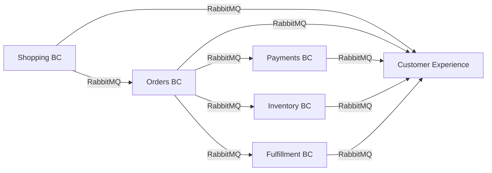

# CritterSupply Workflow Audit - Engineering Assessment

**Date:** 2026-02-17  
**Status:** For Product Owner Review  
**Scope:** All bounded contexts (Cycles 1-18 implementations)

---

## Detailed Workflow Documentation

For in-depth workflow analysis of each bounded context, see:

- **[Orders Workflows](./orders-workflows.md)** - Saga orchestration, checkout flow, compensation patterns
- **[Shopping Workflows](./shopping-workflows.md)** - Cart lifecycle, checkout handoff to Orders
- **[Inventory Workflows](./inventory-workflows.md)** - Two-phase reservation (Reserve → Commit → Release)
- **[Payments Workflows](./payments-workflows.md)** - Two-phase payment (Authorize → Capture), refunds
- **[Fulfillment Workflows](./fulfillment-workflows.md)** - Shipment lifecycle (Request → Assign → Dispatch → Deliver)
- **[Customer Experience Workflows](./customer-experience-workflows.md)** - BFF pattern, SSE real-time updates
- **[Customer Identity Workflows](./customer-identity-workflows.md)** - EF Core CRUD, address management
- **[Product Catalog Workflows](./product-catalog-workflows.md)** - Marten document store CRUD operations

Each document includes:
- Mermaid sequence/state diagrams showing actual implementation
- Current status tables (what's implemented vs what's missing)
- Engineering gaps with priority levels (P0/P1/P2)
- Business questions for Product Owner
- Testing coverage analysis
- Next steps roadmap by cycle

---

## Executive Summary

This document provides an engineering assessment of CritterSupply's current workflow implementations. It compares documented architecture (CONTEXTS.md) against actual code, identifies gaps in error handling and resilience patterns, and highlights areas needing business review.

### Key Findings

| Aspect | Status | Details |
|--------|--------|---------|
| **Core Workflows** | ✅ **Functional** | All happy paths implemented and tested (97.5% test success rate) |
| **RabbitMQ Integration** | ⚠️ **Partial** | Only 3/8 BCs use RabbitMQ; others use in-memory Wolverine queues |
| **Error Handling** | ⚠️ **Limited** | Happy paths dominate; few alternative/compensation flows |
| **Resilience Patterns** | ❌ **Missing** | No retries, circuit breakers, timeouts, or dead-letter queues configured |
| **Documentation Accuracy** | ⚠️ **Mostly Accurate** | CONTEXTS.md is 80% accurate; some integration flows not fully implemented |

### Critical Gaps

1. **Incomplete RabbitMQ Adoption** - Inventory, Payments, Fulfillment, Customer Identity, Product Catalog use local queues (not durable across restarts)
2. **Limited Error Paths** - No timeout handling, retry logic, or dead-letter queue patterns
3. **Missing Compensation Flows** - Saga compensation partially implemented (inventory release exists, payment refunds missing)
4. **No Circuit Breakers** - External service calls (address verification, payment gateway stubs) lack fault tolerance
5. **Synchronous HTTP in BFF** - Customer Experience makes synchronous HTTP calls to downstream BCs (no async pub/sub for queries)

---

## Bounded Context Status

### ✅ Orders BC - Order Saga Orchestration
**Implementation:** Complete, Event-Sourced, Wolverine Saga  
**RabbitMQ:** ✅ Publishes `OrderPlaced` to `storefront-notifications`  
**Test Coverage:** 32 integration tests passing  
**Documentation:** ✅ Accurate in CONTEXTS.md

**What Works:**
- Complete checkout flow (ShippingAddress → ShippingMethod → PaymentMethod → Complete)
- Order saga orchestrates Inventory + Payments + Fulfillment
- Integration messages: `CheckoutInitiated` (from Shopping) → `CheckoutStarted` → `CheckoutCompleted` → `OrderPlaced`
- Inventory reservation → Payment authorization → Fulfillment request

**What's Missing:**
- ❌ **Compensation flows incomplete** - No payment refund on inventory failure
- ❌ **No timeout handling** - Saga waits indefinitely for Inventory/Payments responses
- ❌ **No retry logic** - Failed payments don't retry
- ❌ **Saga state visualization** - No admin UI or logs showing order progression
- ❌ **Partial RabbitMQ** - Only publishes `OrderPlaced`; doesn't listen to Inventory/Payments via RabbitMQ

**Detailed Workflow:** See [orders-workflows.md](./orders-workflows.md)

---

### ✅ Shopping BC - Cart Lifecycle
**Implementation:** Complete, Event-Sourced  
**RabbitMQ:** ✅ Publishes `ItemAdded`, `ItemRemoved`, `ItemQuantityChanged` to `storefront-notifications`  
**Test Coverage:** 13 integration tests passing  
**Documentation:** ✅ Accurate in CONTEXTS.md

**What Works:**
- Full cart CRUD (Initialize, AddItem, RemoveItem, ChangeQuantity, ClearCart)
- Checkout handoff to Orders BC via `InitiateCheckout` → `CheckoutInitiated` integration message
- Real-time updates to Customer Experience via RabbitMQ

**What's Missing:**
- ❌ **No cart expiration** - `CartAbandoned` event documented but not implemented (no TTL for anonymous carts)
- ❌ **No price drift detection** - Cart doesn't compare current catalog prices to stored prices
- ❌ **No coupon/promotion support** - Documented in CONTEXTS.md Phase 2, not implemented
- ❌ **No stock availability checks** - Can add out-of-stock items to cart
- ❌ **No cart merge logic** - Anonymous → authenticated cart conversion not implemented

**Detailed Workflow:** See [shopping-workflows.md](./shopping-workflows.md)

---

### ⚠️ Inventory BC - Two-Phase Reservation
**Implementation:** Complete, Event-Sourced  
**RabbitMQ:** ❌ **Not configured** - Uses local Wolverine queues  
**Test Coverage:** 16 integration tests passing  
**Documentation:** ⚠️ **Partially accurate** - CONTEXTS.md shows choreography, but not all events flow via RabbitMQ

**What Works:**
- Two-phase commit pattern (Reserve → Commit or Release)
- Handles `OrderPlaced` event → creates `ReserveStock` command
- Handles `ReservationCommitRequested` / `ReservationReleaseRequested` from Orders
- Publishes `ReservationConfirmed`, `ReservationCommitted`, `ReservationReleased`

**What's Missing:**
- ❌ **No RabbitMQ integration** - All messages via in-memory Wolverine queues (not durable)
- ❌ **No reservation timeouts** - Soft holds never expire (can leak inventory)
- ❌ **No overselling protection** - Concurrent order handling not tested with race conditions
- ❌ **No warehouse routing** - All items assumed single warehouse
- ❌ **No low-stock alerts** - `InventoryLow` event documented but not published
- ❌ **No stock availability queries** - No read endpoints for cart validation

**Detailed Workflow:** See [inventory-workflows.md](./inventory-workflows.md)

---

### ⚠️ Payments BC - Payment Processing
**Implementation:** Complete, Event-Sourced  
**RabbitMQ:** ❌ **Not configured** - Uses local Wolverine queues  
**Test Coverage:** 30 tests (11 unit + 19 integration) passing  
**Documentation:** ⚠️ **Partially accurate** - CONTEXTS.md shows events published, but no RabbitMQ transport

**What Works:**
- Three payment operations: Authorize, Capture, Refund
- Publishes `PaymentAuthorized`, `PaymentCaptured`, `PaymentFailed`, `RefundCompleted`
- Stub payment gateway (always succeeds for development)

**What's Missing:**
- ❌ **No RabbitMQ integration** - Events only published locally
- ❌ **No payment retry logic** - Failed payments marked terminal immediately
- ❌ **No idempotency keys** - Duplicate payment requests not prevented
- ❌ **No webhook handling** - Real gateways send async webhooks; not modeled
- ❌ **No fraud detection** - No integration with fraud services
- ❌ **No partial capture** - Cannot capture less than authorized amount
- ❌ **No refund compensation** - `RefundFailed` handled but doesn't trigger manual review workflow

**Detailed Workflow:** See [payments-workflows.md](./payments-workflows.md)

---

### ⚠️ Fulfillment BC - Shipment Lifecycle
**Implementation:** Complete, Event-Sourced  
**RabbitMQ:** ❌ **Not configured** - Uses local Wolverine queues  
**Test Coverage:** 6 integration tests passing  
**Documentation:** ⚠️ **Partially accurate** - CONTEXTS.md shows more events than actually implemented

**What Works:**
- Handles `FulfillmentRequested` from Orders
- Shipment lifecycle: Request → AssignWarehouse → DispatchShipment → ConfirmDelivery
- Publishes `ShipmentDispatched`, `ShipmentDelivered`

**What's Missing:**
- ❌ **No RabbitMQ integration** - Local queues only
- ❌ **No carrier integration** - No tracking number generation or carrier webhooks
- ❌ **No warehouse optimization** - Warehouse assignment is manual command, not automatic
- ❌ **No delivery failure handling** - `ShipmentDeliveryFailed` documented but handler missing
- ❌ **No picking/packing stages** - Lifecycle jumps from Assign → Dispatch (intermediate states undocumented)
- ❌ **No split shipments** - Cannot fulfill partial orders from multiple warehouses

**Detailed Workflow:** See [fulfillment-workflows.md](./fulfillment-workflows.md)

---

### ✅ Customer Identity BC - Profile & Address Management
**Implementation:** Complete, EF Core + PostgreSQL  
**RabbitMQ:** ❌ **Not applicable** - No domain events (current-state-only CRUD)  
**Test Coverage:** 12 integration tests passing  
**Documentation:** ✅ Accurate in CONTEXTS.md

**What Works:**
- Customer CRUD (Create, Get)
- Address CRUD (Add, Get, List, Update, Delete, SetDefault)
- Address verification via `StubAddressVerificationService`
- Foreign key relationships (Customer → Addresses) with cascade delete
- Used by Orders BC for checkout address resolution

**What's Missing:**
- ❌ **No authentication** - Customer creation is direct API call (no login flow)
- ❌ **No authorization** - Any client can access any customer's data
- ❌ **No address verification integration** - Only stub service implemented (no SmartyStreets/Google)
- ❌ **No profile fields** - Only basic Customer entity (no email, phone, preferences)
- ❌ **No payment method storage** - Documented in CONTEXTS.md but not implemented
- ❌ **No customer history queries** - Cannot see past orders (Orders BC owns that data)

**Detailed Workflow:** See [customer-identity-workflows.md](./customer-identity-workflows.md)

---

### ✅ Product Catalog BC - Product CRUD
**Implementation:** Complete, Marten Document Store (not event-sourced)  
**RabbitMQ:** ❌ **Not applicable** - No domain events (read model optimized for queries)  
**Test Coverage:** 24 integration tests passing  
**Documentation:** ✅ Accurate in CONTEXTS.md

**What Works:**
- Product CRUD (Create, Update, Get, List, ChangeStatus)
- Value objects: `Sku`, `ProductName` with JSON converters
- Queryable fields: Category (primitive string), Status (enum)
- Soft delete via status changes (Active → Discontinued)

**What's Missing:**
- ❌ **No category management** - Categories are strings, no hierarchy or metadata
- ❌ **No inventory integration** - Products don't show available stock
- ❌ **No pricing rules** - No discounts, promotions, or bulk pricing
- ❌ **No product search** - List endpoint lacks full-text search or filtering
- ❌ **No product variants** - Cannot model size/color variations
- ❌ **No product images** - No media storage integration

**Detailed Workflow:** See [product-catalog-workflows.md](./product-catalog-workflows.md)

---

### ✅ Customer Experience (Storefront BFF) - Real-Time Composition
**Implementation:** Complete, Blazor Server + SSE  
**RabbitMQ:** ✅ Subscribes to `storefront-notifications` queue  
**Test Coverage:** 13 integration tests passing (4 deferred)  
**Documentation:** ⚠️ **Needs update** - CONTEXTS.md doesn't document BFF patterns

**What Works:**
- View composition: Queries Shopping, Orders, Product Catalog via HTTP clients
- Real-time updates: Subscribes to 7 event types via RabbitMQ → broadcasts via SSE
- UI: Blazor Server with MudBlazor components (Cart, Checkout, Order History pages)
- Event types: `ItemAdded`, `ItemRemoved`, `ItemQuantityChanged`, `OrderPlaced`, `PaymentAuthorized`, `ShipmentDispatched`, `ReservationConfirmed`

**What's Missing:**
- ❌ **Synchronous HTTP queries** - GetCartView makes blocking HTTP call (should use async messaging or caching)
- ❌ **No authentication** - Uses stub customerId (hardcoded GUID)
- ❌ **No error handling for downstream failures** - No fallback UI when Shopping/Orders APIs are down
- ❌ **No SSE reconnection logic** - JavaScript EventSource doesn't handle dropped connections
- ❌ **No customer isolation** - EventBroadcaster channels not scoped per-customer
- ❌ **No automated browser tests** - Manual testing only (Playwright/Selenium deferred to Cycle 20+)

**Detailed Workflow:** See [customer-experience-workflows.md](./customer-experience-workflows.md)

---

## RabbitMQ Integration Status

### Current State

| Bounded Context | Publishes Events | Subscribes to Queue | Transport |
|-----------------|------------------|---------------------|-----------|
| **Orders** | ✅ `OrderPlaced` | ❌ No | RabbitMQ (partial) |
| **Shopping** | ✅ `ItemAdded`, `ItemRemoved`, `ItemQuantityChanged` | ❌ No | RabbitMQ (partial) |
| **Inventory** | ❌ No | ❌ No | Local Wolverine |
| **Payments** | ❌ No | ❌ No | Local Wolverine |
| **Fulfillment** | ❌ No | ❌ No | Local Wolverine |
| **Customer Identity** | N/A (CRUD only) | N/A | N/A |
| **Product Catalog** | N/A (CRUD only) | N/A | N/A |
| **Customer Experience** | N/A (BFF) | ✅ `storefront-notifications` | RabbitMQ |

### Problem Statement

**Current Architecture:** Hybrid local + RabbitMQ
- Orders → Inventory: Local queue (in-memory, not durable)
- Orders → Payments: Local queue (in-memory, not durable)
- Orders → Fulfillment: Local queue (in-memory, not durable)
- Shopping → Customer Experience: RabbitMQ (durable)
- Orders → Customer Experience: RabbitMQ (durable)

**Impact:**
1. **Data Loss Risk** - Server restart loses all in-flight messages in local queues
2. **Cannot Scale Horizontally** - Local queues don't support multiple instances
3. **No Dead-Letter Queues** - Failed messages disappear (no retry mechanism)
4. **Inconsistent Patterns** - Developers must remember which BC uses which transport

### Recommendation

**Target Architecture:** Full RabbitMQ for all inter-BC messaging



**Implementation Phases:**
1. **Phase 1 (Cycle 19):** Inventory BC publishes to RabbitMQ
2. **Phase 2 (Cycle 20):** Payments BC publishes to RabbitMQ
3. **Phase 3 (Cycle 21):** Fulfillment BC publishes to RabbitMQ
4. **Phase 4 (Cycle 22):** Configure dead-letter queues + retry policies

---

## Resilience Patterns - Gaps & Recommendations

### Current State: ❌ No Resilience Patterns Implemented

**What's Missing:**

1. **No Retry Logic**
   - Failed payment authorizations marked terminal immediately
   - Failed inventory reservations don't retry (may be transient DB lock)
   - HTTP calls to downstream BCs (BFF → Shopping/Orders) don't retry

2. **No Timeouts**
   - Order saga waits indefinitely for Inventory/Payments responses
   - HTTP clients in BFF have no timeout configured
   - Wolverine handlers have no timeout policy

3. **No Circuit Breakers**
   - Stub services (AddressVerificationService, PaymentGateway) always succeed
   - No fallback behavior when services are down
   - BFF makes blocking HTTP calls even if downstream is unhealthy

4. **No Dead-Letter Queues**
   - Failed messages disappear (no DLQ configured in RabbitMQ)
   - No retry delay (immediate reprocessing can make failures worse)
   - No alerting on DLQ depth

5. **No Idempotency**
   - Duplicate `OrderPlaced` events will create multiple inventory reservations
   - No idempotency keys on payment operations
   - Event handlers not protected against replay

6. **No Saga Timeouts**
   - Order saga can remain in "PendingPayment" forever
   - No saga expiration policy
   - No admin UI to manually intervene on stuck sagas

### Recommendations

#### 1. Wolverine Retry Policies (Cycle 19)

```csharp
// Program.cs
opts.OnException<TimeoutException>()
    .Retry(3, delayBetweenAttempts: 2.Seconds());

opts.OnException<DbException>()
    .Retry(5, delayBetweenAttempts: 1.Seconds());

opts.OnException<HttpRequestException>()
    .RetryWithCooldown(50.Milliseconds(), 100.Milliseconds(), 250.Milliseconds());
```

#### 2. Dead-Letter Queue Configuration (Cycle 19)

```csharp
opts.UseRabbitMq(rabbit =>
{
    rabbit.AutoProvision = true;
    rabbit.DeadLetterQueueing.Enabled = true;
    rabbit.DeadLetterQueueing.MaximumRedeliveryAttempts = 3;
});
```

#### 3. Circuit Breaker Pattern (Cycle 20)

Use Polly library for HTTP clients:

```csharp
services.AddHttpClient<IShoppingClient, ShoppingClient>()
    .AddPolicyHandler(Policy
        .HandleResult<HttpResponseMessage>(r => !r.IsSuccessStatusCode)
        .CircuitBreakerAsync(
            handledEventsAllowedBeforeBreaking: 3,
            durationOfBreak: TimeSpan.FromSeconds(30)));
```

#### 4. Saga Timeout Policy (Cycle 21)

```csharp
public sealed class Order : Saga
{
    // Saga expires after 1 hour if not completed
    public static TimeSpan Timeout = TimeSpan.FromHours(1);
}
```

#### 5. Idempotency Keys (Cycle 22)

Add `IdempotencyKey` to integration message contracts:

```csharp
public sealed record OrderPlaced(
    Guid OrderId,
    Guid IdempotencyKey, // Client-generated
    // ... other fields
);
```

---

## Error Handling Gaps

### Scenario Analysis: What Happens When...?

| Scenario | Current Behavior | Desired Behavior |
|----------|------------------|------------------|
| **Inventory service is down** | Order saga waits forever | Timeout after 30s → retry 3x → mark order OnHold → alert |
| **Payment gateway declines card** | `PaymentFailed` event → order stuck | Retry once → if still fails, email customer for new card |
| **Customer closes browser during checkout** | Checkout stream remains in "ProvidePaymentMethod" state | Timeout after 15 min → abandon checkout → release inventory |
| **RabbitMQ server restarts** | In-memory messages lost (Inventory/Payments) | All messages durable → reprocess on restart |
| **Duplicate "AddItemToCart" requests** | Two `ItemAdded` events appended | Idempotency check → deduplicate within 5-second window |
| **Fulfillment warehouse is at capacity** | No handling (assumes warehouse always available) | `FulfillmentRequested` → check capacity → route to alternate warehouse |
| **Address verification service times out** | Blocks indefinitely | Timeout after 5s → save as unverified → continue flow |
| **Customer deletes address while order is in checkout** | Foreign key violation (cascade delete) | Prevent delete if address referenced by active checkout/order |

### Implementation Priority

1. **Critical (Cycle 19):**
   - Saga timeouts (prevent stuck orders)
   - RabbitMQ durability (prevent message loss)
   - HTTP client timeouts (prevent blocking)

2. **High (Cycle 20):**
   - Payment retry logic (reduce false declines)
   - Dead-letter queues (observability)
   - Circuit breakers (prevent cascading failures)

3. **Medium (Cycle 21):**
   - Idempotency keys (prevent duplicate processing)
   - Checkout abandonment (clean up orphaned streams)
   - Address verification fallback (graceful degradation)

4. **Low (Cycle 22):**
   - Warehouse capacity checks (future scaling)
   - Duplicate request deduplication (nice-to-have)
   - Manual saga intervention UI (admin tooling)

---

## Workflow Completeness Matrix

| Workflow | Happy Path | Error Path | Compensation | Retries | Timeouts | Tested |
|----------|-----------|------------|--------------|---------|----------|--------|
| **Cart → Checkout → Order** | ✅ Yes | ⚠️ Partial | ❌ No | ❌ No | ❌ No | ✅ Yes |
| **Order → Inventory Reservation** | ✅ Yes | ⚠️ Partial | ✅ Yes | ❌ No | ❌ No | ✅ Yes |
| **Order → Payment Authorization** | ✅ Yes | ⚠️ Partial | ❌ No | ❌ No | ❌ No | ✅ Yes |
| **Order → Fulfillment Request** | ✅ Yes | ❌ No | ❌ No | ❌ No | ❌ No | ✅ Yes |
| **Real-Time Cart Updates (SSE)** | ✅ Yes | ❌ No | N/A | ❌ No | ❌ No | ⚠️ Manual |
| **Address Verification** | ✅ Yes | ⚠️ Stub | N/A | ❌ No | ❌ No | ✅ Yes |
| **Payment Capture** | ✅ Yes | ⚠️ Stub | ❌ No | ❌ No | ❌ No | ✅ Yes |
| **Payment Refund** | ✅ Yes | ⚠️ Stub | ❌ No | ❌ No | ❌ No | ✅ Yes |
| **Inventory Commit** | ✅ Yes | ❌ No | ❌ No | ❌ No | ❌ No | ✅ Yes |
| **Inventory Release** | ✅ Yes | ❌ No | N/A | ❌ No | ❌ No | ✅ Yes |
| **Shipment Dispatch** | ✅ Yes | ❌ No | ❌ No | ❌ No | ❌ No | ✅ Yes |
| **Shipment Delivery** | ✅ Yes | ❌ No | ❌ No | ❌ No | ❌ No | ✅ Yes |

**Legend:**
- ✅ **Yes** - Fully implemented and tested
- ⚠️ **Partial** - Basic implementation, missing edge cases
- ❌ **No** - Not implemented
- **N/A** - Not applicable to this workflow

---

## Testing Gaps

### Current Test Coverage: 158/162 tests passing (97.5%)

**What's Tested:**
- ✅ Happy path integration tests (Alba + TestContainers)
- ✅ Marten event sourcing persistence
- ✅ EF Core entity relationships
- ✅ Wolverine message handling
- ✅ FluentValidation rules

**What's NOT Tested:**
- ❌ **Concurrent workflows** - Race conditions (two users adding same item to cart simultaneously)
- ❌ **Saga compensation** - Payment fails after inventory reserved → verify inventory released
- ❌ **RabbitMQ durability** - Server restart → messages reprocessed
- ❌ **Timeout scenarios** - Payment gateway times out → order marked OnHold
- ❌ **Idempotency** - Duplicate `OrderPlaced` event → only one reservation created
- ❌ **Circuit breaker** - Downstream service down → fallback behavior
- ❌ **SSE reconnection** - Browser loses connection → automatic reconnect
- ❌ **Browser automation** - E2E Blazor flows (deferred to Cycle 20+)

### Recommendation: Add Chaos Engineering Tests (Cycle 20)

```csharp
[Fact]
public async Task order_saga_completes_even_if_inventory_service_restarts()
{
    // Arrange: Place order
    await Host.Scenario(s => s.Post.Json(placeOrder).ToUrl("/api/orders"));
    
    // Act: Restart Inventory BC container
    await _inventoryContainer.StopAsync();
    await Task.Delay(5000); // Simulate downtime
    await _inventoryContainer.StartAsync();
    
    // Assert: Order eventually reaches "Fulfilling" state
    await Eventually(() => GetOrderStatus(orderId) == "Fulfilling", timeout: 60.Seconds());
}
```

---

## Documentation Accuracy Assessment

### CONTEXTS.md vs Implementation

| Section | Accuracy | Notes |
|---------|----------|-------|
| **Shopping BC** | ✅ 90% | Missing `CartAbandoned` implementation, price drift detection |
| **Orders BC** | ✅ 85% | Compensation flows partially documented, not fully implemented |
| **Inventory BC** | ⚠️ 70% | RabbitMQ integration documented but not implemented |
| **Payments BC** | ⚠️ 70% | RabbitMQ integration documented but not implemented |
| **Fulfillment BC** | ⚠️ 60% | More lifecycle events documented than implemented |
| **Customer Identity** | ✅ 95% | Accurate; EF Core migration documented |
| **Product Catalog** | ✅ 95% | Accurate; value object patterns documented |
| **Customer Experience** | ❌ 20% | BFF patterns not documented in CONTEXTS.md |

### Updates Needed

1. **CONTEXTS.md Section: "RabbitMQ Integration"** (NEW)
   - Add table showing which BCs use RabbitMQ vs local queues
   - Document current hybrid architecture
   - Add migration roadmap

2. **CONTEXTS.md Section: "Error Handling & Resilience"** (NEW)
   - Document current limitations (no retries, timeouts, circuit breakers)
   - Add error flow diagrams
   - Document compensation patterns in use

3. **CONTEXTS.md Section: "Customer Experience (BFF)"** (NEW)
   - Document SSE pattern
   - Document HTTP client composition pattern
   - Document EventBroadcaster architecture

4. **CONTEXTS.md Section: "Testing Strategy"** (NEW)
   - Document Alba + TestContainers approach
   - Document what's tested vs not tested
   - Reference skills docs for patterns

---

## Recommendations for Product Owner Review

### Business Questions

1. **Cart Abandonment:** Should anonymous carts expire after inactivity? If so, what TTL?
2. **Payment Retries:** Should failed payments automatically retry, or require customer action?
3. **Inventory Timeouts:** How long should inventory reservations hold before auto-releasing?
4. **Order Cancellation:** Can customers cancel orders after payment but before shipment?
5. **Address Verification:** Should invalid addresses block checkout, or just warn?
6. **Partial Fulfillment:** Can we ship available items now, backorder rest?
7. **Returns:** What's the return window? Restocking fees? Who pays return shipping?

### Architecture Decisions Needing Business Context

1. **Synchronous vs Asynchronous BFF Queries:**
   - Current: BFF makes blocking HTTP calls to get cart/order data
   - Alternative: BFF maintains read model updated via events
   - Trade-off: Latency (fast reads) vs Complexity (eventual consistency)

2. **Saga Timeout Policy:**
   - Current: Sagas wait forever
   - Proposal: 1-hour timeout → mark OnHold → manual review
   - Question: What's acceptable wait time before alerting support team?

3. **Payment Gateway Selection:**
   - Current: Stub service (always succeeds)
   - Options: Stripe, PayPal, Authorize.Net, Square
   - Question: Which payment methods must be supported? (Credit card only, or PayPal/Apple Pay?)

4. **Warehouse Routing Strategy:**
   - Current: Manual warehouse assignment
   - Options: Nearest warehouse, lowest-cost shipping, load balancing
   - Question: What's the business rule for warehouse selection?

5. **RabbitMQ Adoption Priority:**
   - Engineering preference: Complete migration to RabbitMQ (durability)
   - Question: Is message durability a hard requirement, or is in-memory acceptable for POC?

---

## Next Steps

### For Engineering

1. **Create per-BC workflow diagrams** (Mermaid) in separate files
2. **Update CONTEXTS.md** with RabbitMQ status and error handling sections
3. **Implement Cycle 19 resilience improvements** (timeouts, DLQs, retry policies)
4. **Add chaos engineering tests** (Cycle 20)

### For Product Owner

1. **Review this document** and provide business context for open questions
2. **Prioritize error scenarios** - Which non-happy paths are most critical?
3. **Define SLAs** - Acceptable latency, timeout windows, retry limits
4. **Approve architecture decisions** - RabbitMQ migration, saga timeout policy

### For Collaboration

1. **Schedule architecture review session** - Walk through diagrams together
2. **Create ADRs** for major decisions (RabbitMQ migration, saga timeouts, payment retries)
3. **Update backlog** with prioritized engineering work (BACKLOG.md)

---

## Appendix: Test Results Summary

**Last Full Test Run:** 2026-02-14 (Cycle 18 completion)

```
✅ Payments: 30 tests (11 unit + 19 integration)
✅ Inventory: 16 integration tests
✅ Fulfillment: 6 integration tests
✅ Shopping: 13 integration tests
✅ Orders: 32 integration tests
✅ Customer Identity: 12 integration tests
✅ Product Catalog: 24 integration tests
✅ Customer Experience: 13 integration tests (4 deferred to Phase 2)

Total: 158/162 tests passing (97.5% success rate)
```

**Test Infrastructure:**
- Alba (HTTP integration tests)
- TestContainers (PostgreSQL, RabbitMQ)
- xUnit (test framework)
- Shouldly (assertions)
- FluentValidation (validation testing)

**Deferred Tests:**
- Reqnroll BDD scenarios (Gherkin written, step definitions not implemented)
- Browser automation (Playwright/Selenium - Cycle 20+)
- Chaos engineering (service restarts, timeouts)

---

**Document Status:** ✅ Ready for Product Owner Review  
**Next Action:** PO reviews → provides business context → engineering creates detailed cycle plans  
**Owner:** Principal Architect (AI Agent)  
**Last Updated:** 2026-02-17
