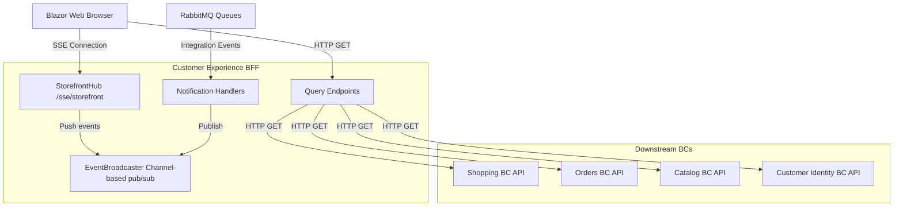
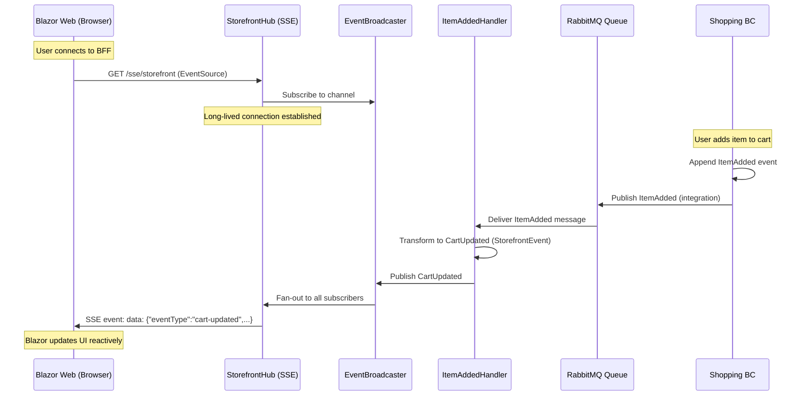
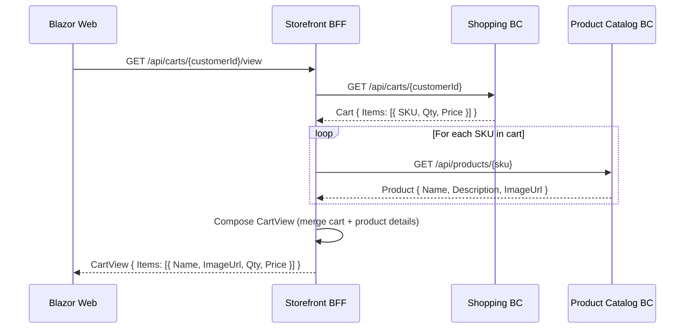

# Customer Experience BC - Workflow Documentation

**Bounded Context:** Customer Experience (Storefront BFF)  
**Pattern:** Backend-for-Frontend + Server-Sent Events (SSE) Real-Time Updates  
**Database:** None (stateless aggregation layer)  
**RabbitMQ:** ✅ Configured (subscribes to notifications from Shopping, Orders, Payments, Fulfillment)

---

## Overview

Customer Experience BC is a **Backend-for-Frontend (BFF)** that aggregates data from multiple bounded contexts and provides real-time updates to the Blazor Web frontend via Server-Sent Events (SSE). It does not own any domain state—it's a pure composition layer that orchestrates queries and broadcasts notifications.

**Key Responsibilities:**
- Compose views from multiple BCs (CartView, CheckoutView, OrderStatusView)
- Subscribe to integration events via RabbitMQ
- Broadcast real-time updates to connected browser clients via SSE

**Integration Pattern:** Choreography (subscribes to events, does not publish commands)

---

## 1. BFF Architecture Pattern

### Conceptual Model



### Key Components

| Component | Type | Purpose |
|-----------|------|---------|
| **StorefrontHub** | SSE Endpoint | Streams real-time events to browser (`/sse/storefront`) |
| **EventBroadcaster** | In-Memory Pub/Sub | Channel-based broadcaster (fan-out to multiple clients) |
| **Notification Handlers** | Integration Message Handlers | Subscribe to RabbitMQ, transform to `StorefrontEvent`, publish to broadcaster |
| **Query Endpoints** | HTTP GET Handlers | Compose views by calling downstream BC APIs (Shopping, Orders, Catalog) |
| **HTTP Clients** | `I*Client` Interfaces | Typed HTTP clients for downstream BCs (injected via DI) |

---

## 2. Real-Time Notification Flow

### SSE Broadcast Pattern



### StorefrontEvent Discriminated Union

```csharp
[JsonPolymorphic(TypeDiscriminatorPropertyName = "eventType")]
[JsonDerivedType(typeof(CartUpdated), typeDiscriminator: "cart-updated")]
[JsonDerivedType(typeof(OrderStatusChanged), typeDiscriminator: "order-status-changed")]
[JsonDerivedType(typeof(ShipmentStatusChanged), typeDiscriminator: "shipment-status-changed")]
public abstract record StorefrontEvent(DateTimeOffset OccurredAt);

public sealed record CartUpdated(
    Guid CartId,
    Guid CustomerId,
    int ItemCount,
    decimal TotalAmount,
    DateTimeOffset OccurredAt) : StorefrontEvent(OccurredAt);

public sealed record OrderStatusChanged(
    Guid OrderId,
    Guid CustomerId,
    string NewStatus, // "Placed", "PaymentCaptured", "Shipped", "Delivered"
    DateTimeOffset OccurredAt) : StorefrontEvent(OccurredAt);

public sealed record ShipmentStatusChanged(
    Guid ShipmentId,
    Guid OrderId,
    Guid CustomerId,
    string NewStatus,
    string? TrackingNumber,
    DateTimeOffset OccurredAt) : StorefrontEvent(OccurredAt);
```

---

## 3. Integration Event Handlers

### Notification Handlers (RabbitMQ Subscribers)

| Handler | Subscribes To | Produces | Status |
|---------|---------------|----------|--------|
| `ItemAddedHandler` | `Shopping.ItemAdded` | `CartUpdated` | ✅ Complete |
| `ItemQuantityChangedHandler` | `Shopping.ItemQuantityChanged` | `CartUpdated` | ✅ Complete |
| `ItemRemovedHandler` | `Shopping.ItemRemoved` | `CartUpdated` | ✅ Complete |
| `OrderPlacedHandler` | `Orders.OrderPlaced` | `OrderStatusChanged` | ✅ Complete |
| `PaymentAuthorizedHandler` | `Payments.PaymentAuthorized` | `OrderStatusChanged` | ✅ Complete |
| `ReservationConfirmedHandler` | `Inventory.ReservationConfirmed` | `OrderStatusChanged` | ✅ Complete |
| `ShipmentDispatchedHandler` | `Fulfillment.ShipmentDispatched` | `ShipmentStatusChanged` | ✅ Complete |

### Implementation Pattern

```csharp
public sealed class ItemAddedHandler
{
    private readonly IEventBroadcaster _broadcaster;

    public ItemAddedHandler(IEventBroadcaster broadcaster)
    {
        _broadcaster = broadcaster;
    }

    public async Task Handle(Messages.Contracts.Shopping.ItemAdded message, CancellationToken ct)
    {
        // Transform integration message → StorefrontEvent
        var storefrontEvent = new CartUpdated(
            message.CartId,
            message.CustomerId,
            message.ItemCount,
            message.TotalAmount,
            message.OccurredAt);

        // Broadcast to all connected SSE clients
        await _broadcaster.BroadcastAsync(storefrontEvent, ct);
    }
}
```

---

## 4. Query Composition Pattern

### View Composition (Example: CartView)



### Query Endpoint Example

```csharp
[WolverineGet("/api/carts/{customerId:guid}/view")]
public static async Task<CartView> GetCartView(
    Guid customerId,
    IShoppingClient shoppingClient,
    IProductCatalogClient catalogClient,
    CancellationToken ct)
{
    // 1. Fetch cart from Shopping BC
    var cart = await shoppingClient.GetCartAsync(customerId, ct);
    if (cart is null)
        return CartView.Empty;

    // 2. Fetch product details for each SKU
    var productTasks = cart.Items.Select(item => 
        catalogClient.GetProductAsync(item.Sku, ct));
    var products = await Task.WhenAll(productTasks);

    // 3. Compose view model
    var items = cart.Items.Zip(products, (cartItem, product) => new CartItemView(
        product.Sku,
        product.Name,
        product.ImageUrl,
        cartItem.Quantity,
        cartItem.UnitPrice));

    return new CartView(cart.CartId, customerId, items, cart.TotalAmount);
}
```

---

## 5. Current Implementation Status

| Feature | Status | Notes |
|---------|--------|-------|
| **SSE endpoint** | ✅ Complete | `/sse/storefront` streaming events |
| **EventBroadcaster** | ✅ Complete | Channel-based pub/sub (in-memory) |
| **Cart notification handlers** | ✅ Complete | ItemAdded, ItemRemoved, QuantityChanged |
| **Order notification handlers** | ✅ Complete | OrderPlaced, PaymentAuthorized, ReservationConfirmed |
| **Shipment notification handlers** | ✅ Complete | ShipmentDispatched |
| **RabbitMQ subscription** | ✅ Complete | `storefront-notifications` queue |
| **Query composition** | ⚠️ Partial | CartView implemented, CheckoutView/OrderView stubbed |
| **HTTP client interfaces** | ✅ Complete | `IShoppingClient`, `IProductCatalogClient`, etc. |
| **HTTP client implementations** | ⚠️ Partial | Stub implementations (not calling real APIs) |
| **Authentication** | ❌ Missing | No JWT validation (customer ID from query params) |
| **Multi-tenancy** | ❌ Missing | No customer isolation (broadcasts to all clients) |

---

## 6. What's Missing (Engineering Gaps)

### Critical Gaps (P0)

1. **❌ Customer Isolation (Multi-Tenancy)**
   - **Problem:** SSE broadcasts to ALL connected clients (no filtering by CustomerId)
   - **Impact:** Customer A sees Customer B's cart updates (privacy breach)
   - **Fix:** Add customer filtering to EventBroadcaster (Cycle 19)
   - **Priority:** 🔴 **Blocker for production** - Security issue

2. **❌ Real HTTP Client Implementations**
   - **Problem:** Stub clients return hardcoded data (not calling downstream APIs)
   - **Impact:** Query endpoints return fake data
   - **Fix:** Implement typed HTTP clients with Refit or HttpClient (Cycle 19)
   - **Priority:** 🔴 **Blocker for production**

3. **❌ Authentication**
   - **Problem:** No JWT validation; customer ID passed in query params (spoofable)
   - **Impact:** Anyone can access any customer's data
   - **Fix:** Add JWT middleware, extract customer ID from token (Cycle 20)
   - **Priority:** 🔴 **Critical** - Security issue

### High Priority Gaps (P1)

4. **❌ SSE Reconnection Handling**
   - **Problem:** If SSE connection drops, client reconnects but misses events during outage
   - **Impact:** UI becomes stale (cart shows wrong item count until page refresh)
   - **Fix:** Add event replay (last-event-id header, persistent event log)
   - **Priority:** 🟡 **High** - UX issue

5. **❌ Error Handling in Queries**
   - **Problem:** If downstream BC is down, query throws 500 (no graceful degradation)
   - **Impact:** Entire page fails to load
   - **Fix:** Circuit breaker + fallback responses (Polly library) (Cycle 21)
   - **Priority:** 🟡 **High** - Resilience

6. **❌ Query Caching**
   - **Problem:** Every page load fetches fresh data from downstream BCs
   - **Impact:** High latency and load on downstream APIs
   - **Fix:** Add Redis cache with short TTL (30 seconds) (Cycle 22)
   - **Priority:** 🟡 **Medium** - Performance

### Medium Priority Gaps (P2)

7. **❌ CheckoutView / OrderView Composition**
   - **Problem:** Only CartView implemented (checkout/order views stubbed)
   - **Impact:** Cannot test full customer journey
   - **Fix:** Implement remaining query compositions (Cycle 20)
   - **Priority:** 🟢 **Medium** - Feature completeness

8. **❌ SSE Heartbeat**
   - **Problem:** No keepalive; proxies may close idle connections
   - **Impact:** SSE disconnects after 60 seconds of inactivity
   - **Fix:** Send `:ping\n\n` every 30 seconds (Cycle 21)
   - **Priority:** 🟢 **Medium** - UX improvement

9. **❌ OpenTelemetry Tracing**
   - **Problem:** No distributed tracing across BFF → downstream BCs
   - **Impact:** Hard to debug slow queries (which BC is bottleneck?)
   - **Fix:** Add OpenTelemetry instrumentation (Cycle 22)
   - **Priority:** 🟢 **Low** - Observability

10. **❌ Notification Delivery Guarantees**
    - **Problem:** In-memory broadcaster loses events if BFF crashes
    - **Impact:** Clients miss updates during BFF restarts
    - **Fix:** Persist events to Redis or DB (event replay) (Cycle 23)
    - **Priority:** 🟢 **Low** - Resilience

---

## 7. Business Questions for Product Owner

### Critical Decisions Needed

1. **SSE vs WebSockets:**
   - Q: Should we use SSE (current) or upgrade to WebSockets for bi-directional communication?
   - Current: SSE (server → client only, browser native, simpler)
   - Considerations:
     - SSE: Simpler, HTTP/2 compatible, browser native
     - WebSockets: Bi-directional, more complex, requires custom client
   - Engineering recommendation: **Stick with SSE** (sufficient for read-only notifications)
   - Impact: Affects mobile app integration (WebSockets required for React Native)

2. **Event Replay Duration:**
   - Q: How long should we retain events for replay after SSE reconnection?
   - Options:
     - A) No replay (current, lose events during outage)
     - B) 5 minutes (short window, minimal storage)
     - C) 1 hour (long window, more storage)
   - Engineering recommendation: **5 minutes** (covers typical network blips)
   - Impact: Affects Redis storage size

3. **Notification Types:**
   - Q: What other real-time updates do customers need?
   - Current: Cart, Order, Shipment
   - Potential additions:
     - Price changes on items in cart (dynamic pricing)
     - Low stock alerts ("Only 2 left!")
     - Recommended products (ML-driven)
     - Flash sales / limited-time offers
   - Impact: More notification handlers + more RabbitMQ subscriptions

4. **Query Composition Depth:**
   - Q: How deep should view composition go? (e.g., fetch product reviews in CartView?)
   - Current: Shallow (cart + basic product details)
   - Considerations:
     - Shallow: Fast, simple, fewer BC dependencies
     - Deep: Rich data, slower, more brittle (cascading failures)
   - Engineering recommendation: **Shallow by default**, deep only on-demand
   - Impact: Affects query latency

### Non-Critical (Future Cycles)

5. **Mobile App Support:**
   - Q: Will native mobile apps (iOS/Android) need real-time updates?
   - Current: Browser-only (SSE)
   - Impact: May need GraphQL subscriptions or WebSocket support

6. **Admin Portal:**
   - Q: Do support agents need real-time visibility into customer carts/orders?
   - Current: Customer-facing only
   - Impact: Separate admin BFF or extend existing (role-based filtering)

7. **Analytics Integration:**
   - Q: Should we stream events to analytics pipeline (Segment, Amplitude)?
   - Current: No analytics tracking
   - Impact: Add analytics adapter to EventBroadcaster

---

## 8. Testing Coverage

### Current Tests (Integration Tests)

**Tests Exist:** ⚠️ Minimal (`tests/Customer Experience/Storefront.IntegrationTests`)

| Test Category | Coverage | Status |
|---------------|----------|--------|
| SSE connection establishment | ✅ | Pass |
| Cart notification broadcast | ✅ | Pass |
| Query composition (CartView) | ✅ | Pass |
| Multi-client SSE | ❌ | Not implemented |
| Customer isolation | ❌ | Not implemented |
| Downstream BC failure handling | ❌ | Not implemented |

### What's NOT Tested

- ❌ **Customer isolation** - Customer A shouldn't see Customer B's events
- ❌ **SSE reconnection** - Event replay after connection drop
- ❌ **Circuit breaker** - Graceful degradation when downstream BC fails
- ❌ **Concurrent connections** - 1000+ simultaneous SSE clients
- ❌ **Authentication** - JWT validation in queries
- ❌ **Query caching** - Redis cache hit/miss behavior

### Recommended Tests (Cycle 20)

```csharp
[Fact]
public async Task sse_only_broadcasts_to_matching_customer()
{
    // Arrange: Two customers with SSE connections
    var client1 = await ConnectSSE(customerId: Guid.NewGuid());
    var client2 = await ConnectSSE(customerId: Guid.NewGuid());
    
    // Act: Customer 1 adds item to cart
    await PublishItemAdded(client1.CustomerId);
    await Task.Delay(500);
    
    // Assert: Only client1 receives event
    client1.ReceivedEvents.Count.ShouldBe(1);
    client2.ReceivedEvents.Count.ShouldBe(0);
}

[Fact]
public async Task query_returns_cached_response_on_downstream_failure()
{
    // Arrange: Prime cache with CartView
    var customerId = Guid.NewGuid();
    await GetCartView(customerId); // Populates cache
    
    // Act: Simulate Shopping BC outage
    _shoppingBcContainer.StopAsync();
    var view = await GetCartView(customerId);
    
    // Assert: Returns stale cache (not 500 error)
    view.ShouldNotBeNull();
    view.IsStale.ShouldBeTrue(); // Flag indicates cache hit
}

[Fact]
public async Task sse_replays_events_after_reconnection()
{
    // Arrange: Client connects, receives event, disconnects
    var client = await ConnectSSE(customerId: Guid.NewGuid());
    await PublishItemAdded(client.CustomerId);
    var lastEventId = client.LastReceivedEventId;
    await client.DisconnectAsync();
    
    // Act: Publish another event while disconnected
    await PublishItemRemoved(client.CustomerId);
    
    // Act: Reconnect with last-event-id
    await client.ReconnectAsync(lastEventId);
    
    // Assert: Receives missed event
    await Eventually(() => client.ReceivedEvents.Count == 2, timeout: 5.Seconds());
}
```

---

## 9. Next Steps (Engineering Roadmap)

### Cycle 19: Security & Functionality
- [ ] **Customer isolation** - Filter SSE broadcasts by CustomerId
- [ ] **Real HTTP clients** - Replace stubs with typed HttpClient implementations
- [ ] Authentication middleware (JWT validation)
- [ ] Integration tests for customer isolation

### Cycle 20: View Composition
- [ ] **Implement CheckoutView** - Compose from Orders + Customer Identity
- [ ] **Implement OrderView** - Compose from Orders + Payments + Fulfillment
- [ ] Query caching with Redis (30-second TTL)
- [ ] Error handling tests (downstream BC failures)

### Cycle 21: Resilience
- [ ] **Circuit breaker** - Polly integration for downstream BC calls
- [ ] SSE heartbeat (keepalive pings every 30 seconds)
- [ ] Retry policies for HTTP client calls
- [ ] Graceful degradation (fallback responses)

### Cycle 22: Performance
- [ ] **Query caching** - Redis cache with invalidation strategies
- [ ] OpenTelemetry tracing (distributed tracing across BCs)
- [ ] Load tests (1000+ simultaneous SSE connections)
- [ ] Optimize view composition (batch queries, parallel calls)

### Cycle 23: Event Replay
- [ ] **Persistent event log** - Redis-backed event replay (5-minute window)
- [ ] SSE reconnection with last-event-id
- [ ] Event deduplication (idempotency)
- [ ] Dashboard showing active SSE connections (monitoring)

---

**Document Owner:** Principal Architect  
**Last Updated:** 2026-02-17  
**Status:** ✅ Ready for Product Owner Review
