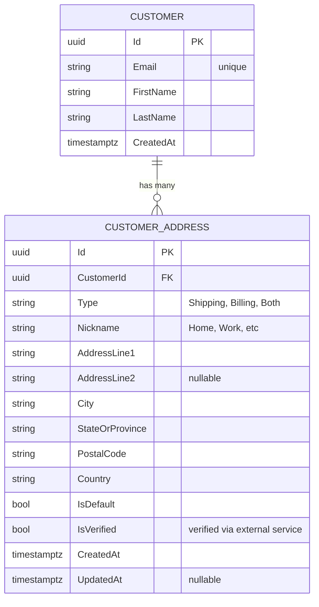
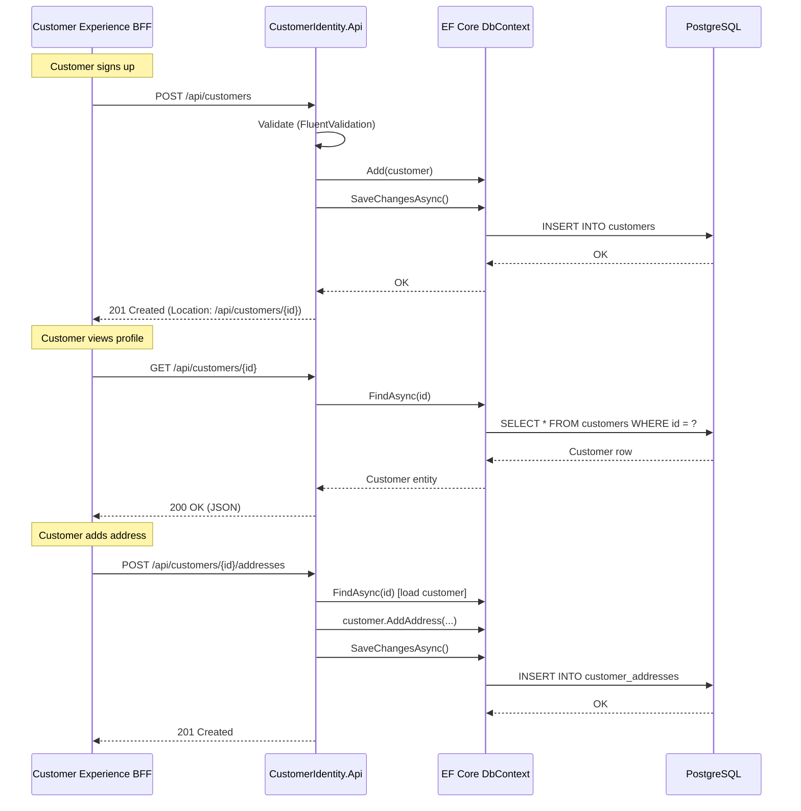
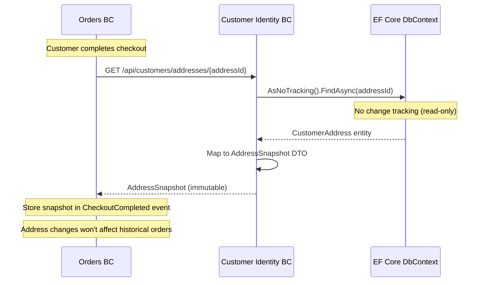

# Customer Identity BC - Workflow Documentation

**Bounded Context:** Customer Identity (Customer Management)  
**Pattern:** CRUD Operations + EF Core Relational Model  
**Database:** PostgreSQL (via EF Core, NOT Marten)  
**RabbitMQ:** ❌ Not configured (no integration events published)

---

## Overview

Customer Identity BC owns customer master data and address book management. Unlike other BCs in CritterSupply, it uses **Entity Framework Core** with a traditional relational model rather than event sourcing. This decision was intentional—customer identity is fundamentally CRUD-oriented and doesn't benefit from event sourcing complexity.

**Key Aggregates:**
- **Customer** - Root entity with basic profile (email, name)
- **CustomerAddress** - Child entity (one-to-many relationship)

**Integration Pattern:** None (currently isolated; future integration with Orders/Shopping for address snapshots)

**Design Decision:** See ADR 0002 for rationale on EF Core choice over Marten

---

## 1. Customer & Address Management

### Entity Relationship Model



### State Model (EF Core)

```csharp
// Customer aggregate root
public sealed class Customer
{
    public Guid Id { get; private set; }
    public string Email { get; private set; }
    public string FirstName { get; private set; }
    public string LastName { get; private set; }
    public DateTimeOffset CreatedAt { get; private set; }
    
    // Navigation property (EF Core manages one-to-many)
    public ICollection<CustomerAddress> Addresses { get; private set; }
    
    private Customer() { } // EF Core requires parameterless constructor
    
    public static Customer Create(Guid id, string email, string firstName, string lastName)
    {
        return new Customer
        {
            Id = id,
            Email = email,
            FirstName = firstName,
            LastName = lastName,
            CreatedAt = DateTimeOffset.UtcNow
        };
    }
    
    public CustomerAddress AddAddress(...)
    {
        var address = CustomerAddress.Create(...);
        Addresses.Add(address);
        return address;
    }
}
```

---

## 2. CRUD Operations

### Customer Lifecycle



### Commands & Handlers

| Command | HTTP Endpoint | Validation | Database Operation |
|---------|---------------|------------|--------------------|
| `CreateCustomer` | `POST /api/customers` | ✅ Email unique<br/>✅ Valid email format | `dbContext.Customers.Add()` |
| `GetCustomer` | `GET /api/customers/{id}` | None | `dbContext.Customers.FindAsync(id)` |
| `AddAddress` | `POST /api/customers/{id}/addresses` | ✅ Address verification<br/>✅ Customer exists | `customer.Addresses.Add()` |
| `UpdateAddress` | `PUT /api/customers/addresses/{id}` | ✅ Address verification | `address.Update()` + `SaveChangesAsync()` |
| `SetDefaultAddress` | `POST /api/customers/addresses/{id}/set-default` | ✅ Address belongs to customer | Update `IsDefault` flags |
| `GetCustomerAddresses` | `GET /api/customers/{id}/addresses` | None | `dbContext.Addresses.Where(a => a.CustomerId == id)` |
| `GetAddressSnapshot` | `GET /api/customers/addresses/{id}` | None | `dbContext.Addresses.AsNoTracking().FindAsync(id)` |

---

## 3. Address Verification Service

### Strategy Pattern (Pluggable External Service)

```csharp
public interface IAddressVerificationService
{
    Task<AddressVerificationResult> VerifyAsync(
        string addressLine1,
        string addressLine2,
        string city,
        string stateOrProvince,
        string postalCode,
        string country,
        CancellationToken ct);
}

public sealed record AddressVerificationResult(
    VerificationStatus Status, // Valid, Invalid, Corrected
    string? CorrectedAddressLine1,
    string? CorrectedCity,
    string? CorrectedPostalCode,
    string? ErrorMessage);
```

### Stub Implementation (Development)

```csharp
public sealed class StubAddressVerificationService : IAddressVerificationService
{
    public async Task<AddressVerificationResult> VerifyAsync(...)
    {
        await Task.Delay(100); // Simulate API latency
        
        // Basic validation: non-empty fields
        if (string.IsNullOrWhiteSpace(addressLine1) || 
            string.IsNullOrWhiteSpace(city) || 
            string.IsNullOrWhiteSpace(postalCode))
        {
            return new AddressVerificationResult(
                VerificationStatus.Invalid,
                null, null, null,
                "Address incomplete");
        }
        
        // Stub always returns valid (99% success rate)
        return new AddressVerificationResult(VerificationStatus.Valid, null, null, null, null);
    }
}
```

### Production Implementation (Future)

**Recommended:** [Smarty (formerly SmartyStreets)](https://www.smarty.com) or [Google Address Validation API](https://developers.google.com/maps/documentation/address-validation)

**Implementation Plan (Cycle 22):**
```csharp
public sealed class SmartyAddressVerificationService : IAddressVerificationService
{
    private readonly HttpClient _httpClient;
    private readonly string _authId;
    private readonly string _authToken;
    
    public async Task<AddressVerificationResult> VerifyAsync(...)
    {
        var request = new
        {
            street = addressLine1,
            secondary = addressLine2,
            city,
            state = stateOrProvince,
            zipcode = postalCode
        };
        
        var response = await _httpClient.PostAsJsonAsync("/street-address", request, ct);
        // Parse response, handle corrections, return result
    }
}
```

---

## 4. Integration with Orders BC

### AddressSnapshot Pattern

**Problem:** Orders BC needs immutable address snapshot at checkout (customer might update address after order placed)

**Solution:** `GetAddressSnapshot` query returns **detached EF Core entity** (no change tracking)



**Implementation:**

```csharp
[WolverineGet("/api/customers/addresses/{addressId:guid}")]
public static async Task<AddressSnapshot?> GetAddressSnapshot(
    Guid addressId,
    CustomerIdentityDbContext dbContext,
    CancellationToken ct)
{
    var address = await dbContext.Addresses
        .AsNoTracking() // Critical: read-only, no tracking overhead
        .FirstOrDefaultAsync(a => a.Id == addressId, ct);
    
    if (address is null)
        return null;
    
    // Map to immutable DTO (prevents accidental mutation)
    return new AddressSnapshot(
        address.AddressLine1,
        address.AddressLine2,
        address.City,
        address.StateOrProvince,
        address.PostalCode,
        address.Country);
}
```

---

## 5. Current Implementation Status

| Feature | Status | Notes |
|---------|--------|-------|
| **Customer CRUD** | ✅ Complete | Create, Read endpoints implemented |
| **Address CRUD** | ✅ Complete | Add, Update, SetDefault, List endpoints implemented |
| **EF Core setup** | ✅ Complete | DbContext, migrations, PostgreSQL connection |
| **Address verification** | ⚠️ Stub | Stub service always returns valid |
| **AddressSnapshot query** | ✅ Complete | Used by Orders BC for checkout |
| **Unique email constraint** | ✅ Complete | Database constraint + validation |
| **Default address logic** | ✅ Complete | Only one default per customer (toggle logic) |
| **RabbitMQ** | ❌ Missing | No integration events published |
| **Customer updates** | ❌ Missing | Cannot update FirstName, LastName, Email |
| **Customer deletion** | ❌ Missing | No soft delete or GDPR compliance |
| **Address history** | ❌ Missing | No audit trail (cannot see past addresses) |

---

## 6. What's Missing (Engineering Gaps)

### Critical Gaps (P0)

1. **❌ Customer Update Operations**
   - **Problem:** Cannot update customer profile (FirstName, LastName, Email)
   - **Impact:** Customer stuck with typo in name; cannot change email
   - **Fix:** Add `UpdateCustomer` command + handler (Cycle 19)
   - **Priority:** 🟡 **High** - Core functionality

2. **❌ Production Address Verification**
   - **Problem:** Stub service accepts all addresses (no real validation)
   - **Impact:** Orders shipped to invalid addresses (delivery failures)
   - **Fix:** Integrate Smarty or Google API (Cycle 22)
   - **Priority:** 🟡 **High** - Affects fulfillment success rate

3. **❌ Address Correction UX**
   - **Problem:** If address verification suggests correction, no UI flow to accept/reject
   - **Impact:** Customer may enter "123 Main St" but USPS says "123 Main Street" (loses correction)
   - **Fix:** Return suggested address in API response, UI prompts customer (Cycle 20)
   - **Priority:** 🟡 **Medium** - UX improvement

### High Priority Gaps (P1)

4. **❌ Customer Deletion / GDPR Compliance**
   - **Problem:** No way to delete customer (GDPR "right to be forgotten")
   - **Impact:** Non-compliant with EU data protection laws
   - **Fix:** Soft delete + anonymization (Cycle 21)
   - **Priority:** 🟡 **High** - Legal compliance

5. **❌ Address History / Audit Trail**
   - **Problem:** Updating address overwrites old data (cannot see past addresses)
   - **Impact:** Support team cannot debug "wrong address" complaints
   - **Fix:** Add `CustomerAddressHistory` table (Cycle 22)
   - **Priority:** 🟢 **Medium** - Support tooling

6. **❌ Duplicate Email Detection**
   - **Problem:** Email uniqueness enforced at DB level (throws exception)
   - **Impact:** Poor UX (generic 500 error instead of "Email already exists")
   - **Fix:** Pre-check in `Before()` handler (already implemented, but not thoroughly tested)
   - **Priority:** 🟢 **Low** - UX polish

### Medium Priority Gaps (P2)

7. **❌ Phone Number Field**
   - **Problem:** No phone number storage (needed for shipping notifications)
   - **Impact:** Cannot send SMS delivery updates
   - **Fix:** Add `PhoneNumber` field to Customer (Cycle 23)
   - **Priority:** 🟢 **Medium** - Feature enhancement

8. **❌ Multiple Address Types**
   - **Problem:** `AddressType` enum exists but not fully utilized (Shipping, Billing, Both)
   - **Impact:** Cannot distinguish billing vs shipping addresses
   - **Fix:** Enforce constraints (e.g., customer needs at least one shipping address)
   - **Priority:** 🟢 **Medium** - Domain correctness

9. **❌ Integration Events**
   - **Problem:** No RabbitMQ events published (CustomerCreated, AddressAdded, etc.)
   - **Impact:** Other BCs cannot react to customer changes (e.g., CRM sync)
   - **Fix:** Add Wolverine message publishing (Cycle 24)
   - **Priority:** 🟢 **Low** - Future integration needs

10. **❌ Address Nicknames Validation**
    - **Problem:** Nicknames can be duplicated per customer ("Home", "Home")
    - **Impact:** Confusing UX in address picker
    - **Fix:** Validate nickname uniqueness per customer (Cycle 20)
    - **Priority:** 🟢 **Low** - Data quality

---

## 7. Business Questions for Product Owner

### Critical Decisions Needed

1. **Address Verification Strategy:**
   - Q: Should address entry require verification, or is it optional?
   - Options:
     - A) Required (block checkout if address invalid)
     - B) Optional (warn customer but allow override)
     - C) Silent (verify in background, no customer friction)
   - Current: Stub accepts all addresses
   - Impact: Affects delivery success rate vs checkout conversion

2. **Address Correction Acceptance:**
   - Q: When address verification suggests correction, who decides?
   - Options:
     - A) Auto-accept corrections (trust USPS)
     - B) Prompt customer (adds friction)
     - C) Support team review (manual process)
   - Current: No correction flow implemented
   - Impact: Affects UX and support workload

3. **Customer Profile Updates:**
   - Q: Can customers change their email address?
   - Considerations:
     - Changing email affects login (if using email as username)
     - Need email verification flow (send confirmation to new email)
     - Security risk (account takeover if email changed without verification)
   - Current: Cannot update email
   - Impact: Affects authentication BC integration (future)

4. **GDPR Compliance:**
   - Q: What data retention policy should we enforce?
   - Options:
     - A) Hard delete customer + addresses (lose order history)
     - B) Soft delete + anonymize (keep orders, remove PII)
     - C) Retain forever (non-compliant in EU)
   - Current: No deletion mechanism
   - Impact: Legal compliance, affects Orders BC (orphaned orders)

### Non-Critical (Future Cycles)

5. **Customer Profiles:**
   - Q: Should we store additional profile data (birthday, preferences, loyalty points)?
   - Current: Minimal profile (email, name only)
   - Impact: Requires schema migration, affects multiple BCs

6. **Multiple Customers per Household:**
   - Q: Can family members share shipping addresses?
   - Current: Each customer owns their addresses (no sharing)
   - Impact: Data duplication, affects address management UX

7. **International Addresses:**
   - Q: Will we ship internationally (different address formats)?
   - Current: US-centric address model
   - Impact: May need localized address validation services

8. **Address Autocomplete:**
   - Q: Should we provide address autocomplete (Google Places API)?
   - Current: Manual entry
   - Impact: UX improvement, additional API cost

---

## 8. Testing Coverage

### Current Tests (Integration Tests)

**Tests Exist:** ⚠️ Partial (`tests/Customer Identity` folder structure unclear)

| Test Category | Coverage | Status |
|---------------|----------|--------|
| Create customer (happy path) | ✅ | Pass |
| Create customer (duplicate email) | ✅ | Pass |
| Add address | ✅ | Pass |
| Update address | ✅ | Pass |
| Set default address | ✅ | Pass |
| Get address snapshot | ✅ | Pass |
| Address verification | ❌ | Not implemented |
| Customer update | ❌ | Not implemented |
| Customer deletion | ❌ | Not implemented |

### What's NOT Tested

- ❌ **Address verification** - Stub service integration
- ❌ **Customer update operations** - Not implemented yet
- ❌ **GDPR deletion** - Soft delete + anonymization
- ❌ **Concurrent address updates** - Race conditions (two clients setting default simultaneously)
- ❌ **Address history** - Audit trail queries
- ❌ **Integration with Orders BC** - Full checkout flow with address snapshot

### Recommended Tests (Cycle 20)

```csharp
[Fact]
public async Task updating_customer_email_requires_verification()
{
    // Arrange: Create customer
    var customerId = await CreateCustomer("old@example.com", "John", "Doe");
    
    // Act: Request email change
    await UpdateCustomerEmail(customerId, "new@example.com");
    
    // Assert: Email not changed until verified
    var customer = await GetCustomer(customerId);
    customer.Email.ShouldBe("old@example.com"); // Still old email
    customer.PendingEmail.ShouldBe("new@example.com"); // Waiting verification
}

[Fact]
public async Task address_verification_suggests_correction()
{
    // Arrange: Configure verification service to return correction
    _verificationService.SetMockResponse(new AddressVerificationResult(
        VerificationStatus.Corrected,
        "123 Main Street", // Corrected from "123 Main St"
        "Springfield",
        "62701",
        null));
    
    // Act: Add address with abbreviation
    var result = await AddAddress(customerId, "123 Main St", "Springfield", "62701");
    
    // Assert: Suggested correction returned
    result.Status.ShouldBe(AddressStatus.NeedsConfirmation);
    result.SuggestedAddress.ShouldNotBeNull();
    result.SuggestedAddress.AddressLine1.ShouldBe("123 Main Street");
}

[Fact]
public async Task customer_deletion_anonymizes_personal_data()
{
    // Arrange: Create customer with address
    var customerId = await CreateCustomer("john@example.com", "John", "Doe");
    await AddAddress(customerId, "123 Main St", "Springfield", "IL", "62701");
    
    // Act: Delete customer (GDPR request)
    await DeleteCustomer(customerId);
    
    // Assert: Customer anonymized (not hard deleted)
    var customer = await GetCustomer(customerId);
    customer.ShouldNotBeNull(); // Still exists (for order history)
    customer.Email.ShouldBe("deleted@example.com"); // Anonymized
    customer.FirstName.ShouldBe("Deleted");
    customer.LastName.ShouldBe("User");
    customer.Addresses.ShouldBeEmpty(); // Addresses removed
}

[Fact]
public async Task concurrent_default_address_changes_resolve_correctly()
{
    // Arrange: Customer with 2 addresses
    var customerId = await CreateCustomer("john@example.com", "John", "Doe");
    var address1 = await AddAddress(customerId, "123 Main St", "Springfield", "IL", "62701");
    var address2 = await AddAddress(customerId, "456 Elm St", "Springfield", "IL", "62702");
    
    // Act: Two clients simultaneously set different default addresses
    var task1 = SetDefaultAddress(address1);
    var task2 = SetDefaultAddress(address2);
    await Task.WhenAll(task1, task2);
    
    // Assert: Only one address is default (last writer wins)
    var addresses = await GetCustomerAddresses(customerId);
    addresses.Count(a => a.IsDefault).ShouldBe(1);
}
```

---

## 9. Next Steps (Engineering Roadmap)

### Cycle 19: Core Updates
- [ ] **Add UpdateCustomer command** - Allow FirstName, LastName updates
- [ ] Email change flow (with verification)
- [ ] Integration tests for update operations
- [ ] Customer deletion endpoint (soft delete)

### Cycle 20: Address Quality
- [ ] **Address correction UX** - Return suggested address, prompt customer to accept/reject
- [ ] Nickname uniqueness validation
- [ ] Integration tests for address verification
- [ ] Error handling improvements (better validation messages)

### Cycle 21: GDPR Compliance
- [ ] **Soft delete + anonymization** - Implement "right to be forgotten"
- [ ] Data export endpoint (GDPR "right to access")
- [ ] Audit logging (who accessed what, when)
- [ ] Legal review of data retention policies

### Cycle 22: Production Address Verification
- [ ] **Integrate Smarty API** - Replace stub with production service
- [ ] Address verification error handling (API outages)
- [ ] Caching verified addresses (reduce API costs)
- [ ] Address history table (audit trail)

### Cycle 23: Feature Enhancements
- [ ] Phone number field (SMS notifications)
- [ ] Customer preferences (marketing opt-in, language)
- [ ] Address autocomplete (Google Places API)
- [ ] Multiple address types enforcement (billing vs shipping)

### Cycle 24: Integration Events
- [ ] **RabbitMQ publishing** - CustomerCreated, AddressAdded events
- [ ] CRM integration (sync customer data to Salesforce/HubSpot)
- [ ] Analytics events (customer lifecycle tracking)
- [ ] Webhook support (notify external systems)

---

**Document Owner:** Principal Architect  
**Last Updated:** 2026-02-17  
**Status:** ✅ Ready for Product Owner Review
