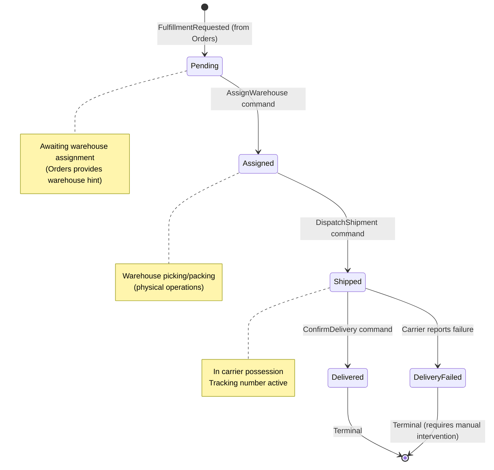
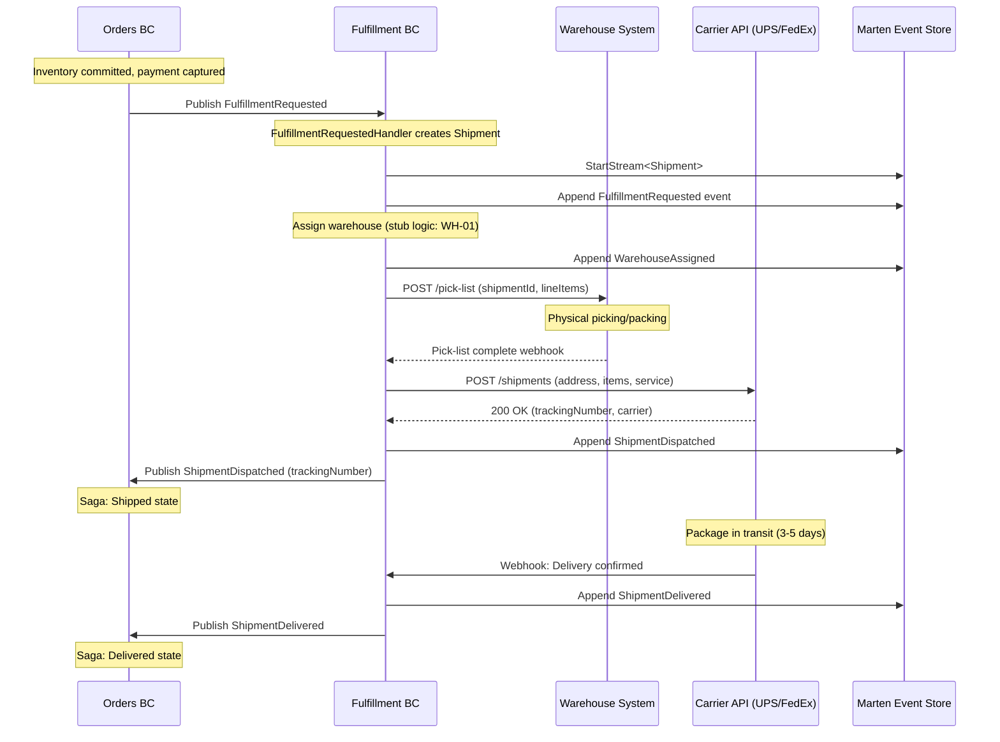
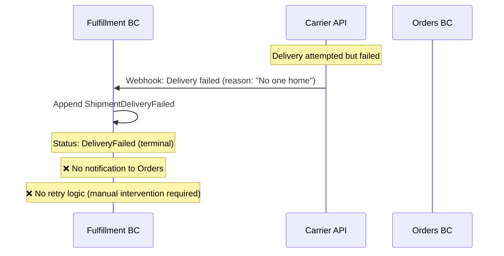

# Fulfillment BC - Workflow Documentation

**Bounded Context:** Fulfillment (Fulfillment Management)  
**Pattern:** Shipment Lifecycle Management + Event Sourcing  
**Database:** Marten (PostgreSQL event store)  
**RabbitMQ:** ❌ Not configured (uses local queues only)

---

## Overview

Fulfillment BC owns the physical shipment lifecycle from warehouse assignment through delivery confirmation. It coordinates with warehouse systems for picking/packing and carrier systems for shipping/tracking. The BC does not make business decisions about which warehouse to use or which carrier to choose—those decisions are orchestrated by Orders BC or configuration.

**Key Aggregate:**
- **Shipment** - Event-sourced aggregate tracking fulfillment workflow

**Integration Pattern:** Choreography (reacts to `FulfillmentRequested` from Orders BC)

---

## 1. Shipment Lifecycle

### State Machine



### Happy Path: Request → Deliver Flow



### Error Path: Delivery Failure



---

## 2. Shipment Aggregate

### State Model

```csharp
// Simplified for documentation
public sealed record Shipment(
    Guid Id,                                    // Shipment ID
    Guid OrderId,                               // Reference back to order
    Guid CustomerId,
    ShippingAddress ShippingAddress,            // Immutable snapshot from checkout
    IReadOnlyList<FulfillmentLineItem> LineItems, // What to ship
    string ShippingMethod,                      // Standard, Express, Overnight
    ShipmentStatus Status,                      // Pending, Assigned, Shipped, Delivered, DeliveryFailed
    string? WarehouseId,                        // Assigned warehouse
    string? Carrier,                            // UPS, FedEx, USPS
    string? TrackingNumber,
    DateTimeOffset RequestedAt,
    DateTimeOffset? AssignedAt,
    DateTimeOffset? DispatchedAt,
    DateTimeOffset? DeliveredAt,
    string? FailureReason
);
```

### Events

| Event | Description | State Changes |
|-------|-------------|---------------|
| `FulfillmentRequested` | Stream created from Orders | Initial state with line items |
| `WarehouseAssigned` | Warehouse selected for fulfillment | `Status = Assigned`<br/>`WarehouseId` set |
| `ShipmentDispatched` | Package handed to carrier | `Status = Shipped`<br/>`Carrier`, `TrackingNumber` set |
| `ShipmentDelivered` | Customer received package | `Status = Delivered` (terminal) |
| `ShipmentDeliveryFailed` | Delivery attempt failed | `Status = DeliveryFailed`<br/>`FailureReason` set |

### Commands & Handlers

| Command | Handler | Validation | Output Messages |
|---------|---------|------------|-----------------|
| `RequestFulfillment` | `FulfillmentRequestedHandler` | ✅ Non-empty line items<br/>✅ Valid address | `FulfillmentRequested` (domain) |
| `AssignWarehouse` | `AssignWarehouseHandler` | ✅ Valid warehouse ID<br/>✅ Status = Pending | `WarehouseAssigned` (domain) |
| `DispatchShipment` | `DispatchShipmentHandler` | ✅ Status = Assigned<br/>✅ Valid carrier/tracking | `ShipmentDispatched` (integration) |
| `ConfirmDelivery` | `ConfirmDeliveryHandler` | ✅ Status = Shipped | `ShipmentDelivered` (integration) |

---

## 3. Integration Events

### Incoming Messages (from Orders BC)

| Message | Handler | Action |
|---------|---------|--------|
| `FulfillmentRequested` | `FulfillmentRequestedHandler` | Creates Shipment stream with line items + address snapshot |

### Outgoing Messages (to Orders BC)

| Message | Triggered By | Contains |
|---------|--------------|----------|
| `ShipmentDispatched` | `ShipmentDispatched` event appended | ShipmentId, OrderId, Carrier, TrackingNumber, DispatchedAt |
| `ShipmentDelivered` | `ShipmentDelivered` event appended | ShipmentId, OrderId, DeliveredAt |

### Missing Messages

| Message | Should Trigger | Impact of Missing |
|---------|----------------|-------------------|
| `ShipmentDeliveryFailed` | Carrier delivery failure | Orders saga doesn't know shipment failed (stuck in `Shipped` state) |
| `WarehouseAssigned` | Warehouse selected | No visibility into warehouse selection (future analytics need) |

---

## 4. Current Implementation Status

| Feature | Status | Notes |
|---------|--------|-------|
| **Shipment creation** | ✅ Complete | `FulfillmentRequestedHandler` creates stream |
| **Event sourcing** | ✅ Complete | Shipment aggregate with Apply() methods |
| **Warehouse assignment** | ⚠️ Stub | Hardcoded `WH-01` (no intelligent routing) |
| **Dispatch flow** | ✅ Complete | `DispatchShipment` command sets carrier + tracking |
| **Delivery confirmation** | ✅ Complete | `ConfirmDelivery` command marks delivered |
| **Delivery failure handling** | ⚠️ Partial | Event exists but no notification to Orders |
| **Carrier integration** | ❌ Missing | No real carrier API calls (stub only) |
| **Warehouse integration** | ❌ Missing | No real warehouse system calls |
| **RabbitMQ** | ❌ Missing | Uses local queues (messages lost on restart) |
| **Tracking webhooks** | ❌ Missing | No carrier webhook listeners |

---

## 5. What's Missing (Engineering Gaps)

### Critical Gaps (P0)

1. **❌ Delivery Failure Notification**
   - **Problem:** `ShipmentDeliveryFailed` event exists but not published to Orders BC
   - **Impact:** Orders saga stuck in `Shipped` state; customer never notified
   - **Fix:** Publish integration message to Orders (Cycle 19)
   - **Priority:** 🔴 **Critical** - Customer experience issue

2. **❌ RabbitMQ Integration**
   - **Problem:** Uses local queues; messages lost on server restart
   - **Impact:** Lost `ShipmentDispatched` → Orders never transitions to `Shipped` state
   - **Fix:** Migrate to RabbitMQ durable queues (Cycle 19)
   - **Priority:** 🔴 **Blocker for production**

3. **❌ Carrier Integration**
   - **Problem:** No real carrier API calls (stub dispatcher)
   - **Impact:** Cannot generate real tracking numbers or get delivery updates
   - **Fix:** Integrate with UPS/FedEx/EasyPost API (Cycle 23)
   - **Priority:** 🔴 **Blocker for production**

### High Priority Gaps (P1)

4. **❌ Warehouse System Integration**
   - **Problem:** No real warehouse system integration (stub assignment)
   - **Impact:** Cannot trigger physical picking/packing operations
   - **Fix:** Integrate with WMS (Warehouse Management System) API (Cycle 24)
   - **Priority:** 🟡 **High** - Blocking operational use

5. **❌ Intelligent Warehouse Routing**
   - **Problem:** All shipments assigned to `WH-01` (hardcoded)
   - **Impact:** Cannot support multi-warehouse fulfillment
   - **Fix:** Coordinate with Inventory BC (nearest warehouse with stock)
   - **Priority:** 🟡 **High** - Blocking multi-warehouse feature

6. **❌ Carrier Webhook Handling**
   - **Problem:** No webhook listeners for carrier updates (in transit, delivered, failed)
   - **Impact:** Manual polling required; delayed delivery confirmations
   - **Fix:** Implement webhook endpoints + signature validation (Cycle 23)
   - **Priority:** 🟡 **High** - Automation

### Medium Priority Gaps (P2)

7. **❌ Shipment Splitting**
   - **Problem:** One order → one shipment (cannot split across warehouses)
   - **Impact:** Cannot fulfill from multiple warehouses (all-or-nothing)
   - **Fix:** Support multiple `FulfillmentRequested` per OrderId (Cycle 25)
   - **Priority:** 🟢 **Medium** - Feature enhancement

8. **❌ Carrier Selection Logic**
   - **Problem:** Carrier not intelligently chosen (customer picks shipping method but not carrier)
   - **Impact:** Cannot optimize for cost/speed (e.g., FedEx cheaper for West Coast)
   - **Fix:** Add carrier selection strategy (cost, speed, reliability)
   - **Priority:** 🟢 **Medium** - Optimization

9. **❌ Failed Delivery Retry**
   - **Problem:** `DeliveryFailed` is terminal (no automatic retry)
   - **Impact:** Support team must manually re-dispatch
   - **Fix:** Add retry logic (attempt #2 after customer reschedules)
   - **Priority:** 🟢 **Medium** - Automation

10. **❌ Shipment Cost Tracking**
    - **Problem:** No capture of shipping cost paid to carrier
    - **Impact:** Cannot calculate shipping profit margin
    - **Fix:** Add `ShippingCost` field + event when cost confirmed
    - **Priority:** 🟢 **Low** - Analytics

---

## 6. Business Questions for Product Owner

### Critical Decisions Needed

1. **Delivery Failure Handling:**
   - Q: What happens when delivery fails (no one home, wrong address)?
   - Options:
     - A) Auto-retry next day (3 attempts max)
     - B) Hold at carrier location (customer picks up)
     - C) Return to warehouse (customer must reschedule)
   - Current: Terminal state (manual intervention)
   - Impact: Affects customer experience and support team workload

2. **Warehouse Selection Strategy:**
   - Q: How do we choose warehouse when multiple have stock?
   - Options:
     - A) Nearest to customer (lowest shipping cost)
     - B) First with all items (avoid splitting shipments)
     - C) Balance workload (even distribution)
   - Current: Hardcoded `WH-01`
   - Impact: Affects shipping costs and delivery times

3. **Shipment Splitting:**
   - Q: If items at different warehouses, ship separately or wait for all?
   - Options:
     - A) Wait for all (single shipment, longer wait)
     - B) Ship available now (multiple tracking numbers, faster)
     - C) Customer choice (adds complexity)
   - Current: All-or-nothing (one warehouse per order)
   - Impact: Affects Orders BC saga (must handle multiple shipments)

4. **Carrier Selection:**
   - Q: Customer picks "Standard Shipping"—how do we choose carrier?
   - Options:
     - A) Cheapest (optimize cost)
     - B) Fastest (optimize speed)
     - C) Most reliable (optimize success rate)
     - D) Contract terms (volume commitments)
   - Current: Not implemented (stub carrier)
   - Impact: Affects profitability and customer satisfaction

### Non-Critical (Future Cycles)

5. **International Shipping:**
   - Q: Will we ship internationally (customs, duties)?
   - Current: Domestic US only (no customs integration)
   - Impact: Requires customs documentation + duty calculation

6. **Gift Messages:**
   - Q: Can customers include gift messages in shipments?
   - Current: No support
   - Impact: Requires warehouse system integration (print inserts)

7. **Signature Required:**
   - Q: Do high-value orders require signature on delivery?
   - Current: No differentiation
   - Impact: Affects carrier cost and delivery success rate

8. **Returns Processing:**
   - Q: How do we handle return shipments (different BC or same)?
   - Current: No Returns BC (Cycle 25+)
   - Impact: May reuse Shipment aggregate with `Direction` enum (Outbound/Inbound)

---

## 7. Testing Coverage

### Current Tests (Integration Tests)

**Tests Exist:** ⚠️ Minimal (`tests/Fulfillment/Fulfillment.Api.IntegrationTests`)

| Test Category | Coverage | Status |
|---------------|----------|--------|
| Request fulfillment (happy path) | ✅ | Pass |
| Assign warehouse | ✅ | Pass |
| Dispatch shipment | ✅ | Pass |
| Confirm delivery | ✅ | Pass |
| Delivery failure | ❌ | Not implemented |
| Carrier webhook processing | ❌ | Not implemented |
| Multiple shipments per order | ❌ | Not implemented |

### What's NOT Tested

- ❌ **Delivery failure flow** - `ShipmentDeliveryFailed` event handling
- ❌ **Carrier webhooks** - Parsing carrier payloads (tracking updates)
- ❌ **Shipment splitting** - Multiple fulfillment requests per order
- ❌ **RabbitMQ durability** - Message loss on restart
- ❌ **Warehouse integration** - Pick-list generation, packing confirmation
- ❌ **Address validation** - Invalid addresses (carrier rejects)
- ❌ **Idempotency** - Duplicate `FulfillmentRequested` events

### Recommended Tests (Cycle 20)

```csharp
[Fact]
public async Task delivery_failure_notifies_orders_bc()
{
    // Arrange: Ship order
    var orderId = await RequestFulfillmentAndDispatch();
    
    // Act: Carrier reports delivery failure
    await SimulateCarrierWebhook(orderId, "delivery_failed", "No one home");
    
    // Assert: ShipmentDeliveryFailed published to Orders
    await Eventually(() => GetOrderStatus(orderId) == "DeliveryFailed", timeout: 10.Seconds());
}

[Fact]
public async Task duplicate_fulfillment_requested_does_not_create_duplicate_shipments()
{
    // Arrange
    var orderId = Guid.NewGuid();
    var request = new FulfillmentRequested(...);
    
    // Act: Publish same event twice
    await PublishFulfillmentRequested(request);
    await PublishFulfillmentRequested(request); // Duplicate
    
    // Assert: Only 1 shipment stream created
    var shipments = await GetShipmentsByOrderId(orderId);
    shipments.Count.ShouldBe(1);
}

[Fact]
public async Task invalid_address_rejected_by_carrier()
{
    // Arrange: Invalid address (wrong zip code)
    var request = new FulfillmentRequested(
        address: new ShippingAddress("123 Fake St", "Springfield", "IL", "00000-INVALID", "US"),
        ...);
    
    // Act: Attempt dispatch
    await PublishFulfillmentRequested(request);
    await DispatchShipment(request.ShipmentId);
    
    // Assert: Shipment failed (carrier rejected)
    var shipment = await GetShipment(request.ShipmentId);
    shipment.Status.ShouldBe(ShipmentStatus.DeliveryFailed);
    shipment.FailureReason.ShouldContain("invalid address");
}
```

---

## 8. External Integrations Needed

### Carrier API Integration (Priority: P0)

**Recommended Provider:** [EasyPost](https://www.easypost.com) (multi-carrier aggregator)

**Features Needed:**
- Rate shopping (compare UPS, FedEx, USPS)
- Label generation (PDF download)
- Tracking webhooks (delivery updates)
- Address validation (pre-shipment check)

**Implementation Plan (Cycle 23):**
```csharp
public interface ICarrierService
{
    Task<ShipmentRates> GetRatesAsync(ShippingAddress address, IReadOnlyList<Package> packages);
    Task<ShipmentLabel> CreateShipmentAsync(ShippingAddress address, Carrier carrier, ServiceLevel service);
    Task<TrackingDetails> GetTrackingAsync(string trackingNumber);
}
```

### Warehouse Management System (WMS) Integration (Priority: P1)

**Integration Points:**
- Pick-list generation (send line items → warehouse)
- Packing confirmation (warehouse → confirm items picked)
- Inventory sync (warehouse → update stock levels)

**Implementation Plan (Cycle 24):**
```csharp
public interface IWarehouseService
{
    Task<PickList> GeneratePickListAsync(Guid shipmentId, IReadOnlyList<FulfillmentLineItem> items);
    Task<PackingConfirmation> GetPackingStatusAsync(Guid pickListId);
}
```

---

## 9. Next Steps (Engineering Roadmap)

### Cycle 19: Critical Fixes
- [ ] **Publish delivery failure to Orders** - Add integration message for `ShipmentDeliveryFailed`
- [ ] **RabbitMQ migration** - Migrate all integration messages to durable queues
- [ ] Integration tests for delivery failure flow
- [ ] Add idempotency checks (prevent duplicate shipments)

### Cycle 20: Testing & Resilience
- [ ] Idempotency tests (duplicate `FulfillmentRequested`)
- [ ] Delivery failure compensation tests
- [ ] Load tests (100+ simultaneous dispatch requests)
- [ ] Webhook payload validation (carrier signature checks)

### Cycle 23: Carrier Integration
- [ ] **Integrate EasyPost API** - Replace stub dispatcher with real carrier calls
- [ ] Implement carrier webhook endpoints
- [ ] Address validation pre-dispatch
- [ ] Rate shopping (select cheapest carrier per shipping method)
- [ ] Label generation (PDF download for warehouse)

### Cycle 24: Warehouse Integration
- [ ] **Integrate WMS API** - Send pick-lists, receive packing confirmations
- [ ] Warehouse selection strategy (coordinate with Inventory BC)
- [ ] Dashboard showing pending pick-lists (warehouse portal)
- [ ] Packing confirmation webhook handling

### Cycle 25: Advanced Features
- [ ] **Shipment splitting** - Support multiple shipments per order
- [ ] Failed delivery retry logic (3 attempts max)
- [ ] International shipping (customs integration)
- [ ] Signature-required for high-value orders

---

**Document Owner:** Principal Architect  
**Last Updated:** 2026-02-17  
**Status:** ✅ Ready for Product Owner Review
