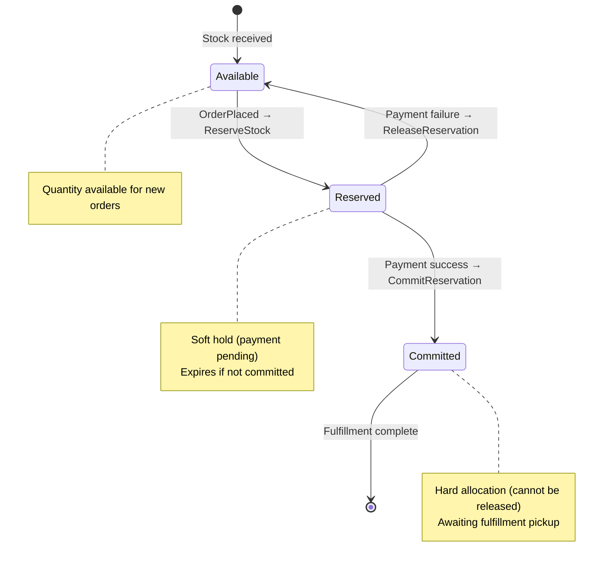
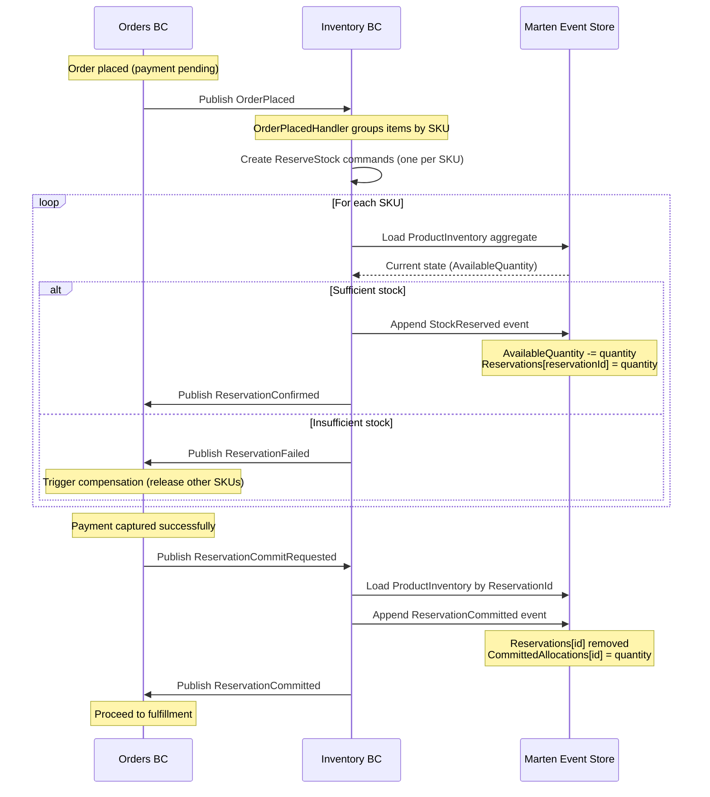
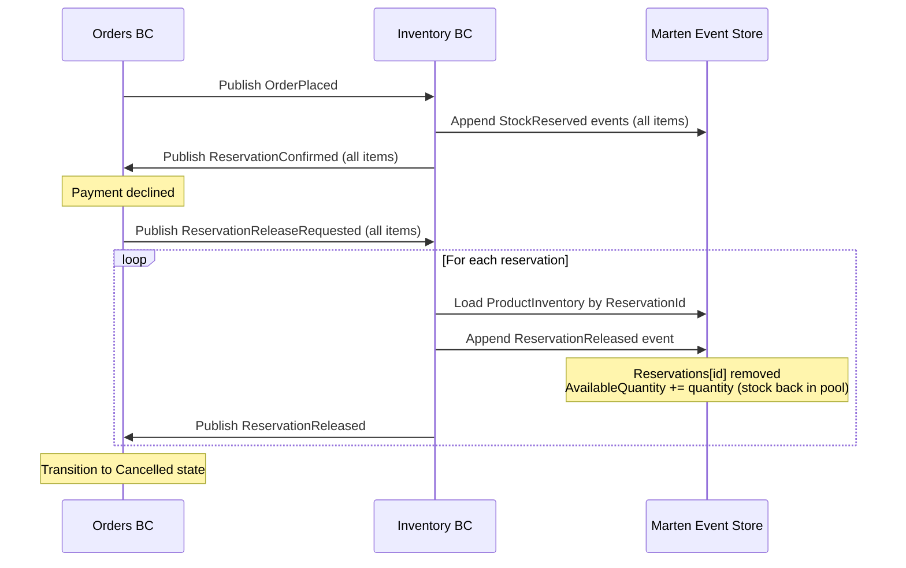

# Inventory BC - Workflow Documentation

**Bounded Context:** Inventory (Inventory Management)  
**Pattern:** Two-Phase Reservation (Reserve → Commit → Release) + Event Sourcing  
**Database:** Marten (PostgreSQL event store)  
**RabbitMQ:** ❌ Not configured (uses local queues only)

---

## Overview

Inventory BC owns stock levels and availability across warehouses. It implements a **two-phase reservation pattern** to prevent overselling while supporting cancellations and payment failures. Stock quantities are managed through three distinct pools: Available, Reserved (soft holds), and Committed (hard allocations). This pattern ensures no overselling while enabling graceful handling of payment failures or order cancellations.

**Key Aggregate:**
- **ProductInventory** - Event-sourced aggregate tracking stock levels per SKU per warehouse

**Integration Pattern:** Choreography (reacts to `OrderPlaced` events from Orders BC)

---

## 1. Two-Phase Reservation Pattern

### Conceptual Model



### Happy Path: Reserve → Commit Flow



### Error Path: Payment Failure with Release



---

## 2. ProductInventory Aggregate

### State Model

```csharp
// Simplified for documentation
public sealed record ProductInventory(
    Guid Id,                                    // Combined: MD5(SKU:WarehouseId)
    string Sku,
    string WarehouseId,
    int AvailableQuantity,                      // Stock pool for new reservations
    Dictionary<Guid, int> Reservations,         // Soft holds (reservationId → quantity)
    Dictionary<Guid, int> CommittedAllocations, // Hard allocations (reservationId → quantity)
    Dictionary<Guid, Guid> ReservationOrderIds  // Reservation → Order mapping
)
{
    public int ReservedQuantity => Reservations.Values.Sum();
    public int CommittedQuantity => CommittedAllocations.Values.Sum();
    public int TotalOnHand => AvailableQuantity + ReservedQuantity + CommittedQuantity;
}
```

### Events

| Event | Description | State Changes |
|-------|-------------|---------------|
| `InventoryInitialized` | Warehouse receives new SKU | Create aggregate with initial quantity |
| `StockReserved` | Soft hold created for order | `AvailableQuantity -= qty`<br/>`Reservations[id] = qty` |
| `ReservationCommitted` | Soft hold → hard allocation | `Reservations[id]` removed<br/>`CommittedAllocations[id] = qty` |
| `ReservationReleased` | Soft hold cancelled | `Reservations[id]` removed<br/>`AvailableQuantity += qty` |
| `StockReceived` | New inventory shipment | `AvailableQuantity += qty` |
| `StockRestocked` | Returns/adjustments | `AvailableQuantity += qty` |

### Commands & Handlers

| Command | Handler | Validation | Output Messages |
|---------|---------|------------|-----------------|
| `ReserveStock` | `ReserveStockHandler` | ✅ Sufficient available stock<br/>✅ Valid SKU/warehouse | `ReservationConfirmed` (integration)<br/>`StockReserved` (domain) |
| `CommitReservation` | `ReservationCommitRequestedHandler` | ✅ Reservation exists<br/>✅ Not already committed | `ReservationCommitted` (both) |
| `ReleaseReservation` | `ReservationReleaseRequestedHandler` | ✅ Reservation exists<br/>✅ Not yet committed | `ReservationReleased` (both) |
| `ReceiveStock` | `ReceiveStockHandler` | ✅ Quantity > 0 | `StockReceived` (domain) |
| `InitializeInventory` | `InitializeInventoryHandler` | ✅ SKU/warehouse not exists | `InventoryInitialized` (domain) |

---

## 3. Integration Events

### Incoming Messages (from Orders BC)

| Message | Handler | Action |
|---------|---------|--------|
| `OrderPlaced` | `OrderPlacedHandler` | Groups line items by SKU → creates `ReserveStock` commands (one per SKU) |
| `ReservationCommitRequested` | `ReservationCommitRequestedHandler` | Loads aggregate by ReservationId → commits reservation |
| `ReservationReleaseRequested` | `ReservationReleaseRequestedHandler` | Loads aggregate by ReservationId → releases reservation |

### Outgoing Messages (to Orders BC)

| Message | Triggered By | Contains |
|---------|--------------|----------|
| `ReservationConfirmed` | `StockReserved` event appended | OrderId, ReservationId, SKU, Warehouse, Quantity |
| `ReservationFailed` | Insufficient stock during reserve | OrderId, SKU, Reason |
| `ReservationCommitted` | `ReservationCommitted` event appended | OrderId, ReservationId, Quantity |
| `ReservationReleased` | `ReservationReleased` event appended | OrderId, ReservationId, Quantity |

---

## 4. Current Implementation Status

| Feature | Status | Notes |
|---------|--------|-------|
| **Core Reservation Logic** | ✅ Complete | Reserve, Commit, Release handlers working |
| **Event sourcing** | ✅ Complete | ProductInventory aggregate with Apply() methods |
| **Multi-SKU orders** | ✅ Complete | OrderPlacedHandler groups items by SKU |
| **Warehouse routing** | ⚠️ Stub | Hardcoded `WH-01` (TODO: intelligent routing) |
| **Stock validation** | ✅ Complete | Rejects reservations exceeding available stock |
| **Compensation flow** | ✅ Complete | Release handler restores stock to available pool |
| **RabbitMQ** | ❌ Missing | Uses local queues (messages lost on restart) |
| **Dead-letter queues** | ❌ Missing | No DLQ for failed messages |
| **Idempotency** | ❌ Missing | Duplicate `OrderPlaced` creates duplicate reservations |
| **Reservation timeout** | ❌ Missing | Soft holds never expire |
| **Concurrency handling** | ⚠️ Implicit | Marten optimistic concurrency (untested under load) |

---

## 5. What's Missing (Engineering Gaps)

### Critical Gaps (P0)

1. **❌ RabbitMQ Integration**
   - **Problem:** Uses local queues; messages lost on server restart
   - **Impact:** Lost `OrderPlaced` → no reservation created → order stuck
   - **Fix:** Migrate to RabbitMQ durable queues (Cycle 19)
   - **Priority:** 🔴 **Blocker for production**

2. **❌ Idempotency**
   - **Problem:** Duplicate `OrderPlaced` events create multiple reservations
   - **Impact:** Inventory leakage (over-reserved stock never released)
   - **Fix:** Add idempotency key to integration messages (Cycle 20)
   - **Priority:** 🔴 **Critical**

3. **❌ Reservation Timeout**
   - **Problem:** Soft holds never expire (abandoned orders hold stock forever)
   - **Impact:** Stock artificially constrained; overselling risk when timeouts trigger
   - **Fix:** Background job releasing reservations >1 hour old (Cycle 21)
   - **Priority:** 🔴 **Critical**

### High Priority Gaps (P1)

4. **❌ Intelligent Warehouse Routing**
   - **Problem:** All reservations go to `WH-01` (hardcoded)
   - **Impact:** Cannot support multi-warehouse fulfillment
   - **Fix:** Implement warehouse selection strategy (nearest, prioritize low-stock, split orders)
   - **Priority:** 🟡 **Medium** (blocking multi-warehouse feature)

5. **❌ Concurrency Testing**
   - **Problem:** Race conditions untested (simultaneous reservations for last item)
   - **Impact:** Potential overselling under high load
   - **Fix:** Load tests with 100+ concurrent reservations for same SKU
   - **Priority:** 🟡 **Medium** (blocking performance validation)

6. **❌ Low Stock Alerts**
   - **Problem:** No `InventoryLow` events published
   - **Impact:** Cannot trigger auto-reordering or "limited stock" UI badges
   - **Fix:** Publish alert when `AvailableQuantity < threshold` (Cycle 22)
   - **Priority:** 🟢 **Low** (nice-to-have feature)

### Medium Priority Gaps (P2)

7. **❌ Committed Allocation Cleanup**
   - **Problem:** `CommittedAllocations` dictionary grows forever (never pruned after fulfillment)
   - **Impact:** Aggregate size grows unbounded (performance degrades over time)
   - **Fix:** Add `StockFulfilled` event (removes from CommittedAllocations)
   - **Priority:** 🟢 **Low** (optimization)

8. **❌ Partial Reservation Handling**
   - **Problem:** All-or-nothing reservations (5-item order fails if 1 SKU out of stock)
   - **Impact:** Poor UX (cannot offer "ship what's available now")
   - **Fix:** Support partial fulfillment (Orders saga must handle split shipments)
   - **Priority:** 🟢 **Low** (requires Orders BC changes)

9. **❌ Stock Forecasting**
   - **Problem:** No visibility into reserved vs committed stock for demand planning
   - **Impact:** Purchasing team cannot see "real" available stock
   - **Fix:** Add read model projecting reservation trends (Cycle 23+)
   - **Priority:** 🟢 **Low** (analytics feature)

---

## 6. Business Questions for Product Owner

### Critical Decisions Needed

1. **Reservation Timeout Policy:**
   - Q: How long should soft holds persist before auto-release?
   - Options:
     - A) 15 minutes (aggressive, prevents abandoned cart stock locks)
     - B) 1 hour (balanced, aligns with checkout session timeout)
     - C) 24 hours (lenient, reduces customer complaints)
   - Engineering recommendation: **1 hour** (aligns with Orders saga timeout)
   - Impact: Affects perceived stock availability in Catalog

2. **Warehouse Selection Strategy:**
   - Q: When multiple warehouses have stock, how do we choose?
   - Options:
     - A) Nearest to customer (lowest shipping cost)
     - B) Prioritize low-stock warehouses (balance inventory)
     - C) Random (simplest)
   - Current: Hardcoded `WH-01` (not realistic)
   - Impact: Affects shipping costs and delivery times

3. **Partial Fulfillment:**
   - Q: If 3/5 items in stock, ship available now or wait for all?
   - Options:
     - A) All-or-nothing (current behavior, simplest)
     - B) Ship available + backorder rest (requires split shipment logic)
     - C) Customer choice (adds UX complexity)
   - Impact: Affects Orders BC saga (must handle multiple fulfillment requests)

4. **Low Stock Threshold:**
   - Q: At what quantity do we alert purchasing/show "limited stock" badge?
   - Options:
     - A) Fixed threshold (e.g., <10 units)
     - B) Percentage of avg daily sales (e.g., <2 days supply)
     - C) ML-predicted stockout date
   - Current: No alerts published
   - Impact: Affects reorder point calculations

### Non-Critical (Future Cycles)

5. **Safety Stock Buffer:**
   - Q: Should we reserve X units per SKU as "never reserve" safety stock?
   - Current: Available quantity can reach 0 (overselling risk if reservations timeout simultaneously)

6. **Returns Restocking:**
   - Q: Do returned items go back to available stock immediately or after inspection?
   - Current: No Returns BC integration (Cycle 25+)

7. **Inventory Audits:**
   - Q: How do we handle physical inventory discrepancies (theft, damage)?
   - Current: No adjustment mechanism beyond `StockReceived`

---

## 7. Testing Coverage

### Current Tests (Integration Tests)

**Tests Exist:** ✅ Yes (`tests/Inventory/Inventory.Api.IntegrationTests`)

| Test Category | Coverage | Status |
|---------------|----------|--------|
| Reserve stock (happy path) | ✅ | Pass |
| Reserve stock (insufficient stock) | ✅ | Pass |
| Commit reservation | ✅ | Pass |
| Release reservation | ✅ | Pass |
| Multi-SKU order reservation | ✅ | Pass |
| Stock received | ✅ | Pass |

### What's NOT Tested

- ❌ **Concurrent reservations** - Race conditions for last item in stock
- ❌ **Idempotency** - Duplicate `OrderPlaced` events
- ❌ **Reservation timeout** - Auto-release of abandoned soft holds
- ❌ **RabbitMQ durability** - Message loss on server restart
- ❌ **Aggregate size growth** - Performance with 10,000+ reservations
- ❌ **Warehouse routing** - Intelligent selection algorithm
- ❌ **Partial fulfillment** - Split shipment scenarios

### Recommended Tests (Cycle 20)

```csharp
[Fact]
public async Task concurrent_reservations_for_last_item_only_one_succeeds()
{
    // Arrange: 1 unit available, 2 simultaneous orders
    await InitializeInventory("SKU-001", "WH-01", quantity: 1);
    
    // Act: Fire 2 concurrent OrderPlaced events
    var task1 = PublishOrderPlaced(orderId1, sku: "SKU-001", qty: 1);
    var task2 = PublishOrderPlaced(orderId2, sku: "SKU-001", qty: 1);
    await Task.WhenAll(task1, task2);
    
    // Assert: 1 ReservationConfirmed, 1 ReservationFailed
    var confirmations = await GetReservationResponses();
    confirmations.Count(r => r.Success).ShouldBe(1);
    confirmations.Count(r => !r.Success).ShouldBe(1);
}

[Fact]
public async Task duplicate_order_placed_events_do_not_create_duplicate_reservations()
{
    // Arrange: Initialize inventory
    await InitializeInventory("SKU-001", "WH-01", quantity: 10);
    
    // Act: Publish same OrderPlaced event twice
    var orderId = Guid.NewGuid();
    await PublishOrderPlaced(orderId, sku: "SKU-001", qty: 5);
    await PublishOrderPlaced(orderId, sku: "SKU-001", qty: 5); // Duplicate
    
    // Assert: Only 1 reservation created (5 reserved, not 10)
    var inventory = await GetInventory("SKU-001", "WH-01");
    inventory.ReservedQuantity.ShouldBe(5);
    inventory.AvailableQuantity.ShouldBe(5);
}

[Fact]
public async Task soft_holds_expire_after_timeout_period()
{
    // Arrange: Reserve stock
    var orderId = await PlaceOrderWithReservation("SKU-001", qty: 5);
    
    // Act: Wait for timeout (1 hour)
    await Task.Delay(TimeSpan.FromHours(1).Add(TimeSpan.FromSeconds(5)));
    
    // Assert: Reservation auto-released
    var inventory = await GetInventory("SKU-001", "WH-01");
    inventory.ReservedQuantity.ShouldBe(0);
    inventory.AvailableQuantity.ShouldBe(10); // Back in pool
}
```

---

## 8. Next Steps (Engineering Roadmap)

### Cycle 19: Infrastructure Hardening
- [ ] **RabbitMQ Migration** - Migrate all integration messages to durable queues
- [ ] Configure dead-letter queues (3 retry attempts)
- [ ] Add connection resilience (retry policy for RabbitMQ broker failures)
- [ ] Integration tests verifying message durability across restarts

### Cycle 20: Idempotency & Concurrency
- [ ] **Add idempotency keys** - Prevent duplicate reservations from duplicate events
- [ ] **Concurrency load tests** - 100+ concurrent reservations for same SKU
- [ ] Test Marten optimistic concurrency under load (verify no overselling)
- [ ] Add OpenTelemetry tracing for reservation flow

### Cycle 21: Reservation Lifecycle
- [ ] **Implement reservation timeout** - Background job releasing soft holds >1 hour old
- [ ] Add `ReservationExpired` event
- [ ] Integration with Orders BC (notify customer of timeout)
- [ ] Dashboard showing expired reservations (support tool)

### Cycle 22: Warehouse Intelligence
- [ ] **Intelligent warehouse routing** - Nearest warehouse by customer zip code
- [ ] Multi-warehouse inventory aggregation (queries across all warehouses)
- [ ] **Low stock alerts** - Publish `InventoryLow` event (threshold: <10 units)
- [ ] Support split shipments (partial fulfillment from multiple warehouses)

### Cycle 23: Optimization & Analytics
- [ ] **Committed allocation cleanup** - Add `StockFulfilled` event (prune CommittedAllocations)
- [ ] Read model for demand forecasting (reserved + committed trends)
- [ ] Performance testing with large aggregates (10,000+ reservations)
- [ ] Inventory snapshot projections (daily stock level history)

---

**Document Owner:** Principal Architect  
**Last Updated:** 2026-02-17  
**Status:** ✅ Ready for Product Owner Review
