# Orders BC - Workflow Documentation

**Bounded Context:** Orders (Order Management)  
**Pattern:** Saga Orchestration + Event Sourcing  
**Database:** Marten (PostgreSQL event store)  
**RabbitMQ:** ✅ Partial (publishes `OrderPlaced` only)

---

## Overview

Orders BC owns the commercial commitment phase and orchestrates the order lifecycle across multiple downstream bounded contexts (Payments, Inventory, Fulfillment). It implements a stateful saga pattern using Wolverine's saga support combined with the Decider pattern for pure business logic.

**Key Aggregates:**
1. **Checkout** - Multi-step order finalization (address, payment method, shipping method)
2. **Order** - Saga coordinating inventory, payments, and fulfillment

---

## 1. Checkout Workflow

### Happy Path: Complete Checkout Flow


### Events

| Event | Description | Terminal? |
|-------|-------------|-----------|
| `CheckoutStarted` | Checkout stream created from Shopping.CheckoutInitiated | No |
| `ShippingAddressSelected` | Customer chose saved address (stores AddressId reference) | No |
| `ShippingMethodSelected` | Shipping method chosen (Standard, Express, Overnight) | No |
| `PaymentMethodProvided` | Payment method token collected | No |
| `CheckoutCompleted` | All prerequisites met, triggers Order saga | **Yes** |

### Current Implementation Status

| Feature | Status | Notes |
|---------|--------|-------|
| Integration from Shopping | ✅ Complete | `CheckoutInitiated` handler creates Checkout stream |
| Multi-step wizard | ✅ Complete | 4 commands: Address, Method, Payment, Complete |
| Address resolution | ✅ Complete | Queries Customer Identity for AddressSnapshot |
| Price-at-checkout capture | ✅ Complete | Cart items snapshot embedded in CheckoutStarted |
| Validation | ✅ Complete | FluentValidation rules for all commands |

### What's Missing (Engineering Gaps)

- ❌ **Checkout timeout** - No automatic abandonment if customer doesn't complete within X minutes
- ❌ **Inventory hold during checkout** - Items not reserved; can sell out mid-checkout
- ❌ **Payment method validation** - Token not verified until order placement
- ❌ **Shipping cost calculation** - Stored but not calculated (stub values)
- ❌ **Tax calculation** - Not implemented (would need tax service integration)

---

## 2. Order Saga Workflow

### Happy Path: Full Order Lifecycle


### Saga States

| State | Description | Next States |
|-------|-------------|-------------|
| `Placed` | Order created, awaiting inventory + payment confirmation | PendingPayment, InventoryReserved |
| `PendingPayment` | Awaiting async payment confirmation | PaymentConfirmed, PaymentFailed |
| `PaymentConfirmed` | Payment captured successfully | InventoryCommitted |
| `InventoryReserved` | Stock soft-held | PaymentConfirmed |
| `InventoryCommitted` | Stock hard-allocated | Fulfilling |
| `PaymentFailed` | Payment declined | Cancelled |
| `InventoryFailed` | Insufficient stock | Cancelled |
| `OnHold` | Flagged for manual review (future) | N/A |
| `Fulfilling` | Handed to Fulfillment BC | Shipped |
| `Shipped` | Carrier picked up | Delivered |
| `Delivered` | Customer received | Closed |
| `Cancelled` | Compensation triggered | [terminal] |
| `Closed` | Order lifecycle complete | [terminal] |

### Integration Events Flow


### Error Path: Payment Failure with Compensation

```mermaid
sequenceDiagram
    participant Orders as Orders BC (Saga)
    participant Inventory as Inventory BC
    participant Payments as Payments BC
    
    Orders->>Orders: OrderPlaced
    Orders->>Inventory: Publish OrderPlaced
    Orders->>Payments: Publish OrderPlaced
    
    Inventory->>Orders: Publish ReservationConfirmed
    Orders->>Orders: State: InventoryReserved
    
    Payments->>Orders: Publish PaymentFailed (declined card)
    Orders->>Orders: State: PaymentFailed
    
    Note over Orders: Trigger compensation flow
    Orders->>Inventory: Publish ReservationReleaseRequested
    Inventory->>Orders: Publish ReservationReleased
    Orders->>Orders: State: Cancelled
    
    Note over Orders: ❌ Missing: Notify customer of failure
    Note over Orders: ❌ Missing: Allow payment method retry
```



### Error Path: Inventory Failure with Compensation


### Current Implementation Status

| Feature | Status | Notes |
|---------|--------|-------|
| Order saga creation | ✅ Complete | `Order.Start()` from CheckoutCompleted |
| Inventory orchestration | ✅ Complete | Reserve → Commit → Release flows |
| Payment orchestration | ✅ Complete | Authorize → Capture flows |
| Fulfillment orchestration | ✅ Complete | Request → Dispatch → Deliver flows |
| State transitions | ✅ Complete | Saga tracks status enum |
| RabbitMQ publishing | ⚠️ Partial | Only `OrderPlaced` published to RabbitMQ |
| Compensation (inventory) | ✅ Complete | Releases inventory on payment failure |
| Compensation (payment) | ❌ Missing | Refund handler exists but saga doesn't handle response |

### What's Missing (Engineering Gaps)

#### Critical Gaps

1. **❌ Incomplete Compensation Flow (Payment Refund)**
   - Problem: Inventory failure triggers `RefundRequested`, but saga doesn't handle `RefundCompleted` / `RefundFailed`
   - Impact: Order stuck in `InventoryFailed` state, customer charged but no refund processed
   - Fix: Add saga handlers for `RefundCompleted` → transition to `Cancelled`

2. **❌ No Saga Timeout**
   - Problem: Saga waits indefinitely for Inventory/Payments/Fulfillment responses
   - Impact: Stuck sagas if downstream BC fails silently
   - Fix: Implement Wolverine saga timeout (e.g., 1 hour)

3. **❌ No Retry Logic**
   - Problem: Failed payments/inventory reservations are terminal immediately
   - Impact: Transient failures (DB lock, network blip) kill orders
   - Fix: Add Wolverine retry policy with exponential backoff

4. **❌ Partial RabbitMQ Integration**
   - Problem: Only `OrderPlaced` published to RabbitMQ; Inventory/Payments/Fulfillment use local queues
   - Impact: Messages lost on server restart (not durable)
   - Fix: Migrate all integration messages to RabbitMQ

#### Medium Priority Gaps

5. **❌ No Idempotency**
   - Problem: Duplicate `OrderPlaced` events create multiple inventory reservations
   - Impact: Inventory leakage, potential overselling
   - Fix: Add idempotency key to integration messages

6. **❌ No OnHold State Handling**
   - Problem: `OnHold` state exists but no logic to transition into/out of it
   - Impact: Cannot flag orders for manual review (fraud, address issues)
   - Fix: Add fraud check integration, admin UI for releasing holds

7. **❌ No Partial Fulfillment**
   - Problem: Cannot split orders across multiple warehouses
   - Impact: All-or-nothing fulfillment (blocks orders if single item out of stock)
   - Fix: Model multiple fulfillment requests per order

8. **❌ No Saga State Visualization**
   - Problem: No admin UI or logs showing where orders are stuck
   - Impact: Hard to debug production issues
   - Fix: Add saga dashboard (future cycle)

---

## 3. RabbitMQ Integration Analysis

### Current Configuration

**Program.cs (Orders.Api):**
```csharp
opts.UseRabbitMq(rabbit =>
{
    rabbit.HostName = "localhost";
    rabbit.Port = 5672;
    rabbit.UserName = "guest";
    rabbit.Password = "guest";
});

// Only OrderPlaced publishes to RabbitMQ
opts.PublishMessage<Messages.Contracts.Orders.OrderPlaced>()
    .ToRabbitQueue("storefront-notifications");
```

### What Uses RabbitMQ vs Local Queues

| Integration Point | Transport | Durable? | Notes |
|-------------------|-----------|----------|-------|
| `OrderPlaced` → Storefront | RabbitMQ | ✅ Yes | Customer Experience subscribes |
| `OrderPlaced` → Inventory | **Local** | ❌ No | Lost on restart |
| `OrderPlaced` → Payments | **Local** | ❌ No | Lost on restart |
| `CheckoutInitiated` (from Shopping) | **Local** | ❌ No | Lost on restart |
| `ReservationConfirmed` (from Inventory) | **Local** | ❌ No | Lost on restart |
| `PaymentCaptured` (from Payments) | **Local** | ❌ No | Lost on restart |
| `FulfillmentRequested` → Fulfillment | **Local** | ❌ No | Lost on restart |

### Impact of Hybrid Architecture

**Scenario: Server Restart During Order Placement**

1. Order saga created: `OrderPlaced` published locally to Inventory/Payments
2. Server restarts (deployment, crash, etc.)
3. ❌ `OrderPlaced` messages lost (in-memory queue)
4. ❌ Order saga stuck in `Placed` state (waiting forever)
5. ❌ Customer charged (if payment processed before restart)
6. ❌ Inventory not reserved (message never reached Inventory BC)

**Risk Level:** 🔴 **High** - Data loss and stuck sagas in production

### Recommendation: Full RabbitMQ Migration

```csharp
// Target configuration (Cycle 19)
opts.UseRabbitMq(rabbit =>
{
    rabbit.HostName = "localhost";
    rabbit.Port = 5672;
    rabbit.AutoProvision = true; // Create queues automatically
    rabbit.DeadLetterQueueing.Enabled = true; // Enable DLQs
    rabbit.DeadLetterQueueing.MaximumRedeliveryAttempts = 3;
});

// All integration messages to RabbitMQ
opts.PublishMessage<Messages.Contracts.Orders.OrderPlaced>()
    .ToRabbitQueue("inventory-notifications");

opts.PublishMessage<Messages.Contracts.Orders.OrderPlaced>()
    .ToRabbitQueue("payments-notifications");

opts.PublishMessage<Messages.Contracts.Orders.OrderPlaced>()
    .ToRabbitQueue("storefront-notifications");

opts.PublishMessage<Messages.Contracts.Orders.ReservationCommitRequested>()
    .ToRabbitQueue("inventory-notifications");

opts.PublishMessage<Messages.Contracts.Orders.FulfillmentRequested>()
    .ToRabbitQueue("fulfillment-notifications");
```

---

## 4. Testing Coverage

### Current Tests (32 passing)

**Integration Tests (Orders.IntegrationTests):**
- ✅ Checkout flow (4 steps: Address → Method → Payment → Complete)
- ✅ Order saga creation from CheckoutCompleted
- ✅ Inventory reservation flow (Reserve → Commit → Release)
- ✅ Payment authorization flow (Authorize → Capture)
- ✅ Fulfillment request flow
- ✅ State transitions validation

### What's NOT Tested

- ❌ **Timeout scenarios** - Saga waits indefinitely
- ❌ **Concurrent order placement** - Race conditions on inventory
- ❌ **RabbitMQ durability** - Server restart during saga
- ❌ **Compensation flow** - Payment refund after inventory failure
- ❌ **Idempotency** - Duplicate OrderPlaced events
- ❌ **Dead-letter queue** - Failed message handling

### Recommended Tests (Cycle 20)

```csharp
// Chaos engineering tests
[Fact]
public async Task order_saga_survives_inventory_service_restart()
{
    // Arrange: Place order
    var orderId = await PlaceOrder();
    
    // Act: Crash Inventory BC
    await _inventoryContainer.StopAsync();
    await Task.Delay(5000);
    await _inventoryContainer.StartAsync();
    
    // Assert: Order eventually completes
    await Eventually(() => GetOrderStatus(orderId) == "Delivered", timeout: 60.Seconds());
}

// Compensation flow test
[Fact]
public async Task order_refunds_payment_when_inventory_fails()
{
    // Arrange: Place order (payment succeeds, inventory fails)
    var orderId = await PlaceOrder(inventoryOutOfStock: true);
    
    // Assert: Refund issued
    await Eventually(() => GetOrderStatus(orderId) == "Cancelled");
    var refund = await GetRefundForOrder(orderId);
    refund.ShouldNotBeNull();
    refund.Status.ShouldBe("Completed");
}

// Idempotency test
[Fact]
public async Task duplicate_order_placed_events_do_not_create_multiple_reservations()
{
    // Arrange: Place order
    var orderId = await PlaceOrder();
    
    // Act: Publish duplicate OrderPlaced event
    await PublishDuplicateOrderPlaced(orderId);
    
    // Assert: Only one inventory reservation
    var reservations = await GetReservationsForOrder(orderId);
    reservations.Count.ShouldBe(1);
}
```

---

## 5. Business Questions for Product Owner

### Critical Decisions Needed

1. **Saga Timeout Policy:**
   - Q: How long should orders wait for Inventory/Payments before marking OnHold?
   - Engineering proposal: 1 hour timeout → alert support team
   - Impact: Prevents stuck sagas from accumulating

2. **Payment Retry Strategy:**
   - Q: Should failed payments automatically retry, or require customer action?
   - Options:
     - A) Auto-retry once (reduces false declines from network blips)
     - B) Email customer to update payment method (manual intervention)
     - C) Both (retry once, then email if still fails)
   - Engineering preference: Option C

3. **Order Cancellation Rules:**
   - Q: Can customers cancel orders after payment but before shipment?
   - Impact: Need compensation flow (refund + release inventory)
   - Current: No cancellation mechanism implemented

4. **Partial Fulfillment:**
   - Q: If only some items in stock, ship available now or wait for all?
   - Options:
     - A) All-or-nothing (current behavior)
     - B) Split shipment (requires multiple fulfillment requests)
   - Impact: Affects customer experience and inventory complexity

5. **OnHold Orders:**
   - Q: What triggers an order to go OnHold? (Fraud, address issues?)
   - Q: Who reviews OnHold orders, and how do they release them?
   - Current: State exists but no logic to use it

### Non-Critical (Future Cycles)

6. **Saga State Dashboard:**
   - Q: Do we need admin UI to see stuck orders and manually intervene?
   - Engineering: Yes, for production support (Cycle 22+)

7. **Order History:**
   - Q: How far back should customers see order history? Archive old orders?
   - Current: All orders persisted forever (event sourced)

8. **Refund Time Window:**
   - Q: How soon after delivery can customers request refunds?
   - Current: No automatic expiration (handled by Returns BC in future)

---

## 6. Next Steps (Engineering Roadmap)

### Cycle 19: Resilience Foundations
- [ ] Add Wolverine retry policies (3 retries for transient failures)
- [ ] Implement saga timeout (1 hour → OnHold state)
- [ ] Configure dead-letter queues in RabbitMQ
- [ ] Add HTTP client timeouts (BFF → Orders API)
- [ ] Migrate Inventory/Payments/Fulfillment messages to RabbitMQ

### Cycle 20: Compensation & Testing
- [ ] Complete payment refund compensation flow
- [ ] Add idempotency keys to integration messages
- [ ] Write chaos engineering tests (service restarts)
- [ ] Test saga compensation flows (payment fails, inventory fails)
- [ ] Add integration tests for timeout scenarios

### Cycle 21: Advanced Features
- [ ] Implement OnHold state logic (fraud detection)
- [ ] Add order cancellation endpoint (customer-initiated)
- [ ] Support partial fulfillment (split shipments)
- [ ] Add saga state dashboard (admin UI)

---

**Document Owner:** Principal Architect  
**Last Updated:** 2026-02-17  
**Status:** ✅ Ready for Product Owner Review
