# Payments BC - Workflow Documentation

**Bounded Context:** Payments (Payment Processing)  
**Pattern:** Two-Phase Payment (Authorize → Capture) + Event Sourcing  
**Database:** Marten (PostgreSQL event store)  
**RabbitMQ:** ❌ Not configured (uses local queues only)

---

## Overview

Payments BC owns the financial transaction lifecycle—authorizing funds, capturing payments, and processing refunds. It knows how to talk to payment gateways (Stripe, PayPal, etc.) but doesn't make business decisions about retries or refund eligibility. The BC implements a two-phase payment flow (authorize → capture) to support order validation before charging customers.

**Key Aggregate:**
- **Payment** - Event-sourced aggregate tracking payment lifecycle from initiation to completion

**Integration Pattern:** Choreography (reacts to `OrderPlaced` events, publishes status updates)

**Gateway Strategy:** Pluggable via `IPaymentGateway` (stub implementation for development)

---

## 1. Payment Lifecycle

### State Machine


### Happy Path: Authorize → Capture Flow


### Error Path: Refund After Inventory Failure

```mermaid
sequenceDiagram
    participant Orders as Orders BC
    participant Payments as Payments BC
    participant Gateway as Payment Gateway
    participant Marten as Marten Event Store
    
    Note over Orders: Payment captured, then inventory fails
    Orders->>Payments: Publish RefundRequested (full amount)
    
    Payments->>Marten: Load Payment aggregate
    Payments->>Gateway: POST /refund (transactionId, amount)
    
    alt Refund successful
        Gateway-->>Payments: 200 OK (refundId)
        Payments->>Marten: Append PaymentRefunded
        Payments->>Orders: Publish RefundCompleted
        Note over Orders: ❌ Missing: Saga doesn't handle RefundCompleted
        
    else Refund failed
        Gateway-->>Payments: 400 Bad Request (reason: "Transaction not settled")
        Payments->>Orders: Publish RefundFailed (reason)
        Note over Orders: ❌ Missing: Saga doesn't handle RefundFailed
    end
```



---

## 2. Payment Aggregate

### State Model

```csharp
// Simplified for documentation
public sealed record Payment(
    Guid Id,                            // Payment ID (PK)
    Guid OrderId,                       // Reference back to order
    Guid CustomerId,
    decimal Amount,
    string Currency,                    // USD, EUR, etc.
    string PaymentMethodToken,          // Encrypted gateway token
    PaymentStatus Status,               // Pending, Authorized, Captured, Failed, Refunded
    string? TransactionId,              // Gateway transaction ID (from capture)
    string? AuthorizationId,            // Gateway authorization ID
    DateTimeOffset? AuthorizationExpiresAt, // Auth holds expire (typically 7 days)
    string? FailureReason,              // Decline reason code
    bool IsRetriable,                   // Can customer retry? (card declined vs fraud block)
    DateTimeOffset InitiatedAt,
    DateTimeOffset? ProcessedAt,
    decimal TotalRefunded = 0m          // Track partial refunds
)
{
    public decimal RefundableAmount => Amount - TotalRefunded;
}
```

### Events

| Event | Description | State Changes |
|-------|-------------|---------------|
| `PaymentInitiated` | Payment request created | Stream created with initial state |
| `PaymentAuthorized` | Funds authorized (held) | `Status = Authorized`<br/>`AuthorizationId` set<br/>`AuthorizationExpiresAt` set |
| `PaymentCaptured` | Funds captured (charged) | `Status = Captured`<br/>`TransactionId` set |
| `PaymentFailed` | Authorization/capture declined | `Status = Failed`<br/>`FailureReason` set |
| `PaymentRefunded` | Full/partial refund issued | `TotalRefunded += amount`<br/>`Status = Refunded` (if full) |

### Commands & Handlers

| Command | Handler | Validation | Output Messages |
|---------|---------|------------|-----------------|
| `AuthorizePayment` | `AuthorizePaymentHandler` | ✅ Amount > 0<br/>✅ Valid currency<br/>✅ Valid token | `PaymentAuthorized` (integration)<br/>`PaymentFailed` (integration) |
| `CapturePayment` | `CapturePaymentHandler` | ✅ Payment authorized<br/>✅ Not expired | `PaymentCaptured` (integration)<br/>`PaymentFailed` (integration) |
| `RefundPayment` | `RefundPaymentHandler` | ✅ Payment captured<br/>✅ Refund ≤ RefundableAmount | `RefundCompleted` (integration)<br/>`RefundFailed` (integration) |

---

## 3. Integration Events

### Incoming Messages (from Orders BC)

| Message | Trigger | Handler Action |
|---------|---------|----------------|
| `OrderPlaced` | Order saga starts | Creates `AuthorizePayment` command internally |
| `RefundRequested` | Inventory failure after payment | Loads Payment aggregate → calls gateway refund |

### Outgoing Messages (to Orders BC)

| Message | Triggered By | Contains |
|---------|--------------|----------|
| `PaymentAuthorized` | Gateway authorization success | PaymentId, OrderId, Amount, AuthorizationId, ExpiresAt |
| `PaymentCaptured` | Gateway capture success | PaymentId, OrderId, TransactionId, CapturedAt |
| `PaymentFailed` | Gateway decline (auth or capture) | PaymentId, OrderId, FailureReason, IsRetriable |
| `RefundCompleted` | Gateway refund success | PaymentId, OrderId, RefundAmount, RefundId |
| `RefundFailed` | Gateway refund failure | PaymentId, OrderId, FailureReason |

---

## 4. Payment Gateway Strategy

### Interface Design

```csharp
public interface IPaymentGateway
{
    Task<GatewayResult> AuthorizeAsync(decimal amount, string currency, string token, CancellationToken ct);
    Task<GatewayResult> CaptureAsync(string authorizationId, CancellationToken ct);
    Task<GatewayResult> RefundAsync(string transactionId, decimal amount, CancellationToken ct);
}

public sealed record GatewayResult(
    bool Success,
    string? TransactionId,
    string? FailureReason,
    bool IsRetriable);
```

### Stub Implementation (Development)

**Current:** `StubPaymentGateway.cs` always succeeds (99% success rate)

```csharp
public sealed class StubPaymentGateway : IPaymentGateway
{
    public async Task<GatewayResult> AuthorizeAsync(...)
    {
        await Task.Delay(100); // Simulate network latency
        
        // Simulate 1% failure rate for testing
        if (Random.Shared.Next(100) == 0)
            return new GatewayResult(false, null, "Insufficient funds", true);
        
        return new GatewayResult(true, $"auth_{Guid.NewGuid()}", null, false);
    }
}
```

### Production Implementation (Future)

**Planned:** Stripe integration (Cycle 23)

```csharp
public sealed class StripePaymentGateway : IPaymentGateway
{
    private readonly StripeClient _stripe;
    
    public async Task<GatewayResult> AuthorizeAsync(...)
    {
        try
        {
            var intent = await _stripe.PaymentIntents.CreateAsync(new()
            {
                Amount = (long)(amount * 100), // Stripe uses cents
                Currency = currency.ToLower(),
                PaymentMethod = token,
                CaptureMethod = "manual" // Two-phase flow
            });
            
            return new GatewayResult(true, intent.Id, null, false);
        }
        catch (StripeException ex) when (ex.StripeError.Type == "card_error")
        {
            return new GatewayResult(false, null, ex.StripeError.Message, true);
        }
    }
}
```

---

## 5. Current Implementation Status

| Feature | Status | Notes |
|---------|--------|-------|
| **Authorize → Capture flow** | ✅ Complete | Two-phase payment working |
| **Event sourcing** | ✅ Complete | Payment aggregate with Apply() methods |
| **Gateway abstraction** | ✅ Complete | `IPaymentGateway` strategy pattern |
| **Stub gateway** | ✅ Complete | 99% success rate for testing |
| **Authorization expiry tracking** | ✅ Complete | 7-day expiration captured (not enforced) |
| **Partial refunds** | ✅ Complete | `TotalRefunded` tracks cumulative refunds |
| **Refund handler** | ⚠️ Incomplete | Handler exists but **Orders saga doesn't react to RefundCompleted** |
| **RabbitMQ** | ❌ Missing | Uses local queues (messages lost on restart) |
| **Idempotency** | ❌ Missing | Duplicate `OrderPlaced` creates duplicate payments |
| **Authorization expiry enforcement** | ❌ Missing | No background job auto-releasing expired auths |
| **Production gateway** | ❌ Missing | Stripe/PayPal integration not implemented |
| **PCI compliance** | ❌ Missing | Token handling not validated |

---

## 6. What's Missing (Engineering Gaps)

### Critical Gaps (P0)

1. **❌ Incomplete Refund Compensation Flow**
   - **Problem:** `RefundCompleted` / `RefundFailed` published but Orders saga doesn't handle them
   - **Impact:** Inventory fails → refund issued → order stuck in `InventoryFailed` state (never transitions to `Cancelled`)
   - **Fix:** Add saga handlers in Orders BC (Cycle 19)
   - **Priority:** 🔴 **Blocker** - Customer charged with no order

2. **❌ RabbitMQ Integration**
   - **Problem:** Uses local queues; messages lost on server restart
   - **Impact:** Lost `PaymentCaptured` → order stuck in `PendingPayment` state
   - **Fix:** Migrate to RabbitMQ durable queues (Cycle 19)
   - **Priority:** 🔴 **Blocker for production**

3. **❌ Idempotency**
   - **Problem:** Duplicate `OrderPlaced` events trigger duplicate authorizations
   - **Impact:** Customer charged multiple times for same order
   - **Fix:** Add idempotency key (OrderId) check before calling gateway (Cycle 20)
   - **Priority:** 🔴 **Critical** - Financial correctness issue

### High Priority Gaps (P1)

4. **❌ Authorization Expiry Enforcement**
   - **Problem:** `AuthorizationExpiresAt` tracked but not enforced (no background job)
   - **Impact:** Expired authorizations not released; funds held indefinitely
   - **Fix:** Background job checking expirations → auto-void via gateway (Cycle 21)
   - **Priority:** 🟡 **High** - Customer funds locked

5. **❌ Production Gateway Integration**
   - **Problem:** Stub gateway not realistic (no real declines, no network failures)
   - **Impact:** Cannot deploy to production
   - **Fix:** Implement Stripe integration with real API calls (Cycle 23)
   - **Priority:** 🟡 **High** - Blocking production deployment

6. **❌ Gateway Timeout Handling**
   - **Problem:** No timeout on gateway HTTP calls (could hang forever)
   - **Impact:** Thread exhaustion if gateway becomes unresponsive
   - **Fix:** Add `HttpClient.Timeout = 30 seconds` (Cycle 19)
   - **Priority:** 🟡 **High** - Resilience

### Medium Priority Gaps (P2)

7. **❌ Retry Logic**
   - **Problem:** Transient gateway failures (503, network blip) treated as terminal
   - **Impact:** Customer sees "payment failed" for temporary issue
   - **Fix:** Wolverine retry policy (3 attempts with exponential backoff)
   - **Priority:** 🟢 **Medium**

8. **❌ Payment Method Validation**
   - **Problem:** Token not validated until authorization attempt
   - **Impact:** Customer completes checkout wizard → payment fails at final step
   - **Fix:** Add token validation endpoint (Orders calls before `CompleteCheckout`)
   - **Priority:** 🟢 **Medium** - UX improvement

9. **❌ 3D Secure / SCA Support**
   - **Problem:** No support for Strong Customer Authentication (required in EU)
   - **Impact:** Cannot process payments from European customers
   - **Fix:** Add 3DS flow (redirect to issuer, callback handling)
   - **Priority:** 🟢 **Medium** - Regional compliance

10. **❌ Payment Analytics**
    - **Problem:** No metrics tracking (decline rate, avg auth time, gateway uptime)
    - **Impact:** Cannot monitor payment health or detect issues
    - **Fix:** Add OpenTelemetry metrics + Prometheus dashboard (Cycle 24)
    - **Priority:** 🟢 **Low** - Observability

---

## 7. Business Questions for Product Owner

### Critical Decisions Needed

1. **Authorization Expiry Policy:**
   - Q: What happens when authorization expires before capture?
   - Options:
     - A) Auto-void immediately (aggressive, prevents accidental charges)
     - B) Attempt capture anyway (lenient, gateway may extend auth)
     - C) Alert support team (manual review)
   - Current: Tracked but not enforced (7-day window)
   - Impact: Affects long-pending orders (OnHold state)

2. **Payment Retry Strategy:**
   - Q: Should failed payments auto-retry, or require customer action?
   - Options:
     - A) Auto-retry once for transient failures (gateway 503, network timeout)
     - B) Never auto-retry (customer must re-submit payment method)
     - C) Retry with backoff (3 attempts over 5 minutes)
   - Current: No auto-retry (terminal on first failure)
   - Impact: Affects conversion rate (false declines lose sales)

3. **Partial Refund Policy:**
   - Q: Can support team issue partial refunds (damaged item, keep rest of order)?
   - Current: Supported in code but no API endpoint (admin UI needed)
   - Impact: Requires admin portal (Cycle 25+)

4. **Payment Gateway Selection:**
   - Q: Which payment provider(s) to support?
   - Options:
     - A) Stripe only (simplest, US-focused)
     - B) Stripe + PayPal (broader reach)
     - C) Multi-gateway routing (fallback if primary fails)
   - Current: `IPaymentGateway` supports multiple (strategy pattern)
   - Impact: Affects integration complexity

5. **Refund Time Window:**
   - Q: How long after capture can refunds be issued?
   - Current: No time limit (gateway-dependent, typically 90-180 days)
   - Impact: Returns BC will need this policy (Cycle 25+)

### Non-Critical (Future Cycles)

6. **Alternative Payment Methods:**
   - Q: Support Apple Pay, Google Pay, Buy Now Pay Later (Affirm, Klarna)?
   - Current: Card-only via token
   - Impact: Major UX/integration work (Cycle 26+)

7. **Recurring Payments:**
   - Q: Will we support subscriptions (auto-ship, membership)?
   - Current: One-time payments only
   - Impact: Requires subscription management BC (out of scope)

8. **Payment Holds:**
   - Q: Should we support pre-authorizations for large orders (hold funds longer)?
   - Current: Standard 7-day auth window
   - Impact: Custom gateway integration needed

---

## 8. Testing Coverage

### Current Tests (Integration Tests)

**Tests Exist:** ⚠️ Partial (`tests/Payments` folder exists but limited coverage)

| Test Category | Coverage | Status |
|---------------|----------|--------|
| Authorize payment (success) | ✅ | Pass |
| Authorize payment (gateway decline) | ✅ | Pass |
| Capture payment (success) | ✅ | Pass |
| Refund payment (full) | ❌ | Not implemented |
| Refund payment (partial) | ❌ | Not implemented |
| Authorization expiry | ❌ | Not implemented |
| Gateway timeout | ❌ | Not implemented |

### What's NOT Tested

- ❌ **Refund flows** - Full and partial refunds
- ❌ **Idempotency** - Duplicate `OrderPlaced` events
- ❌ **Gateway failures** - 503, timeout, network errors
- ❌ **RabbitMQ durability** - Message loss on restart
- ❌ **Authorization expiry** - Auto-void after 7 days
- ❌ **Concurrent captures** - Race condition if duplicate capture commands
- ❌ **PCI token validation** - Malformed token handling

### Recommended Tests (Cycle 20)

```csharp
[Fact]
public async Task duplicate_order_placed_events_do_not_create_duplicate_payments()
{
    // Arrange
    var orderId = Guid.NewGuid();
    var amount = 99.99m;
    
    // Act: Publish same OrderPlaced event twice
    await PublishOrderPlaced(orderId, amount, "tok_visa");
    await PublishOrderPlaced(orderId, amount, "tok_visa"); // Duplicate
    
    // Assert: Only 1 payment stream created
    var payments = await GetPaymentsByOrderId(orderId);
    payments.Count.ShouldBe(1);
}

[Fact]
public async Task refund_after_inventory_failure_completes_successfully()
{
    // Arrange: Authorize and capture payment
    var orderId = await PlaceOrderWithPayment(amount: 150.00m);
    await CapturePayment(orderId);
    
    // Act: Inventory fails → trigger refund
    await PublishRefundRequested(orderId, amount: 150.00m);
    
    // Assert: RefundCompleted published
    await Eventually(() => GetRefundStatus(orderId) == "Completed", timeout: 10.Seconds());
}

[Fact]
public async Task expired_authorization_cannot_be_captured()
{
    // Arrange: Authorize payment
    var orderId = await AuthorizePayment(amount: 50.00m);
    
    // Act: Simulate 7-day expiry (time travel or stub gateway)
    await SimulateAuthorizationExpiry(orderId);
    await CapturePayment(orderId);
    
    // Assert: PaymentFailed published
    var payment = await GetPayment(orderId);
    payment.Status.ShouldBe(PaymentStatus.Failed);
    payment.FailureReason.ShouldContain("expired");
}

[Fact]
public async Task gateway_timeout_returns_retriable_failure()
{
    // Arrange: Configure stub gateway to timeout
    _gateway.SimulateTimeout = true;
    
    // Act: Attempt authorization
    var result = await AuthorizePayment(amount: 75.00m);
    
    // Assert: Failure marked as retriable
    result.Status.ShouldBe(PaymentStatus.Failed);
    result.IsRetriable.ShouldBeTrue();
    result.FailureReason.ShouldContain("timeout");
}
```

---

## 9. Next Steps (Engineering Roadmap)

### Cycle 19: Critical Fixes
- [ ] **Fix refund compensation** - Add saga handlers in Orders BC for `RefundCompleted` / `RefundFailed`
- [ ] **RabbitMQ migration** - Migrate all integration messages to durable queues
- [ ] Add gateway timeout (30 seconds)
- [ ] Integration tests for refund flows

### Cycle 20: Idempotency & Resilience
- [ ] **Add idempotency** - Check OrderId before calling gateway (prevent duplicate charges)
- [ ] Wolverine retry policy (3 attempts for transient failures)
- [ ] Concurrent capture protection (Marten optimistic concurrency)
- [ ] Load tests (100+ simultaneous authorizations)

### Cycle 21: Authorization Management
- [ ] **Authorization expiry enforcement** - Background job auto-voiding expired auths
- [ ] Add `AuthorizationVoided` event
- [ ] Payment method validation endpoint (pre-checkout)
- [ ] Dashboard showing pending authorizations (support tool)

### Cycle 23: Production Gateway
- [ ] **Stripe integration** - Replace stub gateway with production implementation
- [ ] Webhook handling (async payment confirmations)
- [ ] 3D Secure / SCA flow (EU compliance)
- [ ] PCI compliance audit (token handling, logging)

### Cycle 24: Observability & Analytics
- [ ] OpenTelemetry metrics (decline rate, auth time, gateway uptime)
- [ ] Prometheus dashboard (payment health monitoring)
- [ ] Alert on spike in decline rate (fraud detection)
- [ ] Read model for payment analytics (revenue, refund rate)

---

**Document Owner:** Principal Architect  
**Last Updated:** 2026-02-17  
**Status:** ✅ Ready for Product Owner Review
