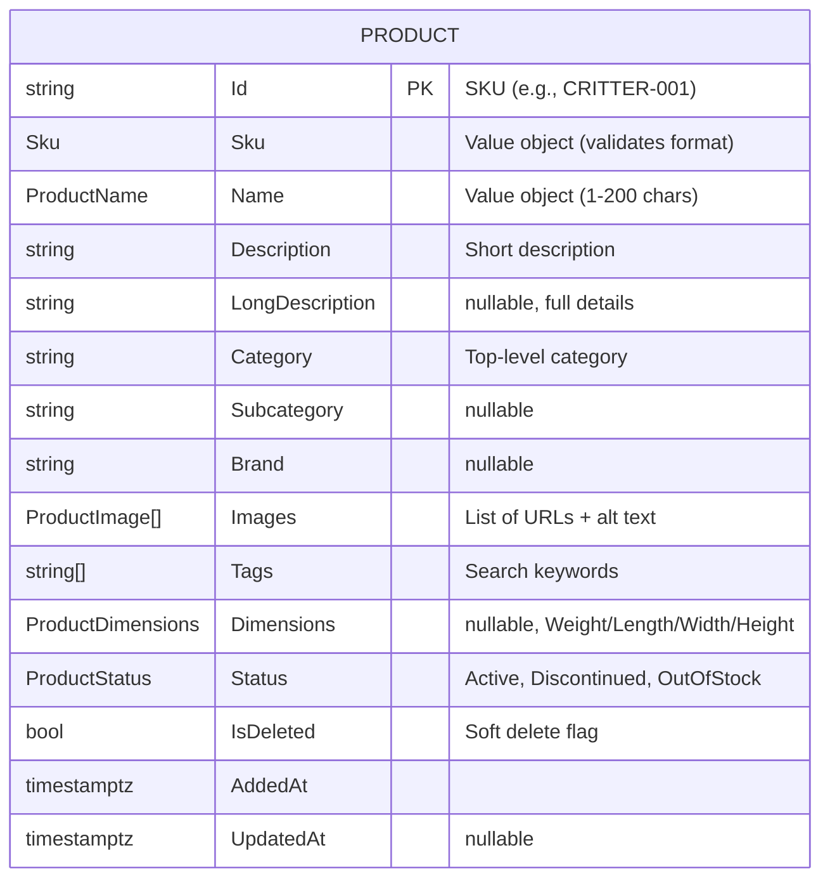
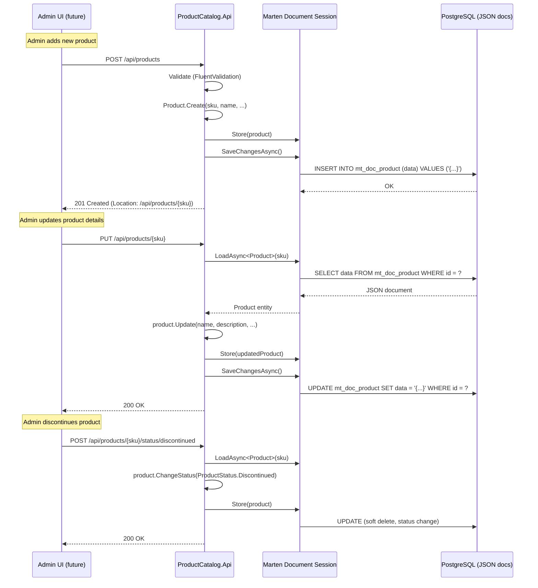

# Product Catalog BC - Workflow Documentation

**Bounded Context:** Product Catalog (Catalog Management)  
**Pattern:** CRUD Operations + Marten Document Store  
**Database:** Marten (PostgreSQL document store, NOT event sourced)  
**RabbitMQ:** ❌ Not configured (no integration events published)

---

## Overview

Product Catalog BC owns the master product data—SKU, name, description, images, pricing, categories, and status. Unlike Orders/Inventory/Payments, it uses **Marten as a document store** (not event sourced) for schema flexibility and rich querying. Products are stored as JSON documents in PostgreSQL with GIN indexes for fast full-text search.

**Key Aggregate:**
- **Product** - Document model representing catalog item

**Integration Pattern:** None (currently isolated; future: publish `ProductUpdated`, `ProductDiscontinued` for Inventory/Shopping to react)

**Design Decision:** Document store chosen over EF Core for schema flexibility (product attributes vary widely by category)

---

## 1. Product Document Model

### Schema Design



### State Model (Marten Document)

```csharp
// Simplified for documentation
public sealed record Product
{
    public string Id { get; init; }                     // SKU (Marten document ID)
    public Sku Sku { get; init; }                       // Value object (validates format)
    public ProductName Name { get; init; }              // Value object (1-200 chars)
    public string Description { get; init; }
    public string? LongDescription { get; init; }
    public string Category { get; init; }               // Simple string for Phase 1
    public string? Subcategory { get; init; }
    public string? Brand { get; init; }
    public IReadOnlyList<ProductImage> Images { get; init; } = [];
    public IReadOnlyList<string> Tags { get; init; } = [];
    public ProductDimensions? Dimensions { get; init; }
    public ProductStatus Status { get; init; }          // Active, Discontinued, OutOfStock
    public bool IsDeleted { get; init; }                // Soft delete
    public DateTimeOffset AddedAt { get; init; }
    public DateTimeOffset? UpdatedAt { get; init; }
    
    public bool IsTerminal => Status == ProductStatus.Discontinued || IsDeleted;
    
    // Factory method (immutability)
    public static Product Create(string sku, string name, string description, string category, ...)
    {
        return new Product
        {
            Id = Sku.From(sku), // Implicit conversion to string
            Sku = Sku.From(sku),
            Name = ProductName.From(name),
            Description = description,
            Category = category,
            Status = ProductStatus.Active,
            AddedAt = DateTimeOffset.UtcNow
        };
    }
    
    // Update method (returns new record with changes)
    public Product Update(string? name = null, string? description = null, ...)
    {
        return this with
        {
            Name = name is not null ? ProductName.From(name) : Name,
            Description = description ?? Description,
            UpdatedAt = DateTimeOffset.UtcNow
        };
    }
}
```

### Value Objects

| Value Object | Purpose | Validation Rules |
|--------------|---------|------------------|
| `Sku` | Product identifier | Format: `[A-Z0-9-]{3,20}`, immutable |
| `ProductName` | Display name | Length: 1-200 chars, no leading/trailing whitespace |
| `ProductImage` | Image URL + alt text | Valid URL, alt text 1-100 chars |
| `ProductDimensions` | Weight + size | Weight > 0, dimensions > 0 |

---

## 2. CRUD Operations

### Product Lifecycle



### Commands & Handlers

| Command | HTTP Endpoint | Validation | Database Operation |
|---------|---------------|------------|--------------------|
| `AddProduct` | `POST /api/products` | ✅ SKU unique<br/>✅ Valid name/description<br/>✅ Category non-empty | `session.Store(product)` |
| `GetProduct` | `GET /api/products/{sku}` | None | `session.LoadAsync<Product>(sku)` |
| `UpdateProduct` | `PUT /api/products/{sku}` | ✅ Product exists<br/>✅ Not discontinued | `session.Store(product.Update(...))` |
| `ChangeProductStatus` | `POST /api/products/{sku}/status/{newStatus}` | ✅ Valid status transition | `session.Store(product.ChangeStatus(...))` |
| `ListProducts` | `GET /api/products?category=...&search=...` | None | `session.Query<Product>().Where(...)` |
| `SoftDeleteProduct` | `DELETE /api/products/{sku}` | ✅ Not already deleted | `session.Store(product.SoftDelete())` |

---

## 3. Query Patterns

### Filtering & Pagination

```csharp
[WolverineGet("/api/products")]
public static async Task<IReadOnlyList<Product>> ListProducts(
    [FromQuery] string? category,
    [FromQuery] string? search,
    [FromQuery] int page = 1,
    [FromQuery] int pageSize = 20,
    IDocumentSession session,
    CancellationToken ct)
{
    var query = session.Query<Product>()
        .Where(p => !p.IsDeleted && p.Status == ProductStatus.Active);
    
    // Filter by category
    if (!string.IsNullOrWhiteSpace(category))
        query = query.Where(p => p.Category == category);
    
    // Full-text search (Marten uses PostgreSQL tsvector)
    if (!string.IsNullOrWhiteSpace(search))
        query = query.Where(p => 
            p.Name.Value.Contains(search, StringComparison.OrdinalIgnoreCase) ||
            p.Description.Contains(search, StringComparison.OrdinalIgnoreCase) ||
            p.Tags.Any(tag => tag.Contains(search, StringComparison.OrdinalIgnoreCase)));
    
    // Pagination
    return await query
        .OrderBy(p => p.Name.Value)
        .Skip((page - 1) * pageSize)
        .Take(pageSize)
        .ToListAsync(ct);
}
```

### Marten Indexing Configuration

```csharp
public static class ProductStoreConfiguration
{
    public static void Configure(StoreOptions options)
    {
        // Use SKU as document ID (string)
        options.Schema.For<Product>()
            .Identity(x => x.Id);
        
        // GIN index for full-text search on Name, Description, Tags
        options.Schema.For<Product>()
            .GinIndexJsonData();
        
        // Index on Category for fast filtering
        options.Schema.For<Product>()
            .Index(x => x.Category);
        
        // Index on Status + IsDeleted for active product queries
        options.Schema.For<Product>()
            .Index(x => x.Status)
            .Index(x => x.IsDeleted);
        
        // Soft delete filter (exclude IsDeleted = true by default)
        options.Schema.For<Product>()
            .SoftDeleted();
    }
}
```

---

## 4. Current Implementation Status

| Feature | Status | Notes |
|---------|--------|-------|
| **Product CRUD** | ✅ Complete | Add, Get, Update, Delete (soft) endpoints |
| **Status management** | ✅ Complete | Active, Discontinued, OutOfStock |
| **List with filtering** | ✅ Complete | Category filter, full-text search, pagination |
| **Marten document store** | ✅ Complete | JSON storage, GIN indexes configured |
| **Soft delete** | ✅ Complete | `IsDeleted` flag, queries exclude deleted |
| **Value objects** | ✅ Complete | Sku, ProductName with validation |
| **Image management** | ⚠️ Partial | URLs stored, no upload service |
| **Category hierarchy** | ❌ Missing | Simple string, no subcategory logic |
| **Pricing integration** | ❌ Missing | No price stored (future: Pricing BC) |
| **Inventory integration** | ❌ Missing | No stock levels (separate Inventory BC) |
| **RabbitMQ** | ❌ Missing | No integration events published |

---

## 5. What's Missing (Engineering Gaps)

### Critical Gaps (P0)

1. **❌ Image Upload Service**
   - **Problem:** Image URLs manually entered (no upload endpoint)
   - **Impact:** Admin cannot upload images (must host externally)
   - **Fix:** Add image upload endpoint + S3/Azure Blob storage (Cycle 20)
   - **Priority:** 🟡 **High** - Core admin functionality

2. **❌ Pricing Integration**
   - **Problem:** No price stored in Product document (where should it live?)
   - **Impact:** Shopping/Orders must query separate Pricing BC (adds latency)
   - **Fix:** Decide: embed price in Product (duplicated) or separate Pricing BC (normalized)
   - **Priority:** 🟡 **High** - Architectural decision needed

3. **❌ SKU Uniqueness Enforcement**
   - **Problem:** Duplicate SKU detection relies on database constraint (throws exception)
   - **Impact:** Poor UX (generic 500 error instead of "SKU already exists")
   - **Fix:** Pre-check in `Before()` handler (Cycle 19)
   - **Priority:** 🟢 **Medium** - UX improvement

### High Priority Gaps (P1)

4. **❌ Category Management**
   - **Problem:** Categories are simple strings (no hierarchy or metadata)
   - **Impact:** Cannot support "Cats > Food > Dry Food" drill-down
   - **Fix:** Add `Category` aggregate with parent/child relationships (Cycle 21)
   - **Priority:** 🟡 **Medium** - Feature enhancement

5. **❌ Product Variants**
   - **Problem:** No support for variants (size, color, flavor)
   - **Impact:** Must create separate SKUs for "Dog Food 5lb" vs "Dog Food 10lb"
   - **Fix:** Add variant support (parent product + variant SKUs) (Cycle 22)
   - **Priority:** 🟡 **Medium** - Domain correctness

6. **❌ Integration Events**
   - **Problem:** No RabbitMQ events published (ProductAdded, ProductUpdated, ProductDiscontinued)
   - **Impact:** Inventory BC doesn't know when products discontinued (orphaned inventory)
   - **Fix:** Add Wolverine message publishing (Cycle 20)
   - **Priority:** 🟡 **Medium** - Integration needs

### Medium Priority Gaps (P2)

7. **❌ Product Search (Advanced)**
   - **Problem:** Basic full-text search (no relevance ranking, no facets)
   - **Impact:** Hard to find products (no "Filter by brand", "Sort by popularity")
   - **Fix:** Integrate Elasticsearch or use Marten's full-text features (Cycle 23)
   - **Priority:** 🟢 **Medium** - UX improvement

8. **❌ Product Reviews / Ratings**
   - **Problem:** No customer reviews or ratings stored
   - **Impact:** Cannot show "4.5 stars (123 reviews)"
   - **Fix:** Add Reviews subdomain (separate aggregate) (Cycle 24+)
   - **Priority:** 🟢 **Low** - Feature enhancement

9. **❌ Inventory Levels in Catalog**
   - **Problem:** Product document doesn't show stock availability
   - **Impact:** Customer sees "Add to Cart" but item is out of stock
   - **Fix:** Embed stock level (query from Inventory BC) or real-time check (Cycle 21)
   - **Priority:** 🟢 **Medium** - UX improvement

10. **❌ Product History / Audit Trail**
    - **Problem:** Updating product overwrites old data (cannot see price history)
    - **Impact:** Cannot answer "What was the price on Black Friday?"
    - **Fix:** Add event sourcing or separate `ProductHistory` table (Cycle 23)
    - **Priority:** 🟢 **Low** - Analytics feature

---

## 6. Business Questions for Product Owner

### Critical Decisions Needed

1. **Pricing Storage Strategy:**
   - Q: Where should product pricing live?
   - Options:
     - A) Embed in Product document (fast queries, data duplication)
     - B) Separate Pricing BC (normalized, slower queries)
     - C) Hybrid (cache price in Product, Pricing BC as source of truth)
   - Current: No pricing stored
   - Impact: Affects query performance and data consistency

2. **Product Variants:**
   - Q: How do we model product variations (size, color, flavor)?
   - Options:
     - A) Separate SKUs (simple, no variant logic needed)
     - B) Parent-child relationship (complex, better UX)
   - Example: "Dog Food" (parent) → "Dog Food 5lb", "Dog Food 10lb" (children)
   - Current: Not supported
   - Impact: Affects catalog structure and SKU proliferation

3. **Category Hierarchy:**
   - Q: Do we need multi-level categories (Pets > Dogs > Food > Dry Food)?
   - Options:
     - A) Flat categories (simple string, current)
     - B) 2-level hierarchy (Category + Subcategory)
     - C) Unlimited hierarchy (tree structure)
   - Current: Simple string
   - Impact: Affects navigation UX and query complexity

4. **Image Management:**
   - Q: Where should product images be hosted?
   - Options:
     - A) CDN (Cloudflare, Cloudinary) - fast, expensive
     - B) S3/Azure Blob - cheap, slower
     - C) Self-hosted - full control, maintenance burden
   - Current: External URLs (no upload service)
   - Impact: Affects page load speed and storage costs

### Non-Critical (Future Cycles)

5. **Product Recommendations:**
   - Q: Should we show "Customers also bought..." recommendations?
   - Current: No recommendation engine
   - Impact: Requires analytics data + ML model (Cycle 25+)

6. **Product Bundles:**
   - Q: Can we sell bundles (e.g., "Dog Starter Kit" = Food + Bowl + Toy)?
   - Current: No bundle support
   - Impact: Requires special SKU type (bundle of child SKUs)

7. **Product Videos:**
   - Q: Should we support product videos (YouTube embeds, hosted videos)?
   - Current: Images only
   - Impact: Better product visualization (may increase conversion)

8. **Subscription Products:**
   - Q: Will we offer auto-ship subscriptions (e.g., monthly dog food delivery)?
   - Current: One-time purchases only
   - Impact: Requires separate Subscriptions BC (Cycle 26+)

---

## 7. Testing Coverage

### Current Tests (Integration Tests)

**Tests Exist:** ✅ Good (`tests/Product Catalog/ProductCatalog.Api.IntegrationTests`)

| Test Category | Coverage | Status |
|---------------|----------|--------|
| Add product (happy path) | ✅ | Pass |
| Add product (duplicate SKU) | ✅ | Pass (BDD feature) |
| Get product by SKU | ✅ | Pass |
| Update product | ✅ | Pass |
| Change product status | ✅ | Pass |
| List products with filters | ✅ | Pass |
| Soft delete product | ❌ | Not implemented |
| Full-text search | ❌ | Not implemented |
| Pagination edge cases | ❌ | Not implemented |

### BDD Tests (Reqnroll)

**Feature File:** `tests/Product Catalog/ProductCatalog.Api.IntegrationTests/AddProduct.feature`

```gherkin
Feature: Add Product
  As a catalog administrator
  I want to add new products to the catalog
  So that customers can browse and purchase them

  Background:
    Given the product catalog is empty

  Scenario: Successfully add a new product
    When I add a product with SKU "CRITTER-001"
    Then the product should be created
    And the product status should be "Active"

  Scenario: Cannot add product with duplicate SKU
    Given a product exists with SKU "CRITTER-001"
    When I add a product with SKU "CRITTER-001"
    Then I should receive a "Conflict" error
```

### What's NOT Tested

- ❌ **Soft delete** - IsDeleted flag behavior
- ❌ **Full-text search** - Marten GIN index queries
- ❌ **Category filtering** - Edge cases (null, empty, special chars)
- ❌ **Value object validation** - Sku, ProductName boundary cases
- ❌ **Concurrent updates** - Race conditions (two admins editing same product)
- ❌ **Image URL validation** - Malformed URLs

### Recommended Tests (Cycle 20)

```csharp
[Fact]
public async Task soft_deleted_products_excluded_from_list_queries()
{
    // Arrange: Add product and soft delete it
    await AddProduct("CRITTER-001", "Dog Food", "Premium dog food");
    await SoftDeleteProduct("CRITTER-001");
    
    // Act: List products
    var products = await ListProducts();
    
    // Assert: Deleted product not in results
    products.ShouldNotContain(p => p.Sku.Value == "CRITTER-001");
}

[Fact]
public async Task full_text_search_matches_name_description_tags()
{
    // Arrange: Add products with different keywords
    await AddProduct("CRITTER-001", "Organic Dog Food", "Grain-free", tags: ["organic", "dog"]);
    await AddProduct("CRITTER-002", "Cat Treats", "Chicken flavor", tags: ["cat", "treats"]);
    
    // Act: Search for "organic"
    var results = await ListProducts(search: "organic");
    
    // Assert: Only dog food returned
    results.Count.ShouldBe(1);
    results[0].Sku.Value.ShouldBe("CRITTER-001");
}

[Fact]
public async Task cannot_update_discontinued_product()
{
    // Arrange: Add product and discontinue it
    await AddProduct("CRITTER-001", "Dog Food", "Premium dog food");
    await ChangeProductStatus("CRITTER-001", ProductStatus.Discontinued);
    
    // Act: Attempt update
    var result = await UpdateProduct("CRITTER-001", name: "New Name");
    
    // Assert: Update rejected
    result.StatusCode.ShouldBe(400);
    result.Error.ShouldContain("Cannot update discontinued product");
}

[Fact]
public async Task concurrent_updates_to_same_product_handled_correctly()
{
    // Arrange: Add product
    await AddProduct("CRITTER-001", "Dog Food", "Premium dog food");
    
    // Act: Two admins update same product simultaneously
    var task1 = UpdateProduct("CRITTER-001", name: "Name 1");
    var task2 = UpdateProduct("CRITTER-001", name: "Name 2");
    await Task.WhenAll(task1, task2);
    
    // Assert: Last writer wins (Marten uses optimistic concurrency)
    var product = await GetProduct("CRITTER-001");
    product.Name.Value.ShouldBeOneOf("Name 1", "Name 2");
}
```

---

## 8. Next Steps (Engineering Roadmap)

### Cycle 19: Core Improvements
- [ ] **SKU uniqueness check** - Pre-validation in Before() handler
- [ ] Soft delete integration tests
- [ ] Concurrent update tests (Marten optimistic concurrency)
- [ ] Value object boundary tests

### Cycle 20: Image Management
- [ ] **Image upload endpoint** - POST /api/products/{sku}/images
- [ ] S3/Azure Blob storage integration
- [ ] Image resizing (thumbnails, product detail, zoom)
- [ ] CDN configuration (Cloudflare)
- [ ] **Integration events** - Publish ProductAdded, ProductUpdated

### Cycle 21: Category Management
- [ ] **Category aggregate** - Parent/child relationships
- [ ] Category CRUD endpoints
- [ ] Category filter UI (drill-down navigation)
- [ ] Product-category many-to-many (products in multiple categories)
- [ ] **Inventory integration** - Show stock availability in catalog

### Cycle 22: Product Variants
- [ ] **Variant support** - Parent product + variant SKUs
- [ ] Variant attributes (size, color, flavor)
- [ ] Variant selection UI
- [ ] Pricing per variant

### Cycle 23: Advanced Search
- [ ] **Elasticsearch integration** - Better search relevance
- [ ] Faceted search (filter by brand, category, price range)
- [ ] Search suggestions (autocomplete)
- [ ] "Did you mean..." spelling corrections

### Cycle 24: Reviews & Ratings
- [ ] Reviews subdomain (separate aggregate)
- [ ] Star ratings (average + count)
- [ ] Review moderation (approve/reject)
- [ ] "Verified Purchase" badge

---

**Document Owner:** Principal Architect  
**Last Updated:** 2026-02-17  
**Status:** ✅ Ready for Product Owner Review
