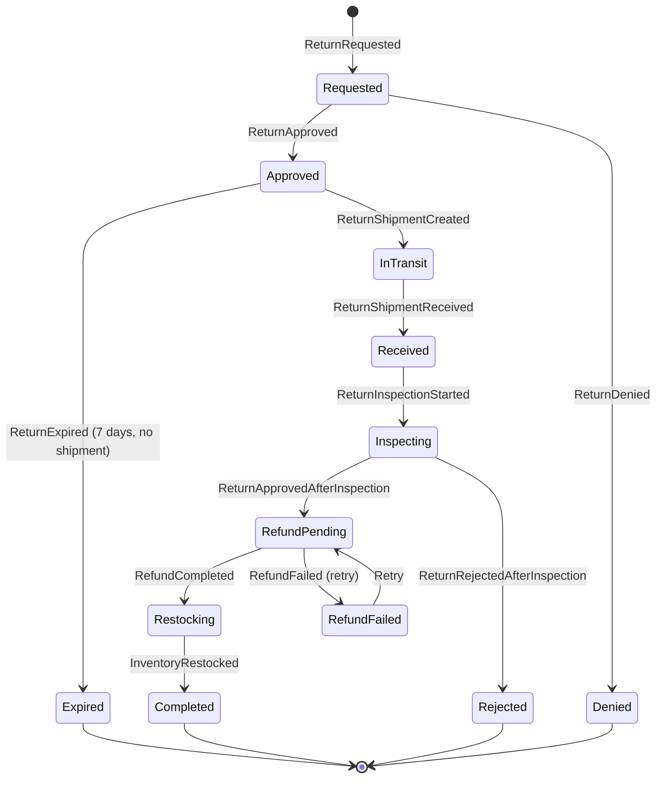

# Returns BC Workflows

**Bounded Context:** Returns  
**Implementation Status:** 🚧 Planned (Not Yet Implemented)  
**Priority:** Medium (Cycle 21+)  
**Estimated Effort:** 3-5 sessions  

---

## Overview

The Returns BC manages the complete return lifecycle from customer request through refund processing and inventory restocking. It orchestrates cross-BC interactions with Orders (return eligibility), Payments (refunds), Inventory (restocking), and Fulfillment (return shipment tracking).

### Key Business Rules (From 10+ Years E-Commerce Experience)

1. **Return Window:** 30 days from delivery date (configurable)
2. **Return Reasons:** Defective, wrong item, unwanted, damaged in transit
3. **Restocking Fees:** 15% for non-defective returns (configurable, may waive for loyalty)
4. **Non-Returnable Items:** Personalized products, opened consumables, final sale items
5. **Return Shipping:** Customer pays unless defective/wrong item (then merchant pays)
6. **Refund Timeline:** 5-7 business days after return inspection approval
7. **Partial Returns:** Support returning some (not all) line items from an order

---

## Aggregate: Return Request

### Aggregate Lifecycle

```
[NotExist] --Create--> [Requested] --Approve--> [Approved] --ShipmentReceived--> [Inspecting] --Approve--> [Completed]
                                  \--Deny--> [Denied]                          \--Reject--> [Rejected]
                                  
[Approved] --Timeout(7 days)--> [Expired]
```

### Domain Events

**Initialization:**
- `ReturnRequested` — Customer submits return request
  - ReturnId (Guid)
  - OrderId (Guid) — Original order reference
  - CustomerId (Guid)
  - LineItems (List<ReturnLineItem>) — Which items to return
    - OrderLineItemId (Guid)
    - Sku (string)
    - Quantity (int)
    - ReturnReason (enum: Defective, WrongItem, Unwanted, DamagedInTransit, Other)
    - ReturnReasonDetails (string) — Customer explanation
  - RequestedAt (DateTimeOffset)
  - ReturnWindowExpiresAt (DateTimeOffset) — Calculated from order delivery date

**Authorization Phase:**
- `ReturnApproved` — Customer service approves return
  - ReturnId
  - ApprovedBy (string) — Customer service agent ID or "System" for auto-approval
  - ApprovedAt (DateTimeOffset)
  - ReturnShippingLabel (ReturnShippingLabel) — RMA number, tracking URL, prepaid label URL (if merchant pays)
  - ExpectedRefundAmount (Money) — Calculated refund (may include restocking fee deduction)
  - RestockingFeeApplied (bool)
  - RestockingFeeAmount (Money, nullable)
  - MerchantPaysShipping (bool) — True if defective/wrong item

- `ReturnDenied` — Return request rejected
  - ReturnId
  - DenialReason (enum: OutsideReturnWindow, NonReturnableItem, PolicyViolation, Other)
  - DenialReasonDetails (string)
  - DeniedBy (string)
  - DeniedAt (DateTimeOffset)

**Return Shipment Tracking:**
- `ReturnShipmentCreated` — Customer prints label and ships item
  - ReturnId
  - TrackingNumber (string)
  - Carrier (string) — USPS, UPS, FedEx
  - ShippedAt (DateTimeOffset, nullable) — When customer drops off package

- `ReturnShipmentInTransit` — Carrier scans package
  - ReturnId
  - TrackingNumber
  - LastScanLocation (string)
  - EstimatedArrival (DateTimeOffset)

- `ReturnShipmentReceived` — Package arrives at warehouse
  - ReturnId
  - ReceivedAt (DateTimeOffset)
  - ReceivedByWarehouse (string) — Warehouse ID

**Inspection Phase:**
- `ReturnInspectionStarted` — Warehouse begins inspection
  - ReturnId
  - InspectorId (string)
  - StartedAt (DateTimeOffset)

- `ReturnInspectionCompleted` — Inspection finished, items evaluated
  - ReturnId
  - InspectorId
  - CompletedAt (DateTimeOffset)
  - LineItemInspectionResults (List<LineItemInspectionResult>)
    - OrderLineItemId
    - Condition (enum: AsExpected, BetterThanExpected, WorseThanExpected, NotReceived)
    - ConditionNotes (string)
    - Restockable (bool)
    - RestockingLocation (string, nullable) — Warehouse bin location

- `ReturnApprovedAfterInspection` — Items in acceptable condition, refund authorized
  - ReturnId
  - FinalRefundAmount (Money) — May differ from initial estimate if condition worse than expected
  - RestockingDetails (List<RestockingDetail>)
    - Sku
    - Quantity
    - WarehouseLocation

- `ReturnRejectedAfterInspection` — Items not in acceptable condition
  - ReturnId
  - RejectionReason (enum: DamagedByCustomer, NotAsDescribed, UsedBeyondReturn, Other)
  - RejectionDetails (string)
  - CustomerNotified (bool)
  - OfferStoreCredit (bool) — Goodwill gesture
  - StoreCreditAmount (Money, nullable)

**Refund Processing:**
- `RefundInitiated` — Refund payment triggered (integration with Payments BC)
  - ReturnId
  - RefundAmount (Money)
  - RefundMethod (enum: OriginalPaymentMethod, StoreCredit, GiftCard)
  - RefundInitiatedAt (DateTimeOffset)

- `RefundCompleted` — Refund successfully processed (received from Payments BC)
  - ReturnId
  - RefundTransactionId (Guid) — Payments BC refund ID
  - RefundCompletedAt (DateTimeOffset)

- `RefundFailed` — Refund failed (received from Payments BC)
  - ReturnId
  - FailureReason (string)
  - RetryScheduled (bool)

**Restocking:**
- `InventoryRestocked` — Items returned to available inventory (integration with Inventory BC)
  - ReturnId
  - LineItems (List<RestockedLineItem>)
    - Sku
    - Quantity
    - WarehouseLocation
  - RestockedAt (DateTimeOffset)

**Terminal States:**
- `ReturnCompleted` — Full return lifecycle finished
  - ReturnId
  - CompletedAt (DateTimeOffset)
  - FinalRefundAmount (Money)
  - ItemsRestocked (bool)

- `ReturnExpired` — Customer never shipped return within window (7 days typical)
  - ReturnId
  - ExpiredAt (DateTimeOffset)
  - Reason (string)

---

## Workflows

### Workflow 1: Happy Path - Return Request to Refund

**Scenario:** Customer receives defective dog bowl, requests return, warehouse approves, refund issued

```
1. Customer Action: Submit Return Request
   Command: RequestReturn
     - OrderId: "order-abc-123"
     - LineItems: [{ OrderLineItemId: "line-456", Sku: "DOG-BOWL-01", Quantity: 1, ReturnReason: Defective }]
   Event: ReturnRequested

2. System: Validate Return Eligibility
   - Query Orders BC: Is order delivered? Within 30-day window?
   - Query Order Line Items: Are items eligible for return (not final sale)?
   - If valid → Auto-approve or queue for manual review

3. Customer Service (or System): Approve Return
   Command: ApproveReturn
     - ReturnId
     - MerchantPaysShipping: true (defective item)
   Event: ReturnApproved
   Integration: Generate prepaid return label via Fulfillment BC carrier integration

4. Customer: Ship Return Package
   Command: RecordReturnShipment
     - ReturnId
     - TrackingNumber: "1Z999AA10123456784"
   Event: ReturnShipmentCreated

5. Carrier: Package Scanned
   Integration: Carrier webhook → Fulfillment BC → Returns BC
   Event: ReturnShipmentInTransit

6. Warehouse: Receive Return Package
   Command: ReceiveReturnShipment
     - ReturnId
   Event: ReturnShipmentReceived

7. Warehouse: Inspect Items
   Command: StartReturnInspection
     - ReturnId
   Event: ReturnInspectionStarted

   Command: CompleteReturnInspection
     - ReturnId
     - LineItemInspectionResults: [{ Condition: AsExpected, Restockable: true }]
   Event: ReturnInspectionCompleted
   Event: ReturnApprovedAfterInspection

8. System: Initiate Refund
   Command: InitiateRefund (to Payments BC)
     - ReturnId
     - RefundAmount: $19.99
     - OriginalPaymentTransactionId
   Event: RefundInitiated
   Integration: Payments.RefundRequested → Payments BC

9. Payments BC: Process Refund
   Event: Payments.RefundCompleted (integration message)
   Handler: Handle RefundCompleted
   Event: RefundCompleted

10. System: Restock Inventory
    Command: RestockInventory (to Inventory BC)
      - Sku: "DOG-BOWL-01"
      - Quantity: 1
      - WarehouseLocation: "A-12-3"
    Event: InventoryRestocked
    Integration: Inventory.InventoryRestocked → Inventory BC

11. System: Complete Return
    Event: ReturnCompleted

TOTAL DURATION: 7-10 days (3 days shipping + 1-2 days inspection + 5-7 days refund processing)
```

---

### Workflow 2: Edge Case - Restocking Fee Applied (Unwanted Item)

**Scenario:** Customer changes mind about cat toy, return approved but 15% restocking fee applied

```
1. Customer: Submit Return Request
   Command: RequestReturn
     - OrderId: "order-xyz-789"
     - LineItems: [{ Sku: "CAT-TOY-05", Quantity: 1, ReturnReason: Unwanted }]
   Event: ReturnRequested

2. System: Auto-Approve with Restocking Fee
   Command: ApproveReturn
     - RestockingFeeApplied: true
     - RestockingFeeAmount: $4.50 (15% of $29.99)
     - ExpectedRefundAmount: $25.49 ($29.99 - $4.50)
     - MerchantPaysShipping: false (customer pays return shipping)
   Event: ReturnApproved

3-7. [Same as Happy Path: Customer ships, warehouse receives/inspects]

8. System: Issue Partial Refund
   Command: InitiateRefund
     - RefundAmount: $25.49 (restocking fee deducted)
   Event: RefundInitiated
   Integration: Payments.RefundRequested

9. Payments BC: Process Partial Refund
   Event: Payments.RefundCompleted
   Event: RefundCompleted

10. System: Restock Inventory
    Event: InventoryRestocked

11. System: Complete Return
    Event: ReturnCompleted

CUSTOMER IMPACT: Pays $4.50 restocking fee + return shipping cost (~$7-$10)
```

---

### Workflow 3: Edge Case - Return Denied (Outside Return Window)

**Scenario:** Customer attempts return 45 days after delivery (policy: 30 days)

```
1. Customer: Submit Return Request
   Command: RequestReturn
     - OrderId: "order-old-456"
     - LineItems: [{ Sku: "DOG-FOOD-01", Quantity: 1, ReturnReason: Unwanted }]
   Event: ReturnRequested

2. System: Validate Return Eligibility
   - Query Orders BC: Order delivered 45 days ago
   - ReturnWindowExpiresAt: 30 days from delivery
   - VALIDATION FAILURE: Outside return window

3. System: Deny Return Automatically
   Command: DenyReturn
     - DenialReason: OutsideReturnWindow
     - DenialReasonDetails: "Order was delivered more than 30 days ago (45 days). Our return policy allows returns within 30 days of delivery."
   Event: ReturnDenied

4. System: Notify Customer
   Integration: Send email via Notifications BC
   - Subject: "Return Request Denied - Order #order-old-456"
   - Body: [Polite explanation + offer to contact customer service for exceptions]

CUSTOMER IMPACT: No refund, but may contact customer service for exception (store credit at manager's discretion)
```

---

### Workflow 4: Edge Case - Return Rejected After Inspection (Damaged by Customer)

**Scenario:** Customer returns item but inspection reveals customer-caused damage

```
1-7. [Same as Happy Path: Request → Approve → Ship → Receive → Inspect]

8. Warehouse: Inspection Reveals Customer Damage
   Command: CompleteReturnInspection
     - LineItemInspectionResults: [{ Condition: WorseThanExpected, ConditionNotes: "Screen cracked, water damage visible", Restockable: false }]
   Event: ReturnInspectionCompleted
   Event: ReturnRejectedAfterInspection
     - RejectionReason: DamagedByCustomer
     - OfferStoreCredit: true (goodwill gesture)
     - StoreCreditAmount: $15.00 (50% of product value)

9. System: Notify Customer
   Integration: Email with photos of damage
   - Offer: $15 store credit as goodwill (customer can accept or dispute)

10a. Customer Accepts Store Credit:
    Command: IssueStoreCredit
      - CustomerId
      - Amount: $15.00
    Event: StoreCreditIssued
    Event: ReturnCompleted (no inventory restocking)

10b. Customer Disputes:
    → Manual customer service escalation
    → Manager reviews photos + customer explanation
    → Final decision: Approve full refund (rare) or uphold rejection

CUSTOMER IMPACT: No full refund, but goodwill store credit offered
```

---

### Workflow 5: Edge Case - Partial Return (Multiple Items, Some Returned)

**Scenario:** Customer orders 3 items, returns 2 (keeps 1)

```
Original Order:
  - Line Item 1: DOG-BOWL-01 (Qty: 2, Total: $39.98)
  - Line Item 2: CAT-TOY-05 (Qty: 1, Total: $29.99)
  - Line Item 3: DOG-FOOD-01 (Qty: 1, Total: $49.99)
  Order Total: $119.96

1. Customer: Submit Partial Return Request
   Command: RequestReturn
     - OrderId: "order-partial-123"
     - LineItems: [
         { OrderLineItemId: "line-1", Sku: "DOG-BOWL-01", Quantity: 2, ReturnReason: Unwanted },
         { OrderLineItemId: "line-2", Sku: "CAT-TOY-05", Quantity: 1, ReturnReason: Defective }
       ]
   Event: ReturnRequested

2. System: Calculate Partial Refund
   - DOG-BOWL-01: $39.98 (15% restocking fee = $6.00) → Refund $33.98
   - CAT-TOY-05: $29.99 (no restocking fee, defective) → Refund $29.99
   - Expected Refund Total: $63.97

3. System: Approve Partial Return
   Command: ApproveReturn
     - ExpectedRefundAmount: $63.97
     - MerchantPaysShipping: true (one item defective)
   Event: ReturnApproved

4-10. [Same as Happy Path: Ship → Receive → Inspect → Refund → Restock]

11. System: Complete Partial Return
    Event: ReturnCompleted
    - Order Status: Remains "Delivered" (not fully returned)
    - Line Items NOT Returned: DOG-FOOD-01 (customer keeps this)

CUSTOMER IMPACT: Refunds for 2 of 3 items, keeps 1 item, order history shows partial return
```

---

### Workflow 6: Edge Case - Return Expired (Customer Never Shipped)

**Scenario:** Customer gets return approval but never ships package within 7-day window

```
1. Customer: Submit Return Request
   Event: ReturnRequested

2. System: Approve Return
   Command: ApproveReturn
     - ReturnShippingLabel.ExpiresAt: 7 days from approval
   Event: ReturnApproved

3. Customer: [NO ACTION] - Never ships package

4. System: Detect Expiration (Background Job)
   - Runs daily, checks for returns in "Approved" state past expiration
   - Found: ReturnId "return-expired-789" approved 8 days ago, no shipment created

5. System: Expire Return
   Command: ExpireReturn
     - ReturnId
   Event: ReturnExpired

6. System: Notify Customer
   Integration: Email notification
   - "Your return request has expired. If you still need to return this item, please submit a new request."

BUSINESS IMPACT: No inventory reservation (didn't hold stock for return), no refund processed
CUSTOMER IMPACT: Must submit new return request if still within 30-day window
```

---

## Integration Flows

### Returns BC Receives (Inbound Integration Messages)

| Integration Message | Published By | Handler | Outcome |
|---|---|---|---|
| `Orders.OrderPlaced` | Orders BC | Update order reference (for future return eligibility validation) | Store order metadata for return window calculation |
| `Fulfillment.ShipmentDelivered` | Fulfillment BC | Start return window clock (30 days from delivery) | Enable return requests for this order |
| `Payments.RefundCompleted` | Payments BC | Handle refund success | Transition return to "Completed" state |
| `Payments.RefundFailed` | Payments BC | Handle refund failure | Retry refund or escalate to manual review |
| `Inventory.InventoryRestocked` | Inventory BC | Confirm inventory returned to available stock | Update return status, log restocking confirmation |
| `Fulfillment.ReturnShipmentInTransit` | Fulfillment BC | Track return package in transit | Update return with tracking milestones |

---

### Returns BC Publishes (Outbound Integration Messages)

| Integration Message | Consumed By | Purpose |
|---|---|---|
| `Returns.ReturnRequested` | Customer Experience BC | Real-time UI update: "Return request submitted" |
| `Returns.ReturnApproved` | Customer Experience BC, Notifications BC | UI update + email customer with return label |
| `Returns.ReturnDenied` | Customer Experience BC, Notifications BC | UI update + email customer with denial reason |
| `Returns.RefundInitiated` | Payments BC | Trigger refund processing |
| `Returns.InventoryRestocked` | Inventory BC | Update available stock after return inspection |
| `Returns.ReturnCompleted` | Orders BC, Customer Experience BC | Update order history with return details, UI refresh |

---

## State Transition Diagram



---

## Business Events Summary

### Aggregate Events (Return Aggregate Stream)

1. `ReturnRequested` — Customer submits return
2. `ReturnApproved` — Authorization granted
3. `ReturnDenied` — Authorization denied
4. `ReturnShipmentCreated` — Customer ships package
5. `ReturnShipmentInTransit` — Carrier scans package
6. `ReturnShipmentReceived` — Warehouse receives package
7. `ReturnInspectionStarted` — Inspection begins
8. `ReturnInspectionCompleted` — Inspection finished
9. `ReturnApprovedAfterInspection` — Items acceptable
10. `ReturnRejectedAfterInspection` — Items not acceptable
11. `RefundInitiated` — Refund payment triggered
12. `RefundCompleted` — Refund processed successfully
13. `RefundFailed` — Refund failed (retry scheduled)
14. `InventoryRestocked` — Items returned to inventory
15. `ReturnCompleted` — Terminal state (success)
16. `ReturnExpired` — Terminal state (customer never shipped)

---

## Integration Messages

### Published by Returns BC

- `Returns.ReturnRequested`
- `Returns.ReturnApproved`
- `Returns.ReturnDenied`
- `Returns.RefundInitiated`
- `Returns.InventoryRestocked`
- `Returns.ReturnCompleted`

### Consumed by Returns BC

- `Orders.OrderPlaced`
- `Fulfillment.ShipmentDelivered`
- `Payments.RefundCompleted`
- `Payments.RefundFailed`
- `Inventory.InventoryRestocked`
- `Fulfillment.ReturnShipmentInTransit`

---

## Invariants (Business Rules)

1. **Return Window Enforcement:**
   - Cannot approve return > 30 days after delivery
   - Exception: Customer service can override with manager approval

2. **Non-Returnable Items:**
   - Personalized products cannot be returned
   - Opened consumables (food, supplements) cannot be returned
   - Final sale items cannot be returned

3. **Refund Amount Validation:**
   - Refund cannot exceed original purchase amount
   - Restocking fee (if applied) must be ≤ 15% of item value
   - Shipping costs not refunded unless merchant error

4. **Restocking Rules:**
   - Only items in "Restockable" condition return to inventory
   - Damaged items disposed (not restocked)
   - Restocking location must be valid warehouse bin

5. **Return Expiration:**
   - Approved returns expire if not shipped within 7 days
   - Expired returns require new request submission

---

## Implementation Guidance

### Aggregate Design

```csharp
public sealed record ReturnRequest
{
    public Guid Id { get; init; }
    public ReturnStatus Status { get; private set; }
    public Guid OrderId { get; init; }
    public Guid CustomerId { get; init; }
    public List<ReturnLineItem> LineItems { get; init; } = [];
    public DateTimeOffset RequestedAt { get; init; }
    public DateTimeOffset? ApprovedAt { get; private set; }
    public Money? ExpectedRefundAmount { get; private set; }
    public Money? FinalRefundAmount { get; private set; }
    
    // Factory method
    public static (ReturnRequest, ReturnRequested) Create(
        Guid orderId, 
        Guid customerId, 
        List<ReturnLineItem> lineItems)
    {
        var returnRequest = new ReturnRequest
        {
            Id = Guid.NewGuid(),
            Status = ReturnStatus.Requested,
            OrderId = orderId,
            CustomerId = customerId,
            LineItems = lineItems,
            RequestedAt = DateTimeOffset.UtcNow
        };
        
        var @event = new ReturnRequested(
            returnRequest.Id,
            orderId,
            customerId,
            lineItems,
            returnRequest.RequestedAt
        );
        
        return (returnRequest, @event);
    }
    
    // Apply methods for event sourcing
    public ReturnRequest Apply(ReturnApproved e)
    {
        return this with 
        { 
            Status = ReturnStatus.Approved,
            ApprovedAt = e.ApprovedAt,
            ExpectedRefundAmount = e.ExpectedRefundAmount
        };
    }
    
    public ReturnRequest Apply(ReturnDenied e)
    {
        return this with { Status = ReturnStatus.Denied };
    }
    
    // ... more Apply methods for each event
}

public enum ReturnStatus
{
    Requested,
    Approved,
    Denied,
    InTransit,
    Received,
    Inspecting,
    RefundPending,
    Restocking,
    Completed,
    Rejected,
    Expired
}
```

### Handler Pattern Example

```csharp
public sealed record ApproveReturn(
    Guid ReturnId,
    bool MerchantPaysShipping,
    bool RestockingFeeApplied,
    Money? RestockingFeeAmount
);

public static class ApproveReturnHandler
{
    public static (IStartStream, OutgoingMessages) Handle(
        ApproveReturn command,
        IOrdersClient ordersClient) // Query Orders BC for return eligibility
    {
        // Validate return eligibility
        var order = await ordersClient.GetOrderAsync(command.ReturnId);
        if (!order.IsEligibleForReturn())
            throw new InvalidOperationException("Order not eligible for return");
        
        // Calculate refund amount
        var refundAmount = CalculateRefundAmount(order, command.RestockingFeeApplied, command.RestockingFeeAmount);
        
        // Generate return shipping label
        var shippingLabel = GenerateReturnLabel(command.MerchantPaysShipping);
        
        var @event = new ReturnApproved(
            command.ReturnId,
            "System",
            DateTimeOffset.UtcNow,
            shippingLabel,
            refundAmount,
            command.RestockingFeeApplied,
            command.RestockingFeeAmount,
            command.MerchantPaysShipping
        );
        
        return (
            StreamAction.Start(command.ReturnId, @event),
            [new Returns.ReturnApproved(...)] // Integration message
        );
    }
}
```

---

## Testing Strategy

### Integration Tests (Alba + TestContainers)

1. **Happy Path Tests:**
   - Request return → Approve → Ship → Receive → Inspect → Refund → Restock → Complete
   - Verify all events persisted to Marten stream
   - Verify integration messages published to RabbitMQ

2. **Edge Case Tests:**
   - Return denied (outside window, non-returnable item)
   - Return rejected after inspection (damaged by customer)
   - Restocking fee applied (unwanted item)
   - Partial return (multiple items, some returned)
   - Return expired (customer never shipped)

3. **Integration Message Tests:**
   - Returns.ReturnApproved triggers email via Notifications BC
   - Returns.RefundInitiated triggers Payments BC refund
   - Returns.InventoryRestocked updates Inventory BC available stock

### BDD Feature Files

Location: `docs/features/returns/`

Recommended feature files:
- `return-request.feature` — Happy path + denial scenarios
- `return-inspection.feature` — Inspection approval/rejection
- `return-refund.feature` — Refund processing + failures
- `return-restocking.feature` — Inventory restocking flows

---

## Dependencies

**Must Be Implemented First:**
- ✅ Orders BC (for return eligibility validation)
- ✅ Payments BC (for refund processing)
- ✅ Inventory BC (for restocking)
- ✅ Fulfillment BC (for return shipment tracking)

**Nice to Have:**
- Notifications BC (for email notifications — can stub initially)
- Customer Experience BC (for real-time UI updates — can implement separately)

---

## Estimated Implementation Effort

**Cycle Breakdown:**

**Session 1-2:** Returns BC Foundation
- Aggregate design (ReturnRequest, events, Apply methods)
- Command handlers (RequestReturn, ApproveReturn, DenyReturn)
- Integration tests for happy path
- Marten event sourcing configuration

**Session 3:** Return Shipment & Inspection
- ShipmentTracking handlers (ReceiveReturnShipment, InspectReturn)
- Integration with Fulfillment BC for carrier updates
- Integration tests for inspection approval/rejection

**Session 4:** Refund & Restocking Integration
- Integration with Payments BC (RefundInitiated → RefundCompleted)
- Integration with Inventory BC (InventoryRestocked)
- Integration tests for cross-BC flows
- RabbitMQ integration message handlers

**Session 5:** Edge Cases & Polish
- Return expiration (background job)
- Partial return support
- Restocking fee calculation
- BDD feature files
- API endpoints (POST /api/returns, GET /api/returns/{id})

**Total Effort:** 3-5 sessions (6-10 hours)

---

## Success Criteria

- [ ] All 16 aggregate events implemented with Apply methods
- [ ] 6+ integration messages published (ReturnRequested, ReturnApproved, etc.)
- [ ] 6+ integration messages consumed (Orders.OrderPlaced, Payments.RefundCompleted, etc.)
- [ ] 15+ integration tests passing (happy path + 5 edge cases)
- [ ] State transition diagram validated with tests
- [ ] Cross-BC integration verified with TestContainers (RabbitMQ + Postgres)
- [ ] BDD feature files written for key workflows
- [ ] ADR created for orchestration vs choreography decision
- [ ] CONTEXTS.md updated with Returns BC integration contracts

---

**Document Owner:** Product Owner (Erik Shafer)  
**Last Updated:** 2026-02-18  
**Status:** 🟢 Ready for Implementation
