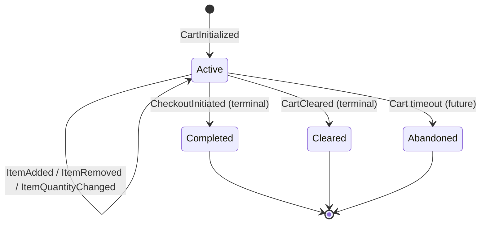
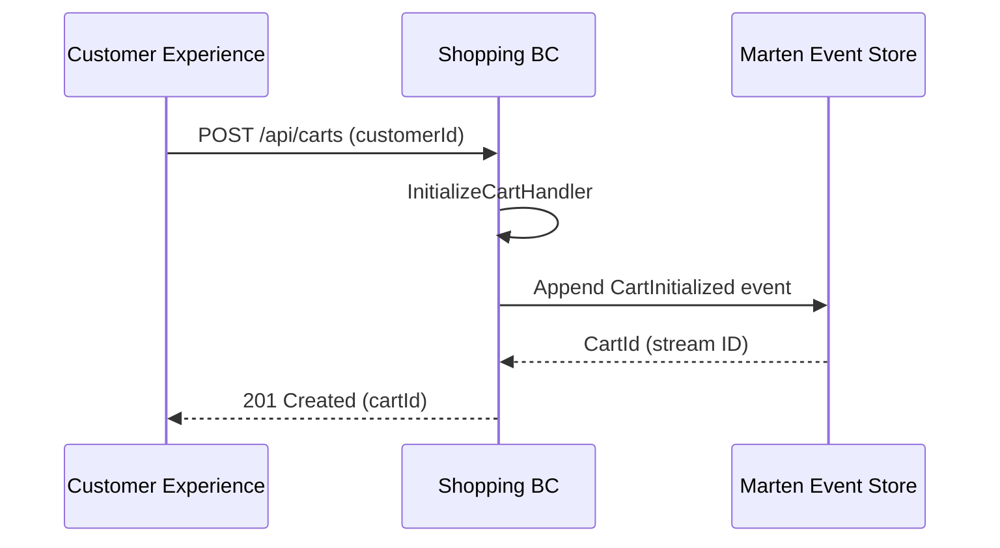
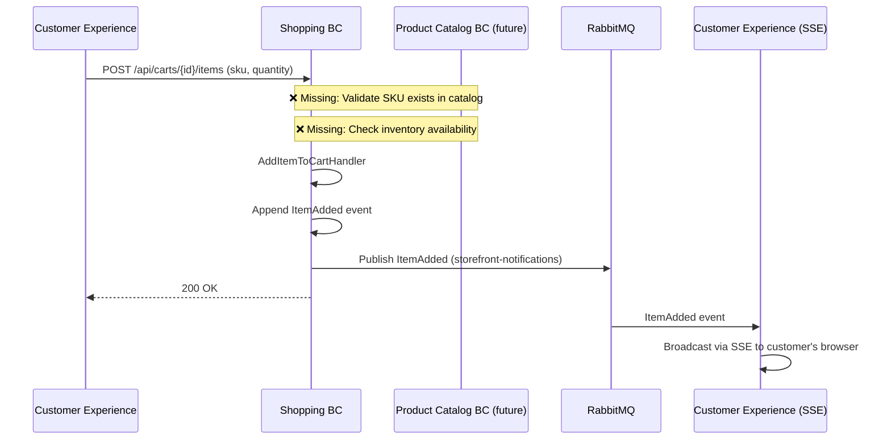
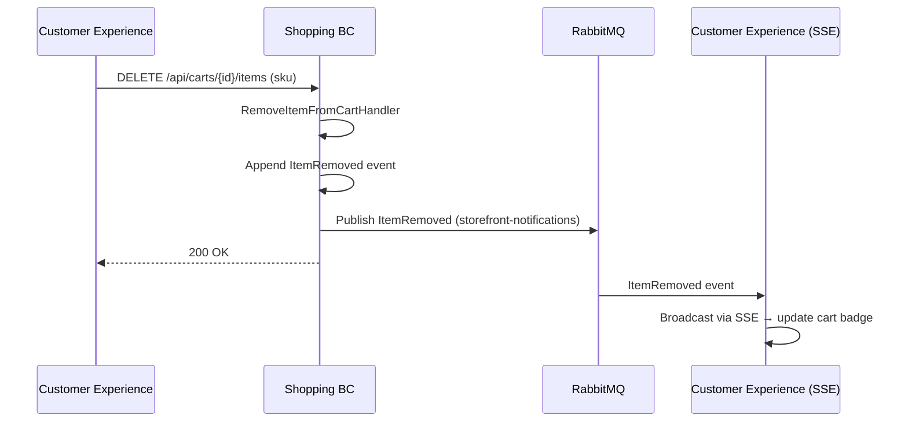
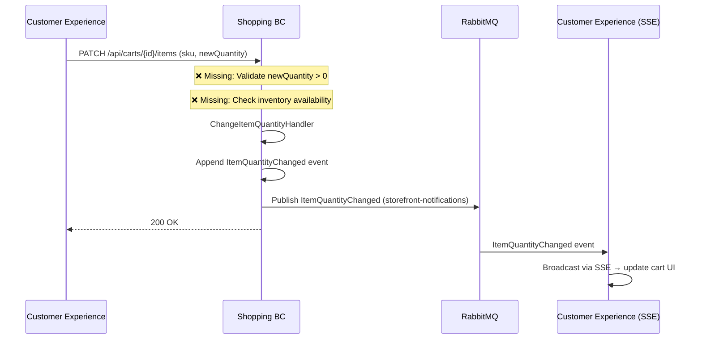
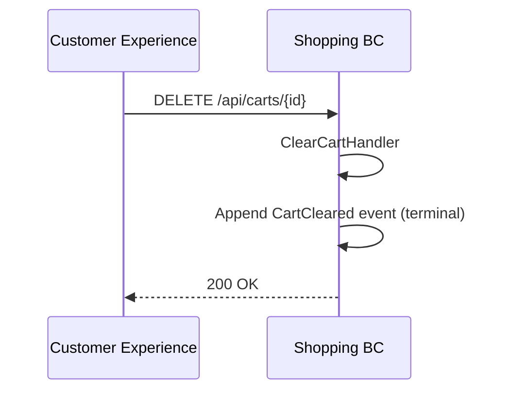
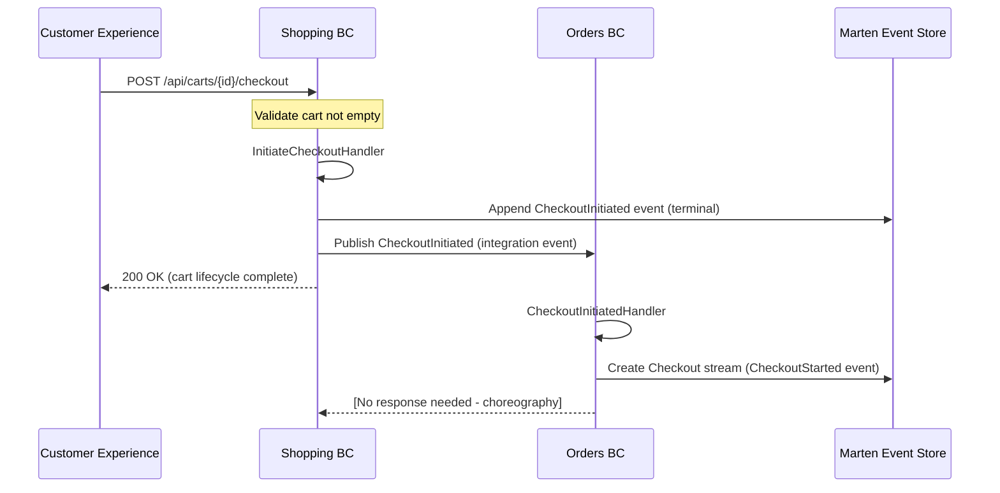
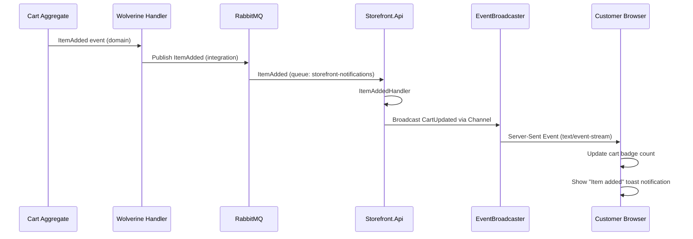

# Shopping BC - Workflow Documentation

**Bounded Context:** Shopping (Shopping Management)  
**Pattern:** Event Sourcing (Cart aggregate)  
**Database:** Marten (PostgreSQL event store)  
**RabbitMQ:** ✅ Publishes `ItemAdded`, `ItemRemoved`, `ItemQuantityChanged` to `storefront-notifications`

---

## Overview

Shopping BC owns the customer's pre-purchase experience—managing the cart lifecycle from initialization to checkout handoff. This is the exploratory phase of shopping before the customer commits to purchase. Checkout was migrated to Orders BC in Cycle 8 to establish clearer bounded context boundaries.

**Key Aggregate:**
- **Cart** - Customer's shopping session (event-sourced stream)

---

## 1. Cart Lifecycle Workflow

### Happy Path: Full Cart Journey



### State Transitions

| State | Description | Terminal? | Next States |
|-------|-------------|-----------|-------------|
| `Active` | Cart open, items can be added/removed | No | Completed, Cleared, Abandoned |
| `Completed` | Checkout initiated, cart handed to Orders BC | **Yes** | N/A |
| `Cleared` | Customer explicitly emptied cart | **Yes** | N/A |
| `Abandoned` | Anonymous cart expired (not implemented) | **Yes** | N/A |

---

## 2. Cart Operations

### Initialize Cart



**Event:**
```csharp
public sealed record CartInitialized(
    Guid CartId,
    Guid CustomerId,
    DateTimeOffset InitializedAt
);
```

**Current Implementation:** ✅ Complete

---

### Add Item to Cart



**Event:**
```csharp
public sealed record ItemAdded(
    Guid CartId,
    string Sku,
    int Quantity,
    decimal UnitPrice, // Price at add-time (allows price drift detection)
    DateTimeOffset AddedAt
);
```

**Current Implementation:** ✅ Complete (happy path)

**What's Missing:**
- ❌ **SKU validation** - No check if product exists in catalog
- ❌ **Inventory check** - Can add out-of-stock items
- ❌ **Price fetch** - UnitPrice is user-provided (should query catalog)
- ❌ **Duplicate item handling** - Adding same SKU creates separate line items (should merge)

---

### Remove Item from Cart



**Event:**
```csharp
public sealed record ItemRemoved(
    Guid CartId,
    string Sku,
    DateTimeOffset RemovedAt
);
```

**Current Implementation:** ✅ Complete

---

### Change Item Quantity



**Event:**
```csharp
public sealed record ItemQuantityChanged(
    Guid CartId,
    string Sku,
    int OldQuantity,
    int NewQuantity,
    DateTimeOffset ChangedAt
);
```

**Current Implementation:** ✅ Complete

**What's Missing:**
- ❌ **Quantity validation** - Allows setting quantity to 0 (should remove item instead)
- ❌ **Inventory check** - Can increase quantity beyond available stock

---

### Clear Cart



**Event:**
```csharp
public sealed record CartCleared(
    Guid CartId,
    DateTimeOffset ClearedAt,
    string? Reason // Optional: "user_request", "system_cleanup", etc.
);
```

**Current Implementation:** ✅ Complete

---

### Initiate Checkout (Handoff to Orders BC)



**Events:**
```csharp
// Shopping BC domain event (appended to Cart stream)
public sealed record CheckoutInitiated(
    Guid CartId,
    DateTimeOffset InitiatedAt
);

// Integration event (published to Orders BC)
namespace Messages.Contracts.Shopping;
public sealed record CheckoutInitiated(
    Guid CartId,
    Guid CustomerId,
    IReadOnlyList<CartItem> Items, // Snapshot of cart state
    DateTimeOffset InitiatedAt
);
```

**Current Implementation:** ✅ Complete

**Key Design Decision:**
- Cart stream ends with `CheckoutInitiated` (terminal event)
- Orders BC receives snapshot of cart items (immutable)
- If cart prices change after checkout, checkout uses original prices (price-at-checkout guarantee)

---

## 3. Real-Time Integration (RabbitMQ → SSE)

### Current Configuration

**Program.cs (Shopping.Api):**
```csharp
opts.UseRabbitMq(rabbit =>
{
    rabbit.HostName = "localhost";
    rabbit.Port = 5672;
});

opts.PublishMessage<Messages.Contracts.Shopping.ItemAdded>()
    .ToRabbitQueue("storefront-notifications");

opts.PublishMessage<Messages.Contracts.Shopping.ItemRemoved>()
    .ToRabbitQueue("storefront-notifications");

opts.PublishMessage<Messages.Contracts.Shopping.ItemQuantityChanged>()
    .ToRabbitQueue("storefront-notifications");
```

### Event Flow: Cart Update → Customer UI



### Integration Events Published

| Event | Purpose | Subscriber |
|-------|---------|------------|
| `ItemAdded` | Real-time cart count update | Customer Experience (Storefront) |
| `ItemRemoved` | Real-time cart count update | Customer Experience (Storefront) |
| `ItemQuantityChanged` | Real-time cart count update | Customer Experience (Storefront) |

**Note:** `CheckoutInitiated` is **NOT** published to RabbitMQ. It goes directly to Orders BC via local Wolverine queue.

---

## 4. Current Implementation Status

| Feature | Status | Notes |
|---------|--------|-------|
| Cart initialization | ✅ Complete | Command + handler + event |
| Add item to cart | ✅ Complete | Command + handler + event |
| Remove item from cart | ✅ Complete | Command + handler + event |
| Change item quantity | ✅ Complete | Command + handler + event |
| Clear cart | ✅ Complete | Command + handler + event |
| Initiate checkout | ✅ Complete | Handoff to Orders BC |
| RabbitMQ publishing | ✅ Complete | 3 events to `storefront-notifications` |
| Real-time SSE updates | ✅ Complete | Customer Experience subscribes |
| FluentValidation | ✅ Complete | All commands validated |
| Integration tests | ✅ Complete | 13 tests passing |

---

## 5. What's Missing (Engineering Gaps)

### Critical Gaps

1. **❌ No Cart Abandonment Logic**
   - Problem: Anonymous carts never expire (documented in CONTEXTS.md but not implemented)
   - Impact: Database accumulates orphaned cart streams
   - Fix: Background job to append `CartAbandoned` after TTL (e.g., 7 days)
   - Business Question: What's the abandonment TTL? (30 min, 24 hours, 7 days?)

2. **❌ No Product Validation**
   - Problem: Can add non-existent SKUs to cart
   - Impact: Checkout fails downstream when Orders BC tries to resolve items
   - Fix: Query Product Catalog BC before adding items

3. **❌ No Inventory Checks**
   - Problem: Can add out-of-stock items to cart
   - Impact: Poor customer experience (only discover stock issue at checkout)
   - Fix: Query Inventory BC for availability (or subscribe to `InventoryLow` events)

4. **❌ No Price Fetching from Catalog**
   - Problem: UnitPrice is user-provided (client can manipulate prices)
   - Impact: Security risk + price inconsistency
   - Fix: Query Product Catalog BC for current price when adding items

### Medium Priority Gaps

5. **❌ No Price Drift Detection**
   - Problem: Cart stores price at add-time, but doesn't detect if catalog price changes
   - Impact: Customer sees one price in cart, another at checkout
   - Fix: Background job or real-time check to compare cart prices vs catalog prices
   - Business Question: Should we auto-update prices, or just warn customer?

6. **❌ No Duplicate Item Merging**
   - Problem: Adding same SKU multiple times creates separate line items
   - Impact: Cart UI shows same item twice (confusing)
   - Fix: Check if SKU exists → update quantity instead of adding new line

7. **❌ No Coupon/Promotion Support**
   - Problem: Documented in CONTEXTS.md Phase 2, not implemented
   - Impact: Cannot apply discounts (requires Promotions BC)
   - Fix: Future cycle (requires new BC)

8. **❌ No Cart Merge (Anonymous → Authenticated)**
   - Problem: Cannot merge anonymous cart after customer logs in
   - Impact: Customer loses cart items when logging in
   - Fix: Implement `CartAssignedToCustomer` event

9. **❌ No Maximum Cart Size**
   - Problem: No limit on number of items or total quantity
   - Impact: Potential abuse (e.g., add 1 million items)
   - Fix: Add business rule: max 100 unique SKUs, max 999 per item

### Low Priority Gaps

10. **❌ No Shipping Estimate**
    - Problem: Cannot preview shipping costs in cart (only at checkout)
    - Impact: Customer surprised by shipping costs
    - Fix: Add "Estimate Shipping" feature (requires zip code)

11. **❌ No Saved Carts / Wishlists**
    - Problem: Cart is ephemeral (checkout or clear)
    - Impact: Cannot save items for later
    - Fix: New feature - "Save for Later" list (future phase)

---

## 6. Integration Patterns Analysis

### Current: Local Wolverine Queue for CheckoutInitiated

```csharp
// Shopping BC publishes (Program.cs)
// No explicit routing → defaults to local queue

// Orders BC receives (CheckoutInitiatedHandler)
public sealed class CheckoutInitiatedHandler(IDocumentSession session)
{
    [WolverineHandler]
    public static async Task<IStartStream> Handle(
        Messages.Contracts.Shopping.CheckoutInitiated message,
        IDocumentSession session)
    {
        // ...
    }
}
```

**Problem:** Not using RabbitMQ for Orders BC integration

**Impact:**
- If Shopping BC crashes after appending `CheckoutInitiated` but before Orders BC processes it, message lost
- Cannot scale Shopping/Orders independently (tight coupling)

**Recommendation:** Migrate to RabbitMQ (Cycle 19)

```csharp
// Shopping.Api/Program.cs
opts.PublishMessage<Messages.Contracts.Shopping.CheckoutInitiated>()
    .ToRabbitQueue("orders-notifications");

// Orders.Api/Program.cs
opts.ListenToRabbitQueue("orders-notifications");
```

---

## 7. Testing Coverage

### Current Tests (13 passing)

**Integration Tests (Shopping.IntegrationTests):**
- ✅ Initialize cart
- ✅ Add item to cart
- ✅ Remove item from cart
- ✅ Change item quantity
- ✅ Clear cart
- ✅ Initiate checkout (handoff to Orders BC)
- ✅ FluentValidation rules (empty cart, negative quantity, etc.)

### What's NOT Tested

- ❌ **Cart abandonment** - No TTL expiration logic to test
- ❌ **Price drift** - No mechanism to detect catalog price changes
- ❌ **Product validation** - No SKU existence check
- ❌ **Inventory validation** - No stock availability check
- ❌ **Duplicate item merging** - Adding same SKU twice creates two line items
- ❌ **RabbitMQ message delivery** - Integration tests use in-memory queue
- ❌ **SSE broadcast** - No automated test for real-time updates (manual testing only)
- ❌ **Concurrent cart updates** - No race condition testing

### Recommended Tests (Cycle 20)

```csharp
// Product validation test
[Fact]
public async Task cannot_add_non_existent_sku_to_cart()
{
    // Arrange: Cart exists, SKU doesn't exist in catalog
    var cartId = await CreateCart();
    
    // Act: Try to add invalid SKU
    var result = await Host.Scenario(s =>
        s.Post.Json(new AddItemToCart(cartId, "INVALID-SKU", 1))
         .ToUrl($"/api/carts/{cartId}/items"));
    
    // Assert: 400 Bad Request
    result.StatusCodeShouldBe(400);
}

// Inventory validation test
[Fact]
public async Task cannot_add_out_of_stock_item_to_cart()
{
    // Arrange: Product exists but inventory is 0
    var cartId = await CreateCart();
    var sku = await CreateProductWithZeroInventory();
    
    // Act: Try to add out-of-stock item
    var result = await Host.Scenario(s =>
        s.Post.Json(new AddItemToCart(cartId, sku, 1))
         .ToUrl($"/api/carts/{cartId}/items"));
    
    // Assert: 409 Conflict
    result.StatusCodeShouldBe(409);
    result.ReadAsJson<ProblemDetails>().Detail.ShouldContain("out of stock");
}

// Duplicate item merging test
[Fact]
public async Task adding_same_sku_twice_merges_quantity()
{
    // Arrange: Cart with 1x SKU-123
    var cartId = await CreateCart();
    await AddItemToCart(cartId, "SKU-123", quantity: 1);
    
    // Act: Add same SKU again
    await AddItemToCart(cartId, "SKU-123", quantity: 2);
    
    // Assert: Single line item with quantity 3
    var cart = await GetCart(cartId);
    cart.Items.Count.ShouldBe(1);
    cart.Items[0].Sku.ShouldBe("SKU-123");
    cart.Items[0].Quantity.ShouldBe(3);
}

// RabbitMQ durability test
[Fact]
public async Task cart_events_published_to_rabbitmq_survive_restart()
{
    // Arrange: Cart exists
    var cartId = await CreateCart();
    
    // Act: Add item, restart RabbitMQ container
    await AddItemToCart(cartId, "SKU-123", 1);
    await _rabbitMqContainer.RestartAsync();
    
    // Assert: Customer Experience still receives event after restart
    var notification = await StorefrontClient.WaitForNotification<ItemAdded>(timeout: 10.Seconds());
    notification.CartId.ShouldBe(cartId);
}
```

---

## 8. Business Questions for Product Owner

### Critical Decisions Needed

1. **Cart Abandonment Policy:**
   - Q: Should anonymous carts expire? If so, after how long?
   - Options:
     - A) 30 minutes (aggressive, prevents clutter)
     - B) 24 hours (standard e-commerce)
     - C) 7 days (generous, good for gift planning)
     - D) Never expire (current behavior)
   - Q: Should authenticated customer carts ever expire?
   - Engineering preference: Authenticated = never expire, Anonymous = 24 hours

2. **Price Drift Handling:**
   - Q: If catalog price changes while item is in cart, what should happen?
   - Options:
     - A) Auto-update cart prices (customer always sees current price)
     - B) Warn customer at checkout (show old vs new price)
     - C) Lock prices at add-time (cart price is guaranteed)
   - Engineering preference: Option B (warn at checkout, let customer decide)

3. **Out-of-Stock Handling:**
   - Q: Should we block adding out-of-stock items to cart, or allow with warning?
   - Options:
     - A) Block (cannot add to cart)
     - B) Allow with warning (may be back in stock by checkout)
     - C) Allow, but remove at checkout (silently)
   - Engineering preference: Option B (allow with warning)

4. **Duplicate Item Behavior:**
   - Q: When adding same SKU twice, should we merge quantity or create separate line items?
   - Current: Separate line items (confusing UI)
   - Recommendation: Merge quantity (standard e-commerce behavior)

5. **Maximum Cart Size:**
   - Q: Should we limit number of items in cart?
   - Engineering recommendation: Max 100 unique SKUs, max 999 per item (prevent abuse)

### Non-Critical (Future Cycles)

6. **Coupon/Promotion Support:**
   - Q: When should discount features be implemented?
   - Engineering: Requires Promotions BC (Cycle 22+)

7. **Saved Carts / Wishlists:**
   - Q: Should customers be able to save items for later without checking out?
   - Engineering: New feature, separate from cart lifecycle (Cycle 23+)

8. **Shipping Estimates:**
   - Q: Should cart show estimated shipping costs before checkout?
   - Engineering: Requires zip code entry + shipping calculator integration

---

## 9. Next Steps (Engineering Roadmap)

### Cycle 19: Product/Inventory Integration
- [ ] Add Product Catalog validation (query SKU existence before adding)
- [ ] Add Inventory availability checks (query stock before adding)
- [ ] Fetch UnitPrice from Product Catalog (don't trust client)
- [ ] Implement duplicate item merging (same SKU → merge quantity)
- [ ] Add maximum cart size validation (100 SKUs, 999 per item)

### Cycle 20: Cart Abandonment & Price Drift
- [ ] Implement anonymous cart abandonment (TTL + background job)
- [ ] Add price drift detection (compare cart prices vs catalog)
- [ ] Warning UI for price changes at checkout
- [ ] Add business rule tests (cart size limits, price drift)

### Cycle 21: RabbitMQ Migration
- [ ] Migrate `CheckoutInitiated` → Orders to RabbitMQ
- [ ] Add RabbitMQ durability tests (restart scenarios)
- [ ] Configure dead-letter queues for failed messages

### Cycle 22+: Advanced Features
- [ ] Cart merge (anonymous → authenticated after login)
- [ ] Saved carts / wishlists
- [ ] Shipping estimates in cart
- [ ] Coupon/promotion support (requires Promotions BC)

---

## 10. RabbitMQ Message Contracts

### ItemAdded (Integration Event)

```csharp
namespace Messages.Contracts.Shopping;

public sealed record ItemAdded(
    Guid CartId,
    Guid CustomerId,
    string Sku,
    int Quantity,
    decimal UnitPrice,
    DateTimeOffset AddedAt
);
```

**Published To:** `storefront-notifications` queue  
**Subscriber:** Customer Experience (Storefront.Api)  
**Purpose:** Real-time cart badge update via SSE

---

### ItemRemoved (Integration Event)

```csharp
namespace Messages.Contracts.Shopping;

public sealed record ItemRemoved(
    Guid CartId,
    Guid CustomerId,
    string Sku,
    DateTimeOffset RemovedAt
);
```

**Published To:** `storefront-notifications` queue  
**Subscriber:** Customer Experience (Storefront.Api)  
**Purpose:** Real-time cart badge update via SSE

---

### ItemQuantityChanged (Integration Event)

```csharp
namespace Messages.Contracts.Shopping;

public sealed record ItemQuantityChanged(
    Guid CartId,
    Guid CustomerId,
    string Sku,
    int OldQuantity,
    int NewQuantity,
    DateTimeOffset ChangedAt
);
```

**Published To:** `storefront-notifications` queue  
**Subscriber:** Customer Experience (Storefront.Api)  
**Purpose:** Real-time cart badge update via SSE

---

### CheckoutInitiated (Integration Event)

```csharp
namespace Messages.Contracts.Shopping;

public sealed record CheckoutInitiated(
    Guid CartId,
    Guid CustomerId,
    IReadOnlyList<CartItem> Items, // Snapshot of cart state
    DateTimeOffset InitiatedAt
);

public sealed record CartItem(
    string Sku,
    int Quantity,
    decimal UnitPrice // Price at add-time
);
```

**Published To:** Local Wolverine queue (⚠️ should be RabbitMQ)  
**Subscriber:** Orders BC (CheckoutInitiatedHandler)  
**Purpose:** Handoff cart to Orders BC for checkout processing

---

**Document Owner:** Principal Architect  
**Last Updated:** 2026-02-17  
**Status:** ✅ Ready for Product Owner Review
