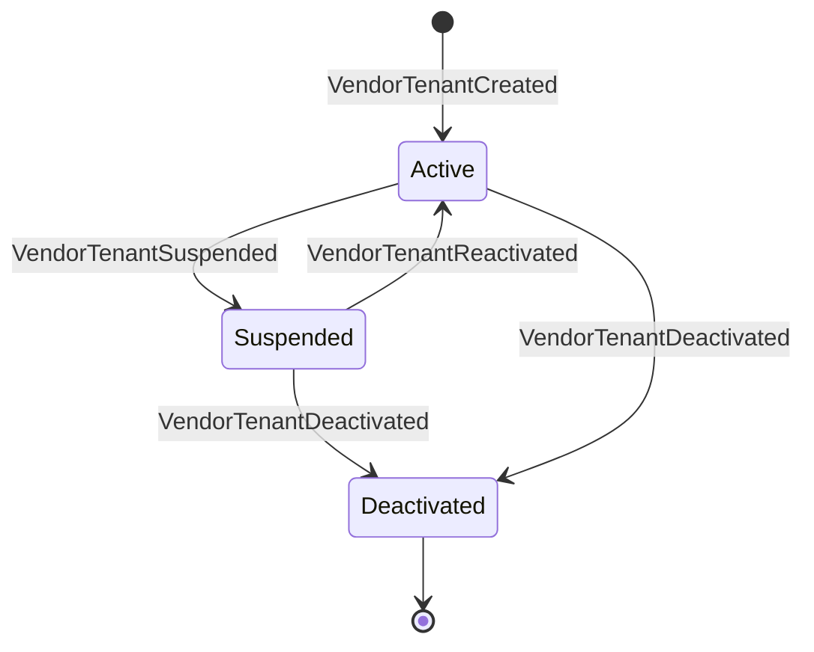
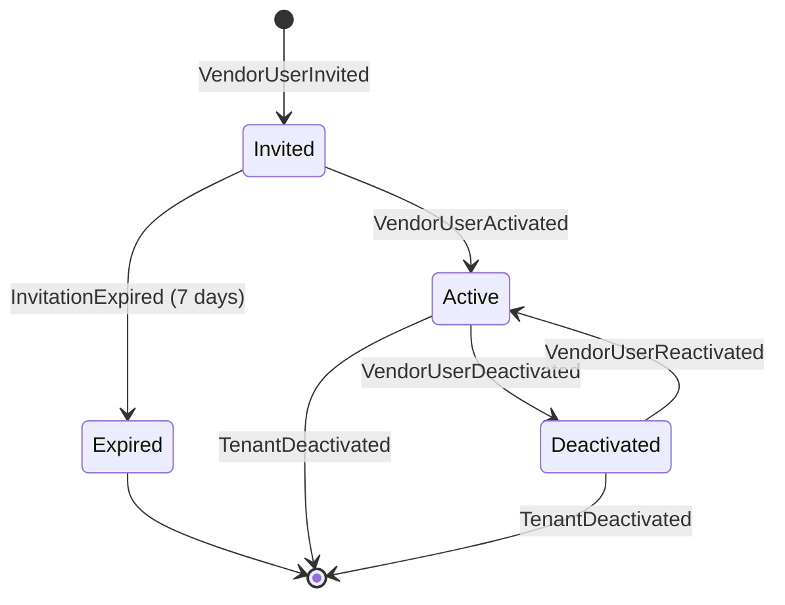

# Vendor Identity BC Workflows

**Bounded Context:** Vendor Identity  
**Implementation Status:** 🚧 Future (Not Yet Implemented)  
**Priority:** Low (Cycle 22+)  
**Estimated Effort:** 2-3 sessions  

---

## Overview

The Vendor Identity BC manages vendor authentication, authorization, and multi-tenant isolation for the Vendor Portal. It ensures secure vendor access, user management, and tenant-level data segregation.

### Key Business Rules (From 10+ Years E-Commerce Experience)

1. **Multi-Tenancy:** Each vendor is isolated in their own tenant (VendorTenant)
2. **User Roles:** Owner (full access), Admin (most permissions), Editor (product management only), Viewer (read-only)
3. **Invitation-Based Onboarding:** Vendors invited by platform admins, self-service signup disabled initially
4. **Password Policy:** Min 12 chars, 1 uppercase, 1 lowercase, 1 number, 1 special character
5. **Session Timeout:** 2 hours idle, 8 hours absolute
6. **Two-Factor Authentication:** Optional initially, required for financial operations (refunds, payouts)
7. **Audit Logging:** All vendor actions logged (who did what, when, from which IP)

---

## Aggregates

### 1. Vendor Tenant Aggregate

Represents a vendor organization (e.g., "Acme Pet Supplies Inc.")

**Lifecycle Events:**
- `VendorTenantCreated` — Platform admin creates vendor tenant
  - TenantId (Guid)
  - TenantName (string) — "Acme Pet Supplies"
  - CompanyLegalName (string)
  - TaxId (string) — For payment reporting
  - BusinessAddress (Address)
  - ContactEmail (string)
  - ContactPhone (string)
  - Status (enum: Active, Suspended, Deactivated)
  - CreatedAt (DateTimeOffset)

- `VendorTenantSuspended` — Platform admin suspends vendor (policy violation, payment dispute)
  - TenantId
  - Reason (string)
  - SuspendedBy (string) — Platform admin ID
  - SuspendedAt (DateTimeOffset)

- `VendorTenantReactivated` — Platform admin reactivates suspended vendor
  - TenantId
  - ReactivatedBy (string)
  - ReactivatedAt (DateTimeOffset)

- `VendorTenantDeactivated` — Vendor closes account or platform terminates relationship
  - TenantId
  - Reason (string)
  - DeactivatedBy (string)
  - DeactivatedAt (DateTimeOffset)

---

### 2. Vendor User Aggregate

Represents individual users within a vendor tenant

**Lifecycle Events:**
- `VendorUserInvited` — Platform admin or tenant owner invites user
  - UserId (Guid)
  - TenantId (Guid) — Which vendor tenant this user belongs to
  - Email (string)
  - Role (enum: Owner, Admin, Editor, Viewer)
  - InvitedBy (string) — Platform admin or tenant owner ID
  - InvitationToken (string) — Unique token for signup link
  - InvitationExpiresAt (DateTimeOffset) — 7 days from invitation
  - InvitedAt (DateTimeOffset)

- `VendorUserActivated` — User accepts invitation and completes signup
  - UserId
  - PasswordHash (string) — bcrypt hashed password
  - FirstName (string)
  - LastName (string)
  - ActivatedAt (DateTimeOffset)

- `VendorUserPasswordChanged` — User changes password
  - UserId
  - NewPasswordHash (string)
  - ChangedAt (DateTimeOffset)

- `VendorUserPasswordResetRequested` — User forgot password
  - UserId
  - ResetToken (string)
  - ResetTokenExpiresAt (DateTimeOffset) — 1 hour from request
  - RequestedAt (DateTimeOffset)

- `VendorUserPasswordReset` — User completes password reset
  - UserId
  - NewPasswordHash (string)
  - ResetAt (DateTimeOffset)

- `VendorUserRoleChanged` — Tenant owner changes user role
  - UserId
  - OldRole (VendorUserRole)
  - NewRole (VendorUserRole)
  - ChangedBy (string) — Tenant owner ID
  - ChangedAt (DateTimeOffset)

- `VendorUserDeactivated` — User access revoked (employee left company, policy violation)
  - UserId
  - Reason (string)
  - DeactivatedBy (string)
  - DeactivatedAt (DateTimeOffset)

- `VendorUserReactivated` — Previously deactivated user restored
  - UserId
  - ReactivatedBy (string)
  - ReactivatedAt (DateTimeOffset)

- `VendorUserTwoFactorEnabled` — User enables 2FA
  - UserId
  - TwoFactorMethod (enum: SMS, Authenticator, Email)
  - EnabledAt (DateTimeOffset)

- `VendorUserTwoFactorDisabled` — User disables 2FA (requires admin override)
  - UserId
  - DisabledBy (string)
  - DisabledAt (DateTimeOffset)

---

## Workflows

### Workflow 1: Happy Path - Vendor Onboarding (Invitation-Based)

**Scenario:** Platform admin invites new vendor "Acme Pet Supplies" with owner user

```
1. Platform Admin: Create Vendor Tenant
   Command: CreateVendorTenant
     - TenantName: "Acme Pet Supplies"
     - CompanyLegalName: "Acme Pet Supplies Inc."
     - TaxId: "12-3456789"
     - BusinessAddress: { Street: "123 Vendor Blvd", City: "Seattle", State: "WA", Zip: "98101" }
     - ContactEmail: "contact@acmepet.com"
     - ContactPhone: "+1-555-0123"
   Event: VendorTenantCreated
   Integration: Vendor.VendorTenantCreated → Vendor Portal BC (create default workspace)

2. Platform Admin: Invite Owner User
   Command: InviteVendorUser
     - TenantId: [generated in step 1]
     - Email: "john.smith@acmepet.com"
     - Role: Owner
     - InvitedBy: "platform-admin-123"
   Event: VendorUserInvited
   Integration: Email invitation sent
     - Subject: "You're invited to manage Acme Pet Supplies on CritterSupply"
     - Body: "Click here to set up your account: https://vendor.crittersupply.com/signup?token=abc123"
     - Link expires in 7 days

3. Vendor Owner (John Smith): Click Invitation Link
   - Browser navigates to: /signup?token=abc123
   - System validates token (not expired, not already used)
   - Display signup form (First Name, Last Name, Password, Confirm Password)

4. Vendor Owner: Complete Signup
   Command: ActivateVendorUser
     - UserId: [generated when invited]
     - FirstName: "John"
     - LastName: "Smith"
     - Password: "SecurePassword123!"
     - InvitationToken: "abc123"
   Event: VendorUserActivated
   Integration: Vendor.VendorUserActivated → Vendor Portal BC (unlock portal access)

5. Vendor Owner: Log In
   Command: AuthenticateVendorUser
     - Email: "john.smith@acmepet.com"
     - Password: "SecurePassword123!"
   - System validates credentials (bcrypt compare)
   - System creates session (JWT token, 8-hour expiry)
   - Response: JWT token + user profile (FirstName, LastName, Role, TenantId)

6. Vendor Owner: Access Vendor Portal Dashboard
   - Browser includes JWT token in Authorization header
   - Vendor Portal validates token with Vendor Identity BC
   - Dashboard displays: Products (0), Orders (0), Inventory (0)

TOTAL DURATION: 10-15 minutes (if vendor responds to invitation immediately)
```

---

### Workflow 2: Vendor Owner Invites Additional Users

**Scenario:** John Smith (owner) invites two team members (admin + editor)

```
1. Vendor Owner: Navigate to "Team Management"
   - Display table of existing users (currently: John Smith - Owner)

2. Vendor Owner: Invite Admin User
   Command: InviteVendorUser
     - TenantId: [John's tenant]
     - Email: "jane.doe@acmepet.com"
     - Role: Admin
     - InvitedBy: "john-smith-user-id"
   Event: VendorUserInvited
   Integration: Email invitation sent to jane.doe@acmepet.com

3. Vendor Owner: Invite Editor User
   Command: InviteVendorUser
     - Email: "bob.jones@acmepet.com"
     - Role: Editor
     - InvitedBy: "john-smith-user-id"
   Event: VendorUserInvited
   Integration: Email invitation sent to bob.jones@acmepet.com

4. Team Members: Accept Invitations (same as Workflow 1, steps 3-4)
   - Jane activates → VendorUserActivated (Role: Admin)
   - Bob activates → VendorUserActivated (Role: Editor)

5. Vendor Owner: View Updated Team
   - Team table now shows:
     | User          | Role   | Status | Last Login |
     |---------------|--------|--------|------------|
     | John Smith    | Owner  | Active | 5 min ago  |
     | Jane Doe      | Admin  | Active | 1 day ago  |
     | Bob Jones     | Editor | Active | Never      |

BUSINESS IMPACT: 3 users can now manage vendor operations (Owner: full access, Admin: most permissions, Editor: products only)
```

---

### Workflow 3: Edge Case - User Forgets Password (Password Reset)

**Scenario:** Jane Doe (admin) forgets password

```
1. User: Click "Forgot Password?" Link
   - Navigate to /forgot-password
   - Enter email: "jane.doe@acmepet.com"

2. User: Submit Password Reset Request
   Command: RequestVendorUserPasswordReset
     - Email: "jane.doe@acmepet.com"
   - System looks up user by email (within VendorUser records)
   - If user found:
     Event: VendorUserPasswordResetRequested
     Integration: Email sent with reset link
       - Subject: "Password Reset Request"
       - Body: "Click here to reset your password: https://vendor.crittersupply.com/reset-password?token=xyz789"
       - Link expires in 1 hour
   - If user NOT found:
     - Still show success message (security: don't leak email existence)
     - No email sent

3. User: Click Password Reset Link
   - Navigate to /reset-password?token=xyz789
   - System validates token (not expired, not already used)
   - Display form: New Password, Confirm Password

4. User: Submit New Password
   Command: ResetVendorUserPassword
     - ResetToken: "xyz789"
     - NewPassword: "NewSecurePass456!"
   - System validates token
   - System hashes new password (bcrypt)
   Event: VendorUserPasswordReset

5. User: Log In with New Password
   Command: AuthenticateVendorUser
     - Email: "jane.doe@acmepet.com"
     - Password: "NewSecurePass456!"
   - Authentication succeeds
   - JWT token issued

CUSTOMER IMPACT: User regains access within 5 minutes (if email arrives quickly)
```

---

### Workflow 4: Edge Case - Vendor Tenant Suspended (Policy Violation)

**Scenario:** Platform detects fraudulent activity from "Acme Pet Supplies", suspends tenant

```
1. Platform Admin: Review Suspicious Activity
   - Fraud detection system flags: Fake reviews, counterfeit products
   - Platform admin investigates order data, customer complaints

2. Platform Admin: Suspend Vendor Tenant
   Command: SuspendVendorTenant
     - TenantId: [Acme Pet Supplies tenant]
     - Reason: "Policy violation: Selling counterfeit products (Section 3.2 of Vendor Agreement)"
     - SuspendedBy: "platform-admin-456"
   Event: VendorTenantSuspended
   Integration: Vendor.VendorTenantSuspended → Vendor Portal BC
     - Disable all product listings (unpublish from catalog)
     - Prevent new orders from this vendor
     - Display suspension banner in Vendor Portal

3. Vendor Owner: Attempts to Log In
   Command: AuthenticateVendorUser
     - Email: "john.smith@acmepet.com"
     - Password: "SecurePassword123!"
   - System validates credentials (password correct)
   - System checks tenant status: SUSPENDED
   - Response: HTTP 403 Forbidden
     - Error message: "Your vendor account has been suspended. Reason: Policy violation: Selling counterfeit products. Contact support@crittersupply.com to appeal."

4. Vendor Owner: Contacts Platform Support
   - Email to support explaining situation (claims products are authentic)
   - Platform admin reviews evidence (supplier invoices, authenticity certificates)

5a. Platform Admin: Reactivate Vendor (Appeal Approved)
    Command: ReactivateVendorTenant
      - TenantId: [Acme Pet Supplies tenant]
      - ReactivatedBy: "platform-admin-456"
    Event: VendorTenantReactivated
    Integration: Vendor Portal BC
      - Re-enable product listings
      - Remove suspension banner
    - Vendor can log in again

5b. Platform Admin: Maintain Suspension (Appeal Denied)
    - Send email: "After review, we have determined the suspension will remain in effect. Your account will be permanently deactivated in 30 days unless evidence of authenticity is provided."

BUSINESS IMPACT: Protects customer trust by removing fraudulent vendors quickly
VENDOR IMPACT: Suspended vendors lose all sales until issue resolved
```

---

### Workflow 5: User Role Changes

**Scenario:** Vendor owner demotes admin to editor (reduced permissions)

```
1. Vendor Owner: Navigate to Team Management
   - View user: Jane Doe (Admin)
   - Click "Change Role"

2. Vendor Owner: Select New Role
   Command: ChangeVendorUserRole
     - UserId: [Jane Doe's user ID]
     - NewRole: Editor
     - ChangedBy: "john-smith-user-id"
   Event: VendorUserRoleChanged
     - OldRole: Admin
     - NewRole: Editor

3. System: Update Jane's Permissions
   - Jane can no longer:
     - Invite new users
     - View financial reports (payouts, refunds)
     - Change vendor settings
   - Jane CAN still:
     - Manage products (add, edit, discontinue)
     - View orders
     - View inventory

4. Jane Doe: Next Log In
   - Session JWT still claims "Admin" role (stale until expiry)
   - Solution: Short JWT expiry (15 minutes) OR
   - Force session refresh on role change (revoke old JWTs)

5. Jane Doe: Attempts to Access Financial Reports
   - Click "Payouts" in navigation
   - Vendor Portal checks role: Editor (not authorized)
   - Response: HTTP 403 Forbidden
     - Message: "You do not have permission to view this page. Contact your account owner to request access."

BUSINESS IMPACT: Fine-grained access control prevents unauthorized actions
```

---

### Workflow 6: Two-Factor Authentication (2FA) Enablement

**Scenario:** Vendor owner enables 2FA for added security

```
1. Vendor Owner: Navigate to Security Settings
   - Click "Enable Two-Factor Authentication"

2. System: Display 2FA Setup Options
   - Option 1: Authenticator App (Google Authenticator, Authy)
   - Option 2: SMS (text message code)
   - Option 3: Email (code sent to registered email)

3. Vendor Owner: Select Authenticator App
   - System generates QR code (TOTP secret)
   - Display QR code + manual entry code
   - Instructions: "Scan this QR code with your authenticator app"

4. Vendor Owner: Scan QR Code
   - Open Google Authenticator app
   - Scan QR code
   - App generates 6-digit code (rotates every 30 seconds)

5. Vendor Owner: Verify 2FA Setup
   - Enter 6-digit code from app: "123456"
   Command: EnableVendorUserTwoFactor
     - UserId: [John Smith's user ID]
     - TwoFactorMethod: Authenticator
     - VerificationCode: "123456"
   - System validates code (TOTP algorithm)
   - If valid:
     Event: VendorUserTwoFactorEnabled
     - Display recovery codes (10 single-use codes for account recovery)
     - Message: "Two-factor authentication enabled. Save your recovery codes in a safe place."

6. Vendor Owner: Next Log In (2FA Required)
   Command: AuthenticateVendorUser
     - Email: "john.smith@acmepet.com"
     - Password: "SecurePassword123!"
   - System validates password → SUCCESS
   - System checks 2FA enabled → Prompt for 2FA code
   - User enters 6-digit code from app: "654321"
   - System validates TOTP code → SUCCESS
   - JWT token issued (user fully authenticated)

SECURITY BENEFIT: Even if password compromised, attacker cannot access account without 2FA code
```

---

## Integration Flows

### Vendor Identity BC Receives (Inbound Integration Messages)

| Integration Message | Published By | Handler | Outcome |
|---|---|---|---|
| `VendorPortal.UserActivityDetected` | Vendor Portal BC | Update last activity timestamp (for session timeout) | Extend session if within idle timeout |
| `Payments.PayoutCompleted` | Payments BC | Log financial activity (audit trail) | Store payout record for compliance |

---

### Vendor Identity BC Publishes (Outbound Integration Messages)

| Integration Message | Consumed By | Purpose |
|---|---|---|
| `Vendor.VendorTenantCreated` | Vendor Portal BC, Product Catalog BC | Initialize vendor workspace, enable product creation |
| `Vendor.VendorTenantSuspended` | Vendor Portal BC, Product Catalog BC | Disable portal access, unpublish vendor products |
| `Vendor.VendorTenantReactivated` | Vendor Portal BC, Product Catalog BC | Re-enable portal access, restore product listings |
| `Vendor.VendorTenantDeactivated` | Vendor Portal BC, Product Catalog BC | Permanently disable vendor, archive products |
| `Vendor.VendorUserInvited` | Notifications BC | Send invitation email with signup link |
| `Vendor.VendorUserActivated` | Vendor Portal BC | Unlock portal access for new user |
| `Vendor.VendorUserDeactivated` | Vendor Portal BC | Revoke user sessions, block access |
| `Vendor.VendorUserPasswordReset` | Notifications BC | Send password reset email |

---

## State Transition Diagram

### Vendor Tenant States



### Vendor User States



---

## Business Events Summary

### Vendor Tenant Aggregate Events

1. `VendorTenantCreated` — Platform admin creates vendor
2. `VendorTenantSuspended` — Platform admin suspends vendor
3. `VendorTenantReactivated` — Platform admin reactivates vendor
4. `VendorTenantDeactivated` — Vendor account permanently closed

### Vendor User Aggregate Events

1. `VendorUserInvited` — User invited to vendor tenant
2. `VendorUserActivated` — User accepts invitation and completes signup
3. `VendorUserPasswordChanged` — User changes password
4. `VendorUserPasswordResetRequested` — User forgot password
5. `VendorUserPasswordReset` — User completes password reset
6. `VendorUserRoleChanged` — User role updated (Owner, Admin, Editor, Viewer)
7. `VendorUserDeactivated` — User access revoked
8. `VendorUserReactivated` — User access restored
9. `VendorUserTwoFactorEnabled` — User enables 2FA
10. `VendorUserTwoFactorDisabled` — User disables 2FA

---

## Integration Messages

### Published by Vendor Identity BC

- `Vendor.VendorTenantCreated`
- `Vendor.VendorTenantSuspended`
- `Vendor.VendorTenantReactivated`
- `Vendor.VendorTenantDeactivated`
- `Vendor.VendorUserInvited`
- `Vendor.VendorUserActivated`
- `Vendor.VendorUserDeactivated`
- `Vendor.VendorUserPasswordReset`

### Consumed by Vendor Identity BC

- `VendorPortal.UserActivityDetected` (optional, for session management)
- `Payments.PayoutCompleted` (optional, for audit trail)

---

## Invariants (Business Rules)

1. **Tenant Uniqueness:**
   - Each vendor tenant has unique TenantId
   - No duplicate company legal names allowed

2. **User Email Uniqueness:**
   - Email addresses must be unique across all vendor users (cannot have same email in multiple tenants)

3. **Role Hierarchy:**
   - Only Owner can change roles
   - Only Owner can deactivate users
   - Cannot have zero Owners (must transfer ownership before deactivating last Owner)

4. **Invitation Expiry:**
   - Invitations expire after 7 days
   - Expired invitations cannot be activated (must re-invite)

5. **Password Reset Token Expiry:**
   - Reset tokens expire after 1 hour
   - Tokens are single-use (cannot reuse after password reset)

6. **Session Security:**
   - JWT tokens expire after 8 hours (absolute timeout)
   - Idle timeout: 2 hours (no activity)
   - Session revoked if user deactivated or tenant suspended

---

## Implementation Guidance

### Entity Framework Core Model (NOT Event Sourced)

Unlike most CritterSupply BCs, Vendor Identity uses **EF Core** (similar to Customer Identity BC) because:
- Identity data is relational (tenant → users, foreign keys)
- Current state only (no need for event sourcing)
- Queries need efficient joins (tenants + users + roles)

```csharp
public sealed class VendorTenant
{
    public Guid TenantId { get; set; }
    public string TenantName { get; set; } = string.Empty;
    public string CompanyLegalName { get; set; } = string.Empty;
    public string TaxId { get; set; } = string.Empty;
    public Address BusinessAddress { get; set; } = null!;
    public string ContactEmail { get; set; } = string.Empty;
    public string ContactPhone { get; set; } = string.Empty;
    public VendorTenantStatus Status { get; set; }
    public DateTimeOffset CreatedAt { get; set; }
    public DateTimeOffset? SuspendedAt { get; set; }
    public string? SuspensionReason { get; set; }
    
    // Navigation property
    public List<VendorUser> Users { get; set; } = [];
}

public sealed class VendorUser
{
    public Guid UserId { get; set; }
    public Guid TenantId { get; set; } // Foreign key
    public string Email { get; set; } = string.Empty;
    public string PasswordHash { get; set; } = string.Empty;
    public string FirstName { get; set; } = string.Empty;
    public string LastName { get; set; } = string.Empty;
    public VendorUserRole Role { get; set; }
    public VendorUserStatus Status { get; set; }
    public DateTimeOffset? InvitedAt { get; set; }
    public DateTimeOffset? ActivatedAt { get; set; }
    public string? InvitationToken { get; set; }
    public DateTimeOffset? InvitationExpiresAt { get; set; }
    public bool TwoFactorEnabled { get; set; }
    public TwoFactorMethod? TwoFactorMethod { get; set; }
    
    // Navigation property
    public VendorTenant Tenant { get; set; } = null!;
}

public enum VendorTenantStatus { Active, Suspended, Deactivated }
public enum VendorUserStatus { Invited, Active, Deactivated }
public enum VendorUserRole { Owner, Admin, Editor, Viewer }
public enum TwoFactorMethod { SMS, Authenticator, Email }
```

### DbContext Configuration

```csharp
public sealed class VendorIdentityDbContext : DbContext
{
    public DbSet<VendorTenant> VendorTenants => Set<VendorTenant>();
    public DbSet<VendorUser> VendorUsers => Set<VendorUser>();
    
    protected override void OnModelCreating(ModelBuilder modelBuilder)
    {
        // Vendor Tenant configuration
        modelBuilder.Entity<VendorTenant>(entity =>
        {
            entity.ToTable("vendor_tenants", "vendor_identity");
            entity.HasKey(e => e.TenantId);
            entity.Property(e => e.TenantName).IsRequired().HasMaxLength(200);
            entity.Property(e => e.CompanyLegalName).IsRequired().HasMaxLength(300);
            entity.OwnsOne(e => e.BusinessAddress);
            
            // Relationships
            entity.HasMany(e => e.Users)
                  .WithOne(u => u.Tenant)
                  .HasForeignKey(u => u.TenantId)
                  .OnDelete(DeleteBehavior.Cascade); // Delete users when tenant deleted
        });
        
        // Vendor User configuration
        modelBuilder.Entity<VendorUser>(entity =>
        {
            entity.ToTable("vendor_users", "vendor_identity");
            entity.HasKey(e => e.UserId);
            entity.Property(e => e.Email).IsRequired().HasMaxLength(255);
            entity.HasIndex(e => e.Email).IsUnique(); // Enforce email uniqueness across all tenants
            entity.Property(e => e.PasswordHash).IsRequired();
        });
    }
}
```

### Authentication Handler Example

```csharp
public sealed record AuthenticateVendorUser(string Email, string Password);

public sealed record AuthenticationResult(
    bool Success,
    string? Token,
    string? ErrorMessage,
    VendorUserProfile? UserProfile
);

public sealed record VendorUserProfile(
    Guid UserId,
    Guid TenantId,
    string Email,
    string FirstName,
    string LastName,
    VendorUserRole Role
);

public static class AuthenticateVendorUserHandler
{
    public static async Task<AuthenticationResult> Handle(
        AuthenticateVendorUser command,
        VendorIdentityDbContext dbContext,
        IPasswordHasher passwordHasher,
        IJwtTokenGenerator tokenGenerator)
    {
        // Look up user by email
        var user = await dbContext.VendorUsers
            .Include(u => u.Tenant)
            .FirstOrDefaultAsync(u => u.Email == command.Email);
        
        if (user is null)
            return new AuthenticationResult(false, null, "Invalid email or password", null);
        
        // Check tenant status (suspended tenants cannot log in)
        if (user.Tenant.Status == VendorTenantStatus.Suspended)
            return new AuthenticationResult(false, null, "Your vendor account has been suspended. Contact support.", null);
        
        // Check user status (deactivated users cannot log in)
        if (user.Status == VendorUserStatus.Deactivated)
            return new AuthenticationResult(false, null, "Your user account has been deactivated. Contact your account owner.", null);
        
        // Verify password
        if (!passwordHasher.Verify(command.Password, user.PasswordHash))
            return new AuthenticationResult(false, null, "Invalid email or password", null);
        
        // Check if 2FA enabled
        if (user.TwoFactorEnabled)
        {
            // Return partial success (client must prompt for 2FA code)
            return new AuthenticationResult(false, null, "2FA_REQUIRED", null);
        }
        
        // Generate JWT token
        var token = tokenGenerator.Generate(user.UserId, user.TenantId, user.Role);
        
        var profile = new VendorUserProfile(
            user.UserId,
            user.TenantId,
            user.Email,
            user.FirstName,
            user.LastName,
            user.Role
        );
        
        return new AuthenticationResult(true, token, null, profile);
    }
}
```

---

## Testing Strategy

### Integration Tests (Alba + TestContainers)

1. **Tenant Management:**
   - Create vendor tenant → VendorTenantCreated persisted
   - Suspend tenant → VendorTenantSuspended persisted, users cannot log in
   - Reactivate tenant → Users can log in again

2. **User Lifecycle:**
   - Invite user → VendorUserInvited, email sent
   - Activate user → VendorUserActivated, password hashed
   - Authenticate user → JWT token returned
   - Change role → VendorUserRoleChanged, permissions updated
   - Deactivate user → VendorUserDeactivated, authentication fails

3. **Password Reset:**
   - Request reset → VendorUserPasswordResetRequested, email sent
   - Reset password with valid token → VendorUserPasswordReset
   - Reset password with expired token → Failure

4. **2FA:**
   - Enable 2FA → VendorUserTwoFactorEnabled
   - Authenticate with 2FA → Require 2FA code after password verification

### BDD Feature Files

Location: `docs/features/vendor-identity/`

Recommended feature files:
- `vendor-onboarding.feature` — Tenant creation + owner invitation
- `user-management.feature` — Invite, activate, deactivate users
- `authentication.feature` — Login, logout, session management
- `password-reset.feature` — Forgot password flow
- `two-factor-auth.feature` — 2FA enablement + authentication

---

## Dependencies

**Must Be Implemented First:**
- Notifications BC (for email invitations, password resets) — OR stub email sending initially

**Integrates With:**
- Vendor Portal BC (authentication, authorization checks)
- Product Catalog BC (vendor-specific product management)
- Payments BC (audit trail for financial operations)

---

## Estimated Implementation Effort

**Cycle Breakdown:**

**Session 1:** EF Core Foundation
- Entity models (VendorTenant, VendorUser, enums)
- DbContext configuration + migrations
- Integration tests for CRUD operations

**Session 2:** Authentication & Authorization
- Password hashing (bcrypt)
- JWT token generation + validation
- Invitation system (token generation, expiry)
- Integration tests for auth flows

**Session 3:** Advanced Features
- Password reset flow
- 2FA (TOTP algorithm)
- Role-based authorization
- Integration tests for edge cases
- API endpoints (POST /api/vendor-identity/authenticate, etc.)

**Total Effort:** 2-3 sessions (4-6 hours)

---

## Success Criteria

- [ ] EF Core models implemented with foreign key relationships
- [ ] 10+ aggregate events documented (even if EF Core doesn't use event sourcing, integration messages still published)
- [ ] 8+ integration messages published (VendorTenantCreated, VendorUserInvited, etc.)
- [ ] 12+ integration tests passing (tenant lifecycle, user lifecycle, auth flows)
- [ ] JWT authentication working with role-based authorization
- [ ] Password reset flow functional
- [ ] 2FA enablement + authentication working
- [ ] BDD feature files written for key workflows
- [ ] ADR created for EF Core choice (similar to Customer Identity BC)
- [ ] CONTEXTS.md updated with Vendor Identity BC integration contracts

---

**Document Owner:** Product Owner (Erik Shafer)  
**Last Updated:** 2026-02-18  
**Status:** 🟢 Ready for Implementation
