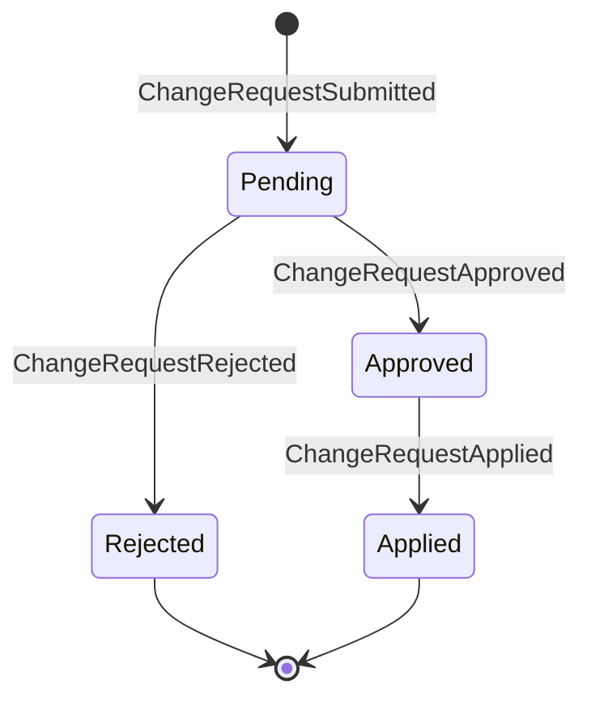

# Vendor Portal BC Workflows

**Bounded Context:** Vendor Portal  
**Implementation Status:** 🚧 Future (Not Yet Implemented)  
**Priority:** Low (Cycle 23+)  
**Estimated Effort:** 5-8 sessions  

---

## Overview

The Vendor Portal BC provides a self-service interface for vendors to manage their products, inventory, and orders. It integrates with Product Catalog BC (product CRUD), Inventory BC (stock management), Orders BC (fulfillment coordination), and Payments BC (payout tracking).

### Key Business Rules (From 10+ Years E-Commerce Experience)

1. **Product Approval Workflow:** Vendors submit products for review, platform admins approve/reject
2. **Inventory Sync:** Vendors update stock levels, automatically sync to Inventory BC
3. **Order Fulfillment:** Vendors receive order notifications, mark items as shipped
4. **Analytics Access:** Vendors view sales reports, top products, inventory trends
5. **Restricted Access:** Vendors can only view/edit their own products (multi-tenant isolation)
6. **Bulk Operations:** Support CSV import/export for product and inventory management
7. **Change Requests:** Product updates (description, price, images) require approval for published products

---

## Aggregates & Projections

### 1. Product Change Request Aggregate (Event Sourced)

Represents vendor-initiated changes to existing published products (requires platform approval)

**Lifecycle Events:**
- `ChangeRequestSubmitted` — Vendor submits product update for approval
  - ChangeRequestId (Guid)
  - ProductId (Guid) — Product being modified
  - VendorTenantId (Guid)
  - ChangeType (enum: DescriptionUpdate, PriceChange, ImageUpdate, CategoryChange, StatusChange)
  - ProposedChanges (Dictionary<string, object>) — Field → new value
  - CurrentValues (Dictionary<string, object>) — Field → current value (for comparison)
  - Reason (string) — Vendor explanation
  - SubmittedBy (Guid) — Vendor user ID
  - SubmittedAt (DateTimeOffset)

- `ChangeRequestApproved` — Platform admin approves changes
  - ChangeRequestId
  - ApprovedBy (string) — Platform admin ID
  - ApprovedAt (DateTimeOffset)

- `ChangeRequestRejected` — Platform admin denies changes
  - ChangeRequestId
  - RejectionReason (string)
  - RejectedBy (string)
  - RejectedAt (DateTimeOffset)

- `ChangeRequestApplied` — Changes applied to Product Catalog BC
  - ChangeRequestId
  - ProductId
  - AppliedAt (DateTimeOffset)

---

### 2. Vendor Dashboard Projections (Read Models)

These are **projections** built from integration messages published by other BCs.

#### ProductPerformanceSummary Projection

Aggregates sales data for vendor analytics

**Fields:**
- ProductId (Guid)
- VendorTenantId (Guid)
- Sku (string)
- ProductName (string)
- TotalUnitsSold (int) — Lifetime sales
- TotalRevenue (Money) — Lifetime revenue (vendor's portion after platform fees)
- Last30DaysUnitsSold (int)
- Last30DaysRevenue (Money)
- AverageOrderValue (Money)
- LastSoldAt (DateTimeOffset, nullable)

**Updated By:**
- `Orders.OrderPlaced` → Increment units sold, revenue
- `Orders.OrderCancelled` → Decrement units sold, revenue
- `Returns.ReturnCompleted` → Decrement units sold, revenue

---

#### InventorySnapshot Projection

Real-time inventory levels per product

**Fields:**
- ProductId (Guid)
- VendorTenantId (Guid)
- Sku (string)
- AvailableQuantity (int)
- ReservedQuantity (int) — Items in pending orders
- TotalQuantity (int) — Available + Reserved
- LastUpdatedAt (DateTimeOffset)

**Updated By:**
- `Inventory.StockAdjusted` → Update available quantity
- `Inventory.ReservationConfirmed` → Increment reserved quantity
- `Inventory.ReservationCommitted` → Decrement reserved quantity, decrement available quantity
- `Inventory.ReservationReleased` → Decrement reserved quantity

---

#### ChangeRequestStatusProjection

Tracks pending/approved/rejected change requests

**Fields:**
- ChangeRequestId (Guid)
- ProductId (Guid)
- VendorTenantId (Guid)
- ChangeType (enum)
- Status (enum: Pending, Approved, Rejected, Applied)
- SubmittedAt (DateTimeOffset)
- ReviewedAt (DateTimeOffset, nullable)
- ReviewedBy (string, nullable)

**Updated By:**
- `VendorPortal.ChangeRequestSubmitted` → Create projection
- `VendorPortal.ChangeRequestApproved` → Update status
- `VendorPortal.ChangeRequestRejected` → Update status
- `VendorPortal.ChangeRequestApplied` → Update status

---

## Workflows

### Workflow 1: Happy Path - Vendor Adds New Product (No Approval Required)

**Scenario:** Vendor "Acme Pet Supplies" adds a new dog toy to catalog

```
1. Vendor: Navigate to "Products" → "Add New Product"
   - Form displays: SKU, Name, Description, Category, Price, Images, Status

2. Vendor: Fill Product Form
   - SKU: "ACME-TOY-01"
   - Name: "Squeaky Bone Toy"
   - Description: "Durable rubber bone toy for dogs..."
   - Category: "Dogs > Toys"
   - Price: $12.99
   - Images: Upload 3 photos
   - Status: Draft (not visible to customers yet)

3. Vendor: Submit Product
   Command: CreateProduct (to Product Catalog BC)
     - VendorTenantId: [Acme tenant ID]
     - Sku: "ACME-TOY-01"
     - Name: "Squeaky Bone Toy"
     - Category: "Dogs > Toys"
     - Description: "..."
     - Price: $12.99
     - Images: [...]
     - Status: Draft
   Event: ProductCatalog.ProductAdded
   Integration: VendorPortal receives ProductAdded → Update VendorProductList projection

4. Vendor: Set Initial Inventory
   Command: AdjustInventory (to Inventory BC)
     - Sku: "ACME-TOY-01"
     - WarehouseId: "acme-warehouse-1"
     - Quantity: 50
     - AdjustmentType: InitialStock
   Event: Inventory.StockAdjusted
   Integration: VendorPortal receives StockAdjusted → Update InventorySnapshot projection

5. Vendor: Publish Product (Make Visible to Customers)
   Command: ChangeProductStatus (to Product Catalog BC)
     - ProductId: [generated in step 3]
     - NewStatus: Active
   Event: ProductCatalog.ProductStatusChanged
   Integration: Product now visible in customer storefront

TOTAL DURATION: 10-15 minutes for vendor to add product
BUSINESS IMPACT: New product available for customer purchase within minutes
```

---

### Workflow 2: Product Update Requires Approval (Published Product)

**Scenario:** Vendor updates description for existing active product

```
1. Vendor: Navigate to "Products" → Select "Squeaky Bone Toy"
   - Display product details (current values)

2. Vendor: Click "Request Description Update"
   - Form displays: Current Description vs New Description

3. Vendor: Submit Description Change
   - Current: "Durable rubber bone toy for dogs..."
   - Proposed: "Durable rubber bone toy for dogs of all sizes. Made from non-toxic, BPA-free rubber..."
   - Reason: "Added safety information requested by customers"

   Command: SubmitChangeRequest
     - ProductId: [Squeaky Bone Toy ID]
     - ChangeType: DescriptionUpdate
     - ProposedChanges: { "description": "Durable rubber bone toy..." }
     - CurrentValues: { "description": "Durable rubber bone toy for dogs..." }
     - Reason: "Added safety information..."
   Event: ChangeRequestSubmitted
   Integration: VendorPortal.ChangeRequestSubmitted → Notify platform admins

4. Platform Admin: Review Change Request
   - Admin dashboard shows pending change requests
   - View side-by-side comparison (current vs proposed)
   - Check for policy violations (prohibited terms, misleading claims)

5. Platform Admin: Approve Change Request
   Command: ApproveChangeRequest
     - ChangeRequestId: [generated in step 3]
     - ApprovedBy: "platform-admin-789"
   Event: ChangeRequestApproved
   Integration: VendorPortal.ChangeRequestApproved → Apply changes to Product Catalog BC

6. System: Apply Changes to Product Catalog
   Command: UpdateProduct (to Product Catalog BC)
     - ProductId: [Squeaky Bone Toy ID]
     - Description: "Durable rubber bone toy..." (new value)
   Event: ProductCatalog.ProductUpdated
   Event: ChangeRequestApplied

7. Vendor: View Notification
   - "Your change request for 'Squeaky Bone Toy' has been approved. Changes are now live."

TOTAL DURATION: 1-3 business days (depends on admin review queue)
BUSINESS IMPACT: Ensures quality control while allowing vendor flexibility
```

---

### Workflow 3: Vendor Receives Order & Ships Product

**Scenario:** Customer orders "Squeaky Bone Toy", vendor ships from warehouse

```
1. Orders BC: Order Placed
   Event: Orders.OrderPlaced
     - OrderId: "order-abc-123"
     - LineItems: [{ Sku: "ACME-TOY-01", Quantity: 2, VendorTenantId: [Acme] }]
   Integration: VendorPortal receives OrderPlaced → Update VendorOrderList projection

2. Vendor: View Order Notification
   - Dashboard shows: "New Order: order-abc-123 (2 items to ship)"
   - Click notification → Navigate to order details

3. Vendor: View Order Details
   Query: GetOrderDetails (from Orders BC via BFF composition)
   Display:
     - Order ID: order-abc-123
     - Customer: John Doe (masked for privacy: "John D., Seattle, WA")
     - Shipping Address: 123 Main St, Seattle, WA 98101
     - Line Items:
       | SKU          | Product Name       | Quantity | Price  |
       |--------------|---------------------|----------|--------|
       | ACME-TOY-01  | Squeaky Bone Toy    | 2        | $12.99 |
     - Total: $25.98
     - Order Date: 2026-02-18 10:30 AM

4. Fulfillment BC: Assign Shipment to Vendor Warehouse
   Event: Fulfillment.ShipmentAssigned
     - ShipmentId: "shipment-xyz-456"
     - OrderId: "order-abc-123"
     - WarehouseId: "acme-warehouse-1"
     - VendorTenantId: [Acme]
   Integration: VendorPortal receives ShipmentAssigned → Display "Ready to Ship" status

5. Vendor: Pick & Pack Order
   - Warehouse staff picks items from inventory
   - Scan SKU barcodes to confirm correct items
   - Pack in shipping box, print shipping label

6. Vendor: Mark as Shipped
   Command: RecordShipment (to Fulfillment BC)
     - ShipmentId: "shipment-xyz-456"
     - TrackingNumber: "1Z999AA10123456784"
     - Carrier: "UPS"
     - ShippedAt: DateTimeOffset.UtcNow
   Event: Fulfillment.ShipmentDispatched
   Integration: VendorPortal receives ShipmentDispatched → Update order status projection
   Integration: Customer Experience BC receives ShipmentDispatched → Notify customer via email + SSE

7. Vendor: View Updated Order Status
   - Order Status: "Shipped" (updated in vendor dashboard)
   - Tracking Number: "1Z999AA10123456784"
   - Estimated Delivery: Feb 22, 2026

TOTAL DURATION: 1-2 business days from order placement to shipment
BUSINESS IMPACT: Vendor fulfills orders efficiently, customer receives tracking info
```

---

### Workflow 4: Bulk Inventory Update (CSV Import)

**Scenario:** Vendor has 500 products, needs to update inventory quantities after warehouse count

```
1. Vendor: Navigate to "Inventory" → "Bulk Update"
   - Click "Download Current Inventory CSV"

2. System: Generate CSV Export
   Query: GetVendorInventory (from Inventory BC)
   CSV Format:
     ```
     SKU,ProductName,AvailableQuantity,ReservedQuantity,TotalQuantity
     ACME-TOY-01,Squeaky Bone Toy,45,5,50
     ACME-BOWL-02,Ceramic Dog Bowl,30,2,32
     ACME-FOOD-03,Premium Dog Food,120,15,135
     ...
     ```

3. Vendor: Update CSV File
   - Edit "AvailableQuantity" column with new counts (after physical warehouse inventory)
   - Save as "inventory-update-2026-02-18.csv"

4. Vendor: Upload CSV
   - Click "Upload Inventory CSV"
   - Select file: "inventory-update-2026-02-18.csv"

5. System: Validate CSV
   - Check SKU exists (owned by this vendor)
   - Check quantity is non-negative integer
   - Check reserved quantity not exceeded
   - If validation fails → Display errors (line numbers + issues)

6. System: Preview Changes
   - Display table of changes:
     | SKU          | Product Name       | Current | New | Diff  |
     |--------------|---------------------|---------|-----|-------|
     | ACME-TOY-01  | Squeaky Bone Toy    | 45      | 48  | +3    |
     | ACME-BOWL-02 | Ceramic Dog Bowl    | 30      | 28  | -2    |
     | ACME-FOOD-03 | Premium Dog Food    | 120     | 115 | -5    |
   - "Review these changes carefully. Click 'Apply Changes' to update inventory."

7. Vendor: Confirm Changes
   - Click "Apply Changes"

8. System: Batch Update Inventory
   For each row:
     Command: AdjustInventory (to Inventory BC)
       - Sku: "ACME-TOY-01"
       - Quantity: 48 (absolute value, not delta)
       - AdjustmentType: ManualAdjustment
     Event: Inventory.StockAdjusted
   
   Integration: VendorPortal receives StockAdjusted events → Update InventorySnapshot projections

9. Vendor: View Confirmation
   - "Inventory updated successfully. 500 products processed."
   - Display summary:
     - Total Products Updated: 500
     - Increased: 230
     - Decreased: 210
     - Unchanged: 60

TOTAL DURATION: 15-20 minutes (including CSV edit + upload)
BUSINESS IMPACT: Efficient bulk operations reduce manual data entry time by 90%
```

---

### Workflow 5: Analytics Dashboard (Vendor Performance Metrics)

**Scenario:** Vendor reviews sales performance for last 30 days

```
1. Vendor: Navigate to "Analytics" Dashboard
   - Default view: Last 30 Days

2. System: Query ProductPerformanceSummary Projection
   Query: GetVendorAnalytics(VendorTenantId, DateRange: Last30Days)
   Display:
     **Summary Cards:**
     - Total Orders: 142
     - Total Revenue: $4,256.78 (vendor's net, after 15% platform fee)
     - Average Order Value: $29.98
     - Top Product: "Squeaky Bone Toy" (32 units sold)

     **Sales Chart (Line Graph):**
     X-axis: Days (Feb 1 - Feb 18)
     Y-axis: Revenue ($)
     Line shows daily revenue trend

     **Top Products Table:**
     | Product Name       | Units Sold | Revenue   | Trend |
     |--------------------|------------|-----------|-------|
     | Squeaky Bone Toy   | 32         | $415.68   | ↑ 15% |
     | Ceramic Dog Bowl   | 28         | $559.72   | ↓ 5%  |
     | Premium Dog Food   | 24         | $1,199.76 | → 0%  |

     **Inventory Status:**
     - Low Stock Alerts: 3 products below reorder point
       - ACME-TOY-01: 12 units (reorder point: 15)
       - ACME-BOWL-02: 8 units (reorder point: 10)
       - ACME-FOOD-03: 45 units (reorder point: 50)

3. Vendor: Apply Date Range Filter
   - Select: "Last 90 Days"
   - Dashboard refreshes with 90-day data

4. Vendor: Export Report
   - Click "Export to CSV"
   - System generates CSV with all 500 products + 90-day metrics

TOTAL DURATION: 2-3 minutes to view insights
BUSINESS IMPACT: Vendors make data-driven decisions (restock popular items, discontinue slow movers)
```

---

### Workflow 6: Edge Case - Change Request Rejected

**Scenario:** Vendor attempts to lower price significantly (platform suspects pricing error)

```
1. Vendor: Submit Price Change Request
   Command: SubmitChangeRequest
     - ProductId: [Squeaky Bone Toy ID]
     - ChangeType: PriceChange
     - CurrentValues: { "price": "$12.99" }
     - ProposedChanges: { "price": "$1.99" }
     - Reason: "Clearance sale"
   Event: ChangeRequestSubmitted

2. Platform Admin: Review Change Request
   - System flags: "Price drop > 80% (potential error)"
   - Admin investigates: Is this intentional or a typo?

3. Platform Admin: Contact Vendor
   - Send message: "Your price change request (Squeaky Bone Toy: $12.99 → $1.99) appears to be a significant reduction. Please confirm this is intentional and not a pricing error."

4a. Vendor Confirms Typo:
    - "Oops, I meant $11.99 (10% discount, not 85%)"
    - Admin rejects original request
    Command: RejectChangeRequest
      - RejectionReason: "Pricing error suspected. Please resubmit with correct price."
    Event: ChangeRequestRejected
    
4b. Vendor Confirms Intentional:
    - "Yes, we have excess inventory and need to clear it"
    - Admin approves request
    Event: ChangeRequestApproved

5. Vendor: View Rejection Notification
   - "Your change request has been rejected. Reason: Pricing error suspected..."
   - "You can submit a new request with the correct price."

6. Vendor: Submit Corrected Request
   - New request: $12.99 → $11.99
   - Admin approves (10% discount is reasonable)

BUSINESS IMPACT: Quality control prevents accidental pricing errors that could lose vendor money
```

---

### Workflow 7: Edge Case - Low Stock Alert & Auto-Reorder

**Scenario:** Product inventory falls below reorder point, vendor notified

```
1. Inventory BC: Stock Depleted Below Threshold
   Event: Inventory.InventoryLow
     - Sku: "ACME-TOY-01"
     - AvailableQuantity: 8 units
     - ReorderPoint: 15 units
     - VendorTenantId: [Acme]
   Integration: VendorPortal receives InventoryLow → Update low stock projection

2. System: Display Low Stock Alert
   - Vendor dashboard shows banner: "⚠️ 3 products below reorder point"
   - Click banner → Navigate to low stock page

3. Vendor: View Low Stock Products
   Table:
     | Product Name       | Current Stock | Reorder Point | Suggested Reorder Qty |
     |--------------------|---------------|---------------|-----------------------|
     | Squeaky Bone Toy   | 8             | 15            | 50                    |
     | Ceramic Dog Bowl   | 6             | 10            | 30                    |
     | Premium Dog Food   | 42            | 50            | 100                   |

4. Vendor: Reorder from Supplier
   - Contact supplier: "Need to reorder 50 units of Squeaky Bone Toy"
   - Supplier ships inventory to Acme warehouse

5. Vendor: Receive Shipment & Update Inventory
   Command: AdjustInventory (to Inventory BC)
     - Sku: "ACME-TOY-01"
     - Quantity: 58 (8 existing + 50 received)
     - AdjustmentType: StockReceived
   Event: Inventory.StockAdjusted
   Integration: VendorPortal receives StockAdjusted → Remove from low stock alerts

BUSINESS IMPACT: Prevents stockouts, ensures popular products remain available
```

---

## Integration Flows

### Vendor Portal BC Receives (Inbound Integration Messages)

| Integration Message | Published By | Handler | Outcome |
|---|---|---|---|
| `ProductCatalog.ProductAdded` | Product Catalog BC | Update VendorProductList projection | Display in vendor's product list |
| `ProductCatalog.ProductUpdated` | Product Catalog BC | Update VendorProductList projection | Refresh product details |
| `ProductCatalog.ProductDiscontinued` | Product Catalog BC | Update VendorProductList projection | Mark product as discontinued |
| `Orders.OrderPlaced` | Orders BC | Update VendorOrderList + ProductPerformanceSummary projections | Display new order, increment sales metrics |
| `Orders.OrderCancelled` | Orders BC | Update ProductPerformanceSummary projection | Decrement sales metrics |
| `Fulfillment.ShipmentAssigned` | Fulfillment BC | Update VendorOrderList projection | Display "Ready to Ship" status |
| `Fulfillment.ShipmentDispatched` | Fulfillment BC | Update VendorOrderList projection | Display "Shipped" status |
| `Inventory.StockAdjusted` | Inventory BC | Update InventorySnapshot projection | Refresh available quantity |
| `Inventory.ReservationConfirmed` | Inventory BC | Update InventorySnapshot projection | Increment reserved quantity |
| `Inventory.InventoryLow` | Inventory BC | Create low stock alert | Notify vendor via dashboard/email |
| `Returns.ReturnCompleted` | Returns BC | Update ProductPerformanceSummary projection | Decrement sales metrics (returned items) |
| `Vendor.VendorUserActivated` | Vendor Identity BC | Grant portal access | Enable user login to portal |

---

### Vendor Portal BC Publishes (Outbound Integration Messages)

| Integration Message | Consumed By | Purpose |
|---|---|---|
| `VendorPortal.ChangeRequestSubmitted` | Notifications BC, Platform Admin Dashboard | Notify admins of pending review |
| `VendorPortal.ChangeRequestApproved` | Product Catalog BC | Apply approved changes to product |
| `VendorPortal.ChangeRequestRejected` | Notifications BC | Email vendor with rejection reason |
| `VendorPortal.DashboardViewSaved` | Analytics BC (future) | Track vendor engagement metrics |

---

## State Transition Diagram

### Change Request Lifecycle



---

## Business Events Summary

### Change Request Aggregate Events

1. `ChangeRequestSubmitted` — Vendor proposes product update
2. `ChangeRequestApproved` — Platform admin approves changes
3. `ChangeRequestRejected` — Platform admin denies changes
4. `ChangeRequestApplied` — Changes applied to Product Catalog BC

---

## Integration Messages

### Published by Vendor Portal BC

- `VendorPortal.ChangeRequestSubmitted`
- `VendorPortal.ChangeRequestApproved`
- `VendorPortal.ChangeRequestRejected`
- `VendorPortal.DashboardViewSaved`

### Consumed by Vendor Portal BC

- `ProductCatalog.ProductAdded`
- `ProductCatalog.ProductUpdated`
- `ProductCatalog.ProductDiscontinued`
- `Orders.OrderPlaced`
- `Orders.OrderCancelled`
- `Fulfillment.ShipmentAssigned`
- `Fulfillment.ShipmentDispatched`
- `Inventory.StockAdjusted`
- `Inventory.ReservationConfirmed`
- `Inventory.InventoryLow`
- `Returns.ReturnCompleted`
- `Vendor.VendorUserActivated`

---

## Invariants (Business Rules)

1. **Vendor Isolation (Multi-Tenancy):**
   - Vendors can only view/edit products owned by their tenant
   - Product queries filtered by VendorTenantId

2. **Change Request Approval:**
   - Changes to published products (Status: Active) require admin approval
   - Draft products (Status: Draft) can be edited freely
   - Price increases >20% require approval
   - Price decreases >50% require approval (pricing error protection)

3. **Inventory Constraints:**
   - Available quantity cannot go negative
   - Reserved quantity cannot exceed total quantity
   - Bulk updates must validate SKU ownership (vendor cannot modify other vendors' inventory)

4. **Order Fulfillment:**
   - Vendors can only ship orders assigned to their warehouse
   - Shipment tracking number required when marking as shipped

5. **Analytics Access:**
   - Vendors see only their own sales data (tenant-scoped)
   - Revenue displayed as net (after platform fees)

---

## Implementation Guidance

### Aggregate Design (Change Request)

```csharp
public sealed record ChangeRequest
{
    public Guid ChangeRequestId { get; init; }
    public Guid ProductId { get; init; }
    public Guid VendorTenantId { get; init; }
    public ChangeRequestStatus Status { get; private set; }
    public ChangeType ChangeType { get; init; }
    public Dictionary<string, object> ProposedChanges { get; init; } = new();
    public Dictionary<string, object> CurrentValues { get; init; } = new();
    public string Reason { get; init; } = string.Empty;
    public DateTimeOffset SubmittedAt { get; init; }
    
    public static (ChangeRequest, ChangeRequestSubmitted) Create(
        Guid productId, 
        Guid vendorTenantId, 
        ChangeType changeType,
        Dictionary<string, object> proposedChanges,
        Dictionary<string, object> currentValues,
        string reason)
    {
        var changeRequest = new ChangeRequest
        {
            ChangeRequestId = Guid.NewGuid(),
            ProductId = productId,
            VendorTenantId = vendorTenantId,
            Status = ChangeRequestStatus.Pending,
            ChangeType = changeType,
            ProposedChanges = proposedChanges,
            CurrentValues = currentValues,
            Reason = reason,
            SubmittedAt = DateTimeOffset.UtcNow
        };
        
        var @event = new ChangeRequestSubmitted(
            changeRequest.ChangeRequestId,
            productId,
            vendorTenantId,
            changeType,
            proposedChanges,
            currentValues,
            reason,
            changeRequest.SubmittedAt
        );
        
        return (changeRequest, @event);
    }
    
    public ChangeRequest Apply(ChangeRequestApproved e)
    {
        return this with { Status = ChangeRequestStatus.Approved };
    }
    
    public ChangeRequest Apply(ChangeRequestRejected e)
    {
        return this with { Status = ChangeRequestStatus.Rejected };
    }
    
    public ChangeRequest Apply(ChangeRequestApplied e)
    {
        return this with { Status = ChangeRequestStatus.Applied };
    }
}

public enum ChangeRequestStatus { Pending, Approved, Rejected, Applied }
public enum ChangeType { DescriptionUpdate, PriceChange, ImageUpdate, CategoryChange, StatusChange }
```

### Projection Design (Product Performance Summary)

```csharp
public sealed class ProductPerformanceSummary
{
    public Guid ProductId { get; set; }
    public Guid VendorTenantId { get; set; }
    public string Sku { get; set; } = string.Empty;
    public string ProductName { get; set; } = string.Empty;
    public int TotalUnitsSold { get; set; }
    public decimal TotalRevenue { get; set; }
    public int Last30DaysUnitsSold { get; set; }
    public decimal Last30DaysRevenue { get; set; }
    public decimal AverageOrderValue { get; set; }
    public DateTimeOffset? LastSoldAt { get; set; }
}

// Marten projection configuration
public sealed class ProductPerformanceSummaryProjection : MultiStreamProjection<ProductPerformanceSummary, Guid>
{
    public ProductPerformanceSummaryProjection()
    {
        Identity<Orders.OrderPlaced>(e => e.LineItems
            .Select(li => li.ProductId)
            .ToArray());
        
        Identity<Orders.OrderCancelled>(e => e.OrderId);
        Identity<Returns.ReturnCompleted>(e => e.ProductId);
    }
    
    public void Apply(Orders.OrderPlaced @event, ProductPerformanceSummary summary)
    {
        var lineItem = @event.LineItems.FirstOrDefault(li => li.ProductId == summary.ProductId);
        if (lineItem is null) return;
        
        summary.TotalUnitsSold += lineItem.Quantity;
        summary.TotalRevenue += lineItem.Quantity * lineItem.UnitPrice;
        summary.LastSoldAt = @event.PlacedAt;
        
        // Update last 30 days metrics (if order within 30 days)
        if (@event.PlacedAt >= DateTimeOffset.UtcNow.AddDays(-30))
        {
            summary.Last30DaysUnitsSold += lineItem.Quantity;
            summary.Last30DaysRevenue += lineItem.Quantity * lineItem.UnitPrice;
        }
        
        // Recalculate average order value
        summary.AverageOrderValue = summary.TotalRevenue / summary.TotalUnitsSold;
    }
    
    public void Apply(Orders.OrderCancelled @event, ProductPerformanceSummary summary)
    {
        // Decrement sales metrics for cancelled orders
        // (Implementation similar to OrderPlaced, but subtract)
    }
    
    public void Apply(Returns.ReturnCompleted @event, ProductPerformanceSummary summary)
    {
        // Decrement sales metrics for returned items
    }
}
```

### Query Handler Example (Vendor Analytics)

```csharp
public sealed record GetVendorAnalytics(Guid VendorTenantId, DateRange Range);

public sealed record VendorAnalyticsView(
    int TotalOrders,
    decimal TotalRevenue,
    decimal AverageOrderValue,
    List<TopProductDto> TopProducts,
    List<LowStockProductDto> LowStockProducts
);

public static class GetVendorAnalyticsHandler
{
    public static async Task<VendorAnalyticsView> Handle(
        GetVendorAnalytics query,
        IQuerySession session)
    {
        // Query ProductPerformanceSummary projection
        var products = await session.Query<ProductPerformanceSummary>()
            .Where(p => p.VendorTenantId == query.VendorTenantId)
            .ToListAsync();
        
        var topProducts = products
            .OrderByDescending(p => p.Last30DaysUnitsSold)
            .Take(10)
            .Select(p => new TopProductDto(p.ProductName, p.Last30DaysUnitsSold, p.Last30DaysRevenue))
            .ToList();
        
        // Query InventorySnapshot projection for low stock alerts
        var inventory = await session.Query<InventorySnapshot>()
            .Where(i => i.VendorTenantId == query.VendorTenantId && i.AvailableQuantity < i.ReorderPoint)
            .ToListAsync();
        
        var lowStockProducts = inventory
            .Select(i => new LowStockProductDto(i.Sku, i.ProductName, i.AvailableQuantity, i.ReorderPoint))
            .ToList();
        
        return new VendorAnalyticsView(
            TotalOrders: products.Sum(p => p.TotalUnitsSold),
            TotalRevenue: products.Sum(p => p.TotalRevenue),
            AverageOrderValue: products.Average(p => p.AverageOrderValue),
            TopProducts: topProducts,
            LowStockProducts: lowStockProducts
        );
    }
}
```

---

## Testing Strategy

### Integration Tests (Alba + TestContainers)

1. **Product Management:**
   - Vendor adds product → ProductAdded event, projection updated
   - Vendor submits change request → ChangeRequestSubmitted persisted
   - Admin approves change → Product updated in catalog

2. **Inventory Management:**
   - Vendor adjusts inventory → StockAdjusted event, projection updated
   - Bulk CSV import → Multiple StockAdjusted events, all projections updated

3. **Order Fulfillment:**
   - OrderPlaced received → VendorOrderList projection updated
   - Vendor marks as shipped → ShipmentDispatched published

4. **Analytics:**
   - OrderPlaced event → ProductPerformanceSummary metrics incremented
   - OrderCancelled event → Metrics decremented

5. **Multi-Tenancy Isolation:**
   - Vendor A cannot query Vendor B's products
   - Vendor A cannot update Vendor B's inventory

### BDD Feature Files

Location: `docs/features/vendor-portal/`

Recommended feature files:
- `product-management.feature` — Add, edit, discontinue products
- `change-request-approval.feature` — Submit, approve, reject change requests
- `inventory-management.feature` — Adjust inventory, bulk CSV import
- `order-fulfillment.feature` — View orders, mark as shipped
- `analytics-dashboard.feature` — View sales metrics, low stock alerts

---

## Dependencies

**Must Be Implemented First:**
- ✅ Product Catalog BC (for product CRUD)
- ✅ Inventory BC (for stock management)
- ✅ Orders BC (for order data)
- ✅ Fulfillment BC (for shipment tracking)
- ✅ Payments BC (for payout tracking)
- 🚧 Vendor Identity BC (for authentication/authorization) — OR stub authentication initially

**Nice to Have:**
- Returns BC (for return tracking in vendor dashboard)
- Notifications BC (for email alerts)

---

## Estimated Implementation Effort

**Cycle Breakdown:**

**Session 1-2:** Change Request Aggregate + Approval Workflow
- Aggregate design (ChangeRequest, events, Apply methods)
- Command handlers (SubmitChangeRequest, ApproveChangeRequest, RejectChangeRequest)
- Integration with Product Catalog BC (apply approved changes)
- Integration tests for approval workflow

**Session 3:** Vendor Dashboard Projections
- ProductPerformanceSummary projection (sales metrics)
- InventorySnapshot projection (real-time inventory)
- ChangeRequestStatusProjection (pending/approved/rejected)
- Integration tests for projection updates

**Session 4:** Product & Inventory Management
- API endpoints (GET /api/vendor-portal/products, POST /api/vendor-portal/products)
- Query handlers (GetVendorProducts, GetVendorAnalytics)
- Bulk CSV import/export
- Integration tests for CRUD operations

**Session 5:** Order Fulfillment
- VendorOrderList projection (orders assigned to vendor)
- Query handler (GetVendorOrders)
- Command handler (RecordShipment → Fulfillment BC)
- Integration tests for order tracking

**Session 6-7:** UI Implementation (Blazor/React)
- Product management pages
- Inventory management pages
- Order fulfillment pages
- Analytics dashboard
- Change request review (admin view)

**Session 8:** Edge Cases & Polish
- Multi-tenancy isolation tests
- Low stock alerts
- Change request rejection scenarios
- BDD feature files
- Performance optimization (pagination, caching)

**Total Effort:** 5-8 sessions (10-16 hours)

---

## Success Criteria

- [ ] Change Request aggregate implemented with 4 events
- [ ] 3+ projections implemented (ProductPerformanceSummary, InventorySnapshot, ChangeRequestStatusProjection)
- [ ] 4+ integration messages published (ChangeRequestSubmitted, etc.)
- [ ] 12+ integration messages consumed (ProductAdded, OrderPlaced, etc.)
- [ ] 20+ integration tests passing (product management, inventory, orders, analytics)
- [ ] Multi-tenancy isolation verified (vendors cannot access other vendors' data)
- [ ] Bulk CSV import/export working for inventory management
- [ ] Analytics dashboard displays accurate sales metrics
- [ ] BDD feature files written for key workflows
- [ ] CONTEXTS.md updated with Vendor Portal BC integration contracts

---

**Document Owner:** Product Owner (Erik Shafer)  
**Last Updated:** 2026-02-18  
**Status:** 🟢 Ready for Implementation
