# Customer Experience — Storefront BFF

> A stateless Backend-for-Frontend that composes views from multiple bounded contexts and streams real-time updates to the Blazor web app via Server-Sent Events.

| Attribute | Value |
|-----------|-------|
| Pattern | Backend-for-Frontend (BFF) + SSE Real-Time |
| Database | None — stateless aggregation layer |
| Messaging | Subscribes to `storefront-notifications` queue (RabbitMQ); no events published |
| Port (local) | **5237** |

## What This BC Does

The Storefront BFF sits between the Blazor web app and all the downstream bounded contexts. It does two things: (1) **compose read views** by calling multiple BC APIs in parallel and merging the results into a single response optimized for the UI, and (2) **stream real-time notifications** to the browser via Server-Sent Events whenever cart, order, or shipment state changes in any BC. The BFF owns no domain state — it delegates every mutation to the appropriate BC.

## Key Concepts

| Concept | Type | Description |
|---------|------|-------------|
| `StorefrontHub` | SSE endpoint | `/sse/storefront` — long-lived event stream to browser |
| `EventBroadcaster` | In-memory pub/sub | Channel-based fan-out to all connected SSE clients |
| `StorefrontEvent` | Discriminated union | `CartUpdated`, `OrderStatusChanged`, `ShipmentStatusChanged` |
| Notification Handlers | Wolverine message handlers | Subscribe to RabbitMQ, transform to `StorefrontEvent`, publish to broadcaster |
| `I*Client` interfaces | Typed HTTP clients | `IShoppingClient`, `IProductCatalogClient`, `IOrdersClient`, `ICustomerIdentityClient` |
| View models | Composed DTOs | `CartView`, `CheckoutView`, `ProductListingView` — assembled from multiple BC responses |

## Workflows

### BFF Architecture

### Real-Time: Cart Update → Browser

```mermaid
sequenceDiagram
    participant Shop as Shopping BC
    participant RMQ as RabbitMQ
    participant BFF as Storefront BFF
    participant Browser as Blazor Browser

    Shop->>RMQ: ItemAdded → storefront-notifications
    RMQ->>BFF: ItemAdded (Wolverine handler)
    BFF->>BFF: Map → CartUpdated (StorefrontEvent)
    BFF->>BFF: EventBroadcaster.Publish(CartUpdated)
    BFF->>Browser: SSE: data:{"eventType":"cart-updated",...}
    Browser->>Browser: Update cart badge reactively
```

### Query Composition: CartView

```mermaid
sequenceDiagram
    participant Browser as Blazor Browser
    participant BFF as Storefront BFF
    participant Shop as Shopping BC
    participant Cat as Product Catalog BC

    Browser->>BFF: GET /api/carts/{customerId}/view
    BFF->>Shop: GET /api/carts/{customerId}
    Shop-->>BFF: Cart { Items: [{Sku, Qty, Price}] }
    par For each SKU
        BFF->>Cat: GET /api/products/{sku}
        Cat-->>BFF: Product { Name, ImageUrl }
    end
    BFF->>BFF: Merge → CartView
    BFF-->>Browser: CartView { Items: [{Name, ImageUrl, Qty, Price}] }
```

## Commands & Events

### Commands (Forwarded to Downstream BCs)

| Command | Endpoint | Delegates To |
|---------|----------|-------------|
| `InitializeCart` | `POST /api/carts` | Shopping BC |
| `AddItemToCart` | `POST /api/carts/{id}/items` | Shopping BC |
| `RemoveItemFromCart` | `DELETE /api/carts/{id}/items/{sku}` | Shopping BC |
| `ChangeItemQuantity` | `PATCH /api/carts/{id}/items/{sku}` | Shopping BC |
| `CompleteCheckout` | `POST /api/checkouts/{id}/complete` | Orders BC |

### Integration Events Received (RabbitMQ)

| Event | From BC | Produces SSE Event |
|-------|---------|-------------------|
| `Shopping.ItemAdded` | Shopping | `CartUpdated` |
| `Shopping.ItemRemoved` | Shopping | `CartUpdated` |
| `Shopping.ItemQuantityChanged` | Shopping | `CartUpdated` |
| `Orders.OrderPlaced` | Orders | `OrderStatusChanged` |
| `Payments.PaymentAuthorized` | Orders (via RMQ) | `OrderStatusChanged` |
| `Inventory.ReservationConfirmed` | Orders (via RMQ) | `OrderStatusChanged` |
| `Fulfillment.ShipmentDispatched` | Fulfillment (via RMQ) | `ShipmentStatusChanged` |

### StorefrontEvent Schema

| Event Type | Key Fields |
|------------|------------|
| `CartUpdated` | `cartId`, `customerId`, `itemCount`, `totalAmount` |
| `OrderStatusChanged` | `orderId`, `customerId`, `newStatus` |
| `ShipmentStatusChanged` | `shipmentId`, `orderId`, `newStatus`, `trackingNumber?` |

## API Endpoints

| Method | Path | Description |
|--------|------|-------------|
| `GET` | `/sse/storefront` | SSE stream — real-time events for browser |
| `GET` | `/api/carts/{customerId}/view` | Composed cart view (Shopping + Catalog) |
| `GET` | `/api/checkouts/{id}/view` | Composed checkout view (Orders + Customer Identity) |
| `GET` | `/api/products` | Product listing view (Catalog) |
| `POST` | `/api/carts` | Forward: Initialize cart |
| `POST` | `/api/carts/{id}/items` | Forward: Add item |
| `DELETE` | `/api/carts/{id}/items/{sku}` | Forward: Remove item |
| `PATCH` | `/api/carts/{id}/items/{sku}` | Forward: Change quantity |
| `POST` | `/api/checkouts/{id}/complete` | Forward: Complete checkout |

## Integration Map

## Implementation Status

| Feature | Status |
|---------|--------|
| SSE endpoint (`/sse/storefront`) | ✅ Complete |
| EventBroadcaster (in-memory pub/sub) | ✅ Complete |
| Cart notification handlers (3 events) | ✅ Complete |
| Order notification handlers (3 events) | ✅ Complete |
| Shipment notification handlers (1 event) | ✅ Complete |
| RabbitMQ subscription (`storefront-notifications`) | ✅ Complete |
| `CartView` composition | ✅ Complete |
| `CheckoutView` composition | ⚠️ Stubbed |
| HTTP client interfaces (`I*Client`) | ✅ Complete |
| HTTP client implementations (real calls) | ⚠️ Stub implementations |
| Customer isolation in SSE broadcasts | ❌ All clients receive all events — privacy issue |
| Authentication (JWT validation) | ❌ Not implemented |
| SSE reconnection / event replay | ❌ No replay on reconnect |
| Circuit breaker for downstream BC calls | ❌ No graceful degradation |
| Query caching (Redis) | ❌ Not implemented |

## Gaps & Roadmap

| Gap | Impact | Planned Cycle |
|-----|--------|---------------|
| No customer isolation in SSE — Customer A sees Customer B's events | **Privacy breach** — blocker for production | Cycle 19 |
| HTTP clients are stubs — query endpoints return fake data | Cannot test real view composition | Cycle 19 |
| No authentication | Any caller can read any customer's data | Cycle 20 |
| `CheckoutView` not implemented | Cannot render checkout screen from composed data | Cycle 20 |
| No circuit breaker | Entire page fails if any downstream BC is down | Cycle 21 |
| No SSE heartbeat | Proxies close idle connections after ~60 s | Cycle 21 |
| No event replay on SSE reconnect | Missed events during network blip cause stale UI | Cycle 23 |

## 📖 Detailed Documentation

→ [`docs/workflows/customer-experience-workflows.md`](../../../docs/workflows/customer-experience-workflows.md)
