# Customer Experience — Storefront BFF

> A stateless Backend-for-Frontend that composes views from multiple bounded contexts and streams real-time updates to the Blazor web app via Server-Sent Events.

| Attribute | Value |
|-----------|-------|
| Pattern | Backend-for-Frontend (BFF) + SSE Real-Time |
| Database | None — stateless aggregation layer |
| Messaging | Subscribes to `storefront-notifications` queue (RabbitMQ); no events published |
| Port (local) | **5237** |

> **This document is a working artifact** for PO + UX collaboration. Open questions are tracked in the [`🤔 Open Questions`](#-open-questions-for-product-owner--ux) section.

> 🔴 **PRODUCTION BLOCKER — Privacy Breach:** The current SSE implementation broadcasts all cart/order events to **every connected client**, not just the customer who owns that cart. Any authenticated user can see other customers' cart updates. This must be resolved before any production deployment. See [Off-Path Scenario 4](#off-path-scenarios) and the Gaps table.

## What This BC Does

The Storefront BFF sits between the Blazor web app and all the downstream bounded contexts. It does two things: (1) **compose read views** by calling multiple BC APIs in parallel and merging the results into a single response optimized for the UI, and (2) **stream real-time notifications** to the browser via Server-Sent Events whenever cart, order, or shipment state changes in any BC. The BFF owns no domain state — it delegates every mutation to the appropriate BC.

## Key Concepts

| Concept | Type | Description |
|---------|------|-------------|
| `StorefrontHub` | SSE endpoint | `/sse/storefront` — long-lived event stream to browser |
| `EventBroadcaster` | In-memory pub/sub | Channel-based fan-out to all connected SSE clients |
| `StorefrontEvent` | Discriminated union | `CartUpdated`, `OrderStatusChanged`, `ShipmentStatusChanged` |
| Notification Handlers | Wolverine message handlers | Subscribe to RabbitMQ, transform to `StorefrontEvent`, publish to broadcaster |
| `I*Client` interfaces | Typed HTTP clients | `IShoppingClient`, `IProductCatalogClient`, `IOrdersClient`, `ICustomerIdentityClient` |
| View models | Composed DTOs | `CartView`, `CheckoutView`, `ProductListingView` — assembled from multiple BC responses |

## Workflows

### BFF Architecture

### Real-Time: Cart Update → Browser

```mermaid
sequenceDiagram
    participant Shop as Shopping BC
    participant RMQ as RabbitMQ
    participant BFF as Storefront BFF
    participant Browser as Blazor Browser

    Shop->>RMQ: ItemAdded → storefront-notifications
    RMQ->>BFF: ItemAdded (Wolverine handler)
    BFF->>BFF: Map → CartUpdated (StorefrontEvent)
    BFF->>BFF: EventBroadcaster.Publish(CartUpdated)
    BFF->>Browser: SSE: data:{"eventType":"cart-updated",...}
    Browser->>Browser: Update cart badge reactively
```

### Query Composition: CartView

## Commands & Events

### Commands

| Command | Endpoint | Delegates To |
|---------|----------|-------------|
| `InitializeCart` | `POST /api/carts` | Shopping BC |
| `AddItemToCart` | `POST /api/carts/{id}/items` | Shopping BC |
| `RemoveItemFromCart` | `DELETE /api/carts/{id}/items/{sku}` | Shopping BC |
| `ChangeItemQuantity` | `PATCH /api/carts/{id}/items/{sku}` | Shopping BC |
| `CompleteCheckout` | `POST /api/checkouts/{id}/complete` | Orders BC |

### Integration Events

#### Received

| Event | From BC | Produces SSE Event |
|-------|---------|-------------------|
| `Shopping.ItemAdded` | Shopping | `CartUpdated` |
| `Shopping.ItemRemoved` | Shopping | `CartUpdated` |
| `Shopping.ItemQuantityChanged` | Shopping | `CartUpdated` |
| `Orders.OrderPlaced` | Orders | `OrderStatusChanged` |
| `Payments.PaymentAuthorized` | Payments | `OrderStatusChanged` |
| `Inventory.ReservationConfirmed` | Inventory | `OrderStatusChanged` |
| `Fulfillment.ShipmentDispatched` | Fulfillment | `ShipmentStatusChanged` |

> All events arrive via the shared `storefront-notifications` RabbitMQ queue. Each BC publishes directly to that queue — the BFF does not re-subscribe through Orders.

### StorefrontEvent Schema

| Event Type | Key Fields |
|------------|------------|
| `CartUpdated` | `cartId`, `customerId`, `itemCount`, `totalAmount` |
| `OrderStatusChanged` | `orderId`, `customerId`, `newStatus` |
| `ShipmentStatusChanged` | `shipmentId`, `orderId`, `newStatus`, `trackingNumber?` |

## API Endpoints

| Method | Path | Description |
|--------|------|-------------|
| `GET` | `/sse/storefront` | SSE stream — real-time events for browser |
| `GET` | `/api/carts/{customerId}/view` | Composed cart view (Shopping + Catalog) |
| `GET` | `/api/checkouts/{id}/view` | Composed checkout view (Orders + Customer Identity) |
| `GET` | `/api/products` | Product listing view (Catalog) |
| `POST` | `/api/carts` | Forward: Initialize cart |
| `POST` | `/api/carts/{id}/items` | Forward: Add item |
| `DELETE` | `/api/carts/{id}/items/{sku}` | Forward: Remove item |
| `PATCH` | `/api/carts/{id}/items/{sku}` | Forward: Change quantity |
| `POST` | `/api/checkouts/{id}/complete` | Forward: Complete checkout |

## Integration Map

## Implementation Status

| Feature | Status |
|---------|--------|
| SSE endpoint (`/sse/storefront`) | ✅ Complete |
| EventBroadcaster (in-memory pub/sub) | ✅ Complete |
| Cart notification handlers (3 events) | ✅ Complete |
| Order notification handlers (3 events) | ✅ Complete |
| Shipment notification handlers (1 event) | ✅ Complete |
| RabbitMQ subscription (`storefront-notifications`) | ✅ Complete |
| `CartView` composition | ✅ Complete |
| `CheckoutView` composition | ⚠️ Stubbed |
| HTTP client interfaces (`I*Client`) | ✅ Complete |
| HTTP client implementations (real calls) | ⚠️ Stub implementations |
| Customer isolation in SSE broadcasts | ❌ All clients receive all events — privacy issue |
| Authentication (JWT validation) | ❌ Not implemented |
| SSE reconnection / event replay | ❌ No replay on reconnect |
| Circuit breaker for downstream BC calls | ❌ No graceful degradation |
| Query caching (Redis) | ❌ Not implemented |

## Compensation Concepts (Stateless BFF — No Event Store)

> The Storefront BFF is **stateless** — it holds no domain state. There are no event streams or compensation events here. However, several **resilience concepts** serve a compensating role:

| Scenario | BFF Behavior | User Impact |
|----------|-------------|------------|
| SSE connection drops | Client reconnects via `EventSource` auto-retry. BFF re-establishes channel. No event replay. | Missed events during gap cause stale UI until next event arrives |
| Downstream BC returns 503 | No circuit breaker today — HTTP call fails, BFF returns error to browser | Entire page may fail (e.g., cart unavailable) even if other BCs are healthy |
| SSE reconnect — events missed | BFF re-queries BC on reconnect to get current state | Works if implemented — currently partial (some views are stub) |
| Multiple browser tabs | All tabs share the same SSE channel — events broadcast to all matching connections | ⚠️ All customers share one broadcast today — privacy issue |

> **SSE reconnection as compensation:** When a browser's SSE connection drops (network blip, phone lock screen), the `EventSource` API automatically reconnects. On reconnect, the BFF should re-query all BCs to give the client current state (not rely on replaying missed events). This "re-query on reconnect" pattern IS the compensation mechanism for the stateless BFF.

## Off-Path Scenarios

### Scenario 1: SSE Connection Drops During Active Session

**Current behavior:** No event replay on SSE reconnect. If a customer's connection drops (mobile phone, proxy timeout), they see stale UI until the next event naturally arrives.

### Scenario 2: Shopping BC Down — Cart View Fails

**Current behavior:** No circuit breaker or partial-failure handling. One BC being down causes dependent page sections to fail. No graceful degradation (e.g., showing cached cart while Shopping recovers).

### Scenario 3: Partial View Failure — Orders History Unavailable

**Current behavior:** No partial view failure handling. If any downstream call fails, the composed view fails entirely.

### Scenario 4: Multiple Browser Tabs — Event Fan-Out

```mermaid
sequenceDiagram
    participant Tab1 as Tab 1 (Cart page)
    participant Tab2 as Tab 2 (Product browse)
    participant BFF as Storefront BFF
    participant RMQ as RabbitMQ

    Tab1->>BFF: GET /sse/storefront (SSE connection 1)
    Tab2->>BFF: GET /sse/storefront (SSE connection 2)

    Note over BFF: Both tabs have active SSE connections for same customer? ⚠️
    Note over BFF: Today: EventBroadcaster broadcasts to ALL connections — no customer filtering

    RMQ->>BFF: ItemAdded {customerId: "CUST-123", cartId: "..."}
    BFF->>BFF: EventBroadcaster.Publish(CartUpdated)
    BFF->>Tab1: SSE: CartUpdated ✅
    BFF->>Tab2: SSE: CartUpdated ✅ (also Tab2 — even though it's product browse)

    Note over BFF: ❌ WORSE: Customer B's events also go to Customer A's connection today
    Note over BFF: No customer isolation in SSE broadcasts — PRIVACY BREACH
```

**Current behavior:** **🔴 PRODUCTION BLOCKER** — All SSE connections receive all events. Customer A can receive Customer B's cart updates and order status changes.

### Scenario 5: Stale Cart After Extended Session

```mermaid
sequenceDiagram
    participant Customer as Customer Browser
    participant BFF as Storefront BFF
    participant Shop as Shopping BC
    participant Cat as Product Catalog BC

    Note over Customer: Monday: Customer loads cart page
    BFF->>Shop: GET /api/carts/{id} → {items: [{sku, price: 45.99}]}
    BFF->>Cat: GET /api/products/{sku} → {name, imageUrl}
    BFF-->>Customer: CartView rendered ✅

    Note over Customer: Customer leaves tab open for 2 hours
    Note over Cat: Admin updates product image and name

    Note over Customer: Customer looks at tab again — still shows Monday's data
    Note over Customer: No "this page has changed" notification
    Note over Customer: ⚠️ Stale image, stale name (price is fine — locked at add-time)
    Note over Customer: Customer adds item again — sees updated data in new SSE event
```

**Current behavior:** BFF fetches data at page-load time. No cache invalidation. Stale data shown until customer navigates away and back.

## 🤔 Open Questions for Product Owner & UX

---

**Q1: When Shopping BC is slow or down, what should the customer see?**
- **Option A: Skeleton loaders with timeout** — Show cart skeleton for 5 seconds, then "Cart temporarily unavailable" message. Rest of page works.  
  *Engineering: Medium — partial view failure handling + UI skeleton states*
- **Option B: Cached last-known state** — BFF caches cart view in Redis (TTL: 5 min). Show stale cache with "Showing cached cart — may not reflect latest changes."  
  *Engineering: High — Redis integration + cache invalidation strategy*
- **Option C: Full error page (current)** — Entire page fails if any BC is down.  
  *Engineering: Zero*
- **Current behavior:** Option C — full failure.
- **Business risk if unresolved:** A single BC restart (which takes ~5 seconds) causes a full storefront outage for the customer. In production with rolling deployments, this happens frequently.

---

**Q2: Should the customer be warned when their cart data might be stale (loaded > X minutes ago)?**
- **Option A: Yes — "Cart last updated X minutes ago. Refresh?"** — Banner appears after configurable TTL (e.g., 30 min).  
  *Engineering: Low — client-side timer + banner component*
- **Option B: Auto-refresh in background** — BFF polls Shopping BC every 5 minutes; SSE pushes update if changed.  
  *Engineering: Medium — polling loop in BFF + change detection*
- **Option C: No staleness warning (current)** — Data is fresh only at page load.  
  *Engineering: Zero*
- **Current behavior:** Option C.
- **Business risk if unresolved:** Customer sees outdated cart state (price changes, product availability) and expects a different total at checkout. Surprise = abandonment.

---

**Q3: If a customer has multiple browser tabs open, should all tabs receive cart updates?**
- **Option A: Yes — all tabs update** — Fan-out to all active SSE connections for the customer. Ensures consistency across tabs.  
  *Engineering: Medium — customer-scoped connection registry (in-memory or Redis for multi-instance)*
- **Option B: No — only the "active" tab** — Browser `visibilitychange` API signals which tab is active. Others get updates only on focus.  
  *Engineering: High — complex tab coordination logic*
- **Option C: First-connected tab only** — Simpler, but confusing if user has checkout in one tab and cart in another.  
  *Engineering: Low — but poor UX*
- **Current behavior:** Not meaningful — all customers share all events today (privacy breach). Multi-tab is a non-issue until customer isolation is fixed first.
- **Business risk if unresolved:** Fix customer isolation first (🔴 BLOCKER). Multi-tab is a UX quality-of-life question after that.

---

**Q4: When Orders BC history fails to load, should it block the whole account page or show a partial view?**
- **Option A: Partial view — show cart, hide orders with inline error** — "Order history is temporarily unavailable." Cart still usable.  
  *Engineering: Medium — structured error handling in BFF view composition*
- **Option B: Degrade gracefully per section** — Each page section has an independent error boundary. Cart section, order section, profile section are independent.  
  *Engineering: High — component-level error boundaries in Blazor + BFF structured partial responses*
- **Option C: Full page failure (current)** — Any BC failure = entire view fails.  
  *Engineering: Zero*
- **Current behavior:** Option C.
- **Business risk if unresolved:** A flaky Orders BC (e.g., heavy load during peak) causes the entire storefront to appear broken. Customers can't even add items to cart on the same page load.

---

**Q5: What should happen when the SSE connection drops — should the client see a "reconnecting" indicator?**
- **Option A: Automatic reconnect with UI indicator** — Show subtle "Reconnecting..." spinner. On reconnect, re-fetch all dynamic data.  
  *Engineering: Medium — client-side reconnect handler + re-fetch on reconnect*
- **Option B: Silent reconnect** — Browser EventSource auto-reconnects. No UI indicator. May briefly show stale data.  
  *Engineering: Low — EventSource handles reconnect natively*
- **Option C: No real-time (degrade to polling)** — If SSE fails, switch to 30-second polling. Less real-time but more robust.  
  *Engineering: Medium — polling fallback*
- **Current behavior:** Browser EventSource auto-reconnects. No UI indicator. No re-fetch on reconnect.
- **Business risk if unresolved:** Customer sees stale order status after reconnect. "Is my order still processing?" — support call.

## Gaps & Roadmap

| Gap | Impact | Planned Cycle |
|-----|--------|---------------|
| No customer isolation in SSE — Customer A sees Customer B's events | **🔴 PRODUCTION BLOCKER: Privacy breach** — must be resolved before any customer-facing deployment | Cycle 19 |
| HTTP clients are stubs — query endpoints return fake data | Cannot test real view composition | Cycle 19 |
| No authentication | Any caller can read any customer's data | Cycle 20 |
| `CheckoutView` not implemented | Cannot render checkout screen from composed data | Cycle 20 |
| No circuit breaker | Entire page fails if any downstream BC is down | Cycle 21 |
| No SSE heartbeat | Proxies close idle connections after ~60 s | Cycle 21 |
| No event replay on SSE reconnect | Missed events during network blip cause stale UI | Cycle 23 |

## 📖 Detailed Documentation

→ [`docs/workflows/customer-experience-workflows.md`](../../../docs/workflows/customer-experience-workflows.md)
