# Customer Identity — Customer Profiles & Address Book

> Owns customer master data, address management, and authentication — using a traditional relational model rather than event sourcing.

| Attribute | Value |
|-----------|-------|
| Pattern | EF Core / Relational CRUD |
| Database | PostgreSQL (via Entity Framework Core) |
| Messaging | None — no integration events published yet |
| Port (local) | **5235** |

## What This BC Does

Customer Identity is intentionally simple: it stores customer profiles (name, email) and their address book. The relational model is the right fit here because customer data is fundamentally CRUD-oriented, and a rich query layer (EF Core LINQ) is more useful than an event stream. A key integration point is the **AddressSnapshot** query — Orders BC calls this at checkout to capture an immutable copy of the customer's address, ensuring historical orders aren't affected by future address changes. Cookie-based authentication is implemented for development; full auth integration is planned.

## Key Concepts

| Concept | Type | Description |
|---------|------|-------------|
| `Customer` | EF Core entity (aggregate root) | `{ Id, Email, FirstName, LastName, CreatedAt }` |
| `CustomerAddress` | EF Core entity (child) | Full postal address with type, nickname, default flag |
| `AddressType` | Enum | `Shipping`, `Billing`, `Both` |
| `AddressSnapshot` | DTO | Immutable read-only copy used by Orders BC at checkout |
| `IAddressVerificationService` | Interface | Pluggable: `StubAddressVerificationService` (dev) → Smarty/Google (planned) |

## Workflows

### Entity Relationships

### Address Snapshot — Checkout Integration

```mermaid
sequenceDiagram
    participant Orders as Orders BC
    participant CI as CustomerIdentity.Api
    participant EF as EF Core DbContext

    Note over Orders: Customer completes checkout wizard
    Orders->>CI: GET /api/customers/addresses/{addressId}
    CI->>EF: AsNoTracking().FindAsync(addressId)
    Note over EF: Read-only, no change tracking
    EF-->>CI: CustomerAddress entity
    CI->>CI: Map → AddressSnapshot (immutable DTO)
    CI-->>Orders: AddressSnapshot
    Note over Orders: Stored in CheckoutCompleted event — address changes won't affect historical orders
```

### Customer Registration Flow

## Commands & Events

### Commands (HTTP Endpoints)

| Command | Endpoint | Validation |
|---------|----------|------------|
| `CreateCustomer` | `POST /api/customers` | Email unique, valid format, password required |
| `AddAddress` | `POST /api/customers/{id}/addresses` | Customer exists, address verification passes |
| `UpdateAddress` | `PUT /api/customers/addresses/{id}` | Address belongs to customer, verification passes |
| `SetDefaultAddress` | `POST /api/customers/addresses/{id}/set-default` | Address belongs to customer |
| `Login` | `POST /api/auth/login` | Valid credentials |
| `Logout` | `POST /api/auth/logout` | — |

> No domain events are published — mutations go directly to the EF Core DbContext.

## API Endpoints

| Method | Path | Description |
|--------|------|-------------|
| `POST` | `/api/customers` | Create new customer account |
| `GET` | `/api/customers/{id}` | Get customer profile |
| `POST` | `/api/customers/{id}/addresses` | Add address to address book |
| `PUT` | `/api/customers/addresses/{id}` | Update existing address |
| `POST` | `/api/customers/addresses/{id}/set-default` | Mark address as default |
| `GET` | `/api/customers/{id}/addresses` | List all addresses for customer |
| `GET` | `/api/customers/addresses/{id}` | Get address snapshot (used by Orders BC) |
| `POST` | `/api/auth/login` | Authenticate and receive session cookie |
| `POST` | `/api/auth/logout` | Clear session |
| `GET` | `/api/auth/me` | Get currently authenticated user |

## Integration Map

```mermaid
flowchart LR
    BFF[Storefront BFF :5237] -->|Create customer\nLogin / Logout| CI[Customer Identity :5235]
    Orders[Orders BC :5231] -->|GET AddressSnapshot| CI
    CI <-->|Address verification\nstub → Smarty planned| AVS[Address Verification\nService]
    CI --- PG[(PostgreSQL\nEF Core)]
```

## Implementation Status

| Feature | Status |
|---------|--------|
| Customer create + read | ✅ Complete |
| Address add / update / set-default / list | ✅ Complete |
| Address snapshot query (for Orders) | ✅ Complete |
| Unique email constraint + validation | ✅ Complete |
| Default address logic (toggle) | ✅ Complete |
| EF Core migrations (2 migrations applied) | ✅ Complete |
| Cookie-based authentication (dev) | ✅ Complete |
| Address verification service (stub) | ⚠️ Stub — always valid |
| Customer profile update (name) | ❌ Not implemented |
| Customer deletion / GDPR anonymization | ❌ Not implemented |
| Email change flow (with verification) | ❌ Not implemented |
| Production address verification | ❌ Planned Cycle 22 |
| Integration events (CustomerCreated, etc.) | ❌ Not implemented |
| Address history / audit trail | ❌ Not implemented |

## Gaps & Roadmap

| Gap | Impact | Planned Cycle |
|-----|--------|---------------|
| Cannot update customer profile (name) | Customers stuck with registration typos | Cycle 19 |
| No GDPR deletion / anonymization | EU compliance risk | Cycle 21 |
| Address verification is stub (accepts anything) | Invalid addresses shipped to | Cycle 22 |
| No integration events published | Other BCs cannot react to customer changes | Cycle 24 |
| No address history | Cannot debug "wrong address" support tickets | Cycle 22 |

## 📖 Detailed Documentation

→ [`docs/workflows/customer-identity-workflows.md`](../../../docs/workflows/customer-identity-workflows.md)
