# Customer Identity — Customer Profiles & Address Book

> Owns customer master data, address management, and authentication — using a traditional relational model rather than event sourcing.

| Attribute | Value |
|-----------|-------|
| Pattern | EF Core / Relational CRUD |
| Database | PostgreSQL (via Entity Framework Core) |
| Messaging | None — no integration events published yet |
| Port (local) | **5235** |

> **This document is a working artifact** for PO + UX collaboration. Open questions are tracked in the [`🤔 Open Questions`](#-open-questions-for-product-owner--ux) section.

## What This BC Does

Customer Identity is intentionally simple: it stores customer profiles (name, email) and their address book. The relational model is the right fit here because customer data is fundamentally CRUD-oriented, and a rich query layer (EF Core LINQ) is more useful than an event stream. A key integration point is the **AddressSnapshot** query — Orders BC calls this at checkout to capture an immutable copy of the customer's address, ensuring historical orders aren't affected by future address changes. Cookie-based authentication is implemented for development; full auth integration is planned.

## Key Concepts

| Concept | Type | Description |
|---------|------|-------------|
| `Customer` | EF Core entity (aggregate root) | `{ Id, Email, FirstName, LastName, CreatedAt }` |
| `CustomerAddress` | EF Core entity (child) | Full postal address with type, nickname, default flag |
| `AddressType` | Enum | `Shipping`, `Billing`, `Both` |
| `AddressSnapshot` | DTO | Immutable read-only copy used by Orders BC at checkout |
| `IAddressVerificationService` | Interface | Pluggable: `StubAddressVerificationService` (dev) → Smarty/Google (planned) |

## Workflows

### Customer Lifecycle — State Model

### Address State Model

### Address Snapshot — Checkout Integration

```mermaid
sequenceDiagram
    participant Orders as Orders BC
    participant CI as CustomerIdentity.Api
    participant EF as EF Core DbContext

    Note over Orders: Customer completes checkout wizard
    Orders->>CI: GET /api/customers/addresses/{addressId}
    CI->>EF: AsNoTracking().FindAsync(addressId)
    Note over EF: Read-only, no change tracking
    EF-->>CI: CustomerAddress entity
    CI->>CI: Map → AddressSnapshot (immutable DTO)
    CI-->>Orders: AddressSnapshot
    Note over Orders: Stored in CheckoutCompleted event — address changes won't affect historical orders
```

### Customer Registration Flow

## Commands & Events

### Commands

| Command | Endpoint | Validation |
|---------|----------|------------|
| `CreateCustomer` | `POST /api/customers` | Email unique, valid format, password required |
| `AddAddress` | `POST /api/customers/{id}/addresses` | Customer exists, address verification passes |
| `UpdateAddress` | `PUT /api/customers/addresses/{id}` | Address belongs to customer, verification passes |
| `SetDefaultAddress` | `POST /api/customers/addresses/{id}/set-default` | Address belongs to customer |
| `Login` | `POST /api/auth/login` | Valid credentials |
| `Logout` | `POST /api/auth/logout` | — |

> No domain events are published — mutations go directly to the EF Core DbContext.

## API Endpoints

| Method | Path | Description |
|--------|------|-------------|
| `POST` | `/api/customers` | Create new customer account |
| `GET` | `/api/customers/{id}` | Get customer profile |
| `POST` | `/api/customers/{id}/addresses` | Add address to address book |
| `PUT` | `/api/customers/addresses/{id}` | Update existing address |
| `POST` | `/api/customers/addresses/{id}/set-default` | Mark address as default |
| `GET` | `/api/customers/{id}/addresses` | List all addresses for customer |
| `GET` | `/api/customers/addresses/{id}` | Get address snapshot (used by Orders BC) |
| `POST` | `/api/auth/login` | Authenticate and receive session cookie |
| `POST` | `/api/auth/logout` | Clear session |
| `GET` | `/api/auth/me` | Get currently authenticated user |

## Integration Map

```mermaid
flowchart LR
    BFF[Storefront BFF :5237] -->|Create customer\nLogin / Logout| CI[Customer Identity :5235]
    Orders[Orders BC :5231] -->|GET AddressSnapshot| CI
    CI <-->|Address verification\nstub → Smarty planned| AVS[Address Verification\nService]
    CI --- PG[(PostgreSQL\nEF Core)]
```

## Implementation Status

| Feature | Status |
|---------|--------|
| Customer create + read | ✅ Complete |
| Address add / update / set-default / list | ✅ Complete |
| Address snapshot query (for Orders) | ✅ Complete |
| Unique email constraint + validation | ✅ Complete |
| Default address logic (toggle) | ✅ Complete |
| EF Core migrations (2 migrations applied) | ✅ Complete |
| Cookie-based authentication (dev) | ✅ Complete |
| Address verification service (stub) | ⚠️ Stub — always valid |
| Customer profile update (name) | ❌ Not implemented |
| Customer deletion / GDPR anonymization | ❌ Not implemented |
| Email change flow (with verification) | ❌ Not implemented |
| Production address verification | ❌ Planned Cycle 22 |
| Integration events (CustomerCreated, etc.) | ❌ Not implemented |
| Address history / audit trail | ❌ Not implemented |

## Compensation Concepts (EF Core — Not Event Sourced)

> Customer Identity uses EF Core (relational CRUD), not event sourcing. There are no event streams here. However, several important **compensating concepts** exist at the system level:

| Concept | How Handled | Important Caveat |
|---------|-------------|-----------------|
| Address deleted by customer | Soft-delete (`IsDeleted = true`) — not a DB delete | ✅ AddressSnapshot in Orders BC is immutable — open orders are NOT affected |
| Customer requests account deletion (GDPR) | Anonymize PII — replace name/email with placeholder | ⚠️ Not yet implemented. Order history retained for legal/tax compliance |
| Address changed after checkout | Live address updated — but checkout captured a snapshot | ✅ AddressSnapshot protection means historical orders use the address at time of purchase |
| Duplicate email registration | EF Core unique constraint + FluentValidation | Response wording is a security decision (see Open Questions) |

> **Key architectural point:** The `AddressSnapshot` pattern is what protects order history. When Orders BC calls `GET /api/customers/addresses/{id}` at checkout, it stores an **immutable copy** of the address in the `CheckoutCompleted` event. Future address changes in Customer Identity have zero impact on that historical order. This is intentional and important to communicate to UX — "Edit Address" should NOT show a warning about open orders.

## Off-Path Scenarios

### Scenario 1: Duplicate Email Registration

```mermaid
sequenceDiagram
    participant Browser as Browser
    participant BFF as Storefront BFF
    participant CI as Customer Identity BC
    participant EF as EF Core

    Browser->>BFF: POST /api/customers {email: "jane@example.com", ...}
    BFF->>CI: POST /api/customers
    CI->>CI: FluentValidation: IsEmailUnique()
    CI->>EF: SELECT COUNT(*) WHERE Email = "jane@example.com"
    EF-->>CI: Count = 1 (email exists)

    Note over CI: ⚠️ Decision: which error do we return?
    CI-->>BFF: Option A: 422 "Email already registered" ← reveals account existence
    CI-->>BFF: Option B: 422 "Registration failed — please try again" ← privacy-safe
    CI-->>BFF: Option C: 200 "Check your email for confirmation" ← sends email to actual owner

    Note over Browser: UX must decide: helpful error vs privacy?
```

**Current behavior:** 422 with "Email already registered" message — reveals that an account exists for that email. This is a minor privacy/security concern (account enumeration).

### Scenario 2: Address Verification Failure

```mermaid
sequenceDiagram
    participant Customer as Customer Browser
    participant BFF as Storefront BFF
    participant CI as Customer Identity BC
    participant AVS as Address Verification Service

    Customer->>BFF: POST /api/customers/{id}/addresses {line1: "123 Main St", city: "Springfield", zip: "62701"}
    BFF->>CI: POST /api/customers/{id}/addresses
    CI->>AVS: Verify address
    AVS-->>CI: {verified: false, suggestion: "123 Main Street" (not "St")}

    Note over CI: TODAY: Stub AVS always returns verified = true
    Note over CI: FUTURE: What do we do on failure?

    CI-->>BFF: Option A: 422 "Address could not be verified" — customer must correct
    CI-->>BFF: Option B: 200 — address saved with IsVerified=false, warning shown
    CI-->>BFF: Option C: 200 — show USPS suggestion, ask customer to confirm

    Note over Customer: ⚠️ UX Decision: block unverified addresses from checkout?
```

**Current behavior:** Stub AVS always returns verified. No unverified address path exists yet.

### Scenario 3: Customer Deletes Address Used in Open Order

**Current behavior:** Address deletion not yet implemented. The correct architecture (AddressSnapshot) already protects open orders — no cross-BC check needed. UX question is about whether to *warn* the customer.

### Scenario 4: GDPR Account Deletion Request

**Current behavior:** Not implemented. `Customer.Delete()` method does not exist.

## 🤔 Open Questions for Product Owner & UX

---

**Q1: What happens when a customer tries to register with an email already in the system?**
- **Option A: Friendly error (current behavior)** — "An account with this email already exists. Sign in?" — helpful but reveals account existence.  
  *Engineering: Zero — already shown*
- **Option B: Privacy-safe error** — "We couldn't complete registration. Please try again or contact support." — hides account existence.  
  *Engineering: Trivial — change error message text*
- **Option C: Silent success + email to account owner** — "Check your email for next steps." Sends email to the existing account: "Someone tried to register with your email."  
  *Engineering: Medium — email service integration needed*
- **Current behavior:** Option A — reveals account existence.
- **Business risk if unresolved:** Account enumeration attack — malicious actor discovers which emails are registered by attempting registration. Low priority for a pet store, but a compliance consideration.

---

**Q2: Should unverified addresses be blocked from checkout, or allowed with a warning?**
- **Option A: Hard block** — `IsVerified = false` addresses cannot be selected at checkout.  
  *Engineering: Low — checkout validation in Orders BC*
- **Option B: Soft warn** — Unverified addresses selectable at checkout with "We couldn't verify this address — shipment may fail" warning.  
  *Engineering: Low — UI warning only*
- **Option C: No restriction (current)** — Stub verifies all addresses.  
  *Engineering: Zero*
- **Current behavior:** Option C — stub always verifies.
- **Business risk if unresolved:** Orders shipped to invalid addresses → undeliverable → returned → refunds. Direct margin loss. Amazon blocks delivery to clearly invalid addresses.

---

**Q3: What data must be retained after a GDPR deletion request, and what must be erased?**
- **Must erase (PII):** Name, email, phone, address details in Customer Identity (EF Core)
- **Must retain (legal):** Order history for tax compliance (typically 7 years). OrderIds referencing CustomerId.
- **Gray area:** `AddressSnapshot` in Orders BC's Marten event store — contains PII but is immutable. Options:

  > **Note on AddressSnapshot:** The `AddressSnapshot` does **not** live in Customer Identity's EF Core database. It is embedded in the **Orders BC's Marten event store** (as part of the `CheckoutCompleted` event and Order saga document). Customer Identity BC serves snapshots on request; Orders BC owns the immutable copy. For GDPR implications in Orders, see the [Orders BC README](../../Orders/Orders.Api/README.md).
  - **Option A: Encrypt at rest, destroy key** — AddressSnapshot becomes unreadable without erasing events.  
    *Engineering: Very High — encryption key management per-customer*
  - **Option B: Accept legal exemption** — Tax/legal records are exempt from GDPR erasure. Document this in privacy policy.  
    *Engineering: Zero — policy decision only*
  - **Option C: Legal review first** — Consult with lawyer before implementing.  
    *Engineering: Zero engineering until legal decides*
- **Current behavior:** Not implemented.
- **Business risk if unresolved:** EU customers have legal right to erasure (GDPR Art. 17). Non-compliance = up to 4% of global annual revenue in fines.

---

**Q4: Should we show a warning when a customer deletes an address used in an open order?**
- **Option A: Yes — show warning** — "This address is being used for an open order. The order will still ship to this address." Informational only.  
  *Engineering: Low — cross-BC query to Orders; display only*
- **Option B: No warning needed** — AddressSnapshot protects the order automatically. No confusion.  
  *Engineering: Zero*
- **Option C: Block deletion if open orders exist** — Cannot delete address until all orders using it are delivered.  
  *Engineering: Medium — requires real-time check against Orders BC*
- **Current behavior:** Address deletion not implemented yet.
- **Business risk if unresolved:** If we don't warn, customers may be confused when the order ships to the "deleted" address. If we block deletion, customers are frustrated they can't clean their address book.

## Gaps & Roadmap

| Gap | Impact | Planned Cycle |
|-----|--------|---------------|
| Cannot update customer profile (name) | Customers stuck with registration typos | Cycle 19 |
| No GDPR deletion / anonymization | EU compliance risk | Cycle 21 |
| Address verification is stub (accepts anything) | Invalid addresses shipped to | Cycle 22 |
| No integration events published | Other BCs cannot react to customer changes | Cycle 24 |
| No address history | Cannot debug "wrong address" support tickets | Cycle 22 |

## 📖 Detailed Documentation

→ [`docs/workflows/customer-identity-workflows.md`](../../../docs/workflows/customer-identity-workflows.md)
