# Fulfillment — Shipment Lifecycle Management

> Owns the physical journey of a package from warehouse assignment through carrier handoff to delivery confirmation.

| Attribute | Value |
|-----------|-------|
| Pattern | Event Sourcing (Marten) |
| Database | Marten / PostgreSQL (event store) |
| Messaging | Receives `FulfillmentRequested` from Orders BC via local queue; publishes shipment events via local queue ⚠️ |
| Port (local) | **5234** |

## What This BC Does

Fulfillment takes over once inventory is committed and payment is captured. It creates a `Shipment` aggregate, assigns a warehouse, hands off to a carrier, and tracks the package through to delivery. Fulfillment does not make business decisions about _which_ warehouse or _which_ carrier — those are operational concerns driven by configuration or future strategy integrations. Both the carrier and warehouse integrations are currently stubbed for development.

## Key Concepts

| Concept | Type | Description |
|---------|------|-------------|
| `Shipment` | Event-sourced aggregate | Tracks physical fulfillment from request to delivery |
| `ShipmentStatus` | Enum | `Pending` → `Assigned` → `Shipped` → `Delivered` / `DeliveryFailed` |
| `TrackingNumber` | `string?` | Carrier tracking ID (set at dispatch) |
| `WarehouseId` | `string?` | Assigned warehouse (currently hardcoded `WH-01`) |
| `FulfillmentLineItem` | Value object | What to pick/pack — snapshot from Orders |

## Workflows

### Shipment Lifecycle

### Happy Path: Request → Deliver

### Delivery Failure Path

```mermaid
sequenceDiagram
    participant Carrier as Carrier API
    participant Ful as Fulfillment BC
    participant Orders as Orders BC

    Carrier->>Ful: Delivery failed webhook (no one home)
    Ful->>Ful: Append ShipmentDeliveryFailed (terminal)
    Note over Ful,Orders: ❌ No notification sent to Orders
    Note over Orders: Order stuck in Shipped state
```

## Commands & Events

### Commands

| Command | Handler | Validation |
|---------|---------|------------|
| `RequestFulfillment` | `FulfillmentRequestedHandler` | Non-empty line items, valid address |
| `AssignWarehouse` | `AssignWarehouseHandler` | Status = Pending, valid warehouse ID |
| `DispatchShipment` | `DispatchShipmentHandler` | Status = Assigned, carrier + tracking provided |
| `ConfirmDelivery` | `ConfirmDeliveryHandler` | Status = Shipped |

### Domain Events (Shipment Stream)

| Event | State Change |
|-------|-------------|
| `FulfillmentRequested` | Shipment stream created (Pending) |
| `WarehouseAssigned` | `Status = Assigned`; `WarehouseId` set |
| `ShipmentDispatched` | `Status = Shipped`; `Carrier` + `TrackingNumber` set |
| `ShipmentDelivered` | `Status = Delivered` (terminal) |
| `ShipmentDeliveryFailed` | `Status = DeliveryFailed`; `FailureReason` set (terminal) |

### Integration Events

**Published (to Orders BC — local queue):**

| Event | Contains |
|-------|---------|
| `Fulfillment.ShipmentDispatched` | ShipmentId, OrderId, Carrier, TrackingNumber, DispatchedAt |
| `Fulfillment.ShipmentDelivered` | ShipmentId, OrderId, DeliveredAt |

**Missing — not yet published:**

| Event | Impact |
|-------|--------|
| `Fulfillment.ShipmentDeliveryFailed` | Orders saga stuck in `Shipped` state on failure |

**Received:**

| Event | From | Handler |
|-------|------|---------|
| `Orders.FulfillmentRequested` | Orders BC | `FulfillmentRequestedHandler` — creates Shipment |

## Integration Map

## Implementation Status

| Feature | Status |
|---------|--------|
| Shipment creation from `FulfillmentRequested` | ✅ Complete |
| Event-sourced Shipment aggregate | ✅ Complete |
| Warehouse assignment (stub — WH-01) | ⚠️ Hardcoded |
| Dispatch with carrier + tracking | ✅ Complete (stub) |
| Delivery confirmation | ✅ Complete |
| Integration tests (4 passing) | ✅ Complete |
| `ShipmentDeliveryFailed` → Orders notification | ❌ Not published |
| RabbitMQ integration | ❌ Local queues only |
| Real carrier API (EasyPost / FedEx / UPS) | ❌ Planned Cycle 23 |
| Real warehouse system integration | ❌ Planned Cycle 24 |
| Carrier webhook endpoints | ❌ Not implemented |
| Idempotency (duplicate `FulfillmentRequested`) | ❌ Not implemented |

## Gaps & Roadmap

| Gap | Impact | Planned Cycle |
|-----|--------|---------------|
| `ShipmentDeliveryFailed` not published to Orders | Orders stuck in `Shipped` state; customer not notified | Cycle 19 |
| Local queues only | Shipment events lost on restart | Cycle 19 |
| No carrier integration | No real tracking numbers | Cycle 23 |
| No warehouse integration | No real picking/packing | Cycle 24 |
| Warehouse hardcoded to `WH-01` | Cannot support multi-warehouse fulfillment | Cycle 22 |
| No delivery failure retry | Requires manual intervention | Cycle 25 |

## 📖 Detailed Documentation

→ [`docs/workflows/fulfillment-workflows.md`](../../../docs/workflows/fulfillment-workflows.md)
