# Fulfillment — Shipment Lifecycle Management

> Owns the physical journey of a package from warehouse assignment through carrier handoff to delivery confirmation.

| Attribute | Value |
|-----------|-------|
| Pattern | Event Sourcing (Marten) |
| Database | Marten / PostgreSQL (event store) |
| Messaging | Receives `FulfillmentRequested` from Orders BC via local queue; publishes shipment events via local queue ⚠️ |
| Port (local) | **5234** |

> **This document is a working artifact** for PO + UX collaboration. Open questions are tracked in the [`🤔 Open Questions`](#-open-questions-for-product-owner--ux) section.

## What This BC Does

Fulfillment takes over once inventory is committed and payment is captured. It creates a `Shipment` aggregate, assigns a warehouse, hands off to a carrier, and tracks the package through to delivery. Fulfillment does not make business decisions about _which_ warehouse or _which_ carrier — those are operational concerns driven by configuration or future strategy integrations. Both the carrier and warehouse integrations are currently stubbed for development.

## Key Concepts

| Concept | Type | Description |
|---------|------|-------------|
| `Shipment` | Event-sourced aggregate | Tracks physical fulfillment from request to delivery |
| `ShipmentStatus` | Enum | `Pending` → `Assigned` → `Shipped` → `Delivered` / `DeliveryFailed` |
| `TrackingNumber` | `string?` | Carrier tracking ID (set at dispatch) |
| `WarehouseId` | `string?` | Assigned warehouse (currently hardcoded `WH-01`) |
| `FulfillmentLineItem` | Value object | What to pick/pack — snapshot from Orders |

## Workflows

### Shipment Lifecycle — Complete State Machine (All Paths)

```mermaid
stateDiagram-v2
    [*] --> Pending : FulfillmentRequested (from Orders)

    Pending --> Assigned : AssignWarehouse ✅
    Pending --> Failed : Warehouse stock mismatch ❌ ⚠️ not modeled today

    Assigned --> Shipped : DispatchShipment (carrier + tracking number) ✅
    Assigned --> Failed : Carrier label creation fails ❌ ⚠️ not modeled today

    Shipped --> Delivered : ConfirmDelivery ✅ terminal
    Shipped --> DeliveryFailed : Carrier reports failure (attempt 1/2/3) ⚠️ terminal today

    DeliveryFailed --> Shipped : Carrier re-attempt ⚠️ not yet modeled — retry is manual
    DeliveryFailed --> ReturnedToSender : After max attempts, carrier sends back ⚠️ not yet modeled
    DeliveryFailed --> [*] : ⚠️ Currently terminal — no re-attempt or return flow

    Delivered --> [*] : Terminal ✅
    ReturnedToSender --> [*] : ⚠️ Future terminal — triggers refund or re-ship decision

    note right of DeliveryFailed
        ⚠️ Terminal today.
        Planned: ReshipRequested, ReturnedToWarehouse
        Standard carriers attempt delivery 3x.
        After 3 failures: return to sender.
        Today: ShipmentDeliveryFailed is appended
        but NOT published to Orders.
        Order stays "Shipped" forever.
    end note
    note right of ReturnedToSender
        Future: ShipmentReturned event triggers:
        - Refund (via Orders → Payments)
        - Re-ship (new FulfillmentRequested)
        - Inventory restock (via StockRestocked)
    end note
```

### Happy Path: Request → Deliver

```mermaid
sequenceDiagram
    participant Orders as Orders BC
    participant Ful as Fulfillment BC
    participant WH as Warehouse System
    participant Carrier as Carrier API

    Orders->>Ful: FulfillmentRequested (line items + address snapshot)
    Ful->>Ful: Create Shipment stream (Pending)
    Ful->>Ful: AssignWarehouse → WarehouseAssigned (WH-01)
    Ful->>WH: Send pick-list (stub — not yet integrated)
    WH-->>Ful: Packing complete
    Ful->>Carrier: Create shipment label (stub — not yet integrated)
    Carrier-->>Ful: trackingNumber
    Ful->>Ful: Append ShipmentDispatched
    Ful->>Orders: ShipmentDispatched (trackingNumber)
    Note over Carrier: Package in transit
    Carrier->>Ful: Delivery webhook
    Ful->>Ful: Append ShipmentDelivered
    Ful->>Orders: ShipmentDelivered
```

### Delivery Failure Path

## Commands & Events

### Commands (Message-Driven)

> Commands are triggered internally by incoming integration events, not directly by HTTP calls.

| Command | Handler | Validation |
|---------|---------|------------|
| `RequestFulfillment` | `FulfillmentRequestedHandler` | Non-empty line items, valid address |
| `AssignWarehouse` | `AssignWarehouseHandler` | Status = Pending, valid warehouse ID |
| `DispatchShipment` | `DispatchShipmentHandler` | Status = Assigned, carrier + tracking provided |
| `ConfirmDelivery` | `ConfirmDeliveryHandler` | Status = Shipped |

### Domain Events

| Event | State Change |
|-------|-------------|
| `FulfillmentRequested` | Shipment stream created (Pending) |
| `WarehouseAssigned` | `Status = Assigned`; `WarehouseId` set |
| `ShipmentDispatched` | `Status = Shipped`; `Carrier` + `TrackingNumber` set |
| `ShipmentDelivered` | `Status = Delivered` (terminal) |
| `ShipmentDeliveryFailed` | `Status = DeliveryFailed`; `FailureReason` set (terminal) |

### Integration Events

#### Published

| Event | Contains |
|-------|---------|
| `Fulfillment.ShipmentDispatched` | ShipmentId, OrderId, Carrier, TrackingNumber, DispatchedAt |
| `Fulfillment.ShipmentDelivered` | ShipmentId, OrderId, DeliveredAt |

**Missing — not yet published:**

| Event | Impact |
|-------|--------|
| `Fulfillment.ShipmentDeliveryFailed` | Orders saga stuck in `Shipped` state on failure |

#### Received

| Event | From | Handler |
|-------|------|---------|
| `Orders.FulfillmentRequested` | Orders BC | `FulfillmentRequestedHandler` — creates Shipment |

## Integration Map

## Implementation Status

| Feature | Status |
|---------|--------|
| Shipment creation from `FulfillmentRequested` | ✅ Complete |
| Event-sourced Shipment aggregate | ✅ Complete |
| Warehouse assignment (stub — WH-01) | ⚠️ Hardcoded |
| Dispatch with carrier + tracking | ✅ Complete (stub) |
| Delivery confirmation | ✅ Complete |
| Integration tests (4 passing) | ✅ Complete |
| `ShipmentDeliveryFailed` → Orders notification | ❌ Not published |
| RabbitMQ integration | ❌ Local queues only |
| Real carrier API (EasyPost / FedEx / UPS) | ❌ Planned Cycle 23 |
| Real warehouse system integration | ❌ Planned Cycle 24 |
| Carrier webhook endpoints | ❌ Not implemented |
| Idempotency (duplicate `FulfillmentRequested`) | ❌ Not implemented |

## Compensation Event Registry

Compensation events are **first-class domain events appended to the Shipment event stream** — they represent new facts about a delivery outcome, never mutations of prior events.

| Compensation Event | Recorded In | Triggered By | What It Restores / Records |
|-------------------|-------------|-------------|--------------------------|
| `ShipmentDeliveryFailed` | Shipment event stream (`ShipmentId`) | Carrier webhook — failed delivery attempt | Records reason + attempt number; currently terminal |
| Future: `ShipmentReturned` | Shipment event stream (`ShipmentId`) | Carrier webhook — package returned to warehouse | Triggers refund or re-ship decision in Orders |
| Future: `ShipmentReRouted` | Shipment event stream (`ShipmentId`) | Customer requests address change mid-transit | Records new address; carrier-dependent |
| Future: `ShipmentDamageClaimed` | Shipment event stream (`ShipmentId`) | Customer or carrier reports damage | Triggers insurance claim + replacement or refund |

> **Carrier webhooks as events:** When a carrier (FedEx, UPS, USPS) calls our webhook with a delivery status update, we translate that webhook payload into a domain event appended to the Shipment stream. The stream becomes a complete audit log of every carrier status update — useful for customer support ("why didn't my package arrive?").

## Off-Path Scenarios

### Scenario 1: Delivery Failure — 3 Carrier Attempts, Package Returned

**Current behavior:** Carrier webhooks are not integrated (stub only). `ShipmentDeliveryFailed` is appended to the Shipment stream but never published to Orders. No retry or return flow exists.

### Scenario 2: Damaged Package

```mermaid
sequenceDiagram
    participant Carrier as Carrier
    participant Ful as Fulfillment BC
    participant Customer as Customer
    participant Orders as Orders BC

    Note over Carrier: Package scanned as "damaged in transit"
    Carrier->>Ful: POST /webhooks/delivery {status: "damaged", claimId: "CLM-XYZ"}

    Note over Ful: ⚠️ No handler for "damaged" webhook status
    Note over Ful: Shipment stream has no ShipmentDamageClaimed event defined

    Note over Customer: Customer receives damaged box
    Customer->>Customer: Contacts support — "my cat food arrived crushed"
    Note over Orders: ❌ No automated damage claim workflow
    Note over Orders: Support manually issues refund or replacement
    Note over Orders: No data on damage rate by carrier or product
```

**Current behavior:** Damage claims are entirely manual. No carrier damage webhook handler. No event for damage in the Shipment stream.

### Scenario 3: Address Undeliverable (Bad Address)

```mermaid
sequenceDiagram
    participant Carrier as Carrier
    participant Ful as Fulfillment BC
    participant Orders as Orders BC
    participant CI as Customer Identity BC

    Note over Orders: Checkout used address "123 Made Up St, Fakeville, XX 00000"
    Note over CI: Address verification was STUB — always returned valid
    Ful->>Carrier: Create shipment label {address: "123 Made Up St..."}
    Carrier-->>Ful: ❌ 422 — Address not deliverable, cannot create label

    Note over Ful: ⚠️ No handler for label creation failure
    Note over Ful: Shipment stuck in "Assigned" state
    Note over Orders: FulfillmentRequested was sent but ShipmentDispatched never arrives
    Note over Orders: Order stuck in "InventoryCommitted" state
    Note over Customer: ❌ No notification. Order appears "Processing" forever.
```

**Current behavior:** Address verification is a stub that always succeeds. Bad addresses are only detected when the carrier attempts to create a label — which is not yet integrated. Failure is unhandled.

### Scenario 4: Warehouse Stock Mismatch (System vs Physical)

```mermaid
sequenceDiagram
    participant Orders as Orders BC
    participant Ful as Fulfillment BC
    participant WH as Physical Warehouse
    participant Inv as Inventory BC

    Note over Orders: FulfillmentRequested — 3x "Premium Dog Collar" committed in Inventory BC
    Ful->>WH: Pick-list: 3x "Premium Dog Collar" from WH-01
    WH->>WH: Picker goes to location — only 2 units on shelf!
    Note over WH: Discrepancy: Inventory BC shows 3 committed, physical shows 2
    WH-->>Ful: ❌ Cannot fulfill — short pick (2/3 units available)

    Note over Ful: ⚠️ No "short pick" event or handler
    Note over Ful: No way to notify Orders or Inventory of the discrepancy
    Note over Ful: Fulfillment manually stalled
    Note over Inv: Inventory BC still shows 3 committed — count drifts from reality
```

**Current behavior:** Warehouse integration is stubbed. Physical count discrepancies between Inventory BC and the real warehouse have no modeled resolution path.

## 🤔 Open Questions for Product Owner & UX

---

**Q1: Should the customer be notified after the first failed delivery attempt, or only after all attempts fail?**
- **Option A: Notify after attempt 1** — Customer can immediately arrange re-delivery or pickup at carrier facility. Proactive.  
  *Engineering: Medium — notification system needed; SSE or email trigger on DeliveryFailed event*
- **Option B: Notify after all 3 attempts fail** — Less noise. Customer notified when action is truly required.  
  *Engineering: Medium — same infrastructure, different trigger point*
- **Option C: No notification (current)** — Customer discovers via tracking number (if they check).  
  *Engineering: Zero*
- **Current behavior:** Option C — no notification system.
- **Business risk if unresolved:** Customer disputes charge ("I never got it") 30+ days after shipment. Chargeback. No opportunity for proactive re-delivery. Amazon notifies after each attempt.

---

**Q2: What happens when a package is returned to the warehouse — automatic refund or contact customer first?**
- **Option A: Auto-refund** — On `ShipmentReturned` event, trigger `RefundRequested` in Orders saga. Item returns to inventory.  
  *Engineering: Medium — new saga state + refund trigger + StockRestocked event*
- **Option B: Contact customer first** — Email/notification: "Your package was returned. Would you like a refund or re-ship?" Customer chooses within 7 days.  
  *Engineering: High — response tracking + timeout + both outcomes*
- **Option C: Hold for support (current)** — Nothing automated. Support contacts customer manually.  
  *Engineering: Zero — current state*
- **Current behavior:** Option C — no automation.
- **Business risk if unresolved:** Returned packages sit in warehouse. Inventory not restocked. Customer not refunded. High support cost.

---

**Q3: Can a customer change their delivery address after shipment has been dispatched?**
- **Option A: Yes, via carrier re-route** — Customer requests redirect via our app; we call carrier API (FedEx Hold, UPS My Choice) to change address.  
  *Engineering: Very High — carrier-specific re-route APIs; in-transit address change*
- **Option B: Yes, but only before dispatch** — Customer can update address in Orders BC while status is ≤ Assigned.  
  *Engineering: Medium — update checkout address + notify Fulfillment*
- **Option C: No — immutable after checkout (current)** — Address snapshot at checkout is permanent.  
  *Engineering: Zero*
- **Current behavior:** Option C — address is immutable.
- **Business risk if unresolved:** Customer moves between order and delivery. Can't get package. Forces refund + re-order.

---

**Q4: Who files the insurance/damage claim, and does this trigger an automatic replacement or refund?**
- **Option A: Automatic replacement** — On `ShipmentDamageClaimed`, issue new `FulfillmentRequested` for replacement. No refund.  
  *Engineering: High — new saga state + inventory check for replacement availability*
- **Option B: Customer choice** — Notify customer "Your package was damaged. Would you like a replacement or refund?" within 48 hours.  
  *Engineering: High — decision capture + dual outcome handling*
- **Option C: Manual support process (current)** — No automation.  
  *Engineering: Zero*
- **Current behavior:** Option C — entirely manual.
- **Business risk if unresolved:** Damage claims take days to resolve. Customer satisfaction drops. Carrier claim deadlines may be missed.

## Gaps & Roadmap

| Gap | Impact | Planned Cycle |
|-----|--------|---------------|
| `ShipmentDeliveryFailed` not published to Orders | Orders stuck in `Shipped` state; customer not notified | Cycle 19 |
| Local queues only | Shipment events lost on restart | Cycle 19 |
| No carrier integration | No real tracking numbers | Cycle 23 |
| No warehouse integration | No real picking/packing | Cycle 24 |
| Warehouse hardcoded to `WH-01` | Cannot support multi-warehouse fulfillment | Cycle 22 |
| No delivery failure retry | Requires manual intervention | Cycle 25 |

## 📖 Detailed Documentation

→ [`docs/workflows/fulfillment-workflows.md`](../../../docs/workflows/fulfillment-workflows.md)
