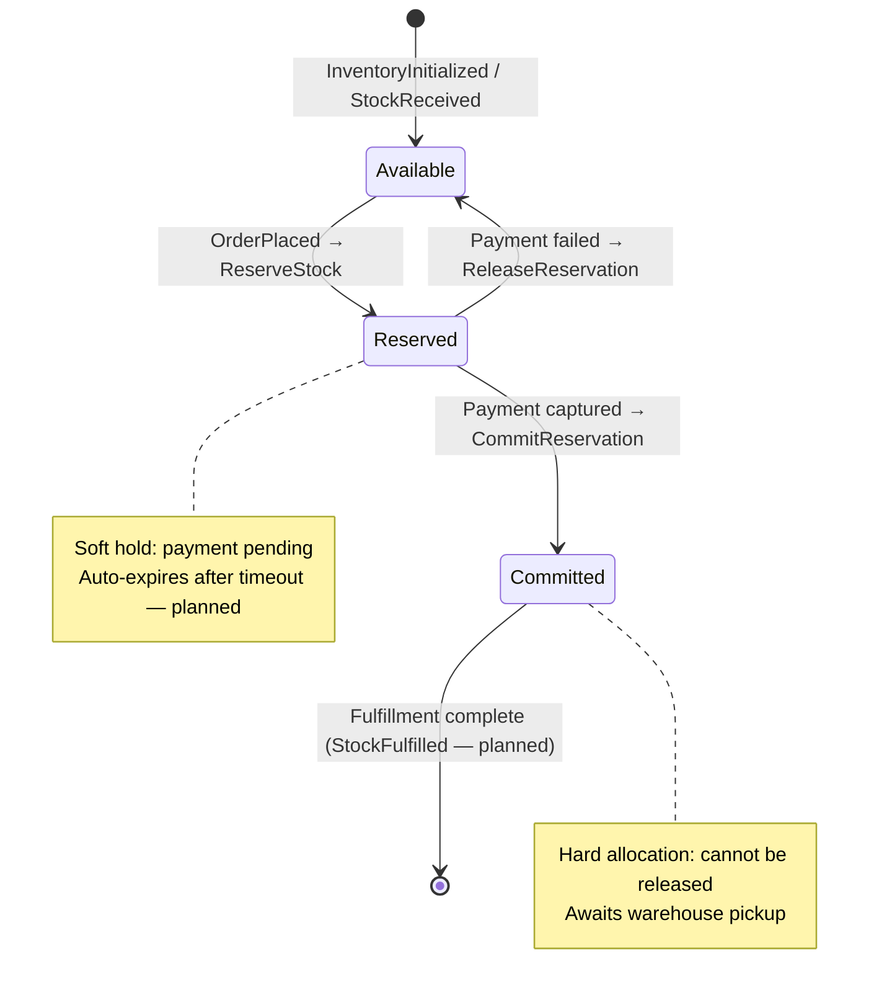
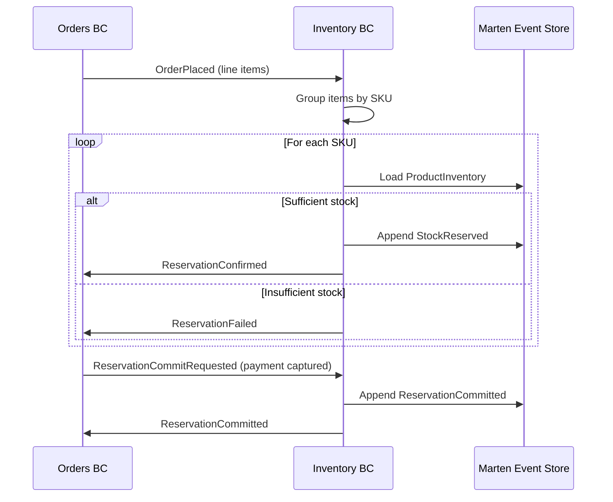
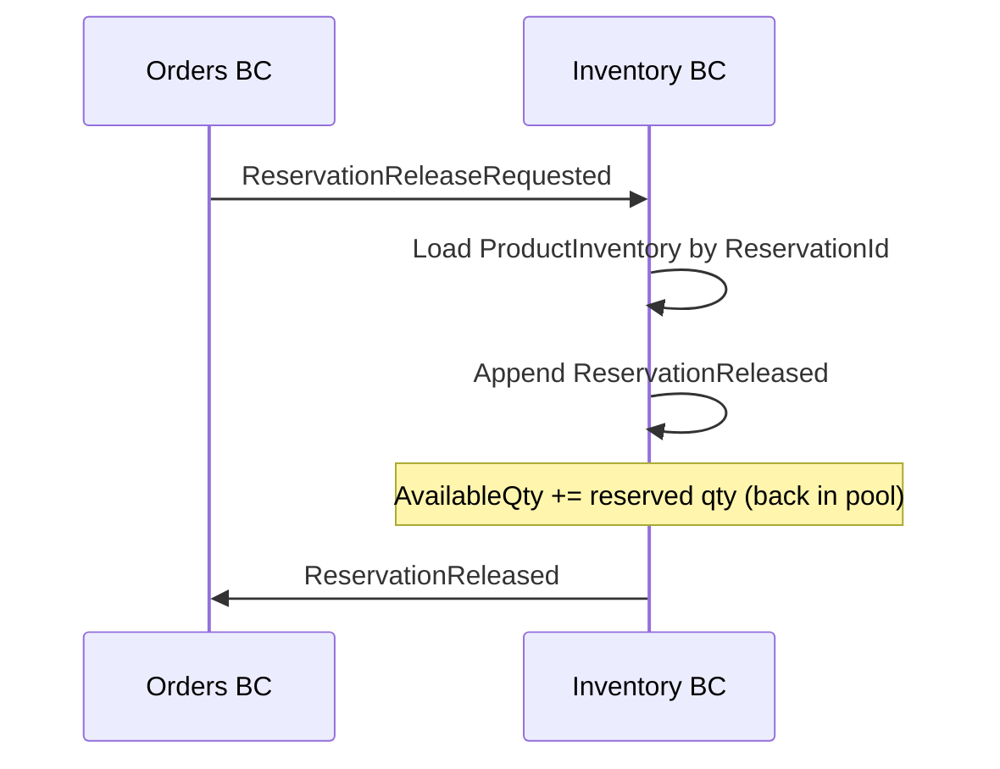
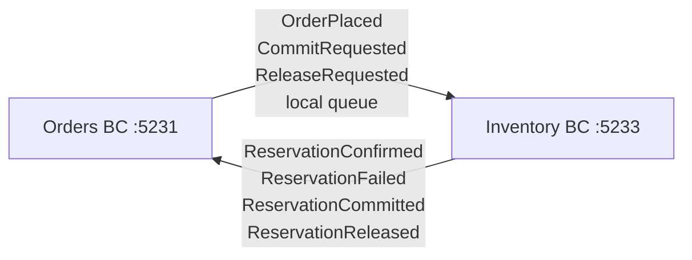

# Inventory — Two-Phase Stock Reservation

> Manages stock levels and availability using a reserve-then-commit pattern to prevent overselling while supporting graceful order cancellation.

| Attribute | Value |
|-----------|-------|
| Pattern | Event Sourcing (Marten) |
| Database | Marten / PostgreSQL (event store) |
| Messaging | Receives events from Orders BC via local queue; publishes reservation outcomes via local queue ⚠️ |
| Port (local) | **5233** |

## What This BC Does

Inventory owns stock quantities across warehouses using three distinct pools: **Available** (open to new reservations), **Reserved** (soft hold while payment is pending), and **Committed** (hard allocation awaiting fulfillment). This prevents overselling while allowing stock to be returned to the available pool if payment fails. All stock changes are recorded as events on the `ProductInventory` aggregate, giving a complete audit trail.

## Key Concepts

| Concept | Type | Description |
|---------|------|-------------|
| `ProductInventory` | Event-sourced aggregate | Per-SKU per-warehouse stock state |
| `AvailableQuantity` | `int` | Stock open for new reservations |
| `Reservations` | `Dictionary<Guid, int>` | Soft holds (reservationId → quantity) |
| `CommittedAllocations` | `Dictionary<Guid, int>` | Hard allocations (payment captured) |
| `ReservationId` | `Guid` | Links a reservation to its order for release/commit |

## Workflows

### Two-Phase Reservation

### Reserve → Commit Flow

### Compensation: Release on Payment Failure

## Commands & Events

### Commands

| Command | Handler | Trigger |
|---------|---------|---------|
| `InitializeInventory` | `InitializeInventoryHandler` | Admin adds new SKU to a warehouse |
| `ReceiveStock` | `ReceiveStockHandler` | New shipment arrives at warehouse |
| `ReserveStock` | `ReserveStockHandler` | Triggered by `OrderPlaced` (per SKU) |
| `CommitReservation` | `ReservationCommitRequestedHandler` | Orders sends commit after payment captured |
| `ReleaseReservation` | `ReservationReleaseRequestedHandler` | Orders sends release after payment failure |

### Domain Events (ProductInventory Stream)

| Event | State Change |
|-------|-------------|
| `InventoryInitialized` | Aggregate created with initial quantity |
| `StockReceived` | `AvailableQuantity += qty` |
| `StockReserved` | `Available -= qty`; `Reservations[id] = qty` |
| `ReservationCommitted` | `Reservations[id]` removed; `CommittedAllocations[id] = qty` |
| `ReservationReleased` | `Reservations[id]` removed; `Available += qty` |
| `StockRestocked` | Adjustments / returns |

### Integration Events

**Published (to Orders BC — local queue):**

| Event | Trigger |
|-------|---------|
| `Inventory.ReservationConfirmed` | Successful soft hold |
| `Inventory.ReservationFailed` | Insufficient stock |
| `Inventory.ReservationCommitted` | Hard allocation recorded |
| `Inventory.ReservationReleased` | Soft hold released |

**Received (from Orders BC — local queue):**

| Event | Handler |
|-------|---------|
| `Orders.OrderPlaced` | `OrderPlacedHandler` — creates `ReserveStock` commands per SKU |
| `Orders.ReservationCommitRequested` | `ReservationCommitRequestedHandler` |
| `Orders.ReservationReleaseRequested` | `ReservationReleaseRequestedHandler` |

## Integration Map

## Implementation Status

| Feature | Status |
|---------|--------|
| Reserve / Commit / Release handlers | ✅ Complete |
| Event-sourced ProductInventory aggregate | ✅ Complete |
| Multi-SKU order handling (per-SKU reservation) | ✅ Complete |
| Compensation flow (release on payment failure) | ✅ Complete |
| Stock initialization + receive stock | ✅ Complete |
| Integration tests (6 passing) | ✅ Complete |
| Warehouse routing | ⚠️ Hardcoded `WH-01` |
| RabbitMQ integration | ❌ Local queues only |
| Idempotency (duplicate `OrderPlaced`) | ❌ Not implemented |
| Reservation timeout / auto-release | ❌ Not implemented |
| Concurrency load tests | ❌ Not done |
| Low stock alerts (`InventoryLow` events) | ❌ Not implemented |

## Gaps & Roadmap

| Gap | Impact | Planned Cycle |
|-----|--------|---------------|
| Local queues — messages lost on restart | Reservation events lost; orders stuck | Cycle 19 |
| No idempotency — duplicate `OrderPlaced` over-reserves | Inventory leakage | Cycle 20 |
| Reservations never expire | Abandoned orders lock stock forever | Cycle 21 |
| Warehouse hardcoded to `WH-01` | Cannot support multiple warehouses | Cycle 22 |
| No low stock alerts | Cannot trigger reordering or "limited stock" badges | Cycle 22 |
| `CommittedAllocations` never pruned | Aggregate size grows unbounded | Cycle 23 |

## 📖 Detailed Documentation

→ [`docs/workflows/inventory-workflows.md`](../../../docs/workflows/inventory-workflows.md)
