# Inventory — Two-Phase Stock Reservation

> Manages stock levels and availability using a reserve-then-commit pattern to prevent overselling while supporting graceful order cancellation.

| Attribute | Value |
|-----------|-------|
| Pattern | Event Sourcing (Marten) |
| Database | Marten / PostgreSQL (event store) |
| Messaging | Receives events from Orders BC via local queue; publishes reservation outcomes via local queue ⚠️ |
| Port (local) | **5233** |

> **This document is a working artifact** for PO + UX collaboration. Open questions are tracked in the [`🤔 Open Questions`](#-open-questions-for-product-owner--ux) section.

## What This BC Does

Inventory owns stock quantities across warehouses using three distinct pools: **Available** (open to new reservations), **Reserved** (soft hold while payment is pending), and **Committed** (hard allocation awaiting fulfillment). This prevents overselling while allowing stock to be returned to the available pool if payment fails. All stock changes are recorded as events on the `ProductInventory` aggregate, giving a complete audit trail.

## Key Concepts

| Concept | Type | Description |
|---------|------|-------------|
| `ProductInventory` | Event-sourced aggregate | Per-SKU per-warehouse stock state |
| `AvailableQuantity` | `int` | Stock open for new reservations |
| `Reservations` | `Dictionary<Guid, int>` | Soft holds (reservationId → quantity) |
| `CommittedAllocations` | `Dictionary<Guid, int>` | Hard allocations (payment captured) |
| `ReservationId` | `Guid` | Links a reservation to its order for release/commit |

## Workflows

### Stock State Machine — Complete (All Paths)

```mermaid
stateDiagram-v2
    [*] --> Available : InventoryInitialized / StockReceived

    Available --> Reserved : OrderPlaced → StockReserved ✅
    Available --> Available : OrderPlaced → ReservationFailed ❌ (insufficient stock)

    Reserved --> Available : Payment failed → ReservationReleased ✅ compensation event
    Reserved --> Available : Saga timeout → ReservationExpired ⚠️ not yet implemented
    Reserved --> Committed : Payment captured → ReservationCommitted ✅

    Committed --> Available : Return accepted → StockRestocked ✅ compensation event
    Committed --> [*] : Fulfillment complete → StockFulfilled ⚠️ planned

    note right of Reserved
        Soft hold: payment pending.
        AvailableQty is REDUCED.
        No timeout enforced today —
        abandoned orders lock stock forever.
    end note
    note right of Committed
        Hard allocation: cannot be released.
        CommittedAllocations grows unbounded
        — never pruned today.
    end note
    note right of Available
        ⚠️ Race condition: two concurrent OrderPlaced
        events may both see Available >= 1 for the last unit.
        No optimistic concurrency control today.
        (See Off-Path Scenario 1: Last-Unit Race Condition below)
    end note
```

### Reserve → Commit Flow

### Compensation: Release on Payment Failure

## Commands & Events

### Commands (Message-Driven)

> Commands are triggered internally by incoming integration events, not directly by HTTP calls.

| Command | Handler | Trigger |
|---------|---------|---------|
| `InitializeInventory` | `InitializeInventoryHandler` | Admin adds new SKU to a warehouse |
| `ReceiveStock` | `ReceiveStockHandler` | New shipment arrives at warehouse |
| `ReserveStock` | `ReserveStockHandler` | Triggered by `OrderPlaced` (per SKU) |
| `CommitReservation` | `ReservationCommitRequestedHandler` | Orders sends commit after payment captured |
| `ReleaseReservation` | `ReservationReleaseRequestedHandler` | Orders sends release after payment failure |

### Domain Events

| Event | State Change |
|-------|-------------|
| `InventoryInitialized` | Aggregate created with initial quantity |
| `StockReceived` | `AvailableQuantity += qty` |
| `StockReserved` | `Available -= qty`; `Reservations[id] = qty` |
| `ReservationCommitted` | `Reservations[id]` removed; `CommittedAllocations[id] = qty` |
| `ReservationReleased` | `Reservations[id]` removed; `Available += qty` |
| `StockRestocked` | Adjustments / returns |

### Integration Events

#### Published

| Event | Trigger |
|-------|---------|
| `Inventory.ReservationConfirmed` | Successful soft hold |
| `Inventory.ReservationFailed` | Insufficient stock |
| `Inventory.ReservationCommitted` | Hard allocation recorded |
| `Inventory.ReservationReleased` | Soft hold released |

#### Received

| Event | Handler |
|-------|---------|
| `Orders.OrderPlaced` | `OrderPlacedHandler` — creates `ReserveStock` commands per SKU |
| `Orders.ReservationCommitRequested` | `ReservationCommitRequestedHandler` |
| `Orders.ReservationReleaseRequested` | `ReservationReleaseRequestedHandler` |

## Integration Map

## Implementation Status

| Feature | Status |
|---------|--------|
| Reserve / Commit / Release handlers | ✅ Complete |
| Event-sourced ProductInventory aggregate | ✅ Complete |
| Multi-SKU order handling (per-SKU reservation) | ✅ Complete |
| Compensation flow (release on payment failure) | ✅ Complete |
| Stock initialization + receive stock | ✅ Complete |
| Integration tests (6 passing) | ✅ Complete |
| Warehouse routing | ⚠️ Hardcoded `WH-01` |
| RabbitMQ integration | ❌ Local queues only |
| Idempotency (duplicate `OrderPlaced`) | ❌ Not implemented |
| Reservation timeout / auto-release | ❌ Not implemented |
| Concurrency load tests | ❌ Not done |
| Low stock alerts (`InventoryLow` events) | ❌ Not implemented |

## Compensation Event Registry

Compensation events are **first-class domain events appended to the ProductInventory event stream**. They reverse prior stock movements without mutating past events.

| Compensation Event | Recorded In | Triggered By | What It Restores |
|-------------------|-------------|-------------|-----------------|
| `ReservationReleased` | ProductInventory event stream (`{sku}-{warehouseId}`) | `ReservationReleaseRequested` from Orders (payment failure / saga cancellation) | Returns soft-held stock to Available pool |
| `StockRestocked` | ProductInventory event stream | Return accepted (manual admin, or future Returns BC) | Returns committed stock to Available after inspection |
| Future: `ReservationExpired` | ProductInventory event stream | TTL background job | Auto-releases soft holds after timeout |
| Future: `StockAdjusted` | ProductInventory event stream | Physical count correction by warehouse manager | Reconciles system quantity with physical reality |

> **Why not update the Available quantity directly?** Because the event stream IS the audit trail. If we just updated `AvailableQuantity` in a document, we'd lose the ability to answer "why does my inventory count not match my purchase orders?" Event sourcing gives us stock movement history for free.

## Off-Path Scenarios

### Scenario 1: Last-Unit Race Condition

```mermaid
sequenceDiagram
    participant OrderA as Order A Saga
    participant OrderB as Order B Saga
    participant Inv as Inventory BC
    participant Marten as Marten Event Store

    Note over Inv: ProductInventory for SKU "DOG-FOOD-5KG" has AvailableQty = 1

    par Simultaneous reservations
        OrderA->>Inv: OrderPlaced → ReserveStock {sku, qty:1, reservationId: A}
        OrderB->>Inv: OrderPlaced → ReserveStock {sku, qty:1, reservationId: B}
    end

    Note over Inv: Handler A loads aggregate: Available=1 ✅ sufficient
    Note over Inv: Handler B loads aggregate: Available=1 ✅ sufficient (no lock yet!)

    Inv->>Marten: Append StockReserved {A} → Available becomes 0
    Inv->>Marten: Append StockReserved {B} → Available becomes -1 ❌ OVERSELL

    Inv->>OrderA: ReservationConfirmed ✅
    Inv->>OrderB: ReservationConfirmed ✅ ← both succeed, but only 1 unit exists

    Note over Inv: ❌ Physical warehouse has 1 unit but 2 orders claim it
    Note over Inv: Discovered only at pick-time in warehouse
```

**Current behavior:** No optimistic concurrency on the `ProductInventory` aggregate. Under concurrent load, the last unit can be over-reserved. Marten event store does have `AppendOptimistic` capability — not yet used.

### Scenario 2: Reservation Timeout — Stock Never Released

**Current behavior:** Reservations never expire. Without a saga timeout in Orders, `ReservationReleaseRequested` is never sent. Stock is locked indefinitely. No `ReservationExpired` event or background job exists.

### Scenario 3: Return Restocking — Returned Items Back in Pool

```mermaid
sequenceDiagram
    participant Returns as Returns BC (future)
    participant Inv as Inventory BC
    participant Warehouse as Warehouse Inspector

    Note over Returns: Customer returns "Cat Tower Deluxe"
    Returns->>Warehouse: Return received — inspect item
    Warehouse->>Warehouse: Inspect: item is in sellable condition

    Note over Inv: TODAY: No Returns BC. Manual admin process required.
    Warehouse->>Inv: POST /api/inventory/{sku}/restock {qty: 1, warehouseId: WH-01}
    Inv->>Inv: Append StockRestocked {qty: 1} ← compensation event
    Note over Inv: AvailableQty += 1
    Note over Inv: Item back in pool for new orders ✅

    Note over Warehouse: Inspect: item is damaged — cannot resell
    Warehouse->>Inv: POST /api/inventory/{sku}/adjust {qty: -1, reason: "damaged_return"}
    Inv->>Inv: Append StockAdjusted {qty: -1, reason: "damaged_return"} ← compensation event
    Note over Inv: AvailableQty unchanged (was already 0 for committed)
    Note over Inv: ⚠️ Future: write-off event for financial reporting?
```

**Current behavior:** `StockRestocked` command exists but no Returns BC orchestrates the workflow. Manual admin API call required.

### Scenario 4: Physical Count Discrepancy

```mermaid
sequenceDiagram
    participant WH as Warehouse Manager
    participant Inv as Inventory BC

    Note over WH: Annual inventory count reveals discrepancy
    Note over Inv: System says: AvailableQty = 47 for "Bird Seed Premium"
    Note over WH: Physical count = 43 (4 units missing — theft? damage? receiving error?)

    WH->>Inv: POST /api/inventory/{sku}/adjust {qty: -4, reason: "count_correction", authorizedBy: "mgr-jane"}
    Inv->>Inv: Append StockAdjusted {qty: -4, reason: "count_correction"} ← compensation event
    Note over Inv: AvailableQty: 47 → 43 ✅
    Note over Inv: Full audit trail: count correction recorded with who authorized it

    Note over Inv: ⚠️ TODAY: StockAdjusted is planned but not yet implemented
    Note over Inv: Manual adjustments require DB intervention or custom endpoint
```

**Current behavior:** No `StockAdjusted` event or admin endpoint for count corrections.

## 🤔 Open Questions for Product Owner & UX

---

**Q1: If one SKU in a multi-item order is out of stock, do you fail the whole order or ship what's available?**
- **Option A: All-or-nothing (current)** — If any SKU fails reservation, send `ReservationFailed` for entire order. All stock reserved so far is released.  
  *Engineering: Zero — already implemented*
- **Option B: Ship available, cancel the rest** — Reserve available items, cancel unavailable, partial refund issued.  
  *Engineering: High — per-line-item saga state + partial refund logic*
- **Option C: Ship available, backorder the rest** — Reserve available items, backorder out-of-stock items when they arrive.  
  *Engineering: Very High — backorder queue, stock arrival triggers, split fulfillment*
- **Current behavior:** Option A — all-or-nothing.
- **Business risk if unresolved:** A customer ordering 5 items where 1 is OOS gets their entire order cancelled. Petco and Chewy both offer "ship what's available." This is a major conversion factor.

---

**Q2: How long should an uncommitted reservation (soft hold) last before auto-releasing?**
- **Option A: 30 minutes** — Tight TTL. Prevents stock lock-up from abandoned checkouts.  
  *Engineering: Medium — Wolverine scheduled messages per reservation*
- **Option B: 24 hours** — Gives customers time to complete payment even if they pause.  
  *Engineering: Medium — same infrastructure*
- **Option C: Until saga cancels (current)** — No TTL. Reservations last forever unless Orders explicitly releases.  
  *Engineering: Zero*
- **Current behavior:** Option C — reservations never expire automatically.
- **Business risk if unresolved:** Popular items during peak season (e.g., holiday pet gifts) can be locked by abandoned checkouts, making products appear sold out to other customers.

---

**Q3: What triggers a low stock alert, and who receives it?**
- **Option A: Absolute threshold** — When `AvailableQty < N` (configurable per SKU), publish `InventoryLow` event.  
  *Engineering: Low — inline projection or event handler checking threshold*
- **Option B: Percentage of reorder point** — When `AvailableQty < 20%` of typical reorder quantity.  
  *Engineering: Medium — requires reorder point configuration per SKU*
- **Option C: No alerts (current)** — Staff checks manually.  
  *Engineering: Zero*
- **Current behavior:** Option C — no `InventoryLow` event implemented.
- **Business risk if unresolved:** Warehouse goes to zero stock without warning. Orders fail at reservation, causing cancellations. No time to reorder.

---

**Q4: How should physical count corrections be authorized and applied?**
- **Option A: Any admin can adjust** — Single admin role can post count corrections.  
  *Engineering: Low — simple endpoint with admin auth check*
- **Option B: Two-person authorization** — Requires two manager sign-offs for corrections > 10 units.  
  *Engineering: High — approval workflow needed*
- **Option C: Audit-only, no system adjustment** — Corrections are recorded as notes but system quantity is adjusted manually.  
  *Engineering: Zero*
- **Current behavior:** No mechanism — manual DB intervention.
- **Business risk if unresolved:** Inventory discrepancies compound over time. System count drifts from physical reality. Reservation failures increase.

## Gaps & Roadmap

| Gap | Impact | Planned Cycle |
|-----|--------|---------------|
| Local queues — messages lost on restart | Reservation events lost; orders stuck | Cycle 19 |
| No idempotency — duplicate `OrderPlaced` over-reserves | Inventory leakage | Cycle 20 |
| Reservations never expire | Abandoned orders lock stock forever | Cycle 21 |
| Warehouse hardcoded to `WH-01` | Cannot support multiple warehouses | Cycle 22 |
| No low stock alerts | Cannot trigger reordering or "limited stock" badges | Cycle 22 |
| `CommittedAllocations` never pruned | Aggregate size grows unbounded | Cycle 23 |

## 📖 Detailed Documentation

→ [`docs/workflows/inventory-workflows.md`](../../../docs/workflows/inventory-workflows.md)
