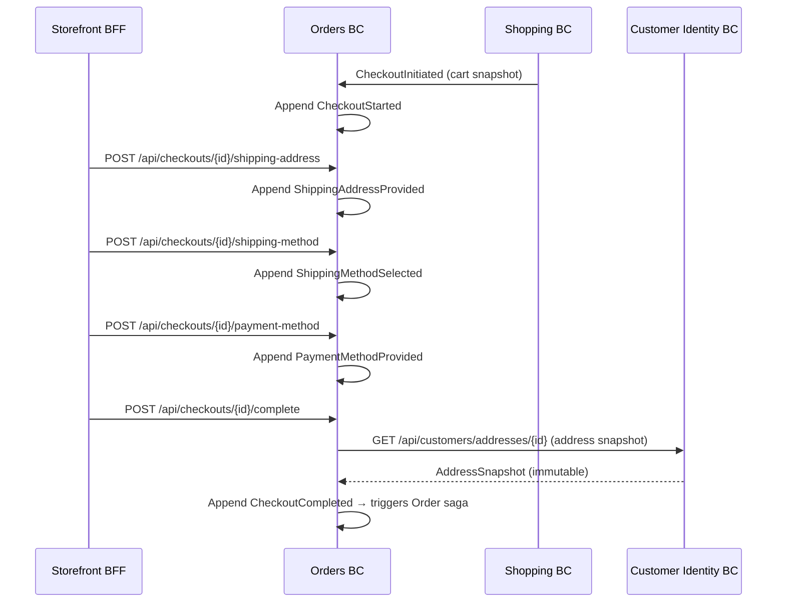
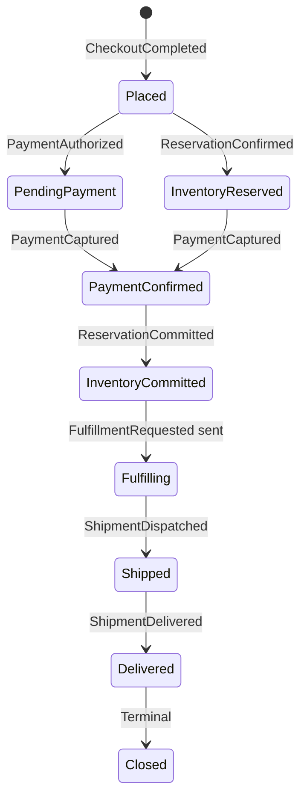
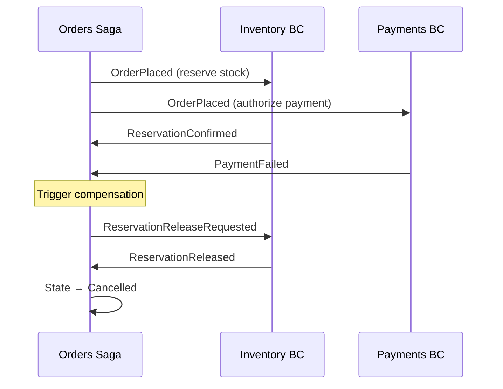
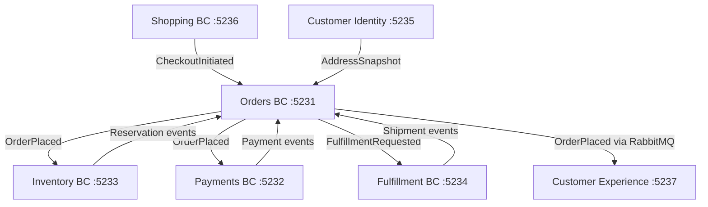

# Orders — Checkout Wizard & Order Orchestration Saga

> Owns the commercial commitment phase: finalizes checkout details and orchestrates inventory, payments, and fulfillment via a stateful saga.

| Attribute | Value |
|-----------|-------|
| Pattern | Event Sourcing (Checkout) + Saga Document Store (Order) |
| Database | Marten / PostgreSQL |
| Messaging | Publishes `OrderPlaced` → `storefront-notifications`; receives events from Inventory, Payments, Fulfillment via local queues |
| Port (local) | **5231** |

## What This BC Does

Orders owns two closely related workflows. First, a **multi-step checkout wizard** lets customers select a shipping address, shipping method, and payment method before confirming purchase. Second, an **Order Saga** orchestrates the downstream BCs — reserving inventory, capturing payment, and requesting fulfillment — with compensation logic when things go wrong. Orders is the single source of truth for where an order stands in its lifecycle.

## Key Concepts

| Concept | Type | Description |
|---------|------|-------------|
| `Checkout` | Event-sourced aggregate | Multi-step wizard state (`CheckoutStarted` → `CheckoutCompleted`) |
| `Order` | Saga (Marten document) | Coordinates Inventory + Payments + Fulfillment; tracks saga state |
| `OrderStatus` | Enum | Full lifecycle from `Placed` through `Delivered` / `Cancelled` |
| `CheckoutLineItem` | Value object | Snapshot of cart items at checkout time (price-at-checkout guarantee) |

## Workflows

### Checkout Wizard

### Order Saga — Happy Path

### Order Saga — Compensation (Payment Failure)

## Commands & Events

### Checkout Commands

| Command | Handler | Purpose |
|---------|---------|---------|
| `ProvideShippingAddress` | `ProvideShippingAddressHandler` | Select saved customer address |
| `SelectShippingMethod` | `SelectShippingMethodHandler` | Choose Standard / Express / Overnight |
| `ProvidePaymentMethod` | `ProvidePaymentMethodHandler` | Supply payment token |
| `CompleteCheckout` | `CompleteCheckoutHandler` | Resolve address snapshot, trigger Order saga |

### Checkout Events

| Event | Description |
|-------|-------------|
| `CheckoutStarted` | Checkout stream created from Shopping handoff |
| `ShippingAddressProvided` | Customer selected delivery address |
| `ShippingMethodSelected` | Shipping tier chosen |
| `PaymentMethodProvided` | Payment token recorded |
| `CheckoutCompleted` | All details confirmed; terminal — Order saga created |

### Integration Events

**Published:**

| Event | Queue | Subscribers |
|-------|-------|-------------|
| `Orders.OrderPlaced` | `storefront-notifications` + local queues | Customer Experience, Inventory, Payments |
| `Orders.ReservationCommitRequested` | Local queue ⚠️ | Inventory BC |
| `Orders.ReservationReleaseRequested` | Local queue ⚠️ | Inventory BC |
| `Orders.FulfillmentRequested` | Local queue ⚠️ | Fulfillment BC |

**Received:**

| Event | From | Effect |
|-------|------|--------|
| `Shopping.CheckoutInitiated` | Shopping BC | Creates Checkout stream |
| `Inventory.ReservationConfirmed` | Inventory BC | Saga: `InventoryReserved` |
| `Inventory.ReservationFailed` | Inventory BC | Saga: trigger compensation |
| `Inventory.ReservationCommitted` | Inventory BC | Saga: `InventoryCommitted` → request fulfillment |
| `Inventory.ReservationReleased` | Inventory BC | Saga: `Cancelled` |
| `Payments.PaymentAuthorized` | Payments BC | Saga: `PendingPayment` |
| `Payments.PaymentCaptured` | Payments BC | Saga: `PaymentConfirmed` → commit inventory |
| `Payments.PaymentFailed` | Payments BC | Saga: release inventory |
| `Fulfillment.ShipmentDispatched` | Fulfillment BC | Saga: `Shipped` |
| `Fulfillment.ShipmentDelivered` | Fulfillment BC | Saga: `Delivered` |

## API Endpoints

| Method | Path | Description |
|--------|------|-------------|
| `POST` | `/api/checkouts/{id}/shipping-address` | Select shipping address |
| `POST` | `/api/checkouts/{id}/shipping-method` | Choose shipping method |
| `POST` | `/api/checkouts/{id}/payment-method` | Provide payment token |
| `POST` | `/api/checkouts/{id}/complete` | Complete checkout |
| `GET` | `/api/checkouts/{id}` | Get checkout state |
| `GET` | `/api/orders/{id}` | Get order details |
| `GET` | `/api/orders?customerId=...` | List orders for customer |

## Integration Map

## Implementation Status

| Feature | Status |
|---------|--------|
| Checkout wizard (4-step) | ✅ Complete |
| Address snapshot from Customer Identity | ✅ Complete |
| Order saga creation | ✅ Complete |
| Inventory orchestration (reserve/commit/release) | ✅ Complete |
| Payment orchestration (authorize/capture) | ✅ Complete |
| Fulfillment orchestration (request/dispatch/deliver) | ✅ Complete |
| `OrderPlaced` → RabbitMQ (storefront-notifications) | ✅ Complete |
| Integration tests (32 passing) | ✅ Complete |
| Compensation: inventory release on payment failure | ✅ Complete |
| Compensation: refund on inventory failure | ❌ Incomplete — saga doesn't handle `RefundCompleted` |
| Inventory/Payments/Fulfillment → RabbitMQ (durable) | ❌ Local queues only |
| Saga timeout / OnHold state | ❌ Not implemented |
| Retry logic for transient failures | ❌ Not implemented |

## Gaps & Roadmap

| Gap | Impact | Planned Cycle |
|-----|--------|---------------|
| Refund compensation incomplete — `RefundCompleted` not handled | Order stuck in `InventoryFailed`; customer charged without delivery | Cycle 19 |
| Inventory/Payment/Fulfillment messages on local queues | Data loss on restart | Cycle 19 |
| No saga timeout | Stuck sagas accumulate indefinitely | Cycle 19 |
| No idempotency keys | Duplicate events create duplicate reservations | Cycle 20 |
| No order cancellation endpoint | Customers cannot cancel placed orders | Cycle 21 |

## 📖 Detailed Documentation

→ [`docs/workflows/orders-workflows.md`](../../../docs/workflows/orders-workflows.md)
