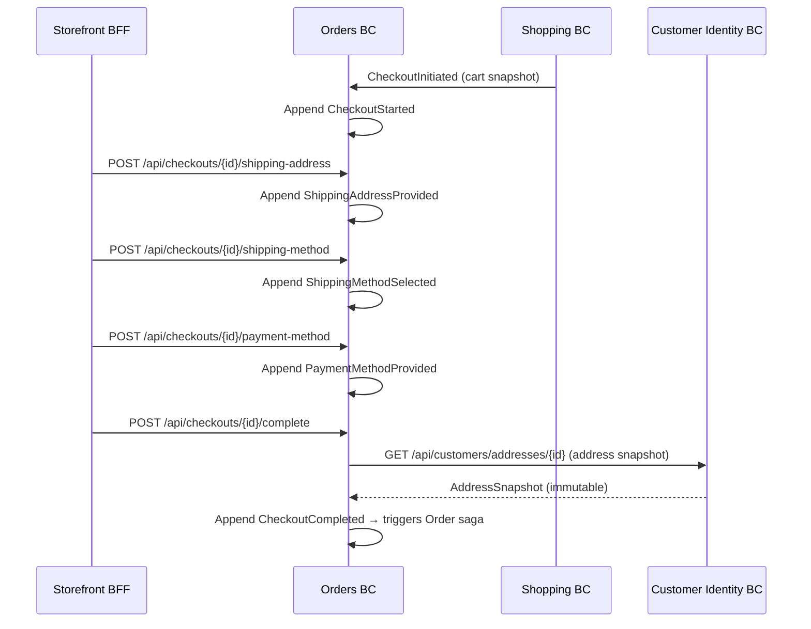
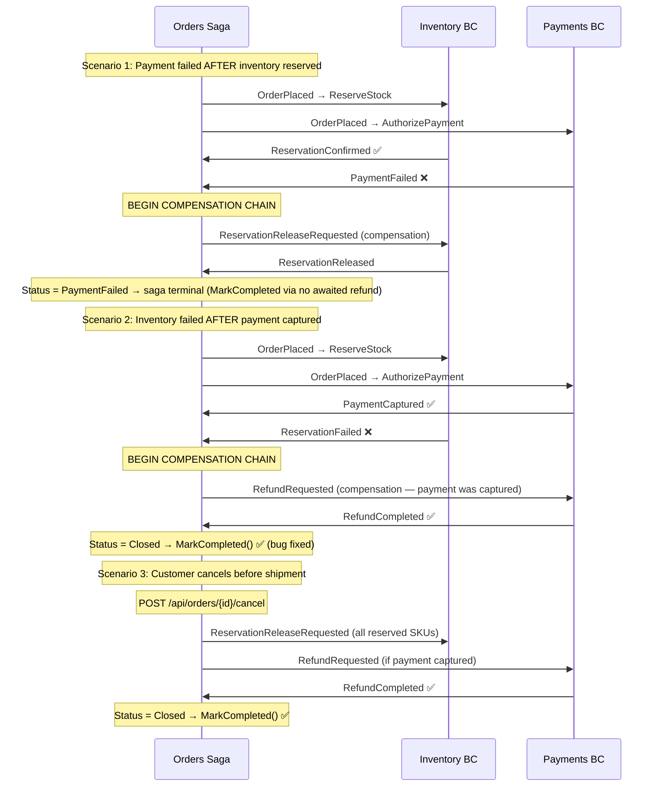
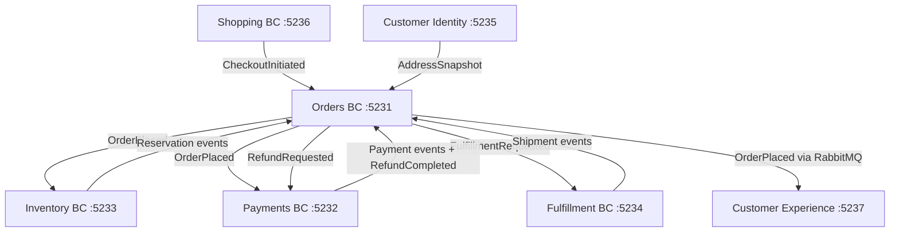
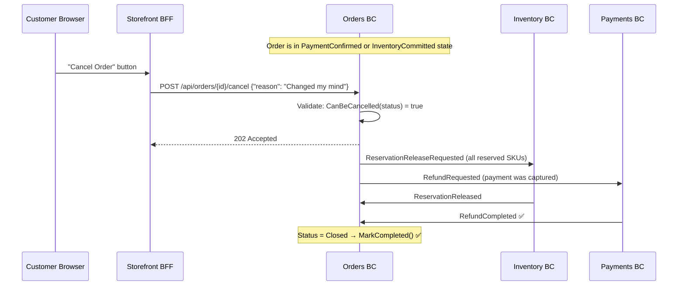
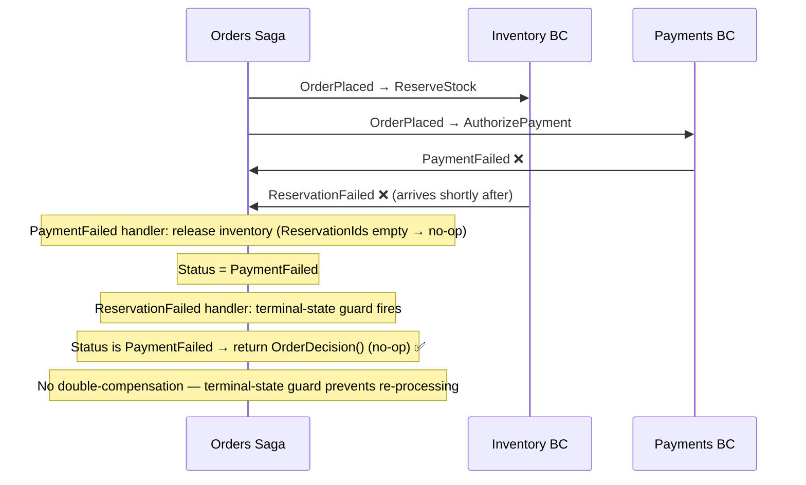
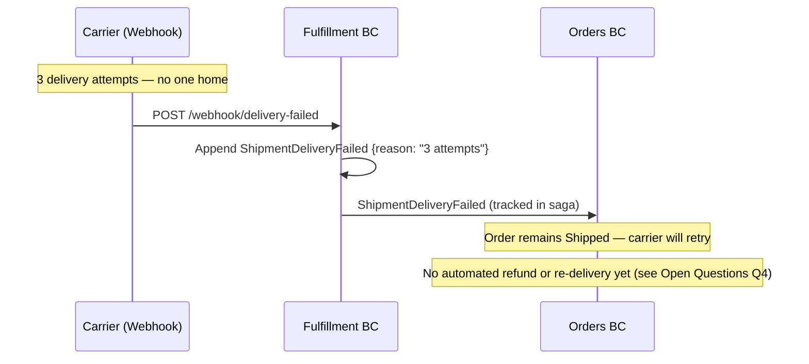

# Orders — Checkout Wizard & Order Orchestration Saga

> Owns the commercial commitment phase: finalizes checkout details and orchestrates inventory, payments, and fulfillment via a stateful saga.

| Attribute | Value |
|-----------|-------|
| Pattern | Event Sourcing (Checkout) + Saga Document Store (Order) |
| Database | Marten / PostgreSQL |
| Messaging | Publishes `OrderPlaced` → `storefront-notifications`; receives events from Inventory, Payments, Fulfillment via local queues |
| Port (local) | **5231** |

> **This document is a working artifact** for PO + UX collaboration. Open questions are tracked in the [`🤔 Open Questions`](#-open-questions-for-product-owner--ux) section.

## What This BC Does

Orders owns two closely related workflows. First, a **multi-step checkout wizard** lets customers select a shipping address, shipping method, and payment method before confirming purchase. Second, an **Order Saga** orchestrates the downstream BCs — reserving inventory, capturing payment, and requesting fulfillment — with compensation logic when things go wrong. Orders is the single source of truth for where an order stands in its lifecycle.

## Key Concepts

| Concept | Type | Description |
|---------|------|-------------|
| `Checkout` | Event-sourced aggregate | Multi-step wizard state (`CheckoutStarted` → `CheckoutCompleted`) |
| `Order` | Saga (Marten document) | Coordinates Inventory + Payments + Fulfillment; tracks saga state |
| `OrderStatus` | Enum | Full lifecycle from `Placed` through `Delivered` / `Cancelled` / `Closed` |
| `CheckoutLineItem` | Value object | Snapshot of cart items at checkout time (price-at-checkout guarantee) |

## Workflows

### Checkout Wizard


```mermaid
sequenceDiagram
    participant BFF as Storefront BFF
    participant Orders as Orders BC
    participant Shopping as Shopping BC
    participant CI as Customer Identity BC

    Shopping->>Orders: CheckoutInitiated (cart snapshot)
    Orders->>Orders: Append CheckoutStarted

    BFF->>Orders: POST /api/checkouts/{id}/shipping-address
    Orders->>Orders: Append ShippingAddressProvided

    BFF->>Orders: POST /api/checkouts/{id}/shipping-method
    Orders->>Orders: Append ShippingMethodSelected

    BFF->>Orders: POST /api/checkouts/{id}/payment-method
    Orders->>Orders: Append PaymentMethodProvided

    BFF->>Orders: POST /api/checkouts/{id}/complete
    Orders->>CI: GET /api/customers/addresses/{id} (address snapshot)
    CI-->>Orders: AddressSnapshot (immutable)
    Orders->>Orders: Append CheckoutCompleted → triggers Order saga
```

### Order Saga — Complete State Machine (All Paths)

```mermaid
stateDiagram-v2
    [*] --> Placed : CheckoutCompleted → OrderPlaced

    Placed --> InventoryReserved : ReservationConfirmed (all SKUs ✅)
    Placed --> PendingPayment : PaymentAuthorized (two-phase flow)
    Placed --> OutOfStock : ReservationFailed ❌ → RefundRequested (if payment captured)

    PendingPayment --> PaymentConfirmed : PaymentCaptured ✅
    PendingPayment --> PaymentFailed : PaymentFailed ❌

    InventoryReserved --> PaymentConfirmed : PaymentCaptured ✅
    InventoryReserved --> PaymentFailed : PaymentFailed ❌ → release inventory

    PaymentFailed --> [*] : Terminal — inventory released

    OutOfStock --> Closed : RefundCompleted ✅ → MarkCompleted()
    note right of OutOfStock
        RefundCompleted closes OutOfStock orders.
        Both Cancelled and OutOfStock go through
        the same HandleRefundCompleted path.
    end note

    PaymentConfirmed --> InventoryCommitted : ReservationCommitted (all SKUs ✅)
    InventoryCommitted --> Fulfilling : FulfillmentRequested sent

    Fulfilling --> Shipped : ShipmentDispatched
    Shipped --> Delivered : ShipmentDelivered ✅
    Shipped --> Shipped : ShipmentDeliveryFailed ⚠️ (carrier retries)

    Delivered --> Closed : ReturnWindowExpired (30 days) → MarkCompleted()

    Placed --> Cancelled : CancelOrder (before shipment)
    PendingPayment --> Cancelled : CancelOrder
    PaymentConfirmed --> Cancelled : CancelOrder
    InventoryCommitted --> Cancelled : CancelOrder

    Cancelled --> [*] : Terminal (no payment captured) — MarkCompleted() immediately
    Cancelled --> Closed : RefundCompleted ✅ → MarkCompleted()

    Closed --> [*] : Terminal ✅

    note right of OnHold
        ⚠️ OnHold state planned (fraud detection)
        but not yet implemented.
    end note
```

### Order Saga — Compensation Chain (Full)


```mermaid
sequenceDiagram
    participant Orders as Orders Saga
    participant Inventory as Inventory BC
    participant Payments as Payments BC

    Note over Orders: Scenario 1: Payment failed AFTER inventory reserved
    Orders->>Inventory: OrderPlaced → ReserveStock
    Orders->>Payments: OrderPlaced → AuthorizePayment
    Inventory->>Orders: ReservationConfirmed ✅
    Payments->>Orders: PaymentFailed ❌

    Note over Orders: BEGIN COMPENSATION CHAIN
    Orders->>Inventory: ReservationReleaseRequested (compensation)
    Inventory->>Orders: ReservationReleased
    Note over Orders: Status = PaymentFailed → saga terminal (MarkCompleted via no awaited refund)

    Note over Orders: Scenario 2: Inventory failed AFTER payment captured
    Orders->>Inventory: OrderPlaced → ReserveStock
    Orders->>Payments: OrderPlaced → AuthorizePayment
    Payments->>Orders: PaymentCaptured ✅
    Inventory->>Orders: ReservationFailed ❌

    Note over Orders: BEGIN COMPENSATION CHAIN
    Orders->>Payments: RefundRequested (compensation — payment was captured)
    Payments->>Orders: RefundCompleted ✅
    Note over Orders: Status = Closed → MarkCompleted() ✅ (bug fixed)

    Note over Orders: Scenario 3: Customer cancels before shipment
    Note over Orders: POST /api/orders/{id}/cancel
    Orders->>Inventory: ReservationReleaseRequested (all reserved SKUs)
    Orders->>Payments: RefundRequested (if payment captured)
    Payments->>Orders: RefundCompleted ✅
    Note over Orders: Status = Closed → MarkCompleted() ✅
```

## Commands & Events

### Commands

| Command | Handler | Purpose |
|---------|---------|---------|
| `ProvideShippingAddress` | `ProvideShippingAddressHandler` | Select saved customer address |
| `SelectShippingMethod` | `SelectShippingMethodHandler` | Choose Standard / Express / Overnight |
| `ProvidePaymentMethod` | `ProvidePaymentMethodHandler` | Supply payment token |
| `CompleteCheckout` | `CompleteCheckoutHandler` | Resolve address snapshot, trigger Order saga |
| `CancelOrder` | `Order.Handle(CancelOrder)` | Cancel an order before shipment |

### Domain Events

| Event | Description |
|-------|-------------|
| `CheckoutStarted` | Checkout stream created from Shopping handoff |
| `ShippingAddressProvided` | Customer selected delivery address |
| `ShippingMethodSelected` | Shipping tier chosen |
| `PaymentMethodProvided` | Payment token recorded |
| `CheckoutCompleted` | All details confirmed; terminal — Order saga created |

### Integration Events

#### Published

| Event | Queue | Subscribers |
|-------|-------|-------------|
| `Orders.OrderPlaced` | `storefront-notifications` (RabbitMQ) | Customer Experience (for real-time UI) |
| `Orders.OrderPlaced` | Local Wolverine queue ⚠️ | Inventory BC + Payments BC |
| `Orders.OrderCancelled` | Local queue ⚠️ | Downstream notification |
| `Orders.ReservationCommitRequested` | Local queue ⚠️ | Inventory BC |
| `Orders.ReservationReleaseRequested` | Local queue ⚠️ | Inventory BC |
| `Orders.FulfillmentRequested` | Local queue ⚠️ | Fulfillment BC |
| `Payments.RefundRequested` | Local queue ⚠️ | Payments BC (for cancellation / OutOfStock compensation) |

#### Received

| Event | From | Effect |
|-------|------|--------|
| `Shopping.CheckoutInitiated` | Shopping BC | Creates Checkout stream |
| `Inventory.ReservationConfirmed` | Inventory BC | Saga: tracks per-SKU reservation; transitions to `InventoryReserved` when all SKUs confirmed |
| `Inventory.ReservationFailed` | Inventory BC | Saga: transitions to `OutOfStock`; triggers compensation |
| `Inventory.ReservationCommitted` | Inventory BC | Saga: tracks per-SKU commits; dispatches fulfillment when all committed |
| `Inventory.ReservationReleased` | Inventory BC | Saga: compensation acknowledgement (no status change) |
| `Payments.PaymentAuthorized` | Payments BC | Saga: `PendingPayment` |
| `Payments.PaymentCaptured` | Payments BC | Saga: `PaymentConfirmed` → commit inventory |
| `Payments.PaymentFailed` | Payments BC | Saga: release inventory |
| `Payments.RefundCompleted` | Payments BC | Saga: closes `Cancelled` or `OutOfStock` orders → `MarkCompleted()` |
| `Payments.RefundFailed` | Payments BC | Saga: tracked for investigation (no status change) |
| `Fulfillment.ShipmentDispatched` | Fulfillment BC | Saga: `Shipped` |
| `Fulfillment.ShipmentDelivered` | Fulfillment BC | Saga: `Delivered` → schedules `ReturnWindowExpired` (30 days) |
| `Fulfillment.ShipmentDeliveryFailed` | Fulfillment BC | Saga: tracked; order remains `Shipped` (carrier retries) |

## API Endpoints

| Method | Path | Description | Status Codes |
|--------|------|-------------|-------------|
| `POST` | `/api/checkouts/{id}/shipping-address` | Select shipping address | 200, 404 |
| `POST` | `/api/checkouts/{id}/shipping-method` | Choose shipping method | 200, 404 |
| `POST` | `/api/checkouts/{id}/payment-method` | Provide payment token | 200, 404 |
| `POST` | `/api/checkouts/{id}/complete` | Complete checkout | 200, 404 |
| `GET` | `/api/checkouts/{id}` | Get checkout state | 200, 404 |
| `GET` | `/api/orders/{id}` | Get order details | 200, 404 |
| `GET` | `/api/orders?customerId=...` | List orders for customer | 200 |
| `POST` | `/api/orders/{id}/cancel` | Cancel an order (before shipment) | 202, 404, 409 |

### `POST /api/orders/{id}/cancel`

Cancels an order if it is in a cancellable state. Returns `409 Conflict` if the order is already shipped, delivered, closed, cancelled, out-of-stock, or payment-failed.

```json
// Request body
{ "reason": "Customer changed their mind" }

// 202 Accepted — cancellation command published to saga
// 409 Conflict — order cannot be cancelled at this stage
// 404 Not Found — order does not exist
```

The endpoint pre-validates the state before publishing `CancelOrder` to the saga. The saga also guards against duplicate cancellation messages (at-least-once delivery safety).

## Integration Map


```mermaid
flowchart TD
    Shopping[Shopping BC :5236] -->|CheckoutInitiated| Orders[Orders BC :5231]
    Orders -->|OrderPlaced| Inventory[Inventory BC :5233]
    Orders -->|OrderPlaced| Payments[Payments BC :5232]
    Orders -->|FulfillmentRequested| Fulfillment[Fulfillment BC :5234]
    Orders -->|OrderPlaced via RabbitMQ| CE[Customer Experience :5237]
    Orders -->|RefundRequested| Payments
    CI[Customer Identity :5235] -->|AddressSnapshot| Orders
    Inventory -->|Reservation events| Orders
    Payments -->|Payment events + RefundCompleted| Orders
    Fulfillment -->|Shipment events| Orders
```

## Implementation Status

| Feature | Status |
|---------|--------|
| Checkout wizard (4-step) | ✅ Complete |
| Address snapshot from Customer Identity | ✅ Complete |
| Order saga creation | ✅ Complete |
| Multi-SKU inventory tracking (`ExpectedReservationCount`) | ✅ Complete |
| Inventory orchestration (reserve/commit/release) | ✅ Complete |
| Payment orchestration (authorize/capture/refund) | ✅ Complete |
| Fulfillment orchestration (request/dispatch/deliver) | ✅ Complete |
| `OrderPlaced` → RabbitMQ (storefront-notifications) | ✅ Complete |
| Integration tests (45 passing) | ✅ Complete |
| Compensation: inventory release on payment failure | ✅ Complete |
| Compensation: refund on inventory/OutOfStock failure | ✅ Complete |
| Compensation: refund on cancellation | ✅ Complete |
| Order cancellation endpoint (`POST /api/orders/{id}/cancel`) | ✅ Complete |
| Return window lifecycle (30-day expiry → `Closed`) | ✅ Complete |
| Idempotency guards (duplicate message handling) | ✅ Complete |
| Inventory/Payments/Fulfillment → RabbitMQ (durable) | ❌ Local queues only |
| Saga timeout / OnHold state | ❌ Not implemented |

## Compensation Event Registry

Compensation events are **first-class events appended to event stores / saga documents** — never deletes. Each represents a new business fact that reverses or adjusts a prior outcome.

| Compensation Event | Recorded In | Triggered By | What It Restores |
|-------------------|-------------|-------------|-----------------|
| `OrderCancelled` | Order saga document (Marten) | Customer request / payment failure / inventory failure | Terminal state with reason code; triggers downstream compensation |
| `ReservationReleased` | ProductInventory event stream (Inventory BC) | `ReservationReleaseRequested` from Orders | Returns soft-held stock to available pool |
| `PaymentRefunded` | Payment event stream (Payments BC) | `RefundRequested` from Orders | Reverses captured charge; `TotalRefunded` incremented |
| `ShipmentDeliveryFailed` | Shipment event stream (Fulfillment BC) | Carrier webhook — delivery attempt failed | Records failure reason; order remains `Shipped` (carrier retries) |

> **The compensation chain is fully implemented:** Order `Cancelled`/`OutOfStock` → Inventory Released → Payment Refunded → `RefundCompleted` → saga closes (`Closed` + `MarkCompleted()`).

## Off-Path Scenarios

### Scenario 1: Customer Cancels After Payment, Before Shipment


```mermaid
sequenceDiagram
    participant Customer as Customer Browser
    participant BFF as Storefront BFF
    participant Orders as Orders BC
    participant Inventory as Inventory BC
    participant Payments as Payments BC

    Note over Orders: Order is in PaymentConfirmed or InventoryCommitted state
    Customer->>BFF: "Cancel Order" button
    BFF->>Orders: POST /api/orders/{id}/cancel {"reason": "Changed my mind"}
    Orders->>Orders: Validate: CanBeCancelled(status) = true
    Orders-->>BFF: 202 Accepted

    Orders->>Inventory: ReservationReleaseRequested (all reserved SKUs)
    Orders->>Payments: RefundRequested (payment was captured)
    Inventory->>Orders: ReservationReleased
    Payments->>Orders: RefundCompleted ✅
    Note over Orders: Status = Closed → MarkCompleted() ✅
```

**Current behavior:** ✅ Implemented. `POST /api/orders/{id}/cancel` validates state, publishes `CancelOrder` command. Saga triggers compensation chain. `RefundCompleted` closes the saga.

### Scenario 2: Inventory Fails After Payment Captured (Worst Case)

```mermaid
sequenceDiagram
    participant Orders as Orders Saga
    participant Inventory as Inventory BC
    participant Payments as Payments BC

    Note over Orders: Payment already CAPTURED (money taken from customer)
    Inventory-->>Orders: ReservationFailed (warehouse stock mismatch)

    Note over Orders: BEGIN COMPENSATION
    Orders->>Payments: RefundRequested {amount: full order amount}
    Payments->>Orders: RefundCompleted ✅

    Note over Orders: Status = Closed → MarkCompleted() ✅
    Note over Orders: Customer receives money back; order closes cleanly
```

**Current behavior:** ✅ Fixed. `RefundCompleted` is handled; `OutOfStock` orders with a captured payment close to `Closed` state after refund completes.

### Scenario 3: Both Inventory AND Payment Fail (Race Condition)


```mermaid
sequenceDiagram
    participant Orders as Orders Saga
    participant Inventory as Inventory BC
    participant Payments as Payments BC

    Orders->>Inventory: OrderPlaced → ReserveStock
    Orders->>Payments: OrderPlaced → AuthorizePayment

    Payments->>Orders: PaymentFailed ❌
    Inventory->>Orders: ReservationFailed ❌ (arrives shortly after)

    Note over Orders: PaymentFailed handler: release inventory (ReservationIds empty → no-op)
    Note over Orders: Status = PaymentFailed

    Note over Orders: ReservationFailed handler: terminal-state guard fires
    Note over Orders: Status is PaymentFailed → return OrderDecision() (no-op) ✅
    Note over Orders: No double-compensation — terminal-state guard prevents re-processing
```

**Current behavior:** ✅ Handled. Terminal-state guards in `HandleReservationConfirmed` and `HandleReservationFailed` prevent duplicate compensation when both failure messages arrive.

### Scenario 4: Delivery Failure — Package Returned to Warehouse


```mermaid
sequenceDiagram
    participant Carrier as Carrier (Webhook)
    participant Fulfillment as Fulfillment BC
    participant Orders as Orders BC

    Note over Carrier: 3 delivery attempts — no one home
    Carrier->>Fulfillment: POST /webhook/delivery-failed
    Fulfillment->>Fulfillment: Append ShipmentDeliveryFailed {reason: "3 attempts"}
    Fulfillment->>Orders: ShipmentDeliveryFailed (tracked in saga)
    Note over Orders: Order remains Shipped — carrier will retry
    Note over Orders: No automated refund or re-delivery yet (see Open Questions Q4)
```

**Current behavior:** `ShipmentDeliveryFailed` is now received and tracked by the saga. Order remains in `Shipped` state; no automated escalation or refund yet. See Open Questions Q4 for planned behavior.

## 🤔 Open Questions for Product Owner & UX

---

**Q1: Can customers cancel their own order, and if so, when?**

✅ **Resolved** — Cancellation endpoint implemented (`POST /api/orders/{id}/cancel`). Customers can cancel any order that has not yet been shipped. Guard states: `Shipped`, `Delivered`, `Closed`, `Cancelled`, `OutOfStock`, `PaymentFailed` all return 409 Conflict.

---

**Q2: What flags an order for fraud review (OnHold state)?**
- **Option A: Order amount threshold** — Orders > $500 go to OnHold automatically.  
  *Engineering: Low — simple rule in saga*
- **Option B: New customer + high value** — First order + amount > $200 triggers hold.  
  *Engineering: Low-Medium — requires customer history query*
- **Option C: External fraud scoring service** — Integrate Stripe Radar or similar. Score returned at payment.  
  *Engineering: High — third-party integration*
- **Option D: No fraud review (current)** — All orders process automatically.  
  *Engineering: Zero*
- **Current behavior:** Option D — no OnHold state implemented.
- **Business risk if unresolved:** No protection against fraudulent orders. Chargebacks are expensive (typically $15–100 per dispute).

---

**Q3: If 3 of 5 items in an order are in stock, do you ship partial or hold everything?**
- **Option A: All-or-nothing (current)** — If any SKU fails reservation, entire order fails. Customer is notified and order is cancelled.  
  *Engineering: Zero — already the case*
- **Option B: Ship available, backorder rest** — Split fulfillment. Two shipments for one order.  
  *Engineering: Very High — requires backorder state, split saga, two fulfillment requests*
- **Option C: Ship available, cancel unavailable** — Partial shipment + partial refund for unavailable items.  
  *Engineering: High — partial refund logic + line-item-level saga state*
- **Current behavior:** Option A — all-or-nothing.
- **Business risk if unresolved:** For multi-item orders, one OOS item cancels everything. Customer frustration if 4/5 items are in stock.

---

**Q4: What happens when a package is returned to the warehouse after failed delivery?**
- **Option A: Auto-refund** — After 3 failed attempts, trigger `RefundRequested`. Customer keeps their money, order closes.  
  *Engineering: Medium — new saga transition + refund trigger*
- **Option B: Contact customer** — Send email/notification asking to reschedule delivery or pick up at carrier facility.  
  *Engineering: Medium — notification system required*
- **Option C: Auto-reship** — Re-attempt delivery after customer confirms new address.  
  *Engineering: High — new address capture flow + new FulfillmentRequested*
- **Current behavior:** `ShipmentDeliveryFailed` is tracked; order stays `Shipped`. No automated escalation or customer notification.
- **Business risk if unresolved:** Customer thinks package is still in transit. Disputes charge 30 days later. Support burden high.

---

**Q5: What is the saga timeout — how long before a stuck order is escalated?**
- **Option A: 24-hour alert** — After 24h in any non-terminal state, publish `OrderStuck` event → alerts support team.  
  *Engineering: Medium — Wolverine scheduled messages or Marten projections*
- **Option B: 7-day auto-cancel** — After 7 days without progression, auto-cancel with `timeout` reason.  
  *Engineering: Medium — same infrastructure, with compensation chain*
- **Option C: No timeout (current)** — Stuck sagas accumulate indefinitely.  
  *Engineering: Zero*
- **Current behavior:** Option C — no timeout.
- **Business risk if unresolved:** Production incidents will create stuck orders. Without a timeout, these are invisible until a customer calls support.

## Gaps & Roadmap

| Gap | Impact | Planned Cycle |
|-----|--------|---------------|
| Inventory/Payment/Fulfillment messages on local queues | Data loss on restart | Future |
| No saga timeout / escalation | Stuck sagas accumulate on transient infra failures | Future |
| OnHold state (fraud detection) | All orders process automatically | Future |

## 📖 Detailed Documentation

→ [`docs/skills/wolverine-sagas.md`](../../../docs/skills/wolverine-sagas.md) — Saga patterns, Decider pattern, idempotency, lifecycle  
→ [`docs/decisions/0015-order-saga-design-decisions.md`](../../../docs/decisions/0015-order-saga-design-decisions.md) — ADR: why document-based saga, Decider pattern, HashSet for committed IDs  
→ [`docs/workflows/orders-workflows.md`](../../../docs/workflows/orders-workflows.md)
