# Orders — Checkout Wizard & Order Orchestration Saga

> Owns the commercial commitment phase: finalizes checkout details and orchestrates inventory, payments, and fulfillment via a stateful saga.

| Attribute | Value |
|-----------|-------|
| Pattern | Event Sourcing (Checkout) + Saga Document Store (Order) |
| Database | Marten / PostgreSQL |
| Messaging | Publishes `OrderPlaced` → `storefront-notifications`; receives events from Inventory, Payments, Fulfillment via local queues |
| Port (local) | **5231** |

> **This document is a working artifact** for PO + UX collaboration. Open questions are tracked in the [`🤔 Open Questions`](#-open-questions-for-product-owner--ux) section.

## What This BC Does

Orders owns two closely related workflows. First, a **multi-step checkout wizard** lets customers select a shipping address, shipping method, and payment method before confirming purchase. Second, an **Order Saga** orchestrates the downstream BCs — reserving inventory, capturing payment, and requesting fulfillment — with compensation logic when things go wrong. Orders is the single source of truth for where an order stands in its lifecycle.

## Key Concepts

| Concept | Type | Description |
|---------|------|-------------|
| `Checkout` | Event-sourced aggregate | Multi-step wizard state (`CheckoutStarted` → `CheckoutCompleted`) |
| `Order` | Saga (Marten document) | Coordinates Inventory + Payments + Fulfillment; tracks saga state |
| `OrderStatus` | Enum | Full lifecycle from `Placed` through `Delivered` / `Cancelled` |
| `CheckoutLineItem` | Value object | Snapshot of cart items at checkout time (price-at-checkout guarantee) |

## Workflows

### Checkout Wizard


### Order Saga — Complete State Machine (All Paths)

```mermaid
stateDiagram-v2
    [*] --> Placed : CheckoutCompleted → OrderPlaced

    Placed --> InventoryReserved : ReservationConfirmed (inventory ✅)
    Placed --> PaymentAuthorized : PaymentAuthorized (payment ✅)
    Placed --> InventoryFailed : ReservationFailed ❌

    InventoryFailed --> Cancelled : ReservationReleaseRequested (inventory already failed)
    note right of InventoryFailed
        ⚠️ If payment was already authorized,
        RefundRequested must be sent.
        Orders saga currently does NOT handle
        RefundCompleted — order stays stuck here.
    end note

    InventoryReserved --> PaymentConfirmed : PaymentCaptured ✅
    PaymentAuthorized --> PaymentConfirmed : ReservationConfirmed + PaymentCaptured ✅
    InventoryReserved --> Cancelled : PaymentFailed ❌ → release inventory
    PaymentAuthorized --> Cancelled : PaymentFailed ❌

    PaymentConfirmed --> InventoryCommitted : ReservationCommitted ✅
    InventoryCommitted --> Fulfilling : FulfillmentRequested sent

    Fulfilling --> Shipped : ShipmentDispatched
    Shipped --> Delivered : ShipmentDelivered ✅ terminal
    Shipped --> DeliveryFailed : ShipmentDeliveryFailed ⚠️ not published yet

    Placed --> OnHold : Fraud flag (planned)
    OnHold --> Placed : Hold released (planned)
    Delivered --> ReturnRequested : Customer requests return (planned)

    Delivered --> Closed : Terminal ✅
    Cancelled --> [*] : Terminal (with reason)
    DeliveryFailed --> [*] : ⚠️ currently terminal — no retry or return flow

    note right of Cancellation
        Cancellation reasons (planned):
        - customer_request
        - payment_failed
        - inventory_failed
        - fraud_hold
        - saga_timeout
    end note

    note right of OnHold
        ⚠️ OnHold state planned (fraud detection)
        but not yet implemented.
    end note
```

### Order Saga — Compensation Chain (Full)


## Commands & Events

### Commands

| Command | Handler | Purpose |
|---------|---------|---------|
| `ProvideShippingAddress` | `ProvideShippingAddressHandler` | Select saved customer address |
| `SelectShippingMethod` | `SelectShippingMethodHandler` | Choose Standard / Express / Overnight |
| `ProvidePaymentMethod` | `ProvidePaymentMethodHandler` | Supply payment token |
| `CompleteCheckout` | `CompleteCheckoutHandler` | Resolve address snapshot, trigger Order saga |

### Domain Events

| Event | Description |
|-------|-------------|
| `CheckoutStarted` | Checkout stream created from Shopping handoff |
| `ShippingAddressProvided` | Customer selected delivery address |
| `ShippingMethodSelected` | Shipping tier chosen |
| `PaymentMethodProvided` | Payment token recorded |
| `CheckoutCompleted` | All details confirmed; terminal — Order saga created |

### Integration Events

#### Published

| Event | Queue | Subscribers |
|-------|-------|-------------|
| `Orders.OrderPlaced` | `storefront-notifications` (RabbitMQ) | Customer Experience (for real-time UI) |
| `Orders.OrderPlaced` | Local Wolverine queue ⚠️ | Inventory BC + Payments BC |
| `Orders.ReservationCommitRequested` | Local queue ⚠️ | Inventory BC |
| `Orders.ReservationReleaseRequested` | Local queue ⚠️ | Inventory BC |
| `Orders.FulfillmentRequested` | Local queue ⚠️ | Fulfillment BC |

#### Received

| Event | From | Effect |
|-------|------|--------|
| `Shopping.CheckoutInitiated` | Shopping BC | Creates Checkout stream |
| `Inventory.ReservationConfirmed` | Inventory BC | Saga: `InventoryReserved` |
| `Inventory.ReservationFailed` | Inventory BC | Saga: trigger compensation |
| `Inventory.ReservationCommitted` | Inventory BC | Saga: `InventoryCommitted` → request fulfillment |
| `Inventory.ReservationReleased` | Inventory BC | Saga: `Cancelled` |
| `Payments.PaymentAuthorized` | Payments BC | Saga: `PendingPayment` |
| `Payments.PaymentCaptured` | Payments BC | Saga: `PaymentConfirmed` → commit inventory |
| `Payments.PaymentFailed` | Payments BC | Saga: release inventory |
| `Fulfillment.ShipmentDispatched` | Fulfillment BC | Saga: `Shipped` |
| `Fulfillment.ShipmentDelivered` | Fulfillment BC | Saga: `Delivered` |

## API Endpoints

| Method | Path | Description |
|--------|------|-------------|
| `POST` | `/api/checkouts/{id}/shipping-address` | Select shipping address |
| `POST` | `/api/checkouts/{id}/shipping-method` | Choose shipping method |
| `POST` | `/api/checkouts/{id}/payment-method` | Provide payment token |
| `POST` | `/api/checkouts/{id}/complete` | Complete checkout |
| `GET` | `/api/checkouts/{id}` | Get checkout state |
| `GET` | `/api/orders/{id}` | Get order details |
| `GET` | `/api/orders?customerId=...` | List orders for customer |

## Integration Map


## Implementation Status

| Feature | Status |
|---------|--------|
| Checkout wizard (4-step) | ✅ Complete |
| Address snapshot from Customer Identity | ✅ Complete |
| Order saga creation | ✅ Complete |
| Inventory orchestration (reserve/commit/release) | ✅ Complete |
| Payment orchestration (authorize/capture) | ✅ Complete |
| Fulfillment orchestration (request/dispatch/deliver) | ✅ Complete |
| `OrderPlaced` → RabbitMQ (storefront-notifications) | ✅ Complete |
| Integration tests (32 passing) | ✅ Complete |
| Compensation: inventory release on payment failure | ✅ Complete |
| Compensation: refund on inventory failure | ❌ Incomplete — saga doesn't handle `RefundCompleted` |
| Inventory/Payments/Fulfillment → RabbitMQ (durable) | ❌ Local queues only |
| Saga timeout / OnHold state | ❌ Not implemented |
| Retry logic for transient failures | ❌ Not implemented |

## Compensation Event Registry

Compensation events are **first-class events appended to event stores / saga documents** — never deletes. Each represents a new business fact that reverses or adjusts a prior outcome.

| Compensation Event | Recorded In | Triggered By | What It Restores |
|-------------------|-------------|-------------|-----------------|
| `OrderCancelled` | Order saga document (Marten) | Payment failure / inventory failure / customer request / fraud hold | Terminal state with reason code; triggers downstream compensation |
| `ReservationReleased` | ProductInventory event stream (Inventory BC) | `ReservationReleaseRequested` from Orders | Returns soft-held stock to available pool |
| `PaymentRefunded` | Payment event stream (Payments BC) | `RefundRequested` from Orders | Reverses captured charge; `TotalRefunded` incremented |
| `ShipmentDeliveryFailed` | Shipment event stream (Fulfillment BC) | Carrier webhook — delivery attempt failed | Records failure reason; currently terminal (no retry) |

> **The compensation chain is ordered:** Order Cancelled → Inventory Released → Payment Refunded. Each step publishes an event that triggers the next. The full chain is not yet complete — see implementation status.

## Off-Path Scenarios

### Scenario 1: Customer Cancels After Payment, Before Shipment


**Current behavior:** No cancellation endpoint exists. Customers cannot self-serve cancel, even before fulfillment begins. Support must manually intervene.

### Scenario 2: Inventory Fails After Payment Captured (Worst Case)

```mermaid
sequenceDiagram
    participant Orders as Orders Saga
    participant Inventory as Inventory BC
    participant Payments as Payments BC

    Note over Orders: Payment already CAPTURED (money taken from customer)
    Orders->>Inventory: ReservationCommitRequested
    Inventory-->>Orders: ReservationFailed (warehouse stock mismatch)

    Note over Orders: BEGIN COMPENSATION
    Orders->>Payments: RefundRequested {amount: full order amount}
    Payments->>Payments: Append PaymentRefunded ← compensation event
    Payments->>Orders: RefundCompleted

    Note over Orders: ❌ BUG: No handler for RefundCompleted in saga
    Note over Orders: Saga stuck. Order never reaches Cancelled state.
    Note over Orders: Customer was charged and refunded but order shows "Processing"
```



**Current behavior:** `RefundCompleted` event arrives at Orders saga but no handler exists. The saga document is left in `InventoryFailed` state indefinitely. Customer money is returned (Payments BC works), but Order status is wrong.

### Scenario 3: Both Inventory AND Payment Fail Simultaneously

```mermaid
sequenceDiagram
    participant Orders as Orders Saga
    participant Inventory as Inventory BC
    participant Payments as Payments BC

    Orders->>Inventory: OrderPlaced → ReserveStock
    Orders->>Payments: OrderPlaced → AuthorizePayment

    Payments->>Orders: PaymentFailed ❌
    Inventory->>Orders: ReservationFailed ❌ (arrives shortly after)

    Note over Orders: First handler: PaymentFailed → send ReservationReleaseRequested
    Orders->>Inventory: ReservationReleaseRequested
    Note over Inventory: ❌ No reservation exists to release — ReservationFailed already
    Inventory->>Orders: ReservationReleased (no-op or error?)
    Note over Orders: Second handler: ReservationFailed arrives
    Note over Orders: ⚠️ Double-cancel risk — saga may process both failure events
    Note over Orders: Idempotency not implemented
```



**Current behavior:** Race condition between simultaneous failure events. No idempotency guard — duplicate cancellation handling possible.

### Scenario 4: Delivery Failure — Package Returned to Warehouse

```mermaid
sequenceDiagram
    participant Carrier as Carrier (Webhook)
    participant Fulfillment as Fulfillment BC
    participant Orders as Orders BC
    participant Customer as Customer

    Note over Carrier: 3 delivery attempts — no one home
    Carrier->>Fulfillment: POST /webhook/delivery-failed
    Fulfillment->>Fulfillment: Append ShipmentDeliveryFailed {reason: "3 attempts"}
    Note over Fulfillment: ❌ ShipmentDeliveryFailed NOT published to Orders
    Note over Orders: Order stuck in "Shipped" state forever
    Note over Customer: ❌ Never notified. Package being returned to warehouse.
    Note over Customer: No refund triggered. No re-delivery option offered.
```



**Current behavior:** `ShipmentDeliveryFailed` event is appended to the Shipment stream but never published to Orders. Order saga is stuck in `Shipped` state.

## 🤔 Open Questions for Product Owner & UX

---

**Q1: Can customers cancel their own order, and if so, when?**
- **Option A: Cancel any time before shipment** — Customer can cancel up until `FulfillmentRequested` is sent. Triggers full compensation chain.  
  *Engineering: Medium — new cancellation endpoint + saga handler + compensation*
- **Option B: Cancel only before payment** — Window is very narrow (seconds). Practically never usable.  
  *Engineering: Low — simple state check*
- **Option C: No self-serve cancel (current)** — Support team only.  
  *Engineering: Zero*
- **Current behavior:** Option C — no endpoint.
- **Business risk if unresolved:** High customer frustration. Amazon allows cancellation until "Preparing for shipment." This is table stakes for e-commerce.

---

**Q2: What flags an order for fraud review (OnHold state)?**
- **Option A: Order amount threshold** — Orders > $500 go to OnHold automatically.  
  *Engineering: Low — simple rule in saga*
- **Option B: New customer + high value** — First order + amount > $200 triggers hold.  
  *Engineering: Low-Medium — requires customer history query*
- **Option C: External fraud scoring service** — Integrate Stripe Radar or similar. Score returned at payment.  
  *Engineering: High — third-party integration*
- **Option D: No fraud review (current)** — All orders process automatically.  
  *Engineering: Zero*
- **Current behavior:** Option D — no OnHold state implemented.
- **Business risk if unresolved:** No protection against fraudulent orders. Chargebacks are expensive (typically $15–100 per dispute).

---

**Q3: If 3 of 5 items in an order are in stock, do you ship partial or hold everything?**
- **Option A: All-or-nothing (current)** — If any SKU fails reservation, entire order fails. Customer is notified and order is cancelled.  
  *Engineering: Zero — already the case*
- **Option B: Ship available, backorder rest** — Split fulfillment. Two shipments for one order.  
  *Engineering: Very High — requires backorder state, split saga, two fulfillment requests*
- **Option C: Ship available, cancel unavailable** — Partial shipment + partial refund for unavailable items.  
  *Engineering: High — partial refund logic + line-item-level saga state*
- **Current behavior:** Option A — all-or-nothing.
- **Business risk if unresolved:** For multi-item orders, one OOS item cancels everything. Customer frustration if 4/5 items are in stock.

---

**Q4: What happens when a package is returned to the warehouse after failed delivery?**
- **Option A: Auto-refund** — After 3 failed attempts, trigger `RefundRequested`. Customer keeps their money, order closes.  
  *Engineering: Medium — new saga transition + refund trigger*
- **Option B: Contact customer** — Send email/notification asking to reschedule delivery or pick up at carrier facility.  
  *Engineering: Medium — notification system required*
- **Option C: Auto-reship** — Re-attempt delivery after customer confirms new address.  
  *Engineering: High — new address capture flow + new FulfillmentRequested*
- **Current behavior:** System gets stuck in `Shipped` state. Nothing happens. No customer notification.
- **Business risk if unresolved:** Customer thinks package is still in transit. Disputes charge 30 days later. Support burden high.

---

**Q5: What is the saga timeout — how long before a stuck order is escalated?**
- **Option A: 24-hour alert** — After 24h in any non-terminal state, publish `OrderStuck` event → alerts support team.  
  *Engineering: Medium — Wolverine scheduled messages or Marten projections*
- **Option B: 7-day auto-cancel** — After 7 days without progression, auto-cancel with `timeout` reason.  
  *Engineering: Medium — same infrastructure, with compensation chain*
- **Option C: No timeout (current)** — Stuck sagas accumulate indefinitely.  
  *Engineering: Zero*
- **Current behavior:** Option C — no timeout.
- **Business risk if unresolved:** Production incidents will create stuck orders. Without a timeout, these are invisible until a customer calls support.

## Gaps & Roadmap

| Gap | Impact | Planned Cycle |
|-----|--------|---------------|
| Refund compensation incomplete — `RefundCompleted` not handled | Order stuck in `InventoryFailed`; customer charged without delivery | Cycle 19 |
| Inventory/Payment/Fulfillment messages on local queues | Data loss on restart | Cycle 19 |
| No saga timeout | Stuck sagas accumulate indefinitely | Cycle 19 |
| No idempotency keys | Duplicate events create duplicate reservations | Cycle 20 |
| No order cancellation endpoint | Customers cannot cancel placed orders | Cycle 21 |

## 📖 Detailed Documentation

→ [`docs/workflows/orders-workflows.md`](../../../docs/workflows/orders-workflows.md)
