# Payments — Two-Phase Payment Processing

> Owns the financial transaction lifecycle: authorizing funds, capturing payments, and processing refunds via a pluggable gateway strategy.

| Attribute | Value |
|-----------|-------|
| Pattern | Event Sourcing (Marten) |
| Database | Marten / PostgreSQL (event store) |
| Messaging | Receives events from Orders BC via local queue; publishes payment outcomes via local queue ⚠️ |
| Port (local) | **5232** |

## What This BC Does

Payments implements a two-phase flow — **authorize** (hold funds without charging) then **capture** (actually charge) — which lets Orders confirm inventory before collecting money. The gateway strategy (`IPaymentGateway`) is pluggable: a stub implementation is used in development and a production Stripe integration is planned. Payments does not make business decisions about retries or refund eligibility; it simply executes what Orders tells it to do.

## Key Concepts

| Concept | Type | Description |
|---------|------|-------------|
| `Payment` | Event-sourced aggregate | Full financial lifecycle per order |
| `PaymentStatus` | Enum | `Pending` → `Authorized` → `Captured` / `Failed` / `Refunded` |
| `IPaymentGateway` | Interface | Pluggable strategy: `StubPaymentGateway` (dev), `StripePaymentGateway` (planned) |
| `AuthorizationExpiresAt` | `DateTimeOffset` | Auth holds typically expire in 7 days (tracked, not yet enforced) |
| `TotalRefunded` | `decimal` | Cumulative refunds for partial refund tracking |

## Workflows

### Authorize → Capture (Happy Path)

### Authorize → Capture Sequence

### Refund (Inventory Failure Compensation)

## Commands & Events

### Commands (Internal — Triggered by Integration Events)

| Command | Trigger | Validation |
|---------|---------|------------|
| `AuthorizePayment` | `OrderPlaced` received | Amount > 0, valid currency + token |
| `CapturePayment` | Orders confirms inventory | Payment authorized, not expired |
| `RefundPayment` | `RefundRequested` received | Payment captured, refund ≤ RefundableAmount |

### Domain Events (Payment Stream)

| Event | State Change |
|-------|-------------|
| `PaymentInitiated` | Stream created |
| `PaymentAuthorized` | `Status = Authorized`; auth ID + expiry set |
| `PaymentCaptured` | `Status = Captured`; transaction ID set |
| `PaymentFailed` | `Status = Failed`; failure reason + isRetriable set |
| `PaymentRefunded` | `TotalRefunded += amount`; `Status = Refunded` if full |

### Integration Events

**Published (to Orders BC — local queue):**

| Event | Trigger |
|-------|---------|
| `Payments.PaymentAuthorized` | Authorization successful |
| `Payments.PaymentCaptured` | Capture successful |
| `Payments.PaymentFailed` | Authorization or capture declined |
| `Payments.RefundCompleted` | Refund processed |
| `Payments.RefundFailed` | Refund rejected by gateway |

**Received (from Orders BC — local queue):**

| Event | Handler |
|-------|---------|
| `Orders.OrderPlaced` | Triggers `AuthorizePayment` |
| `Orders.RefundRequested` | Triggers `RefundPayment` |

## API Endpoints

| Method | Path | Description |
|--------|------|-------------|
| `GET` | `/api/payments/{id}` | Get payment details by ID |

> Most Payments operations are triggered internally via Wolverine message handlers rather than HTTP endpoints.

## Integration Map

```mermaid
flowchart LR
    Orders[Orders BC :5231] -->|OrderPlaced / RefundRequested\nlocal queue| Pay[Payments BC :5232]
    Pay -->|PaymentAuthorized / PaymentCaptured\nPaymentFailed / RefundCompleted| Orders
    Pay <-->|Authorize / Capture / Refund| GW[Payment Gateway\nStub → Stripe planned]
```

## Implementation Status

| Feature | Status |
|---------|--------|
| Authorize → capture two-phase flow | ✅ Complete |
| Event-sourced Payment aggregate | ✅ Complete |
| `IPaymentGateway` strategy pattern | ✅ Complete |
| Stub gateway (dev) | ✅ Complete |
| Partial refund tracking (`TotalRefunded`) | ✅ Complete |
| Authorization expiry tracking | ✅ Tracked — not enforced |
| Refund handler (`RefundPayment`) | ⚠️ Exists — Orders saga doesn't react to outcome |
| RabbitMQ integration | ❌ Local queues only (messages lost on restart) |
| Idempotency (duplicate `OrderPlaced`) | ❌ Not implemented — double-charge risk |
| Authorization expiry enforcement | ❌ No background job |
| Production gateway (Stripe) | ❌ Planned Cycle 23 |
| PCI compliance audit | ❌ Not done |

## Gaps & Roadmap

| Gap | Impact | Planned Cycle |
|-----|--------|---------------|
| `RefundCompleted` / `RefundFailed` not handled by Orders saga | Order stuck in `InventoryFailed`; customer charged with no resolution | Cycle 19 |
| Local queues only | Payment events lost on server restart | Cycle 19 |
| No idempotency | Duplicate `OrderPlaced` → double authorization | Cycle 20 |
| Auth expiry not enforced | Funds held beyond 7-day window | Cycle 21 |
| Stripe integration | Cannot process real payments | Cycle 23 |

## 📖 Detailed Documentation

→ [`docs/workflows/payments-workflows.md`](../../../docs/workflows/payments-workflows.md)
