# Payments — Two-Phase Payment Processing

> Owns the financial transaction lifecycle: authorizing funds, capturing payments, and processing refunds via a pluggable gateway strategy.

| Attribute | Value |
|-----------|-------|
| Pattern | Event Sourcing (Marten) |
| Database | Marten / PostgreSQL (event store) |
| Messaging | Receives events from Orders BC via local queue; publishes payment outcomes via local queue ⚠️ |
| Port (local) | **5232** |

> **This document is a working artifact** for PO + UX collaboration. Open questions are tracked in the [`🤔 Open Questions`](#-open-questions-for-product-owner--ux) section.

## What This BC Does

Payments implements a two-phase flow — **authorize** (hold funds without charging) then **capture** (actually charge) — which lets Orders confirm inventory before collecting money. The gateway strategy (`IPaymentGateway`) is pluggable: a stub implementation is used in development and a production Stripe integration is planned. Payments does not make business decisions about retries or refund eligibility; it simply executes what Orders tells it to do.

## Key Concepts

| Concept | Type | Description |
|---------|------|-------------|
| `Payment` | Event-sourced aggregate | Full financial lifecycle per order |
| `PaymentStatus` | Enum | `Pending` → `Authorized` → `Captured` / `Failed` / `Refunded` |
| `IPaymentGateway` | Interface | Pluggable strategy: `StubPaymentGateway` (dev), `StripePaymentGateway` (planned) |
| `AuthorizationExpiresAt` | `DateTimeOffset` | Auth holds typically expire in 7 days (tracked, not yet enforced) |
| `TotalRefunded` | `decimal` | Cumulative refunds for partial refund tracking |

## Workflows

### Authorize → Capture — Complete State Machine

```mermaid
stateDiagram-v2
    [*] --> Pending : OrderPlaced received

    Pending --> Authorized : Gateway approves auth ✅
    Pending --> Failed : Gateway declines ❌
    Pending --> Failed : Gateway timeout / unreachable ❌ ⚠️ no retry today

    Authorized --> Captured : CapturePayment (Orders confirms inventory) ✅
    Authorized --> AuthorizationExpired : 7-day hold limit reached ⚠️ not enforced today
    Authorized --> Failed : Capture rejected by gateway ❌

    Captured --> PartiallyRefunded : RefundPayment (partial) — TotalRefunded < Amount
    Captured --> Refunded : RefundPayment (full) ✅
    PartiallyRefunded --> PartiallyRefunded : Additional partial refund
    PartiallyRefunded --> Refunded : Final refund brings TotalRefunded = Amount

    Failed --> [*] : Terminal
    Refunded --> [*] : Terminal ✅
    AuthorizationExpired --> [*] : ⚠️ Terminal — no void sent to gateway today

    note right of Authorized
        AuthorizationExpiresAt is TRACKED
        but NOT enforced. Expired auths
        are not voided automatically.
    end note
    note right of PartiallyRefunded
        Partial refunds do NOT close the stream.
        TotalRefunded tracks cumulative amount.
        Only TotalRefunded = Amount causes Refunded state.
    end note
```



### Authorize → Capture Sequence


### Refund (Inventory Failure Compensation)


## Commands & Events

### Commands (Message-Driven)

> Commands are triggered internally by incoming integration events, not directly by HTTP calls.

| Command | Trigger | Validation |
|---------|---------|------------|
| `AuthorizePayment` | `OrderPlaced` received | Amount > 0, valid currency + token |
| `CapturePayment` | Orders confirms inventory | Payment authorized, not expired |
| `RefundPayment` | `RefundRequested` received | Payment captured, refund ≤ RefundableAmount |

### Domain Events

| Event | State Change |
|-------|-------------|
| `PaymentInitiated` | Stream created |
| `PaymentAuthorized` | `Status = Authorized`; auth ID + expiry set |
| `PaymentCaptured` | `Status = Captured`; transaction ID set |
| `PaymentFailed` | `Status = Failed`; failure reason + isRetriable set |
| `PaymentRefunded` | `TotalRefunded += amount`; `Status = Refunded` if full |

### Integration Events

#### Published

| Event | Trigger |
|-------|---------|
| `Payments.PaymentAuthorized` | Authorization successful |
| `Payments.PaymentCaptured` | Capture successful |
| `Payments.PaymentFailed` | Authorization or capture declined |
| `Payments.RefundCompleted` | Refund processed |
| `Payments.RefundFailed` | Refund rejected by gateway |

#### Received

| Event | Handler |
|-------|---------|
| `Orders.OrderPlaced` | Triggers `AuthorizePayment` |
| `Orders.RefundRequested` | Triggers `RefundPayment` |

## API Endpoints

| Method | Path | Description |
|--------|------|-------------|
| `GET` | `/api/payments/{id}` | Get payment details by ID |

> Most Payments operations are triggered internally via Wolverine message handlers rather than HTTP endpoints.

## Integration Map

```mermaid
flowchart LR
    Orders[Orders BC :5231] -->|OrderPlaced / RefundRequested\nlocal queue| Pay[Payments BC :5232]
    Pay -->|PaymentAuthorized / PaymentCaptured\nPaymentFailed / RefundCompleted| Orders
    Pay <-->|Authorize / Capture / Refund| GW[Payment Gateway\nStub → Stripe planned]
```



## Implementation Status

| Feature | Status |
|---------|--------|
| Authorize → capture two-phase flow | ✅ Complete |
| Event-sourced Payment aggregate | ✅ Complete |
| `IPaymentGateway` strategy pattern | ✅ Complete |
| Stub gateway (dev) | ✅ Complete |
| Partial refund tracking (`TotalRefunded`) | ✅ Complete |
| Authorization expiry tracking | ✅ Tracked — not enforced |
| Refund handler (`RefundPayment`) | ⚠️ Exists — Orders saga doesn't react to outcome |
| RabbitMQ integration | ❌ Local queues only (messages lost on restart) |
| Idempotency (duplicate `OrderPlaced`) | ❌ Not implemented — double-charge risk |
| Authorization expiry enforcement | ❌ No background job |
| Production gateway (Stripe) | ❌ Planned Cycle 23 |
| PCI compliance audit | ❌ Not done |

## Compensation Event Registry

Compensation events are **first-class domain events appended to the payment event stream** — never database deletes or updates. They represent new financial facts.

| Compensation Event | Recorded In | Triggered By | What It Restores |
|-------------------|-------------|-------------|-----------------|
| `PaymentRefunded` | Payment event stream (`PaymentId`) | `RefundRequested` from Orders BC | Returns funds to customer; increments `TotalRefunded` |
| `PaymentFailed` | Payment event stream (`PaymentId`) | Gateway decline / timeout | Terminal failure — no charge occurred |
| Future: `AuthorizationVoided` | Payment event stream (`PaymentId`) | Background job at expiry | Releases gateway hold on customer funds |

> **Partial refunds explained:** `PaymentRefunded` is appended each time a refund is processed. The stream does NOT close until `TotalRefunded` equals the full order amount. This means a single payment stream can have multiple `PaymentRefunded` events — one for each returned item. Support agents can see the full refund history by replaying the stream.

## Off-Path Scenarios

### Scenario 1: Authorization Expires Before Capture (7-Day Hold)


**Current behavior:** `AuthorizationExpiresAt` is stored on the Payment aggregate but never enforced. No background job monitors expiring auths. After 7 days, the next capture attempt will fail at the gateway.

### Scenario 2: Duplicate OrderPlaced — Double Authorization Risk

```mermaid
sequenceDiagram
    participant Orders as Orders BC
    participant Payments as Payments BC
    participant GW as Payment Gateway

    Note over Orders: Message bus delivers OrderPlaced twice (at-least-once delivery)
    Orders->>Payments: OrderPlaced {orderId: "ORD-123", amount: 89.99}
    Payments->>GW: POST /authorize {amount: 89.99}
    GW-->>Payments: authorizationId: "AUTH-AAA"
    Payments->>Payments: Append PaymentInitiated + PaymentAuthorized

    Orders->>Payments: OrderPlaced {orderId: "ORD-123", amount: 89.99} ← DUPLICATE
    Payments->>Payments: Load stream by OrderId — ⚠️ No idempotency check!
    Payments->>GW: POST /authorize {amount: 89.99} ← SECOND AUTHORIZATION
    GW-->>Payments: authorizationId: "AUTH-BBB"
    Payments->>Payments: Append PaymentInitiated + PaymentAuthorized ← SECOND STREAM

    Note over Payments: ❌ Customer now has TWO holds on their card for same order
    Note over Payments: Two separate Payment streams for same OrderId
```



**Current behavior:** No idempotency guard. If `OrderPlaced` arrives twice (possible with at-least-once delivery), two separate payment streams are created and two authorizations are sent to the gateway.

### Scenario 3: Gateway Timeout During Authorization

```mermaid
sequenceDiagram
    participant Orders as Orders BC
    participant Payments as Payments BC
    participant GW as Payment Gateway

    Orders->>Payments: OrderPlaced {amount: 149.99}
    Payments->>GW: POST /authorize
    Note over GW: Gateway takes > 30 seconds (timeout)
    GW--xPayments: (no response — TCP timeout)
    Note over Payments: ⚠️ Did the gateway process it or not? Unknown.
    Payments->>Payments: Append PaymentFailed {reason: "gateway_timeout", isRetriable: true}
    Payments->>Orders: PaymentFailed

    Note over Orders: Orders triggers compensation (release inventory)
    Note over GW: Gateway processes the request 2 minutes later
    GW->>Payments: (out-of-band: authorization approved — but Payments isn't listening)
    Note over Payments: ❌ Customer has an unauthorized hold on their card
    Note over Payments: System thinks payment failed; gateway thinks it authorized
```

**Current behavior:** Gateway timeouts are treated as failures. `isRetriable: true` is set on `PaymentFailed` but Orders has no retry logic — it immediately triggers compensation. If the gateway processed the request after the timeout, the customer has a hold that the system never knows about.

### Scenario 4: Refund Requested on Already-Refunded Payment

```mermaid
sequenceDiagram
    participant Orders as Orders BC
    participant Payments as Payments BC
    participant GW as Payment Gateway

    Note over Payments: Payment is in Refunded state (full refund already processed)
    Orders->>Payments: RefundRequested {paymentId, amount: 89.99}
    Payments->>Payments: Load Payment aggregate
    Payments->>Payments: Validate: TotalRefunded(89.99) + requested(89.99) > Amount(89.99)
    Note over Payments: ✅ This IS validated by FluentValidation (refund ≤ RefundableAmount)
    Payments-->>Orders: 422 Unprocessable — refund exceeds refundable amount
    Note over Orders: ❌ No handler for this error response in Orders saga
    Note over Orders: Saga stuck waiting for RefundCompleted that never comes
```



**Current behavior:** The Payment aggregate correctly validates over-refund attempts. However, the error response from Payments is not handled by the Orders saga — it will wait indefinitely for a `RefundCompleted` that never arrives.

## 🤔 Open Questions for Product Owner & UX

---

**Q1: When an authorization expires (7-day hold), who is responsible and what should happen?**
- **Option A: Auto-void at expiry** — Background job monitors authorizations, voids expired ones. Appends `AuthorizationVoided` event. Orders saga notified to re-authorize or cancel.  
  *Engineering: Medium — Wolverine scheduled messages + gateway void call*
- **Option B: Notify support team** — Alert ops when auth is approaching expiry (e.g., 24h before). Manual intervention.  
  *Engineering: Low — alert only, no automation*
- **Option C: Let it expire silently (current)** — Gateway auto-releases hold. Capture fails. Orders compensation runs.  
  *Engineering: Zero*
- **Current behavior:** Option C — expiry not enforced. Customer's card hold lingers up to 7 days after order stalls.
- **Business risk if unresolved:** Customer disputes "unauthorized hold" on card statement. Payment processor chargeback. Potential regulatory risk.

---

**Q2: Should the system auto-retry transient payment failures, and if so, when?**
- **Option A: Immediate retry (3x with backoff)** — Gateway timeout / 503 → retry 3 times with exponential backoff before failing.  
  *Engineering: Medium — Wolverine retry policy configuration*
- **Option B: Customer-initiated retry** — Show "Payment failed — try again" UI. Customer re-submits card.  
  *Engineering: Medium — new payment retry endpoint + UI state*
- **Option C: No retry (current)** — Any failure immediately triggers compensation (inventory release).  
  *Engineering: Zero*
- **Current behavior:** Option C — `isRetriable` flag is stored but never used.
- **Business risk if unresolved:** ~1-3% of gateway calls fail transiently. Each becomes a cancelled order. Amazon retries 3x before showing failure to customer.

---

**Q3: Who decides the refund amount for partial returns (customer returns some items)?**
- **Option A: Returns BC decides** — A future Returns bounded context calculates refund amount based on items returned, condition, and restocking fee.  
  *Engineering: High — requires new Returns BC*
- **Option B: Support agent decides** — Agent enters refund amount manually. Payments BC accepts any amount ≤ original.  
  *Engineering: Low — Payments already supports partial refunds*
- **Option C: Automatic line-item calculation** — Orders saga calculates based on line-item prices for returned items.  
  *Engineering: Medium — Orders must know which items are returned*
- **Current behavior:** Payments BC accepts `RefundRequested` with any amount ≤ RefundableAmount. No business logic about *which* items are being refunded.
- **Business risk if unresolved:** Without a Returns BC, there is no workflow for partial returns. Customer must contact support. High-touch, expensive.

---

**Q4: Should there be a primary + fallback payment gateway?**
- **Option A: Active-passive failover** — If Stripe is down, automatically try PayPal or Braintree.  
  *Engineering: High — second gateway integration + failover routing logic*
- **Option B: Manual switchover** — DevOps switches gateway via config flag during incidents.  
  *Engineering: Low — config only (gateway already pluggable via `IPaymentGateway`)*
- **Option C: Single gateway (current)** — Stub → Stripe planned. No fallback.  
  *Engineering: Zero*
- **Current behavior:** Option C — single gateway, stub in dev.
- **Business risk if unresolved:** Gateway outage = 100% of orders fail to authorize. Revenue impact: ~$1,000+/minute for a mid-size e-commerce store during peak.

## Gaps & Roadmap

| Gap | Impact | Planned Cycle |
|-----|--------|---------------|
| `RefundCompleted` / `RefundFailed` not handled by Orders saga | Order stuck in `InventoryFailed`; customer charged with no resolution *(See also: Orders BC — Refund compensation incomplete)* | Cycle 19 |
| Local queues only | Payment events lost on server restart | Cycle 19 |
| No idempotency | Duplicate `OrderPlaced` → double authorization | Cycle 20 |
| Auth expiry not enforced | Funds held beyond 7-day window | Cycle 21 |
| Stripe integration | Cannot process real payments | Cycle 23 |

## 📖 Detailed Documentation

→ [`docs/workflows/payments-workflows.md`](../../../docs/workflows/payments-workflows.md)
