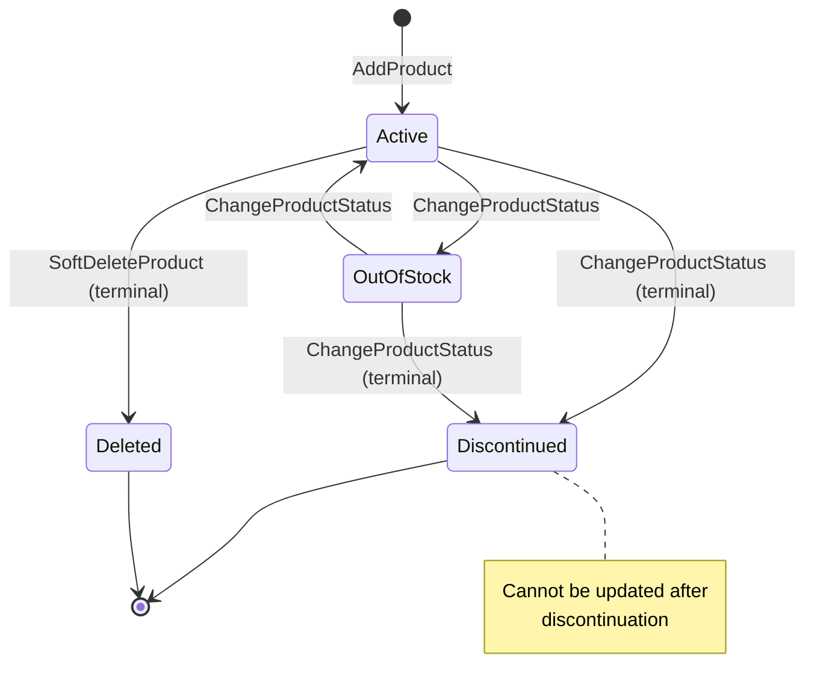
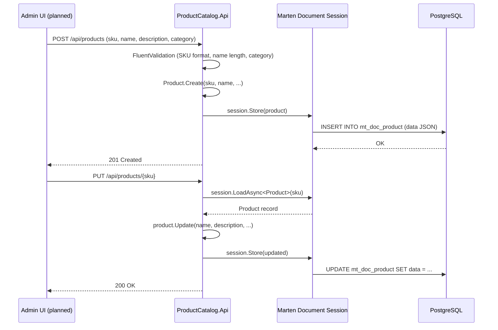
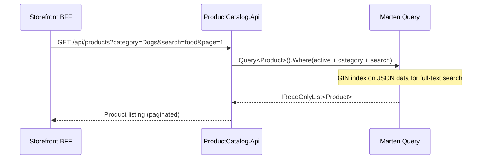

# Product Catalog — Product Master Data

> Owns the source of truth for all product information — SKUs, names, descriptions, images, categories, and status.

| Attribute | Value |
|-----------|-------|
| Pattern | Marten Document Store (not event sourced) |
| Database | Marten / PostgreSQL (JSON documents) |
| Messaging | None — no integration events published yet |
| Port (local) | **5133** |

## What This BC Does

Product Catalog stores products as flexible JSON documents — chosen over EF Core because product attributes vary widely by category, and schema flexibility matters more than relational integrity for catalog data. Products have a lifecycle (`Active` → `Discontinued`) and support soft deletion. Currently the catalog is a standalone read/write store; future cycles will wire up integration events so Inventory and Shopping can react to product changes. Seed data is available for development.

## Key Concepts

| Concept | Type | Description |
|---------|------|-------------|
| `Product` | Marten document | The full product record; `Id` = SKU string |
| `Sku` | Value object | Format: `[A-Z0-9-]{3,20}` — document primary key |
| `ProductName` | Value object | 1–200 chars, immutable after set |
| `ProductStatus` | Enum | `Active`, `OutOfStock`, `Discontinued` |
| `ProductImage` | Value object | URL + alt text |
| `ProductDimensions` | Value object | Weight, length, width, height (nullable) |
| `IsDeleted` | `bool` | Soft delete flag — deleted products excluded from all queries |

## Workflows

### Product Lifecycle



### CRUD Flow (Admin → Catalog)



### Query Pattern (Storefront BFF → Catalog)



## Commands & Events

### Commands

| Command | Endpoint | Validation |
|---------|----------|------------|
| `AddProduct` | `POST /api/products` | SKU unique, valid format; name 1–200 chars; non-empty category |
| `GetProduct` | `GET /api/products/{sku}` | — |
| `UpdateProduct` | `PUT /api/products/{sku}` | Product exists and is not discontinued |
| `ChangeProductStatus` | `POST /api/products/{sku}/status/{status}` | Valid status transition |
| `ListProducts` | `GET /api/products` | — |
| `SoftDeleteProduct` | `DELETE /api/products/{sku}` | Not already deleted |

> Product Catalog uses Marten document store mutations — there are no domain events appended to streams. Changes are stored as updated JSON documents.

### Integration Events (Planned)

| Event | When | Subscribers |
|-------|------|-------------|
| `ProductCatalog.ProductAdded` | New product created | Inventory (initialize stock record) |
| `ProductCatalog.ProductUpdated` | Name/price/description changed | Shopping (price drift detection) |
| `ProductCatalog.ProductDiscontinued` | Status → Discontinued | Inventory, Shopping (remove from cart) |

> ⚠️ These events are defined in `Messages.Contracts` but are not yet published. RabbitMQ integration is planned.

## API Endpoints

| Method | Path | Description |
|--------|------|-------------|
| `POST` | `/api/products` | Add a new product |
| `GET` | `/api/products/{sku}` | Get product by SKU |
| `PUT` | `/api/products/{sku}` | Update product details |
| `POST` | `/api/products/{sku}/status/{status}` | Change product status |
| `GET` | `/api/products` | List products (filter: category, search; paginated) |
| `DELETE` | `/api/products/{sku}` | Soft-delete a product |

## Integration Map

```mermaid
flowchart LR
    BFF[Storefront BFF :5237] -->|GET /api/products| Cat[Product Catalog :5133]
    Shop[Shopping BC :5236] -->|GET /api/products/{sku}\nplanned| Cat
    Cat -->|ProductAdded / ProductUpdated\nProductDiscontinued\nplanned| RMQ[(RabbitMQ)]
    RMQ -->|planned| Inv[Inventory BC :5233]
    RMQ -->|planned| Shop
```

## Implementation Status

| Feature | Status |
|---------|--------|
| Product CRUD (add, get, update, delete) | ✅ Complete |
| Product status management | ✅ Complete |
| List with category filter + full-text search | ✅ Complete |
| Marten document store with GIN indexes | ✅ Complete |
| Soft delete | ✅ Complete |
| Value objects (`Sku`, `ProductName`) | ✅ Complete |
| Seed data for development | ✅ Complete |
| BDD tests (Reqnroll) — AddProduct feature | ✅ Complete |
| Integration tests | ✅ Complete |
| Image upload endpoint | ❌ URLs only — no upload |
| Category hierarchy (tree structure) | ❌ Simple string only |
| Product variants (size, color, flavor) | ❌ Not implemented |
| Integration events (ProductAdded, etc.) | ❌ Defined but not published |
| Admin UI | ❌ API-only |

## Gaps & Roadmap

| Gap | Impact | Planned Cycle |
|-----|--------|---------------|
| No integration events | Inventory doesn't know when products are discontinued | Cycle 20 |
| No image upload | Admin must host images externally | Cycle 20 |
| No category hierarchy | Cannot support drill-down navigation | Cycle 21 |
| Price not stored in catalog | Shopping BC has no authoritative price source | Architectural decision needed |
| No product variants | Separate SKUs required for each size/color | Cycle 22 |

## 📖 Detailed Documentation

→ [`docs/workflows/product-catalog-workflows.md`](../../../docs/workflows/product-catalog-workflows.md)
