# Product Catalog — Product Master Data

> Owns the source of truth for all product information — SKUs, names, descriptions, images, categories, and status.

| Attribute | Value |
|-----------|-------|
| Pattern | Marten Document Store (not event sourced) |
| Database | Marten / PostgreSQL (JSON documents) |
| Messaging | None — no integration events published yet |
| Port (local) | **5133** |

> **This document is a working artifact** for PO + UX collaboration. Open questions are tracked in the [`🤔 Open Questions`](#-open-questions-for-product-owner--ux) section.

> 🚨 **Architectural Decision Required:** Product Catalog currently does **not** publish price-change events to other BCs. This means Shopping BC cannot detect cart price drift, and Orders BC cannot validate prices at checkout. Before scaling to production, the team must decide: *Does Catalog own the authoritative price, and if so, how do Shopping/Orders subscribe to price changes?* See [Open Questions Q3](#-open-questions-for-product-owner--ux).

## What This BC Does

Product Catalog stores products as flexible JSON documents — chosen over EF Core because product attributes vary widely by category, and schema flexibility matters more than relational integrity for catalog data. Products have a lifecycle (`Active` → `Discontinued`) and support soft deletion. Currently the catalog is a standalone read/write store; future cycles will wire up integration events so Inventory and Shopping can react to product changes. Seed data is available for development.

## Key Concepts

| Concept | Type | Description |
|---------|------|-------------|
| `Product` | Marten document | The full product record; `Id` = SKU string |
| `Sku` | Value object | Format: `[A-Z0-9-]{3,20}` — document primary key |
| `ProductName` | Value object | 1–200 chars, immutable after set |
| `ProductStatus` | Enum | `Active`, `OutOfStock`, `Discontinued` |
| `ProductImage` | Value object | URL + alt text |
| `ProductDimensions` | Value object | Weight, length, width, height (nullable) |
| `IsDeleted` | `bool` | Soft delete flag — deleted products excluded from all queries |

## Workflows

### Product Lifecycle — Complete State Machine

```mermaid
stateDiagram-v2
    [*] --> Active : AddProduct ✅

    Active --> Active : UpdateProduct (name, description, price, images) ✅
    Active --> Active : ChangeProductStatus → OutOfStock ✅
    Active --> Active : ChangeProductStatus ← OutOfStock (reactivated) ✅
    Active --> OutOfStock : ChangeProductStatus (low stock — from Inventory) ⚠️ no integration today
    OutOfStock --> Active : ChangeProductStatus (restocked)
    Active --> Discontinued : ChangeProductStatus → Discontinued ⚠️ terminal

    Active --> SoftDeleted : SoftDeleteProduct ⚠️ terminal
    OutOfStock --> Discontinued : ChangeProductStatus → Discontinued ⚠️ terminal
    OutOfStock --> SoftDeleted : SoftDeleteProduct ⚠️ terminal

    Discontinued --> [*] : Cannot update after discontinuation
    SoftDeleted --> [*] : Excluded from all queries

    note right of Active
        ⚠️ No integration today between
        Inventory BC and Catalog BC.
        OutOfStock status is set manually by admin
        — not automatically triggered by Inventory.
    end note
    note right of Discontinued
        ⚠️ When discontinued: who notifies
        Shopping BC to warn customers with
        this item in their cart?
        Today: nobody. Cart shows discontinued item.
    end note
    note right of SoftDeleted
        Product document is retained in DB.
        IsDeleted = true excludes from queries.
        SKU cannot be reused (unique constraint).
    end note
```



### CRUD Flow (Admin → Catalog)


### Query Pattern (Storefront BFF → Catalog)


## Commands & Events

### Commands

| Command | Endpoint | Validation |
|---------|----------|------------|
| `AddProduct` | `POST /api/products` | SKU unique, valid format; name 1–200 chars; non-empty category |
| `GetProduct` | `GET /api/products/{sku}` | — |
| `UpdateProduct` | `PUT /api/products/{sku}` | Product exists and is not discontinued |
| `ChangeProductStatus` | `POST /api/products/{sku}/status/{status}` | Valid status transition |
| `ListProducts` | `GET /api/products` | — |
| `SoftDeleteProduct` | `DELETE /api/products/{sku}` | Not already deleted |

> Product Catalog uses Marten document store mutations — there are no domain events appended to streams. Changes are stored as updated JSON documents.

### Integration Events

#### Published

| Event | When | Subscribers |
|-------|------|-------------|
| `ProductCatalog.ProductAdded` | New product created | Inventory (initialize stock record) |
| `ProductCatalog.ProductUpdated` | Name/price/description changed | Shopping (price drift detection) |
| `ProductCatalog.ProductDiscontinued` | Status → Discontinued | Inventory, Shopping (remove from cart) |

> ⚠️ These events are defined in `Messages.Contracts` but are not yet published. RabbitMQ integration is planned.

## API Endpoints

| Method | Path | Description |
|--------|------|-------------|
| `POST` | `/api/products` | Add a new product |
| `GET` | `/api/products/{sku}` | Get product by SKU |
| `PUT` | `/api/products/{sku}` | Update product details |
| `POST` | `/api/products/{sku}/status/{status}` | Change product status |
| `GET` | `/api/products` | List products (filter: category, search; paginated) |
| `DELETE` | `/api/products/{sku}` | Soft-delete a product |

## Integration Map

```mermaid
flowchart LR
    BFF[Storefront BFF :5237] -->|GET /api/products| Cat[Product Catalog :5133]
    Shop[Shopping BC :5236] -->|GET /api/products/{sku}\nplanned| Cat
    Cat -->|ProductAdded / ProductUpdated\nProductDiscontinued\nplanned| RMQ[(RabbitMQ)]
    RMQ -->|planned| Inv[Inventory BC :5233]
    RMQ -->|planned| Shop
```

## Implementation Status

| Feature | Status |
|---------|--------|
| Product CRUD (add, get, update, delete) | ✅ Complete |
| Product status management | ✅ Complete |
| List with category filter + full-text search | ✅ Complete |
| Marten document store with GIN indexes | ✅ Complete |
| Soft delete | ✅ Complete |
| Value objects (`Sku`, `ProductName`) | ✅ Complete |
| Seed data for development | ✅ Complete |
| BDD tests (Reqnroll) — AddProduct feature | ✅ Complete |
| Integration tests | ✅ Complete |
| Image upload endpoint | ❌ URLs only — no upload |
| Category hierarchy (tree structure) | ❌ Simple string only |
| Product variants (size, color, flavor) | ❌ Not implemented |
| Integration events (ProductAdded, etc.) | ❌ Defined but not published |
| Admin UI | ❌ API-only |

## Compensation Concepts (Document Store — Not Event Sourced)

> Product Catalog uses Marten as a **document store** (not event sourcing). Product records are JSON documents that are overwritten on each update — there is no built-in event history. However, several **system-level compensation concepts** are critical for the PO to understand:

| Scenario | How It Works Today | What Should Happen |
|----------|-------------------|-------------------|
| Product discontinued while in active carts | Document updated to `Discontinued`. Shopping BC has no idea. | `ProductDiscontinued` integration event published → Shopping BC warns customers or removes from cart |
| Price changes while item in carts | Document price updated. Shopping BC has stale price locked at add-time. | `ProductPriceChanged` integration event → Shopping BC detects drift |
| Product soft-deleted | `IsDeleted = true`. Shopping BC carts still reference the SKU. | `ProductDeleted` integration event → Shopping BC warns |
| Duplicate SKU attempted | FluentValidation rejects. SKU unique constraint enforced. | ✅ Already handled correctly |

> **Why no event sourcing for Catalog?** Product attributes change frequently (descriptions, images, price) and catalog data is fundamentally document-oriented. The tradeoff is no built-in audit history. If "show product edit history" becomes a requirement, we'd need to add change tracking manually (e.g., a `ProductChangeLog` document) or migrate to event sourcing.

## Off-Path Scenarios

### Scenario 1: Product Discontinued With Active Carts

```mermaid
sequenceDiagram
    participant Admin as Admin UI
    participant Cat as Product Catalog BC
    participant Shop as Shopping BC
    participant Customer as Customer Browser

    Note over Shop: 47 customers have "FancyFish Premium Flakes" in their cart
    Admin->>Cat: POST /api/products/FISH-FANCY-PREMIUM/status/Discontinued
    Cat->>Cat: Update product document: Status = Discontinued
    Cat-->>Admin: 200 OK

    Note over Cat: ⚠️ ProductDiscontinued integration event NOT published
    Note over Shop: 47 carts still have the item at old price
    Note over Customer: Customer returns to cart next day
    Customer->>Shop: GET /api/carts/{id}
    Note over Shop: Cart shows discontinued item normally — no warning
    Customer->>Shop: POST /api/carts/{id}/checkout
    Note over Shop: CheckoutInitiated published with discontinued SKU
    Note over Orders: Orders saga tries to reserve stock
    Note over Inv: ❌ Inventory returns ReservationFailed (product discontinued / no stock)
    Note over Customer: ❌ Customer's checkout fails with generic error
    Note over Customer: "We couldn't process your order" — no mention of discontinued item
```



**Current behavior:** Discontinuing a product has no downstream effect. Customers with the item in their cart discover the problem only when checkout fails.

### Scenario 2: Price Change — Cart Price Drift

```mermaid
sequenceDiagram
    participant Admin as Admin UI
    participant Cat as Product Catalog BC
    participant Shop as Shopping BC
    participant Customer as Customer Browser

    Note over Customer: Customer added "Royal Canin Puppy 4kg" at $45.99 on Monday
    Admin->>Cat: PUT /api/products/RC-PUPPY-4KG {price: 52.99} (price increase)
    Cat->>Cat: Update product document: Price = 52.99
    Cat-->>Admin: 200 OK

    Note over Cat: ⚠️ ProductPriceChanged integration event NOT published
    Note over Shop: Cart still shows $45.99 (locked at add-time)
    Note over Customer: Customer returns Thursday, sees $45.99 ✅ (but wrong!)

    Customer->>Shop: POST /api/carts/{id}/checkout
    Note over Shop: CheckoutInitiated with unitPrice: 45.99
    Note over Orders: Order created for $45.99
    Note over Orders: ⚠️ Business takes $7/unit revenue loss with no warning
    Note over Orders: OR future: payment captured at wrong price
```



**Current behavior:** Price changes are silent. No event published. Shopping BC cart prices are locked at add-time and never refreshed. Business may systematically under-charge after price increases.

### Scenario 3: Bulk Import With Validation Errors

```mermaid
sequenceDiagram
    participant Admin as Admin UI
    participant Cat as Product Catalog BC
    participant Marten as Marten Document Store

    Admin->>Cat: POST /api/products/bulk [{sku: "DOG-TOY-1",...}, {sku: "DOG-TOY-2",...}, {sku: "INVALID SKU!",...}]
    Note over Cat: ⚠️ Bulk import endpoint does NOT exist today
    Note over Cat: Each product must be POSTed individually

    Note over Admin: Workaround: script calling POST /api/products 500 times
    Admin->>Cat: POST /api/products {sku: "DOG-TOY-1"} ✅
    Admin->>Cat: POST /api/products {sku: "DOG-TOY-1"} ← DUPLICATE ❌
    Cat-->>Admin: 422 — SKU already exists
    Note over Admin: Which products succeeded? Which failed? No batch report.
```



**Current behavior:** No bulk import endpoint. Individual POSTs required. No transactional batch — partial imports possible.

### Scenario 4: Inventory BC Goes Out of Stock — Catalog Not Updated

```mermaid
sequenceDiagram
    participant Orders as Orders BC
    participant Inv as Inventory BC
    participant Cat as Product Catalog BC
    participant Customer as Customer Browser

    Note over Inv: Last unit of "Hamster Wheel Deluxe" just sold
    Inv->>Inv: Append ReservationCommitted — AvailableQty = 0
    Note over Inv: ⚠️ No integration event to Catalog BC
    Note over Cat: Product document still shows Status = Active (not OutOfStock)

    Customer->>Cat: GET /api/products?category=Hamsters
    Cat-->>Customer: "Hamster Wheel Deluxe" — Status: Active, no stock warning
    Customer->>Shop: Add to cart (no inventory check — Cart BC doesn't validate)
    Customer->>Shop: Checkout
    Note over Inv: ReservationFailed — AvailableQty = 0
    Note over Customer: ❌ Checkout fails after cart + payment info entered
```



**Current behavior:** Inventory BC and Product Catalog BC have no integration. The catalog never learns about stock levels. "Out of Stock" display status must be set manually by an admin.

## 🤔 Open Questions for Product Owner & UX

---

**Q1: When a product is discontinued, how quickly should customers with it in their cart be notified?**
- **Option A: Immediate — on discontinuation** — Publish `ProductDiscontinued` → Shopping BC removes item from active carts → SSE notification to connected customers.  
  *Engineering: High — Shopping BC must subscribe to Catalog events + handle cart item removal*
- **Option B: At checkout** — Show clear error at checkout: "Item 'X' is no longer available and has been removed from your cart."  
  *Engineering: Medium — checkout validation against Catalog BC + clear error message*
- **Option C: Passive — cart shows item, checkout fails (current)** — Generic error at checkout.  
  *Engineering: Zero*
- **Current behavior:** Option C — generic checkout failure.
- **Business risk if unresolved:** Customer frustration when checkout fails with unclear error. Conversion drop. Worse UX than showing "sorry, this item is discontinued" proactively.

---

**Q2: When prices change in the catalog, should shopping cart prices auto-update or stay locked?**
- **Option A: Auto-update** — Cart always fetches live catalog price at checkout. Item added at $45.99 charges $52.99 if price changed.  
  *Engineering: Medium — checkout reads live catalog price*
- **Option B: Lock and warn** — Price locked at add-time. Show banner: "Price changed since you added this. New price: $52.99." Customer re-confirms.  
  *Engineering: Medium — price drift detection via catalog comparison at cart view*
- **Option C: Lock silently (current)** — Price never changes. No warning.  
  *Engineering: Zero*
- **Current behavior:** Option C — price locked at add-time.
- **Business risk if unresolved:** Price increases cause revenue loss (customer pays old price). Price decreases cause customer distrust (why did I pay more?). Industry standard is to show updated price with notification.

---

**Q3: Who assigns SKUs, what is the format, and can they be recycled?**
- **Option A: Vendor SKU passthrough** — Use vendor/supplier SKU codes as-is. Fast setup, but inconsistent format across suppliers.  
  *Engineering: Low — validation regex relaxed*
- **Option B: Internal SKU format** — `[CATEGORY-ABBR]-[PRODUCT-ABBR]-[SIZE/VARIANT]` (e.g., `DOG-FOOD-5KG`). Consistent, requires admin to assign.  
  *Engineering: Low — regex validation + admin convention*
- **Option C: Auto-generated** — System assigns sequential or UUID-based SKU. Admin provides friendly name only.  
  *Engineering: Low-Medium — SKU generation logic*
- **Current behavior:** Format `[A-Z0-9-]{3,20}` validated. Human-assigned. No auto-generation.
- **Business risk if unresolved:** SKU format inconsistency makes catalog hard to manage at scale. Vendor SKUs may collide with internal ones.

---

**Q4: Where should product price "live" — in the Catalog document or a separate Pricing BC?**
- **Option A: Embed in Catalog document (current direction)** — Simple, one source of truth per product. Suitable for basic pricing.  
  *Engineering: Zero — already natural with document model*
- **Option B: Separate Pricing BC** — Complex pricing rules: customer tiers, promotional prices, time-limited sales. More flexible but much more complex.  
  *Engineering: Very High — new BC, pricing engine, cart integration*
- **Option C: Pricing field in Catalog + promotional override in future** — Start simple, add promotional pricing later as override layer.  
  *Engineering: Low now, Medium later*
- **Current behavior:** Price is client-provided when adding to cart (Shopping BC). Catalog doesn't yet store price. **This is a critical gap and architectural decision.**
- **Business risk if unresolved:** Currently Shopping BC accepts any client-provided price — price manipulation is trivially possible. Catalog must become the authoritative price source before launch.

## Gaps & Roadmap

| Gap | Impact | Planned Cycle |
|-----|--------|---------------|
| No integration events | Inventory doesn't know when products are discontinued | Cycle 20 |
| No image upload | Admin must host images externally | Cycle 20 |
| No category hierarchy | Cannot support drill-down navigation | Cycle 21 |
| Price not stored in catalog | Shopping BC has no authoritative price source — **decision needed:** embed price directly in the `Product` document (simple, denormalized) or introduce a separate Pricing BC (normalized, added latency). Both `Messages.Contracts.ProductCatalog` contracts and Shopping's `UnitPrice` field are affected. | Architectural decision needed |
| No product variants | Separate SKUs required for each size/color | Cycle 22 |

## 📖 Detailed Documentation

→ [`docs/workflows/product-catalog-workflows.md`](../../../docs/workflows/product-catalog-workflows.md)
