# Shopping — Cart Lifecycle & Checkout Handoff

> Manages the customer's pre-purchase experience, from cart initialization through checkout handoff to the Orders BC.

| Attribute | Value |
|-----------|-------|
| Pattern | Event Sourcing (Marten) |
| Database | Marten / PostgreSQL (event store) |
| Messaging | Publishes `ItemAdded`, `ItemRemoved`, `ItemQuantityChanged` → `storefront-notifications` queue |
| Port (local) | **5236** |

## What This BC Does

Shopping owns the full cart lifecycle: a customer starts a session, adds/removes products, adjusts quantities, and eventually initiates checkout. When checkout begins, the cart is sealed (a terminal `CheckoutInitiated` event is appended) and a snapshot of the cart's contents is handed to the Orders BC for the rest of the purchase flow. Shopping does not handle payments, shipping, or order tracking.

## Key Concepts

| Concept | Type | Description |
|---------|------|-------------|
| `Cart` | Event-sourced aggregate | Customer's shopping session; stream keyed by `CartId` |
| `Checkout` | Event-sourced aggregate | Multi-step checkout wizard (lives in Shopping domain, owned by Orders) |
| `CartLineItem` | Value object | `{ Sku, Quantity, UnitPrice }` — price captured at add-time |
| `CartStatus` | Enum | `Active` → `CheckedOut` / `Cleared` / `Abandoned` |

## Workflows

### Cart Lifecycle

> **Two distinct concepts:** A `CartCleared` domain event (appended by `ClearCart`) sets the cart to the terminal `Cleared` state. This is different from removing individual items mid-session (which fires `ItemRemoved` and keeps the cart `Active`).

### Add Item → Real-Time Cart Update

```mermaid
sequenceDiagram
    participant BFF as Storefront BFF
    participant Shop as Shopping BC
    participant RabbitMQ
    participant CE as Customer Experience

    BFF->>Shop: POST /api/carts/{id}/items
    Shop->>Shop: Apply ItemAdded event (Cart aggregate)
    Shop->>RabbitMQ: Publish ItemAdded → storefront-notifications
    Shop-->>BFF: 200 OK
    RabbitMQ->>CE: ItemAdded
    CE->>CE: Broadcast CartUpdated via SSE → browser
```

### Checkout Handoff

## Commands & Events

### Commands

| Command | Handler | Purpose |
|---------|---------|---------|
| `InitializeCart` | `InitializeCartHandler` | Create new cart for customer/session |
| `AddItemToCart` | `AddItemToCartHandler` | Add SKU + quantity; merges if SKU exists |
| `RemoveItemFromCart` | `RemoveItemFromCartHandler` | Remove SKU line item entirely |
| `ChangeItemQuantity` | `ChangeItemQuantityHandler` | Update quantity for existing SKU |
| `ClearCart` | `ClearCartHandler` | Remove all items (cart transitions to Cleared) |
| `InitiateCheckout` | `InitiateCheckoutHandler` | Seal cart and hand off to Orders BC |

### Domain Events (Cart Stream)

| Event | Description |
|-------|-------------|
| `CartInitialized` | Cart stream created |
| `ItemAdded` | Product added (or quantity merged) |
| `ItemRemoved` | Product removed |
| `ItemQuantityChanged` | Quantity updated for existing line item |
| `CartCleared` | All items removed |
| `CartAbandoned` | Cart expired — *not yet implemented* |
| `CheckoutInitiated` | Cart sealed; terminal state |

### Integration Events Published

| Event | Queue | Subscriber | Purpose |
|-------|-------|------------|---------|
| `Messages.Contracts.Shopping.ItemAdded` | `storefront-notifications` | Customer Experience | Real-time cart badge update |
| `Messages.Contracts.Shopping.ItemRemoved` | `storefront-notifications` | Customer Experience | Real-time cart badge update |
| `Messages.Contracts.Shopping.ItemQuantityChanged` | `storefront-notifications` | Customer Experience | Real-time cart badge update |
| `Messages.Contracts.Shopping.CheckoutInitiated` | Local Wolverine queue ⚠️ | Orders BC | Cart snapshot handoff |

> ⚠️ `CheckoutInitiated` uses a local Wolverine queue (not RabbitMQ) — messages will be lost on server restart. Migration to RabbitMQ is planned.

## API Endpoints

| Method | Path | Description |
|--------|------|-------------|
| `POST` | `/api/carts` | Initialize a new cart |
| `POST` | `/api/carts/{id}/items` | Add item to cart |
| `DELETE` | `/api/carts/{id}/items/{sku}` | Remove item from cart |
| `PATCH` | `/api/carts/{id}/items/{sku}` | Change item quantity |
| `DELETE` | `/api/carts/{id}` | Clear cart |
| `POST` | `/api/carts/{id}/checkout` | Initiate checkout (seals cart) |
| `GET` | `/api/carts/{id}` | Get current cart state |

## Integration Map

## Implementation Status

| Feature | Status |
|---------|--------|
| Cart initialization | ✅ Complete |
| Add / remove / change quantity | ✅ Complete |
| Clear cart | ✅ Complete |
| Initiate checkout (handoff) | ✅ Complete |
| RabbitMQ publishing (3 events) | ✅ Complete |
| FluentValidation on all commands | ✅ Complete |
| Integration tests (13 passing) | ✅ Complete |
| SKU validation against Product Catalog | ❌ Not implemented |
| Inventory availability check | ❌ Not implemented |
| Price fetching from catalog (client-provided) | ❌ Not implemented |
| Cart abandonment / TTL expiry | ❌ Not implemented |
| `CheckoutInitiated` → RabbitMQ (durable) | ❌ Not implemented |

## Gaps & Roadmap

| Gap | Impact | Planned Cycle |
|-----|--------|---------------|
| No SKU validation — invalid SKUs can be added | Checkout fails downstream | Cycle 19 |
| Price is client-provided — security risk | Price manipulation possible | Cycle 19 |
| No inventory check at add-time | Out-of-stock items silently added | Cycle 19 |
| `CheckoutInitiated` on local queue (not durable) | Message lost on restart | Cycle 19 |
| No cart abandonment / TTL | Orphaned cart streams accumulate | Cycle 20 |
| No price drift detection | Customer surprised at checkout | Cycle 20 |

## 📖 Detailed Documentation

→ [`docs/workflows/shopping-workflows.md`](../../../docs/workflows/shopping-workflows.md)
