# Shopping — Cart Lifecycle & Checkout Handoff

> Manages the customer's pre-purchase experience, from cart initialization through checkout handoff to the Orders BC.

| Attribute | Value |
|-----------|-------|
| Pattern | Event Sourcing (Marten) |
| Database | Marten / PostgreSQL (event store) |
| Messaging | Publishes `ItemAdded`, `ItemRemoved`, `ItemQuantityChanged` → `storefront-notifications` queue |
| Port (local) | **5236** |

> **This document is a working artifact** for PO + UX collaboration. Open questions are tracked in the [`🤔 Open Questions`](#-open-questions-for-product-owner--ux) section.

## What This BC Does

Shopping owns the full cart lifecycle: a customer starts a session, adds/removes products, adjusts quantities, and eventually initiates checkout. When checkout begins, the cart is sealed (a terminal `CheckoutInitiated` event is appended) and a snapshot of the cart's contents is handed to the Orders BC for the rest of the purchase flow. Shopping does not handle payments, shipping, or order tracking.

## Key Concepts

| Concept | Type | Description |
|---------|------|-------------|
| `Cart` | Event-sourced aggregate | Customer's shopping session; stream keyed by `CartId` |
| `Checkout` | Event-sourced aggregate | Multi-step checkout wizard (lives in Shopping domain, owned by Orders) |
| `CartLineItem` | Value object | `{ Sku, Quantity, UnitPrice }` — price captured at add-time |
| `CartStatus` | Enum | `Active` → `CheckedOut` / `Cleared` / `Abandoned` |

## Workflows

### Cart Lifecycle — Complete State Machine

```mermaid
stateDiagram-v2
    [*] --> Active : CartInitialized

    Active --> Active : ItemAdded
    Active --> Active : ItemRemoved
    Active --> Active : ItemQuantityChanged

    Active --> CheckedOut : CheckoutInitiated ✅ terminal
    Active --> Cleared : CartCleared ✅ terminal
    Active --> Abandoned : CartAbandoned ⚠️ not yet implemented

    CheckedOut --> [*] : happy path — Orders saga begins
    Cleared --> [*] : customer emptied cart
    Abandoned --> [*] : TTL expired — compensation event appended

    note right of Active
        ⚠️ No out-of-stock guard today.
        No price drift detection.
        Duplicate SKU merges quantity.
    end note
    note right of CheckedOut
        ⚠️ If Orders BC is down, handoff
        is lost (local queue, not durable).
    end note
    note right of Abandoned
        CartAbandoned is a compensation event
        — NOT a delete. The stream still exists
        with a terminal event appended.
    end note
```

> **Two distinct concepts:** A `CartCleared` domain event (appended by `ClearCart`) sets the cart to the terminal `Cleared` state. This is different from removing individual items mid-session (which fires `ItemRemoved` and keeps the cart `Active`).

### Add Item → Real-Time Cart Update

```mermaid
sequenceDiagram
    participant BFF as Storefront BFF
    participant Shop as Shopping BC
    participant RabbitMQ
    participant CE as Customer Experience

    BFF->>Shop: POST /api/carts/{id}/items
    Shop->>Shop: Apply ItemAdded event (Cart aggregate)
    Shop->>RabbitMQ: Publish ItemAdded → storefront-notifications
    Shop-->>BFF: 200 OK
    RabbitMQ->>CE: ItemAdded
    CE->>CE: Broadcast CartUpdated via SSE → browser
```

### Checkout Handoff

## Commands & Events

### Commands

| Command | Handler | Purpose |
|---------|---------|---------|
| `InitializeCart` | `InitializeCartHandler` | Create new cart for customer/session |
| `AddItemToCart` | `AddItemToCartHandler` | Add SKU + quantity; merges if SKU exists |
| `RemoveItemFromCart` | `RemoveItemFromCartHandler` | Remove SKU line item entirely |
| `ChangeItemQuantity` | `ChangeItemQuantityHandler` | Update quantity for existing SKU |
| `ClearCart` | `ClearCartHandler` | Remove all items (cart transitions to Cleared) |
| `InitiateCheckout` | `InitiateCheckoutHandler` | Seal cart and hand off to Orders BC |

### Domain Events

| Event | Description |
|-------|-------------|
| `CartInitialized` | Cart stream created |
| `ItemAdded` | Product added (or quantity merged) |
| `ItemRemoved` | Product removed |
| `ItemQuantityChanged` | Quantity updated for existing line item |
| `CartCleared` | All items removed |
| `CartAbandoned` | Cart expired — *not yet implemented* |
| `CheckoutInitiated` | Cart sealed; terminal state |

### Integration Events

#### Published

| Event | Queue | Subscriber | Purpose |
|-------|-------|------------|---------|
| `Messages.Contracts.Shopping.ItemAdded` | `storefront-notifications` | Customer Experience | Real-time cart badge update |
| `Messages.Contracts.Shopping.ItemRemoved` | `storefront-notifications` | Customer Experience | Real-time cart badge update |
| `Messages.Contracts.Shopping.ItemQuantityChanged` | `storefront-notifications` | Customer Experience | Real-time cart badge update |
| `Messages.Contracts.Shopping.CheckoutInitiated` | Local Wolverine queue ⚠️ | Orders BC | Cart snapshot handoff |

> ⚠️ `CheckoutInitiated` uses a local Wolverine queue (not RabbitMQ) — messages will be lost on server restart. Migration to RabbitMQ is planned.

## API Endpoints

| Method | Path | Description |
|--------|------|-------------|
| `POST` | `/api/carts` | Initialize a new cart |
| `POST` | `/api/carts/{id}/items` | Add item to cart |
| `DELETE` | `/api/carts/{id}/items/{sku}` | Remove item from cart |
| `PATCH` | `/api/carts/{id}/items/{sku}` | Change item quantity |
| `DELETE` | `/api/carts/{id}` | Clear cart |
| `POST` | `/api/carts/{id}/checkout` | Initiate checkout (seals cart) |
| `GET` | `/api/carts/{id}` | Get current cart state |

## Integration Map

## Implementation Status

| Feature | Status |
|---------|--------|
| Cart initialization | ✅ Complete |
| Add / remove / change quantity | ✅ Complete |
| Clear cart | ✅ Complete |
| Initiate checkout (handoff) | ✅ Complete |
| RabbitMQ publishing (3 events) | ✅ Complete |
| FluentValidation on all commands | ✅ Complete |
| Integration tests (13 passing) | ✅ Complete |
| SKU validation against Product Catalog | ❌ Not implemented |
| Inventory availability check | ❌ Not implemented |
| Price fetching from catalog (client-provided) | ❌ Not implemented |
| Cart abandonment / TTL expiry | ❌ Not implemented |
| `CheckoutInitiated` → RabbitMQ (durable) | ❌ Not implemented |

## Compensation Event Registry

Compensation events are **first-class domain events appended to the event store** — not side effects or database deletes. The cart stream is immutable; compensation records new facts.

| Compensation Event | Recorded In | Triggered By | What It Restores |
|-------------------|-------------|-------------|-----------------|
| `CartAbandoned` | Cart event stream (`CartId`) | TTL timer / background job ⚠️ not yet implemented | Releases "ghost" cart; allows stock re-evaluation |
| `CartCleared` | Cart event stream (`CartId`) | Explicit `ClearCart` command | Customer intent to start over |
| `CheckoutInitiated` | Cart event stream (`CartId`) | Successful handoff to Orders | Seals cart — no further mutations possible |

> **Why not delete?** The event store is an **immutable audit log**. If a cart was abandoned, we record `CartAbandoned` — the stream still exists and you can replay it. This means support teams can see what items a customer abandoned (for re-engagement emails or fraud analysis), without any special audit infrastructure.

## Off-Path Scenarios

### Scenario 1: Out-of-Stock Item Added to Cart

```mermaid
sequenceDiagram
    participant Customer as Customer Browser
    participant BFF as Storefront BFF
    participant Shop as Shopping BC
    participant Inv as Inventory BC (planned)

    Customer->>BFF: Add "Kibble Pro 5kg" to cart
    BFF->>Shop: POST /api/carts/{id}/items {sku: "KIB-PRO-5KG", qty: 1}
    Note over Shop: ⚠️ TODAY: No inventory check.<br/>ItemAdded appended unconditionally.
    Shop-->>BFF: 200 OK (item appears in cart)
    Note over Customer: Customer sees item in cart ✅
    Customer->>BFF: Proceed to checkout
    Note over BFF,Inv: ❌ Failure discovered only when Orders BC<br/>tries to reserve stock — too late!
    Inv-->>BFF: ReservationFailed
    Note over Customer: Customer gets error AFTER entering payment — bad UX
```

**Current behavior:** No guard at add-time. Out-of-stock items silently appear in cart and fail at reservation during order placement.

### Scenario 2: Price Drift — Item Sits in Cart for 3 Days

**Current behavior:** Price is captured at add-time and never refreshed. Cart can drift from catalog by any amount indefinitely.

### Scenario 3: Checkout Handoff Failure (Orders BC Down)

```mermaid
sequenceDiagram
    participant BFF as Storefront BFF
    participant Shop as Shopping BC
    participant Orders as Orders BC

    BFF->>Shop: POST /api/carts/{id}/checkout
    Shop->>Shop: Append CheckoutInitiated (cart is now sealed ✅)
    Shop->>Orders: Publish CheckoutInitiated (local Wolverine queue ⚠️)
    Note over Orders: ❌ Orders BC is restarting / crashed
    Note over Shop: Message sits in local in-memory queue
    Note over BFF: Shop returns 200 OK — customer sees "Checkout started!"
    Orders->>Orders: Restart — in-memory queue is GONE
    Note over Orders: ❌ CheckoutInitiated message lost forever
    Note over BFF: Cart is sealed (CheckedOut state). Cannot be re-opened.
    Note over Customer: ❌ Stuck: cart sealed, but no Order created.<br/>Customer must call support.
```

**Current behavior:** `CheckoutInitiated` is published to a local Wolverine queue (not durable RabbitMQ). On restart, the message is lost. The cart stream has `CheckoutInitiated` appended (terminal), but Orders never received the signal.

### Scenario 4: Duplicate SKU Add

**Current behavior:** Duplicate SKU adds merge quantity at the aggregate level. The event stream shows two `ItemAdded` events rather than one `ItemAdded` + `ItemQuantityChanged`. This is a minor modeling question but affects event replay fidelity.

## 🤔 Open Questions for Product Owner & UX

---

**Q1: When should out-of-stock items be blocked vs warned at add-time?**
- **Option A: Hard block** — `AddItemToCart` calls Inventory BC; returns 400 if insufficient stock. Cart never shows items that can't be fulfilled.  
  *Engineering: Medium — adds synchronous cross-BC dependency; Inventory must expose availability query*
- **Option B: Soft warn** — Item is added, but a warning badge appears ("Only 2 left!"). Checkout blocked if still out-of-stock.  
  *Engineering: Medium — Inventory query + UI warning state needed*
- **Option C: Silent add (current)** — Failure discovered at reservation during order placement.  
  *Engineering: Zero — already implemented*
- **Current behavior:** Option C — customer discovers OOS at order confirmation, not at add-time.
- **Business risk if unresolved:** Customer rage-abandonment when cart fails at checkout after they've entered payment details. Amazon shows stock level at add-time.

---

**Q2: What is the cart abandonment TTL, and what should happen at expiry?**
- **Option A: 30 min anonymous, 30 days authenticated** — Industry standard. `CartAbandoned` event appended by background job.  
  *Engineering: Medium — requires Wolverine scheduled message or Marten projections with TTL*
- **Option B: Never expire** — Infinite cart persistence. Stream accumulates indefinitely.  
  *Engineering: Zero — already the case*
- **Option C: 24 hours for all** — Simple uniform policy.  
  *Engineering: Low — single TTL configuration*
- **Current behavior:** Option B — carts never expire. Event streams accumulate.
- **Business risk if unresolved:** (1) PostgreSQL storage bloat from millions of orphaned cart streams. (2) No data for re-engagement email campaigns ("You left something in your cart!").

---

**Q3: If catalog prices change while an item is in a customer's cart, what should happen?**
- **Option A: Auto-update** — Cart reads live catalog price at checkout; customer pays current price. Show delta as warning.  
  *Engineering: Medium — checkout must fetch fresh prices from Catalog BC*
- **Option B: Lock price, warn customer** — Keep original price but show "Price changed since you added this" banner.  
  *Engineering: Medium — requires price-at-add comparison with current catalog price*
- **Option C: Lock price, no warning (current)** — Customer pays price captured at add-time. Silent.  
  *Engineering: Zero — already implemented*
- **Current behavior:** Option C — price locked at add-time. No drift detection.
- **Business risk if unresolved:** Either business takes revenue loss (price rose, customer pays old price) or customer dispute (price dropped, they feel cheated).

---

**Q4: Can a customer re-open a checked-out cart?**
- **Option A: No — ever (current)** — `CheckoutInitiated` is a terminal event. Cart stream is sealed.  
  *Engineering: Zero — already implemented*
- **Option B: Re-open within 5 minutes** — If Orders BC hasn't created an Order yet, allow cart re-activation.  
  *Engineering: High — requires saga coordination + new `CheckoutCancelled` compensation event*
- **Option C: Create a new cart from order contents** — "Start over" creates a fresh cart with same items.  
  *Engineering: Low — new endpoint, no event mutation required*
- **Current behavior:** Option A — sealed cart. Customer must start a new cart.
- **Business risk if unresolved:** If handoff to Orders fails (e.g., Orders BC down), customer is stuck with a sealed cart and no order. Currently a support escalation.

---

**Q5: Should anonymous carts convert to authenticated carts on login?**
- **Option A: Merge** — Items from anonymous cart merged into authenticated cart.  
  *Engineering: High — requires cart merge logic + conflict resolution (duplicate SKUs)*
- **Option B: Replace** — Authenticated cart wins; anonymous cart discarded.  
  *Engineering: Low — straightforward*
- **Option C: Ask customer** — UI prompts "You have items in your guest cart. Keep them?"  
  *Engineering: Medium — UI state + conditional merge*
- **Current behavior:** Not implemented — carts are associated by session ID only.
- **Business risk if unresolved:** Customer browses on mobile (anonymous), logs in on desktop — cart is empty. Conversion drop.

## Gaps & Roadmap

| Gap | Impact | Planned Cycle |
|-----|--------|---------------|
| No SKU validation — invalid SKUs can be added | Checkout fails downstream | Cycle 19 |
| Price is client-provided — security risk | Price manipulation possible | Cycle 19 |
| No inventory check at add-time | Out-of-stock items silently added | Cycle 19 |
| `CheckoutInitiated` on local queue (not durable) | Message lost on restart | Cycle 19 |
| No cart abandonment / TTL | Orphaned cart streams accumulate | Cycle 20 |
| No price drift detection | Customer surprised at checkout | Cycle 20 |

## 📖 Detailed Documentation

→ [`docs/workflows/shopping-workflows.md`](../../../docs/workflows/shopping-workflows.md)
